# Financial Data: Stylized Facts {#stylized-facts}

> "If it looks like a duck, swims like a duck, and quacks like a duck, then it probably is a duck."
>
> --- James Whitcomb Riley

\afterquotespace
\acknowledgementCUP

Different domains in science and engineering are deeply rooted on the specifics of the data. For instance, Sir Isaac Newton formulated the laws of motion and universal gravitation based on observations of the motion of planets and other objects on Earth. As another example, Claude Shannon -- the "father of information theory" and inventor of the concept of a "bit" as a measure of information -- developed a groundbreaking mathematical theory of communication based on probabilistic models of wireless and wireline transmission channels.

Likewise, the first step in any endeavor in finance or financial engineering should be to understand financial data. The study and characterization of financial data started flourishing as early as the 1960s [@Mandelbrot1963; @Fama1965] and it is now a mature topic in which academics and practitioners have exposed some particularities of the data commonly referred to as "stylized facts." This chapter takes us on a rather visual exploratory analysis of financial data based on empirical market data.

  This material has been published as:
  Daniel P. Palomar (2025). _Portfolio Optimization: Theory and Application_. Cambridge University Press.
  This version is free to view and download for personal use only; not for re-distribution, re-sale, or use in derivative works. ©\ Daniel P. Palomar 2025.

## Stylized Facts
\index{stylized facts}
_Stylized facts_ are properties common across many instruments, markets, and time periods that have been observed by independent studies [@Cont01; @McNeilFreyEmbrechts2015]. Some notable examples include:

- _Lack of stationarity_: The statistics of financial time series change over time (past returns do not necessarily reflect future performance).

- _Volatility clustering_: Large price changes tend to be followed by large price changes (ignoring the sign), whereas small price changes tend to be followed by small price changes [@Mandelbrot1963; @Fama1965].

- _Absence of autocorrelations_: Autocorrelations of returns are often insignificant [@DingGranger1996], which can be explained by the efficient-market hypothesis [@Fama1970].

- _Heavy tails_: Gaussian distributions generally do not hold in financial data; instead, distributions typically exhibit so-called heavy tails.

- _Gain/loss asymmetry_: The distribution of the returns is not symmetric.

- _Positive correlation of assets_: Returns are often positively correlated since assets typically move together with the market.

It is worth noting that different data frequency regimes may exhibit a variation of characteristics:

- _Low frequency (weekly, monthly, quarterly)_: Gaussian distributions may fit reasonably well after correcting for volatility clustering (except for the asymmetry), but the scarcity of data is a big issue in a statistical sense.

- _Medium frequency (daily)_: Heavy tails cannot be ignored (even after correcting for volatility clustering) and the amount of data may be acceptable for statistical significance provided the models do not contain too many parameters (or overfitting will be inevitable). 

- _High frequency (intraday, 30 min, 5 min, tick-data)_: Large amounts of data are available, which makes this regime more amenable to data analytics and machine learning techniques. Furthermore, as the frequency of the data increases, the influence of microstructure noise becomes more prominent, which requires alternative models.

## Prices and Returns {#prices-returns}
\index{returns}
The price of an asset is arguably the most obvious quantity one can observe in financial markets. We denote it by $p_{t}$, where $t$ is the discrete time index (a continuous time index can also be used) corresponding to arbitrary periods such as minutes, hours, days, weeks, months, quarters, or years.

When it comes to modeling, it turns out that the logarithm of the prices,
$$y_{t}\triangleq\textm{log}\; p_{t},$$
is mathematically more convenient. In addition, using the logarithm has the advantage that a much wider dynamic range of the signal can be naturally represented (i.e., tiny values are amplified and large values are attenuated). 

Some accessible textbooks that cover financial data modeling are @Meucci2005, @CowpertwaitMetcalfe2009, @Tsay2010, @RuppertMatteson2015, with more emphasis on the multi-asset case in @Lutkepohl2007 and @Tsay2013.

The simplest model for the log-prices is the _random walk_: 

\begin{equation} 
  y_{t} = \mu+y_{t-1} + \epsilon_{t},
  (\#eq:random-walk)
\end{equation}

where $\mu$ is the drift and $\epsilon_{t}$ is the i.i.d. random noise. Figure\ \@ref(fig:SP500-logprices) shows the daily prices of the stock index S&P 500[^SP500] over a span of more than a decade and Figure\ \@ref(fig:btc-logprices) shows the daily prices of Bitcoin[^BTC] over six years, both on a logarithmic scale (which is equivalent to plotting the log-prices on a linear scale).

[^SP500]: The Standard and Poor's 500, or simply the S&P 500, is a stock market index of 500 of the largest companies listed on stock exchanges in the United States. It is one of the most commonly followed equity indices.
[^BTC]: Bitcoin (BTC) is the first and most popular cryptocurrency. It was invented in 2008 by an unknown person or group of people using the name Satoshi Nakamoto. The currency began its use in 2009.

(\#fig:SP500-logprices)Price time series of S\&P 500.

(\#fig:btc-logprices)Price time series of Bitcoin.

Another key quantity is the price change, also called the return, which, unlike the absolute price, exhibits some degree of stationarity and may be more convenient for mathematical modeling. Among the different definitions of returns [@Tsay2010; @RuppertMatteson2015], we will focus on two types that have important additive properties along two different domains:

- The _linear return_ (a.k.a. simple or net return) is defined as $$r^{\textm{lin}}_t	\triangleq\frac{p_{t}-p_{t-1}}{p_{t-1}}=\frac{p_{t}}{p_{t-1}}-1$$ and has the property that it is additive among the assets (i.e., the overall linear return when investing in several assets equals the sum of the returns of the assets weighted according to the percentage of the budget invested in each). Thus, linear returns are key when dealing with the return of a portfolio of several assets (refer to Chapter\ \@ref(portfolio-101) for details).

- The _log-return_ (a.k.a. continuously compounded return) is defined as $$r^{\textm{log}}_t	\triangleq y_{t}-y_{t-1}=\log\left(\frac{p_{t}}{p_{t-1}}\right)$$ and has the property that it is additive along the time domain (i.e., the log-return of a long period equals the sum of the log-returns of the basic periods within the long period).
<!---from $t-2$ to $t$ equals $r^{\textm{log}}_{t-1} + r^{\textm{log}}_t$).--->
Thus, log-returns are preferred when it comes to mathematical modeling of time series (refer to Chapters\ \@ref(iid-modeling)--\@ref(time-series-modeling)). For example, according to the previous random walk model in \@ref(eq:random-walk), the log-return is stationary: $$r^{\textm{log}}_t=y_{t}-y_{t-1}=\mu+\epsilon_{t}.$$

Interestingly, the simple return and log-return are related as $$r^{\textm{log}}_t = \log\left(1+r^{\textm{lin}}_t\right),$$ which leads to the convenient approximation
$r^{\textm{log}}_t\approx r^{\textm{lin}}_t$, when $r^{\textm{lin}}_t$ is small, as illustrated in Figure\ \@ref(fig:logreturn-vs-linreturn). The approximation is almost perfect when the magnitude of the return is less than 0.05 or 5%, then it slowly degrades.

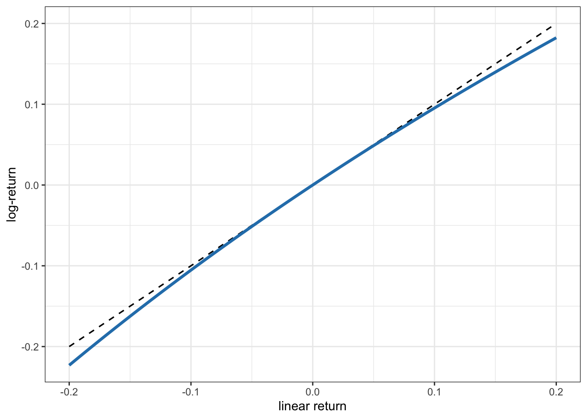

(\#fig:logreturn-vs-linreturn)Approximation of log-return vs. linear return.

Figure\ \@ref(fig:SP500-logreturns) shows the daily log-returns of the S&P 500 stock index over a span of more than a decade. One can easily observe the high-volatility period during the global financial crisis in 2008, as well as the high peak in volatility in early 2020 due to the COVID-19 pandemic. Figure\ \@ref(fig:btc-logreturns) shows the daily log-returns of Bitcoin over six years. Observe the Bitcoin flash crash on March 12, 2020, with a drop close to 50% in a single day.[^flash-crash] 

[^flash-crash]: The flash crash of March 12, 2020, was triggered by COVID-19, since, just one day earlier, the World Health Organization had announced that "COVID-19 can be characterized as a pandemic."

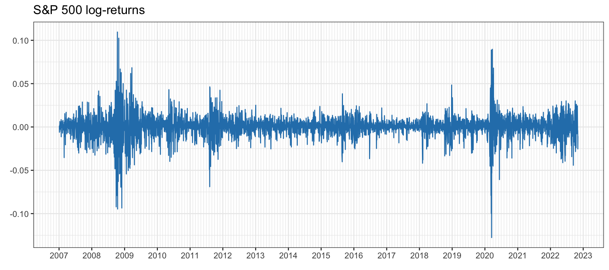

(\#fig:SP500-logreturns)Daily log-return time series of S\&P 500.

(\#fig:btc-logreturns)Daily log-return time series of Bitcoin.

It is insightful to compare the volatility levels for the two classes of assets. The annualized volatility of the S&P 500 stock index is on the order of 21%, whereas for Bitcoin it is around 78%. Generally speaking, a value of anywhere between 12% and 20% is considered low, whereas above 30% it is considered extremely volatile. Thus, the S&P 500 has a low volatility whereas Bitcoin is extremely volatile.

## Non-Gaussianity: Asymmetry and Heavy Tails
The _Gaussian_ or _normal_ distribution is one of the most commonly used for continuous random variables due to its ease of mathematical manipulation<!---, as well as a good fit with reality in some areas--->. It is characterized by two parameters: the mean and the variance (first- and second-order moments). Its probability distribution function (pdf) reads:
$$
f(x) = \frac{1}{\sqrt{2\pi}\sigma} e^{-\frac{1}{2}\left(\frac{x - \mu}{\sigma}\right)^2},
$$
where $\mu$ is the mean and $\sigma^2$ is the variance.

\index{non-Gaussianity}
\index{heavy tails}
\index{skewness}
\index{kurtosis}
In many areas, the Gaussian distribution may in fact be appropriate and easily justified from physical principles (like the pervasive thermal noise in electronic circuits that hinders communication systems). However, in other domains, like radar and financial systems, the random quantities are often not Gaussian distributed and higher-order moments are necessary for a proper characterization [@JondeauPoonRockinger2007]. Two new aspects enter the picture for a proper characterization: 

- the _skewness_ as a measure of the asymmetry in the distribution, and
- the _kurtosis_ as a measure of the thickness of the tails (i.e., whether the tails decay faster or slower than the exponential decay of the Gaussian distribution).

Figure\ \@ref(fig:skewness-and-kurtosis) illustrates the effect of skewness and kurtosis on the pdf. Financial data typically exhibits negative skewness and large kurtosis (with potential huge losses due to the heavy left tail).

(\#fig:skewness-and-kurtosis)Effect of skewness and kurtosis on the probability distribution function.

The combination of skewness and kurtosis makes it more likely for highly negative returns to occur (with the obvious consequences for an investor who has bought the asset). This is illustrated in Figure\ \@ref(fig:gaussian-vs-financial), where the left tail of a typical distribution of financial data is clearly shown to be much fatter or heavier than that of a Gaussian distribution. This is why distributions with tails decaying slower than the exponential (decay of the Gaussian) are called heavy tails, fat tails, or thick tails.

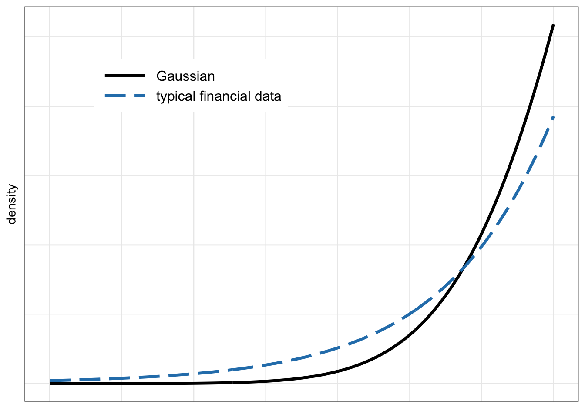

(\#fig:gaussian-vs-financial)Left tail of Gaussian and typical financial data distributions.

Figure\ \@ref(fig:SP500-histograms) shows histograms of the S&P 500 log-returns at different frequencies (namely, daily, monthly, and quarterly). It can be seen that the tails of the histograms are significantly heavier or thicker than that of a Gaussian and that the histogram is not symmetric. Figure\ \@ref(fig:btc-histograms) shows histograms of Bitcoin log-returns, again with clear heavy tails, although the asymmetry seems less pronounced than in the S&P 500 case.

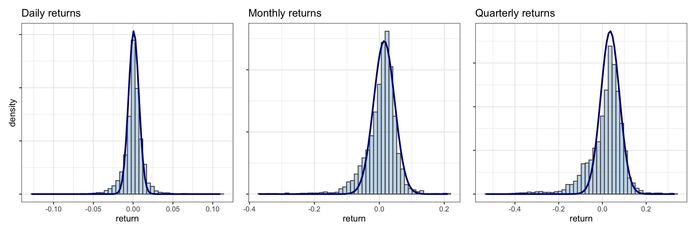

(\#fig:SP500-histograms)Histogram of S\&P 500 log-returns at different frequencies (with inappropriate Gaussian fit).

(\#fig:btc-histograms)Histogram of Bitcoin log-returns at different frequencies (with inappropriate Gaussian fit).

While histograms provide a quick visual inspection of the whole distribution, there are other more convenient types of plot that allow for a clearer characterization of the level of asymmetry and heavy-tailness.

### Asymmetry or Skewness
Skewness is a measure of the asymmetry of the probability distribution of a real-valued random variable about its mean. Zero skewness implies a symmetric distribution; negative skew commonly indicates that the thick tail is on the left side of the distribution, whereas positive skew indicates that the thick tail is on the right. The skewness of a random variable $X$ is defined as the third standardized moment $\E\Big[\big((X - \mu)/\sigma\big)^3\Big].$

Figure\ \@ref(fig:SP500-skewness-vs-period) plots the skewness of the S&P 500 returns during 2007--2022 as a function of the period of the returns. As the period increases from one day to ten days, the skewness decreases rapidly; then it saturates. Figure\ \@ref(fig:btc-skewness-vs-period) shows the same for Bitcoin during 2017--2022, with similar results. As previously observed from the histograms, the skewness of Bitcoin is closer to zero than that of the S&P 500. Thus, as a first approximation, cryptocurrencies seem to be more symmetric than stocks.

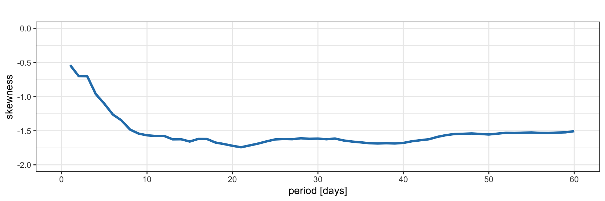

(\#fig:SP500-skewness-vs-period)Skewness of S\&P 500 log-returns.

(\#fig:btc-skewness-vs-period)Skewness of Bitcoin log-returns.

### Heavy-Tailness or Kurtosis
Q--Q (quantile--quantile) plots allow for a clearer assessment of the degree of heavy tails as compared to the exponential one of the Gaussian case. Figures\ \@ref(fig:SP500-QQ-plots) and\ \@ref(fig:btc-QQ-plots) show Q--Q plots corresponding to the S&P 500 and Bitcoin log-returns, respectively. The deviation of both the left and right tails in all cases clearly indicates heavy tails.

(\#fig:SP500-QQ-plots)Q--Q plots of S\&P 500 log-returns at different frequencies.

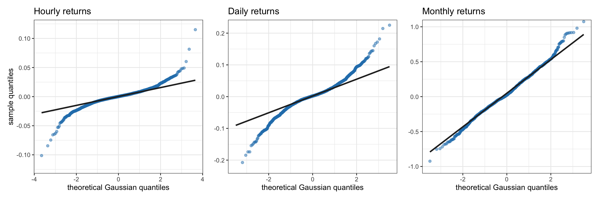

(\#fig:btc-QQ-plots)Q--Q plots of Bitcoin log-returns at different frequencies.

Kurtosis is a measure of the "tail heavyness" of the probability distribution of a real-valued random variable. Like skewness, kurtosis describes the shape of a probability distribution and there are different ways of quantifying it. The kurtosis of a Gaussian distribution is 3. Higher kurtosis values correspond to greater extremity of deviations (or outliers), hence the names heavy/fat/thick tails. It is common practice to use an adjusted version of the kurtosis, the excess kurtosis, which is the kurtosis minus 3. The standard definition of the kurtosis of a random variable $X$ is the fourth standardized moment $\E\Big[\big((X - \mu)/\sigma\big)^4\Big].$

Figure\ \@ref(fig:SP500-kurtosis-vs-period) plots the kurtosis of the S&P 500 returns during 2007--2022 as a function of the period of the returns. As the period increases from one day to three days, the excess kurtosis decreases very rapidly and then it saturates at around 6 to 8. Similarly, Figure\ \@ref(fig:btc-kurtosis-vs-period) shows the kurtosis of Bitcoin returns  during 2017--2022. As the period increases from one to three days, the excess kurtosis decreases very rapidly to less then 3. Interestingly, the kurtosis of Bitcoin seems to be smaller than that of the S&P 500. Thus, as a first approximation, it may seem that cryptocurrencies are less heavy-tailed or more Gaussian than stocks. However, this deserves a closer look by looking at the excess kurtosis during different periods:

- From 2017 to 2019: 5.41 for the S&P 500 and 3.46 for Bitcoin.
- During 2020: 8.51 for the S&P 500 and 50.87 for Bitcoin.
- From 2021 to 2022: 0.95 for the S&P 500 and 2.34 Bitcoin.  

From these distinct periods, it is evident that the primary difference occurred in 2020, during which Bitcoin exhibited significantly more heavy-tailed behavior.

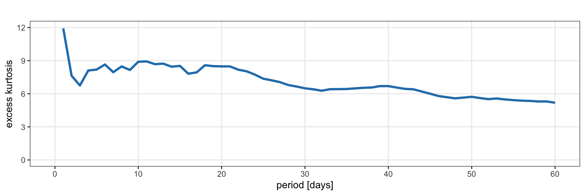

(\#fig:SP500-kurtosis-vs-period)Excess kurtosis of S\&P 500 log-returns.

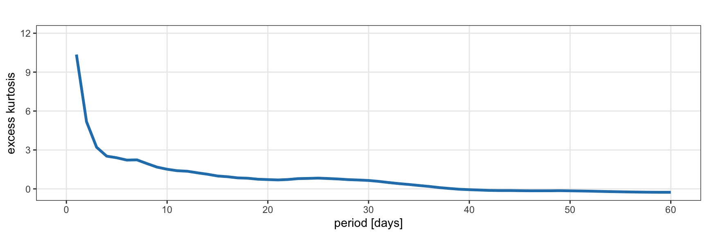

(\#fig:btc-kurtosis-vs-period)Excess kurtosis of Bitcoin log-returns.

### Statistical Tests
From the previous analysis, financial data clearly show skewness and kurtosis. To assess whether these parameters, together with the mean and variance, are enough to characterize the data, we can resort to mathematically sound statistical tests.

The Anderson--Darling statistic measures how well the data follow a particular distribution (the better the distribution fits the data, the smaller this statistic will be). The hypotheses for the Anderson--Darling test are

- H0: the data follow a specified distribution (null hypothesis); and
- H1: the data do not follow a specified distribution (alternative hypothesis).

As is customary, we can use the $p$-value to determine whether the data come from the chosen distribution (if it is smaller than some threshold, typically 0.05 or so, then we can reject the null hypothesis that the data came from that distribution).[^p-value]

[^p-value]: The $p$-value is the probability of obtaining the observed results under the assumption that the null hypothesis is correct. A small $p$-value means that there is strong evidence to reject the null hypothesis and accept the alternative hypothesis. Typical thresholds for determining whether a $p$-value is small enough are in the range 0.01--0.05.

Table\ \@ref(tab:Anderson-Darling-test) shows the results of the Anderson--Darling test for three distributions: the Gaussian, the Student $t$ distribution (which models heavy tails), and the skewed $t$ distribution (which accounts for both skewness and heavy tails). From these results we can conclude that the skewed $t$ distribution provides a good fit to the S&P 500 during the period 2015--2020. For an additional visual inspection, Figure\ \@ref(fig:fitting-QQ-plots) shows Q--Q plots of the empirical data with respect to the three candidate distributions (Gaussian, Student $t$, and skewed $t$). We can again confirm that the skewed $t$ distribution is a good fit.

<table>
<caption>(\#tab:Anderson-Darling-test)Results of Anderson--Darling test on financial data, supporting the skewed $t$ distribution.</caption>
 <thead>
  <tr>
   <th style="text-align:left;"> Distribution </th>
   <th style="text-align:center;"> Anderson--Darling test </th>
   <th style="text-align:left;"> $p$-value </th>
  </tr>
 </thead>
<tbody>
  <tr>
   <td style="text-align:left;"> Gaussian </td>
   <td style="text-align:center;"> 55.315 </td>
   <td style="text-align:left;"> $4.17\times10^{-7}$ </td>
  </tr>
  <tr>
   <td style="text-align:left;"> Student $t$ </td>
   <td style="text-align:center;"> 5.4503 </td>
   <td style="text-align:left;"> 0.001751 </td>
  </tr>
  <tr>
   <td style="text-align:left;"> Skewed $t$ </td>
   <td style="text-align:center;"> 2.3208 </td>
   <td style="text-align:left;"> 0.06161 </td>
  </tr>
</tbody>
</table>

(\#fig:fitting-QQ-plots)Q--Q plots of S\&P 500 log-returns vs. different candidate distributions.

## Temporal Structure {#temporal-structure}
\index{temporal correlation}
\index{volatility clustering}
Are the returns i.i.d. or do they show some temporal structure? This is a key question in finance because it determines the problem of forecasting the returns or prices. In fact, this has been a highly debated topic in economics for decades.

\index{efficient-market hypothesis (EMH)}
The _efficient-market hypothesis_ (EMH) states that share prices reflect all information and consistent "alpha"[^alpha] generation is impossible [@Fama1970]. Accordingly, stocks always trade at their fair value on exchanges, making it impossible for investors to purchase undervalued stocks or sell stocks for inflated prices. Therefore, it should be impossible to outperform the overall market through expert stock selection or market timing, and the only way an investor can obtain higher returns is by purchasing riskier investments.

[^alpha]: In finance, the term "alpha" is commonly used to denote a signal or information that results in the outperformance of profits compared to a benchmark.

Although it is a cornerstone of modern financial theory, the EMH is highly controversial and often disputed [@Shiller1981]. Believers argue it is pointless to search for undervalued stocks or to try to predict trends in the market through either fundamental or technical analysis. Theoretically, neither technical nor fundamental analysis can produce risk-adjusted excess returns (i.e., "alpha") consistently, and only insider information can result in outsized risk-adjusted returns. Although academics present a substantial body of evidence in support of it, there is an equal amount of dissent as well. For example, the fundamental-based investor Warren Buffett or the hedge fund Renaissance Technologies' Medallion Fund have consistently beaten the market over long periods, which by definition is impossible according to the EMH. <!---Detractors of the EMH also point to events such as the 1987 stock market crash, when the Dow Jones Industrial Average (DJIA) fell by over 20 percent in a single day, and asset bubbles as evidence that stock prices can seriously deviate from their fair values.--->

Proponents of the EMH conclude that, because of the randomness of the market, investors could do better by investing in a low-cost, passive portfolio. On the other hand, opponents insist on the possibility of designing portfolios that can beat the market.

Some accessible textbooks that cover temporal analysis include @Tsay2010, @CowpertwaitMetcalfe2009, and @RuppertMatteson2015.

### Linear Structure in Returns
\index{autocorrelation function (ACF)}
The autocorrelation function (ACF) and partial autocorrelation function (PACF) are heavily used in time series analysis and forecasting. They measure the linear structure or dependency along the temporal domain, which, according to the EMH, should be insignificant [@DingGranger1996]. The autocorrelation is simply the correlation between the signal at a time and some previous time, whereas the partial autocorrelation eliminates the effect of the signal in between those two time instances.

Figure\ \@ref(fig:SP500-ACF) indicates that the S&P 500 index exhibits almost no significant autocorrelation that can be exploited by models for forecasting (lags other than zero are basically within the statistical insignificant level). Figure\ \@ref(fig:btc-ACF) similarly illustrates that there is no significant autocorrelation to be exploited in Bitcoin (hourly returns similarly show no autocorrelations).

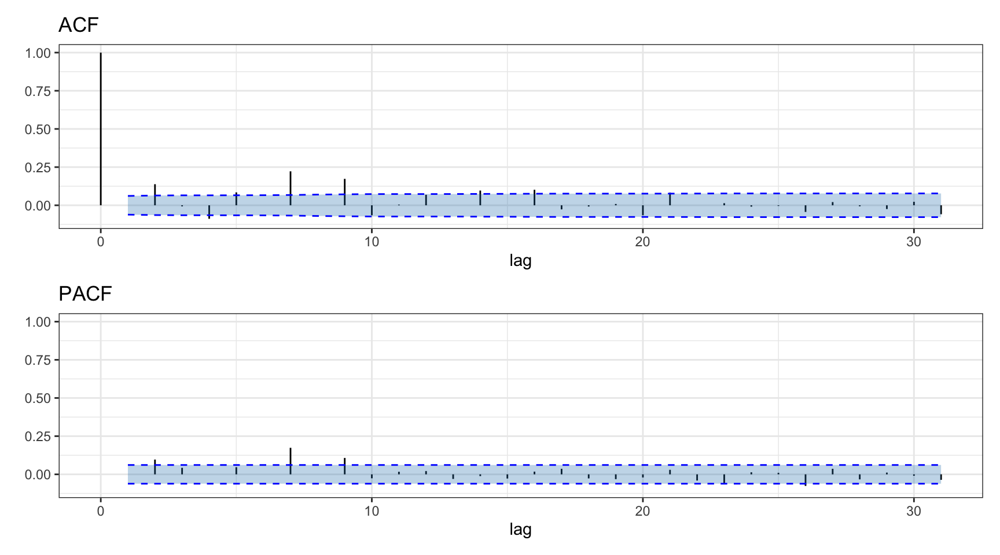

(\#fig:SP500-ACF)Autocorrelation of S\&P 500 daily log-returns.

(\#fig:btc-ACF)Autocorrelation of Bitcoin daily log-returns.

<!---

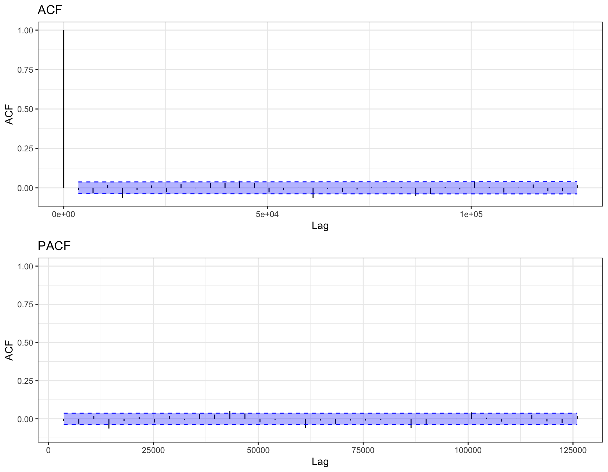

(\#fig:btc-hourly-ACF)Autocorrelation of BTC hourly log-returns.

--->

### Nonlinear Structure in Returns
From the previous absence of significant autocorrelations, one may be tempted to conclude that there is no temporal structure to be exploited. However, that would be a wrong conclusion. A visual inspection of the returns suffices to see that clearly some structure is present in the volatility envelope of the signal [@DingGranger1996], which measures the time-varying standard deviation of the signal along the time domain.

\index{volatility clustering}
Figure\ \@ref(fig:SP500-volatility-clustering) shows S&P 500 log-returns together with the volatility envelope, illustrating the phenomenon of the so-called _volatility clustering_. Clearly the volatility envelope changes slowly and can be easily forecast, as already pointed out in the 1990s [@DingGranger1996]. Figure\ \@ref(fig:btc-volatility-clustering) shows Bitcoin log-returns together with the volatility envelope, also exhibiting volatility clustering.

(\#fig:SP500-volatility-clustering)Volatility clustering in S\&P 500.

(\#fig:btc-volatility-clustering)Volatility clustering in Bitcoin.

But how can it be that the returns show no significant autocorrelations but clearly there is some temporal structure?

The answer lies in the fact that autocorrelation measures only the linear dependency. Nonlinear dependencies are more elusive to detect. In fact, machine learning is a potential tool to try to identify such nonlinear dependencies [@DePrado2018].

Since the envelope is basically a smooth version of the absolute value of the signal, one could calculate instead the autocorrelation of the absolute values of the returns. Figure\ \@ref(fig:SP500-abs-ACF) shows very significant autocorrelation values for the absolute values of the S&P 500 log-returns. Similarly, Figure\ \@ref(fig:btc-abs-ACF) shows significant autocorrelation values for the absolute values of Bitcoin log-returns (albeit not as significant as in the case of the S&P 500).

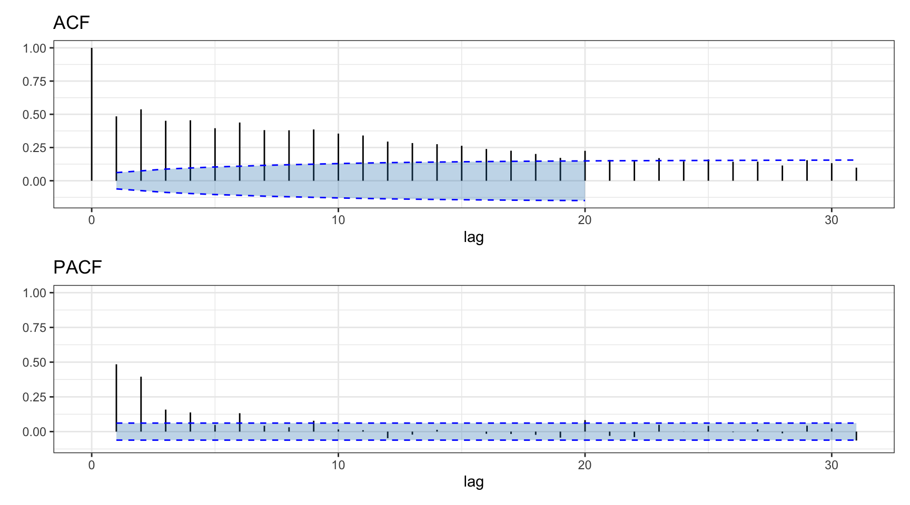

(\#fig:SP500-abs-ACF)Autocorrelation of absolute value of S\&P 500 daily log-returns.

(\#fig:btc-abs-ACF)Autocorrelation of absolute value of Bitcoin daily log-returns.

It may be useful to factor out the volatility envelope from the returns (i.e., dividing the returns by the volatility) so as to obtain a time series without volatility clustering, termed _standardized returns_. Figures\ \@ref(fig:SP500-volatility-clustering-removed) and\ \@ref(fig:btc-volatility-clustering-removed) illustrate such standardized returns for the S&P 500 and Bitcoin.

(\#fig:SP500-volatility-clustering-removed)Standardized S\&P 500 log-returns after factoring out the volatility envelope.

(\#fig:btc-volatility-clustering-removed)Standardized Bitcoin log-returns after factoring out the volatility envelope.

<!---
#### Conditional heavy-tailness {-}
QQ plots of standardized S&P 500 log-returns (conditional heavy-tailness aka aggregational Gaussianity):

(\#fig:SP500-QQ-plots-bis)QQ plots of S\&P 500 log-returns at different frequencies.

--->

## Asset Structure {#stylized-asset-structure}
\index{asset structure}
Apart from the structure along the temporal dimension, which can be used for modeling and forecasting, there is structure along the asset dimension (also referred to as cross-sectional structure). This means that rather than considering the assets one by one independently, they have to be jointly modeled. 

This is particularly important when it comes to assessing the risk of a portfolio, since different stocks may have different correlations. For example, one may diversify an investment by allocating capital to several assets, but if they are strongly correlated it may not help in reducing the risk. Figure\ \@ref(fig:effect-correlation-on-portfolio) illustrates the effect of asset correlation on the volatility of the equally weighted portfolio for the case of two assets with correlation $\rho$ and each with variance 1.
<!---covariance matrix
$\bSigma = \left[\begin{array}{cc}
1 & \rho\\
\rho & 1
\end{array}\right].$--->
<!---
We can observe that for uncorrelated assets, $\rho=0$, the portfolio gets the full diversity benefit with the variance reduced to half (volatility of $\sqrt{0.5}$), whereas for fully correlated assets, $\rho=1$, the portfolio does not benefit from any diversity with respect to investing on a single asset and the variance remains at 1 (volatility of 1).
--->
We can observe that for fully correlated assets, $\rho=1$, the portfolio does not benefit from any diversity with respect to investing in a single asset and the variance remains at 1 (volatility of 1); for uncorrelated assets, $\rho=0$, the portfolio gets a diversity benefit with the variance reduced to half (volatility of $\sqrt{0.5}$), and for negatively correlated assets, $\rho < 0$, the diversity benefit increases further. In reality, assets tend to have a high correlation close to 1 and finding uncorrelated assets or classes of assets is the "holy grail." The particular case of fully negatively correlated assets, $\rho = -1$, can be achieved with a synthetic asset created for the sole purpose of hedging another one to control the risk exposure.

(\#fig:effect-correlation-on-portfolio)Effect of asset correlation on volatility for a two-asset portfolio.

Figure\ \@ref(fig:assets-covmat) shows heatmaps of the correlation matrix of some stocks from the S&P 500 (daily returns) and some cryptocurrencies (hourly returns). Compared to the diagonal elements (which are equal to 1), the off-diagonal components are much weaker (and no value lies in the negative range). In the case of cryptocurrencies, for example, there is a pair of names that are fully correlated: BTC and WBTC, which is expected since WBTC is by definition a wrapped BTC.

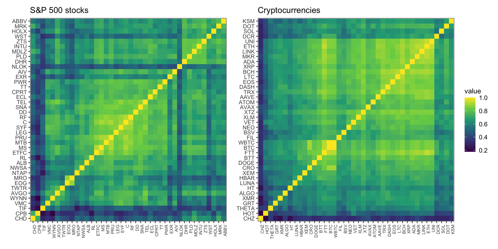

(\#fig:assets-covmat)Correlation matrix of returns for stocks and cryptocurrencies.

We can confirm the previous observation that the cross-correlations are mostly nonnegative from the histograms depicted in Figure\ \@ref(fig:positive-corr) for S&P 500 stocks (daily returns) and cryptocurrencies (hourly returns). In fact, this positive correlation among stocks and cryptocurrencies is not surprising since assets tend to move together with the market.

(\#fig:positive-corr)Histogram of correlations among returns of stocks and cryptocurrencies.

To explore the asset structure more deeply, it is worth inspecting how the eigenvalues of the correlation matrix tend to cluster into very few large ones and a big group of much smaller ones, the so-called _factor model_ structure [@Sharpe1964; @FamaFrench1992] (see Chapter\ \@ref(iid-modeling) for details). Figure\ \@ref(fig:covmat-eigenvalues) depicts histograms of eigenvalues of the correlation matrix of daily returns for the S&P 500 stocks and hourly returns for the top 82 cryptocurrencies. In both cases, we can observe that a single eigenvalue is totally predominant (corresponding to the market index and constituting almost half of the total value of the eigenvalues), perhaps with one to four other nonnegligible eigenvalues, while the rest of them are orders of magnitude smaller (note that the horizontal axis follows a logarithmic scale).

<!---
In fact, by plotting the empirical cumulative distribution function (CDF) of the eigenvalues of the covariance matrix, one can clearly observe that a single eigenvalue is totally predominant (with almost half of the total value), perhaps other four non-negligible eigenvalues, and the rest are orders of magnitude smaller.
--->

(\#fig:covmat-eigenvalues)Histogram of correlation matrix eigenvalues of stocks and cryptocurrencies.

## Summary
\index{stylized facts}

Financial data display unique characteristics known as stylized facts, with the most prominent ones including:

- _Lack of stationarity_: The statistics of financial data change over time significantly and any attempt at modeling will have to continuously adapt.

- _Volatility clustering_: This is perhaps the most visually apparent aspect of financial time series. There are a myriad models in the literature that can be utilized for forecasting (covered in Chapter\ \@ref(time-series-modeling)).

- _Heavy tails_: The distribution of financial data is definitely not Gaussian and this constitutes a significant departure from many traditional modeling approaches (covered in Chapter\ \@ref(iid-modeling)).

- _Strong asset correlation_: The goal in investing is to discover assets that are not strongly correlated, which is a daunting task due to the naturally occurring strong asset correlation.

## Exercises {#exercises-ch2 -}
\markright{Exercises}

Choose one or several assets (e.g., stocks or cryptocurrencies) for the following exercises.

::: {.exercise name="Price time series"}
Choose one asset and plot the price time series using both a linear and a logarithmic scale. Compare the plots and comment.
:::

::: {.exercise name="Return time series"}
Choose one asset and plot the linear returns and log-returns. Compare the plots and comment.
:::

::: {.exercise name="Volatility envelope"}
Choose one asset and compute the volatility (square root of the average of the squared returns over $k$ samples) on a rolling-window basis in two ways:

a. Left-aligned window: at each time $t$, use the samples $t-k+1, \dots, t$. Try different values of $k$, observe the effect, and discuss.
b. Centered window: at each time $t$, use the samples $t-\lfloor k \rfloor/2, \dots, t+\lceil k \rceil/2 - 1$. Try different values of $k$, observe the effect, and discuss.

Finally, compare the left-aligned and centered rolling-window approaches and discuss.
:::

::: {.exercise name="Return distribution"}
Choose one asset and perform the following tasks:

a. Plot histograms of the log-returns at different frequencies. Compare the plots and comment. 
b. Draw Q--Q plots to focus on the tail distribution. Do the returns follow a Gaussian distribution? 
c. Compute the skewness and kurtosis to see if they correspond to a Gaussian distribution. 
:::

::: {.exercise name="Return autocorrelation"}
Choose one asset and perform the following tasks:

a. Plot the autocorrelation function of the log-returns at various frequencies. Compare the plots and comment.
b. Repeat the process using squared returns instead of log-returns. Compare these plots and comment.
:::

::: {.exercise name="Asset correlation"}
Choose several stocks and perform the following tasks:

a. Compute the cross-correlations and plot a heatmap. 
b. Compute the correlation between each of the stocks and the index. Discuss the results. 
c. Compute the correlation between a stock and a cryptocurrency. Discuss the result and the implications.
:::

