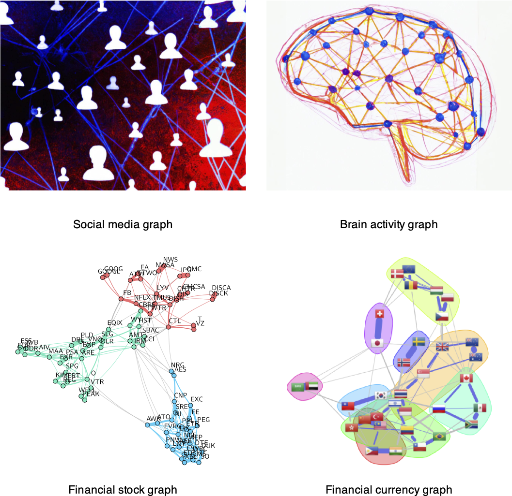
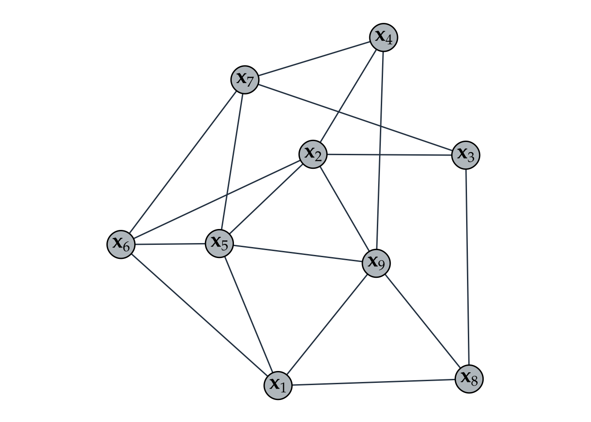
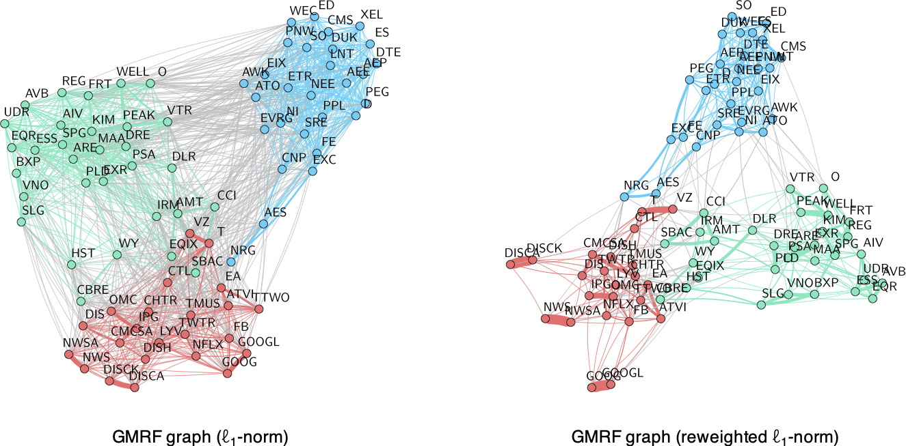
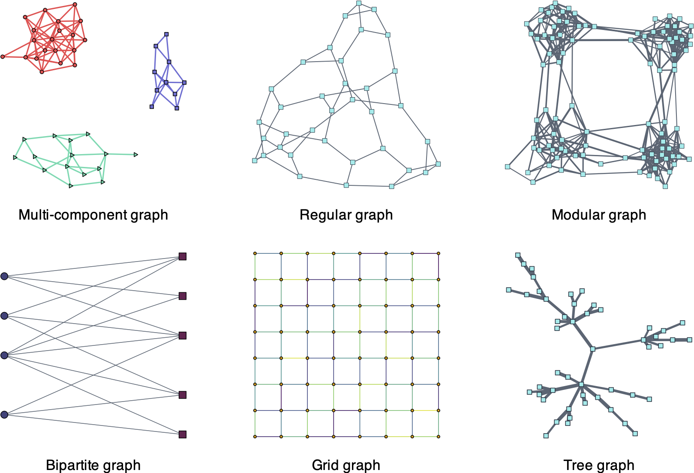
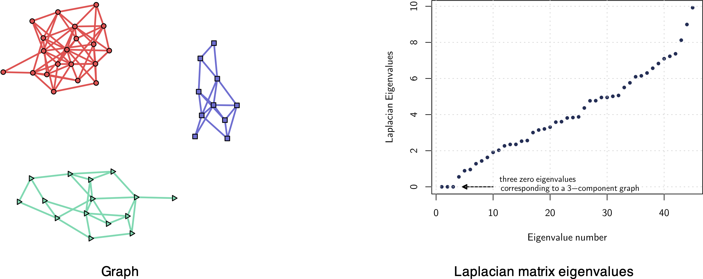
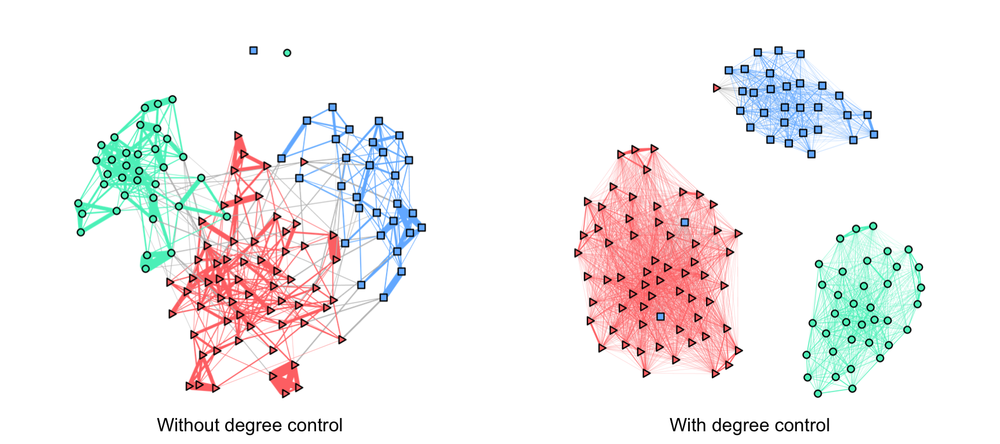
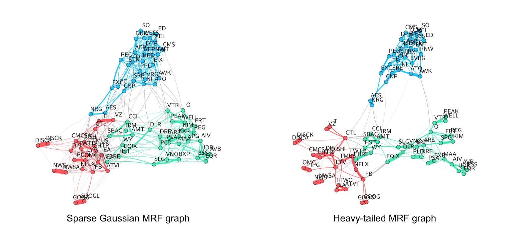
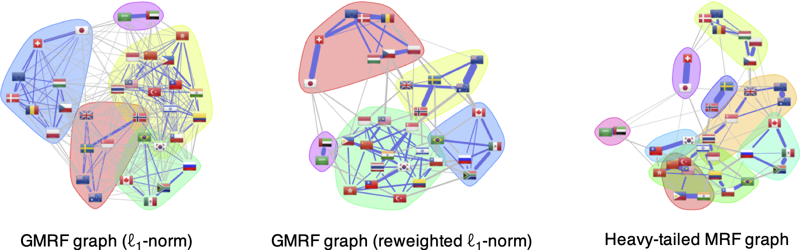
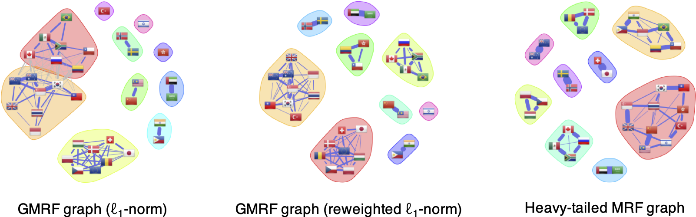

# Financial Data: Graphs {#graph-modeling}

> "Mankind invented a system to cope with the fact that we are so intrinsically lousy at manipulating numbers. It's called the graph."
>
> --- Charlie Munger

\afterquotespace
\acknowledgementCUP

Graphs provide a convenient and compact way to represent data while highlighting the relationships between entities of a network. They constitute a powerful mathematical tool with broad applicability in numerous fields, such as biology, brain modeling, finance, statistical physics, management, behavioral modeling, machine learning, social networks, and data science in general. Given the recent availability of large amounts of data collected in a variety of application domains, graph-based analysis plays a fundamental role in understanding and analyzing the structure of large networks that generate data. In practical scenarios, the underlying graph structure that represents the network is often unknown and has to be inferred from the data. Many graph learning algorithms have been proposed in recent decades, with increased interest in the past few years. This chapter explores a broad range of graph estimation algorithms, emphasizing recent advances specifically tailored to financial data.

  This material has been published as:
  Daniel P. Palomar (2025). _Portfolio Optimization: Theory and Application_. Cambridge University Press.
  This version is free to view and download for personal use only; not for re-distribution, re-sale, or use in derivative works. ©\ Daniel P. Palomar 2025.

## Graphs
\index{graphs}
_Graphs_ have become a fundamental and ubiquitous mathematical tool for modeling data in a variety of application domains and for understanding the structure of large networks that generate data [@Lauritzen1996; @Kolaczyk2009]. By abstracting the data as graphs, we can better capture the geometry of data and visualize high-dimensional data. Some iconic examples of graphs, illustrated in Figure\ \@ref(fig:graph-examples), include the following:

- _Social media graphs_: These model the behavioral similarity or influence between individuals, with the data consisting of online activities such as tagging, liking, purchasing, and so on.

- _Brain activity graphs_: These represent the correlation among sensors examining the brain, with the data being the measured brain activity known as fMRI (functional magnetic resonance imaging).

- _Financial stock graphs_: These capture the interdependencies among financial companies in stock markets, with the data consisting of measured economic quantities such as stock prices, volumes, and so on.

- _Financial currency graphs_: These summarize the interdependencies among currencies in foreign exchange markets, with the data comprising measured economic quantities like spot prices, volumes, and so on.

- _Financial cryptocurrency graphs_: Similarly to currency graphs, these model the interdependencies among cryptocurrencies in crypto markets.

(\#fig:graph-examples)Examples of graphs in different applications.

<!---

--->

### Terminology
The basic elements of a graph (see Figure\ \@ref(fig:graph-no-edge-label)) are

- _nodes_: corresponding to the entities or variables; and
- _edges_: encoding the relationships between entities or variables.

(\#fig:graph-no-edge-label)Illustration of a graph with nodes and edges.

A graph is a simple _mathematical structure_ described by $\mathcal{G}=(\mathcal{V},\mathcal{E},\bm{W})$, where the set $\mathcal{V}=\{1,2,3,\ldots,p\}$ contains the indices of the nodes, the set of pairs $\mathcal{E}=\{(1,2),{(1,3)},\ldots,{(i,j)},\ldots\}$ contains the edges between any pair of nodes $(i,j)$, and the weight matrix $\bm{W}$ encodes the strength of the relationships.

### Graph Matrices {#graph-matrices}
Several matrices are key in characterizing graphs.

\index{graphs!adjacency matrix}

- The _adjacency matrix_ $\bm{W}$ is the most direct way to fully characterize a graph, where each element $W_{ij}$ contains the strength of the connectivity, $w_{ij}$, between node $i$ and node $j$:
$$
[\bm{W}]_{ij}=\begin{cases}
w_{ij} & \textm{if}\;(i,j)\in\mathcal{E},\\
0      & \textm{if}\;(i,j)\notin\mathcal{E},\\
0      & \textm{if}\;i=j.
\end{cases}
$$
We tacitly assume $W_{ij}\ge0$ and $W_{ii} = 0$ (no self-loops). If $W_{ij}=W_{ji}$ (symmetric matrix $\bm{W}$), then the graph is called undirected.

\index{graphs!connectivity matrix}

- The _connectivity matrix_ $\bm{C}$ is a particular case of the adjacency matrix containing elements that are either 0 or 1:
$$
[\bm{C}]_{ij}=\begin{cases}
1 & \textm{if}\;(i,j)\in\mathcal{E},\\
0      & \textm{if}\;(i,j)\notin\mathcal{E},\\
0      & \textm{if}\;i=j.
\end{cases}
$$
It describes the connectivity pattern of the adjacency matrix. In fact, for some graphs the adjacency matrix is already binary (with no measure of strength) and coincides with the connectivity matrix.

\index{graphs!degree matrix}

- The _degree matrix_ $\bm{D}$ is defined as the diagonal matrix containing the degrees of the nodes $\bm{d} = (d_1,\dots,d_p)$ along the diagonal, where the degree of a node $i$, $d_i$, represents its overall connectivity strength to all the nodes, that is, $d_i = \sum_{j} W_{ij}$. In other words,
$$\bm{D}=\textm{Diag}(\bm{W}\bm{1}).$$

\index{graphs!Laplacian matrix}

- The _Laplacian matrix_ of a graph is defined as $$\bm{L} = \bm{D} - \bm{W}.$$ 
It is also referred to as the combinatorial Laplacian matrix to distinguish it from other variations in the definition of $\bm{L}.$

The Laplacian matrix may appear unusual at first; however, it possesses numerous valuable properties that make it a fundamental matrix in graph analysis. It satisfies the following mathematical properties:

- it is symmetric and positive semidefinite: $\bm{L}\succeq\bm{0}$;
- it has a zero eigenvalue with corresponding eigenvalue the all-one vector $\bm{1}$: $\bm{L}\bm{1} = \bm{0}$;
- the degree vector is found along its diagonal: $\textm{diag}(\bm{L})=\bm{d}$;
- the number of zero eigenvalues corresponds to the number of connected components of the graph (i.e., clusters);
- it defines a measure for the _smoothness_ or _variance_ of graph signals.

To further elaborate on the smoothness property of the Laplacian matrix, let $\bm{x}=(x_1,\dots,x_p)$ denote a graph signal (i.e., one observation of the signal on all the nodes of the graph). Ignoring the graph, one way to measure the variance of this signal $\bm{x}$ is with the quantity $\sum_{i,j}(x_i - x_j)^2.$ Now, to take into account the graph information in this computation, it makes sense to compute the variance between signals $x_i$ and $x_j$ only if these two nodes are connected, for example, by weighting the variance between each pair of nodes with the connectivity strength as $\sum_{i,j}W_{ij}(x_i - x_j)^2.$ This finally leads us to the connection between the Laplacian matrix and a measure of smoothness or variance of the graph signal as
\begin{equation}
  \bm{x}^\T\bm{L}\bm{x} = \frac{1}{2}\sum_{i,j}W_{ij}(x_i - x_j)^2.
  (\#eq:xLx)
\end{equation}

::: {.proof}
$$\bm{x}^\T\bm{L}\bm{x} = \bm{x}^\T\bm{D}\bm{x} - \bm{x}^\T\bm{W}\bm{x}
= \sum_{i}d_{i}x_i^2 - \sum_{i,j}w_{ij}x_ix_j = \sum_{i,j}w_{ij}x_i^2 - \sum_{i,j}w_{ij}x_ix_j.$$
:::
 

::: {.example name="Graph matrices for a toy example"}
Figure\ \@ref(fig:toy-4node-graph) shows a simple toy undirected graph $\mathcal{G}=(\mathcal{V},\mathcal{E},\bm{W})$ with four nodes characterized by $\mathcal{V}=\{1,2,3,4\}$, $\mathcal{E}=\{(1,2),(2,1),(1,3),(3,1),(2,3),(3,2),(2,4),(4,2)\}$, and weights $w_{12}=w_{21}=2$, $w_{13}=w_{31}=2$, $w_{23}=w_{32}=3$, $w_{24}=w_{42}=1$.

(\#fig:toy-4node-graph)Toy graph.

The connectivity, adjacency, and Laplacian graph matrices are
$$
\bm{C}=\begin{bmatrix}
0 & 1 & 1 & 0\\
1 & 0 & 1 & 1\\
1 & 1 & 0 & 0\\
0 & 1 & 0 & 0
\end{bmatrix},\quad
\bm{W}=\begin{bmatrix}
0 & 2 & 2 & 0\\
2 & 0 & 3 & 1\\
2 & 3 & 0 & 0\\
0 & 1 & 0 & 0
\end{bmatrix},\quad
\bm{L}=\begin{bmatrix}
4 & -2 & -2 & 0\\
-2 & 6 & -3 & -1\\
-2 & -3 & 5 & 0\\
0 & -1 & 0 & 1
\end{bmatrix}.
$$
:::

## Learning Graphs
In some applications, the graph structure can be readily obtained, such as in a social network where the nodes are the users and the connectivity can be measured by friendship relationships. In many other practical scenarios, however, the underlying graph structure is not directly observable and has to be inferred from the data, such as in a gene graph, brain activity graph, or a financial graph.

Numerous methods for learning graphs have been proposed in recent decades, ranging from heuristic techniques based on the physical interpretation of graphs to more statistically sound approaches that build upon well-established results from estimation theory.

The starting point in a graph learning method from data is the _data matrix_,
\begin{equation}
  \bm{X}=[\bm{x}_1,\bm{x}_2,\dots,\bm{x}_p]\in\R^{n\times p},
  (\#eq:X-data-matrix)
\end{equation}
where each column contains the signal of one variable or node, $p$ is the number of variables or nodes, and $n$ is the length of the signal or number of observations. In the context of financial time series, the number of observations is often denoted by $T$ instead of $n$, and the number of nodes or assets is often denoted by $N$ instead of $p$. Each row of matrix $\bm{X}$ represents one observation of the signal on the graph, called the _graph signal_.

The goal in graph learning is to transition from the data matrix $\bm{X}$ to the graph description $\mathcal{G}=(\mathcal{V},\mathcal{E},\bm{W})$ as illustrated in Figure\ \@ref(fig:graph-learning-from-X). A simple example of graph learning from data is depicted in Figure\ \@ref(fig:graph-learning-from-twomoon), where the nodes are points in $\R^2$ sampled from the "two-moon" dataset, and the resulting graph clearly comprises two components corresponding to the two moons.

(\#fig:graph-learning-from-X)Learning a graph from data.

(\#fig:graph-learning-from-twomoon)Illustration of graph learning for a toy example.

The field of graph learning has experienced significant growth in recent years, with numerous studies introducing enhanced graph estimation techniques in terms of both quality and computational efficiency.

- In what appears to be a pioneering effort, the seminal paper of @Mantegna1999 was the first to implement data-driven graphs in financial markets, employing a straightforward correlation graph.

- For a comprehensive understanding of graph theory, the standard textbooks @Lauritzen1996 and @Kolaczyk2009 provide excellent coverage.

- For introductory and overview articles on graph learning, refer to @MateosSegarraMarquesRibeiro2019 and @DongThanouRabbatFrossard2019.

- Basic graph learning algorithms are found in @LakeTenenbaum2010, @EgilmezPavezOrtega2017, and @ZhaoWangKumarPalomar2019.

- Structured graph learning: A general approach via spectral constraints is proposed in @KumarYingCardosoPalomar_NeurIPS2019 and @KumarYingCardosoPalomar2020, graphs with sparsity are studied in @YingCardosoPalomar_NeurIPS2020, and a convex formulation for bipartite graphs is developed in @CardosoYingPalomar_NeurIPS2022.

- Graph learning with financial data: General guidelines for financial time series are considered in @CardosoPalomar_Asilomar2020, learning under heavy tails is explored in @CardosoYingPalomar_NeurIPS2021, and the application of bipartite-structured graphs for clustering is considered in @CardosoYingPalomar_NeurIPS2022; an overview is given in @CardosoYingPalomar_book2022.

- A comprehensive overview of the literature on financial graphs in the past two decades can be found in @MartiNielsenBinkowskiDonnat2021.

### Learning Graphs from Similarity Measures
The simplest methods to infer a graph from data are based on computing each element of the adjacency matrix $\bm{W}$ (either weighted or $0$--$1$ connectivity) by measuring the connectivity strength between each pair of nodes one by one. To measure the strength, a wide variety of similarity functions or scoring functions can be used [@Kolaczyk2009], leading to totally different graphs.

For illustration purposes, a few simple methods are listed next based on the data matrix $\bm{X}\in\R^{n\times p}$ defined in \@ref(eq:X-data-matrix), where the $i$th column $\bm{x}_i\in\R^n$ corresponds to the signal at node $i$:

- _Thresholded distance graph_: Nodes $i$ and $j$ are connected ($w_{ij}=1$) if the corresponding signals satisfy $\|\bm{x}_i - \bm{x}_j\|^2 \le \gamma$, where $\gamma$ is a threshold; otherwise not connected ($w_{ij}=0$).

- _Gaussian graph_: Set every pair of points $i\neq j$ as connected with the Gaussian weights
$$w_{ij} = \textm{exp}\left(-\frac{\|\bm{x}_i - \bm{x}_j\|^2}{2\sigma^2}\right),$$
where $\sigma^2$ controls the size of the neighborhood.

- _$k$-nearest neighbors ($k$-NN) graph_: Nodes $i$ and $j$ are connected ($w_{ij}=1$) if $\bm{x}_i$ is one of the $k$ closest points to $\bm{x}_j$ or vice versa; otherwise not connected ($w_{ij}=0$).

- _Feature correlation graph_: Simply use pairwise feature correlation for $i\neq j$:
$$w_{ij} = \bm{x}_i^\T\bm{x}_j.$$ It is worth noting that if the signals are normalized (i.e., $\|\bm{x}_i\|^2=1$), then the Euclidean distance used in the Gaussian weights is directly related to the correlation: $\|\bm{x}_i - \bm{x}_j\|^2 = 2\times (1 - \bm{x}_i^\T\bm{x}_j).$

However, because the connectivity of each pair is measured independently of the others, these heuristic methods do not provide holistic measures and may not perform well in practice, especially for time series data. In principle, it is better to measure the connectivity of all pairs all at once in a joint manner, as explored in the next sections.

### Learning Graphs from Smooth Signals {#smooth-graphs}
We will now derive a family of graph learning methods based on the measure of smoothness or variance of a graph signal defined in \@ref(eq:xLx). To recall, given a $p$-dimensional graph signal $\bm{x}$ (defined on a graph with $p$ nodes), a natural measure of its variance on the graph is $\bm{x}^\T\bm{L}\bm{x} = \frac{1}{2}\sum_{i,j}W_{ij}(x_i - x_j)^2.$

Suppose now we have $n$ observations of graph signals contained in the data matrix $\bm{X}\in\R^{n\times p}$ defined in \@ref(eq:X-data-matrix), where the $i$th column $\bm{x}_i\in\R^n$ corresponds to the signal at node $i$ and the $t$-th observation of the graph signal $\bm{x}^{(t)}\in\R^p$ is contained along the $t$-th row. 

The overall variance corresponding to the $n$ observations contained in the data matrix $\bm{X}$ can be written in terms of the Laplacian matrix $\bm{L}$ as
$$
\sum_{t=1}^n(\bm{x}^{(t)})^\T\bm{L}\bm{x}^{(t)} = \textm{Tr}\left(\bm{X}\bm{L}\bm{X}^\T\right)
$$
or, equivalently, in terms of the adjacency matrix  $\bm{W}$ as
$$
\sum_{t=1}^n \frac{1}{2}\sum_{i,j}W_{ij}\left(x^{(t)}_i - x^{(t)}_j\right)^2 = \frac{1}{2}\sum_{i,j}W_{ij}\|\bm{x}_i - \bm{x}_j\|^2
= \frac{1}{2}\textm{Tr}(\bm{W}\bm{Z}),
$$
where the matrix $\bm{Z}$ contains the squared Euclidean distances between signals: $Z_{ij} \triangleq \|\bm{x}_i - \bm{x}_j\|^2$.

Now that we have expressed the variance of a collection of signals on a graph, we are ready to formulate the graph learning problem. The key observation is that if a signal has been generated by a graph, then it is expected to have a small variance as measured on that graph. This is a natural assumption because if two nodes are strongly connected, then the signals on these two nodes should be similar; alternatively, if two nodes are not connected, then the corresponding signals can be totally different.

Based on this assumption on the signal smoothness measured on the generating graph, suppose we collect some graph signals in the data matrix $\bm{X}$ with the hypothesis that they could have been generated either by graph $\mathcal{G}_1$ or $\mathcal{G}_2$, with corresponding Laplacian matrices $\bm{L}_1$ and $\bm{L}_2$, respectively. Then, to determine which graph has generated the data, we simply have to compute the signal variance on each of the two graphs, $\textm{Tr}\left(\bm{X}\bm{L}_1\bm{X}^\T\right)$ and $\textm{Tr}\left(\bm{X}\bm{L}_2\bm{X}^\T\right)$, and choose the one with the smaller variance.

We can now take the previous problem of choosing a graph among a set of possible alternatives to the next level. Suppose again we collect some graph signals in the data matrix $\bm{X}$ and want to determine the graph $\mathcal{G}$ that best fits the data in the sense of producing a minimum signal variance. That is, we want to determine the graph (either in terms of $\bm{L}$ or $\bm{W}$) that gives the minimum signal variance on that graph. In addition, for practical purposes, we may want to include a regularization term on the estimated graph to control some other graph properties, such as sparsity, energy, or volume.

Thus, the simplest problem formulation in terms of the Laplacian matrix $\bm{L}$ is
\begin{equation}
  \begin{array}{ll}
  \underset{\bm{L}\succeq\bm{0}}{\textm{minimize}} 
  & \textm{Tr}\left(\bm{X}\bm{L}\bm{X}^\T\right) + \gamma h_L(\bm{L})\\
  \textm{subject to} 
  & \bm{L}\bm{1}=\bm{0}, \quad L_{ij} = L_{ji} \le 0, \quad \forall i\neq j,
  \end{array}
  (\#eq:smooth-formulation-L)
\end{equation}
where $\gamma$ is a hyper-parameter to control the regularization level and $h_L(\bm{L})$ is a regularization function, e.g., $\|\bm{L}\|_1$, $\|\bm{L}\|_\textm{F}^2$, or $\textm{volume}(\bm{L})$. Observe that this formulation incorporates as constraints the structural properties that the Laplacian matrix is supposed to satisfy (see Section\ \@ref(graph-matrices)).

Similarly, the simplest problem formulation in terms of the adjacency matrix $\bm{W}$ is
\begin{equation}
  \begin{array}{ll}
  \underset{\bm{W}}{\textm{minimize}} 
  & \frac{1}{2}\textm{Tr}(\bm{W}\bm{Z}) + \gamma h_W(\bm{W})\\
  \textm{subject to} 
  & \textm{diag}(\bm{W})=\bm{0}, \quad \bm{W}=\bm{W}^\T \ge \bm{0},
  \end{array}
  (\#eq:smooth-formulation-W)
\end{equation}
where $h_W(\bm{W})$ is a regularization function for the adjacency matrix. As before, this formulation incorporates as constraints the structural properties that the adjacency matrix is supposed to satisfy (see Section\ \@ref(graph-matrices)).

It is worth noting that these formulations are convex provided that the regularization terms are convex functions. It may seem that the formulation in terms of the Laplacian matrix in \@ref(eq:smooth-formulation-L) has a higher complexity than \@ref(eq:smooth-formulation-W) due to the positive semidefinite matrix constraint $\bm{L}\succeq\bm{0}.$ However, this is not the case because $\bm{L}\succeq\bm{0}$ is implied by the other two sets of linear constraints, $\bm{L}\bm{1}=\bm{0}$ and $L_{ij} = L_{ji} \le 0$ for $i\neq j$ [@YingCardosoPalomar_NeurIPS2020].

#### Controlling the Degrees of the Nodes {-}
\index{graphs!node degree}
Controlling the degrees of the nodes in a graph is important to avoid the problem of unbalanced graphs or even isolated nodes in the graph. Recall from Section\ \@ref(graph-matrices) that the degrees of the nodes in a graph are given by $\bm{d}=\bm{W}\bm{1}$. 

Some examples of graph learning with degree control include:

- Sparse graphs with fixed degrees: The formulation in \@ref(eq:smooth-formulation-W) was adopted in @NieWangJordanHuang2016 with the regularization term $\|\bm{W}\|_\textm{F}^2$ to control the sparsity of the graph and the constraint $\bm{W}\bm{1} = \bm{1}$ to control the degrees of the nodes. 

- Sparse graphs with regularized degrees: An alternative to fixing the degrees as $\bm{W}\bm{1} = \bm{1}$ is to include a regularization term in the objective such as $-\bm{1}^\T\textm{log}(\bm{W}\bm{1})$ [@Kalofolias2016].

- Robust graphs against noisy data: Since observations are often noisy, a robust version of the smoothness term $\textm{Tr}\left(\bm{X}\bm{L}\bm{X}^\T\right)$ in \@ref(eq:smooth-formulation-L) was proposed in @DongThanouFrossardVandergheynst2015 by combining the term $\textm{Tr}\left(\bm{Y}\bm{L}\bm{Y}^\T\right)$ with $\|\bm{X} - \bm{Y}\|_\textm{F}^2$, where $\bm{Y}$ attempts to remove the noise in $\bm{X}$.

###  Learning Graphs from Graphical Model Networks {#GMRF-graphs}
\index{graphs!graphical model networks}
\index{graphical model networks|see{graphs, graphical model networks}}
In the previous sections, the data matrix $\bm{X}$ was assumed to contain the graph data without any statistical modeling. Alternatively, the graph learning process can be formulated in a more sound way as a statistical inference problem. We will now assume that the graph signals contained along the rows of $\bm{X}$, denoted by $\bm{x}^{(t)},\; t=1,\dots,T,$ where $T$ is the number of observations, follow some multivariate distribution such as the Gaussian distribution,
$$\bm{x}^{(t)} \sim \mathcal{N}(\bmu, \bSigma),$$ 
where $\bmu$ is the mean vector and $\bSigma$ the covariance matrix of the observations. Later, in Section\ \@ref(heavy-tail-graphs), more realistic heavy-tailed distributions will be considered.

Recall that, in practice, the covariance matrix $\bSigma$ is typically estimated via the _sample covariance matrix_
$$
\bm{S} = \frac{1}{T}\sum_{t=1}^T (\bm{x}^{(t)} - \bmu)(\bm{x}^{(t)} - \bmu)^\T = \frac{1}{T} \big(\bm{X} - \bm{\bar{X}}\big)^\T\big(\bm{X} - \bm{\bar{X}}\big),
$$
where the matrix $\bm{\bar{X}}$ contains $\bmu$ along each row (see Chapter\ \@ref(iid-modeling) for more details on the estimation of covariance matrices).

The topic of estimation of graphical models goes back at least to the 1970s, when the inverse sample covariance matrix $\bm{S}^{-1}$ was proposed to determine a graph [@Dempster1972]. Some paradigmatic examples of network graph construction include the following:

\index{graphs!graphical model networks!correlation network}

- _Correlation networks_: The correlation between two random variables characterizes the similarity between them (at least in a linear sense). Therefore, it can be used as a way to measure how similar two nodes are and, hence, as a way to characterize a graph [@Lauritzen1996; @Kolaczyk2009]. Nevertheless, a big drawback of using correlations is that two nodes may have a high correlation through a dependency on other nodes. For example, in the context of financial data, it is well known that all the stocks are significantly driven by a few factors. As a consequence, they all exhibit a high correlation that does not really characterize the similarity between stocks once the factors are accounted for.

\index{graphs!graphical model networks!partial correlation network}

- _Partial correlation networks_: The correlation measures the direct dependency between two nodes but ignores the other nodes. A more refined version is to measure the dependency but conditioned on the other nodes, that is, factoring out the effect of other nodes. For example, height and vocabulary of children are not independent, but they are conditionally independent conditioned on age.

  Interestingly, all the information of partial correlation and dependency conditioned on the rest of the graph is contained in the so-called _precision matrix_ defined as $\bm{\Theta} = \bSigma^{-1}$, that is, the inverse covariance matrix. To be precise, the correlation between nodes $i$ and $j$, conditioned on the rest of the nodes of the network, is equal to $-\Theta_{ij}/\sqrt{\Theta_{ii}\Theta_{jj}}$ [@Lauritzen1996; @Kolaczyk2009]. As a consequence, two nodes $i$ and $j$ are conditionally independent if and only if $\Theta_{ij}=0$.

  A graph defined by the precision matrix is called a _partial correlation network_ or _conditional dependence graph_. In such a graph, nonzero off-diagonal entries of the precision matrix $\bm{\Theta}$ correspond to the edges of the graph.

\index{graphs!graphical model networks!graphical LASSO (GLASSO)}

- _Graphical LASSO (GLASSO)_: This method tries to estimate a sparse precision matrix [@FriedmanHastieTibshirani2008; @BanerjeeGhaouiAspremont2008]. Assuming a multivariate Gaussian distribution function for the data, the regularized maximum likelihood estimation of the precision matrix $\bm{\Theta} = \bSigma^{-1}$ can be formulated (refer to Section\ \@ref(Gaussian-ML) in Chapter\ \@ref(iid-modeling)) as
\begin{equation}
  \begin{array}{ll}
  \underset{\bm{\Theta}\succ\bm{0}}{\textm{maximize}} 
  & \textm{log det}(\bm{\Theta}) - \textm{Tr}(\bm{\Theta}\bm{S}) - \rho\|\bm{\Theta}\|_{1,\textm{off}},
  \end{array}
  (\#eq:GLASSO)
\end{equation}
where $\|\cdot\|_{1,\textm{off}}$ denotes the elementwise $\ell_1$-norm of the off-diagonal elements and the hyper-parameter $\rho$ controls the level of sparsity of the precision matrix. The regularization term $\|\bm{\Theta}\|_{1,\textm{off}}$ enforces learning a sparse precision matrix. <!---Without it, the estimated precision matrix would not be sparse, even if the true one is, because the sample covariance matrix is noisy.--->

\index{graphs!graphical model networks!Laplacian-structured GLASSO}
\index{graphs!graphical model networks!Gaussian Markov random field (GMRF)}

- _Laplacian-structured GLASSO_: The precision matrix plays a role in graphs similar to the Laplacian matrix in the context of Gaussian Markov random fields (GMRFs) [@RueHeld2005]. Under that setting, the GLASSO formulation in \@ref(eq:GLASSO) can be reformulated to include the Laplacian constraints [@LakeTenenbaum2010; @EgilmezPavezOrtega2017; @ZhaoWangKumarPalomar2019] as[^R-package-GLASSO-Laplacian]
\begin{equation}
  \begin{array}{ll}
  \underset{\bm{L}\succeq\bm{0}}{\textm{maximize}} 
  & \textm{log gdet}(\bm{L}) - \textm{Tr}(\bm{L}\bm{S}) - \rho\|\bm{L}\|_{1,\textm{off}}\\
  \textm{subject to} 
  & \bm{L}\bm{1}=\bm{0}, \quad L_{ij} = L_{ji} \le 0, \quad \forall i\neq j,
  \end{array}
  (\#eq:GLASSO-Laplacian)
\end{equation}
where $\textm{gdet}$ denotes the generalized determinant defined as the product of nonzero eigenvalues (this is necessary because, differently from $\bm{\Theta}\succ\bm{0}$ in \@ref(eq:GLASSO), the Laplacian $\bm{L}$ is singular due to the constraint $\bm{L}\bm{1}=\bm{0}$).

[^R-package-GLASSO-Laplacian]: The R package [`spectralGraphTopology`](https://cran.r-project.org/package=spectralGraphTopology) contains the function `learn_laplacian_gle_admm()` to solve problem \@ref(eq:GLASSO-Laplacian) [@spectralGraphTopology]. \index{R packages!spectralGraphTopology}

\index{graphs!graphical model networks!sparse GMRF}
\index{graphs!sparse graph}

- _Sparse GMRF graphs_: The Laplacian-structured GLASSO in \@ref(eq:GLASSO-Laplacian) is an improvement over the vanilla GLASSO in \@ref(eq:GLASSO). However, rather surprisingly, the $\ell_1$-norm regularization term $\|\bm{L}\|_{1,\textm{off}}$ produces dense graphs instead of sparse ones [@YingCardosoPalomar_NeurIPS2020]. Thus, a more appropriate formulation for sparse GMRF graphs is [@KumarYingCardosoPalomar2020; @YingCardosoPalomar_NeurIPS2020]\ [^R-package-GMRF-sparse]
\begin{equation}
  \begin{array}{ll}
  \underset{\bm{L}\succeq\bm{0}}{\textm{maximize}} 
  & \textm{log gdet}(\bm{L}) - \textm{Tr}(\bm{L}\bm{S}) - \rho\|\bm{L}\|_{0,\textm{off}}\\
  \textm{subject to} 
  & \bm{L}\bm{1}=\bm{0}, \quad L_{ij} = L_{ji} \le 0, \quad \forall i\neq j.
  \end{array}
  (\#eq:GMRF-sparse)
\end{equation}

  \index{majorization--minimization (MM)}
  The sparsity regularization term $\|\bm{L}\|_{0,\textm{off}}$ is a difficult function to deal with, being nonconvex, nondifferentiable, and noncontinuous. In practice, it can be approximated with a smooth concave function $\sum_{ij}\phi(L_{ij}),$ with $\phi$ concave, such as $\phi(x) = \textm{log}(\epsilon + |x|),$ where the parameter $\epsilon$ is a small positive number, and then this concave function can be successively approximated by a convex weighted $\ell_1$-norm (via the majorization--minimization method [@SunBabPal2017], see Section\ \@ref(MM) in Appendix\ \@ref(optimization-algorithms) for details), leading to the so-called reweighted $\ell_1$-norm regularization method [@CandesWakinBoyd2008], which has been successfully employed for sparse graph learning [@KumarYingCardosoPalomar2020; @YingCardosoPalomar_NeurIPS2020; @CardosoYingPalomar_book2022].
  
[^R-package-GMRF-sparse]: The R package [`sparseGraph`](https://github.com/convexfi/sparseGraph) contains the function `learn_laplacian_pgd_connected()` to solve problem \@ref(eq:GMRF-sparse). \index{R packages!sparseGraph}

### Numerical Experiments
For the empirical analysis, we use three years' worth of stock price data (2016--2019) from the following three sectors of the S&P 500 index: Industrials, Consumer Staples, and Energy. The data matrix $\bm{X}\in\R^{T\times N}$ is created with the log-returns of the $N$ assets.

Since different assets can show widely different volatilities, it is convenient to normalize them so that each has volatility one (normalizing the data is equivalent to using the correlation matrix in lieu of the covariance matrix). In fact, in machine learning it is almost always the case that data is normalized prior to the application of any method; this is to avoid problems arising from different dynamic ranges in the data or even different units of measurement.

It is worth pointing out that, as previously mentioned in Section\ \@ref(GMRF-graphs), financial assets typically present a high correlation due to the market factor or other few factors (see Chapter\ \@ref(iid-modeling)). One may be tempted to remove the effect of these factors and then learn the graph based on the residual idiosynchratic component. However, the precision matrix (and the Laplacian matrix) have an interpretation of partial correlation, which means that the effect of common factors affecting other nodes is already removed.

\index{graphs!graphical model networks!GMRF}
\index{graphs!graphical model networks!sparse GMRF}
\index{graphs!sparse graph}
Among all the methods explored in this section, the most appropriate for time series are the GMRF-based methods enforcing graph sparsity either via the $\ell_1$-norm (the Laplacian-structured GLASSO formulation in \@ref(eq:GLASSO-Laplacian)) or via the $\ell_0$ penalty term (the sparse GMRF graph formulation \@ref(eq:GMRF-sparse)), which in practice is solved with a reweighted $\ell_1$-norm iterative method. Figure\ \@ref(fig:effect-sparsity-term-graph) shows the graphs obtained with these two methods, demonstrating the superior performance of the reweighted $\ell_1$-norm iterative method.

(\#fig:effect-sparsity-term-graph)Effect of sparsity regularization term on financial graphs.

## Learning Structured Graphs {#structured-graphs}
The graph learning methods explored in Sections\ \@ref(smooth-graphs) and\ \@ref(GMRF-graphs) can be successfully employed in different applications. Nevertheless, in some cases, some structural property of the unknown graph may be known and should be taken into account in the graph estimation process. Unfortunately, learning a graph with a specific structure is an NP-hard combinatorial problem for a general class of graphical models [@BogdanovMosselVadhan2008] and, thus, designing a general algorithm is challenging.

\index{graphs!structured graphs}
Figure\ \@ref(fig:structured-graphs) illustrates different common types of graphs of interest, namely:

- _multi-component or $k$-component graph_: contains clusters, useful for classification;
- _regular graph_: where each node has the same number of neighbors (alternatively, the same degree), useful for balanced graphs;
- _modular graph_: satisfies some shortest path distance properties among triplets of nodes, useful for social network analysis;
- _bipartite graph_: containing two types of nodes with inter-connections and without intra-connections;
- _grid graph_: the nodes are distributed following a rectangular grid or two-dimensional lattice; and
- _tree graph_: undirected graph in which any two vertices are connected by exactly one path, resulting in a structure resembling a tree where connections branch out from nodes at each level.

(\#fig:structured-graphs)Types of structured graphs.

Some of the structural constraints are not difficult to control. For example, a grid graph simply means that each node can only be connected with a given neighborhood, that is, the adjacency and Laplacian matrices have many elements fixed to zero a priori. Another example is that of regular graphs where the degrees of the nodes, row sums of $\bm{W}$, are fixed. If, instead, the number of neighbors is to be controlled, then the cardinality of the rows of $\bm{W}$ has to be constrained, which is a nonconvex constraint. 

\index{graphs!graph spectral properties}
However, other graph structural constraints are more complicated to control and can be characterized by _spectral properties_ (i.e., properties on the eigenvalues) of the Laplacian and adjacency matrices [@Chung1997]. Such spectral properties can be enforced in the graph learning formulations [@NieWangJordanHuang2016; @KumarYingCardosoPalomar_NeurIPS2019;@KumarYingCardosoPalomar2020] as discussed next.

### $k$-Component Graphs {#formulations-low-rank}
\index{graphs!$k$-component graph}
\index{graphs!clustered graph}
\index{graphs!low-rank Laplacian matrix}
A $k$-component graph (i.e., a graph with $k$ clusters or components) is characterized by its Laplacian matrix being low rank with $k$ zero eigenvalues [@Chung1997].

More explicitly, consider the eigenvalue decomposition of the Laplacian matrix, $$\bm{L}=\bm{U}\textm{Diag}(\lambda_{1},\lambda_{2},\dots,\lambda_{p})\bm{U}^\T,$$
where $\bm{U}$ contains eigenvectors columnwise and $\lambda_{1}\le\lambda_{2}\le\dots\le\lambda_{p}$ are the eigenvalues in increasing order. Then, a $k$-component graph has the $k$ smallest eigenvalues equal to zero:
$$
\lambda_{1} = \dots = \lambda_{k} = 0.
$$
The opposite direction is also true: if the Laplacian matrix has $k$ zero eigenvalues, then it is a $k$-component graph. Figure\ \@ref(fig:three-component-graph-and-eigenvalues) illustrates this spectral property of $k$-component graphs.

(\#fig:three-component-graph-and-eigenvalues)Example of a three-component graph (three clusters) with corresponding Laplacian matrix eigenvalues (three zero eigenvalues).

The low-rank property of the Laplacian matrix, $\textm{rank}(\bm{L}) = p - k$, is a nonconvex and difficult constraint to handle in an optimization problem. In practice, it can be better handled by enforcing the sum of the $k$ smallest eigenvalues to be zero, $\sum_{i=1}^k \lambda_i(\bm{L}) = 0$, via Ky Fan's theorem [@Fan1949]:
$$
\sum_{i=1}^k \lambda_i(\bm{L}) = \underset{\bm{F}\in\R^{p\times k}:\bm{F}^\T\bm{F}=\bm{I}}{\textm{min}} \; \textm{Tr}(\bm{F}^\T\bm{L}\bm{F}),
$$
where the matrix $\bm{F}$ becomes a new variable to be optimized.

<!---
An alternative regularization term to induce the Laplacian matrix to be low rank is by approximating $\bm{L}$ explicitly with a low-rank matrix $\bm{U}\bm{\Lambda}\bm{U}^\T$, where $\bm{U} \in \R^{p \times (p-k)}$, leading to the regularization term $\|\bm{L} - \bm{U}\bm{\Lambda}\bm{U}^\T\|_\textm{F}^2$. Interestingly, this regularization term resembles $\textm{Tr}(\bm{F}^\T\bm{L}\bm{F})$:
$$
\underset{\bm{U}\in\R^{p\times (p-k)}:\bm{U}^\T\bm{U}=\bm{I}}{\textm{min}}\; \|\bm{L} - \bm{U}\bm{\Lambda}\bm{U}^\T\|_\textm{F}^2 = \underset{\bm{F}\in\R^{p\times k}:\bm{F}^\T\bm{F}=\bm{I}}{\textm{min}}\;\textm{Tr}(\bm{F}^\T\bm{L}^2\bm{F}).
$$
--->

For convenience, the low-rank constraint can be relaxed and moved to the objective function as a regularization term. For instance, denoting a general objective function by $f(\bm{L})$, a regularized formulation could be
$$
  \begin{array}{ll}
  \underset{\bm{L},\bm{F}}{\textm{minimize}} 
  & f(\bm{L}) + \gamma \textm{Tr}(\bm{F}^\T\bm{L}\bm{F})\\
  \textm{subject to} 
  & \textm{any constraint on } \bm{L},\\
  & \bm{F}^\T\bm{F}=\bm{I},
  \end{array}
$$
where now the optimization variables are $\bm{L}$ and $\bm{F}$, making the problem nonconvex due to the term $\bm{F}^\T\bm{L}\bm{F}.$ To solve this problem we can conveniently use an alternate minimization between $\bm{L}$ and $\bm{F}$ (see Section\ \@ref(BCD) in Appendix\ \@ref(optimization-algorithms) for details). The optimization of $\bm{L}$ with a fixed $\bm{F}$ is basically the same problem without the low-rank structure, whereas the optimization of $\bm{F}$ with a fixed $\bm{L}$ is a trivial problem with a solution given by the eigenvectors corresponding to the $k$ smallest eigenvalues of $\bm{L}$.

Some illustrative and specific examples of low-rank graph estimation problems include:

\index{graphs!low-rank Laplacian approximation}
\index{graphs!$k$-component graph approximation}

- _Low-rank graph approximation_: Suppose we are given a graph in the form of a Laplacian matrix $\bm{L}_0$; we can formulate the low-rank approximation problem as
\begin{equation}
  \begin{array}{ll}
  \underset{\bm{L}\succeq\bm{0}, \bm{F}}{\textm{minimize}} 
  & \|\bm{L} - \bm{L}_0\|_\textm{F}^2 + \gamma \textm{Tr}\left(\bm{F}^\T\bm{L}\bm{F}\right)\\
  \textm{subject to} 
  & \bm{L}\bm{1}=\bm{0}, \quad L_{ij} = L_{ji} \le 0, \quad \forall i\neq j,\\
  & \textm{diag}(\bm{L})=\bm{1},\\
  & \bm{F}^\T\bm{F}=\bm{I}.
  \end{array}
  (\#eq:low-rank-L-approx)
\end{equation}

<!---
- _Low-rank graphs from smooth signals_: Approximating a given graph (most likely estimated with some graph learning method) by a low-rank one graph may be a convenient practical method. However, this two-step approach is far from optimal. It is always better to employ a single-step process whereby a low-rank graph is directly estimated. Consider the formulation in \@ref(eq:smooth-formulation-Nie-L) to learn a Laplacian matrix from smooth signals. We can easily reformulate it to include a low-rank regularization term as follows:
\begin{equation}
  \begin{array}{ll}
  \underset{\bm{L}\succeq\bm{0}, \bm{F}}{\textm{minimize}} 
  & \textm{Tr}\left(\bm{X}\bm{L}\bm{X}^\T\right) + \frac{\gamma}{2}\|\bm{L}\|_\textm{F,off}^2 +  \gamma \textm{Tr}\left(\bm{F}^\T\bm{L}\bm{F}\right)\\
  \textm{subject to} 
  & \bm{L}\bm{1}=\bm{0}, \quad L_{ij} = L_{ji} \le 0, \quad \forall i\neq j\\
  & \textm{diag}(\bm{L})=\bm{1}\\
  & \bm{F}^\T\bm{F}=\bm{I}.
  \end{array}
  (\#eq:low-rank-smooth-L)
\end{equation}
--->

\index{graphs!low-rank GMRF Laplacian}
\index{graphs!$k$-component GMRF graph}
\index{graphs!sparse GMRF graph}

- _Low-rank graphs from sparse GMRFs_: Consider the formulation in \@ref(eq:GMRF-sparse) to learn a sparse Laplacian matrix under a GMRF framework. We can easily reformulate it to include a low-rank regularization term as
\begin{equation}
  \begin{array}{ll}
  \underset{\bm{L}\succeq\bm{0}, \bm{F}}{\textm{maximize}} 
  & \textm{log gdet}(\bm{L}) - \textm{Tr}(\bm{L}\bm{S}) - \rho\|\bm{L}\|_{0,\textm{off}} -  \gamma \textm{Tr}\left(\bm{F}^\T\bm{L}\bm{F}\right)\\
  \textm{subject to} 
  & \bm{L}\bm{1}=\bm{0}, \quad L_{ij} = L_{ji} \le 0, \quad \forall i\neq j,\\
  & \textm{diag}(\bm{L})=\bm{1},\\
  & \bm{F}^\T\bm{F}=\bm{I}.
  \end{array}
  (\#eq:low-rank-GMRF)
\end{equation}
An alternative formulation based on $\|\bm{L} - \bm{U}\bm{\Lambda}\bm{U}^\T\|_\textm{F}^2$ as the regularization term can also be considered [@KumarYingCardosoPalomar_NeurIPS2019; @KumarYingCardosoPalomar2020].[^R-package-lowrank-GMRF]

[^R-package-lowrank-GMRF]: The R package [`spectralGraphTopology`](https://cran.r-project.org/package=spectralGraphTopology) contains several functions to solve graph formulations with spectral constraints [@spectralGraphTopology]. \index{R packages!spectralGraphTopology}

Enforcing a low-rank Laplacian matrix will generate a $k$-component graph, but it may have isolated nodes. To avoid such trivial graph solutions one can control the degrees of the nodes with the constraint $\textm{diag}(\bm{L})=\bm{1}$ [@CardosoPalomar_Asilomar2020].

### Bipartite Graphs {#formulations-bipartite}
\index{graphs!bipartite graph}
A bipartite graph is characterized by its adjacency matrix having symmetric eigenvalues around zero [@Chung1997].

More explicitly, consider the eigenvalue decomposition of the adjacency matrix,
$$\bm{W}=\bm{V}\textm{Diag}(\psi_1,\psi_2,\dots,\psi_p)\bm{V}^\T,$$ 
where $\bm{V}$ contains the eigenvectors columnwise and $\psi_1\le\psi_2\le\dots\le\psi_p$ are the eigenvalues in increasing order. Then, a bipartite graph has symmetric eigenvalues around zero:
$$\psi_i = -\psi_{p-i},\quad\forall i.$$

The opposite direction is also true: if the adjacency matrix has symmetric eigenvalues, then the graph is bipartite. Figure\ \@ref(fig:bipartite-graph-and-eigenvalues) illustrates this spectral property of bipartite graphs.

(\#fig:bipartite-graph-and-eigenvalues)Example of a bipartite graph with corresponding adjacency matrix eigenvalues.

Enforcing symmetric eigenvalues in the adjacency matrix $\bm{W}$ is a nonconvex and difficult constraint to handle in an optimization problem [@KumarYingCardosoPalomar_NeurIPS2019; @KumarYingCardosoPalomar2020]. An alternative and more convenient characterization of a bipartite graph is via its Laplacian matrix, which has the following structure:[^R-package-finbipartite]
\begin{equation}
  \bm{L} = \begin{bmatrix}
  \textm{Diag}(\bm{B}\bm{1}) & -\bm{B}\\
  -\bm{B}^\T                 & \textm{Diag}(\bm{B}^\T\bm{1})
  \end{bmatrix},
  (\#eq:L-bipartite)
\end{equation}
where $\bm{B} \in \R_+^{r\times q}$ contains the edge weights between the two types of nodes (with $r$ and $q$ denoting the number of nodes in each group). Note that, any Laplacian $\bm{L}$ constructed as in \@ref(eq:L-bipartite) already satisfies $\bm{L}\bm{1}=\bm{0}, L_{ij} = L_{ji} \le 0, \forall i\neq j.$

[^R-package-finbipartite]: The R package [`finbipartite`](https://cran.r-project.org/package=finbipartite) contains methods to solve problem \@ref(eq:L-bipartite) [@finbipartite]. \index{R packages!finbipartite}

Some illustrative and specific examples of low-rank graph estimation problems are:

\index{graphs!bipartite graph approximation}

- _Bipartite graph approximation_: Suppose we are given a graph in the form of a Laplacian matrix $\bm{L}_0$; we can find the closest bipartite graph approximation using \@ref(eq:L-bipartite) as
$$
  \begin{array}{ll}
  \underset{\bm{L},\bm{B}}{\textm{minimize}} 
  & \|\bm{L} - \bm{L}_0\|_\textm{F}^2\\
  \textm{subject to} 
  & \bm{L} = \begin{bmatrix}
  \textm{Diag}(\bm{B}\bm{1}) & -\bm{B}\\
  -\bm{B}^\T                 & \textm{Diag}(\bm{B}^\T\bm{1})
  \end{bmatrix},\\
  & \bm{B} \geq \bm{0}, \quad \bm{B}\bm{1}=\bm{1}.
  \end{array}
$$

\index{graphs!bipartite GMRF graph}
\index{graphs!sparse GMRF graph}

- _Bipartite graphs from sparse GMRFs_: Consider now the sparse GMRF formulation in \@ref(eq:GMRF-sparse), but enforcing the bipartite structure with \@ref(eq:L-bipartite) as follows [@CardosoYingPalomar_NeurIPS2022]:
\begin{equation}
  \begin{array}{ll}
  \underset{\bm{L}\succeq\bm{0}, \bm{B}}{\textm{maximize}} 
  & \textm{log gdet}(\bm{L}) - \textm{Tr}(\bm{L}\bm{S}) - \rho\|\bm{L}\|_{0,\textm{off}}\\
  \textm{subject to} 
  & \bm{L} = \begin{bmatrix}
  \textm{Diag}(\bm{B}\bm{1}) & -\bm{B}\\
  -\bm{B}^\T                 & \textm{Diag}(\bm{B}^\T\bm{1})
  \end{bmatrix},\\
  & \bm{B} \geq \bm{0}, \quad \bm{B}\bm{1}=\bm{1}.
  \end{array}
  (\#eq:bipartite-GMRF-B)
\end{equation}

### Numerical Experiments
For the empirical analysis, we again use three years' worth of stock price data (2016--2019) from the following three sectors of the S&P 500 index: Industrials, Consumer Staples, and Energy.

\index{sectors}
\index{industries}
Stocks are classified and grouped together into sectors and industries. This organization is convenient for investors in order to easily diversify their investment across different sectors (which presumably are less correlated than stocks within each sector). However, there are different criteria to classify stocks into sectors and industries, producing different classifications; for example:

- _production-oriented_ approach: by the products they produce or use as inputs in the manufacturing process;
- _market-oriented_ approach: by the markets they serve.

Table\ \@ref(tab:sector-classification-systems) lists some of the major sector classification systems in the financial industry:

- GICS (Global Industry Classification Standard): A system developed by Morgan Stanley Capital International (MSCI) and Standard & Poor's (S&P) in 1999 to classify companies and stocks into industry groups, sectors, and sub-industries based on their primary business activities.

- ICB (Industry Classification Benchmark): A classification system developed by Dow Jones and FTSE Group that categorizes companies and securities into industries, supersectors, sectors, and subsectors based on their primary business activities. It is used by investors, analysts, and researchers for consistent sector analysis and performance comparison.

- TRBC (Thomson Reuters Business Classification): A proprietary classification system developed by Thomson Reuters to categorize companies and securities into economic sectors, business sectors, and industries based on their primary business activities. It is used for research, analysis, and investment purposes.

In principle, each system is different and groups stocks in a different manner, although there is some degree of similarity.

<table>
<caption>(\#tab:sector-classification-systems)Major sector classification systems.</caption>
 <thead>
  <tr>
   <th style="text-align:left;"> Level/System </th>
   <th style="text-align:left;"> GICS </th>
   <th style="text-align:left;"> ICB </th>
   <th style="text-align:left;"> TRBC </th>
  </tr>
 </thead>
<tbody>
  <tr>
   <td style="text-align:left;"> First </td>
   <td style="text-align:left;"> 11  sectors </td>
   <td style="text-align:left;"> 10 industries </td>
   <td style="text-align:left;"> 10 economic sectors </td>
  </tr>
  <tr>
   <td style="text-align:left;"> Second </td>
   <td style="text-align:left;"> 24  industry groups </td>
   <td style="text-align:left;"> 19 supersectors </td>
   <td style="text-align:left;"> 28 business sectors </td>
  </tr>
  <tr>
   <td style="text-align:left;"> Third </td>
   <td style="text-align:left;"> 68  industries </td>
   <td style="text-align:left;"> 41 sectors </td>
   <td style="text-align:left;"> 56 industry groups </td>
  </tr>
  <tr>
   <td style="text-align:left;"> Fourth </td>
   <td style="text-align:left;"> 157 sub-industries </td>
   <td style="text-align:left;"> 114 subsectors </td>
   <td style="text-align:left;"> 136 industries </td>
  </tr>
</tbody>
</table>

Given that there are multiple stock classifications into sectors and industries, it is not clear which one is more relevant in terms of portfolio investment. In a more data-oriented world, one can ignore such human-made classification systems and instead learn the graph of stocks from data and, perhaps, even enforce a $k$-component graph to obtain a clustered graph automatically.

#### Two-Stage vs. Joint Design of $k$-Component Graphs {-}
Suppose we want to learn a $k$-component graph; as described in Section\ \@ref(formulations-low-rank), one can employ two approaches:

- _Two-stage approach_: First learn a connected graph using any formulation, such as the GMRF design in \@ref(eq:GLASSO-Laplacian) or \@ref(eq:GMRF-sparse). Then perform a low-rank approximation to that graph as in \@ref(eq:low-rank-L-approx).

- _Joint approach_: Enforce the low-rank property in the GMRF formulation as in \@ref(eq:low-rank-GMRF), which clearly must be better than the two-stage approach.

\index{graphs!low-rank Laplacian approximation}
\index{graphs!$k$-component graph approximation}
\index{graphs!low-rank GMRF Laplacian}
\index{graphs!$k$-component GMRF graph}
\index{graphs!sparse GMRF graph}
Figure\ \@ref(fig:effect-joint-design-graph) shows the effect of employing a joint design vs. the two-stage design using the GMRF formulation (\@ref(eq:GMRF-sparse) for the two-stage case and \@ref(eq:low-rank-GMRF) for the joint case). The difference is too obvious to require any comment on the fact that a joint approach is significantly superior. Note, however, that care has to be taken with controlling the degrees when enforcing a low-rank graph, as discussed next.

(\#fig:effect-joint-design-graph)Effect of joint design vs. two-stage design on multi-component financial graphs.

#### Isolated Nodes in Low-Rank Designs for $k$-Component Graphs {-}
Isolated nodes is an artifact that may happen when imposing a low-rank structure in the Laplacian matrix to obtain a graph with clusters. Basically, if one enforces a low-rank structure to learn a $k$-component graph but the graph deviates from a $k$-component graph, the solution to this formulation may trivially leave some nodes without any connection to other nodes (i.e., isolated nodes) to artificially increase the number of clusters.

The solution to avoid isolated nodes is quite simple. As discussed in Section\ \@ref(formulations-low-rank), control the degrees of the nodes so that they are nonzero; even better if they are balanced.

\index{graphs!node degree}
\index{graphs!low-rank GMRF Laplacian}
\index{graphs!$k$-component GMRF graph}
Figure\ \@ref(fig:effect-isolated-nodes-graph) clearly shows the effect of isolated nodes for the low-rank GMRF design in \@ref(eq:low-rank-GMRF) and with the additional degree control. The difference is staggering: always control the degrees.

(\#fig:effect-isolated-nodes-graph)Effect of isolated nodes on low-rank (clustered) financial graphs.

## Learning Heavy-Tailed Graphs {#heavy-tail-graphs}
### From Gaussian to Heavy-Tailed Graphs
The basic GMRF formulations in \@ref(eq:GLASSO-Laplacian) or \@ref(eq:GMRF-sparse) are based on the assumption that data follow a Gaussian distribution,
$$
f(\bm{x}) = \frac{1}{\sqrt{(2\pi)^N|\bSigma|}} \textm{exp}\left(-\frac{1}{2}(\bm{x} - \bmu)^\T\bSigma^{-1}(\bm{x} - \bmu)\right),
$$
leading to the maximum likelihood estimation of the Laplacian matrix $\bm{L}$ (which plays the role of the inverse covariance matrix $\bSigma^{-1}$) formulated as
\begin{equation}
  \begin{array}{ll}
  \underset{\bm{L}\succeq\bm{0}}{\textm{maximize}} 
  & \textm{log gdet}(\bm{L}) - \textm{Tr}(\bm{L}\bm{S})\\
  \textm{subject to} 
  & \bm{L}\bm{1}=\bm{0}, \quad L_{ij} = L_{ji} \le 0, \quad \forall i\neq j.
  \end{array}
  (\#eq:Gaussian-graph-problem)
\end{equation}

However, in many applications, data do not follow a Gaussian distribution. Instead, a better model for data may be a heavy-tailed distribution such as the Student $t$ distribution characterized by
$$
f(\bm{x}) \propto \frac{1}{\sqrt{|\bSigma|}} \left(1 + \frac{1}{\nu}(\bm{x} - \bmu)^\T\bSigma^{-1}(\bm{x} - \bmu)\right)^{-(p + \nu)/2},
$$
where the parameter $\nu>2$ determines how heavy the tails are (for $\nu \rightarrow \infty$ it becomes the Gaussian distribution). This leads to
\index{graphs!heavy-tailed graph}
\index{graphs!heavy-tailed Markov random field (MRF) graph}
\begin{equation}
  \begin{array}{ll}
  \underset{\bm{L}\succeq\bm{0}}{\textm{maximize}} 
  & \begin{aligned}[t] \textm{log gdet}(\bm{L}) - \frac{p+\nu}{T}\displaystyle\sum_{t=1}^T \textm{log}\left(1 + \frac{1}{\nu}(\bm{x}^{(t)})^\T\bm{L}\bm{x}^{(t)}\right) \end{aligned} \\
  \textm{subject to} 
  & \bm{L}\bm{1}=\bm{0}, \quad L_{ij} = L_{ji} \le 0, \quad \forall i\neq j,
  \end{array}
  (\#eq:heavy-tail-graph-problem)
\end{equation}
where the mean is assumed to be zero for simplicity.

<!---
Similarly, if a Tyler-formulation is taken (see [@SunBabPal2014] for details), the log term becomes $\sum_{t=1}^T \textm{log}\left((\bm{x}^{(t)})^\T\bm{L}\bm{x}^{(t)}\right).$ See [@WaldNoyElidanWiesel_NeurIPS2019] for elliptical losses in the context of graphs.
--->

\index{majorization--minimization (MM)}
This heavy-tailed formulation is nonconvex and difficult to solve directly. Instead, we can employ the majorization--minimization (MM) framework [@SunBabPal2017] to iteratively solve the problem (see Section\ \@ref(MM) in Appendix\ \@ref(optimization-algorithms) for details on MM). In particular, the logarithm upper bound $\textm{log}(t) \leq \textm{log}(t_0) + \dfrac{t}{t_0} - 1$ leads to
$$
\textm{log}\left(1 + \frac{1}{\nu}(\bm{x}^{(t)})^\T\bm{L}\bm{x}^{(t)}\right) \leq \textm{log}\left(1 + \frac{1}{\nu}(\bm{x}^{(t)})^\T\bm{L}_0\bm{x}^{(t)}\right) + \dfrac{\nu + (\bm{x}^{(t)})^\T\bm{L}\bm{x}^{(t)}}{\nu + (\bm{x}^{(t)})^\T\bm{L}_0\bm{x}^{(t)}} - 1.
$$

Thus, the surrogate problem of \@ref(eq:heavy-tail-graph-problem) can be written similarly to the Gaussian case [@CardosoYingPalomar_NeurIPS2021] as
$$
  \begin{array}{ll}
  \underset{\bm{L}\succeq\bm{0}}{\textm{maximize}} 
  & \begin{aligned}[t] \textm{log gdet}(\bm{L}) - \frac{p + \nu}{T}\displaystyle\sum_{t=1}^T \dfrac{(\bm{x}^{(t)})^\T\bm{L}\bm{x}^{(t)}}{\nu + (\bm{x}^{(t)})^\T\bm{L}_0\bm{x}^{(t)}} \end{aligned}\\
  \textm{subject to} 
  & \bm{L}\bm{1}=\bm{0}, \quad L_{ij} = L_{ji} \le 0, \quad \forall i\neq j.
  \end{array}
$$

Summarizing, the MM algorithm iteratively solves the following sequence of Gaussianized problems[^R-package-heavy-tails] for $k=1,2,\dots$:
\begin{equation}
  \begin{array}{ll}
  \underset{\bm{L}\succeq\bm{0}}{\textm{maximize}} 
  & \textm{log gdet}(\bm{L}) - \textm{Tr}(\bm{L}\bm{S}^k)\\
  \textm{subject to} 
  & \bm{L}\bm{1}=\bm{0}, \quad L_{ij} = L_{ji} \le 0, \quad \forall i\neq j,
  \end{array}
  (\#eq:heavy-tailed-MM-graph-problem)
\end{equation}
where $\bm{S}^k$ is conveniently defined as a weighted sample covariance matrix
$$
\bm{S}^k = \frac{1}{T}\sum_{t=1}^T w_t^k \times \bm{x}^{(t)}(\bm{x}^{(t)})^\T,
$$
with weights $w_t^k = \dfrac{p + \nu}{\nu + (\bm{x}^{(t)})^\T\bm{L}^k\bm{x}^{(t)}}$.

In words, to solve a heavy-tailed graph learning problem, instead of solving the Gaussian formulation in \@ref(eq:Gaussian-graph-problem), one simply needs to solve a sequence of Gaussianized formulations as in \@ref(eq:heavy-tailed-MM-graph-problem). 

[^R-package-heavy-tails]: The R package [`fingraph`](https://cran.r-project.org/package=fingraph), based on @CardosoYingPalomar_NeurIPS2021, contains efficient algorithms to learn graphs from heavy-tailed formulations [@fingraph]. In particular, the function `learn_regular_heavytail_graph()` solves problem \@ref(eq:heavy-tail-graph-problem) with an additional degree constraint; also, the function `learn_kcomp_heavytail_graph()` further allows the specification of a $k$-component constraint. \index{R packages!fingraph}

### Numerical Experiments

#### From Gaussian to Heavy-Tailed Graphs {-}
We use again three years worth of stock price data (2016-2019) from the following three sectors of the S&P 500 index: Industrials, Consumer Staples, and Energy.

\index{graphs!heavy-tailed graph}
\index{graphs!heavy-tailed Markov random field (MRF) graph}
Figure\ \@ref(fig:effect-heavy-tails-graph) shows the results for the MRF formulations under the Gaussian assumption and under a heavy-tailed model. For the Gaussian case, the GMRF with a concave sparsity regularizer in \@ref(eq:GMRF-sparse) is used. For the non-Gaussian case, the heavy-tailed MRF formulation in \@ref(eq:heavy-tail-graph-problem) is employed. The conclusion is clear: heavy-tailed graphs are more convenient for financial data.

(\#fig:effect-heavy-tails-graph)Gaussian vs. heavy-tailed graph learning with stocks.

#### $k$-Component Graphs {-}
The effect of learning a $k$-component graph is that the graph will automatically be clustered. The following numerical example illustrates this point with foreign exchange (FX) market data (FX or forex is the trading of one currency for another). In particular, we use the 34 most traded currencies in the period from January 2, 2019 to December 31, 2020 (a total of $n = 522$ observations). The data matrix is composed by the log-returns of the currency prices with respect to the United States dollar (USD). Unlike for S&P 500 stocks, there is no classification standard for currencies.

\index{graphs!GLASSO}
\index{graphs!Gaussian Markov random field (GMRF)}
\index{graphs!GMRF}
\index{graphs!sparse GMRF graph}
\index{graphs!sparse graph}
\index{graphs!heavy-tailed graph}
\index{graphs!heavy-tailed Markov random field (MRF) graph}
To start with, Figure\ \@ref(fig:heavy-tail-fx-comparison) shows the graphs learned with the GMRF formulations (with the $\ell_1$-norm in \@ref(eq:GLASSO-Laplacian) and concave sparsity regularizer in \@ref(eq:GMRF-sparse)) and with the heavy-tailed MRF formulation in \@ref(eq:heavy-tail-graph-problem). As expected, the GMRF graph with $\ell_1$-norm regularizer does not give a sparse graph like the one with a concave sparsity regularizer. Also, the heavy-tailed MRF formulation produces a much cleaner and more interpretable graph; for instance, the expected correlation between currencies of locations geographically close to each other is more evident, for example, {Hong Kong SAR, China}, {Taiwan, South Korea}, and {Poland, Czech Republic}.

(\#fig:heavy-tail-fx-comparison)Gaussian vs. heavy-tailed graph learning with FX.

\index{graphs!$k$-component graph}
\index{graphs!clustered graph}
\index{graphs!low-rank Laplacian matrix}
Turning now to $k$-component graphs, Figure\ \@ref(fig:heavy-tail-k-component-fx-comparison) shows the equivalent graphs learned enforcing the low-rank structure to obtain clustered graphs (in particular, nine-component graphs). In this case, all the graphs are clearly clustered as expected. The heavy-tailed MRF graph provides a clearer interpretation with more reasonable clusters, such as {New Zealand, Australia} and {Poland, Czech Republic, Hungary}, which are not separated in the Gaussian-based graphs. Observe that the heavy-tailed MRF graph in \@ref(eq:heavy-tail-graph-problem) with low-rank structure controls the degrees of the nodes and isolated nodes are avoided (the GMRF formulations used do not control the degrees and the graphs present isolated nodes).

(\#fig:heavy-tail-k-component-fx-comparison)Gaussian vs. heavy-tailed multi-component graph learning with FX.

## Learning Time-Varying Graphs {#dynamic-graphs}
All the aforementioned graph learning frameworks are designed towards _static graphs_. However, many practical network-based systems are intrinsically dynamic in nature and static graphs would inherently neglect the time variations of the data [@Kolaczyk2009, Section 8.6]. For instance, financial systems are evidently dynamic and subject to various market regimes, such as bull markets, bear markets, economic crises, bubbles, and so on.

Learning time-varying or _dynamic graphs_ is more cumbersome than static graphs. Not only does the formulation become more complicated but the number of variables increases significantly. As a consequence, few works can be found in the literature. 

A naive approach would be to divide the available observations into $T$ chunks, each with $n_t$ samples, and then learn different graphs independently for each chunk: $\bm{L}_t$ for $t=1,\dots,T$. The drawback of this approach, apart from the fact that fewer observations are available to learn each graph, is that the graphs learned may lack time consistency, that is, they may change abruptly rather than smoothly.

In order to learn time-varying graphs that preserve the time consistency between consecutive graphs, a regularization term of the form $d(\bm{L}_{t-1}, \bm{L}_t)$ can be employed [@KalofoliasLoukasThanouFrossard2017]; for example, the Frobenius norm, $d(\bm{L}_{t-1}, \bm{L}_t) = \|\bm{L}_{t-1} - \bm{L}_t\|_\textm{F}^2$, or the $\ell_1$-norm, $d(\bm{L}_{t-1}, \bm{L}_t) = \|\bm{L}_{t-1} - \bm{L}_t\|_1$.

\index{graphs!time-varying graph}
\index{graphs!dynamic graph}
The following graph learning formulation follows from the GMRF framework in \@ref(eq:GLASSO-Laplacian) or \@ref(eq:GMRF-sparse) but preserving the time consistency [@CardosoPalomar_Asilomar2020]:
$$
  \begin{array}{ll}
  \underset{\bm{L}_{1}, \dots, \bm{L}_{T}}{\textm{minimize}} 
  & \sum_{t=1}^{T}
  n_t\times\left[\textm{Tr}(\bm{L}_t\bm{S}_t) - \textm{log gdet}(\bm{L}_t)\right] + \delta \sum_{t=2}^{T}d(\bm{L}_{t-1}, \bm{L}_t),\\
  \textm{subject to} 
  & \big\{\bm{L}_t \succeq \bm{0}, \quad \bm{L}_t\bm{1} = \bm{0}, \quad (\bm{L}_t)_{ij} = (\bm{L}_t)_{ji} \leq 0, \quad \forall ~ i \neq j\big\}_{t=1}^{T},
  \end{array}
$$

where $\bm{S}_t$ denotes the sample correlation matrix of chunk $t$ and the hyper-parameter $\delta$ controls the level of time consistency (for $\delta=0$ it becomes the naive approach without time consistency and for $\delta\rightarrow\infty$ tends to the static graph solution).

The solution to this problem is a dynamic graph conditioned on all the $T$ chunks of observations (i.e., with look-ahead bias):
$$\hat{\bm{L}}_{t \mid T} \qquad t=1,\dots,T.$$
Alternatively, using a rolling window approach, one can instead obtain a causal estimate without look-ahead bias: 
$$\hat{\bm{L}}_{t \mid t} \qquad t=1,\dots,T.$$

## Summary {#summary-financial-graphs}
\index{graphs!financial graphs}
While the topic of estimation of graphical models goes back at least to the 1970s, the first application in financial markets can only be found in the seminal paper of @Mantegna1999, where a simple correlation graph was employed. Since then, a myriad methods have been proposed as surveyed in @MartiNielsenBinkowskiDonnat2021.

Among the many methods described in this chapter, only a few seem to be appropriate for financial time series and able to produce desirable graphs:

- Sparse GMRF graphs (Section\ \@ref(GMRF-graphs)) as formulated in \@ref(eq:GMRF-sparse) are a good start.

- Asset clustering is a data-driven alternative to handcrafted sectors or industries. For this purpose, $k$-component graphs (Section\ \@ref(formulations-low-rank)) can be readily obtained by imposing low-rank structure with degree control as in formulation \@ref(eq:low-rank-GMRF).

- Lastly, owing to the inherent heavy-tailed nature of financial data, heavy-tailed graph models (Section\ \@ref(heavy-tail-graphs)) are undoubtedly more suitable than Gaussian ones. These models are formulated in \@ref(eq:heavy-tail-graph-problem) and can be practically solved iteratively using the simpler problems outlined in \@ref(eq:heavy-tailed-MM-graph-problem).

## Exercises {#exercises-ch5 -}
\markright{Exercises}

::: {.exercise name="Graph matrices"}
Consider a graph described by the following adjacency matrix:
$$
  \bm{W}=\begin{bmatrix}
    0 & 2 & 2 & 0 & 6 & 1\\
    2 & 0 & 3 & 1 & 5 & 0\\
    2 & 3 & 0 & 9 & 0 & 2\\
    0 & 1 & 9 & 0 & 7 & 3\\
    6 & 5 & 0 & 7 & 0 & 2\\
    1 & 0 & 2 & 3 & 2 & 0
  \end{bmatrix}.
$$
  
a. Calculate the connectivity matrix.
b. Calculate the degree matrix.
c. Calculate the Laplacian matrix.
d. Plot the graph showing the nodes and indicating the connectivity weights.
:::
  
  
  
  
(ref:ex-5-2) Laplacian matrix of a $k$-connected graph

::: {.exercise name="(ref:ex-5-2)"}
Consider a graph described by the following adjacency matrix:
$$
  \bm{W}=\begin{bmatrix}
    0 & 2 & 0 & 0 & 2 & 0\\
    2 & 0 & 0 & 9 & 3 & 2\\
    0 & 0 & 0 & 7 & 0 & 2\\
    0 & 9 & 7 & 0 & 0 & 3\\
    2 & 3 & 0 & 0 & 0 & 0\\
    0 & 2 & 2 & 3 & 0 & 0
  \end{bmatrix}.
$$
  
a. Calculate the Laplacian matrix.
b. Plot the graph and describe the graph structure.
c. Compute the eigenvalue decomposition of the Laplacian matrix. What can be concluded from its eigenvalues?
:::
  

::: {.exercise name="Adjacency matrix of a bipartite graph"}
Consider a graph described by the following adjacency matrix:
$$
  \bm{W}=\begin{bmatrix}
    0 & 0 & 0 & 2 & 6 & 1\\
    0 & 0 & 0 & 1 & 5 & 3\\
    0 & 0 & 0 & 9 & 0 & 2\\
    2 & 1 & 9 & 0 & 0 & 0\\
    6 & 5 & 0 & 0 & 0 & 0\\
    1 & 3 & 2 & 0 & 0 & 0
  \end{bmatrix}.
$$
  
a. Calculate the Laplacian matrix.
b. Plot the graph and describe the graph structure.
c. Compute the eigenvalue decomposition of the adjacency matrix. What can be concluded from its eigenvalues?
:::
  
  

  

::: {.exercise name="Learning graphs from similarity measures"}
Consider the following graph:
$$
  \bm{W}=\begin{bmatrix}
    0 & 2 & 2 & 0 & 0 & 0\\
    2 & 0 & 3 & 0 & 0 & 0\\
    2 & 3 & 0 & 0 & 9 & 2\\
    0 & 0 & 0 & 0 & 7 & 2\\
    0 & 0 & 9 & 7 & 0 & 3\\
    0 & 0 & 2 & 2 & 3 & 0
  \end{bmatrix}.
$$
  
  
a. Calculate the Laplacian matrix $\bm{L}$.

b. Generate $T=100$ observations of a graph signal $\bm{x}^{(t)},\; t=1,\dots,T$, by drawing each realization from a zero-mean Gaussian distribution with covariance matrix equal to the Moore--Penrose matrix inverse of the Laplacian matrix $\bm{L}^{\dagger}$ (which has inverse positive eigenvalues but keeps the same zero eigenvalues as $\bm{L}$), that is,  $\bm{x}^{(t)} \sim \mathcal{N}(\bm{0}, \bm{L}^{\dagger})$.

c. Learn the following graphs based on similarity measures:  
    - thresholded distance graph
    - Gaussian graph
    - $k$-nearest neighbors ($k$-NN) graph
    - feature correlation graph.

d. Compare the graphs in terms of Laplacian matrix error and with graph plots.
:::
  

::: {.exercise name="Learning graphs from smooth signals"}
Consider the following graph:
$$
  \bm{W}=\begin{bmatrix}
    0 & 2 & 2 & 0 & 0 & 0\\
    2 & 0 & 3 & 0 & 0 & 0\\
    2 & 3 & 0 & 0 & 9 & 2\\
    0 & 0 & 0 & 0 & 7 & 2\\
    0 & 0 & 9 & 7 & 0 & 3\\
    0 & 0 & 2 & 2 & 3 & 0
  \end{bmatrix}.
$$
  
a. Calculate the Laplacian matrix $\bm{L}$.

b. Generate $T=100$ observations of a graph signal $\bm{x}^{(t)},\; t=1,\dots,T$, by drawing each realization from a zero-mean Gaussian distribution with covariance matrix equal to the Moore--Penrose matrix inverse of the Laplacian matrix $\bm{L}^{\dagger}$ (which has inverse positive eigenvalues but keeps the same zero eigenvalues as $\bm{L}$), that is,  $\bm{x}^{(t)} \sim \mathcal{N}(\bm{0}, \bm{L}^{\dagger})$.

c. Learn the following graphs:
  
    - sparse smooth graph:
$$
\begin{array}{ll}
\underset{\bm{W}}{\textm{minimize}} 
& \frac{1}{2}\textm{Tr}(\bm{W}\bm{Z}) + \gamma \|\bm{W}\|_\textm{F}^2\\
\textm{subject to} 
& \textm{diag}(\bm{W})=\bm{0}, \quad \bm{W}=\bm{W}^\T \ge \bm{0};
\end{array}
$$
  
    - sparse smooth graph with hard degree control: same formulation but including the constraint $\bm{W}\bm{1} = \bm{1}$ to control the degrees of the nodes;

    - sparse smooth graph with regularized degree control: same formulation again but now including the regularization term $-\bm{1}^\T\textm{log}(\bm{W}\bm{1})$ to control the degrees of the nodes.

d. Compare the graphs in terms of Laplacian matrix error and with graph plots.
:::

(ref:ex-5-6) Learning $k$-component financial graphs from GRMF

::: {.exercise name="(ref:ex-5-6)"}
a. Download market data corresponding to $N$ assets (e.g., stocks or cryptocurrencies) during a period with $T$ observations, and form the data matrix $\bm{X}\in\R^{T\times N}$.

b. Learn a sparse GMRF graph:
$$
\begin{array}{ll}
\underset{\bm{L}\succeq\bm{0}}{\textm{maximize}} 
& \textm{log gdet}(\bm{L}) - \textm{Tr}(\bm{L}\bm{S}) - \rho\|\bm{L}\|_{0,\textm{off}}\\
\textm{subject to} 
& \bm{L}\bm{1}=\bm{0}, \quad L_{ij} = L_{ji} \le 0, \quad \forall i\neq j.
\end{array}
$$
  
c. Learn a $k$-component sparse GMRF graph:
$$
\begin{array}{ll}
\underset{\bm{L}\succeq\bm{0}, \bm{F}}{\textm{maximize}} 
& \textm{log gdet}(\bm{L}) - \textm{Tr}(\bm{L}\bm{S}) - \rho\|\bm{L}\|_{0,\textm{off}} -  \gamma \textm{Tr}\left(\bm{F}^\T\bm{L}\bm{F}\right)\\
\textm{subject to} 
& \bm{L}\bm{1}=\bm{0}, \quad L_{ij} = L_{ji} \le 0, \quad \forall i\neq j,\\
& \textm{diag}(\bm{L})=\bm{1},\\
& \bm{F}^\T\bm{F}=\bm{I}.
\end{array}
$$
  
d. Plot the graphs and compare them.
:::

::: {.exercise name="Learning heavy-tailed financial graphs"}
a. Download market data corresponding to $N$ assets (e.g., stocks or cryptocurrencies) during a period with $T$ observations, and form the data matrix $\bm{X}\in\R^{T\times N}$.

b. Learn a sparse GMRF graph:
$$
\begin{array}{ll}
\underset{\bm{L}\succeq\bm{0}}{\textm{maximize}} 
& \textm{log gdet}(\bm{L}) - \textm{Tr}(\bm{L}\bm{S}) - \rho\|\bm{L}\|_{0,\textm{off}}\\
\textm{subject to} 
& \bm{L}\bm{1}=\bm{0}, \quad L_{ij} = L_{ji} \le 0, \quad \forall i\neq j.
\end{array}
$$
  
c. Learn a heavy-tailed MRF graph by solving the following sequence of Gaussianized problems for $k=1,2,\dots$:
$$
\begin{array}{ll}
\underset{\bm{L}\succeq\bm{0}}{\textm{maximize}} 
& \textm{log gdet}(\bm{L}) - \textm{Tr}(\bm{L}\bm{S}^k)\\
\textm{subject to} 
& \bm{L}\bm{1}=\bm{0}, \quad L_{ij} = L_{ji} \le 0, \quad \forall i\neq j,
\end{array}
$$
where $\bm{S}^k$ is a weighted sample covariance matrix,
$$
\bm{S}^k = \frac{1}{T}\sum_{t=1}^T w_t^k \times \bm{x}^{(t)}(\bm{x}^{(t)})^\T,
$$
with weights $w_t^k = \dfrac{p + \nu}{\nu + (\bm{x}^{(t)})^\T\bm{L}^k\bm{x}^{(t)}}$.

d. Plot the graphs and compare.
:::

