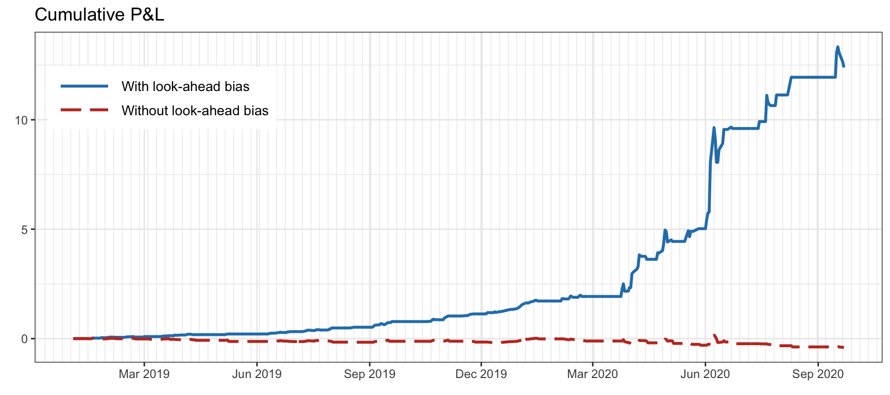
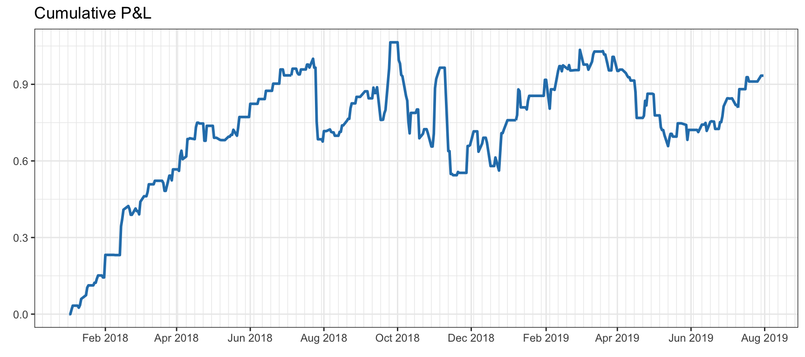
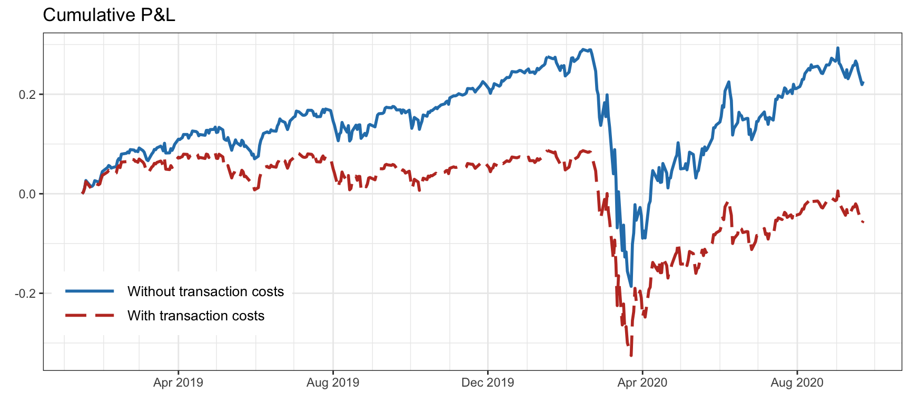
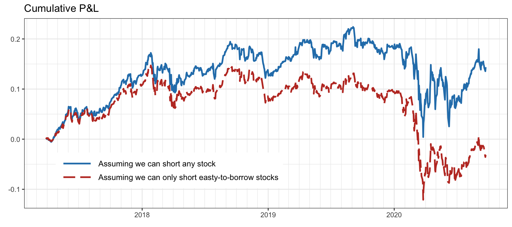
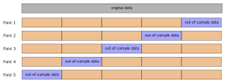
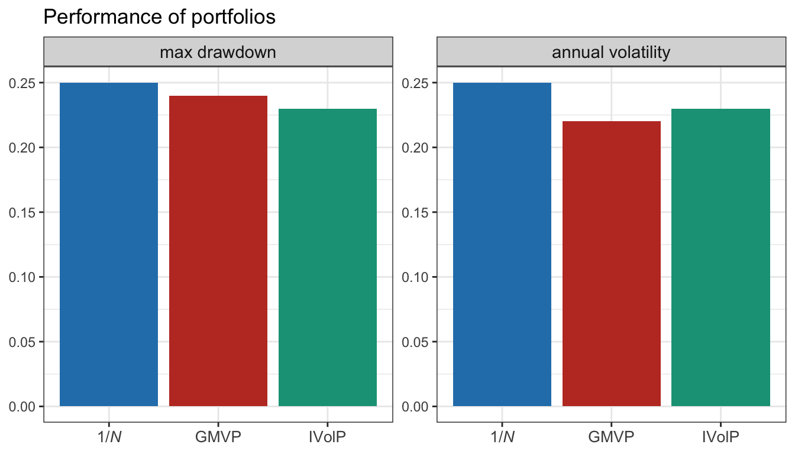
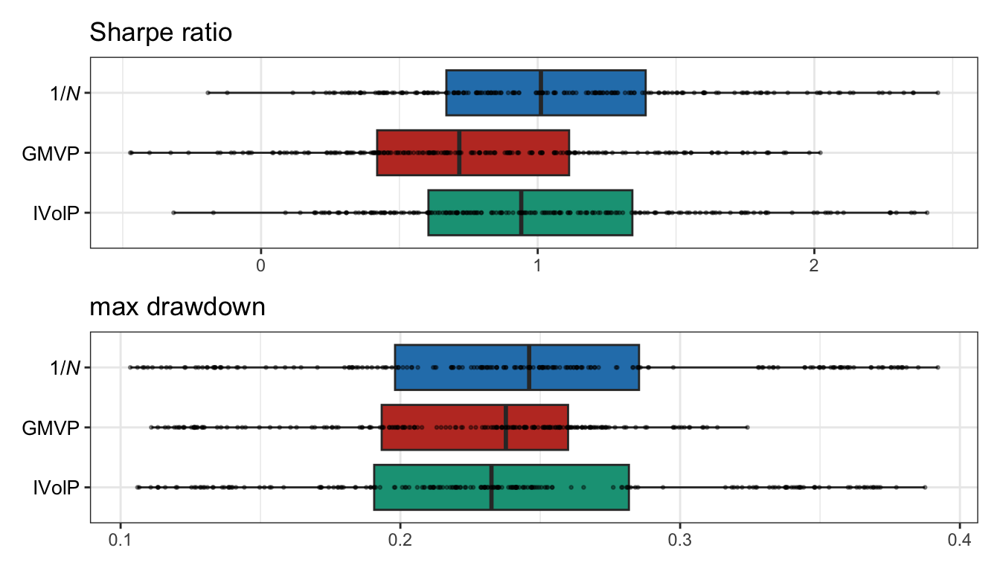
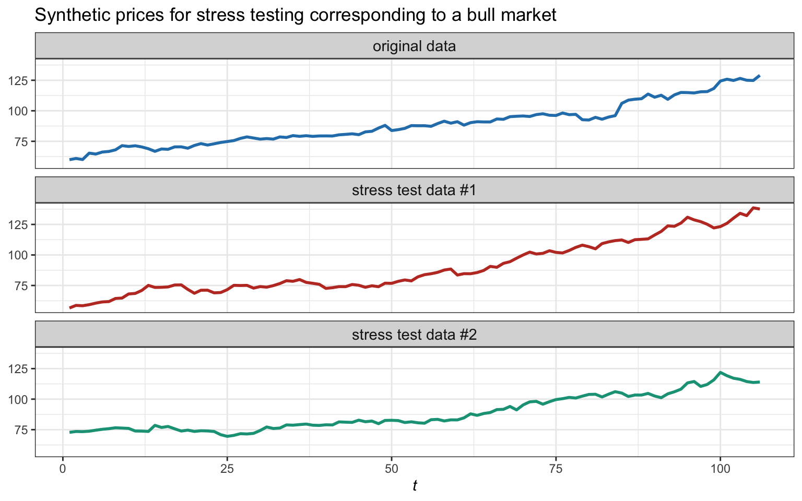
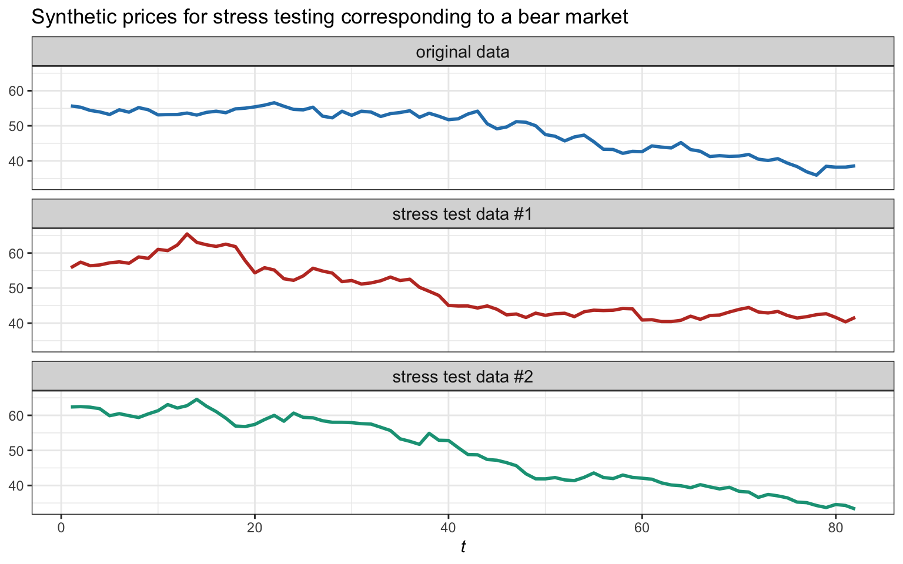

# Portfolio Backtesting {#backtesting}

> "I am a dreamer. I know so little of real life that I just can’t help re-living such moments as these in my dreams, for such moments are something I have very rarely experienced. I am going to dream about you the whole night, the whole week, the whole year."
>
> --- Fyodor Dostoyevsky, _White Nights_

<!---
> “With four parameters I can fit an elephant, and with five I can make him wiggle his trunk.”
>
> --- John von Neumann
--->

\afterquotespace
\acknowledgementCUP

A backtest is a historical simulation of how a strategy would have performed had it been run over a past period of time. It is an essential step prior to actual live trading with real money. Nevertheless, backtesting is one of the least understood techniques in the quant's toolbox.[^quant] The reality is that backtesting is full of dangers and virtually impossible to execute properly. This chapter will explore portfolio backtesting in detail, so that we become aware of all the potential pitfalls.

[^quant]: A quant is a financial professional who uses complex mathematical models, computer algorithms, and statistical analysis to analyze markets, price securities, and identify trading opportunities.

  This material has been published as:
  Daniel P. Palomar (2025). _Portfolio Optimization: Theory and Application_. Cambridge University Press.
  This version is free to view and download for personal use only; not for re-distribution, re-sale, or use in derivative works. ©\ Daniel P. Palomar 2025.

## A Typical Backtest {#typical-backtest}
\index{backtest}
A backtest is a historical simulation of a strategy in some past period of time. We can see backtest results in academic publications, fund brochures, practitioner blogs, and so on.

Since strategies typically require the estimation of some parameters, such as the assets' expected return vector $\bmu$ or covariance matrix $\bSigma$, the data is commonly split into an _in-sample_ dataset, which acts as historical data that can be used to estimate parameters, and an _out-of-sample_ dataset, which serves as "future" data that is used to assess the performance.

As an illustrative example, suppose we want to evaluate three portfolios: the $1/N$ portfolio (see Section\ \@ref(EWP)), the inverse volatility portfolio (IVolP) (see Section\ \@ref(IVolP)), and the global minimum variance portfolio (GMVP) (see Section\ \@ref(GMVP)). Figure\ \@ref(fig:typical-backtest-PnL-drawdown) shows the cumulative P&L and drawdown of these portfolios. This gives an assessment of the behavior of the portfolios over time. In addition, Table\ \@ref(tab:typical-backtest-table) provides more concrete numerical values of different performance measures over the whole period.

(\#fig:typical-backtest-PnL-drawdown)Example of a backtest result in the form of cumulative P\&L and drawdown plots.

<table>
<caption>(\#tab:typical-backtest-table)Example of a backtest result in the form of performance measures.</caption>
 <thead>
  <tr>
   <th style="text-align:left;"> Portfolio </th>
   <th style="text-align:center;"> Sharpe ratio </th>
   <th style="text-align:center;"> Annual return </th>
   <th style="text-align:center;"> Annual volatility </th>
   <th style="text-align:center;"> Sortino ratio </th>
   <th style="text-align:center;"> Max drawdown </th>
   <th style="text-align:center;"> CVaR (0.95) </th>
  </tr>
 </thead>
<tbody>
  <tr>
   <td style="text-align:left;"> 1/$N$ </td>
   <td style="text-align:center;"> 3.23 </td>
   <td style="text-align:center;"> 117\% </td>
   <td style="text-align:center;"> 36\% </td>
   <td style="text-align:center;"> 5.40 </td>
   <td style="text-align:center;"> 11\% </td>
   <td style="text-align:center;"> 5\% </td>
  </tr>
  <tr>
   <td style="text-align:left;"> GMRP </td>
   <td style="text-align:center;"> 2.19 </td>
   <td style="text-align:center;"> 138\% </td>
   <td style="text-align:center;"> 63\% </td>
   <td style="text-align:center;"> 4.09 </td>
   <td style="text-align:center;"> 19\% </td>
   <td style="text-align:center;"> 7\% </td>
  </tr>
  <tr>
   <td style="text-align:left;"> IVolP </td>
   <td style="text-align:center;"> 3.35 </td>
   <td style="text-align:center;"> 113\% </td>
   <td style="text-align:center;"> 34\% </td>
   <td style="text-align:center;"> 5.61 </td>
   <td style="text-align:center;"> 11\% </td>
   <td style="text-align:center;"> 4\% </td>
  </tr>
</tbody>
</table>

Of course, more detailed results could be provided, such as a rolling Sharpe ratio plot over time (see Section\ \@ref(SR)) or a table with performance measures on a monthly basis instead of the overall annualized values. The reader is referred to Section\ \@ref(performance-measures) for a list of common performance measures. 

The Global Investment Performance Standard (GIPS)[^GIPS] is a set of standardized, industry-wide ethical principles that apply to the way investment performance is presented to potential and existing clients of asset managers, regulators, pension funds, financial advisers, and financial companies from around the globe. These standards guide investment firms on how to calculate and present their investment results to prospective clients. GIPS are standards, not laws. Firms do not have to be GIPS compliant; however, the standards provide discipline and claiming compliance with them demonstrates a firm-wide commitment to ethical best practices and that the firm employs strong internal control processes.

[^GIPS]: [www.gipsstandards.org](https://www.gipsstandards.org)

Nevertheless, the fact of the matter is that all these backtest results only provide very limited information on the real performance of the portfolios and, even worse, most likely the results are faulty and misleading. Indeed, this is clearly stated by notable authors, such as @HarveyLiuZhu2016: "Most claimed research findings in financial economics are likely false," and @DePrado2018, "Most backtests published in journals are flawed, as the result of selection bias on multiple tests."

Sections\ \@ref(seven-sins) and\ \@ref(dangers-backtesting) explore the many ways in which backtests are misleading and can provide wrong results. Then, Sections\ \@ref(backtesting-market-data) and\ \@ref(backtesting-synthetic-data) go over details on how to execute backtests as safe as possible. A brief summary is then given in Section\ \@ref(summary-backtest).

## The Seven Sins of Quantitative Investing {#seven-sins}
In 2005, a practitioner report compiled the "Seven Sins of Fund Management" [@Montier2005] (of which sins #1 and #5 are the most directly related to backtesting):

- Sin #1: Forecasting (Pride)
- Sin #2: The illusion of knowledge (Gluttony)
- Sin #3: Meeting companies (Lust)
- Sin #4: Thinking you can out-smart everyone else (Envy)
- Sin #5: Short time horizons and overtrading (Avarice)
- Sin #6: Believing everything you read (Sloth)
- Sin #7: Group-based decisions (Wrath).

In 2014, a team of quants at Deutsche Bank published a study under the suggestive title “Seven Sins of Quantitative Investing” [@Luo_etal2014_sevensins]. These seven sins are a few basic backtesting errors that most journal publications make routinely:

- Sin #1: Survivorship bias
- Sin #2: Look-ahead bias
- Sin #3: Storytelling bias
- Sin #4: Overfitting and data snooping bias
- Sin #5: Turnover and transaction cost
- Sin #6: Outliers
- Sin #7: Asymmetric pattern and shorting cost.

In the following we will go over these seven sins of quantitative investing with illustrative examples. 

### Sin #1: Survivorship Bias
\index{backtest!dangers!survivorship bias}
_Survivorship bias_ is one of the common mistakes investors tend to make. Most people are aware of this bias, but few understand its significance.

Practitioners tend to backtest investment strategies using only those companies that are currently in business and still performing well, most likely listed in some index, such as the S&P 500 stock index. By doing that, they are ignoring stocks that have left the investment universe due to bankruptcy, delisting, being acquired, or simply underperforming the index.

In simple words, survivorship bias happens when you do not take into account stocks that you know in advance will not perform well in the future of the backtest period. Similarly, simply removing stocks from the universe because they have missing values in their data may have a misleading effect.

In fact, most available databases suffer from survivorship bias. In this context, the Center for Research in Security Prices (CRSP)[^CRSP] maintains a comprehensive database of historical stock market data that is considered highly reliable and accurate, making it a valuable resource for those studying finance and investment. CRSP is widely used by academic researchers and financial professionals for conducting empirical research, analyzing historical stock market trends, and developing investment strategies. Figure\ \@ref(fig:survivorship-bias) shows the effect of survivorship bias on the $1/N$ portfolio on the S&P 500 stocks over several years.

[^CRSP]: [www.crsp.org](https://www.crsp.org)

(\#fig:survivorship-bias)Effect of survivorship bias on the S\&P 500 stocks.

Interestingly, the concept of survivorship bias does not happen uniquely in financial investment; it is rather a persistent phenomenon in many other areas. An illustrative example is that of modern-day billionaires who dropped out of college and went on to become highly successful (e.g., Bill Gates and Mark Zuckerberg). These few success stories distort people’s perceptions because they ignore the majority of college dropouts who are not billionaires.

<!---For example, when you hear the typical story of a determined person who has a dream and beats the odds to become, say, a successful CEO or athlete, this is based on successful cases and totally ignores the majority of the cases, which happen to be failures. An illustrative example is that of modern-day billionaries who dropped out of college but went on to become highly successful (e.g., Bill Gates and Mark Zuckerberg). These few success stories distort people’s perceptions because they forget about the thousands of college dropouts who are not billionaires.--->

### Sin #2: Look-Ahead Bias
\index{backtest!dangers!look-ahead bias}
_Look-ahead bias_ is the bias created by using information or data that were unknown or unavailable at the time when the backtesting was conducted. It is a very common bias in backtesting.

An obvious example of look-ahead bias lies in companies’ financial statement data. One has to be certain about the timestamp for each data point and take into account release dates, distribution delays, and backfill corrections.  

A less conspicuous example of look-ahead bias comes from coding errors. This may happen, for instance, when training the parameters of a system using future information or simply when data is pre-processed with statistics collected from the whole block of data. Another common error comes from time alignment errors in the backtesting code. In more detail, computing the portfolio return as $R^\textm{portf}_t = \w_{t}^\T\bm{r}_t$ would be totally incorrect (see \@ref(eq:portfolio-return) for the correct expression) since the design of the portfolio $\w_{t}$ used information up to time $t$ and the returns $\bm{r}_t = (\bm{p}_t - \bm{p}_{t-1})\oslash\bm{p}_{t-1}$ implicitly assume that the position was executed at time $t-1$ (of course this argument becomes invalid if the portfolio $\w_{t}$ is assumed to use information only up to $t-1$, or if the returns are defined with a time lag as $\bm{r}_t = (\bm{p}_{t+1} - \bm{p}_{t})\oslash\bm{p}_{t}$). An illustration of this issue can be found in @Glabadanidis2015 as explained in @Zakamulin2018, where the seemingly amazing performance of a strategy based on moving-average indicators vanishes completely under a proper backtest. 

Figure\ \@ref(fig:look-ahead-bias) illustrates the effect of look-ahead bias (from a time alignment mistake when computing the returns) when trading a single stock with a simple strategy based on a moving average (to be exact, buying when the price is above the moving average of the past 10 values).

(\#fig:look-ahead-bias)Effect of look-ahead bias (from a time alignment mistake) trading a single stock.

### Sin #3: Storytelling Bias
\index{backtest!dangers!storytelling bias}
We all love stories. It is believed that storytelling played a key role in the evolution of the human species. In fact, most bestselling popular science books are based on anecdotal stories, which may or may not have a corresponding solid statistical foundation. This is simply because they appeal to the general public, while statistics do not. Indeed, one of the most important ways to leave a deep impression with your audience is to tell stories rather than simply repeating facts and numbers.

_Storytelling bias_ in financial data (or any other type of data, for that matter) happens when we make up a story ex post (i.e., after the observation of a particular event) to justify some random pattern. This is related to _confirmation bias_, which consists of favoring information that supports one's pre-existing beliefs and ignoring contradicting evidence. Storytelling is pervasive in financial news, where supposed "experts" can justify any random pattern after the fact.

The antidote to storytelling bias is the collection of more historical data to see if the story passes a statistical test or the test of time. Unfortunately, in contrast to fields like physics, economics and finance have a limited number of observations, which hinders the resolution of storytelling bias.

Figure\ \@ref(fig:story-telling-bias) illustrates the effect of story-telling bias by trading a single stock with a position indicated by a random binary sequence (which might have been generated by "Paul the Octopus"[^paul-the-octopus]). Before August 2018 one could be inclined to believe the story that the random sequence was a good predictor of the stock trend; however, eventually, when more data is collected, one has to come to the inevitable conclusion that it was a fluke.

[^paul-the-octopus]: Paul the Octopus was a common octopus used to predict the results of association football matches. Accurate predictions in the 2010 World Cup brought him worldwide attention as an animal oracle. https://en.wikipedia.org/wiki/Paul_the_Octopus

(\#fig:story-telling-bias)Effect of story-telling bias in the form of a random strategy that performs amazingly well until August 2018, but not afterwards.

### Sin #4: Overfitting and Data Snooping Bias
\index{backtest!dangers!overfitting}
\index{backtest!dangers!data snooping bias}
In the fields of computer science and statistics, _data mining_ refers to the computational process of discovering patterns in large data sets, often involving sophisticated statistical techniques, computation algorithms, and large-scale database systems. In principle, there is nothing negative about data mining. In finance, however, it often means manipulating data or models to find the desired pattern that an analyst wants to show.

_Data snooping_ bias in finance (also loosely referred to as data mining bias) refers to the behavior of extensively searching for patterns or rules so that a model fits the data perfectly. Analysts often fine tune the parameters of their models and choose the ones that perform well in the backtesting. This is also referred to as _overfitting_ in the machine learning literature.

With enough data manipulation, one can almost always find a model that performs very well on that data. This is why it is standard practice to split the data into in-sample and out-of-sample data: the in-sample data is used to estimate or train the model and design the portfolio, whereas the out-of-sample data is used to evaluate and test the portfolio. They are also referred to as _training data_ and _test data_, respectively.

With the separation of data into training data and test data, it seems we should be safe; unfortunately, this is not the case. It is almost inevitable for the person or team researching a strategy to iterate the process by which the strategy under design is evaluated with the test data and then some adjustments are performed on the strategy. This is a vicious cycle that leads to catastrophic results. By doing that, the test data has inadvertently been used too many times and it has effectively become part of the training data. Unfortunately, this happens in almost all the publications to the point that one cannot trust published results: "Most backtests published in journals are flawed, as the result of selection bias on multiple tests" [@DePrado2018].

In other words, looking long and hard enough at a given dataset will often reveal one or more models that seems promising but are in fact spurious [@White2000].

One piece of advice that may help avoid overfitting is to avoid fine tuning the parameters [@Chan2008]. Even better, one could perform a sensitivity analysis on the parameters. That is, if a small change in some parameter affects the performance drastically, it is an indication that the strategy is too sensitive and lacks robustness. A sensitive strategy is dangerous because one cannot assess the future behavior with new data with any degree of confidence.

An illustrative example, provided in @ArnottHarveyMarkowitz2019, shows a strategy with an impressive backtest result, only to reveal that the strategy is a preposterous long--short quintile portfolio that goes long on the stocks with an "S" on the third letter of the ticker symbol and goes short on the ones with the letter "U".

Data snooping bias or overfitting is probably the most difficult bias to deal with. The ultimate test after a strategy or portfolio has been designed is to trade it with new data. This can be done in three different levels of accuracy: (i)\ simply wait to collect new data and then perform a proper backtest; (ii)\ use _paper trading_ offered by most brokers, which consists of a realistic trading simulation without real money; and (iii)\ trade with real money, that is, _live trading_, albeit typically starting with a small budget.

Figure\ \@ref(fig:data-snooping-bias) illustrates the effect of data snooping or overfitting by trading a single stock with a strategy based on machine learning. In particular, a linear return forecast with a lookback window of 10 values is trained in two scenarios: using only the training data (as it should be) and using the training + test data (obviously, this produces overfitting). The overfitted backtest seems to indicate prediction power in the out of sample, whereas the reality could not be further from the truth.

(\#fig:data-snooping-bias)Effect of data snooping or overfitting on a backtest after tweaking the strategy too many times.

### Sin #5: Turnover and Transaction Cost
\index{backtest!dangers!ignoring transaction costs}
Backtesting is often conducted in an ideal world: no transaction cost, no turnover constraint, unlimited long and short availability, and perfect liquidity. In reality, all investors are limited by some constraints. We now focus on the turnover and the associated transaction cost.

_Turnover_ refers to the overall amount of orders to be executed when rebalancing the portfolio from $\w_t$ to $\w_{t}^\textm{reb}$, and is calculated as $\|\w_{t}^\textm{reb} - \w_{t}\|_1$. As a first approximation, the transaction costs can be modeled as proportional to the turnover (see Section\ \@ref(transaction-cost) for details). However, if the liquidity is not enough compared to the size of the turnover, then slippage may have a significant effect. This becomes more relevant as the rebalancing frequency increases. In the limit, simulating the transaction cost at the level of the limit order book can be extremely challenging and the only way to be certain about the cost incurred is to actually trade.

Figure\ \@ref(fig:transaction-cost) illustrates the detrimental effect of transaction costs on the daily-rebalanced inverse volatility portfolio on the S&P 500 stocks with fees of 60 bps. The effect of transaction costs slowly accumulates over time.

(\#fig:transaction-cost)Effect of transaction costs on a portfolio  (with daily rebalancing and fees of 60 bps).

The overall transaction cost depends on the turnover per rebalancing and the rebalancing frequency. Portfolios with a high rebalancing frequency are more prone to have an overall large turnover, which translates into high transaction costs. To be on the safe side, either the rebalancing frequency should be kept to a minimum or the turnover per rebalancing should be controlled (see Section\ \@ref(portfolio-rebalancing)). Nevertheless, having too slow a rebalancing frequency may lead to a portfolio that fails to adapt to the changing signal. Thus, deciding the rebalancing frequency of a strategy is a critical step in practice (see Section\ \@ref(portfolio-rebalancing) in Chapter\ \@ref(portfolio-101) for details).

### Sin #6: Outliers
\index{backtest!dangers!outliers}
_Outliers_ are events that do not fit the normal and expected behavior. They are not too uncommon in financial data and they can happen due to different reasons. Some outliers reflect a reality that actually happened due to some historical event. Others may be an artifact of the data itself, perhaps due to a momentaneous lack of liquidity of the market, or an abnormally large execution order, or even some error in the data.

In principle, outliers cannot be predicted and one can only try to be robust to them; this is why robust estimation methods (as in Chapter\ \@ref(iid-modeling)) and robust portfolio techniques (as in Chapter\ \@ref(robust-portfolios)) are important in practice.

The danger when it comes to backtesting is to accidentally benefit from a few outliers, because that would distort the realistic assessment of a portfolio. More often than not, outliers are caused by data errors or specific events that are unlikely to be repeated in the future. Thus, one should not base the success of a portfolio on a few historical outliers, as the future performance will then rely on the realization of similar outliers. How should we then treat outliers in the historical data?

One way to deal with outliers is to control them so that they do not distort the backtest results. Traditional outlier control techniques include: winsorization (capping data at certain percentiles) and truncation/trimming/censoring (removing outliers from data sample). The data normalization process is closely related to outlier control.

Another way to deal with outliers is to keep the outliers, but making sure the potential success of the backtested strategies does not rely on them (unless one is actually trying to design a strategy solely based on outliers).

Figure\ \@ref(fig:outliers) illustrates the effect of outlier control in the design phase of a quintile portfolio with hourly cryptocurrency data. In this case, outliers are removed if they are larger than 5% (recall these are hourly returns).

(\#fig:outliers)Effect of outliers on a backtest with hourly cryptocurrency data.

### Sin #7: Asymmetric Pattern and Shorting Cost
\index{backtest!dangers!ignoring shorting cost}
In typical backtesting, analysts generally assume they can short any stocks at no cost or at the same level of cost. However, we need to be aware that borrowing cost can be prohibitively high for some stocks, while on other occasions, it could be impossible to locate the borrowing. For certain stocks, industries, or countries, there could also be government or exchange imposed rules that prohibit any shorting at all. Indeed, some countries do not allow short selling at all, while others limit its extent.[^shorting-China]

[^shorting-China]: In China, as of 2021, regulators only allow investors to short a portion of stocks traded on the Shanghai and Shenzhen stock exchanges. The list of stocks changes regularly and typically only includes companies with good fundamentals.

For example, in the US market, during the 2008 global financial crisis period borrowing costs sky-rocketed -- some financial stocks were even banned from being shorted, reflected by higher percentages of expensive-to-borrow stocks during this episode.

Interestingly, the effect of short availability not only affects backtests of portfolios that actually short sell but long positions may also suffer from the so-called “limited arbitrage” argument, by which arbitrageurs are prevented from immediately forcing prices to fair values.

How much difference would it make if we cannot short those hard-to-borrow stocks? Figure\ \@ref(fig:shorting-shortage) shows the performance of two long--short quintile portfolios: an unrealistic portfolio that can perfectly long and short the top 20% and bottom 20% of the stocks, respectively, and a more realistic portfolio where only some easy-to-borrow stocks can actually be shorted (the definition of easy-to-borrow stocks used herein is a bit loose for illustration purposes).

(\#fig:shorting-shortage)Effect of shorting availability in a long--short quintile portfolio.

## The Dangers of Backtesting {#dangers-backtesting}
We have learned from the "seven sins of quantitative investing" in Section\ \@ref(seven-sins) that backtesting is a dangerous process, fraught with many potential pitfalls. In fact, there are more than these seven types of errors one can make: "A full book could be written listing all the different errors people make while backtesting" [@DePrado2018].

Arguably, the most common mistake in backtesting involves overfitting or data snooping. The following quote by John von Neumann about the general concept of overfitting is quite amusing and illustrative: "With four parameters I can fit an elephant, and with five I can make him wiggle his trunk" [@MayerKhairyHoward2010].

<!---, as illustrated with the following quotes:

- from the paper [@HarveyLiuZhu2016]:

  > "Most claimed research findings in financial economics are likely false."

- from the book [@DePrado2018]:

  > "Most backtests published in journals are flawed, as the result of selection bias on multiple tests."

- from the paper [@ArnottHarveyMarkowitz2019]:

  > "Tuning 10 different hyper-parameters using k-fold cross-validation is a terrible idea if you are trying to predict returns with 50 years of data (it might be okay if you had millions of years of data)."
--->

### Backtest Overfitting
\index{backtest!dangers!overfitting}
Overfitting is a concept borrowed from machine learning and refers to the situation when a model targets particular (noisy) observations rather than a general and persistent structure in the data. In the context of investment strategies, it takes place when a strategy is developed to perform well on a backtest, by monetizing random historical patterns. Because those random patterns are unlikely to occur again in the future, the strategy so developed will fail. 

This is why the performance of a strategy in the training data (in-sample data) can be totally misleading and we need to resort to test data (out-of-sample data). However, even the performance in the test data can also be totally misleading  [@BaileyBorweinDePradoZhu2014; @BaileyBorweinDePrado2016]. The reason is that, when a researcher is backtesting an investment strategy, it is only natural to try to adjust some of the strategy's parameters to see the effect in the backtest performance. By doing this, typically over and over again, it is inevitable that the test data has indirectly become part of the training data (or cross-validation data) and it is not really test data anymore. This leads to the unfounded belief that a portfolio is going to perform well only to find out when trading live that it does not live up to expectations. This also leads to publications with backtest results that are not representative of reality.

The reality is that it takes a relatively small number of trials to identify an investment strategy with a spuriously high backtested performance, especially for complex strategies. @BaileyBorweinDePradoZhu2014 argued that "Not reporting the number of trials involved in identifying a successful backtest is a similar kind of fraud."

Indeed, what makes backtest overfitting so hard to assess is that the probability of false positives changes with every new test conducted on the same dataset. That information is either unknown by the researcher or not shared with investors or referees. The only backtests that most people share are those that portray supposedly winning investment strategies.

### $p$-Hacking
\index{backtest!dangers!$p$-hacking}
In fact, backtest overfitting due to multiple testing is related to a more general phenomenon in statistics called "$p$-hacking," also known as cherry-picking, data dredging, significance chasing, significance questing, and selective inference. The term $p$-hacking refers to the misuse of data analysis to find patterns in data that can be presented as statistically significant, thus dramatically increasing and understating the risk of false positives. This is done by performing many statistical tests on the data and only reporting those that come back with significant results. We next elaborate on the concepts of $p$-value and $p$-hacking.

In hypothesis testing, one wants to determine whether the data really come from some candidate distribution, the so-called _null hypothesis_. This can be formally assessed via the $p$-value, which is the probability of obtaining the observed results under the assumption that the null hypothesis is correct. A small $p$-value means that there is strong evidence to reject the null hypothesis and accept the alternative hypothesis. Typical thresholds for determining whether a $p$-value is small enough are in the range 0.01--0.05. Thus, if the $p$-value is smaller than the threshold, then we can reject the null hypothesis that the data came from that distribution. The $p$-value is routinely used in all scientific areas, such as physics (to determine whether the data supports or rejects a hypothesis) or medicine (to determine the effectiveness of new drugs).

The term "$p$-hacking" refers to the dangerous practice of testing multiple hypotheses and only reporting (cherry-picking) the one that produces a small $p$-value. For example, a researcher may report a portfolio showing excellent results during the period 1970--2017, but does not reveal that the same result is weaker for the period 1960--2017. Similarly, a portfolio may look profitable using some specific universe of stocks, but it is not reported that a variation of the universe produced a degraded performance. The problem with this practice is that, when reporting the results, typically the number of experiments conducted is omitted. The reader then may wrongly infer that it was a single trial.

Indeed, most of the claimed research findings in financial economics are likely false due to $p$-hacking [@HarveyLiuZhu2016; @Harvey2017]. For example, some observations from @Harvey2017 include: "Empirical research in financial economics relies too much on $p$-values, which are poorly understood in the first place" and "Journals want to publish papers with positive results and this incentivizes researchers to engage in data mining and $p$-hacking."

### Backtests Are Not Experiments
Experiments, for example in physics, are conducted in a lab and can be repeated multiple times to control for different variables. In contrast, a backtest is a historical simulation of how a strategy would have performed in the past. Thus, a backtest is not an experiment, and it does not prove anything.

In fact, a backtest guarantees nothing, not even achieving that Sharpe ratio if we could travel back in time, simply because random draws would have been different and the past would not repeat itself [@DePrado2018].

### The Paradox of Flawless Backtests
The irony of a backtest is that, even if it is flawless, it is probably wrong [@DePrado2018]. Indeed, suppose you have implemented a flawless backtest (i.e., everyone can reproduce your results, you have considered more than the necessary slippage and transaction costs, etc.) and it still shows good performance. Unfortunately, this flawless backtest is still probably wrong. Why?

First of all, only an expert can produce a flawless backtest. This expert must have run a myriad of backtests over the years. So we need to account for the possibility that this is a false discovery, a statistical fluke that inevitably comes up after running multiple tests on the same dataset (i.e., overfitting).

The maddening thing about backtesting is that the better you become at it, the more likely false discoveries will pop up [@DePrado2018].

### Limitations of Backtesting Insights
Backtesting provides us with very little insight into the reason why a particular strategy would have made money [@DePrado2018]. Just as a lottery winner may feel he has done something to deserve his luck, there is always some ex post story.

Regarding financial data, many authors claim to have found hundreds of “alphas” and “factors,” and there is always some convoluted explanation for them. Instead, what they have found are the lottery tickets that won the last game. Those authors never tell us about all the tickets that were sold, that is, the millions of simulations it took to find these “lucky” alphas.

### What is the Point of Backtesting Then?
While backtesting cannot guarantee the future good performance of a strategy, it can serve the opposite purpose, that is, to identify strategies that underperform so that we can eliminate them. 

In addition, a backtest can provide a sanity check on a number of variables, including bet sizing, turnover, resilience to costs, and behavior under a given scenario.

Thus, the purpose of a backtest is to discard bad models, not to improve them. It may sound counter-intuitive, but one should not adjust the model based on the backtest results since it is a waste of time and it is dangerous due to overfitting. 

One should invest time and effort developing a sound strategy. However, by the time backtests are performed, it is too late to modify the strategy. So never backtest until your model has been fully specified [@DePrado2018].

Summarizing, a good backtest can still be extremely helpful, but backtesting well is extremely hard to execute.

### Recommendations to Avoid Overfitting
\index{backtest!best practices}
How to address backtest overfitting is arguably the most fundamental question in quantitative finance. While there is no easy way to prevent backtest overfitting, a number of recommendations were compiled in @DePrado2018 and some are listed here for convenience:

- Develop models for entire asset classes or investment universes, rather than for specific securities, to reduce the probability of false discoveries.

- Apply model averaging (see Chapter\ \@ref(robust-portfolios) for details) as a means to both prevent overfitting and reduce the variance of the forecasting error.

- Do not backtest until all your research is complete (i.e., do not fall into the vicious cycle of keeping tweaking parameters and running the backtest over and over again).

- Keep track of the number of backtests conducted on a dataset so that the probability of backtest overfitting may be estimated and the Sharpe ratio may be properly deflated [@BaileyDePrado2014].

- Apart from backtesting on historical data, consider simulating scenarios rather than history, such as stress tests (see Section\ \@ref(backtesting-synthetic-data) for details). Your strategy should be profitable under a wide range of scenarios, not just the anecdotal historical path.

A list of best research practices for backtesting were proposed in @ArnottHarveyMarkowitz2019, such as:

- Establish an ex ante economic foundation: following the scientific method, a hypothesis is developed and the empirical tests attempt to find evidence inconsistent with the hypothesis.

- Beware an ex post economic foundation: it is also almost always a mistake to create an economic story -- a rationale to justify the findings -- after the data mining has occurred.

- Keep track of the multiple tests tried: this is needed to assess the statistical significance of the results; too many trials and any spurious result can be obtained.

- Define the test sample ex ante: the sample data and data transformations (such as volatility scaling or standardization) should never change after the research begins. 

- Acknowledge that out-of-sample data is not really out of sample: simply because researchers have lived through the hold-out sample and thus understand the history, are knowledgeable about when markets rose and fell, and associate leading variables with past experience. As such, no true out-of-sample data exists; the only true out of sample is the live trading experience.

- Understand iterated out of sample is not out of sample.

- Do not ignore trading costs and fees.
  
- Refrain from tweaking the model.

- Beware of model complexity: pursue simplicity and regularization.
  

### Mathematical Tools to Combat Overfitting
A number of mathematical techniques have been proposed in the past decade to combat backtest overfitting; to name a few:

- A general framework to assess the probability of backtest overfitting was proposed in @BaileyBorweinDePradoZhu2017.

- For the single testing case, the minimum backtest length metric was proposed in @BaileyBorweinDePradoZhu2014 to avoid selecting a strategy with a high Sharpe ratio on in-sample data, but zero or less on out-of-sample data. A _probabilistic Sharpe ratio_ was proposed in @BaileyDePrado2012 to calculate the probability of an estimated SR being greater than a benchmark Sharpe ratio.

- For the multiple testing case, the _deflated Sharpe ratio_ was developed in @BaileyDePrado2014 to provide a more robust performance statistic, in particular, when the returns follow a nonnormal distribution.

- Online tools are presented in @BaileyBorweinDePradoSalehipourZhu2016 to demonstrate how easy it is to overfit an investment strategy, and how this overfitting may affect the financial bottom-line performance.

- Section\ \@ref(multiple-backtests) describes a way to execute multiple randomized backtests that helps the prevention of overfitting.

 

 
 
  
  

## Backtesting with Historical Market Data {#backtesting-market-data}
As we have already discussed, a backtest evaluates the out-of-sample performance of an investment strategy using past observations. These observations can be used in a multitude of ways from the simplest method to more sophisticated versions.

One first classification is according to whether the past observations are used (i)\ directly to assess the historical performance as if the strategy had been run in the past (considered in detail in this section), or (ii)\ indirectly to simulate scenarios that did not happen in the past, such as stress tests (treated in the next section). Each approach has its pros and cons; in fact, both are useful and complement each other.

Assuming the historical data is used directly to assess the performance, we can further differentiate four types of backtest methods:

- vanilla (one-shot) backtest
- walk-forward backtest
- $k$-fold cross-validation backtest
- multiple randomized backtest.

The walk-forward backtest technique is so prevalent that, in fact, the term "backtest" has become a de facto synonym for walk-forward "historical simulation." We now elaborate on these different approaches.

### Vanilla Backtest
\index{backtest!vanilla backtest}
The simplest possible backtest, which we call a _vanilla backtest_, involves dividing the available data into _in-sample data_ and _out-of-sample data_. The in-sample data is used to design the strategy and the out-of-sample to evaluate it. The reason we need two sets of data should be clear by now: if the same data is used to design the strategy and to evaluate it, we would obtain spectacular but unrealistic performance results that would not be representative of the future performance with new data (this is because the strategy would overfit the data).

The in-sample data is typically further divided into _training data_ and _cross-validation (CV) data_, whereas the out-of-sample data is also called _test data_. The training data is used to fit the model, that is, to choose the parameters of the model, whereas the CV data is employed to choose the so-called hyper-parameters. Figure\ \@ref(fig:vanilla-backtest-data-split) illustrates the data split for this type of vanilla backtest. Additionally, one may leave some small gap in between the in-sample and out-of-sample data (to model the fact that one may not be able to execute the designed portfolio immediately).

(\#fig:vanilla-backtest-data-split)Data split in a vanilla backtest.

As an illustrative example, one may divide the available data into 70% in-sample and 30% out-of-sample for testing. The in-sample data may be further divided into 70% for training and 30% for cross validation. The training data may be used, for instance, to estimate the mean vector $\bmu$ and covariance matrix $\bSigma$, whereas the CV data may be used to choose the hyper-parameter $\lambda$ in the mean--variance portfolio formulation (see Section\ \@ref(mean-variance-portfolio)). One can simply try different values of $\lambda$, say, 0.1, 0.5, 1.0, and 2.0, then evaluate the performance of each design with the CV data to choose the best-performing value of $\lambda$. At this point, one can fit the model again (i.e., estimate $\bmu$ and $\bSigma$) using all the in-sample data (i.e., training plus cross-validation data). Finally, one can use the test data to assess the performance of the designed portfolio. 

The result of a vanilla backtest can be seen in Figure\ \@ref(fig:vanilla-backtest-PnL-drawdown) in the form of cumulative P&L and drawdown of the portfolios, as well as in Table\ \@ref(tab:vanilla-backtest-table) in the form of numerical values of different performance measures over the whole period.

(\#fig:vanilla-backtest-PnL-drawdown)Vanilla backtest: cumulative P\&L and drawdown.

<table>
<caption>(\#tab:vanilla-backtest-table)Vanilla backtest: performance measures.</caption>
 <thead>
  <tr>
   <th style="text-align:left;"> Portfolio </th>
   <th style="text-align:center;"> Sharpe ratio </th>
   <th style="text-align:center;"> Annual return </th>
   <th style="text-align:center;"> Annual volatility </th>
   <th style="text-align:center;"> Sortino ratio </th>
   <th style="text-align:center;"> Max drawdown </th>
   <th style="text-align:center;"> CVaR (0.95) </th>
  </tr>
 </thead>
<tbody>
  <tr>
   <td style="text-align:left;"> 1/$N$ </td>
   <td style="text-align:center;"> 1.18 </td>
   <td style="text-align:center;"> 49\% </td>
   <td style="text-align:center;"> 42\% </td>
   <td style="text-align:center;"> 1.63 </td>
   <td style="text-align:center;"> 35\% </td>
   <td style="text-align:center;"> 7\% </td>
  </tr>
  <tr>
   <td style="text-align:left;"> GMRP </td>
   <td style="text-align:center;"> 1.62 </td>
   <td style="text-align:center;"> 105\% </td>
   <td style="text-align:center;"> 65\% </td>
   <td style="text-align:center;"> 2.58 </td>
   <td style="text-align:center;"> 34\% </td>
   <td style="text-align:center;"> 9\% </td>
  </tr>
  <tr>
   <td style="text-align:left;"> IVolP </td>
   <td style="text-align:center;"> 1.14 </td>
   <td style="text-align:center;"> 46\% </td>
   <td style="text-align:center;"> 41\% </td>
   <td style="text-align:center;"> 1.58 </td>
   <td style="text-align:center;"> 34\% </td>
   <td style="text-align:center;"> 6\% </td>
  </tr>
</tbody>
</table>

The vanilla backtest is widely used in academic publications, blogs, fund brochures, and so on. However, it has two main problems:

1. A single backtest is performed, in the sense that a single historical path is evaluated.
2. The execution of the backtest is not representative of the way it would have been conducted in real life, that is, the portfolio is designed once and kept fixed for the whole test period, whereas in real life as new data becomes available the portfolio is updated (this is precisely addressed by the walk-forward backtest).

### Walk-Forward Backtest
\index{backtest!walk-forward backtest}
The _walk-forward backtest_ improves the vanilla backtest by redesigning the portfolio as new data becomes available, effectively mimicking the way it would be done in live trading. It is therefore a historical simulation of how the strategy would have performed in the past (its performance can be reconciled with paper trading). This is the most common backtest method in the financial literature [@Pardo2008]. 

In signal processing, this is commonly referred to as implementation on a _rolling-window_ or _sliding-window_ basis. This means that at time $t$ one will use a window of the past $k$ samples $t-k, \dots, t-1$, called the _lookback window_, as training data or in-sample data. As with the vanilla backtest, one can leave a gap between the last-used observation and the time in which the portfolio is executed (this is to be on the safe side and avoid potential issues, such as look-ahead bias). A variation of the rolling window is the so-called _expanding window_ (also called anchored walk-forward backtest), by which at time $t$ all the previous data is used, that is, all the samples $1,2,\dots,t-1$ (the window is expanding with $t$, hence the name).

Figure\ \@ref(fig:walk-forward-backtest-data-split) illustrates the rolling-window split of data into in-sample and out-of-sample corresponding to a walk-forward backtest.

(\#fig:walk-forward-backtest-data-split)Data splitting in a rolling-window or walk-forward backtest.

The result of a walk-forward backtest with daily reoptimization can be seen in Figure\ \@ref(fig:walk-forward-backtest-PnL-drawdown) in the form of cumulative P&L and drawdown of the portfolios, as well as in Table\ \@ref(tab:walk-forward-backtest-table) in the form of numerical values of different performance measures over the whole period.

(\#fig:walk-forward-backtest-PnL-drawdown)Walk-forward backtest: cumulative P\&L and drawdown.

<table>
<caption>(\#tab:walk-forward-backtest-table)Walk-forward backtest: performance measures.</caption>
 <thead>
  <tr>
   <th style="text-align:left;"> Portfolio </th>
   <th style="text-align:center;"> Sharpe ratio </th>
   <th style="text-align:center;"> Annual return </th>
   <th style="text-align:center;"> Annual volatility </th>
   <th style="text-align:center;"> Sortino ratio </th>
   <th style="text-align:center;"> Max drawdown </th>
   <th style="text-align:center;"> CVaR (0.95) </th>
  </tr>
 </thead>
<tbody>
  <tr>
   <td style="text-align:left;"> 1/$N$ </td>
   <td style="text-align:center;"> 1.10 </td>
   <td style="text-align:center;"> 33\% </td>
   <td style="text-align:center;"> 30\% </td>
   <td style="text-align:center;"> 1.54 </td>
   <td style="text-align:center;"> 35\% </td>
   <td style="text-align:center;"> 5\% </td>
  </tr>
  <tr>
   <td style="text-align:left;"> GMRP </td>
   <td style="text-align:center;"> 0.54 </td>
   <td style="text-align:center;"> 27\% </td>
   <td style="text-align:center;"> 50\% </td>
   <td style="text-align:center;"> 0.75 </td>
   <td style="text-align:center;"> 53\% </td>
   <td style="text-align:center;"> 8\% </td>
  </tr>
  <tr>
   <td style="text-align:left;"> IVolP </td>
   <td style="text-align:center;"> 1.09 </td>
   <td style="text-align:center;"> 31\% </td>
   <td style="text-align:center;"> 28\% </td>
   <td style="text-align:center;"> 1.52 </td>
   <td style="text-align:center;"> 32\% </td>
   <td style="text-align:center;"> 4\% </td>
  </tr>
</tbody>
</table>

Thus, the walk-forward backtest mimics the way live trading would be implemented and is the most common backtest method in  finance. However, it still suffers from two critical issues:

1. It still represents a single backtest, in the sense that a single historical path is evaluated (hence, the danger of overfitting).
2. It is not uncommon to make some mistake with the time alignment and generate leakage (i.e., a form of look-ahead bias where future information leaks and is incorrectly used).

  
### $k$-Fold Cross-Validation Backtest
\index{backtest!cross-validation backtest}
The main drawback of the vanilla backtest and the walk-forward backtest is that a single historical path is evaluated. That is, in both cases a single backtest is performed. The idea in the _$k$-fold cross-validation backtest_ is to test $k$ alternative scenarios (of which only one corresponds to the historical sequence).

In fact, $k$-fold cross-validation is a common approach in machine learning (ML) applications [@JamesWittenHastieTibshirani2013], composed of the following steps:

1. Partition the dataset into $k$ subsets.
2. For each subset $i=1,\dots,k$:
    a. train the ML algorithm on all subsets excluding $i$; and
    b. test the fitted ML algorithm on the subset $i$.

(\#fig:k-fold-cv-backtest-data-split)Data splitting in a $k$-fold cross-validation backtest (with $k=5$).

Figure\ \@ref(fig:k-fold-cv-backtest-data-split) illustrates the $k$-fold cross-validation split of data for $k=5$. An implicit assumption in $k$-fold cross-validation is that the order of the blocks is irrelevant. This is true in many ML applications where the data is i.i.d. With financial data, however, this does not hold. While one may model the returns as uncorrelated, they are clearly not independent (e.g., the absolute values of the returns are highly correlated, as observed in Chapter\ \@ref(stylized-facts), Figures\ \@ref(fig:SP500-volatility-clustering)--\@ref(fig:btc-abs-ACF)).

In fact, leakage refers to situations when the training set contains information that also appears in the test set (it is a form of look-ahead bias). Some techniques can be employed to reduce the likelihood of leakage [@DePrado2018]. Nevertheless, due to the temporal structure in financial data, it is the author's opinion that $k$-fold cross-validation backtests can be very dangerous in practice and are better avoided.

<!---
Some authors have proposed techniques to reduce the likelihood of leakage [@DePrado2018]:

- _Avoid overfitting_: make sure to avoid overfitting so that, even if some leakage happens, the strategy will not be able to profit from it,

- _Safety gap_: purge from the training set all observations too close to the test data, i.e., leave a safety gap before and after the test dataset.

- Other more sophisticated ways to split the data like the combinatorial purged cross-validation method (see Section 12.4 of [@DePrado2018] for details).
--->

Summarizing, some of the issues with the $k$-fold cross-validation backtest include:

1. It is still using a single path of data.
2. It does not have a clear historical interpretation.
3. Most importantly, leakage is possible (and likely) because the training data does not trail the test data.

### Multiple Randomized Backtests {#multiple-backtests}
\index{backtest!multiple randomized backtests}
The main drawback of the vanilla and walk-forward backtests is that a single historical path is evaluated. The $k$-fold cross-validation backtest attempts to address this issue by testing $k$ alternative scenarios; however, there is a significant problem with leakage and, in addition, only one of them corresponds to the historical sequence. With the _multiple randomized backtest_ we can effectively deal with those issues in a satisfactory manner by generating a number of different backtests (each of them representing a different historical path) while respecting the order of training data followed by test data (to avoid leakage).

The basic idea of multiple randomized backtests is very simple:

1. Start with a large amount of historical data (preferably large in time and in assets).
2. Repeat $k$ times:
    a. resample dataset: choose randomly a subset of the $N$ available assets and a (contiguous) subset of the total period of time; and
    b. perform a walk-forward or rolling-window backtest of this resampled dataset.
3. Collect statistics on the results of the $k$ backtests.

(\#fig:multiple-backtest-data-split)Data splitting in multiple randomized backtests.

Figure\ \@ref(fig:multiple-backtest-data-split) illustrates the data split in multiple randomized backtests. For example, if the data contains 500 stocks over a period of 10 years, one can resample the data by choosing, say, 200 randomly chosen stocks over random periods of 2 contiguous years. This will introduce some randomness in each individual dataset and it will span different market regimes encountered over the 10 years. 

To illustrate multiple randomized backtests, we take a dataset of $N=10$ stocks over the period 2017--2020 and generate 200 resamples each with $N=8$ randomly selected stocks and a random period of two years. Then we perform a walk-forward backtest with a lookback window of one year, reoptimizing the portfolio every month. 

Table\ \@ref(tab:multiple-backtest-table) shows the backtest results in table form with different performance measures over the whole period. Figure\ \@ref(fig:multiple-backtest-barplot) plots the barplots of the median values of maximum drawdown and annualized volatility (over the 200 individual backtests), whereas Figure\ \@ref(fig:multiple-backtest-boxplots) shows the boxplots of the Sharpe ratio and maximum drawdown. Clearly, the statistics on the multiple individual backtests provide a more accurate representation of the true capabilities of each portfolio. Nevertheless, it is still valid to say that this does not guarantee any future performance.

<table>
<caption>(\#tab:multiple-backtest-table)Multiple randomized backtest: performance measures.</caption>
 <thead>
  <tr>
   <th style="text-align:left;"> Portfolio </th>
   <th style="text-align:center;"> Sharpe ratio </th>
   <th style="text-align:center;"> Annual return </th>
   <th style="text-align:center;"> Annual volatility </th>
   <th style="text-align:center;"> Sortino ratio </th>
   <th style="text-align:center;"> Max drawdown </th>
   <th style="text-align:center;"> CVaR (0.95) </th>
  </tr>
 </thead>
<tbody>
  <tr>
   <td style="text-align:left;"> 1/$N$ </td>
   <td style="text-align:center;"> 1.01 </td>
   <td style="text-align:center;"> 28\% </td>
   <td style="text-align:center;"> 25\% </td>
   <td style="text-align:center;"> 1.42 </td>
   <td style="text-align:center;"> 25\% </td>
   <td style="text-align:center;"> 4\% </td>
  </tr>
  <tr>
   <td style="text-align:left;"> GMVP </td>
   <td style="text-align:center;"> 0.72 </td>
   <td style="text-align:center;"> 16\% </td>
   <td style="text-align:center;"> 22\% </td>
   <td style="text-align:center;"> 1.01 </td>
   <td style="text-align:center;"> 24\% </td>
   <td style="text-align:center;"> 3\% </td>
  </tr>
  <tr>
   <td style="text-align:left;"> IVolP </td>
   <td style="text-align:center;"> 0.94 </td>
   <td style="text-align:center;"> 24\% </td>
   <td style="text-align:center;"> 23\% </td>
   <td style="text-align:center;"> 1.33 </td>
   <td style="text-align:center;"> 23\% </td>
   <td style="text-align:center;"> 3\% </td>
  </tr>
</tbody>
</table>

(\#fig:multiple-backtest-barplot)Multiple randomized backtests: barplots of maximum drawdown and annualized volatility.

(\#fig:multiple-backtest-boxplots)Multiple randomized backtests: boxplots of Sharpe ratio and maximum drawdown.

Multiple randomized backtests, while not perfect, seem to address the main drawbacks of the other types of backtests covered here. Therefore, in the author's opinion, it is the preferred method for backtesting.

## Backtesting with Synthetic Data {#backtesting-synthetic-data}
\index{backtest!synthetic data}
As we have already discussed, a backtest evaluates the out-of-sample performance of an investment strategy using past observations. Section\ \@ref(backtesting-market-data) has explored different ways to directly use the historical data to assess the performance as if the strategy had been run in the past. This section considers a more indirect way to employ historical data by generating synthetic -- yet realistic -- data to simulate scenarios that did not happen in the past, such as _stress tests_ where different market scenarios are recreated to test the strategy.

_Monte Carlo simulations_ allow us to create synthetic data that resembles a given set of historical data. They can be divided into three categories:

- _Parametric methods_: These postulate and fit a model to the data. Then, they generate as much synthetic data as necessary from the model.
- _Nonparametric methods_: These directly resample the historical data without any modeling.
- _Hybrid methods_: These combine the modeling approach with resampling for the model residual (which can follow a parametric or nonparametric method).

Generating such realistic synthetic data will allow us to backtest a strategy on a large number of unseen, synthetic testing sets, hence reducing the likelihood that the strategy has been fitted to a particular dataset. The quality of the data generated under parametric methods depends on the model assumption: if the model is wrong, the data generated will not be realistic. Nonparametric methods are more robust, but they can also potentially destroy some temporal structure in the data. Hybrid methods are more appealing as they can model as much structure as possible and then the residual data is that generated following either the parametric or nonparametric approach. These methods are compared and illustrated next.

### I.I.D. Assumption
The simplest possible example of a parametric method is based on modeling the returns as i.i.d. and fitting some distribution function, such as Gaussian or preferably a heavy-tailed distribution. Once the parameters of the distribution have been estimated (i.e., the model has been fitted to the data), then synthetic data can be generated, which will resemble (statistically) the original data.

The simplest example of a nonparametric method, also based on assuming the returns are i.i.d., is even simpler to implement: just resample the original returns with replacement.

It is important to emphasize that these two examples of parametric and nonparametric methods are based on the i.i.d. assumption, which obviously does not hold for financial data (e.g., the absolute values of the returns are highly correlated as observed in Chapter\ \@ref(stylized-facts), Figures\ \@ref(fig:SP500-volatility-clustering)--\@ref(fig:btc-abs-ACF)). 

Figure\ \@ref(fig:synthetic-data-iid) illustrates the synthetic generation of return data under the i.i.d. parametric (assuming a Gaussian distribution) and nonparametric methods. Since both methods assume i.i.d. data, they totally destroy the volatility clustering structure present in the original data. In addition, the parametric method is assuming (wrongly) a Gaussian distribution and therefore the generated data does not have the same deep spikes typical of a heavy-tailed distribution. The nonparametric method, on the other hand, includes deep spikes but dispersed over time rather than clustered. We next consider a more realistic case by incorporating the temporal structure.

(\#fig:synthetic-data-iid)Example of an original sequence and two synthetic sequences generated with i.i.d. parametric and nonparametric methods.

### Temporal Structure
To illustrate the hybrid method, suppose now that a more sophisticated model is used to model the expected returns based on the past values of the returns, denoted by $\bmu_t = \bm{f}(\bm{r}_{t-k},\dots,\bm{r}_{t-1})$ (see Chapter\ \@ref(time-series-modeling) for time-series mean models). This means that the returns can be written as the forecast plus some residual error,
$$
\bm{r}_{t} = \bmu_t + \bm{u}_t,
$$
where $\bm{u}_t$ is the zero-mean residual error at time $t$ with covariance matrix $\bSigma$.

An even more sophisticated model can combine the mean model for $\bmu_t$ with a covariance model for $\bSigma_t$:
$$
\bm{r}_{t} = \bmu_t + \bSigma_t^{1/2}\bm{\epsilon}_t,
$$
where $\bm{\epsilon}_t$ is a standardized zero-mean identity-covariance residual error at time $t$. The reader is referred to Chapter\ \@ref(time-series-modeling) for time-series mean and covariance models.

In these more sophisticated modeling cases, we can now take two different approaches to generate the sequence of residuals and, implicitly, the sequence of synthetic returns:

- following the parametric paradigm: we can model the residuals with an i.i.d. model and generate new synthetic residuals; and
- following the nonparametric paradigm: we can just resample the residuals from the historical data.

Figure\ \@ref(fig:synthetic-data-vol-clustering) illustrates the synthetic generation of return data properly modeling the volatility clustering and then using both the parametric (assuming a Gaussian distribution) and nonparametric methods. As expected, the volatility clustering is preserved as it appears in the original data. The parametric method is assuming (wrongly) a Gaussian distribution for the residuals and it could be further improved by employing a heavy-tailed distribution. The nonparametric method, on the other hand, is more robust to modeling errors since it is directly resampling the original residuals.

(\#fig:synthetic-data-vol-clustering)Example of an original sequence and two synthetic sequences generated by modeling the volatility clustering and the residuals with parametric and nonparametric methods.

### Stress Tests
\index{stress tests}
\index{backtest!stress tests}
_Stress tests_ are yet another set of tools in the backtest toolkit. They also fall into the category of synthetic generated data but they are more like an "à la carte menu." The idea is to be able to generate realistic synthetic data recreating different market scenarios, such as the choice of a strong bull market, a weak bull market, a side market, a weak bear market, and a strong bear market.

Other examples of stress tests could consider specific periods of crises such as the stock market crash of October 1987, the Asian crisis of 1997, and the tech bubble that burst in 1999--2000. 

In other words, stress testing tests the resilience of investment portfolios against possible future financial situations. 

Figure\ \@ref(fig:stress-test-bull-market) illustrates the generation of synthetic data for stress testing corresponding to a bull market (the reference bull market period is April--August, 2020). On the other hand, Figure\ \@ref(fig:stress-test-bear-market) illustrates the generation of synthetic data for stress testing corresponding to a bear market (the reference bear market period is September--December, 2018).

(\#fig:stress-test-bull-market)Example of original data corresponding to a bull market and two synthetic generations of bull markets for stress testing.

(\#fig:stress-test-bear-market)Example of original data corresponding to a bear market and two synthetic generations of bear markets for stress testing.

<!---
## Performance statistics

#### General characteristics {-}
The following statistics inform us about the general characteristics of the backtest:

- **Time range**: It specifies the start and end dates. The period used to test the strategy should be sufficiently long to include a comprehensive number of regimes.

- **Average AUM**: This is the average dollar value of the assets under management.

- **Capacity**: A strategy’s capacity can be measured as the highest AUM that delivers a target risk-adjusted performance. A minimum AUM is needed to ensure proper bet sizing and risk diversification. Beyond that minimum AUM, performance will decay as AUM increases, due to higher transaction costs and lower turnover.

- **Leverage**: Leverage measures the amount of borrowing needed to achieve the reported performance. If leverage takes place, costs must be assigned to it. One way to measure leverage is as the ratio of average dollar position size to average AUM.

- **Maximum dollar position size**: This informs us whether the strategy at times took dollar positions that greatly exceeded the average AUM. In general we will prefer strategies that take maximum dollar positions close to the average AUM, indicating that they do not rely on the occurrence of extreme events or outliers.

- **Ratio of longs**: This indicates what proportion of the bets involved long positions. In long-short, market neutral strategies, ideally this value is close to 0.5. If not, the strategy may have a position bias, or the backtested period may be too short and unrepresentative of future market conditions.

- **Frequency of bets**: The number of bets per year in the backtest. A sequence of positions on the same side is considered part of the same bet. A bet ends when the position is flattened or flipped to the opposite side. The number of bets is always smaller than the number of trades. A trade count would overestimate the number of independent opportunities discovered by the strategy.

- **Average holding period**: The average number of days a bet is held. High-frequency strategies may hold a position for a fraction of seconds, whereas low frequency strategies may hold a position for months or even years. Short holding periods may limit the capacity of the strategy. The holding period is related but different to the frequency of bets.

- **Annualized turnover**: It measures the ratio of the average dollar amount traded per year to the average annual AUM. High turnover may occur even with a low number of bets, as the strategy may require constant tuning of the position. High turnover may also occur with a low number of trades, if every trade involves flipping the position between maximum long and maximum short.

- **Correlation to underlying**: This is the correlation between strategy returns
and the returns of the underlying investment universe. When the correlation is significantly positive or negative, the strategy is essentially holding or short-selling the investment universe, without adding much value.

#### Runs statistics {-}
Investment strategies rarely generate returns drawn from an i.i.d. process. Instead, the returns series exhibit frequent runs (uninterrupted sequences of returns of the same sign). We need proper metrics to assess runs.

- **Returns concentration**: the concentration of positive returns can be defined (inspired by the Herfindahl-Hirschman Index (HHI)) as
$$
h^+ = \frac{\sum_{t=1}^{T^+} (w_t^+)^2 - 1/T^+}{1 - 1/T^+} = \left(\frac{E[(r_t^+)^2]}{E[r_t^+]^2} - 1\right)\left(\frac{1}{T^+ - 1}\right)
$$
where $w_t^+$ denotes the normalized positive returns $r_t^+$, $w_t^+ = \frac{r_t^+}{\sum_{t'}r_{t'}^+}$, and $T^+$ is the number of such positive returns. The same can be done with the negative returns. 

- **Drawdown (DD) and Time under Water (TuW)**: DD is the maximum loss suffered by an investment between two consecutive high-watermarks (HWMs)[^1] and TuW is the time elapsed inbetween.

[^1]: HWM: Rolling maximum of the cumulative PnL.

#### Implementation shortfall {-}
Investment strategies often fail due to wrong assumptions regarding execution costs. Some important measurements of this include:

- **Broker fees per turnover**:  fees paid to the broker for turning the portfolio over, including exchange fees.
- **Average slippage per turnover**: execution costs, excluding broker fees, involved in one portfolio turnover. For example, the loss caused by buying a security at a fill-price higher than the mid-price when the order was sent to the broker.
- **Return over turnover (ROT)**: ratio between dollar performance and portfolio turnover.
- **Return on execution costs**: ratio between dollar performance (including brokerage fees and slippage costs) and total execution costs. It should be a large multiple, to ensure that the strategy will survive worse-than-expected execution.

#### Efficiency statistics {-}
- **Sharpe ratio**: suppose that a strategy’s excess returns (in excess of the risk-free rate), $r_t,\; t=1,\dots,T$, are i.i.d. with mean $\mu$ and variance $\sigma^2$. The Sharpe ratio (SR) is defined as $$\textsf{SR} = \frac{\mu}{\sigma}.$$
It evaluates the skills of a particular strategy or investor. Since $\mu$ and $\sigma$ are usually unknown, the true SR value cannot be known for certain and in practice the SR will contain substantial estimation errors.

- **Annualized SR**: SR value, annualized by a factor $\sqrt{a}$, where $a$ is the average number of returns observed per year. This common annualization method relies on the assumption that returns are i.i.d.

- **Information ratio**: SR equivalent of a portfolio that measures its performance relative to a benchmark. The excess return is measured as the portfo lio’s return in excess of the benchmark’s return. The tracking error is estimated as the standard deviation of the excess returns.

Some refinements of the SR, to account for limited observations and repeated trials, include [@DePrado2018]:

- **Probabilistic Sharpe Ratio (PSR)**: it provides an adjusted estimate of SR, by removing the inflationary effect caused by short series with skewed and/or fat-tailed returns.

- **Deflated Sharpe Ratio (DSR)**: is a PSR where the rejection threshold is adjusted to reflect the multiplicity of trials.

#### Attribution {-}
- The purpose of performance attribution is to decompose the PnL in terms of risk classes. 
- For example, a corporate bond portfolio manager typically wants to understand how much of its performance comes from his exposure to the following risks classes: duration, credit, liquidity, economic sector, currency, sovereign, issuer, etc.
- Did his duration bets pay off? What credit segments does he excel at? Or should he focus on his issuer selection skills?

- These risks are not orthogonal, so there is an overlap between them. The sum of the attributed PnL's will not match the total PnL, but at least one is able to compute the Sharpe ratio (or information ratio) per risk class. Example: Barra’s multi-factor method.

- Of equal interest is to attribute PnL across categories within each class. For example, the duration class could be split between short duration (less than 5 years), medium duration (between 5 and 10 years), and long duration (in excess of 10 years).

--->

## Summary {#summary-backtest}
Backtesting of portfolios is an essential part in the process of strategy development and evaluation. Nevertheless, it remains widely misunderstood and the dangers are routinely underestimated. Some of the key points to keep in mind include the following:

-  There are multiple reasons why backtest results have to be taken with "a grain of salt," namely, survivorship bias, look-ahead bias, storytelling bias, overfitting or data-snooping bias, turnover and transaction cost, outliers, and asymmetric pattern and shorting cost, among others.

- Arguably, the single main reason why any backtest may be faulty and misleading is overfitting. 

- Due to these potential pitfalls, one cannot trust any backtest results provided in academic publications, blogs, investment fund brochures, and so on.

- Armed with this knowledge, it is recommended to conduct multiple randomized backtests, perhaps combined with stress tests under different scenarios.

The reader has been warned and provided with tools, and hopefully this will serve as a guide for the future.

## Exercises {#exercises-ch8 -}
\markright{Exercises}

::: {.exercise name="Survivorship bias"}
Download stock price data corresponding to some index over several years and find an example where survivorship bias makes a big difference to the portfolio performance.
:::

::: {.exercise name="Look-ahead bias"}
Download stock price data and find an example where look-ahead bias makes a big difference to the portfolio performance.
:::

::: {.exercise name="Storytelling or confirmation bias"}
Download stock price data and find an example where storytelling or confirmation bias makes a big difference to the portfolio performance.
:::

::: {.exercise name="Overfitting"}
Download stock price data and design a portfolio with overfitting in a way that makes a big difference to the portfolio performance.
:::

\needspace{4\baselineskip}
::: {.exercise name="Turnover and transaction cost"}
Download stock price data and design a portfolio with high turnover so that the performance ignoring and including the transaction cost makes a big difference.
:::

::: {.exercise name="Outliers"}
Download stock price data and find a portfolio example that accidentally benefits from some random outlier during the training phase, but with bad performance during the test phase.
:::

::: {.exercise name="Single vs. multiple backtests"}
Download stock price data and choose several portfolio designs. Then evaluate them first with a single backtest and then with multiple randomized backtests. Find some example where the single backtest is totally misleading compared to the performance statistics obtained from the multiple backtests.
:::

::: {.exercise name="Stress tests"}
Download stock price data and experiment with the generation of synthetic data corresponding to different market regimes of the market data. Then, repeat the experiment with multiple stocks, including the correlation among the stocks.
:::

