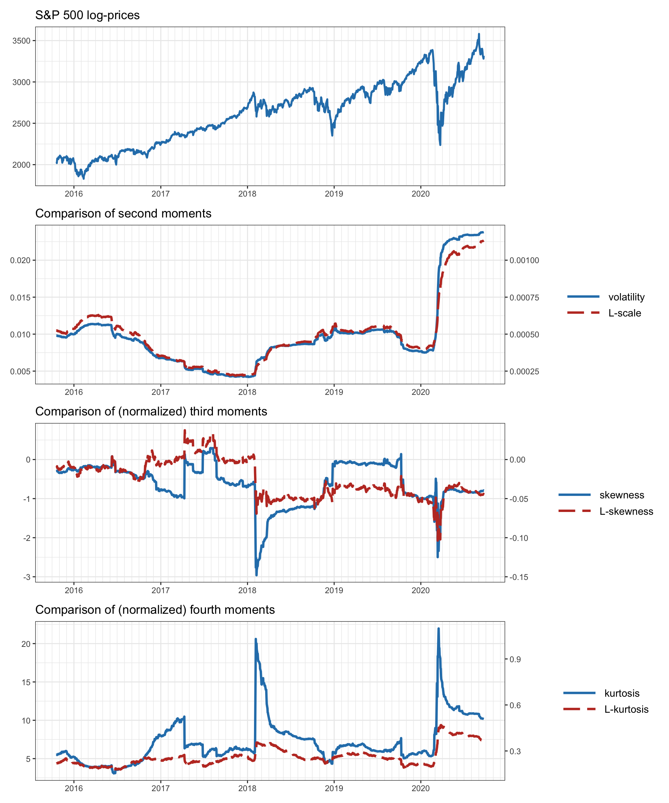
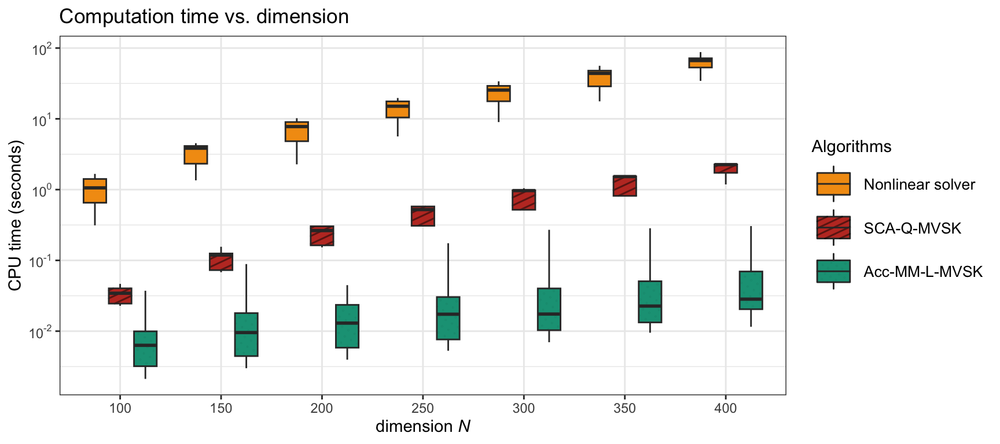
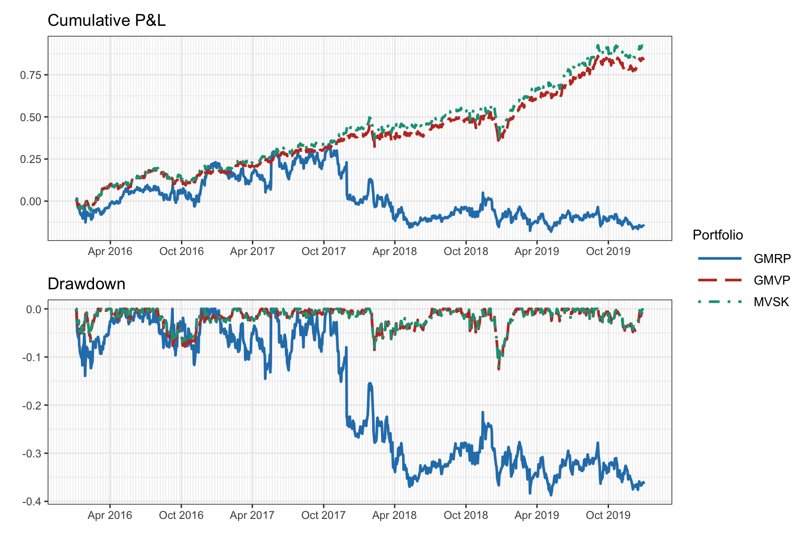
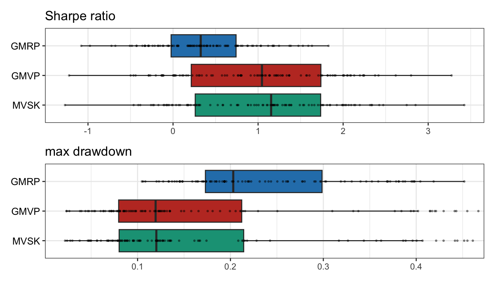

# High-Order Portfolios {#high-order-portfolios}

> The study of economics does not seem to require any specialised gifts of an unusually high order.
>
> --- John Maynard Keynes, _Alfred Marshall_

\afterquotespace
\acknowledgementCUP

Markowitz’s mean--variance portfolio optimizes a trade-off between expected return and risk measured by the variance. However, since financial data is not Gaussian distributed, due to asymmetry and heavy tails in the distribution, it would be reasonable to also incorporate higher-order moments. 

Unfortunately, designing a portfolio based on the first four moments (i.e., mean, variance, skewness, and kurtosis) brings at least two critical difficulties: 

- The dimensionality of the higher-order moments grows as $N^4$, where $N$ is the number of assets, with implications in the complexity of the moment computation, memory storage, and algorithmic manipulation.

- The portfolio formulations are nonconvex, further complicating the design and optimization. 

High-order portfolios were formulated over half a century ago, but have only recently become a practical reality for large numbers of assets in the order of hundreds or even thousands.

  This material has been published as:
  Daniel P. Palomar (2025). _Portfolio Optimization: Theory and Application_. Cambridge University Press.
  This version is free to view and download for personal use only; not for re-distribution, re-sale, or use in derivative works. ©\ Daniel P. Palomar 2025.

 
 
 

## Introduction
Markowitz's mean--variance portfolio [@Markowitz1952] formulates the portfolio design as a trade-off between the expected return $\w^\T\bmu$ and the risk measured by the variance $\w^\T\bSigma\w$ (see Chapter\ \@ref(MPT) for details):
$$
  \begin{array}{ll}
  \underset{\w}{\textm{maximize}} & \w^\T\bmu - \frac{\lambda}{2}\w^\T\bSigma\w\\
  \textm{subject to} & \w \in \mathcal{W},
  \end{array}
$$
where $\lambda$ is a hyper-parameter that controls the investor's risk aversion and $\mathcal{W}$ denotes an arbitrary constraint set, such as $\mathcal{W} = \{\w \mid \bm{1}^\T\w=1, \w\ge\bm{0} \}$.

Nevertheless, decades of empirical studies have clearly demonstrated that financial data do not follow a Gaussian distribution (see Chapter\ \@ref(stylized-facts) for stylized facts of financial data). This implies that it would be reasonable to also incorporate _higher-order moments_ (or _higher-order statistics_), in addition to the first two moments (i.e., mean and variance), in the portfolio formulation. We will consider here the first four moments as an improvement over the first two moments. The third and fourth moments are called _skewness_ and _kurtosis_, respectively. In terms of portfolio optimization, in the same way that a higher expected return and lower variance are desired, we should seek a higher skewness and a lower kurtosis (i.e., higher odd moments and lower even moments) [@ScottHorvath1980].

Figure\ \@ref(fig:skew-t) shows the skewed $t$ probability distribution function with different degrees of skewness (controlled by the parameter $\gamma$, with $\gamma=0$ for the symmetric case) and kurtosis (controlled by the parameter $\nu$, with $\nu\rightarrow\infty$ for the non-heavy-tailed case).

(\#fig:skew-t)Illustration of skewness and kurtosis with the skewed $t$ distribution.

The higher moments are definitely important and, for example, a skew-adjusted Sharpe ratio was proposed in @ZakamoulineKoekebakker2009:
$$
\textm{skew-adjusted-SR} = \textm{SR} \times \sqrt{1 + \frac{\textm{skewness}}{3}\textm{SR}}.
$$

Thus, the idea is to have a portfolio formulation where investors may accept lower expected return and/or higher volatility, compared to the mean--variance benchmark, in exchange for higher skewness and lower kurtosis.

### High-Order Portfolios
As will be elaborated in the next section, the third and fourth moments of the portfolio are given by the expressions $\w^\T\bm{\Phi}(\w\otimes\w)$ and $\w^\T\bm{\Psi}(\w\otimes\w\otimes\w)$, respectively, where $\bm{\Phi} \in \R^{N\times N^2}$ is the co-skewness matrix, and $\bm{\Psi} = \in \R^{N\times N^3}$ is the co-kurtosis matrix.

Unfortunately, the incorporation of the third and fourth moments into the portfolio formulation brings two critical issues:

- Due to the dimensions of the co-skewness and co-kurtosis matrices, their computation, storage in memory, and algorithmic manipulation will be extremely challenging and severely limiting.
- The third moment is a nonconvex function of the portfolio $\w$. This will make the high-order portfolio formulations complicated and the design of numerical algorithms more involved.

### Historical Perspective
Portfolio formulations incorporating high-order moments go back to the 1960s [@YoungTrent1969; @Jean1971]. However, the estimation of such high-order moments was an absolute impasse in those early days, the main problem being the dimensionality issue (recall that the co-skewness matrix is $N\times N^2$ and the co-kurtosis matrix is $N\times N^3$), which means that the number of parameters quickly grows with the number of assets, with detrimental consequences in terms of the amount of data required for the estimation, the computational cost, and the storage needs. As a consequence, some authors have shown skepticism regarding the portfolio formulation based on high-order moments [@BrandtSantaClaraValkanov2009]:

> extending the traditional approach beyond first and second moments, when the investor’s utility function is not quadratic, is practically impossible because it requires modeling [ ...] the numerous higher-order cross-moments.

We had to wait for half a century to start finding publications proposing improved estimation methods, such as introducing structure and shrinkage in the high-order parameters [@MartelliniZiemann2010; @BoudtLuPeeters2015] or assuming parametric multivariate distributions, to drastically reduce the number of parameters to estimate [@BirgeChavez2016; @WangZhouYingPalomar2023]. As empirically shown in @MartelliniZiemann2010, unless improved estimators are employed, incorporating third and fourth moments in the portfolio design is detrimental in terms of out-of-sample performance.

In addition, apart from the estimation difficulties, the algorithmic part of the portfolio design has been extremely challenging. Since the high-order problem formulations are nonconvex, one approach is to use meta-heuristic optimization tools, such as genetic algorithms or differential evolution [@BoudtLuPeeters2015], which attempt to find the global solution at the expense of a very high computational cost, but this becomes prohibitive when the problem dimension grows. Local optimization methods are a reasonable practical alternative by finding a locally optimal solution with acceptable computational cost.

A method based on difference-of-convex (DC) programming was proposed to solve high-order portfolio problems to a stationary point [@DinhNiu2011], but convergence is slow and it is only applicable to low-dimensional problems. An improved method was proposed based on the difference of convex sums of squares (DC-SOS) decomposition techniques [@NiuWang2019], but the complexity of computing the gradients of high-order moments grows rapidly with the problem dimension. The classical gradient descent method and backtracking line search also become inapplicable when the problem dimension grows large.

Faster methods were developed in @ZhouPalomar2021 based on the successive convex approximation (SCA) framework [@ScuFacSonPal2014], which solves the original difficult problem by constructing and solving a sequence of convex approximated problems whose solutions converge to a stationary point of the original problem (see Appendix\ \@ref(optimization-algorithms) for details on the SCA framework). The obtained algorithms converge much faster, although each iteration still requires a significant computational cost due to the computation of gradients and Hessians of high-order moments, allowing high-dimensional settings on the order of hundreds of assets, but not higher.

In @BirgeChavez2016 and @WangZhouYingPalomar2023, the computational cost of high-order moments was significantly reduced via a multivariate parametric model of the data, and in @WangZhouYingPalomar2023 even faster numerical methods were developed that can be employed in very large dimensions with hundreds or thousands of assets.

Thus, practical high-order portfolios are now a reality after more than half a century of research by the scientific community.

## High-Order Moments {#high-order-moments}
The first two moments of a random variable are enough to characterize its distribution only if it follows a Gaussian or normal distribution; otherwise, higher-order moments, also termed higher-order statistics, are necessary.

\index{high-order moments}
The first four moments of a random variable $X$ are

- the mean or first moment (measure of location): $\bar{X} \triangleq \E\left[X\right]$;
- the variance or second central moment (measure of dispersion): $\E[(X - \bar{X})^2]$;
- the _skewness_[^skewness] or third central moment (measure of asymmetry): $\E[(X - \bar{X})^3]$; and
- the _kurtosis_[^kurtosis] or fourth central moment (measure of thickness of tails): $\E[(X - \bar{X})^4]$.

[^skewness]: The skewness is actually defined as the standardized or normalized third moment $\E\left[\left((X - \bar{X})/\textm{Std}[X]\right)^3\right]$, where $\textm{Std}[X]$ is the standard deviation of $X$.

[^kurtosis]: The kurtosis is similarly defined as the standardized or normalized fourth moment $\E\left[\left((X - \bar{X})/\textm{Std}[X]\right)^4\right]$.

Next, we explore the expressions of the high-order statistics for the portfolio return.

### Nonparametric Case
\index{high-order moments!portfolio moments}
In the portfolio context with a universe of $N$ assets, we denote by $\bm{r}\in\R^N$ the returns of the $N$ assets and by $\w\in\R^N$ the portfolio weights. Then, the return of this portfolio is $\w^\T\bm{r}$ and the first four moments are given by
\begin{equation}
\begin{aligned}
\phi_1(\w) & \triangleq \E\left[\w^\T\bm{r}\right] = \w^\T\bmu,\\
\phi_2(\w) & \triangleq \E\left[\left(\w^\T\bm{\bar{r}}\right)^2\right] = \w^\T\bSigma\w,\\
\phi_3(\w) & \triangleq \E\left[\left(\w^\T\bm{\bar{r}}\right)^3\right] = \w^\T\bm{\Phi}(\w\otimes\w),\\
\phi_4(\w) & \triangleq \E\left[\left(\w^\T\bm{\bar{r}}\right)^4\right] = \w^\T\bm{\Psi}(\w\otimes\w\otimes\w),
\end{aligned}
(\#eq:portf-moments)
\end{equation}
where $\bmu = \E[\bm{r}] \in \R^N$ is the mean vector, $\bm{\bar{r}} = \bm{r} - \bmu$ are the centered returns, $\bSigma = \E\left[\bm{\bar{r}}\bm{\bar{r}}^\T\right] \in \R^{N\times N}$ is the covariance matrix, $\bm{\Phi} = \E\left[\bm{\bar{r}}(\bm{\bar{r}}\otimes\bm{\bar{r}})^\T\right] \in \R^{N\times N^2}$ is the co-skewness matrix, and $\bm{\Psi} = \E\left[\bm{\bar{r}}(\bm{\bar{r}}\otimes\bm{\bar{r}}\otimes\bm{\bar{r}})^\T\right] \in \R^{N\times N^3}$ is the co-kurtosis matrix.

The gradients and Hessians of the moments, required by numerical algorithms, are given by
\begin{equation}
\begin{aligned}
\nabla\phi_1(\w) &= \bmu,\\
\nabla\phi_2(\w) &= 2\,\bSigma\w,\\
\nabla\phi_3(\w) &= 3\,\bm{\Phi}(\w\otimes\w),\\
\nabla\phi_4(\w) &= 4\,\bm{\Psi}(\w\otimes\w\otimes\w)\\
\end{aligned}
(\#eq:portf-moments-grad)
\end{equation}
and
\begin{equation}
\begin{aligned}
\nabla^2\phi_1(\w) &= \bm{0},\\
\nabla^2\phi_2(\w) &= 2\,\bSigma,\\
\nabla^2\phi_3(\w) &= 6\,\bm{\Phi}(\bm{I}\otimes\w),\\
\nabla^2\phi_4(\w) &= 12\,\bm{\Psi}(\bm{I}\otimes\w\otimes\w),
\end{aligned}
(\#eq:portf-moments-hessian)
\end{equation}
respectively [@ZhouPalomar2021].

#### Complexity Analysis {-}
The main problem with high-order moments is the sheer number of elements required to characterize them. This has direct implications on the computational cost, as well as the memory cost.

To simplify the analysis, rather than characterizing the exact cost or complexity, we are just interested in how the complexity grows with the dimensionality $N$. This can be done with the "big O" notation, which measures the order of complexity. To be specific, we say that the complexity is $f(N) = \bigO\left(g(N)\right)$, as $N\rightarrow\infty$, if there exists a positive real number $M$ and $N_0$ such that $|f(N)| \leq Mg(N)$ for all $N\geq N_0$.

Let us start by looking at the four parameters $\bmu$, $\bSigma$, $\bm{\Phi}$, and $\bm{\Psi}$. From their dimensions, we can infer that their complexity is $\bigO(N)$, $\bigO(N^2)$, $\bigO(N^3)$, and $\bigO(N^4)$, respectively. The computation of the portfolio moments in \@ref(eq:portf-moments) has the same complexity order. Regarding the gradients in \@ref(eq:portf-moments-grad), their computation has complexity $\bigO(1)$, $\bigO(N^2)$, $\bigO(N^3)$, and $\bigO(N^4)$, respectively. Finally, the complexity of the computation of the Hessians in \@ref(eq:portf-moments-hessian) is $\bigO(1)$, $\bigO(1)$, $\bigO(N^3)$, and $\bigO(N^4)$, respectively.

For example, when $N=200$, storing the co-kurtosis matrix $\bm{\Psi}$ requires almost 12$\,$GB of memory (assuming a floating-point number is represented with 64 bits or 8 bytes).

Summarizing, while the complexity order of the first and second moments in Markowitz's portfolio is $\bigO(N^2)$, further incorporating the third and fourth moments increases the complexity order to $\bigO(N^4)$, which severely limits the practical application to scenarios with small number of assets.

### Structured Moments
One way to reduce the number of parameters to be estimated in the high-order moments is by introducing some structure in the high-order moment matrices via factor modeling (see Chapter\ \@ref(iid-modeling)). This will, however, make the estimation process much more complicated due to the intricate structure in the matrices.

\index{high-order moments!structured moments}
Consider a single market-factor model of the returns,
$$
\bm{r}_t = \bm{\alpha} + \bm{\beta} r^\textm{mkt}_t + \bm{\epsilon}_t,
$$
where $\bm{\alpha}$ and $\bm{\beta}$ are the so-called "alpha" and "beta," respectively, $r^\textm{mkt}_t$ is the market index, and $\bm{\epsilon}_t$ the residual. Then, the moments can be written [@MartelliniZiemann2010] as
\begin{equation}
\begin{aligned}
\bmu & = \bm{\alpha} + \bm{\beta} \phi^\textm{mkt}_1,\\
\bSigma & = \bm{\beta}\bm{\beta}^\T \phi^\textm{mkt}_2 + \bSigma_\epsilon,\\
\bm{\Phi} & = \bm{\beta}\left(\bm{\beta}^\T \otimes \bm{\beta}^\T\right) \phi^\textm{mkt}_3 + \bm{\Phi}_\epsilon,\\
\bm{\Psi} & = \bm{\beta}\left(\bm{\beta}^\T \otimes \bm{\beta}^\T \otimes \bm{\beta}^\T\right) \phi^\textm{mkt}_4 + \bm{\Psi}_\epsilon,
\end{aligned}
(\#eq:portf-moments-single-factor)
\end{equation}
where $\phi^\textm{mkt}_i$ denotes the $i$th moment of the market factor, and $\bSigma_\epsilon$, $\bm{\Phi}_\epsilon$, and $\bm{\Psi}_\epsilon$ are the covariance, co-skewness, and co-kurtosis matrices of the residuals $\bm{\epsilon}_t$, respectively.

Alternatively, we can assume a multi-factor model of the returns,
$$
\bm{r}_t = \bm{\alpha} + \bm{B} \bm{f}_t + \bm{\epsilon}_t,
$$
where $\bm{f}_t\in\R^K$ contains the $K$ factors (typically with $K\ll N$). Then, the moments can be written [@BoudtLuPeeters2015] as
\begin{equation}
\begin{aligned}
\bmu & = \bm{\alpha} + \bm{B} \bm{\phi}^\textm{factors}_1,\\
\bSigma & = \bm{\beta}\bm{\Phi}^\textm{factors}_2\bm{\beta}^\T + \bSigma_\epsilon,\\
\bm{\Phi} & = \bm{\beta}\bm{\Phi}^\textm{factors}_3\left(\bm{\beta}^\T \otimes \bm{\beta}^\T\right) + \bm{\Phi}_\epsilon,\\
\bm{\Psi} & = \bm{\beta}\bm{\Phi}^\textm{factors}_4\left(\bm{\beta}^\T \otimes \bm{\beta}^\T \otimes \bm{\beta}^\T\right) + \bm{\Psi}_\epsilon,
\end{aligned}
(\#eq:portf-moments-multiple-factors)
\end{equation}
where $\bm{\phi}^\textm{factors}_1$ denotes the mean, and $\bm{\Phi}^\textm{factors}_2$, $\bm{\Phi}^\textm{factors}_3$, and $\bm{\Phi}^\textm{factors}_4$, the covariance matrix, co-skewness matrix, and co-kurtosis matrix of the multiple factors in $\bm{f}_t$, respectively.

In addition to the structure provided by factor modeling, another technique is via shrinkage, see @MartelliniZiemann2010 and @BoudtCornillyVerdonck2020.

### Parametric Case

#### Multivariate Normal Distribution {-}
A multivariate normal (or Gaussian) distribution with mean $\bmu$ and covariance matrix $\bSigma$ is characterized by the probability density function
$$
f_\textm{mvn}(\bm{x}) = \frac{1}{\sqrt{(2\pi)^N|\bSigma|}} \textm{exp}\left(-\frac{1}{2}(\bm{x} - \bmu)^\T\bSigma^{-1}(\bm{x} - \bmu)\right).
$$
A random vector $\bm{x}$ drawn from the normal distribution $f_\textm{mvn}(\bm{x})$ is denoted by
$$
\bm{x} \sim \mathcal{N}(\bmu, \bSigma).
$$

Nevertheless, decades of empirical studies have clearly demonstrated that financial data do not follow a Gaussian distribution (see Chapter\ \@ref(stylized-facts) for stylized facts of financial data). Thus, we need more general distributions that can model the skewness (i.e., asymmetry) and kurtosis (i.e., heavy tails).

#### Multivariate Normal Mixture Distributions {-}
The multivariate normal can be generalized to obtain multivariate normal mixture distributions. The crucial idea is the introduction of randomness into first the covariance matrix and then the mean vector of a multivariate normal distribution via a positive mixing variable, denoted by $w$ [@McNeilFreyEmbrechts2015].

A multivariate normal _variance mixture_ can be represented as
$$
\bm{x} = \bmu + \sqrt{w}\bm{z},
$$
where $\bmu$ is referred to as the _location vector_, $\bm{z} \sim \mathcal{N}(\bm{0}, \bSigma)$ with $\bSigma$ referred to as the _scatter matrix_, and $w$ is a nonnegative scalar-valued random variable independent of $\bm{z}$. Observe that the random variable $w$ only affects the covariance matrix, but not the mean,
$$
\begin{aligned}
\E[\bm{x}] &= \bmu,\\
\textm{Cov}(\bm{x}) &= \E[w]\bSigma,
\end{aligned}
$$
hence the name variance mixture.

One important example of a normal variance mixture is the _multivariate $t$_ distribution, obtained when $w$ follows an inverse gamma distribution $w \sim \textm{Ig}\left(\frac{\nu}{2}, \frac{\nu}{2}\right)$, which is equivalent to saying that $\tau=1/w$ follows a gamma distribution $\tau \sim \textm{Gamma}\left(\frac{\nu}{2}, \frac{\nu}{2}\right)$.[^gamma] This can be represented in a hierarchical structure as
$$
\begin{aligned}
\bm{x} \mid \tau &\sim \mathcal{N}\left(\bmu, \frac{1}{\tau}\bSigma\right),\\
\tau &\sim \textm{Gamma}\left(\frac{\nu}{2}, \frac{\nu}{2}\right).
\end{aligned}
$$

[^gamma]: $\textm{Gamma}(a,b)$ represents the gamma distribution of shape $a$ and rate $b$, which has the pdf
$$f(\tau \mid a,b) = b^a \tau^{a-1} \frac{\textm{exp}(-b\tau)}{\Gamma(a)},$$ where $\Gamma(a)$ is the gamma function, $\Gamma(a) = \int_0^\infty t^{a-1}e^{-t}\,\mathrm{d}t$.

The multivariate $t$ distribution (also called Student's $t$ distribution) is widely used to model heavy tails (via the parameter $\nu$) in finance and other areas. However, it cannot capture the asymmetries observed in financial data.

A more general case of normal variance mixture is the _multivariate symmetric generalized hyperbolic_ distribution, obtained when $w$ follows a generalized inverse Gaussian (GIG) distribution, which contains the inverse gamma distribution as a particular case. But this distribution still cannot capture asymmetries since it is a variance mixture. In order to model asymmetry, the mixture has to affect the mean as well.

A multivariate normal _mean--variance mixture_ can be represented as
$$
\bm{x} = \bm{m}(w) + \sqrt{w}\bm{z},
$$
where $\bm{m}(w)$ is now some function of $w$ and the rest is as before for variance mixtures. A typical example of $\bm{m}(w)$ is $\bm{m}(w) = \bmu + w\bm{\gamma}$, leading to
$$
\begin{aligned}
\E[\bm{x}] &= \bmu + \E[w]\bm{\gamma},\\
\textm{Cov}(\bm{x}) &= \E[w]\bSigma + \textm{var}(w)\bm{\gamma}\bm{\gamma}^\T.
\end{aligned}
$$

An example of a mean--variance mixture is the _multivariate generalized hyperbolic_ (GH) distribution, obtained when $\bm{m}(w) = \bmu + w\bm{\gamma}$ and $w$ follows a GIG distribution. If the GIG distribution is further particularized to an inverse gamma distribution, then the _multivariate skewed $t$_ distribution (or _generalized hyperbolic multivariate skewed $t$_ (ghMST)) is obtained, which can be conveniently represented in a hierarchical structure as
$$
\begin{aligned}
\bm{x} \mid \tau &\sim \mathcal{N}\left(\bmu + \frac{1}{\tau}\bm{\gamma}, \frac{1}{\tau}\bSigma\right),\\
\tau &\sim \textm{Gamma}\left(\frac{\nu}{2}, \frac{\nu}{2}\right).
\end{aligned}
$$

Other distributions more general than the ghMST could be considered, such as the restricted multivariate skewed $t$ (rMST) distribution and the unrestricted multivariate skewed $t$ (uMST) distribution; see @WangZhouYingPalomar2023 and references therein for more details. However, these more complex distributions are significantly more complicated to fit to data (e.g., the uMST can only be fitted for $N<10$ in practice due to the computational complexity) and do not seem to provide any advantage in modeling the asymmetries of financial data. Figure\ \@ref(fig:likelihood-multivariate) shows the goodness of fit (via the out-of-sample likelihood of the fit) of several multivariate distributions from the simplest Gaussian to the most complicated uMST. The skewed $t$ distribution seems to obtain a good fit while preserving its simplicity.
<!---
The best distributions seem to be the Student's $t$ distribution (which models heavy tails but not asymmetry) and the skewed $t$ distribution (which can further model asymmetry).

Thus, it seems that a good choice for modeling financial data is the multivariate skewed $t$ distribution.
--->

(\#fig:likelihood-multivariate)Likelihood of different fitted multivariate distributions for S\&P 500 daily stock returns.

#### Parametric Moments {-}
\index{high-order moments!portfolio parametric moments}
The advantage of assuming a parametric model for the data is that the computation of the moments simplifies a great deal. To be specific, under the multivariate skewed $t$ distribution, the first four moments are conveniently simplified [@BirgeChavez2016; @WangZhouYingPalomar2023] to
\begin{equation}
\begin{aligned}
\phi_1(\w) & = \w^\T\bmu + a_1 \w^\T\bm{\gamma},\\
\phi_2(\w) & = a_{21}\w^\T\bSigma\w + a_{22}(\w^\T\bm{\gamma})^2,\\
\phi_3(\w) & = a_{31}(\w^\T\bm{\gamma})^3 + a_{32}(\w^\T\bm{\gamma})\w^\T\bSigma\w,\\
\phi_4(\w) & = a_{41}(\w^\T\bm{\gamma})^4 + a_{42}(\w^\T\bm{\gamma})^2\w^\T\bSigma\w + a_{43}(\w^\T\bSigma\w)^2,
\end{aligned}
(\#eq:portf-moments-skew-t)
\end{equation}
where $a_1=\frac{\nu}{\nu-2}$, $a_{21}=a_1$, $a_{22}=\frac{2\nu^2}{(\nu-2)^2(\nu-4)}$, $a_{31}=\frac{16\nu^3}{(\nu-2)^3(\nu-4)(\nu-6)}$, $a_{32}=\frac{6\nu^2}{(\nu-2)^2(\nu-4)}$, $a_{41}=\frac{(12\nu+120)\nu^4}{(\nu-2)^4(\nu-4)(\nu-6)(\nu-8)}$, $a_{42}=\frac{6(2\nu+4)\nu^3}{(\nu-2)^3(\nu-4)(\nu-6)}$, and $a_{43}=\frac{3\nu^2}{(\nu-2)(\nu-4)}$.

<!---
$$
\begin{aligned}
a_1 &= \frac{\nu}{\nu-2}, & a_{21} &= a_1,\\
a_{22} &= \frac{2\nu^2}{(\nu-2)^2(\nu-4)}, & a_{31} &= \frac{16\nu^3}{(\nu-2)^3(\nu-4)(\nu-6)},\\
a_{32} &= \frac{6\nu^2}{(\nu-2)^2(\nu-4)}, & a_{41} &= \frac{(12\nu+120)\nu^4}{(\nu-2)^4(\nu-4)(\nu-6)(\nu-8)},\\
a_{42} &= \frac{6(2\nu+4)\nu^3}{(\nu-2)^3(\nu-4)(\nu-6)}, & \qquad a_{43} &= \frac{3\nu^2}{(\nu-2)(\nu-4)}.
\end{aligned}
$$
--->

It is important to emphasize that now $\bmu$ refers to the location vector and not the mean; similarly, $\bSigma$ now refers to the scatter matrix and not the covariance matrix.

The gradients and Hessians are given by
\begin{equation}
\begin{aligned}
\nabla\phi_1(\w) &= \bmu + a_1 \bm{\gamma},\\
\nabla\phi_2(\w) &= 2a_{21}\bSigma\w + 2a_{22}(\w^\T\bm{\gamma})\bm{\gamma},\\
\nabla\phi_3(\w) &= 3a_{31}(\w^\T\bm{\gamma})^2\bm{\gamma} + a_{32}\left((\w^\T\bSigma\w)\bm{\gamma} + 2(\w^\T\bm{\gamma})\bSigma\w\right),\\
\nabla\phi_4(\w) &= 4a_{41}(\w^\T\bm{\gamma})^3\bm{\gamma}\\
 &\quad + 2a_{42}\left((\w^\T\bm{\gamma})^2\bSigma\w + (\w^\T\bSigma\w)(\w^\T\bm{\gamma})\bm{\gamma}\right) + 4a_{43}(\w^\T\bSigma\w)\bSigma\w\\
\end{aligned}
(\#eq:portf-moments-skew-t-grad)
\end{equation}
and
\begin{equation}
\begin{aligned}
\nabla^2\phi_1(\w) &= \bm{0},\\
\nabla^2\phi_2(\w) &= 2a_{21}\bSigma + 2a_{22}\bm{\gamma}\bm{\gamma}^\T,\\
\nabla^2\phi_3(\w) &= 6a_{31}(\w^\T\bm{\gamma})\bm{\gamma}\bm{\gamma}^\T + 2a_{32}\left(\bm{\gamma}\w^\T\bSigma + \bSigma\w\bm{\gamma}^\T + (\w^\T\bm{\gamma})\bSigma\right),\\
\nabla^2\phi_4(\w) &= 12a_{41}(\w^\T\bm{\gamma})^2\bm{\gamma}\bm{\gamma}^\T\\
 &+ 2a_{42}\left(2(\w^\T\bm{\gamma})\bSigma\w\bm{\gamma}^\T + (\w^\T\bm{\gamma})^2\bSigma + 2(\w^\T\bm{\gamma})\bm{\gamma}\w^\T\bSigma + (\w^\T\bSigma\w)\bm{\gamma}\bm{\gamma}^\T\right)\\
 &+ 4a_{43}\left(2\bSigma\w\w^\T\bSigma + (\w^\T\bSigma\w)\bSigma\right),
\end{aligned}
(\#eq:portf-moments-skew-t-hessian)
\end{equation}
respectively [@WangZhouYingPalomar2023].

### L-Moments
\index{high-order moments!L-moments}
One property of higher-order moments is that they fully characterize the distribution function of the random variable. In addition, the first four moments convey descriptive properties of the random variable such as location, dispersion, asymmetry, and thickness of tails.

Interestingly, the so-called "L-moments" also characterize the distribution of a random variable and similarly convey descriptive properties [@Hosking1990]. In addition, they are _linear_ functions of the order statistics and are easier to estimate in practice.

Let $X$ be a random variable and $X_{1:n} \leq X_{2:n} \leq \dots \leq X_{n:n}$ be the _order statistics_ of a random sample of size $n$ drawn from the distribution of $X$. The _L-moments_ of $X$ are defined as
$$
\lambda_r = \frac{1}{r}\sum_{k=0}^{r-1}(-1)^k\binom{r-1}{k}\E[X_{r-k:r}],\quad r=1,2,\dots
$$
<!---The L-moments can be normalized to obtain the L-moment ratios: $\tau_r=\lambda_r/\lambda_2,\quad r=3,4,\dots$--->

In particular, the first four L-moments are
\begin{equation}
\begin{aligned}
\lambda_1 &= \E[X],\\
\lambda_2 &= \frac{1}{2}\E[X_{2:2} - X_{1:2}],\\
\lambda_3 &= \frac{1}{3}\E[X_{3:3} - 2 X_{2:3} + X_{1:3}]\\
 &= \frac{1}{3}\E[(X_{3:3} - X_{2:3}) - (X_{2:3} - X_{1:3})],\\
\lambda_4 &= \frac{1}{4}\E[X_{4:4} - 3 X_{3:4} + 3 X_{2:4} - X_{1:4}]\\
 &= \frac{1}{4}\E[(X_{4:4} - X_{1:4}) - 3(X_{3:4} - X_{2:4})].
\end{aligned}
(\#eq:L-moments)
\end{equation}
These moments provide descriptive information similar to the regular moments [@Hosking1990]:

- The _L-location_, $\lambda_1$, is identical to the mean $\bar{X}$.
- The _L-scale_, $\lambda_2$, measures the expected difference between any two realizations. It resembles the variance expressed as $\sigma^2=\frac{1}{2}\E[(X_{2:2} - X_{1:2})^2]$.
- The _L-skewness_, $\lambda_3$, <!---(or its normalized version $\lambda_3/\lambda_2$) --->is the expected difference of differences. It provides a measure of the asymmetry less sensitive to extreme tails than the regular skewness $\E[(X - \bar{X})^3]$, which makes its estimation more accurate in practice.
- The _L-kurtosis_, $\lambda_4$, <!---(or its normalized version $\lambda_4/\lambda_2$) --->measures the expected exceedance of the largest difference. It is a measure of how thick the tails are, similar to the regular kurtosis $\E[(X - \bar{X})^4]$, but, again, less sensitive to extreme tails, which makes its estimation more accurate in practice.

A direct estimation of the moments in \@ref(eq:L-moments) from a set of observations would be computationally demanding (if not insurmountable), because the possible numbers of combinations of two, three, and four values from a sample can be quite large even for a relatively small sample size. Fortunately, there is a much simpler way to cover all the possible combinations, leading to the following estimators for the L-moments in terms of the sample values in ascending order, $x_{(1)} \leq x_{(2)} \leq \dots \leq x_{(n)}$ [@Wang1996]:
$$
\begin{aligned}
\hat{\lambda}_1 &= \frac{1}{C^n_1}\sum_{i=1}^n x_{(i)} = \frac{1}{n}\sum_{i=1}^n x_{(i)},\\
\hat{\lambda}_2 &= \frac{1}{2}\frac{1}{C^n_2}\sum_{i=1}^n \left(C^{i-1}_1 - C^{n-i}_1\right)x_{(i)},\\
\hat{\lambda}_3 &= \frac{1}{3}\frac{1}{C^n_3}\sum_{i=1}^n \left(C^{i-1}_2 - 2C^{i-1}_1C^{n-i}_1 + C^{n-i}_2\right)x_{(i)},\\
\hat{\lambda}_4 &= \frac{1}{4}\frac{1}{C^n_4}\sum_{i=1}^n \left(C^{i-1}_3 - 3C^{i-1}_2C^{n-i}_1 + 3C^{i-1}_1C^{n-i}_2 - C^{n-i}_3\right)x_{(i)},
\end{aligned}
$$
where $C^m_k \triangleq \binom{m}{k} = \frac{m!}{k!(m-k)!}$ is the number of combinations of any $k$ items from $m$ items (equals zero when $k>m$).

Figure\ \@ref(fig:rolling-L-moments) compares the moments and L-moments of the S&P 500 index returns. The L-moments clearly convey a similar information to the regular moments. In addition, they seem to be more stable (in the sense that they do not exhibit jumps as high as the regular moments).

(\#fig:rolling-L-moments)Moments and L-moments of the S\&P 500 index in a rolling-window fashion.

It seems that the L-moments may be superior to the regular moments in the sense that they are more stable and convey similar useful information. However, when it comes to the portfolio design, they come with the additional difficulty of requiring sorted returns, whose ordering depends on the portfolio $\w$:
$$
\w^\T\bm{r}_1, \w^\T\bm{r}_2, \dots, \w^\T\bm{r}_T \quad\longrightarrow\quad \w^\T\bm{r}_{\tau(1)} \leq \w^\T\bm{r}_{\tau(2)} \leq \dots \leq \w^\T\bm{r}_{\tau(T)},
$$
where $\tau(\cdot)$ denotes a permutation of the $T$ observations so that the portfolio returns are sorted in increasing order.

Thus, given the permutation $\tau(\cdot)$, the portfolio moments can be expressed as
\begin{equation}
  \begin{aligned}
  \hat{\phi}_1(\w) & = \frac{1}{n}\sum_{t=1}^T \w^\T\bm{r}_{\tau(t)},\\
  \hat{\phi}_2(\w) & = \frac{1}{2}\frac{1}{C^T_2}\sum_{t=1}^T \left(C^{t-1}_1 - C^{T-t}_1\right) \w^\T\bm{r}_{\tau(t)},\\
  \hat{\phi}_3(\w) & = \frac{1}{3}\frac{1}{C^T_3}\sum_{t=1}^T \left(C^{t-1}_2 - 2C^{t-1}_1C^{T-t}_1 + C^{T-t}_2\right) \w^\T\bm{r}_{\tau(t)},\\
  \hat{\phi}_4(\w) & = \frac{1}{4}\frac{1}{C^T_4}\sum_{t=1}^T \left(C^{t-1}_3 - 3C^{t-1}_2C^{T-t}_1 + 3C^{t-1}_1C^{T-t}_2 - C^{T-t}_3\right) \w^\T\bm{r}_{\tau(t)}.
  \end{aligned}
  (\#eq:portf-L-moments)
\end{equation}

## Portfolio Formulations

We now explore different formulations involving high-order moments. Recall that higher-order moments will make the formulations nonconvex, unlike the mean--variance formulation.

As explored in Section\ \@ref(high-order-moments), there are several options for the expressions of the moments $\phi_1(\w),$ $\phi_2(\w),$ $\phi_3(\w),$ and $\phi_4(\w)$:

- _nonparametric moments_: as in \@ref(eq:portf-moments);
- _factor model structured moments_: as in \@ref(eq:portf-moments-single-factor) for a single factor or \@ref(eq:portf-moments-multiple-factors) for multiple factors;
- _parametric moments_: following the multivariate skewed $t$ as in \@ref(eq:portf-moments-skew-t); and
- _L-moments_: as in \@ref(eq:portf-L-moments).

### MVSK Portfolios
\index{portfolios!mean--variance--skewness--kurtosis (MVSK) portfolio}

A natural and straightforward way to incorporate higher-order moments in Markowitz's mean--variance framework is by optimizing a weighted combination of the first four moments, called the _mean--variance--skewness--kurtosis_ (MVSK) portfolio:
\begin{equation}
  \begin{array}{ll}
  \underset{\w}{\textm{minimize}} & - \lambda_1 \phi_1(\w) + \lambda_2 \phi_2(\w) - \lambda_3 \phi_3(\w) + \lambda_4 \phi_4(\w)\\
  \textm{subject to} & \w \in \mathcal{W}.
  \end{array}
  (\#eq:MVSK-formulation)
\end{equation}

The hyper-parameters $\lambda_1$, $\lambda_2$, $\lambda_3$, and $\lambda_4$ are chosen, as usual, according to the investor's risk aversion. Observe that a reasonable investor seeks higher values of the first and third moments (i.e., mean and skewness), $\phi_1(\w)$ and $\phi_3(\w)$, and lower values of the second and fourth moments (i.e., variance and kurtosis), $\phi_2(\w)$ and $\phi_4(\w)$ [@ScottHorvath1980; @BriecKerstensJokung2007; @MartelliniZiemann2010]. An interesting case of \@ref(eq:MVSK-formulation) arises when $\lambda_1 = 0$, that is, ignoring the mean like in the global minimum variance portfolio (GMVP); see Section\ \@ref(GMVP) in Chapter\ \@ref(portfolio-101).

A convenient choice for the hyper-parameters is according to the constant relative risk aversion [@MartelliniZiemann2010]:
$$
\begin{aligned}
\lambda_1 & = 1,\\
\lambda_2 & = \frac{\gamma}{2},\\
\lambda_3 & = \frac{\gamma(\gamma + 1)}{6},\\
\lambda_4 & = \frac{\gamma(\gamma + 1)(\gamma + 2)}{24},
\end{aligned}
$$
where $\gamma\geq0$ is the risk aversion parameter. 

As is customary, this high-order portfolio design could be alternatively formulated with any of the moments as constraints. For example, the feasibility problem
$$
  \begin{array}{ll}
  \underset{\w}{\textm{find}} & \w\\
  \textm{subject to} 
  & \phi_1(\w) \geq \alpha_1,\\
  & \phi_2(\w) \leq \alpha_2,\\
  & \phi_3(\w) \geq \alpha_3,\\
  & \phi_4(\w) \leq \alpha_4,
  \end{array}
$$
where the hyper-parameters are given by $\alpha_1,$ $\alpha_2,$ $\alpha_3,$ and $\alpha_4,$ denoting the investor's preference.

Efficient numerical algorithms specifically designed to solve the MVSK formulation in \@ref(eq:MVSK-formulation) are discussed in Section\ \@ref(algorithms-MVSK), based on @ZhouPalomar2021 and @WangZhouYingPalomar2023.

#### Expected-Utility Approximations {-}
Expected utility theory in the context of portfolio design was explored in Section\ \@ref(utility-based-portfolios) of Chapter\ \@ref(MPT). The idea is to maximize the expected value of a utility function, $\E\left[U(\w^\T\bm{r})\right]$, where $U(\cdot)$ denotes some utility function, instead of the mean--variance objective $\w^\T\bmu - \frac{\lambda}{2}\w^\T\bSigma\w$.

High-order portfolios were considered in @YoungTrent1969 using the following approximation for the geometric mean of the returns:
$$
\E\left[\textm{log}\left(1 + \w^\T\bm{r}\right)\right] \approx \textm{log}\left(1 + \phi_1(\w)\right) - \frac{\phi_2(\w)}{2\phi_1^2(\w)} + \frac{\phi_3(\w)}{3\phi_1^3(\w)} - \frac{\phi_4(\w)}{4\phi_1^4(\w)},
$$
where the approximation up to the first two terms coincides to that in \@ref(eq:log-approx-mean-var-bis). High-order expansions were also considered for arbitrary expected utilities [@Jean1971]. More recently, @MartelliniZiemann2010 considered high-order approximations of expected utilities with structured estimators of the moments as in \@ref(eq:portf-moments-single-factor).

### Making Portfolios Efficient
The _shortage function_ is an important quantity in multi-objective optimization related to the efficient frontier and the Pareto-optimal points (see Section\ \@ref(multi-objective-optimization) in Appendix\ \@ref(convex-optimization)).

The shortage function measures the distance between the moments of a portfolio and the efficient frontier along a given direction. Based on this concept, given a reference portfolio $\w^0$ and a direction vector $\bm{g}$, we can optimize a portfolio by pushing the reference portfolio towards the efficient frontier along that direction [@BriecKerstensJokung2007; @JurczenkoMailletMerlin2006]:
\begin{equation}
  \begin{array}{ll}
  \underset{\w,\delta \geq0}{\textm{maximize}} & \delta\\
  \textm{subject to} 
  & \phi_1(\w) \geq \phi_1(\w^0) + \delta g_1,\\
  & \phi_2(\w) \leq \phi_2(\w^0) - \delta g_2,\\
  & \phi_3(\w) \geq \phi_3(\w^0) + \delta g_3,\\
  & \phi_4(\w) \leq \phi_4(\w^0) - \delta g_4.
  \end{array}
  (\#eq:MVSK-shortage-function-formulation)
\end{equation}

Observe that this formulation is always feasible. In the case that the reference portfolio $\w^0$ was already on the efficient frontier, then the solution will be $\w=\w^0$ and $\delta=0$.

### Portfolio Tilting
The formulation in \@ref(eq:MVSK-shortage-function-formulation) to improve a given reference portfolio $\w^0$ can be further extended by introducing a measure of portfolio optimality.

Suppose that the reference portfolio $\w^0$ is obtained as the solution to the minimization of some cost function $\xi(\cdot)$:
$$
\w^0 = \textm{arg min}_{\w\in\mathcal{W}}\; \xi(\w).
$$
Some illustrative examples of the cost function $\xi(\cdot)$ are

- the Herfindahl index of the portfolio weights to promote diversity (see Section\ \@ref(MVP-heuristic-constraints) in Chapter\ \@ref(MPT)):
$$
\xi(\w) = \sum_{i=1}^N w_i^2;
$$
- equalization of risk contributions (see the risk parity portfolio in Chapter\ \@ref(RPP)):
$$
\xi(\w) = \sum_{i=1}^N \left(\frac{w_i(\bSigma\w)_i}{\w^\T\bSigma\w} - \frac{1}{N}\right)^2;
$$
- diversification ratio (see Section\ \@ref(risk-based-portfolios) in Chapter\ \@ref(portfolio-101)):
$$
\xi(\w) = -\dfrac{\w^\T\bm{\sigma}}{\sqrt{\w^\T\bSigma\w}};
$$
- tracking error of a benchmark portfolio $\w^\textm{b}$ (see index tracking in Chapter\ \@ref(index-tracking)):
$$
\xi(\w) = \sqrt{(\w - \w^\textm{b})^\T\bSigma(\w - \w^\textm{b})}.
$$

\index{portfolios!MVSK portfolio tilting}
The so-called MVSK _portfolio tilting_ is formulated [@BoudtCornillyHolleWillems2020] as
\begin{equation}
  \begin{array}{ll}
  \underset{\w,\delta \geq0}{\textm{maximize}} & \delta\\
  \textm{subject to} 
  & \xi(\w) \leq \xi(\w^0) + \kappa,\\
  & \phi_1(\w) \geq \phi_1(\w^0) + g_1(\delta),\\
  & \phi_2(\w) \leq \phi_2(\w^0) - g_2(\delta),\\
  & \phi_3(\w) \geq \phi_3(\w^0) + g_3(\delta),\\
  & \phi_4(\w) \leq \phi_4(\w^0) - g_4(\delta),
  \end{array}
  (\#eq:MVSK-tilting-formulation)
\end{equation}
where $g_i(\delta)$ are increasing functions of $\delta$, and $\kappa>0$ is the "sacrifice parameter" to allow for some loss of optimality with respect to the reference portfolio (according to the cost function $\xi(\cdot)$) in exchange for getting closer to the efficient frontier.

One simple way to choose the hyper-parameters is proportional to the reference values, for example:
$$
\begin{aligned}
\kappa & = 0.01\times\xi(\w^0),\\
g_1(\delta) & = \delta \times \phi_1(\w^0),\\
g_2(\delta) & = \delta \times \phi_2(\w^0),\\
g_3(\delta) & = \delta \times \phi_3(\w^0),\\
g_4(\delta) & = \delta \times \phi_4(\w^0).
\end{aligned}
$$

Efficient numerical algorithms specifically designed to solve the MVSK tilting portfolio formulation were developed in @ZhouPalomar2021.

### Polynomial Goal Programming MVSK Portfolio
\index{portfolios!polynomial goal programming MVSK portfolio}
Another possible way to obtain a trade-off among the moments can be formulated as the so-called _polynomial goal programming_ into which the investor's preferences and objectives are incorporated. The formulation is based on minimizing the distance to some reference moments measured with a polynomial [@Lai1991]:
$$
  \begin{array}{ll}
  \underset{\w,\bm{d}\ge\bm{0}}{\textm{minimize}} & \left|\frac{d_1}{\phi_1^0}\right|^{\lambda_1} + \left|\frac{d_2}{\phi_2^0}\right|^{\lambda_2} + \left|\frac{d_3}{\phi_3^0}\right|^{\lambda_3} + \left|\frac{d_4}{\phi_4^0}\right|^{\lambda_4}\\
  \textm{subject to} 
  & \phi_1(\w) + d_1 \geq \phi_1^0,\\
  & \phi_2(\w) - d_2 \leq \phi_2^0,\\
  & \phi_3(\w) + d_3 \geq \phi_3^0,\\
  & \phi_4(\w) - d_4 \leq \phi_4^0,
  \end{array}
$$
where $\bm{d}$ denotes the deviation from the so-called "aspired levels" of the moments $\phi_1^0,$ $\phi_2^0,$ $\phi_3^0,$ and $\phi_4^0,$ which can be obtained, for example, as the extreme values $\phi_i^0 = \textm{max(min)}_{\w\in\mathcal{W}}\ \phi_i(\w)$. Observe that these aspired levels are not jointly achievable by a single portfolio and that is where the vector variable $\bm{d}\ge\bm{0}$ comes into play to relax the problem. If the aspired levels could be achieved by a portfolio $\w^0$, then the optimal solution would simply be $\w=\w^0$ and $\bm{d}=\bm{0}$.

One particular case of this polynomial goal programming is when using the Minkowski distance (where the exponents are set to $\lambda_i=1/p$):
$$
  \begin{array}{ll}
  \underset{\w,\bm{d}\ge\bm{0}}{\textm{minimize}} & \begin{aligned}\left(\sum\limits_{i=1}^{4} \left|\frac{d_i}{\phi_i^0}\right|^{p}\right)^{1/p}\end{aligned}\\
  \textm{subject to} 
  & \phi_1(\w) + d_1 \geq \phi_1^0,\\
  & \phi_2(\w) - d_2 \leq \phi_2^0,\\
  & \phi_3(\w) + d_3 \geq \phi_3^0,\\
  & \phi_4(\w) - d_4 \leq \phi_4^0.
  \end{array}
$$

### L-Moment Portfolios
We now turn to the L-moments in \@ref(eq:portf-L-moments) obtained from the sorted portfolio returns
$$
\w^\T\bm{r}_{\tau(1)} \leq \w^\T\bm{r}_{\tau(2)} \leq \dots \leq \w^\T\bm{r}_{\tau(T)},
$$
where the permutation $\tau(\cdot)$ is a critical component that makes the problem nonconvex and difficult to handle.

Plugging the expressions of the L-moments in terms of sorted portfolio returns, as in \@ref(eq:portf-L-moments), into the MSVK portfolio formulation in \@ref(eq:MVSK-formulation) leads to
$$
  \begin{array}{ll}
  \underset{\w}{\textm{maximize}} & \sum_{i=1}^T v_i \w^\T\bm{r}_{\tau(i)}\\
  \textm{subject to} & \w \in \mathcal{W},
  \end{array}
$$
for properly chosen weights $v_i$.

The function in the objective $\sum_{i=1}^T v_i \w^\T\bm{r}_{\tau(i)}$ involving ordered values is called _ordered weighted averaging_ (OWA) and was studied in the 1990s. It turns out that such a problem can be reformulated in terms of auxiliary integer (actually binary) variables, which shows that the problem is in general a nonconvex integer problem [@Yager1996].

To be specific, the OWA problem
\begin{equation}
  \begin{array}{ll}
  \underset{\w,\{x_t\}}{\textm{maximize}} & \sum_{i=1}^T v_i x_{(i)}\\
  \textm{subject to}
   & x_t = \w^\T\bm{r}_t, \qquad t=1,\dots,T,\\
   & \w \in \mathcal{W}
  \end{array}
  (\#eq:OWA-problem)
\end{equation}
is equivalent to the mixed-integer linear program [@Yager1996]
$$
\begin{array}{cl}
\underset{\w,\{x_t\},\{y_t\},\{z_{ij}\}}{\textm{maximize}} & \begin{array}[t]{l}\begin{aligned}\sum_{i=1}^T v_i y_i\end{aligned}\end{array}\\
\textm{subject to} &
  \begin{array}[t]{ll}
   x_t = \w^\T\bm{r}_t,               & t=1,\dots,T,\\
   \w \in \mathcal{W},\\
   y_1 \leq y_2 \leq \dots \leq y_T,\\
   y_i\bm{1} \leq \bm{x} + M\bm{z}_i, & i=1,\dots,T,\\
   \bm{1}^\T\bm{z}_i \leq i-1,\\
   z_{ij} \in \{0,1\},
  \end{array}
\end{array}
$$
where the weights $v_i$ are assumed to be nonnegative and $M$ is a sufficiently large constant (much larger than any possible value that any of the $x_t$ or $y_t$ can take).

If the weights $v_i$ are positive and decreasing, it was shown [@Ogryczak2000] that the OWA objective function is a concave piecewise linear function,
$$
\sum_{i=1}^T v_i x_{(i)} = \underset{\tau\in\Pi}{\textm{min}} \left(\sum_{i=1}^T v_{\tau(i)} x_i\right),
$$
where $\tau(\cdot)$ is a permutation and $\Pi$ the set of all possible $T!$ permutations for a set of length $T$. Then the OWA problem \@ref(eq:OWA-problem) can be rewritten as the linear program
$$
  \begin{array}{ll}
  \underset{\w, s}{\textm{maximize}} & s\\
  \textm{subject to}
   & s \leq \sum_{t=1}^T v_{\tau(t)} \w^\T\bm{r}_t,\quad\textm{ for all }\tau\in\Pi,\\
   & \w \in \mathcal{W}.
  \end{array}
$$
This formulation, unfortunately, has $T!$ constraints involved in all possible permutations, which makes its usefulness questionable. An efficient dual implementation was considered in @OgryczakSliwinski2003. An alternative is based on relaxing the set of permutations to its convex hull, which does not change the minimum value [@ChasseinGoerigk2015].

Yet another reformulation of the OWA problem \@ref(eq:OWA-problem) is in terms of the cumulative ordered values, defined as $\bar{x}_i = \sum_{j=1}^i x_{(i)}$, which allows us to write
$$
\sum_{i=1}^T v_i x_{(i)} = \sum_{i=1}^T v'_i \bar{x}_i,
$$
where $v'_i = v_i - v_{i+1}$, for $i=1,\dots,T-1$, and $v'_T = v_T$. It was shown [@OgryczakSliwinski2003] that
$$
\bar{x}_i = \textm{max}_{y_i}\left\{i y_i - \bm{1}^\T (\bm{x} - y_i \bm{1})^+\right\}.
$$
Thus, if the weights $v_i$ are positive and decreasing, then $v'_i>0$ for $i=1,\dots,T$ and the OWA formulation can be written as the following problem [@OgryczakSliwinski2003]:
$$
  \begin{array}{ll}
  \underset{\w,\bm{x},\bm{y}}{\textm{maximize}} & \begin{aligned}\sum_{i=1}^T v'_i \left(i y_i - \bm{1}^\T (\bm{x} - y_i \bm{1})^+\right)\end{aligned}\\
  \textm{subject to}
   & x_t = \w^\T\bm{r}_t, \qquad t=1,\dots,T,\\
   & \w \in \mathcal{W},
  \end{array}
$$
which can be easily rewritten as a linear program:
$$
\begin{array}{ll}
\underset{\w,\bm{x},\bm{y},\bm{s}\geq\bm{0}}{\textm{maximize}} & \begin{array}[t]{l}\begin{aligned}\sum_{i=1}^T v'_i \left(i y_i - \bm{1}^\T s_i\right)\end{aligned}\end{array}\\
\textm{subject to} &
  \begin{array}[t]{ll}
   x_t = \w^\T\bm{r}_t,           &t=1,\dots,T,\\
   s_i \geq \bm{x} - y_i \bm{1}, & i=1,\dots,T,\\
   \w \in \mathcal{W}.
  \end{array}
\end{array}
$$

Nevertheless, if the weights $v_i$ are not positive and decreasing, then the problem cannot be simplified as above.

## Algorithms {#algorithms-MVSK}
We will focus only on the MVSK portfolio formulation \@ref(eq:MVSK-formulation), whose objective function,
\begin{equation}
f(\w) = - \lambda_1 \phi_1(\w) + \lambda_2 \phi_2(\w) - \lambda_3 \phi_3(\w) + \lambda_4 \phi_4(\w),
(\#eq:MVSK-objective)
\end{equation}
is nonconvex due to the higher-order moments.

It is convenient to split the nonconvex MVSK objective function \@ref(eq:MVSK-objective) into convex and nonconvex terms:
$$f(\w) = f_\textm{cvx}(\w) + f_\textm{ncvx}(\w),$$
where
$$
\begin{aligned}
f_\textm{cvx}(\w)   & = - \lambda_1 \phi_1(\w) + \lambda_2 \phi_2(\w),\\
f_\textm{ncvx}(\w)  & = - \lambda_3 \phi_3(\w) + \lambda_4 \phi_4(\w).
\end{aligned}
$$

One can, of course, always use some off-the-shelf general nonconvex solver (typically referred to as a nonlinear solver) capable of dealing with the nonconvex MVSK portfolio formulation \@ref(eq:MVSK-formulation). In the following, however, we will develop ad hoc methods that are much more efficient and do not require the use of a general nonlinear solver. In particular, we will explore the _successive convex approximation_ (SCA) framework as well as the majorization--minimization (MM) framework for the derivation of the numerical methods (see Appendix\ \@ref(optimization-algorithms) for details on numerical methods).

### Via the SCA Framework

#### Preliminaries on SCA {-}
The successive convex approximation method (or framework) approximates a difficult optimization problem by a sequence of simpler convex approximated problems. For details, the reader is referred to Section\ \@ref(SCA) in Appendix\ \@ref(optimization-algorithms), the original paper in @ScuFacSonPal2014, and the comprehensive book chapter in @ScutariSun2018. We now give a concise description.
\index{algorithms!successive convex approximation (SCA)}

Suppose the following (difficult) problem is to be solved:
$$
  \begin{array}{ll}
  \underset{\bm{x}}{\textm{minimize}} & f(\bm{x})\\
  \textm{subject to} & \bm{x} \in \mathcal{X},
  \end{array}
$$
where $f(\cdot)$ is the (possibly nonconvex) objective function and $\mathcal{X}$ is a convex set. Instead of attempting to directly obtain a solution $\bm{x}^\star$ (either a local or global solution), the SCA method will produce a sequence of iterates $\bm{x}^0, \bm{x}^1, \bm{x}^2,\dots$ that will converge to $\bm{x}^\star$.

More specifically, at iteration $k$, the SCA approximates the objective function $f(\bm{x})$ by a surrogate function around the current point $\bm{x}^k$, denoted by $\tilde{f}\left(\bm{x};\bm{x}^k\right)$. One may be tempted to solve the sequence of (simpler) problems
$$
\bm{x}^{k+1}=\underset{\bm{x}\in\mathcal{X}}{\textm{arg min}}\;\tilde{f}\left(\bm{x};\bm{x}^k\right), \qquad k=0,1,2,\dots
$$

Unfortunately, the previous sequence of updates may not converge and a smoothing step is necessary to introduce some memory in the process, which will avoid undesired oscillations. Thus, the correct sequence of problems in the SCA method is
$$
\begin{array}{ll}
\left. \begin{aligned}
\hat{\bm{x}}^{k+1} &= \underset{\bm{x}\in\mathcal{X}}{\textm{arg min}}\;\tilde{f}\left(\bm{x};\bm{x}^k\right)\\
\bm{x}^{k+1} &= \bm{x}^{k} + \gamma^k \left(\hat{\bm{x}}^{k+1} - \bm{x}^{k}\right)
\end{aligned} \quad \right\} \qquad k=0,1,2,\dots,
\end{array}
$$
where $\{\gamma^k\}$ is a properly designed sequence with $\gamma^k \in (0,1]$ [@ScuFacSonPal2014].

In order to guarantee converge of the iterates, the surrogate function $\tilde{f}\left(\bm{x};\bm{x}^k\right)$ has to satisfy the following technical conditions [@ScuFacSonPal2014]:

- $\tilde{f}\left(\bm{x};\bm{x}^k\right)$ must be strongly convex on the feasible set $\mathcal{X}$; and
- $\tilde{f}\left(\bm{x};\bm{x}^k\right)$ must be differentiable with $\nabla\tilde{f}\left(\bm{x};\bm{x}^k\right) = \nabla f\left(\bm{x}\right)$.

#### SCA Applied to MVSK Portfolio Design {-}
Following the SCA framework, we will leave $f_\textm{cvx}(\w)$ untouched, since it is already (strongly) convex, and we will construct a quadratic convex approximation (another option would be a linear approximation) of the nonconvex term $f_\textm{ncvx}(\w)$ around the point $\w=\w^k$ as
$$
\begin{aligned}
\tilde{f}_\textm{ncvx}\left(\w; \w^k\right) &= f_\textm{ncvx}\left(\w^k\right) + \nabla f_\textm{ncvx}\left(\w^k\right)^\T \left(\w - \w^k\right)\\
 & \quad + \frac{1}{2} \left(\w - \w^k\right)^\T \left[\nabla^2 f_\textm{ncvx}\left(\w^k\right)\right]_\textm{PSD} \left(\w - \w^k\right),
\end{aligned}
$$
where $\left[\bm{\Xi}\right]_\textm{PSD}$ denotes the projection of the matrix $\bm{\Xi}$ onto the set of positive semidefinite matrices. In practice, this projection can be obtained by first computing the eigenvalue decomposition of the matrix, $\bm{\Xi} = \bm{U}\textm{Diag}\left(\bm{\lambda}\right)\bm{U}^\T$, and then projecting the eigenvalues onto the nonnegative orthant $\left[\bm{\Xi}\right]_\textm{PSD} = \bm{U}\textm{Diag}\left(\bm{\lambda}^+\right)\bm{U}^\T,$ where $(\cdot)^+=\textm{max}(0,\cdot).$ [As a technical detail, if $\lambda_2=0$, then the matrix $\left[\bm{\Xi}\right]_\textm{PSD}$ should be made positive definite so that the overall approximation is strongly convex [@ZhouPalomar2021].]

Thus, a quadratic convex approximation of $f(\w)$ in \@ref(eq:MVSK-objective) is obtained as
$$
\begin{aligned}
\tilde{f}\left(\w; \w^k\right)
 &= f_\textm{cvx}(\w) + \tilde{f}_\textm{ncvx}\left(\w; \w^k\right)\\
 &= \frac{1}{2}\w^\T\bm{Q}^k\w + \w^\T\bm{q}^k + \textm{constant},
\end{aligned}
$$
where
$$
\begin{aligned}
\bm{Q}^k &= \lambda_2 \nabla^2\phi_2(\w) + \left[\nabla^2 f_\textm{ncvx}\left(\w^k\right)\right]_\textm{PSD},\\
\bm{q}^k &= - \lambda_1 \nabla\phi_1(\w) + \nabla f_\textm{ncvx}\left(\w^k\right) - \left[\nabla^2 f_\textm{ncvx}\left(\w^k\right)\right]_\textm{PSD}\w^k,
\end{aligned}
$$
and the gradients and Hessians of the moments can be obtained from either the nonparametric expressions in \@ref(eq:portf-moments-grad)--\@ref(eq:portf-moments-hessian) or the parametric ones in \@ref(eq:portf-moments-skew-t-grad)--\@ref(eq:portf-moments-skew-t-hessian).<!---Note that instead of using a quadratic approximation of the nonconvex term $f_\textm{ncvx}(\w)$, we could have approximated directly the original function $f(\w)$, leading to the same result since the convex part is quadratic.--->

Finally, the SCA-based algorithm can be implemented by successively solving, for $k=0,1,2,\dots$, the convex quadratic problems
\begin{equation}
  \begin{array}{ll}
  \underset{\w}{\textm{minimize}} & \frac{1}{2}\w^\T \bm{Q}^k\w + \w^\T\bm{q}^k\\
  \textm{subject to} & \w \in \mathcal{W}.
  \end{array}
  (\#eq:MVSK-QP-approx)
\end{equation}

This SCA-based quadratic approximated MVSK (SCA-Q-MVSK) method is summarized in Algorithm\ 9.1. More details and similar algorithms for other formulations, such as MVSK portfolio tilting, can be found in @ZhouPalomar2021.

\index{algorithms!MVSK portfolio via SCA}

:::: plain_algorithm
::: lined
**Algorithm 9.1**: SCA-Q-MVSK method to solve the MVSK portfolio in \@ref(eq:MVSK-formulation).
:::
Choose initial point $\w^0\in\mathcal{W}$ and sequence $\{\gamma^k\}$;  
Set $k \gets 0$;  
**repeat**

  1. Calculate $\nabla f_\textm{ncvx}\left(\w^k\right)$ and $\left[\nabla^2 f_\textm{ncvx}\left(\w^k\right)\right]_\textm{PSD}$;
  2. Solve the problem \@ref(eq:MVSK-QP-approx) and keep solution as $\hat{\w}^{k+1}$;
  3. $\w^{k+1} \gets \w^{k} + \gamma^k (\hat{\w}^{k+1} - \w^{k})$;
  4. $k \gets k+1$;
  
**until** convergence;
::::

### Via the MM Framework

#### Preliminaries on MM {-}
The majorization--minimization method (or framework), similarly to SCA, approximates a difficult optimization problem by a sequence of simpler approximated problems. We now give a concise description. For details, the reader is referred to Section\ \@ref(MM) in Appendix\ \@ref(optimization-algorithms), as well as the concise tutorial in @HunterLange2004, the long tutorial with applications in @SunBabPal2017, and the convergence analysis in @RazaviyaynHongLuo2013.

Suppose the following (difficult) problem is to be solved:
$$
  \begin{array}{ll}
  \underset{\bm{x}}{\textm{minimize}} & f(\bm{x})\\
  \textm{subject to} & \bm{x} \in \mathcal{X},
  \end{array}
$$
where $f(\cdot)$ is the (possibly nonconvex) objective function and $\mathcal{X}$ is a (possibly nonconvex) set. Instead of attempting to directly obtain a solution $\bm{x}^\star$ (either a local or global solution), the MM method will produce a sequence of iterates $\bm{x}^0, \bm{x}^1, \bm{x}^2,\dots$ that will converge to $\bm{x}^\star$.

\index{algorithms!majorization--minimization (MM)}
More specifically, at iteration $k$, the MM approximates the objective function $f(\bm{x})$ by a surrogate function around the current point $\bm{x}^k$ (essentially, a tangent upper bound), denoted by $u\left(\bm{x};\bm{x}^k\right)$, leading to the sequence of (simpler) problems
$$
\bm{x}^{k+1}=\underset{\bm{x}\in\mathcal{X}}{\textm{arg min}}\;u\left(\bm{x};\bm{x}^k\right), \qquad k=0,1,2,\dots
$$

In order to guarantee convergence of the iterates, the surrogate function $u\left(\bm{x};\bm{x}^k\right)$ has to satisfy the following technical conditions [@RazaviyaynHongLuo2013; @SunBabPal2017]:

- _upper bound property_: $u\left(\bm{x};\bm{x}^k\right) \geq f\left(\bm{x}\right)$;
- _touching property_: $u\left(\bm{x}^k;\bm{x}^k\right) = f\left(\bm{x}^k\right)$; and
- _tangent property_: $u\left(\bm{x};\bm{x}^k\right)$ must be differentiable with $\nabla u\left(\bm{x};\bm{x}^k\right) = \nabla f\left(\bm{x}\right)$.

The surrogate function $u\left(\bm{x};\bm{x}^k\right)$ is also referred to as the _majorizer_ because it is an upper bound of the original function. The fact that, at each iteration, first the majorizer is constructed and then it is minimized gives the name _majorization--minimization_ to the method.

#### MM Applied to MVSK Portfolio Design {-}
Following the MM framework, we will leave $f_\textm{cvx}(\w)$ untouched, since it is already convex, and we will construct a majorizer (i.e., a tangent upper-bound surrogate function) of the nonconvex term $f_\textm{ncvx}(\w)$ around the point $\w=\w^k$. For example, a linear function plus a quadratic regularizer,
$$
\tilde{f}_\textm{ncvx}\left(\w; \w^k\right) = f_\textm{ncvx}\left(\w^k\right) + \nabla f_\textm{ncvx}\left(\w^k\right)^\T \left(\w - \w^k\right) + \frac{\tau_\textm{MM}}{2} \|\w - \w^k\|_2^2,
$$
where $\tau_\textm{MM}$ is a positive constant properly chosen so that $\tilde{f}_\textm{ncvx}\left(\w; \w^k\right)$ upper-bounds $f_\textm{ncvx}(\w)$ [@ZhouPalomar2021]. 

Thus, a quadratic convex approximation of $f(\w)$ (albeit using only first-order or linear information about the nonconvex term $f_\textm{ncvx}$) is obtained as
$$
\begin{aligned}
\tilde{f}\left(\w; \w^k\right) 
 &= f_\textm{cvx}(\w) + \tilde{f}_\textm{ncvx}\left(\w; \w^k\right)\\
 &= - \lambda_1 \phi_1(\w) + \lambda_2 \phi_2(\w) + \nabla f_\textm{ncvx}\left(\w^k\right)^\T \w + \frac{\tau_\textm{MM}}{2} \|\w - \w^k\|_2^2 + \textm{constant},
\end{aligned}
$$
where the gradient of the nonconvex function $f_\textm{ncvx}$ can be obtained from the gradients of $\phi_3(\w)$ and $\phi_4(\w)$, either the nonparametric expressions in \@ref(eq:portf-moments-grad) or the parametric ones in \@ref(eq:portf-moments-skew-t-grad). It is worth pointing out that, owing to the linear approximation of the nonconvex term $f_\textm{ncvx}(\w)$, the Hessians are not even required, which translates into huge savings in computation time and storage memory.

Finally, the MM-based algorithm can be implemented by successively solving, for $k=0,1,2,\dots$, the convex problems
\begin{equation}
  \begin{array}{ll}
  \underset{\w}{\textm{minimize}} & - \lambda_1 \phi_1(\w) + \lambda_2 \phi_2(\w)+ \nabla f_\textm{ncvx}\left(\w^k\right)^\T \w + \frac{\tau_\textm{MM}}{2} \|\w - \w^k\|_2^2\\
  \textm{subject to} & \w \in \mathcal{W}.
  \end{array}
  (\#eq:MVSK-MM-approx)
\end{equation}
We denote the solution to each majorized problem in \@ref(eq:MVSK-MM-approx) as $\textm{MM}(\w^k)$, so that $\w^{k+1} = \textm{MM}(\w^k)$.

Unfortunately, due to the upper-bound requirement of the nonconvex function $\tilde{f}_\textm{ncvx}\left(\w; \w^k\right)$, the constant $\tau_\textm{MM}$ ends up being too large in practice. This means that the approximation is not tight enough and the method requires many iterations to converge. For that reason, it is necessary to resort to some acceleration techniques.

We consider a quasi-Newton acceleration technique called SQUAREM [@VaradhanRoland2008] that works well in practice. Instead of taking the solution to the majorized problem in \@ref(eq:MVSK-MM-approx), $\textm{MM}(\w^k)$, as the next point $\w^{k+1}$, the acceleration technique takes two steps and combines them in a sophisticated way, with a final third step to guarantee feasibility. The details are as follows:
\begin{equation}
  \begin{aligned}
  \textm{difference first update:}     \qquad \bm{r}^k     &= R(\w^k) = \textm{MM}(\w^k) - \w^k\\
  \textm{difference of differences:}   \qquad \bm{v}^k     &= R(\textm{MM}(\w^k)) - R(\w^k)\\
  \textm{stepsize:}                   \qquad \alpha^k     &= -\textm{max}\left(1, \|\bm{r}^k\|_2/\|\bm{v}^k\|_2\right)\\
  \textm{actual step taken:}           \qquad \bm{y}^k     &= \w^k - \alpha^k \bm{r}^k\\
  \textm{final update on actual step:} \quad  \bm{w}^{k+1} &= \textm{MM}(\bm{y}^k).
  \end{aligned}
  (\#eq:SQUAREM)
\end{equation}
The choice of the stepsize $\alpha^k$ can be further refined to get a more robust algorithm with a much faster convergence [@WangZhouYingPalomar2023]. The last step, $\bm{w}^{k+1}=\textm{MM}(\bm{y}^k)$, can also be simplified to avoid having to solve the majorized problem a third time.

This quasi-Newton accelerated MM linear (as in using linear information or gradient only of the nonconvex term) MVSK (Acc-MM-L-MVSK) method is summarized in Algorithm\ 9.2. More details and similar algorithms for other formulations, such as MVSK portfolio tilting, can be found in @WangZhouYingPalomar2023.[^R-highOrderPortfolios]

[^R-highOrderPortfolios]: The R package [`highOrderPortfolios`](https://cran.r-project.org/package=highOrderPortfolios) [@highOrderPortfolios] implements Algorithms\ 9.1 and\ 9.2 based on @ZhouPalomar2021 and @WangZhouYingPalomar2023. \index{R packages!highOrderPortfolios}

\index{algorithms!MVSK portfolio via MM}

:::: plain_algorithm
::: lined
**Algorithm 9.2**: Acc-MM-L-MVSK method to solve the MVSK portfolio in \@ref(eq:MVSK-formulation).
:::
Choose initial point $\w^0\in\mathcal{W}$ and proper constant $\tau_\textm{MM}$ for majorized problem \@ref(eq:MVSK-MM-approx);  
Set $k \gets 0$;  
**repeat**

  1. Calculate $\nabla f_\textm{ncvx}\left(\w^k\right)$;
  2. Compute the quantities $\bm{r}^k,$ $\bm{v}^k,$ $\alpha^k,$ $\bm{y}^k,$ and current solution $\bm{w}^{k+1}$ as in \@ref(eq:SQUAREM), which requires solving the majorized problem \@ref(eq:MVSK-MM-approx) three times;
  3. $k \gets k+1$;
  
**until** convergence;
::::

### Numerical Experiments
We now perform an empirical study and comparison of the computational cost of the two methods SCA-Q-MVSK and Acc-MM-L-MVSK described in Algorithms\ 9.1 and\ 9.2, respectively. In addition, for the computation of the gradients and Hessians of the moments, we consider both the nonparametric expressions in \@ref(eq:portf-moments-grad)--\@ref(eq:portf-moments-hessian) and the parametric ones in \@ref(eq:portf-moments-skew-t-grad)--\@ref(eq:portf-moments-skew-t-hessian).

In fact, the Acc-MM-L-MVSK method considered in the numerical results is actually an improvement over Algorithm\ 9.2 that does not require the computation of the constant $\tau_\textm{MM}$ in \@ref(eq:MVSK-MM-approx) (which already takes on the order of 10 seconds for $N=100$). For details refer to @WangZhouYingPalomar2023.

#### Convergence and Computation Time {-}
Figure\ \@ref(fig:MVSK-results-N100) shows the convergence of different MVSK portfolio optimization methods for a universe size of $N=100$. In this case, both the nonparametric and parametric expressions for the moments can be employed. As a reference, the benchmark computation of the solution via an off-the-shelf nonlinear solver requires around 5 seconds with nonparametric moments and around 0.5 seconds with parametric moments.

(\#fig:MVSK-results-N100)Convergence of different MVSK portfolio optimization algorithms for $N=100$.

Figure\ \@ref(fig:MVSK-results-N400) similarly shows the convergence of different MVSK portfolio optimization methods for a universe size of $N=400$. In this case, however, due to the larger universe size, only the parametric computation of the moments is feasible. As a reference, the benchmark computation of the solution via an off-the-shelf nonlinear solver requires around 1 minute.

(\#fig:MVSK-results-N400)Convergence of different MVSK portfolio optimization algorithms for $N=400$.

Figure\ \@ref(fig:MVSKvsN) shows a boxplot of the computation time vs. the universe dimension $N$ for different MVSK portfolio optimization methods (in the parametric case).

(\#fig:MVSKvsN)Computation time of different (parametric) MVSK portfolio optimization algorithms.

More extensive numerical comparisons can be found in @ZhouPalomar2021 and @WangZhouYingPalomar2023.

Summarizing, it seems clear that parametric computation of the moments is the most appropriate (due to the otherwise high computational cost). In addition, the Acc-MM-L-MVSK method described in Algorithm\ 9.2 -- to be exact, the more sophisticated version proposed in @WangZhouYingPalomar2023) -- provides the fastest convergence by orders of magnitude.

#### Portfolio Backtest {-}
We compare the performance of some portfolios based on different moments, namely, the global maximum return portfolio (GMRP; see Section\ \@ref(GMRP) in Chapter\ \@ref(portfolio-101)), the global minimum variance portfolio (GMVP; see Section\ \@ref(GMVP) in Chapter\ \@ref(portfolio-101)), and the MVSK portfolio in \@ref(eq:MVSK-formulation) (setting $\lambda_1=0$ to resemble the GMVP).

Figure\ \@ref(fig:high-order-vanilla-backtest-PnL-drawdown) shows the cumulative P&L and drawdown during 2016--2019 over a random universe of 20 stocks from the S&P 500, whereas Table\ \@ref(tab:high-order-vanilla-backtest-table) gives the numerical values over the whole period. A small improvement of the MVSK portfolio over the GMVP can be observed.

(\#fig:high-order-vanilla-backtest-PnL-drawdown)Backtest of high-order portfolios: cumulative P\&L and drawdown.

<table>
<caption>(\#tab:high-order-vanilla-backtest-table)Backtest of high-order portfolios: performance measures.</caption>
 <thead>
  <tr>
   <th style="text-align:left;"> Portfolio </th>
   <th style="text-align:center;"> Sharpe ratio </th>
   <th style="text-align:center;"> Annual return </th>
   <th style="text-align:center;"> Annual volatility </th>
   <th style="text-align:center;"> Sortino ratio </th>
   <th style="text-align:center;"> Max drawdown </th>
   <th style="text-align:center;"> CVaR (0.95) </th>
  </tr>
 </thead>
<tbody>
  <tr>
   <td style="text-align:left;"> GMRP </td>
   <td style="text-align:center;"> $-0.01$ </td>
   <td style="text-align:center;"> 0\% </td>
   <td style="text-align:center;"> 27\% </td>
   <td style="text-align:center;"> $-0.02$ </td>
   <td style="text-align:center;"> 39\% </td>
   <td style="text-align:center;"> 4\% </td>
  </tr>
  <tr>
   <td style="text-align:left;"> GMVP </td>
   <td style="text-align:center;"> $1.47$ </td>
   <td style="text-align:center;"> 16\% </td>
   <td style="text-align:center;"> 11\% </td>
   <td style="text-align:center;"> $2.12$ </td>
   <td style="text-align:center;"> 13\% </td>
   <td style="text-align:center;"> 2\% </td>
  </tr>
  <tr>
   <td style="text-align:left;"> MVSK </td>
   <td style="text-align:center;"> $1.56$ </td>
   <td style="text-align:center;"> 17\% </td>
   <td style="text-align:center;"> 11\% </td>
   <td style="text-align:center;"> $2.26$ </td>
   <td style="text-align:center;"> 12\% </td>
   <td style="text-align:center;"> 2\% </td>
  </tr>
</tbody>
</table>

#### Multiple Portfolio Backtests {-}
We now consider multiple randomized backtests (see Section\ \@ref(backtesting-market-data) in Chapter\ \@ref(backtesting)) for a better characterization of the performance of the portfolios. We take a dataset of $N=20$ stocks over the period 2015--2020 and generate 100 resamples each with $N=8$ randomly selected stocks and a random period of two years. Then we perform a walk-forward backtest with a lookback window of 1 year, reoptimizing the portfolio every month. 

Figure\ \@ref(fig:high-order-multiple-backtest-boxplots) shows the boxplots of the Sharpe ratio and maximum drawdown, and Table\ \@ref(tab:high-order-multiple-backtest-table) shows the backtest results in table form with different performance measures over the whole period. Again, one can observe a modest improvement of the MVSK portfolio over the GMVP.

(\#fig:high-order-multiple-backtest-boxplots)Multiple randomized backtest of high-order portfolios: Sharpe ratio and maximum drawdown.

<table>
<caption>(\#tab:high-order-multiple-backtest-table)Multiple randomized backtest of high-order portfolios: performance measures.</caption>
 <thead>
  <tr>
   <th style="text-align:left;"> Portfolio </th>
   <th style="text-align:center;"> Sharpe ratio </th>
   <th style="text-align:center;"> Annual return </th>
   <th style="text-align:center;"> Annual volatility </th>
   <th style="text-align:center;"> Sortino ratio </th>
   <th style="text-align:center;"> Max drawdown </th>
   <th style="text-align:center;"> CVaR (0.95) </th>
  </tr>
 </thead>
<tbody>
  <tr>
   <td style="text-align:left;"> GMRP </td>
   <td style="text-align:center;"> 0.33 </td>
   <td style="text-align:center;"> 9\% </td>
   <td style="text-align:center;"> 26\% </td>
   <td style="text-align:center;"> 0.45 </td>
   <td style="text-align:center;"> 20\% </td>
   <td style="text-align:center;"> 4\% </td>
  </tr>
  <tr>
   <td style="text-align:left;"> GMVP </td>
   <td style="text-align:center;"> 1.05 </td>
   <td style="text-align:center;"> 13\% </td>
   <td style="text-align:center;"> 13\% </td>
   <td style="text-align:center;"> 1.48 </td>
   <td style="text-align:center;"> 12\% </td>
   <td style="text-align:center;"> 2\% </td>
  </tr>
  <tr>
   <td style="text-align:left;"> MVSK </td>
   <td style="text-align:center;"> 1.15 </td>
   <td style="text-align:center;"> 14\% </td>
   <td style="text-align:center;"> 13\% </td>
   <td style="text-align:center;"> 1.58 </td>
   <td style="text-align:center;"> 12\% </td>
   <td style="text-align:center;"> 2\% </td>
  </tr>
</tbody>
</table>

## Summary
- Markowitz's portfolio is formulated in terms of the mean and variance of the returns (first and second moments), but financial data is not Gaussian distributed and higher orders may be necessary for a proper characterization.

- High-order portfolios attempt to capture the non-Gaussianity by incorporating the skewness and kurtosis (third and fourth moments) in the formulation to better model the asymmetry and heavy tails of the distribution.

- High-order portfolios go back to the 1960s. However, the estimation and manipulation of such high-order moments was an impossibility in those early days. For a universe of $N$ assets, the number of parameters increases at a rate of $N^4$, which rapidly becomes unmanageable in terms of computational complexity and memory storage. In addition, the portfolio formulations are nonconvex, adding to the difficulty of designing optimal portfolios.

- There is a wide variety of portfolio formulations incorporating high orders, such as MVSK portfolios, portfolio tilting, polynomial-goal formulations, and even using alternative linear moments (L-moments).

- Efficient algorithms are now readily available based on mature iterative algorithmic frameworks.

- Consequently, after over half a century of research by the scientific community, all the challenges have been overcome, and designing high-order portfolios can now be easily achieved with hundreds or even thousands of assets. The decision to incorporate high-order moments now rests in the hands of the trader.

## Exercises {#exercises-ch9 -}
\markright{Exercises}

::: {.exercise name="Non-Gaussian return distribution"}
a. Download market data for one asset.
b. Plot the histograms for different frequencies of returns.
c. Try to fit a Gaussian distribution.
d. Assess the asymmetry as well as the thickness of the tails for these histograms (use Q--Q plots, compute skewness and kurtosis, etc.).
:::

::: {.exercise name="Computation of portfolio sample moments"}
a. Download market data corresponding to $N$ assets during a period with $T$ observations, $\bm{r}_1, \dots, \bm{r}_T \in \R^N$.
b. Estimate the mean vector, covariance matrix, co-skewness matrix, and co-kurtosis matrix of the data via sample means.
c. Design some portfolio, such as the $1/N$ portfolio, and compute the four moments of the portfolio returns (i.e., mean, variance, skewness, and kurtosis).
d. Additionally, compute the gradient and Hessian of the four portfolio moments.
e. Repeat the whole process for different values of $N$, while keeping track of the computational cost, and make a final plot of complexity vs. $N$.
:::

::: {.exercise name="Comparison of nonparametric, structured, and parametric moments"}
a. Download market data corresponding to $N$ assets during a period with $T$ observations, $\bm{r}_1, \dots, \bm{r}_T \in \R^N$.
b. Design some portfolio, such as the $1/N$ portfolio.
c. Estimate the mean, variance, skewness, and kurtosis of the portfolio returns in the following ways:
    + nonparametric moments: via a direct sample mean estimation of the mean vector, covariance matrix, co-skewness matrix, and co-kurtosis matrix;
    + structured moments: via fitting a single market-factor model to the returns;
    + parametric moments: via fitting a multivariate skew $t$ distribution to the returns.
d. Repeat the whole process for different values of $N$, while keeping track of the computational cost, and make a final plot of complexity vs. $N$.
:::

::: {.exercise name="Sanity check of parametric moment expressions"}
a. Generate synthetic data according to a multivariate skew $t$ distribution.
b. Design some portfolio, such as the $1/N$ portfolio.
c. Estimate the mean, variance, skewness, and kurtosis of the portfolio returns in the following ways:
    + nonparametric moments: first estimate via sample means the mean vector, covariance matrix, co-skewness matrix, and co-kurtosis matrix of the data, then evaluate the portfolio moments (as well as gradients and Hessians);
    + parametric moments: first fit a multivariate skew $t$ distribution to these synthetic returns, then evaluate the moments with the parametric expressions (as well as gradients and Hessians).
d. Compare the nonparametric and parametric estimations.
e. Repeat the whole process for different numbers of data samples $T$, and make a final plot of estimators vs. $T$.
:::

::: {.exercise name="L-moments"}
a. Download market data for one asset.
b. Compute the first four moments (i.e., mean, variance, skewness, and kurtosis) in a rolling-window fashion and plot them over time.
c. Compute the first four L-moments (i.e., L-location, L-scale, L-skewness, and L-kurtosis) in a rolling-window fashion and plot them over time.
d. Try different values for the lookback window and compare the regular moments with the L-moments.
:::

::: {.exercise name="MVSK portfolios"}
a. Download market data corresponding to $N$ assets during a period with $T$ observations, $\bm{r}_1, \dots, \bm{r}_T \in \R^N$.
b. Fit a multivariate skew $t$ distribution to the data.
c. Design a traditional mean--variance portfolio.
d. Design a high-order MVSK portfolio.
e. Compare their performance. Try to obtain a clear performance improvement via the introduction of higher orders.
:::

::: {.exercise name="Portfolio tilting"}
a. Download market data corresponding to $N$ assets during a period with $T$ observations, $\bm{r}_1, \dots, \bm{r}_T \in \R^N$.
b. Fit a multivariate skew $t$ distribution to the data.
c. Design some portfolio as a reference.
d. Use the portfolio tilting formulation to improve the reference portfolio.
e. Compare their performance. Try to obtain a clear performance improvement via tilting.
:::

