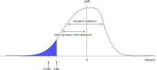
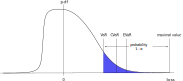
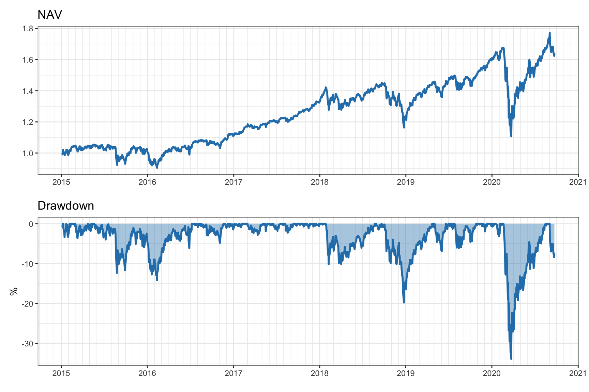
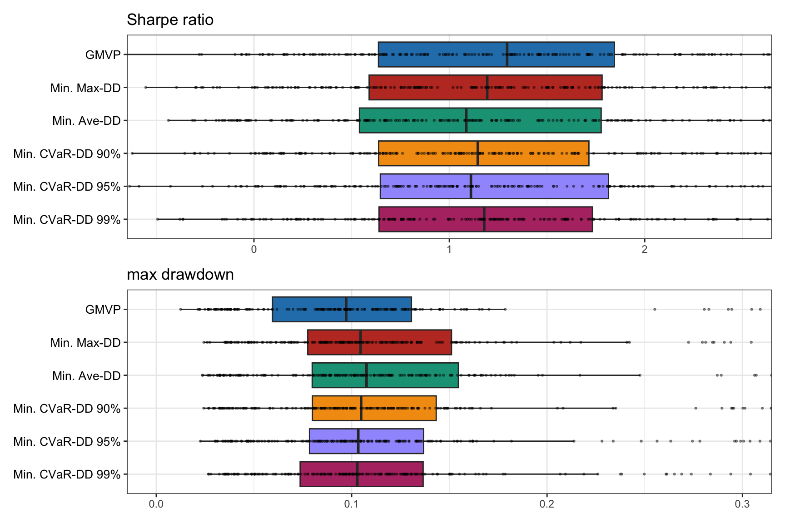

# Portfolios with Alternative Risk Measures {#alternative-risk-measure-portfolios}

> "I try all things, I achieve what I can."
>
> --- Herman Melville, _Moby Dick_

\afterquotespace
\acknowledgementCUP

Markowitz’s mean--variance portfolio optimizes a trade-off between expected return and risk measured by the variance. The higher the variance, the more uncertainty, which is undesired, and vice versa. In principle, this makes sense and follows our intuitive expectation of a measure of risk.

However, as already indicated by Markowitz, the variance and volatility are very simplistic measures of risk. To start with, they penalize both the unwanted losses and the desired gains. In addition, the shape of the distribution function of the returns is being ignored. Rather than focusing on the width of the middle part of the distribution (as the volatility does), it is the tail of the distribution that characterizes the big losses.

This chapter explores a variety of alternative and more sophisticated measures proposed over the past seven decades (such as downside risk, semi-variance, value-at-risk, conditional value-at-risk, expected shortfall, and drawdown) and, more importantly, how to incorporate such measures in the portfolio formulation in a manageable way.

  This material has been published as:
  Daniel P. Palomar (2025). _Portfolio Optimization: Theory and Application_. Cambridge University Press.
  This version is free to view and download for personal use only; not for re-distribution, re-sale, or use in derivative works. ©\ Daniel P. Palomar 2025.

## Introduction
Markowitz's mean--variance portfolio [@Markowitz1952] formulates the portfolio design as a trade-off between the expected return $\w^\T\bmu$ and the risk measured by the variance $\w^\T\bSigma\w$ (see Chapter\ \@ref(MPT) for details):
$$
  \begin{array}{ll}
  \underset{\w}{\textm{maximize}} & \w^\T\bmu - \frac{\lambda}{2}\w^\T\bSigma\w\\
  \textm{subject to} & \w \in \mathcal{W},
  \end{array}
$$
where $\lambda$ is a hyper-parameter that controls the investor's risk aversion and $\mathcal{W}$ denotes an arbitrary constraint set, such as $\mathcal{W} = \{\w \mid \bm{1}^\T\w=1, \w\ge\bm{0} \}$.

Nevertheless, it has been well recognized over decades of research and experimentation that measuring the portfolio risk with the variance $\w^\T\bSigma\w$ or, similarly, the volatility $\sqrt{\w^\T\bSigma\w}$ may not be the best choice for out-of-sample performance. Markowitz himself recognized and stressed the limitations of the mean--variance analysis [@Markowitz1959]. As a consequence, academics and practitioners have explored alternative risk measures that satisfy desirable properties, notably the family of coherent risk measures [@ArtznerDelbaenEberHeath1999].

This chapter explores a variety of risk measures alternative to the variance, namely, the downside risk, semi-variance, semi-deviation, value-at-risk (VaR), conditional value-at-risk (CVaR), expected shortfall (ES), and drawdown. Particular emphasis is placed on how to incorporate such alternative risk measures in the portfolio formulation itself.

## Alternative Risk Measures
The return obtained by portfolio $\w$ is $R = \w^\T\bm{r}$, where $\bm{r}$ denotes the vector of random returns of the $N$ assets (see Chapter\ \@ref(portfolio-101) for details). Since the portfolio return $R$ is a random variable, a proper full characterization is provided by the probability distribution function (pdf). For simplicity and convenience, the information contained in the pdf is typically condensed into a few key numbers, such as the mean (expected return) and the standard deviation (as a measure of risk). However, determining the appropriate quantity that should be used as a measure of risk has been a subject of scientific investigation since the 1950s [@McNeilFreyEmbrechts2015].

As a consequence, academics and practitioners have explored over decades alternative risk measures that satisfy desirable properties, notably the family of coherent risk measures that satisfy four basic properties: translation invariance, monotonicity, subadditivity, and positive homogeneity [@ArtznerDelbaenEberHeath1999].

Figure\ \@ref(fig:var-semivar-VaR-CVaR) illustrates the meaning of the most popular measures of risk in the context of the pdf of the portfolio return, namely, the variance/volatility, the semi-variance/semi-deviation, the VaR, and the CVaR.

(\#fig:var-semivar-VaR-CVaR)Illustration of return distribution and measures of risk.

In the following, we describe in detail variations of downside risk, VaR, CVaR, and drawdown. As will be discussed later, drawdown is fundamentally different from all the other measures in that it is not invariant to the order of the returns.

### Downside Risk
\index{risk measures!downside risk}
\index{portfolio performance measures!downside risk}
Economists have long recognized that investors care differently about downside losses vs. upside gains [@Roy1952]. Markowitz himself advocated using the semi-variance as a measure of risk, rather than the variance [@Markowitz1959]. 

_Downside risk_ generally refers to risk measures that quantify the losses below a certain threshold. A number of studies indicate that downside risk measures are more meaningful than symmetric measures such as the variance or volatility [@Estrada2006; @AngChenXing2006].  Nevertheless, if the distribution of returns is not sufficiently asymmetric, downside risk measures may not withstand scrutiny in terms of providing an advantage over the variance or volatility [@GrootveldHallerbach1999].

<!---
According to the capital asset pricing model (CAPM) [@Sharpe1964] (for details see Section\ \@ref(factor-models) in Chapter\ \@ref(iid-modeling)), a stock's expected excess return is proportional to its market beta, regardless of the high and low market periods (although some empirical studies seem to suggest lack of evidence [@Malkiel1973]). A more refined result is in terms of the downside beta (over periods when the excess market return is below its mean) [@Estrada2006]. It has been shown that the cross-section of stock returns reflects a premium for downside risk, that is, stocks that co-vary strongly with the market when the market declines have high average returns [@AngChenXing2006]. Again, this suggests that the downside risk is more meaningful than the variance.

Nevertheless, unless the distribution of the returns is asymmetric enough, the semi-variance may not provide any additional information compared to the variance. In fact, it has been shown that, against common beliefs, the hype of the mean--downside risk formulations may not stand up to scrutiny and only few cases of the large family of downside risk measures may be superior to the variance [@GrootveldHallerbach1999].
--->

#### Semi-variance and Semi-deviation {-}
\index{risk measures!semi-variance}
\index{risk measures!semi-deviation}
\index{portfolio performance measures!semi-variance}
\index{portfolio performance measures!semi-deviation}
The variance of the return random variable $R$ is 
$$
\sigma^2 = \E\left[(R - \mu)^2\right],
$$
where $\mu = \E[R]$ is the mean. The _semi-variance_ (SV) is similarly defined but only taking into account when the random variable is below the mean:
\begin{equation}
  \textm{SV} = \E\left[\left((\mu - R)^+\right)^2\right],
  (\#eq:SemiVar)
\end{equation}
where the operator $(\cdot)^+ = \textm{max}(0, \cdot)$ only keeps the nonnegative part. 

Similarly to the volatility (the square root of the variance), the _semi-deviation_ is defined as the square root of the semi-variance. A related performance measure is the _Sortino ratio_, defined as the ratio of the expected return to the semi-deviation (similarly to the Sharpe ratio, which uses the volatility instead).

#### LPM {-}
\index{risk measures!lower partial moment (LPM)}
\index{portfolio performance measures!lower partial moment (LPM)}
The _lower partial moment_ (LPM) is a generalization of the semi-variance [@Bawa1975; @Fishburn1977]:
\begin{equation}
  \textm{LPM}_\alpha = \E\left[\left((\tau - R)^+\right)^\alpha\right],
  (\#eq:LPM)
\end{equation}
where the parameter $\tau$ is termed the disaster level (minimum acceptable return) and the parameter $\alpha$ reflects the investor's feeling about falling short of $\tau$, namely, $\alpha>1$ naturally fits a risk-averse investor, $\alpha=1$ corresponds to a neutral investor, and $0<\alpha<1$ is suitable for risk-seeking behavior.

By changing the parameters $\alpha$ and $\tau$ in \@ref(eq:LPM) most downside measures used in practice can be formed. For instance, setting $\alpha=2$ and $\mu = \E[R]$ yields the semi-variance \@ref(eq:SemiVar).

In the same way that in the traditional modern portfolio theory it is common to plot the mean--volatility trade-off achieved by portfolios (see Section\ \@ref(return-risk-tradeoff) in Chapter\ \@ref(MPT) for details), we can similarly plot the mean--risk trade-off where the risk is given by $\textm{LPM}_\alpha^{1/\alpha}$.

### Tail Measures: VaR, CVaR, and EVaR
Tail measures, as the name indicates, focus on the tail of the distribution. They are typically defined in terms of the loss, which can be taken as the opposite of the portfolio return $R = \w^\T\bm{r}$:
$$
\xi = - \w^\T\bm{r}.
$$

Differently from the variance/volatility and semi-variance/semi-deviation, which attempt to measure the dispersion of the pdf of the portfolio return, tail measures focus on the tail of the distribution that represents the big losses (the left tail of the return distribution or the right tail of the loss distribution).

\index{risk measures!value-at-risk (VaR)}
\index{portfolio performance measures!value-at-risk (VaR)}

The _value-at-risk_ (VaR) as a risk measure was proposed in the early 1990s by J. P. Morgan and denotes the maximum loss with a specified confidence level [@McNeilFreyEmbrechts2015]:
\begin{equation}
  \textm{VaR}_{\alpha}	= \textm{inf}\left\{\xi_0:\textm{Pr}\left[\xi\leq\xi_0\right] \ge \alpha\right\},
  (\#eq:VaR)
\end{equation}
where $\alpha$ is the confidence level, for example, $\alpha=0.95$ for 95%. In other words, $\textm{VaR}_{\alpha}$ is the quantile function $q_\alpha(F)$ for the distribution function $F$ (defined as $F(x_0) = \textm{Pr}[x \le x_0]$). However, this measure does not consider the distribution shape of losses exceeding the VaR, is nonconvex, and is not a coherent measure (it lacks the subadditivity property) [@McNeilFreyEmbrechts2015].

\index{risk measures!conditional value-at-risk (CVaR)}
\index{risk measures!expected shortfall (ES)}
\index{risk measures!expected tail loss (ETL)}
\index{portfolio performance measures!conditional value-at-risk (CVaR)}
\index{portfolio performance measures!expected shortfall (ES)}
\index{portfolio performance measures!expected tail loss (ETL)}
The _conditional value-at-risk_ (CVaR), also called _expected shortfall_ (ES) and _expected tail loss_ (ETL), builds on the VaR by taking into account the shape of the losses exceeding the VaR through the average:
\begin{equation}
  \textm{CVaR}_{\alpha} = \E\left[\xi \mid \xi\geq\textm{VaR}_{\alpha}\right].
  (\#eq:CVaR)
\end{equation}
The CVaR is a coherent risk measure and therefore satisfies several desirable properties [@RockafellarUryasev2002].

\index{risk measures!entropic value-at-risk (EVaR)}
\index{portfolio performance measures!entropic value-at-risk (EVaR)}
The _entropic VaR_ (EVaR) is the tightest possible upper bound that can be obtained from the Chernoff inequality for the VaR [@AhmadiJavid2012]:
<!---
$$
\textm{EVaR}_{\alpha}	= \underset{z>0}{\textm{inf}}\;z\;\textm{log}\left(\frac{1}{\alpha}M\left(\frac{1}{z} \right)\right),
$$
$$
\textm{EVaR}_{\alpha}	= \underset{z>0}{\textm{inf}} \left\{z^{-1}\;\textm{log}\left(\frac{1}{\alpha}M(z)\right)\right\},
$$
where $M$ is the moment generating function (defined as $M(t) = \E\left[e^{t\xi}\right]$).
$$
\textm{EVaR}_{\alpha}	= \underset{z>0}{\textm{inf}}\left\{z^{-1}\;\textm{log}\left(\frac{1}{\alpha}\E\left[e^{z\xi}\right]\right)\right\}.
$$
--->
\begin{equation}
  \textm{EVaR}_{\alpha}	= \underset{z>0}{\textm{inf}}\left\{z^{-1}\;\textm{log}\left(\frac{1}{1-\alpha}\E\left[\textm{exp}(z\xi)\right]\right)\right\}.  
  (\#eq:EVaR)
\end{equation}
The EVaR is also a coherent risk measure [@AhmadiJavid2012] and satisfies other properties, such as strong monotonicity [@AhmadiJavidFallahTafti2019].

Some interesting connections among the tail measures are: 

- the monotonicity relationship:
$$
 \textm{VaR}_{\alpha} \le \textm{CVaR}_{\alpha} \le \textm{EVaR}_{\alpha};
$$
- the "average VaR" expression:
$$\textm{CVaR}_{\alpha} = \frac{1}{1 - \alpha} \int_{\alpha}^{1}\textm{VaR}_{u} \,\mathrm{d}u$$
- limiting behavior: the VaR, CVaR, and EVaR all tend to the maximal value of the support of the pdf as $\alpha \rightarrow 1$.

Figure\ \@ref(fig:VaR-CVaR-EVaR) illustrates the VaR, CVaR, and EVaR (as well as the maximal value) in the context of the  pdf of the loss.

(\#fig:VaR-CVaR-EVaR)Illustration of loss distribution and tail measures (VaR, CVaR, and EVaR).

For the Gaussian distribution with mean $\mu$ and standard deviation $\sigma$, these tail measures can be further written as
$$
\begin{aligned}
  \textm{VaR}_{\alpha}  &= \mu + \sigma \,\Phi^{-1}(\alpha),\\
  \textm{CVaR}_{\alpha} &= \mu + \sigma \frac{\phi\left(\Phi^{-1}(\alpha)\right)}{1 - \alpha},\\
  \textm{EVaR}_{\alpha} &= \mu + \sigma \sqrt{-2\textm{log}(1-\alpha)},
\end{aligned}
$$
where $\Phi$ denotes the standard normal distribution function, $\phi$ its density function, and $\Phi^{-1}(\alpha)$ the $\alpha$-quantile of $\Phi$. Clearly, minimizing any of these measures under a Gaussian distribution is tantamount to minimizing the standard deviation $\sigma$.

#### Convex Characterization of CVaR {-}
\index{risk measures!conditional value-at-risk (CVaR)}
\index{portfolio performance measures!conditional value-at-risk (CVaR)}
To use the CVaR in a portfolio formulation, it is helpful to first obtain a convex representation. To start with, the CVaR can be rewritten as
$$
  \begin{aligned}
  \textm{CVaR}_{\alpha} 
    &= \frac{1}{1-\alpha}\E\left[\xi \times I\{\xi\geq\textm{VaR}_{\alpha}\}\right]\\
    &= \textm{VaR}_{\alpha} + \frac{1}{1-\alpha}\E\left[(\xi - \textm{VaR}_{\alpha})^+\right],
  \end{aligned}
$$
which requires knowledge of the VaR.

Interestingly, the CVaR can be similarly written in a variational form without knowledge of the VaR [@RockafellarUryasev2000]:
$$
\textm{CVaR}_{\alpha} = \underset{\tau}{\textm{inf}} \left\{\tau + \frac{1}{1-\alpha}\E\left[(\xi-\tau)^+\right]\right\},
$$
where the optimal $\tau$ is precisely the VaR.

In the context of optimization of the portfolio $\w$, we can conveniently write:
\begin{equation}
  \begin{aligned}
  \textm{VaR}_{\alpha}(\w)  &\in \underset{\tau}{\textm{arg min}} \; F_\alpha(\w, \tau),\\
  \textm{CVaR}_{\alpha}(\w) &= \underset{\tau}{\textm{inf}} \; F_\alpha(\w, \tau),
  \end{aligned}
  (\#eq:variational-convex-CVaR)
\end{equation}
where $F_\alpha(\w, \tau)$ is the convex auxiliary function
$$
F_\alpha(\w, \tau) = \tau + \frac{1}{1-\alpha}\E\left[(-\w^\T\bm{r}-\tau)^+\right].
$$
Convexity is easily established since the term $-\w^\T\bm{r}-\tau$ is linear, the operator $(\cdot)^+$ is the maximum of two convex functions (one constant and one linear) and hence convex, and the expectation is just a convexity-preserving nonnegative sum (see Appendix\ \@ref(convex-optimization) for details on convexity).

#### From Downside Risk to CVaR {-}
\index{risk measures!conditional value-at-risk (CVaR)}
\index{risk measures!lower partial moment (LPM)}
\index{risk measures!downside risk}
\index{portfolio performance measures!conditional value-at-risk (CVaR)}
\index{portfolio performance measures!lower partial moment (LPM)}
\index{portfolio performance measures!downside risk}
The CVaR is intimately related to the downside risk in the form of LPM \@ref(eq:LPM) with $\alpha=1$. This can be seen by rewriting 
$$
  \begin{aligned}
  \textm{LPM}_1
  &= \E\left[(\tau - R) \times I\{R \le \tau\} \right]\\
  &= \E\left[(\xi - (-\tau)) \times I\{\xi \ge -\tau\} \right],
  \end{aligned}
$$
where $I\{\cdot\}$ is the indicator function and we have used the fact that the loss is $\xi = -R$.

If we now choose the disaster level as $\tau = -\textm{VaR}_\alpha$, we can further write
$$
  \begin{aligned}
  \textm{LPM}_1 
  &= \E\left[(\xi - \textm{VaR}_\alpha) \times I\{\xi \ge \textm{VaR}_\alpha\} \right]\\
  &= (1 - \alpha) \E\left[(\xi - \textm{VaR}_\alpha) \mid \xi \ge \textm{VaR}_\alpha \right],
  \end{aligned}
$$
which bears a striking resemblance to the CVaR in \@ref(eq:CVaR):
$$
\textm{CVaR}_{\alpha} = \E\left[\xi \mid \xi\geq\textm{VaR}_{\alpha}\right].
$$

Basically, by choosing $\tau = -\textm{VaR}_\alpha$ and ignoring the scaling factor $(1 - \alpha)$, the downside risk $\textm{LPM}_1$ measures the expected value of the tail shifted to the origin (excess loss above $\textm{VaR}_{\alpha}$), whereas the CVaR measures the expected value of the tail (loss above $\textm{VaR}_{\alpha}$). The main difference is that the VaR chooses the disaster level automatically whereas for the downside risk it is fixed a priori.

### Drawdown
\index{risk measures!drawdown}
\index{portfolio performance measures!drawdown}
The _drawdown_ (or underwater curve) attempts to measure the amount of suffering of an investor constantly monitoring the cumulative return or wealth. As such, it focuses entirely on the downside events while ignoring the upside movements. In addition, the measure of loss is always in relation to the past maximum (mimicking the human psychology).

The _high watermark_ is the historical peak of the value $X(t)$ up to time $t$:
$$
\textm{HWM}(t) = \underset{1 \le \tau \le t}{\textm{max}} \; X(\tau).
$$

The drawdown at time $t$ is defined as the decline from a historical peak of the value:

- _absolute drawdown_:
$$D(t) = \textm{HWM}(t) - X(t);$$
- _normalized drawdown_:
$$\bar{D}(t) = \frac{\textm{HWM}(t) - X(t)}{\textm{HWM}(t)}.$$

Figure\ \@ref(fig:illustration-cumret-drawdown) illustrates the net asset value (NAV) curve of the S&P 500 and the corresponding (normalized) drawdown, which is typically depicted as negative numbers going down.

(\#fig:illustration-cumret-drawdown)Illustration of NAV and corresponding drawdown.

#### Path Dependency {-}
It is important to remark that the drawdown is a _path-dependent measure_. This means that it depends on the temporal order in which the returns happen. This is in sharp contrast to the previously considered measures, which are agnostic to the ordering of the returns.

For illustration purposes, Figure\ \@ref(fig:path-dependency-drawdown) shows the best and worst possible ordering of the returns corresponding to the original ordering in Figure\ \@ref(fig:illustration-cumret-drawdown). The difference is extreme: in the best case the drawdown reaches about 12.5%, whereas in the worst case it goes to virtually 100% (the original drawdown reached 34%).

(\#fig:path-dependency-drawdown)Effect of ordering of returns in the cumulative return and drawdown.

#### Single-Number Summarization {-}
In practice, it is convenient to summarize the whole drawdown curve, which spans a period $t=1,\ldots,T$, into a single number. This can be done in different ways:

- _maximum drawdown_ (Max-DD): 
$$\textm{Max-DD} = \underset{1\le t\le T}{\textm{max}} D(t);$$
- _average drawdown_ (Ave-DD): 
$$\textm{Ave-DD} = \frac{1}{T}\sum_{1\le t\le T} D(t);$$
- _CVaR of drawdown_ (CVaR-DD) or _conditional drawdown at risk_ (CDaR):
$$\textm{CDaR}_{\alpha}	= \E\left[D(t) \mid D(t)\geq\textm{VaR}_{\alpha}\right],$$
where $\textm{VaR}_{\alpha}$ is the value at risk of the drawdown $D(t)$ with confidence level $\alpha$.

## Downside Risk Portfolios
We now consider portfolio formulations based on downside risk measures.

### Formulation
\index{portfolios!mean--downside risk portfolio}
\index{portfolios!mean--LPM portfolio}
\index{portfolios!mean--semi-variance portfolio}
Using the downside risk measure LPM in \@ref(eq:LPM) instead of the usual variance $\w^\T\bSigma\w$ leads to the mean--downside risk formulation:
\begin{equation}
  \begin{array}{ll}
  \underset{\w}{\textm{maximize}} & \w^\T\bmu - \lambda \,\E\left[\left((\tau - \w^\T\bm{r})^+\right)^\alpha\right]\\
  \textm{subject to} & \w \in \mathcal{W}.
  \end{array}
  (\#eq:mean-DR)
\end{equation}
Note that this problem can be similarly formulated by moving either the expected return or risk term to the constraints (see Chapter\ \@ref(MPT)).

In practice, the expectation operator in the LPM has to be approximated by the sample mean over $T$ observations $\bm{r}_1, \dots, \bm{r}_T$:
$$
\E\left[\left((\tau - \w^\T\bm{r})^+\right)^\alpha\right] \approx \frac{1}{T}\sum_{t=1}^T \left((\tau - \w^\T\bm{r}_t)^+\right)^\alpha.
$$
Note that this is the same technique used to approximate the variance:
$$
\E\left[\left(\w^\T(\bm{r} - \bmu)\right)^2\right] \approx \frac{1}{T}\sum_{t=1}^T \left(\w^\T(\bm{r}_t - \bmu)\right)^2 = \w^\T\hat{\bSigma}\w,
$$
where $\hat{\bSigma}$ is the sample covariance matrix (see Chapter\ \@ref(iid-modeling) for details on estimating the covariance matrix). 

Thus, the mean--downside risk formulation is finally written as
<!---  \begin{aligned}[t] --->
$$
  \begin{array}{ll}
  \underset{\w}{\textm{maximize}} & \w^\T\bmu - \lambda \frac{1}{T}\sum_{t=1}^T \left((\tau - \w^\T\bm{r}_t)^+\right)^\alpha\\
  \textm{subject to} & \w \in \mathcal{W},
  \end{array}
$$
where all the return observations $\bm{r}_1, \dots, \bm{r}_T$ appear explicitly and cannot be condensed into a convenient matrix (unlike in the case of the variance).

From an optimization perspective, it is convenient to rewrite the formulation without the nondifferentiable operator $(\cdot)^+$ as
\begin{equation}
  \begin{array}{ll}
  \underset{\w,\{s_t\}}{\textm{maximize}} & \w^\T\bmu - \lambda \frac{1}{T}\sum_{t=1}^T s_t^\alpha\\
  \textm{subject to} 
  & 0 \le s_t \ge \tau - \w^\T\bm{r}_t, \qquad t=1,\dots,T,\\
  & \w \in \mathcal{W}.
  \end{array}
  (\#eq:mean-DR-convex)
\end{equation}
Interestingly, the class of optimization problems for common choices of $\alpha$ (assuming that the constraints in $\mathcal{W}$ are linear) are all convex and can be optimally solved, namely:

- linear program for $\alpha=1$;
- quadratic program for $\alpha=2$ (semi-variance portfolio); and
- general convex program for $\alpha=3$.

### Semi-variance Portfolios
As previously mentioned, the variance has a very convenient expression in terms of the covariance matrix $\bSigma$:
$$
\E\left[\left(\w^\T(\bm{r} - \bmu)\right)^2\right] = \w^\T\bSigma\w,
$$
where $$\bSigma = \E\left[ \left(\bm{r} - \bmu\right) \left(\bm{r} - \bmu\right)^\T \right].$$

The question is whether the semi-variance enjoys a similar property (even as an approximation) so that we can write
$$
\E\left[\left((\tau - \w^\T\bm{r})^+\right)^2\right] \approx \w^\T\bm{M}\w
$$
for some conveniently defined matrix $\bm{M}$.

In fact, Markowitz himself suggested using the following matrix [@Markowitz1959], which provides an exact semi-variance:
$$
\bm{M}(\w) = \E\left[ (\tau\bm{1} - \bm{r}) (\tau\bm{1} - \bm{r})^\T \times I\{\tau > \w^\T\bm{r}\}\right],
$$
where $\bm{1}$ denotes the all-one vector and $I\{\cdot\}$ the indicator function. However, this matrix is endogenous in the sense that it depends on the portfolio $\w$ and it is therefore not appropriate for portfolio optimization.

Unfortunately, the semi-variance cannot be written via an exogenous matrix $\bm{M}$ (independent of $\w$). Nevertheless, this has not stopped authors from proposing good heuristic approximations [@Estrada2008] such as
$$
\bm{M} = \E\left[ (\tau\bm{1} - \bm{r})^+ \left((\tau\bm{1} - \bm{r})^+\right)^\T \right].
$$
Many other practical approaches have been proposed over the past few decades, cf. @Estrada2008.

\index{portfolios!mean--semi-variance portfolio}
Summarizing, the mean--semi-variance formulation can be obtained by setting $\alpha=2$ in \@ref(eq:mean-DR), but it can also be conveniently approximated (similarly to the mean--variance formulation) as
$$
  \begin{array}{ll}
  \underset{\w}{\textm{maximize}} & \w^\T\bmu - \frac{\lambda}{2} \w^\T\bm{M}\w\\
  \textm{subject to} & \w \in \mathcal{W}.
  \end{array}
$$

### Numerical Experiments
We now compare different versions of downside risk portfolios based on \@ref(eq:mean-DR-convex), namely, for $\alpha=1$, $\alpha=2$ (with and without the approximation), and $\alpha=3$. To focus on the effect of the risk measure, we ignore the expected return term in the optimization (effectively letting $\lambda\rightarrow\infty$) and also include the GMVP as a reference benchmark.

Figure\ \@ref(fig:boxplots-DR-portfolios) shows boxplots of the Sharpe ratio and maximum drawdown for 200 realizations of 50 randomly chosen stocks from the S&P 500 during 2015--2020, reoptimizing the portfolios every month with a lookback of one year. <!---The numerical results agree with our expectation: higher values of $\alpha$ are more risk-averse and produce lower drawdowns and better results. The semi-variance approximation performs better than the exact one.--->

(\#fig:boxplots-DR-portfolios)Backtest performance of different downside risk portfolios.

## Tail-Based Portfolios
We will now focus on CVaR and EVaR portfolios (and the limiting case of the worst-case portfolio) since they can be conveniently formulated as convex problems.

### Formulation for CVaR Portfolios
\index{portfolios!mean--CVaR portfolio}
The mean--CVaR formulation replaces the usual variance term $\w^\T\bSigma\w$ by the CVaR in \@ref(eq:CVaR) as a measure of risk:
\begin{equation}
  \begin{array}{ll}
  \underset{\w}{\textm{maximize}} & \w^\T\bmu - \lambda \, \textm{CVaR}_{\alpha}(\w)\\
  \textm{subject to} & \w \in \mathcal{W}.
  \end{array}
  (\#eq:mean-CVaR)
\end{equation}
As usual, this problem can be similarly formulated by moving either the expected return or risk term to the constraints (see Chapter\ \@ref(MPT)).

To write the problem in convex form, we will use the variational convex representation of the CVaR in \@ref(eq:variational-convex-CVaR):
$$
\textm{CVaR}_{\alpha}(\w) = \underset{\tau}{\textm{inf}} \left\{\tau + \frac{1}{1-\alpha}\E\left[(-\w^\T\bm{r}-\tau)^+\right]\right\}.
$$
This leads to the convex mean--CVaR formulation:
$$
  \begin{array}{ll}
  \underset{\w, \tau}{\textm{maximize}} & \w^\T\bmu - \lambda \left(\tau + \frac{1}{1-\alpha}\E\left[(-\w^\T\bm{r}-\tau)^+\right]\right)\\
  \textm{subject to} & \w \in \mathcal{W},
  \end{array}
$$
where the auxiliary variable $\tau$ has been conveniently moved from the inner minimization to the outer maximization (and we have tacitly assumed that the set $\mathcal{W}$ is convex).

In practice, the expectation operator is approximated by the sample mean over $T$ observations $\bm{r}_1, \dots, \bm{r}_T$:
$$
\E\left[(-\w^\T\bm{r}-\tau)^+\right] \approx \frac{1}{T}\sum_{t=1}^T (-\w^\T\bm{r}_t - \tau)^+.
$$

Thus, the mean--CVaR formulation is finally given as
$$
  \begin{array}{ll}
  \underset{\w, \tau}{\textm{maximize}} & \w^\T\bmu - \lambda \left(\tau + \frac{1}{1-\alpha} \frac{1}{T}\sum_{t=1}^T (-\w^\T\bm{r}_t - \tau)^+ \right)\\
  \textm{subject to} & \w \in \mathcal{W}.
  \end{array}
$$

From an optimization perspective, it is convenient to rewrite the formulation without the nondifferentiable operator $(\cdot)^+$ by introducing the $T$ auxiliary variables $\bm{u}=(u_1,\dots,u_T)$ as
\begin{equation}
  \begin{array}{ll}
  \underset{\w, \tau, \bm{u}}{\textm{maximize}} & \w^\T\bmu - \lambda \left(\tau + \frac{1}{1-\alpha} \frac{1}{T}\sum_{t=1}^T u_t \right)\\
  \textm{subject to} 
  & 0 \le u_t \ge -\w^\T\bm{r}_t - \tau, \qquad t=1,\dots,T,\\
  & \w \in \mathcal{W}.
  \end{array}
  (\#eq:mean-CVaR-convex)
\end{equation}
This problem is a linear program (assuming that the set $\mathcal{W}$ is described via linear constraints) and can be conveniently solved with an LP solver.

It is important to bear in mind that the tail events in the CVaR formulation \@ref(eq:mean-CVaR-convex) happen with low probability (by definition) and, therefore, very few samples (if any) will contribute to the characterization of the CVaR. For instance, if $\alpha=0.99$ and we have $T=200$ observations, then only 2 samples out of the 200 will characterize the tail, which is too few samples for a proper characterization of the shape of the tail. This effect is further exacerbated as the dimension $N$ becomes large. As a consequence, the CVaR portfolio may not be numerically stable and alternative methods have been proposed, such as based on some parametric distribution of the returns (Gaussian or elliptical distributions), alternative estimation methods for CVaR [@NadarajahZhangChan2014; @HongHuLiu2014], use of worst-case characterizations of CVaR [@ZhuFukushima2009], and sophisticated tail characterizations based on extreme value theory [@McNeilFrey2000].

### Formulation for EVaR Portfolios
\index{portfolios!mean--EVaR portfolio}
Similarly to \@ref(eq:mean-CVaR), the mean--EVaR formulation replaces the usual variance term $\w^\T\bSigma\w$ by the EVaR in \@ref(eq:EVaR) as a measure of risk:
\begin{equation}
  \begin{array}{ll}
  \underset{\w}{\textm{maximize}} & \w^\T\bmu - \lambda \, \textm{EVaR}_{\alpha}(\w)\\
  \textm{subject to} & \w \in \mathcal{W}.
  \end{array}
  (\#eq:mean-EVaR)
\end{equation}

Using the change of variable $t=z^{-1}$ in the EVaR \@ref(eq:EVaR), the problem can be written [@AhmadiJavidFallahTafti2019] as
$$
  \begin{array}{ll}
  \underset{\w, t>0}{\textm{maximize}} & \w^\T\bmu - \lambda \left(t\;\textm{log}\left(\frac{1}{1-\alpha}\E\left[\textm{exp}(-t^{-1}\w^\T\bm{r})\right]\right)\right)\\
  \textm{subject to} & \w \in \mathcal{W},
  \end{array}
$$
which is a convex problem (assuming that the set $\mathcal{W}$ is convex) because the log-sum-exp function is convex and the perspective $tf(\bm{x}/t)$ of a function $f(\bm{x})$ preserves convexity (see Appendix\ \@ref(convex-optimization) for details on convexity).

In practice, the expectation operator is approximated by the sample mean over $T$ observations $\bm{r}_1, \dots, \bm{r}_T$ and the mean--EVaR formulation is finally written as
\begin{equation}
  \begin{array}{ll}
  \underset{\w, t>0}{\textm{maximize}} & \w^\T\bmu - \lambda 
  \left(
  t\;\textm{log}\left(\sum_{t'=1}^T\left[\textm{exp}(-t^{-1}\w^\T\bm{r}_{t'})\right]\right)
  - t\;\textm{log}\left((1-\alpha)T\right)
  \right)\\
  \textm{subject to} & \w \in \mathcal{W}.
  \end{array}
  (\#eq:mean-EVaR-convex)
\end{equation}

This problem can be solved in practice in a variety of ways (see Appendix\ \@ref(optimization-algorithms) for a discussion on algorithms, solvers, and modeling frameworks):

- via a general-purpose solver (since the problem is convex, it will find an optimal solution);

- via a tailored interior-point method for convex problems [@AhmadiJavidFallahTafti2019];

- via a convex modeling framework that can recognize the convexity of the log-sum-exp function and then performing bisection over $t$<!--- or, even better, by a convex optimization over $t$--->;

- via a convex modeling framework that can recognize both the convexity of the log-sum-exp function and the convexity-preserving property of the perspective operator;

- via a convex reformulation in terms of the _exponential cone_ $\mathcal{K}_{\textm{exp}}$ [@Chares2007],[^log-sum-exp-as-exp-cone] which some solvers and modeling frameworks can recognize [@Cajas2021-EVaR]:[^solvers-with-exp-cone]
$$
  \begin{array}{ll}
  \underset{\w, t>0, s, \bm{u}}{\textm{maximize}} & \w^\T\bmu - \lambda 
  \left(s - t\;\textm{log}\left((1-\alpha)T\right)
  \right)\\
  \textm{subject to} 
  & \w \in \mathcal{W},\\
  & t \ge u_1 + \dots + u_T,\\
  & (-\w^\T\bm{r}_{t'} - s, t, u_{t'}) \in \mathcal{K}_{\textm{exp}}, \quad t'=1,\dots,T,
  \end{array}
$$
where
$$
\mathcal{K}_{\textm{exp}} \triangleq \big\{(a,b,c) \mid c\geq b\,e^{a/b}, b>0\big\} \cup \big\{(a,b,c) \mid a\leq0, b=0, c\geq0\big\}.
$$

[^log-sum-exp-as-exp-cone]: The convex constraint involving the log-sum-exp function
$$
s \ge t\; \textm{log}\left( e^{x_1/t} + e^{x_2/t} \right),
$$
for $t>0$, can be rewritten in terms of the exponential cone $\mathcal{K}_{\textm{exp}}$ as [@Chares2007]
$$
  \begin{aligned}
  t   & \ge u_1 + u_2,\\
  (x_i - s, t, u_i) & \in \mathcal{K}_{\textm{exp}}, \qquad i=1,2.
  \end{aligned}
$$

[^solvers-with-exp-cone]: Some solvers like the Embedded COnic Solver (ECOS) solver (https://github.com/embotech/ecos) or MOSEK ([www.mosek.com](https://www.mosek.com)) are able to handle problems with the exponential cone. Some modeling frameworks like CVXR (https://cvxr.rbind.io) can also accept the exponential cone.

### Formulation for the Worst-Case Portfolio
\index{portfolios!mean--worst-case risk portfolio}
The VaR, CVaR, and EVaR measures all tend to the maximal value of the support of the pdf of the loss as $\alpha \rightarrow 1$. In practice, this implies focusing attention on the worst realization of the return or loss.

This worst-case risk leads to the following formulation [@Young1998]:
$$
  \begin{array}{ll}
  \underset{\w}{\textm{maximize}} & \w^\T\bmu - \lambda\; \textm{max}_{1\le t\le T}\{-\w^\T\bm{r}_t\}\\
  \textm{subject to} & \w \in \mathcal{W}
  \end{array}
$$
or, without the nondifferentiable maximum operator,
\begin{equation}
  \begin{array}{ll}
  \underset{\w, \tau}{\textm{maximize}} & \w^\T\bmu - \lambda\; \tau\\
  \textm{subject to} 
  & \tau \ge -\w^\T\bm{r}_t, \qquad t=1,\dots,T,\\
  & \w \in \mathcal{W}.
  \end{array}
  (\#eq:mean-worst-convex)
\end{equation}
This problem is again a linear program (assuming that the set $\mathcal{W}$ is described via linear constraints) and can be conveniently solved with an LP solver.

 
 

### Numerical Experiments
We now compare CVaR, EVaR, and worst-case portfolios based on \@ref(eq:mean-CVaR-convex), \@ref(eq:mean-EVaR-convex), and \@ref(eq:mean-worst-convex), respectively. To focus on the effect of the risk measure, we ignore the expected return term in the optimization (effectively letting $\lambda\rightarrow\infty$) and also include the GMVP as a reference benchmark.

A word of caution is necessary. Since these portfolio formulations are based on a nonparametric computation of the risk (observed returns directly instead of some covariance matrix) and the tail events happen with low probability (by definition), we cannot expect a good characterization of the true tail. The most extreme case is the worst-case portfolio which is defined by a single data point. For CVaR, very few observations (if any) may occur on the tail, and this can be exacerbated with larger values of $\alpha$. EVaR may be slightly better in this regard since it uses all the observations. For this reason, alternative, more stable, methods have been proposed, as previously mentioned, based on parametric models or sophisticated tail characterizations based on extreme value theory.

Figure\ \@ref(fig:boxplots-CVaR-portfolios-N50) shows boxplots of the Sharpe ratio and maximum drawdown for 200 realizations of 50 randomly chosen stocks, from the S&P 500 during 2015--2020, reoptimizing the portfolios every month with a lookback of one year. It is difficult to draw conclusions from this numerical experiment, but the EVaR portfolios seem to produce better results than the CVaR ones, as expected.
<!---
Figures\ \@ref(fig:boxplots-CVaR-portfolios-N5) and \@ref(fig:boxplots-CVaR-portfolios-N50) show boxplots of the Sharpe ratio and maximum drawdown for 200 realizations of 5 and 50 randomly chosen stocks, respectively, from the S&P 500 during 2015-2020, reoptimizing the portfolios every month with a lookback of one year. As expected, for a small dimensionality ($N=5$) the CVaR portfolios may be acceptable and could be an alternative to the GMVP benchmark. However, when the dimensionality increases ($N=50$) they become unsatisfactory. In addition, as anticipated, the EVaR portfolios are more stable than the CVaR ones due to the fact that they use all the available samples (the CVaR only uses $\alpha\times T$ samples). 
--->

(\#fig:boxplots-CVaR-portfolios-N50)Backtest performance of CVaR and EVaR portfolios.

## Drawdown Portfolios
Drawdown portfolios can be approached via statistical modeling of the returns based on dynamic programming [@GrossmanZhou1993; @CvitanicKaratzas1995], as well as from a more data-driven perspective based on a sample-path (realization) of portfolio returns [@ChekhlovUryasevZabarankin2004], as we consider here.

As we know, the return of a portfolio $\w$ at time $t$ is given by $R_t = \w^\T\bm{r}_t$, where $\bm{r}_t$ denotes linear returns or approximately log-returns. However, since the drawdown is derived from the cumulative return, we need the _portfolio cumulative return_:
$$
R_t^\textm{cum} = \w^\T\bm{r}_t^\textm{cum},
$$
where the cumulative returns of the assets can be computed as
$$
\bm{r}_t^\textm{cum} = \sum_{\tau=1}^t \bm{r}_\tau.
$$
Depending on whether we use linear or log-returns in $\bm{r}_t$, this expression corresponds to the uncompounded linear returns or compounded log-returns, respectively (see Section\ \@ref(cum-PnL) in Chapter\ \@ref(portfolio-101) for details). Note that the value of the portfolio is $1 + R_t^\textm{cum}$.

The _absolute drawdown_ is
$$
D_t(\w) = \underset{1 \le \tau \le t}{\textm{max}} \; \w^\T\bm{r}_\tau^\textm{cum} - \w^\T\bm{r}_t^\textm{cum}
$$
and a constraint of the form $D_t(\w) \le \alpha$ can be written as the linear (after adding some dummy variables) constraint
$$
\w^\T\bm{r}_t^\textm{cum} \ge \underset{1 \le \tau \le t}{\textm{max}} \; \w^\T\bm{r}_\tau^\textm{cum} - \alpha.
$$

Similarly, the _normalized drawdown_ is
$$
\bar{D}_t(\w) = \frac{\underset{1 \le \tau \le t}{\textm{max}} \; \w^\T\bm{r}_\tau^\textm{cum} - \w^\T\bm{r}_t^\textm{cum}}{1+\underset{1 \le \tau \le t}{\textm{max}} \; \w^\T\bm{r}_\tau^\textm{cum}}
$$
and a constraint of the form $\bar{D}_t(\w) \le \alpha$ can be written as the linear (again after adding some dummy variables) constraint
$$
\w^\T\bm{r}_t^\textm{cum} \ge (1-\alpha) \; \underset{1 \le \tau \le t}{\textm{max}} \; \w^\T\bm{r}_\tau^\textm{cum} - \alpha.
$$

### Formulation for the Max-DD Portfolio
\index{portfolios!mean--Max-DD portfolio}
The mean--Max-DD formulation replaces the usual variance term $\w^\T\bSigma\w$ by the maximum drawdown as a measure of risk:
\begin{equation}
  \begin{array}{ll}
  \underset{\w}{\textm{maximize}} & \w^\T\bmu - \lambda \, \textm{Max-DD}(\w)\\
  \textm{subject to} & \w \in \mathcal{W}.
  \end{array}
  (\#eq:mean-maxDD)
\end{equation}
As usual, this problem can be similarly formulated by moving either the expected return or the risk term to the constraints (see Chapter\ \@ref(MPT)).

Substituting for $\textm{Max-DD}(\w) = \underset{1\le t\le T}{\textm{max}} D_t(\w)$, where $D_t(\w)$ is the drawdown at time $t$, leads to the problem
$$
  \begin{array}{ll}
  \underset{\w}{\textm{maximize}} & \w^\T\bmu - \lambda \, \underset{1\le t\le T}{\textm{max}} \left\{\underset{1 \le \tau \le t}{\textm{max}} \; \w^\T\bm{r}_\tau^\textm{cum} - \w^\T\bm{r}_t^\textm{cum}\right\}\\
  \textm{subject to} & \w \in \mathcal{W},
  \end{array}
$$
which is convex (assuming $\mathcal{W}$ is convex) because the maximum of convex functions is convex (see Appendix\ \@ref(convex-optimization) for details on convexity).

Writing the problem in epigraph form and introducing the auxiliary variables $s$ and $\bm{u}$ ($u_0\triangleq-\infty$) to get rid of the max operators leads to
\begin{equation}
  \begin{array}{ll}
  \underset{\w, \bm{u}, s}{\textm{maximize}} & \begin{array}{l} \w^\T\bmu - \lambda \, s \end{array}\\
  \textm{subject to}  &
  \begin{array}[t]{ll}
  \w^\T\bm{r}_t^\textm{cum} \le u_t \le s + \w^\T\bm{r}_t^\textm{cum}, & \quad t=1,\dots,T,\\
  u_{t-1} \le u_t,\\
  \w \in \mathcal{W},
  \end{array}
  \end{array}
  (\#eq:mean-maxDD-convex)
\end{equation}
which is a linear program (assuming $\mathcal{W}$ only contains linear constraints).

It is important to remark that, by definition, the worst drawdown is given by a single data point, which makes this risk measure extremely sensitive. In other words, minute changes in the portfolio weights and the specific time period examined (recall that the drawdown is path-dependent) may produce totally different values of the maximum drawdown. This makes this measure of risk not very reliable, which can be mitigated by using instead the average drawdown or the conditional drawdown-at-risk considered next. As an alternative, if the distribution is close to Gaussian, then the mean--variance framework may be sufficient (see Chapter\ \@ref(MPT)), whereas if the distribution shows some skewness and heavy tails, then high-order portfolios can be used (see Chapter\ \@ref(high-order-portfolios)).

### Formulation for the Ave-DD Portfolio
\index{portfolios!mean--Ave-DD portfolio}
We can repeat the same procedure with the average drawdown instead:
$$
  \begin{array}{ll}
  \underset{\w}{\textm{maximize}} & \begin{aligned} \w^\T\bmu - \lambda \, \frac{1}{T}\sum_{t=1}^T \left(\underset{1 \le \tau \le t}{\textm{max}} \; \w^\T\bm{r}_\tau^\textm{cum} - \w^\T\bm{r}_t^\textm{cum}\right)\end{aligned}\\
  \textm{subject to} & \w \in \mathcal{W},
  \end{array}
$$
which is also convex (assuming $\mathcal{W}$ is convex) because the maximum of convex functions is convex (see Appendix\ \@ref(convex-optimization) for details on convexity).

Writing the problem in epigraph form and introducing the auxiliary variables $s$ and $\bm{u}$ ($u_0\triangleq-\infty$) to get rid of the max operator leads to
\begin{equation}
  \begin{array}{ll}
  \underset{\w, \bm{u}, s}{\textm{maximize}} & \begin{array}{l} \w^\T\bmu - \lambda \, s \end{array}\\
  \textm{subject to}  
  & \frac{1}{T}\sum_{t=1}^T u_t \le \frac{1}{T}\sum_{t=1}^T\w^\T\bm{r}_t^\textm{cum} + s,\\
  & \w^\T\bm{r}_t^\textm{cum} \le u_t, \qquad t=1,\dots,T,\\
  & u_{t-1} \le u_t,\\
  & \w \in \mathcal{W},
  \end{array}
  (\#eq:mean-aveDD-convex)
\end{equation}
which is a linear program (assuming $\mathcal{W}$ only contains linear constraints).

### Formulation for the CVaR-DD Portfolio
\index{portfolios!mean--CVaR-DD portfolio}
To formulate the mean--CVaR-DD portfolio, we will make use of the following variational convex representation of the CVaR-DD (or CDaR) [@ChekhlovUryasevZabarankin2004; @ChekhlovUryasevZabarankin2005]:
$$
\textm{CVaR-DD}(\w) = \underset{\tau}{\textm{inf}} \left\{\tau + \frac{1}{1-\alpha}\frac{1}{T}\sum_{t=1}^T\left(D_t(\w) - \tau\right)^+\right\}.
$$

This leads to the mean--CVaR-DD formulation:
$$
  \begin{array}{ll}
  \underset{\w, \tau}{\textm{maximize}} & \begin{aligned} \w^\T\bmu - \lambda \left(\tau + \frac{1}{1-\alpha}\frac{1}{T}\sum_{t=1}^T\left(\underset{1 \le \tau \le t}{\textm{max}} \; \w^\T\bm{r}_\tau^\textm{cum} - \w^\T\bm{r}_t^\textm{cum} - \tau\right)^+\right) \end{aligned}\\
  \textm{subject to} & \w \in \mathcal{W},
  \end{array}
$$
where the auxiliary variable $\tau$ has been conveniently moved from the inner minimization to the outer maximization. This problem is convex, assuming that $\mathcal{W}$ is a convex set.

After a series of manipulations to get rid of the nondifferentiable max operator and $(\cdot)^+$, and the introduction of the auxiliary variables $s$, $\bm{z}$, and $\bm{u}$ ($u_0\triangleq-\infty$), the problem can be finally rewritten as
\begin{equation}
  \begin{array}{ll}
  \underset{\w, \tau, s, \bm{z}, \bm{u}}{\textm{maximize}} & \w^\T\bmu - \lambda \, s\\
  \textm{subject to}
  & s \ge \tau + \frac{1}{1-\alpha}\frac{1}{T}\sum_{t=1}^T z_t,\\
  & 0 \le z_t \ge u_t - \w^\T\bm{r}_t^\textm{cum} - \tau, \qquad t=1,\dots,T,\\
  & \w^\T\bm{r}_t^\textm{cum} \le u_t,\\
  & u_{t-1} \le u_t,\\
  & \w \in \mathcal{W},
  \end{array}
  (\#eq:mean-CVaRDD-convex)
\end{equation}
which is a linear program (assuming $\mathcal{W}$ only contains linear constraints).

Similarly to the EVaR portfolio in \@ref(eq:mean-EVaR)--\@ref(eq:mean-EVaR-convex), one can easily formulate a drawdown EVaR simply by replacing in \@ref(eq:mean-EVaR-convex) the loss terms $-\w^\T\bm{r}_t$ by $D_t(\w)=\underset{1 \le \tau \le t}{\textm{max}} \; \w^\T\bm{r}_\tau^\textm{cum} - \w^\T\bm{r}_t^\textm{cum}$.

### Numerical Experiments
We now compare several drawdown-based portfolios, namely, that based on the minimization of the maximum drawdown formulated in \@ref(eq:mean-maxDD-convex), the average drawdown formulated in \@ref(eq:mean-aveDD-convex), and the drawdown CVaR formulated in \@ref(eq:mean-CVaRDD-convex). To focus on the effect of the risk measure, we ignore the expected return term in the optimization (effectively letting $\lambda\rightarrow\infty$) and also include the GMVP as a reference benchmark.

Similarly to the CVaR portfolios, a word of caution is necessary here. The problem boils down to the fact that the worst drawdowns happen with low probability, which translates into very few samples being used in the computation of the risk measure. This is specially true for the maximum drawdown (a single sample) and the drawdown CVaR (extremely few samples).

Figure\ \@ref(fig:boxplots-DD-portfolios-N50) shows boxplots of the Sharpe ratio and maximum drawdown for 200 realizations of 50 randomly chosen stocks, from the S&P 500 during 2015--2020, reoptimizing the portfolios every month with a lookback of one year. The drawdown portfolios do not seem to outperform the simple GMVP benchmark, although more exhaustive empirical experiments would be necessary. 

<!---
Figures\ \@ref(fig:boxplots-DD-portfolios-N5) and \@ref(fig:boxplots-DD-portfolios-N50) show boxplots of the Sharpe ratio and maximum drawdown for 200 realizations of 5 and 50 randomly chosen stocks, respectively, from the S&P 500 during 2015-2020, reoptimizing the portfolios every month with a lookback of one year. The drawdown portfolios do not seem to outperform the simple GMVP benchmark, although more exhaustive empirical experiments would be necessary. The performance suffers for higher dimensionality due to the nonparametric nature of the risk measures and the fact that they are based on just a few samples (especially the maximum drawdown which uses a single sample).
--->

(\#fig:boxplots-DD-portfolios-N50)Backtest performance of drawdown portfolios.

## Summary
The variance (similarly, the volatility) is a very simple way to measure the risk of a portfolio and was used in Markowitz's 1952 seminal mean--variance modern portfolio theory framework. Since then, a wide variety of alternative and more sophisticated measures of risk have been proposed, such as semi-variance, downside risk, VaR, CVaR, EVaR, drawdown, and so on.

Interestingly, many meaningful risk measures can be conveniently incorporated in the context of portfolio optimization, expressed in terms of the raw returns of the assets. Some notable examples include:

- _Downside risk portfolios_: The risk focuses on the downside losses, which can be formulated in convex form (parameterized by the parameter $\alpha$):
    + $\alpha=1$: formulated as a linear program;
    + $\alpha=2$: semi-variance portfolio formulated as a quadratic program;
    + $\alpha=3$: more risk averse and formulated as a convex program.
  
- _Tail portfolios_: The risk is measured by the tail of the distribution of the losses, which can be formulated in convex form:
    + _CVaR portfolios_: based on the mean of the tail and formulated as a linear program;
    + _EVaR portfolios_: based on a smooth approximation of the CVaR and formulated in terms of the exponential cone;
    + _worst-case portfolio_: extreme version of CVaR and EVaR portfolios and formulated as a linear program.

- _Drawdown portfolios_: The risk is based on the drawdown, which can be formulated as linear programs:
    + _maximum drawdown portfolio_: based on the single worst drawdown;
    + _average drawdown portfolio_: based on the average of all the drawdowns; and
    + _drawdown CVaR portfolio_: based on the average of the tail of the drawdowns.

## Exercises {#exercises-ch10 -}
\markright{Exercises}

::: {.exercise name="Computing alternative measures of risk"}
Generate $10\,000$ samples following a normal distribution, plot the histogram, and compute the following measures:

- mean
- variance and standard deviation
- semi-variance and semi-deviation
- tail measures (VaR, CVaR, and EVaR) based on raw data
- tail measures (VaR, CVaR, and EVaR) based on a Gaussian approximation.
:::

::: {.exercise name="CVaR in variational convex form"}
Consider the following expression for the CVaR:
$$
  \textm{CVaR}_{\alpha} = \E\left[\xi \mid \xi\geq\textm{VaR}_{\alpha}\right].
$$

Show that it can be rewritten in a convex variational form as:
$$
\textm{CVaR}_{\alpha} = \underset{\tau}{\textm{inf}} \left\{\tau + \frac{1}{1-\alpha}\E\left[(\xi-\tau)^+\right]\right\},
$$
where the optimal $\tau$ precisely equals $\textm{VaR}_{\alpha}$.
<!---
Solution:
- The minimizer of $F_{\alpha}(\mathbf{w},\zeta)$ w.r.t. $\zeta$ satisfies: $0\in\partial_{\zeta}F_{\alpha}(\mathbf{w},\zeta^{\star})$. For example, we choose the following subgradient:
$$\begin{aligned}
0=s_{\zeta}F_{\alpha}(\mathbf{w},\zeta^{\star})	
 & =1-\frac{1}{1-\alpha}\int\mathbf{1}_{\left\{-\mathbf{w}^{T}\mathbf{r}>\zeta^{\star}\right\}}p(\mathbf{r})d\mathbf{r}\\
 & =1-\frac{1}{1-\alpha}P\left(-\mathbf{w}^{T}\mathbf{r}>\zeta^{\star}\right),
\end{aligned}$$
where $\mathbf{1}_{\{\cdot\}}$ is the indicator function.
Solving the above equation, we have
$$P\left(-\mathbf{w}^{T}\mathbf{r}>\zeta^{\star}\right)=1-\alpha \Longrightarrow \zeta^{\star}=\mathsf{VaR}_{\alpha}(-\mathbf{w}^{T}\mathbf{r}).$$

- First, we have
$$\min_{\zeta}F_{\alpha}(\mathbf{w},\zeta)=F_{\alpha}(\mathbf{w},\zeta^{\star})	=\zeta^{\star}+\frac{1}{1-\alpha}\mathsf{E}[-\mathbf{w}^{T}\mathbf{r}-\zeta^{\star}]^{+}.$$
Then, recall that	
$$\begin{aligned}
\mathsf{CVaR}_{\alpha}(-\mathbf{w}^{T}\mathbf{r}) 
 & = \mathsf{E}\left[-\mathbf{w}^{T}\mathbf{r}\big|-\mathbf{w}^{T}\mathbf{r}>\mathsf{VaR}_{\alpha}(-\mathbf{w}^{T}\mathbf{r})\right]\\
 & = \frac{1}{1-\alpha}\int_{-\mathbf{w}^{T}\mathbf{r}>\mathsf{VaR}_{\alpha}(-\mathbf{w}^{T}\mathbf{r})}\left(-\mathbf{w}^{T}\mathbf{r}\right)p(\mathbf{r})d\mathbf{r}\\
 & = \frac{1}{1-\alpha}\int\left[-\mathbf{w}^{T}\mathbf{r}-\mathsf{VaR}_{\alpha}(-\mathbf{w}^{T}\mathbf{r})\right]^{+}p(\mathbf{r})d\mathbf{r}\\
 & \qquad +\mathsf{VaR}_{\alpha}(-\mathbf{w}^{T}\mathbf{r}).
\end{aligned}$$
--->
:::

::: {.exercise name="Sanity check for variational computation of CVaR"}
Generate $10\,000$ samples of the random variable $\xi$ following a normal distribution and compute the CVaR as
$$
\textm{CVaR}_{\alpha} = \E\left[\xi \mid \xi\geq\textm{VaR}_{\alpha}\right].
$$

Verify numerically that the variational expression for the CVaR gives the same result:
$$
\textm{CVaR}_{\alpha} = \underset{\tau}{\textm{inf}} \left\{\tau + \frac{1}{1-\alpha}\E\left[(\xi-\tau)^+\right]\right\}.
$$
:::

::: {.exercise name="CVaR vs. downside risk"}
Consider the following two measures of risk in terms of the loss random variable $\xi$:

- downside risk in the form of lower partial moment (LPM) with $\alpha=1$:
$$
  \textm{LPM}_1 = \E\left[(\xi - \xi_0)^+ \right];
$$
- CVaR:
$$
  \textm{CVaR}_{\alpha} = \E\left[\xi \mid \xi\geq\textm{VaR}_{\alpha}\right].
$$

Rewrite $\textm{LPM}_1$ in the form of $\textm{CVaR}_{\alpha}$ and the other way around. Hint: use $\xi_0=\textm{VaR}_{\alpha}$.
<!---
Solution:
$$
  \begin{aligned}
  \textm{LPM}_1
  &= \E\left[(\xi - \xi_0)^+ \right]\\
  &= \E\left[(\xi - \xi_0) \times I\{\xi \ge \xi_0\} \right].
  \end{aligned}
$$
$$
  \begin{aligned}
  \textm{CVaR}_{\alpha}
    &= \E\left[\xi \mid \xi\geq\textm{VaR}_{\alpha}\right]\\
    &= \frac{1}{1-\alpha}\E\left[\xi \times I\{\xi\geq\textm{VaR}_{\alpha}\}\right]\\
    &= \textm{VaR}_{\alpha} + \frac{1}{1-\alpha}\E\left[(\xi - \textm{VaR}_{\alpha})^+ \times I\{\xi\geq\textm{VaR}_{\alpha}\}\right]
  \end{aligned}
$$
--->
:::

::: {.exercise name="Log-sum-exp function as exponential cone"}
Show that the following convex constraint involving the perspective operator on the log-sum-exp function,
$$
s \ge t\; \textm{log}\left( e^{x_1/t} + e^{x_2/t} \right),
$$
for $t>0$, can be rewritten in terms of the exponential cone $\mathcal{K}_{\textm{exp}}$ as
$$
  \begin{aligned}
  t   & \ge u_1 + u_2,\\
  (u_i, t, x_i - s) & \in \mathcal{K}_{\textm{exp}}, \qquad i=1,2,
  \end{aligned}
$$
where
$$
\mathcal{K}_{\textm{exp}} \triangleq \big\{(a,b,c) \mid c\geq b\,e^{a/b}, b>0\big\} \cup \big\{(a,b,c) \mid a\leq0, b=0, c\geq0\big\}.
$$

<!---
Solution:
$$
  \begin{aligned}
  s &\ge t\; \textm{log}\left( e^{x_1/t} + e^{x_2/t} \right)\\
  e^{s/t} &\ge e^{x_1/t} + e^{x_2/t}\\
  1 &\ge e^{(x_1-s)/t} + e^{(x_2-s)/t}\\
  t &\ge te^{(x_1-s)/t} + te^{(x_2-s)/t}\\
  \end{aligned}
$$
and then
$$
  \begin{aligned}
  t   & \ge u_1 + u_2\\
  u_i & \ge t e^{(x_i - s)/t}, \qquad i=1,2
  \end{aligned}
$$
and, finally,
$$
  \begin{aligned}
  t   & \ge u_1 + u_2\\
  (x_i - s, t, u_i) & \in \mathcal{K}_{\textm{exp}}, \qquad i=1,2,
  \end{aligned}
$$
--->
:::

::: {.exercise name="Drawdown and path-dependency"}
a. Generate $10\,000$ samples of returns following a normal distribution. 
b. Compute and plot the cumulative returns, and plot the drawdown. 
c. Randomly reorder the original returns and plot again.
d. Repeat a few times to observe the path-dependency property of the drawdown.
:::

::: {.exercise name="Semi-variance portfolios"}
a. Download market data corresponding to $N$ assets (e.g., stocks or cryptocurrencies) during a period with $T$ observations, $\bm{r}_1, \dots, \bm{r}_T \in \R^N$.
b. Solve the minimization of the semi-variance in a nonparametric way (reformulate it as a quadratic program):
$$
  \begin{array}{ll}
  \underset{\w}{\textm{minimize}} & \frac{1}{T}\sum_{t=1}^T \left((\tau - \w^\T\bm{r}_t)^+\right)^2\\
  \textm{subject to} & \w \ge \bm{0}, \quad \bm{1}^\T\w = 1.
  \end{array}
$$
c. Solve the parametric approximation based on the quadratic program:
$$
  \begin{array}{ll}
  \underset{\w}{\textm{minimize}} & \w^\T\bm{M}\w\\
  \textm{subject to} & \w \ge \bm{0}, \quad \bm{1}^\T\w = 1,
  \end{array}
$$
where
$$
\bm{M} = \E\left[ (\tau\bm{1} - \bm{r})^+ \left((\tau\bm{1} - \bm{r})^+\right)^\T \right].
$$
d. Comment on the goodness of the approximation.
:::

::: {.exercise name="CVaR portfolios"}
a. Download market data corresponding to $N$ assets (e.g., stocks or cryptocurrencies) during a period with $T$ observations, $\bm{r}_1, \dots, \bm{r}_T \in \R^N$.
b. Solve the minimum CVaR portfolio as the following linear program for different values of the parameter $\alpha$:
$$
  \begin{array}{ll}
  \underset{\w, \tau, \bm{u}}{\textm{minimize}} & \tau + \frac{1}{1-\alpha} \frac{1}{T}\sum_{t=1}^T u_t\\
  \textm{subject to} 
  & 0 \le u_t \ge -\w^\T\bm{r}_t - \tau, \qquad t=1,\dots,T,\\
  & \w \ge \bm{0}, \quad \bm{1}^\T\w = 1.
  \end{array}
$$
c. Observe how many observations are actually used ($u_t > 0$) for the different values of $\alpha$.
d. Add some small perturbation or noise to the sequence of returns $\bm{r}_1, \dots, \bm{r}_T$ and repeat the experiment to observe the sensitivity of the solutions to data perturbation.
:::

(ref:exc-mean-max-dd) Mean--Max-DD formulation as an LP

::: {.exercise name="(ref:exc-mean-max-dd)"}
The mean--Max-DD formulation replaces the usual variance term $\w^\T\bSigma\w$ by the Max-DD as a measure of risk, defined as 
$$\textm{Max-DD}(\w) = \underset{1\le t\le T}{\textm{max}} D_t(\w),$$
where $D_t(\w)$ is the drawdown at time $t$. This leads to the problem formulation
$$
  \begin{array}{ll}
  \underset{\w}{\textm{maximize}} & \w^\T\bmu - \lambda \, \underset{1\le t\le T}{\textm{max}} \left\{\underset{1 \le \tau \le t}{\textm{max}} \; \w^\T\bm{r}_\tau^\textm{cum} - \w^\T\bm{r}_t^\textm{cum}\right\}\\
  \textm{subject to} & \w \in \mathcal{W}.
  \end{array}
$$

Show that it can be rewritten as the following problem ($u_0\triangleq-\infty$):
$$
  \begin{array}{ll}
  \underset{\w, \bm{u}, s}{\textm{maximize}} & \begin{array}{l} \w^\T\bmu - \lambda \, s \end{array}\\
  \textm{subject to}  &
  \begin{array}[t]{ll}
  \w^\T\bm{r}_t^\textm{cum} \le u_t \le s + \w^\T\bm{r}_t^\textm{cum}, & t=1,\dots,T,\\
  u_{t-1} \le u_t,\\
  \w \in \mathcal{W},
  \end{array}
  \end{array}
$$
which is a linear program (assuming $\mathcal{W}$ only contains linear constraints).

<!---
SOLUTION:
Writing the problem in epigraph form leads to
$$
  \begin{array}{ll}
  \underset{\w, s}{\textm{maximize}} & \w^\T\bmu - \lambda \, s\\
  \textm{subject to} 
  & s \ge \underset{1 \le \tau \le t}{\textm{max}} \; \w^\T\bm{r}_\tau^\textm{cum} - \w^\T\bm{r}_t^\textm{cum}, \qquad t=1,\dots,T\\
  & \w \in \mathcal{W},
  \end{array}
$$
and the remaining max operator can be removed as
$$
  \begin{array}{ll}
  \underset{\w, \bm{u}, s}{\textm{maximize}} & \begin{array}{l} \w^\T\bmu - \lambda \, s \end{array}\\
  \textm{subject to} &
  \begin{array}[t]{ll}
  s \ge u_t - \w^\T\bm{r}_t^\textm{cum}, & t=1,\dots,T\\
  u_t \ge \w^\T\bm{r}_\tau^\textm{cum},  & t=1,\dots,T, \; \tau=1,\dots,t\\
  \w \in \mathcal{W}.
  \end{array}
  \end{array}
$$

Observe that there is a number of $(T+1)T/2$ constraints of the form $u_t \ge \w^\T\bm{r}_\tau^\textm{cum}$. This can be reduced by including instead the constraint $u_t \ge u_{t-1}$:
$$
  \begin{array}{ll}
  \underset{\w, \bm{u}, s}{\textm{maximize}} & \begin{array}{l} \w^\T\bmu - \lambda \, s \end{array}\\
  \textm{subject to}  &
  \begin{array}[t]{ll}
  \w^\T\bm{r}_\tau^\textm{cum} \le u_t \le s + \w^\T\bm{r}_t^\textm{cum}, & t=1,\dots,T\\
  u_{t-1} \le u_t, & t=1,\dots,T\\
  \w \in \mathcal{W}.
  \end{array}
  \end{array}
$$
--->
:::

(ref:exc-mean-ave-dd) Mean--Ave-DD formulation as an LP

::: {.exercise name="(ref:exc-mean-ave-dd)"}
The mean--Ave-DD formulation replaces the usual variance term $\w^\T\bSigma\w$ by the Ave-DD as a measure of risk, defined as 
$$\textm{Ave-DD} = \frac{1}{T}\sum_{1\le t\le T} D_t(\w),$$
where $D_t(\w)$ is the drawdown at time $t$. This leads to the problem formulation
$$
  \begin{array}{ll}
  \underset{\w}{\textm{maximize}} & \begin{aligned} \w^\T\bmu - \lambda \, \frac{1}{T}\sum_{t=1}^T \left(\underset{1 \le \tau \le t}{\textm{max}} \; \w^\T\bm{r}_\tau^\textm{cum} - \w^\T\bm{r}_t^\textm{cum}\right)\end{aligned}\\
  \textm{subject to} & \w \in \mathcal{W}.
  \end{array}
$$

Show that it can be rewritten as the following problem ($u_0\triangleq-\infty$):
$$
  \begin{array}{ll}
  \underset{\w, \bm{u}, s}{\textm{maximize}} & \begin{array}{l} \w^\T\bmu - \lambda \, s \end{array}\\
  \textm{subject to}  
  & \frac{1}{T}\sum_{t=1}^T u_t \le \frac{1}{T}\sum_{t=1}^T\w^\T\bm{r}_t^\textm{cum} + s,\\
  & \w^\T\bm{r}_t^\textm{cum} \le u_t, \qquad t=1,\dots,T,\\
  & u_{t-1} \le u_t,\\
  & \w \in \mathcal{W},
  \end{array}
$$
which is a linear program (assuming $\mathcal{W}$ only contains linear constraints).

<!---
Writing the problem in epigraph form leads to
$$
  \begin{array}{ll}
  \underset{\w, s}{\textm{maximize}} & \w^\T\bmu - \lambda \, s\\
  \textm{subject to} 
  & \begin{aligned} s \ge \frac{1}{T}\sum_{t=1}^T \left\{\underset{1 \le \tau \le t}{\textm{max}} \; \w^\T\bm{r}_\tau^\textm{cum} - \w^\T\bm{r}_t^\textm{cum}\right\} \end{aligned}\\
  & \w \in \mathcal{W},
  \end{array}
$$
and the max operator can be removed as
$$
  \begin{array}{ll}
  \underset{\w, \bm{u}, s}{\textm{maximize}} & \w^\T\bmu - \lambda \, s\\
  \textm{subject to} 
  & s \ge \frac{1}{T}\sum_{t=1}^T \left\{u_t - \w^\T\bm{r}_t^\textm{cum}\right\}\\
  & u_t \ge \w^\T\bm{r}_\tau^\textm{cum},  \qquad t=1,\dots,T, \; \tau=1,\dots,t\\
  & \w \in \mathcal{W}.
  \end{array}
$$

Observe that there is a number of $(T+1)T/2$ constraints of the form $u_t \ge \w^\T\bm{r}_\tau^\textm{cum}$. This can be reduced by including instead the constraint $u_t \ge u_{t-1}$ ($u_0\triangleq-\infty$):
$$
  \begin{array}{ll}
  \underset{\w, \bm{u}, s}{\textm{maximize}} & \begin{array}{l} \w^\T\bmu - \lambda \, s \end{array}\\
  \textm{subject to}  
  & \frac{1}{T}\sum_{t=1}^T u_t \le \frac{1}{T}\sum_{t=1}^T\w^\T\bm{r}_t^\textm{cum} + s\\
  & \w^\T\bm{r}_\tau^\textm{cum} \le u_t, \qquad t=1,\dots,T\\
  & u_{t-1} \le u_t\\
  & \w \in \mathcal{W}.
  \end{array}
$$
--->
:::

(ref:exc-mean-cvar-dd) Mean--CVaR-DD formulation as an LP

::: {.exercise name="(ref:exc-mean-cvar-dd)"}
The mean--CVaR-DD formulation replaces the usual variance term $\w^\T\bSigma\w$ by the CVaR-DD as a measure of risk, expressed in a variational form as
$$
\textm{CVaR-DD}(\w) = \underset{\tau}{\textm{inf}} \left\{\tau + \frac{1}{1-\alpha}\frac{1}{T}\sum_{t=1}^T(D_t(\w) - \tau)^+\right\},
$$
where $D_t(\w)$ is the drawdown at time $t$. This leads to the problem formulation
$$
  \begin{array}{ll}
  \underset{\w, \tau}{\textm{maximize}} & \begin{aligned} \w^\T\bmu - \lambda \left(\tau + \frac{1}{1-\alpha}\frac{1}{T}\sum_{t=1}^T\left(\underset{1 \le \tau \le t}{\textm{max}} \; \w^\T\bm{r}_\tau^\textm{cum} - \w^\T\bm{r}_t^\textm{cum} - \tau\right)^+\right) \end{aligned}\\
  \textm{subject to} & \w \in \mathcal{W}.
  \end{array}
$$

Show that it can be rewritten as the following problem ($u_0\triangleq-\infty$):
$$
  \begin{array}{ll}
  \underset{\w, \tau, s, \bm{z}, \bm{u}}{\textm{maximize}} & \w^\T\bmu - \lambda \, s\\
  \textm{subject to}
  & s \ge \tau + \frac{1}{1-\alpha}\frac{1}{T}\sum_{t=1}^T z_t,\\
  & 0 \le z_t \ge u_t - \w^\T\bm{r}_t^\textm{cum} - \tau, \qquad t=1,\dots,T,\\
  & \w^\T\bm{r}_t^\textm{cum} \le u_t,\\
  & u_{t-1} \le u_t,\\
  & \w \in \mathcal{W},
  \end{array}
$$
which is a linear program (assuming $\mathcal{W}$ only contains linear constraints).

<!---
Writing the problem in epigraph form leads to
$$
  \begin{array}{ll}
  \underset{\w, \tau, s}{\textm{maximize}} & \w^\T\bmu - \lambda \, s\\
  \textm{subject to}
  & \begin{aligned} s \ge \tau + \frac{1}{1-\alpha}\frac{1}{T}\sum_{t=1}^T\left(\underset{1 \le \tau \le t}{\textm{max}} \; \w^\T\bm{r}_\tau^\textm{cum} - \w^\T\bm{r}_t^\textm{cum} - \tau\right)^+ \end{aligned}\\
  & \w \in \mathcal{W}.
  \end{array}
$$
The $(\cdot)^+$ operator can be removed as
$$
  \begin{array}{ll}
  \underset{\w, \tau, s, \bm{z}}{\textm{maximize}} & \w^\T\bmu - \lambda \, s\\
  \textm{subject to}
  & s \ge \tau + \frac{1}{1-\alpha}\frac{1}{T}\sum_{t=1}^T z_t\\
  & 0 \le z_t \ge \underset{1 \le \tau \le t}{\textm{max}} \; \w^\T\bm{r}_\tau^\textm{cum} - \w^\T\bm{r}_t^\textm{cum} - \tau\\
  & \w \in \mathcal{W}.
  \end{array}
$$
Finally, the max operator can be removed as
$$
  \begin{array}{ll}
  \underset{\w, \tau, s, \bm{z}, \bm{u}}{\textm{maximize}} & \w^\T\bmu - \lambda \, s\\
  \textm{subject to}
  & s \ge \tau + \frac{1}{1-\alpha}\frac{1}{T}\sum_{t=1}^T z_t\\
  & 0 \le z_t \ge u_t - \w^\T\bm{r}_t^\textm{cum} - \tau\\
  & u_t \ge \w^\T\bm{r}_\tau^\textm{cum},  \qquad t=1,\dots,T, \; \tau=1,\dots,t\\
  & \w \in \mathcal{W}.
  \end{array}
$$

Observe that there is a number of $(T+1)T/2$ constraints of the form $u_t \ge \w^\T\bm{r}_\tau^\textm{cum}$. This can be reduced by including instead the constraint $u_t \ge u_{t-1}$ ($u_0\triangleq-\infty$):
$$
  \begin{array}{ll}
  \underset{\w, \tau, s, \bm{z}, \bm{u}}{\textm{maximize}} & \w^\T\bmu - \lambda \, s\\
  \textm{subject to}
  & s \ge \tau + \frac{1}{1-\alpha}\frac{1}{T}\sum_{t=1}^T z_t\\
  & 0 \le z_t \ge u_t - \w^\T\bm{r}_t^\textm{cum} - \tau, \qquad t=1,\dots,T\\
  & \w^\T\bm{r}_\tau^\textm{cum} \le u_t\\
  & u_{t-1} \le u_t\\
  & \w \in \mathcal{W}.
  \end{array}
$$
--->
:::

(ref:exc-mean-evar-dd) Mean--EVaR-DD formulation as a convex problem

::: {.exercise name="(ref:exc-mean-evar-dd)"}
The mean--EVaR-DD formulation replaces the usual variance term $\w^\T\bSigma\w$ by the EVaR-DD as a measure of risk, defined as
$$
  \textm{EVaR-DD}(\w)	= \underset{z>0}{\textm{inf}}\left\{z^{-1}\;\textm{log}\left(\frac{1}{1-\alpha}\frac{1}{T}\sum_{t=1}^T\textm{exp}(z D_t(\w))\right)\right\},
$$
where $D_t(\w)$ is the drawdown at time $t$ defined as 
$$D_t(\w) = \underset{1 \le \tau \le t}{\textm{max}} \; \w^\T\bm{r}_\tau^\textm{cum} - \w^\T\bm{r}_t^\textm{cum}.$$

a. Write down the mean--EVaR-DD portfolio formulation in convex form.
b. Further rewrite the problem in terms of the exponential cone.
:::

