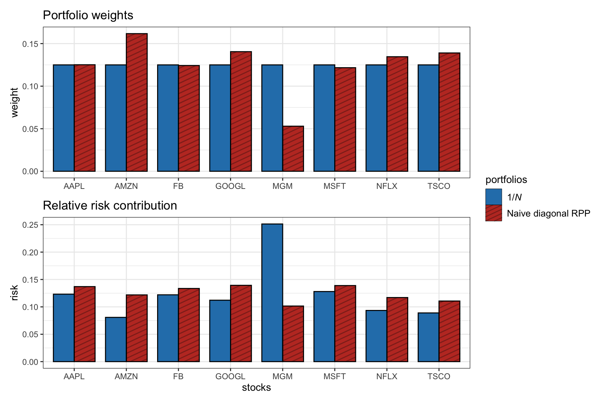
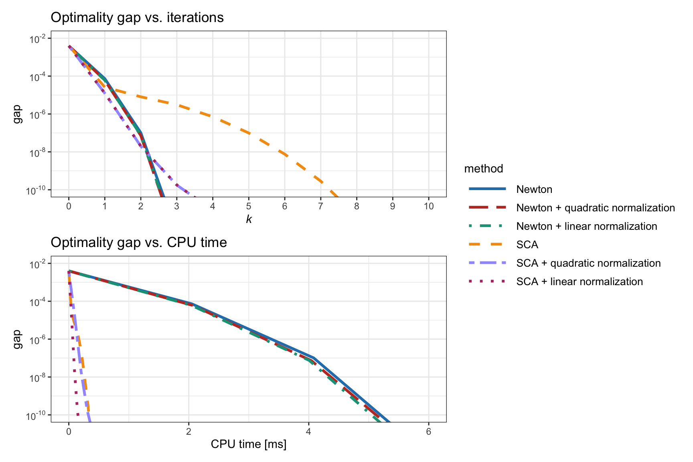
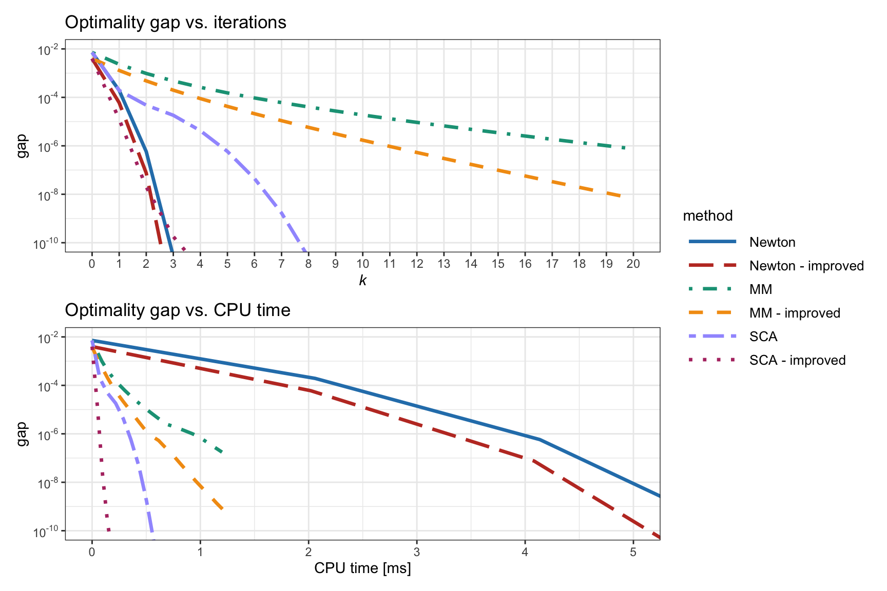
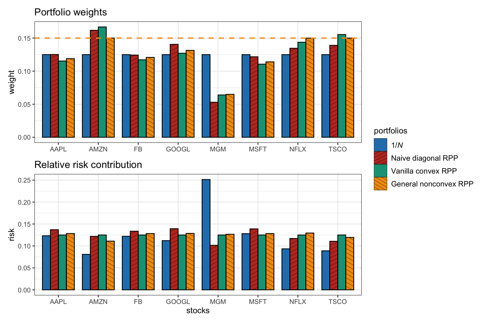
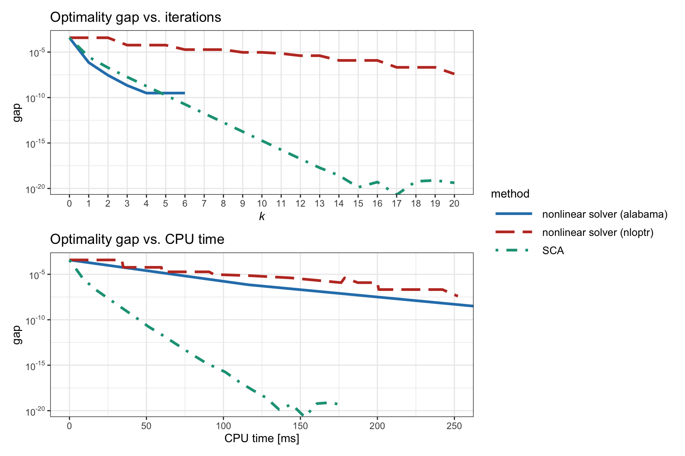

# Risk Parity Portfolios {#RPP}

> "To dare the impossible is no mark of a wise man."
>
> --- Euripides, _Helen_

<!---
> "A 60/40 portfolio is not a well-diversified portfolio."
>
> --- Edward Qian
--->

\afterquotespace
\acknowledgementCUP

Markowitz’s mean--variance portfolio optimizes a trade-off between expected return and risk measured by the variance. Alternative measures of risk to the variance or volatility can certainly be entertained. 

However, measuring the risk of the portfolio with a single number provides a limited view. Instead, a more refined characterization comes from employing a risk profile that quantifies the amount of risk contributed by each constituent asset. This refined risk characterization allows a proper control of the portfolio risk diversification and will be explored in this chapter.

  This material has been published as:
  Daniel P. Palomar (2025). _Portfolio Optimization: Theory and Application_. Cambridge University Press.
  This version is free to view and download for personal use only; not for re-distribution, re-sale, or use in derivative works. ©\ Daniel P. Palomar 2025.

## Introduction
Markowitz's mean--variance portfolio [@Markowitz1952] formulates the portfolio design as a trade-off between the expected return $\w^\T\bmu$ and the risk measured by the variance $\w^\T\bSigma\w$ (see Chapter\ \@ref(MPT) for details):
$$
  \begin{array}{ll}
  \underset{\w}{\textm{maximize}} & \w^\T\bmu - \frac{\lambda}{2}\w^\T\bSigma\w\\
  \textm{subject to} & \w \in \mathcal{W},
  \end{array}
$$
where $\lambda$ is a hyper-parameter that controls the investor's risk aversion and $\mathcal{W}$ denotes an arbitrary constraint set, such as $\mathcal{W} = \{\w \mid \bm{1}^\T\w=1, \w\ge\bm{0} \}$.

Nevertheless, it has been well recognized over decades of research and experimentation that measuring the portfolio risk with the variance $\w^\T\bSigma\w$ or, similarly, the volatility $\sqrt{\w^\T\bSigma\w}$ may not be the best choice for out-of-sample performance. One way to address this drawback is to use alternative risk measures as explored in Chapter\ \@ref(alternative-risk-measure-portfolios). On top of that, one can add another layer of sophistication by characterizing the risk of the portfolio not just with a single number but with a risk profile that quantifies the amount of risk contributed by each constituent asset. This refined risk characterization allows for proper control of the portfolio risk diversification [@Litterman1996; @Qian2005; @Tasche2008; @Roncalli2013; @Qian2016].

This chapter introduces the risk parity portfolio from its simplest form (with a closed-form solution), through vanilla convex formulations, to the more general nonconvex formulations, providing a wide range of numerical algorithms [@MaillardRoncalliTeiletche2010; @FengPal2015riskparity; @FengPal2016monograph].

## From Dollar to Risk Diversification
\index{risk diversification}
\index{risk parity}
Risk parity is an approach to investment management that focuses on allocation of risk rather than allocation of dollars or capital. In other words, it departs from the concept of dollar diversification to risk diversification. The underlying idea is to design the asset allocation so that each asset (or asset class) contributes the same risk level to the overall portfolio. This typically produces better out-of-sample risk control and can be more resistant to market downturns than traditional portfolios.

Historically, risk parity starts from the observation that traditional asset allocations, such as the market portfolio or the 60/40 portfolio in stocks/bonds, are insufficiently diversified in terms of risk contribution [@AsnessFrazziniPedersen2012]. From a risk perspective, the 60/40 portfolio is mainly equity portfolio since stocks are much more volatile than bonds and dominate the risk of the entire portfolio.

Some of the theoretical components were developed in the 1950s and 1960s, but the first risk parity fund, called the "All Weather" fund, was pioneered by Bridgewater Associates in 1996. An early analysis in terms of partial derivatives to identify "hot spots" can be found in @Litterman1996. The term "risk parity" was coined in 2005 by Edward Qian[^Qian] [@Qian2005] and, in recent years, it has been adopted by the asset management industry as a way of risk management. Risk parity gained significantly in popularity after the global financial crisis in 2008 [@MaillardRoncalliTeiletche2010; @AsnessFrazziniPedersen2012]. Nevertheless, some portfolio managers have expressed skepticism about its practical application and effectiveness in all types of market conditions, especially bull markets [@ChavesHsuLiShakernia2011; @AndersonBianchiGoldberg2012].

[^Qian]: [Dr. Edward Qian](https://www.panagora.com/members/edward-qian-ph-d/) is the Chief Investment Officer and Head of Research of the Multi Asset Group at PanAgora Asset Management. 

The risk parity portfolio has received significant attention from both practitioner and academic communities, producing a large number of publications <!---[@Qian2005; @ChavesHsuLiShakernia2011; @AsnessFrazziniPedersen2012; @FengPal2015riskparity]--->and some textbooks such as @Qian2016 for a high-level and practical perspective and @Roncalli2013 for a more mathematical treatment.

Figure\ \@ref(fig:illustration-RPP) illustrates the difference between dollar diversification and risk diversification. The $1/N$ portfolio by definition perfectly diversifies the capital allocation (i.e., portfolio weights) but does not show a good risk diversification profile (in fact, a single asset exhibits a high risk contribution). On the other hand, the risk parity portfolio precisely focuses on the diversification of the risk profile.

(\#fig:illustration-RPP)Illustration of portfolio allocation and risk allocation for the $1/N$ portfolio and risk parity portfolio.

## Risk Contributions
\index{risk contributions}
The whole idea of the risk parity portfolio hinges on quantifying the decomposition of the portfolio risk into the sum of risk contributions from the individual assets:
$$
\textm{portfolio risk} = \sum_{i=1}^N \textm{RC}_i,
$$
where $\textm{RC}_i$ denotes the _risk contribution_ (RC) of the $i$th asset to the total risk. The choice of risk measure depends on the portfolio designer, with common options being volatility, value-at-risk (VaR), or conditional VaR (CVaR). For a list of performance measures, refer to Section\ \@ref(performance-measures), and for a detailed discussion on portfolio design based on alternative performance measures, see Chapter\ \@ref(alternative-risk-measure-portfolios). Euler's theorem offers the solution for the desired decomposition of portfolio risk, cf. @Litterman1996, @Tasche2008, and references therein.

::: {.theorem #euler name="Euler's homogenous function theorem"}
Let a continuous and differentiable function $f:\R^N \rightarrow \R$ be a positively homogeneous function of degree one.[^homogeneous-degree-one] Then
\begin{equation}
f(\bm{w}) = \sum_{i=1}^N w_i \frac{\partial f}{\partial w_i}.
  (\#eq:euler-decomposition)
\end{equation}
:::

[^homogeneous-degree-one]: A function $f(\w)$ is a positively homogeneous function of degree one if $f(c\w)=cf(\w)$ holds for any $c>0$. This condition is satisfied by the volatility, VaR, and CVaR, among others (but not by the variance, for example).

From Theorem \@ref(thm:euler), for a given risk measure $f(\w)$, we can interpret the risk contribution from the $i$th asset as
$$
\textm{RC}_i = w_i \frac{\partial f(\w)}{\partial w_i}.
$$
In addition, it is convenient to define the related _marginal risk contribution_ (MRC) as
$$
\textm{MRC}_i = \frac{\partial f(\w)}{\partial w_i},
$$
which evaluates the portfolio risk's sensitivity with respect to the $i$th asset weight, and the _relative risk contribution_ (RRC) as
$$
\textm{RRC}_i = \frac{\textm{RC}_i}{f(\w)},
$$
which satisfies $\sum_{i=1}^N \textm{RRC}_i = 1$.

The following measures of risk do satisfy Euler's requirement in Theorem \@ref(thm:euler) and the decomposition in \@ref(eq:euler-decomposition) can be employed.

- For the volatility, $\sigma(\w) = \sqrt{\w^\T\bSigma\w},$ Euler's theorem can be used with
$$
\textm{RC}_i = w_i \frac{\partial \sigma(\w)}{\partial w_i} = \frac{w_i(\bSigma\w)_i}{\sqrt{\w^\T\bSigma\w}}.
$$

- For the VaR, defined as $\textm{VaR}_{\alpha}(\w)	= \inf\left\{\xi_0 \mid \textm{Pr}(-\w^\T\bm{r}\leq\xi_0)\geq\alpha\right\}$ with $\alpha$ the confidence level (e.g., $\alpha=0.95$), $\bm{r}$ representing the random market return vector, and $-\w^\T\bm{r}$ denoting the (random) loss of portfolio $\w$, it follows [@Hallerbach2003] that
$$
\textm{RC}_i = w_i \frac{\partial \textm{VaR}_{\alpha}(\w)}{\partial w_i} = \E\left[-w_i r_i \mid -\w^\T\bm{r}=\textm{VaR}_{\alpha}(\w)\right].
$$

- For the CVaR, defined as $\textm{CVaR}_{\alpha}(\w)	= \E\left[-\w^\T\bm{r} \mid -\w^\T\bm{r}\geq\textm{VaR}_{\alpha}(\w)\right]$, it follows [@Scaillet2004] that
$$
\textm{RC}_i = w_i \frac{\partial \textm{CVaR}_{\alpha}(\w)}{\partial w_i} = \E\left[-w_i r_i \mid -\w^\T\bm{r}\ge\textm{VaR}_{\alpha}(\w)\right].
$$

In practice, the VaR and CVaR risk contribution expressions are not easily computable. Interestingly, if the returns $\bm{r}$ follow a Gaussian distribution, then the VaR and CVaR can be expressed explicitly as [@McNeilFreyEmbrechts2015]
$$
\begin{aligned}
\textm{VaR}_{\alpha}(\w)	&= -\w^\T\bmu + \kappa_1(\alpha)\sqrt{\w^\T\bSigma\w},\\
\textm{CVaR}_{\alpha}(\w)	&= -\w^\T\bmu + \kappa_2(\alpha)\sqrt{\w^\T\bSigma\w},
\end{aligned}
$$
where $\kappa_1(\alpha) \triangleq \Phi^{-1}(\alpha)$, $\kappa_2(\alpha) \triangleq \frac{1}{(1-\alpha)}\frac{1}{\sqrt{2\pi}}\textm{exp}\left(-\frac{1}{2}\Phi^{-1}(\alpha)^2\right)$, and $\Phi(\cdot)$ is the cumulative distribution function of a zero-mean unit-variance Gaussian variable.

### Volatility Risk Contributions
In the rest of the chapter, we will focus on the portfolio volatility, $\sigma(\w) = \sqrt{\w^\T\bSigma\w},$ which admits the decomposition
$$
\sigma(\w) = \sum_{i=1}^N w_i \frac{\partial \sigma}{\partial w_i} = \sum_{i=1}^N \frac{w_i(\bSigma\w)_i}{\sqrt{\w^\T\bSigma\w}},
$$
leading to the following expressions:
$$
\textm{MRC}_i = \frac{(\bSigma\w)_i}{\sqrt{\w^\T\bSigma\w}},\qquad
\textm{RC}_i  = \frac{w_i(\bSigma\w)_i}{\sqrt{\w^\T\bSigma\w}},\qquad
\textm{RRC}_i = \frac{w_i(\bSigma\w)_i}{\w^\T\bSigma\w}.
$$
<!---
$$
\begin{aligned}
\textm{MRC}_i &= \frac{(\bSigma\w)_i}{\sqrt{\w^\T\bSigma\w}},\\
\textm{RC}_i  &= \frac{w_i(\bSigma\w)_i}{\sqrt{\w^\T\bSigma\w}},\\
\textm{RRC}_i &= \frac{w_i(\bSigma\w)_i}{\w^\T\bSigma\w}.
\end{aligned}
$$
--->

## Problem Formulation
\index{risk parity portfolio (RPP)}
\index{portfolios!risk parity portfolio (RPP)}
The _risk parity portfolio_ (RPP), also termed _equal risk portfolio_ (ERP), is simply formulated as requiring the risk contributions to be equal (i.e., equalizing the individual risks):
$$
\textm{RRC}_i = \frac{w_i(\bSigma\w)_i}{\w^\T\bSigma\w} = \frac{1}{N}, \qquad i=1,\dots,N.
$$
This is reminiscent of the $1/N$ portfolio or equally weighted portfolio (EWP) that satisfies:
$$
w_i = \frac{1}{N},\qquad i=1,\dots,N.
$$
Thus, whereas the $1/N$ portfolio equalizes the dollar allocation, the RPP equalizes the risk contribution. Interestingly, if all the assets have roughly the same Sharpe ratios and same correlations, the RPP can be interpreted as optimal under the Markowitz mean--variance framework [@MaillardRoncalliTeiletche2010]. In addition, it can be shown that the RPP exists, is unique, and is located between the minimum variance and equally weighted portfolios [@MaillardRoncalliTeiletche2010].

More generally, one can specify a risk profile allocation different from the uniform one, termed the _risk budgeting portfolio_ (RBP):
$$
\textm{RRC}_i = \frac{w_i(\bSigma\w)_i}{\w^\T\bSigma\w} = b_i, \qquad i=1,\dots,N,
$$
where $\bm{b} = (b_1,\dots,b_N) \ge \bm{0}$ (normalized to $\bm{1}^\T\bm{b}=1$) is the desired risk profile.

Thus, in its simplest form, the problem can be formulated as finding a portfolio $\w\ge\bm{0}$, with $\bm{1}^\T\w=1$, satisfying the risk budgeting constraints
$$
w_i (\bSigma\w)_i = b_i \,\w^\T\bSigma\w, \qquad i=1,\dots,N.
$$
This is a feasibility problem (there is no objective to maximize or minimize, just constraints), whose solution is not trivial. In the rest of the chapter we will consider the resolution of this problem by exploring three cases in order of difficulty:[^rpp-package]

- naive diagonal formulation;
- vanilla convex formulation; and
- general nonconvex formulation.

[^rpp-package]: The R package [`riskParityPortfolio`](https://CRAN.R-project.org/package=riskParityPortfolio) [@riskParityPortfolio] and the Python package [`riskparity.py`](https://github.com/convexfi/riskparity.py) can solve these formulations very efficiently. \index{R packages!riskParityPortfolio} \index{Python packages!riskparity.py}

### Formulation with Shorting
Typically, the RPP formulation involves no shorting, so $\w \ge \bm{0}$. Allowing shorting generally requires more complicated resolution methods. Nevertheless, in the case that the shorting pattern is known a priori, the problem can be easily reformulated like the no-shorting formulation with the following trick [@Spinu2013].

Suppose that the shorting pattern, i.e., which assets to long or short, is defined a priori in the vector $\bm{s}=(s_1, \dots, s_N)$ with $s_i=1$ for long positions and $s_i=-1$ for short positions. Then the desired portfolio $\w$, which follows the shorting pattern, can be related to a virtual no-shorting portfolio $\tilde{\w}\ge\bm{0}$ as $\w = \bm{s} \odot \tilde{\w}$ such that $\w^\T\bSigma\w = \tilde{\w}^\T\tilde{\bSigma}\tilde{\w},$ where $\tilde{\bSigma} = \textm{Diag}(\bm{s})\bSigma\textm{Diag}(\bm{s})$. Then, the risk budgeting equations become
$$
\tilde{w}_i (\tilde{\bSigma}\tilde{\w})_i = b_i \, \tilde{\w}^\T\tilde{\bSigma}\tilde{\w}, \qquad i=1,\dots,N.
$$

### Formulation with Group Risk Parity
The idea of group risk parity is to consider the risk contributions of several assets belonging to the same group (e.g., industry or sector) as a whole. For example, suppose there are $K$ groups (with $K<N$), denoted $\mathcal{G}_1,\dots,\mathcal{G}_K$, such that they form a partition of the $N$ assets. We can define the risk contribution from the $k$th group as
$$
\textm{RC}_{\mathcal{G}_k} = \sum_{i\in\mathcal{G}_k} w_i \frac{\partial \sigma}{\partial w_i} = \sum_{i\in\mathcal{G}_k} \frac{w_i(\bSigma\w)_i}{\sqrt{\w^\T\bSigma\w}}
$$
and then the risk budgeting equations become
$$
\sum_{i\in\mathcal{G}_k} w_i (\bSigma\w)_i = b_k \, \w^\T\bSigma\w, \qquad i=1,\dots,K.
$$

### Formulation with Risk Factors
Consider the following factor modeling of the returns:
$$
\bm{r}_t = \bm{\alpha} + \bm{B} \bm{f}_t + \bm{\epsilon}_t,
$$
where $\bm{f}_t$ contains the $K$ factors (typically with $K\ll N$), $\bm{\alpha}$ is the so-called "alpha," matrix $\bm{B}$ contains the so-called "betas" on the columns corresponding to the different factors, and $\bm{\epsilon}_t$ is the residual.

The risk contribution from the $k$th factor can be defined [@RoncalliWeisang2016] as
$$
\textm{RC}_k = \frac{(\bm{B}^\T \w)_k (\bm{B}^\dagger\bSigma\w)_k}{\sqrt{\w^\T\bSigma\w}},
$$
where $\bm{B}^\dagger \triangleq \bm{B}^\T(\bm{B}^\T\bm{B})^{-1}$ is the Moore--Penrose pseudo-inverse matrix of $\bm{B}$, and the risk budgeting equations become
$$
(\bm{B}^\T \w)_k (\bm{B}^\dagger\bSigma\w)_k = b_k \, \w^\T\bSigma\w, \qquad i=1,\dots,K.
$$

## Naive Diagonal Formulation
\index{risk parity portfolio (RPP)!naive diagonal formulation}
\index{portfolios!risk parity portfolio (RPP)}
Consider the risk budgeting equations
$$w_i\left(\bSigma\w\right)_i = b_i \, \w^\T\bSigma\w, \qquad i=1,\ldots,N.$$
If we assume that the covariance matrix is diagonal, $\bSigma = \textm{Diag}(\bm{\sigma}^2)$, then they simplify to
$$w_i^2 \sigma_i^2 = b_i \sum_{j=1}^N w_j^2 \sigma_j^2, \qquad i=1,\ldots,N$$ or, equivalently,
\begin{equation}
  w_i = \frac{\sqrt{b_i}}{\sigma_i} \sqrt{\sum_{j=1}^N w_j^2 \sigma_j^2}, \qquad i=1,\ldots,N.
  (\#eq:diagonal-RPP-solution)
\end{equation}

Observe that this portfolio is inversely proportional to the assets' volatilities, which corresponds to the inverse volatility portfolio (IVolP) introduced in Section\ \@ref(IVolP) of Chapter\ \@ref(portfolio-101). Lower weights are given to high-volatility assets and higher weights to low-volatility assets, resulting in weighted constituent assets with equal volatility (for the case $b_i=1/N$): 
$$\textm{Std}(w_i x_i) = w_i\sigma_i = 1/N,$$
where $\textm{Std}(\cdot)$ denotes standard deviation.

For a general nondiagonal covariance matrix, a closed-form solution is not available and some optimization procedure has to be employed. Nevertheless, the diagonal solution in \@ref(eq:diagonal-RPP-solution) can always be used as a "naive" solution. Interestingly, the diagonal solution is also optimal if the correlations of all assets are the same [@MaillardRoncalliTeiletche2010].

### Illustrative Example
Figure\ \@ref(fig:naive-RPP-allocation) shows the portfolio allocation and the risk contribution of the naive RPP and the $1/N$ portfolio. The $1/N$ portfolio has an equal capital allocation by definition, but it shows an unequal risk contribution with much more risk from the single-asset "MGM." The naive RPP does a much better job equalizing the risk contribution, but it is not perfectly equalized since it ignores the off-diagonal elements of the covariance matrix.

<!---

--->

(\#fig:naive-RPP-allocation)Portfolio allocation and risk contribution of the $1/N$ portfolio and naive diagonal RPP.

## Vanilla Convex Formulations {#vanilla-convex-formulations}
Consider the risk budgeting equations
$$w_i\left(\bSigma\w\right)_i = b_i \, \w^\T\bSigma\w, \qquad i=1,\ldots,N$$
with $\bm{1}^\T\w=1$ and $\w \ge \bm{0}$. If we define $\bm{x}=\w/\sqrt{\w^\T\bSigma\w}$, then we can rewrite them as $x_i\left(\bSigma\bm{x}\right)_i = b_i$ or, more compactly in vector form, as
\begin{equation}
  \bSigma\bm{x} = \bm{b}/\bm{x}
  (\#eq:risk-budgeting-x)
\end{equation}
with $\bm{x} \ge \bm{0},$ from which we can recover the portfolio simply by normalizing $\bm{x}$ as $\w = \bm{x}/(\bm{1}^\T\bm{x})$.

Interestingly, the equations in \@ref(eq:risk-budgeting-x) can be rewritten in terms of the correlation matrix $\bm{C} = \bm{D}^{-1/2}\bSigma\bm{D}^{-1/2}$, with $\bm{D}$ a diagonal matrix containing the variances $\textm{diag}(\bSigma) = \bm{\sigma}^2$ along the main diagonal, as [@Spinu2013]
\begin{equation}
  \bm{C}\tilde{\bm{x}} = \bm{b}/\tilde{\bm{x}},
  (\#eq:risk-budgeting-x-corr)
\end{equation}
where $\bm{x} = \tilde{\bm{x}}/\bm{\sigma}$. This has the effect of normalizing the returns with respect to the volatilities of the assets, which can help numerically as will be empirically verified later.

### Direct Resolution via Root Finding
The system of nonlinear equations $\bSigma\bm{x} = \bm{b}/\bm{x}$ can be interpreted as finding the roots of the nonlinear function
$$F(\bm{x}) = \bSigma\bm{x} - \bm{b}/\bm{x},$$
that is, solving for $$F(\bm{x}) = \bm{0}.$$ In practice, this can be done with a general-purpose nonlinear multivariate root finder, available in most programming languages.[^root-finders]

A similar root-finding problem can be formulated in terms of $\w$ by including the budget constraint $\bm{1}^\T\w = 1$ explicitly in the nonlinear function [@ChavesHsuLiShakernia2012]:
$$
F(\w, \lambda) = 
\left[\begin{array}{c}
\bSigma\bm{w} - \lambda\bm{b}/\bm{w}\\
\bm{1}^\T\w - 1
\end{array}\right].
$$

[^root-finders]: In R, a general-purpose nonlinear multivariate root finder is provided by the function `multiroot()` from the package [`rootSolve`](https://CRAN.R-project.org/package=rootSolve). In MATLAB, we can use the function [`fsolve()`](https://www.mathworks.com/help/optim/ug/fsolve.html).

### Formulations
\index{risk parity portfolio (RPP)!vanilla convex formulations}
\index{portfolios!risk parity portfolio (RPP)}
A more interesting way to solve the risk budgeting equation in \@ref(eq:risk-budgeting-x) is by unveiling the hidden convexity. This can be achieved by realizing that \@ref(eq:risk-budgeting-x) precisely corresponds to the optimality conditions of some carefully chosen convex optimization problems, as is the case with the following three formulations.

- To start, consider the following convex optimization problem [@Spinu2013]:
\begin{equation}
  \begin{array}{ll}
  \underset{\bm{x}\ge\bm{0}}{\textm{minimize}} & \frac{1}{2}\bm{x}^\T\bSigma\bm{x} - \bm{b}^\T\log(\bm{x}).
  \end{array}
  (\#eq:spinu-convex)
\end{equation}
It turns out that setting the gradient of the objective function to zero precisely corresponds to \@ref(eq:risk-budgeting-x):
$$
\bSigma\bm{x} = \bm{b}/\bm{x}.
$$
Therefore, solving this problem is equivalent to solving the risk budgeting equations.

- A slightly different convex optimization problem is [@Roncalli2013]
\begin{equation}
  \begin{array}{ll}
  \underset{\bm{x}\ge\bm{0}}{\textm{minimize}} & \sqrt{\bm{x}^\T\bSigma\bm{x}} - \bm{b}^\T\log(\bm{x}).
  \end{array}
  (\#eq:roncalli-convex)
\end{equation}
In this case, setting the gradient to zero leads to
$$
\bSigma\bm{x} = \bm{b}/\bm{x} \times \sqrt{\bm{x}^\T\bSigma\bm{x}},
$$
which follows the form of the risk budgeting equation \@ref(eq:risk-budgeting-x) after renormalizing the variable as $\tilde{\bm{x}}=\bm{x}/ (\bm{x}^\T\bSigma\bm{x})^{1/4}.$

- Similarly, the following formulation was proposed in @MaillardRoncalliTeiletche2010:
\begin{equation}
  \begin{array}{ll}
  \underset{\bm{x}\ge\bm{0}}{\textm{minimize}} & \sqrt{\bm{x}^\T\bSigma\bm{x}}\\
  \textm{subject to} & \bm{b}^\T\log(\bm{x}) \ge c,
  \end{array}
  (\#eq:maillard-convex)
\end{equation}
with $c$ an arbitrary constant. This formulation provides an alternative interpretation of the problem as minimizing the volatility (or variance) with the constraint on $\bm{b}^\T\log(\bm{x})$ controlling the diversification.

- Another reformulation swapping the objective and constraint in \@ref(eq:maillard-convex) was proposed by @KayaLee2012 as
\begin{equation}
  \begin{array}{ll}
  \underset{\bm{x}\ge\bm{0}}{\textm{maximize}} & \bm{b}^\T\log(\bm{x})\\
  \textm{subject to} & \sqrt{\bm{x}^\T\bSigma\bm{x}} \le \sigma_0,
  \end{array}
  (\#eq:kaya-lee-convex)
\end{equation}
where the volatility term appears as a constraint and $\sigma_0$ is the chosen maximum level of volatility. In this case, we can define the Lagrangian (ignoring the nonnegativity constraint on $\bm{x}$ since it is automatically satisfied) as
$$
L(\bm{x};\lambda) = \bm{b}^\T\log(\bm{x}) + \lambda \left(\sigma_0 - \sqrt{\bm{x}^\T\bSigma\bm{x}}\right)
$$
and setting its gradient to zero leads to 
$$
\lambda\bSigma\bm{x} = \bm{b}/\bm{x} \times \sqrt{\bm{x}^\T\bSigma\bm{x}},
$$
which follows the form of the risk budgeting equation \@ref(eq:risk-budgeting-x) after renormalizing the variable as $\tilde{\bm{x}}=\bm{x}\times \lambda^{1/2} / (\bm{x}^\T\bSigma\bm{x})^{1/4}.$

All these formulations are convex and can be solved with a general-purpose solver available in any programming language.[^general-purpose-solvers] Alternatively, simple and efficient tailored algorithms can be developed.

[^general-purpose-solvers]: In R, there is a myriad of solvers, a typical example being the base function `optim()`. In MATLAB, a similar function is `fmincon()`.

#### Illustrative Example {-}
Figure\ \@ref(fig:convex-RPP-allocation) shows the distribution of the portfolio weights and risk contribution for the $1/N$ portfolio, the naive diagonal RPP, and the vanilla convex RPP. The latter clearly achieves perfect risk equalization as opposed to the naive diagonal case.

(\#fig:convex-RPP-allocation)Portfolio allocation and risk contribution of the vanilla convex RPP compared to benchmarks ($1/N$ portfolio and naive diagonal RPP).

### Algorithms
As an alternative to using a general-purpose solver, we will now develop several practical iterative algorithms tailored to the problem formulations in \@ref(eq:spinu-convex) and \@ref(eq:roncalli-convex) that produce a sequence of iterates $\bm{x}^0, \bm{x}^1, \bm{x}^2,\dots$ 

As the initial point of these iterative algorithms, we can use several options that attempt to approximately solve the system of nonlinear equations $\bSigma\bm{x} = \bm{b}/\bm{x}$:

- _Naive diagonal solution_: Inspired by the diagonal case $\bSigma = \textm{Diag}(\bm{\sigma}^2)$, we can simply use
$$
\bm{x}^0 = \sqrt{\bm{b}}/\bm{\sigma}.
$$
- _Scaled heuristic_ for \@ref(eq:spinu-convex): For any given point $\bar{\bm{x}}$, we can always find a more appropriate scaling factor $t$ such that $\bm{x}=t\bar{\bm{x}}$ satisfies the sum of the nonlinear equations $\bm{1}^\T\bSigma\bm{x} = \bm{1}^\T(\bm{b}/\bm{x})$, leading to $t = \sqrt{\bm{1}^\T(\bm{b}/\bar{\bm{x}})/\bm{1}^\T\bSigma\bar{\bm{x}}}$ <!---(or $t = \sqrt{((\bm{b}/\bar{\bm{x}})^\T\bSigma\bar{\bm{x}})/(\bar{\bm{x}}\bSigma^2\bar{\bm{x}})}$)---> and then
$$
\bm{x}^0 = \bar{\bm{x}} \times \sqrt{\frac{\bm{1}^\T(\bm{b}/\bar{\bm{x}})}{\bm{1}^\T\bSigma\bar{\bm{x}}}}.
$$

- _Scaled heuristic_ for \@ref(eq:roncalli-convex): For any given point $\bar{\bm{x}}$, we can always find a more appropriate scaling factor $t$ such that $\bm{x}=t\bar{\bm{x}}$ satisfies the sum of the nonlinear equations $\bm{1}^\T\bSigma\bm{x} = \bm{1}^\T(\bm{b}/\bm{x}) \times \sqrt{\bm{x}^\T\bSigma\bm{x}}$, leading to
$$
\bm{x}^0 = \bar{\bm{x}} \times \frac{\bm{1}^\T(\bm{b}/\bar{\bm{x}})}{\bm{1}^\T\bSigma\bar{\bm{x}}}\sqrt{\bar{\bm{x}}^\T\bSigma\bar{\bm{x}}}.
$$
<!---
- _scaled naive diagonal solution_: the combination of the naive diagonal solution with the improved scaling factor gives
$$
\bm{x}^0 = \sqrt{\bm{b}}/\bm{\sigma} \times \sqrt{\bm{\sigma}^\T\sqrt{\bm{b}}/\bm{1}^\T\bSigma(\sqrt{\bm{b}}/\bm{\sigma})};
$$
--->

- _Diagonal row-sum heuristic_: Using $\textm{Diag}(\bSigma\bm{1})$ in lieu of $\bSigma$ leads to
$$
\bm{x}^0 = \sqrt{\bm{b}}/\sqrt{\bSigma\bm{1}}.
$$

<!---
We can solve this problem with the general-purpose nonlinear solver `optim()` in R:

--->

#### Newton's Method {-}
\index{algorithms!RPP via Newton's method}
\index{algorithms!Newton's method}
Newton's method obtains the iterates based on the gradient $\nabla f$ and the Hessian ${\sf H} f$ of the objective function $f(\bm{x})$ as follows:
$$\bm{x}^{k+1} = \bm{x}^{k} - \mathsf{H}f(\bm{x}^{k})^{-1} \nabla f(\bm{x}^{k}).$$
For details on Newton's method, the reader is referred to Section\ \@ref(gradient-methods) in Appendix\ \@ref(optimization-algorithms). The specific application of Newton's method to risk parity portfolio was studied in detail in @Spinu2013.

In our case, the gradient and Hessian are easily computed as follows:

- For the function $f(\bm{x}) = \frac{1}{2}\bm{x}^\T\bSigma\bm{x} - \bm{b}^\T\log(\bm{x})$ in \@ref(eq:spinu-convex):
$$
\begin{aligned}
\nabla f(\bm{x}) &= \bSigma\bm{x} - \bm{b}/\bm{x},\\
\mathsf{H}f(\bm{x})  &= \bSigma + \textm{Diag}(\bm{b}/\bm{x}^2).
\end{aligned}
$$
- For the function $f(\bm{x}) = \sqrt{\bm{x}^\T\bSigma\bm{x}} - \bm{b}^\T\log(\bm{x})$ in \@ref(eq:roncalli-convex):
$$
\begin{aligned}
\nabla f(\bm{x}) &= \bSigma\bm{x}/\sqrt{\bm{x}^\T\bSigma\bm{x}} - \bm{b}/\bm{x},\\
\mathsf{H}f(\bm{x})  &= \left(\bSigma - \bSigma\bm{x}\bm{x}^\T\bSigma/\bm{x}^\T\bSigma\bm{x}\right) / \sqrt{\bm{x}^\T\bSigma\bm{x}} + \textm{Diag}(\bm{b}/\bm{x}^2).
\end{aligned}
$$

#### Cyclical Coordinate Descent Algorithm {-}
\index{algorithms!RPP via BCD}
\index{algorithms!block coordinate descent (BCD)}
This method simply minimizes the function $f(\bm{x})$ in a cyclical manner with respect to each element $x_i$ of the variable $\bm{x} = (x_1, \dots, x_N)$, while holding the other elements fixed. It is a particular case of the block coordinate descent (BCD) algorithm, also called the Gauss--Seidel method; for details, the reader is referred to Section\ \@ref(BCD) in Appendix\ \@ref(optimization-algorithms).

This approach makes sense when the minimization with respect to a single element $x_i$ becomes much easier. In particular, in our case the minimizer can be conveniently derived in closed form as follows [@GriveauRichardRoncalli2013]:

- For the function $f(\bm{x}) = \frac{1}{2}\bm{x}^\T\bSigma\bm{x} - \bm{b}^\T\log(\bm{x})$ in \@ref(eq:spinu-convex), the elementwise minimization becomes
$$
\begin{array}{ll}
\underset{x_i\ge0}{\textm{minimize}} & \frac{1}{2}x_i^2\bSigma_{ii} + x_i(\bm{x}_{-i}^\T\bSigma_{-i,i}) - b_i\log{x_i},
\end{array}
$$
where $\bm{x}_{-i} = (x_1,\dots,x_{i-1}, x_{i+1},\dots,x_N)$ denotes the variable $\bm{x}$ without the $i$th element and $\bSigma_{-i,i}$ denotes the $i$th column of matrix $\bSigma$ without the $i$th element. Setting the partial derivative with respect to $x_i$ to zero gives us the second-order equation
$$
\bSigma_{ii}x_i^2 + (\bm{x}_{-i}^\T\bSigma_{-i,i}) x_i - b_i = 0
$$
with positive solution given by
$$
x_i = \frac{-\bm{x}_{-i}^\T\bSigma_{-i,i}+\sqrt{(\bm{x}_{-i}^\T\bSigma_{-i,i})^2+
4\bSigma_{ii} b_i}}{2\bSigma_{ii}}.
$$

- For the function $f(\bm{x}) = \sqrt{\bm{x}^\T\bSigma\bm{x}} - \bm{b}^\T\log(\bm{x})$ in \@ref(eq:roncalli-convex), the derivation follows similarly, with the update for $x_i$ given by
$$
x_i = \frac{-\bm{x}_{-i}^\T\bSigma_{-i,i}+\sqrt{(\bm{x}_{-i}^\T\bSigma_{-i,i})^2+
4\bSigma_{ii} b_i\sqrt{\bm{x}^\T\bSigma\bm{x}}}}{2\bSigma_{ii}}.
$$

<!---the partial derivative with respect to $x_i$ set to zero as
$$
\bSigma_{ii}x_i^2 + (\bm{x}_{-i}^\T\bSigma_{-i,i})x_i - b_i \sqrt{\bm{x}^\T\bSigma\bm{x}} = 0
$$
and --->

The main issue with this method is that the elements of $\bm{x}$ have to be updated sequentially at each iteration, which increases the computational complexity per iteration. One might be tempted to try a parallel update, but then convergence would not be guaranteed. 

#### Parallel Update via MM {-}
The reason why a parallel update cannot be implemented is that the term $\bm{x}^\T\bSigma\bm{x}$ couples all the elements of $\bm{x}$. One way to decouple these elements is via the majorization--minimization (MM) framework; for details on MM, the reader is referred to Section\ \@ref(MM) in Appendix\ \@ref(optimization-algorithms).

\index{majorization--minimization (MM)}
\index{algorithms!majorization--minimization (MM)}
\index{algorithms!RPP via MM}

The MM method obtains the iterates $\bm{x}^0, \bm{x}^1, \bm{x}^2,\dots$ by solving a sequence of simpler surrogate or _majorized_ problems. In particular, the following majorizer is used for the term $\bm{x}^\T\bSigma\bm{x}$ around the current point $\bm{x} = \bm{x}^k$, that is, an upper-bound tangent at the current point:
$$
\frac{1}{2}\bm{x}^\T\bSigma\bm{x} \leq \frac{1}{2}(\bm{x}^k)^\T\bSigma\bm{x}^k + (\bSigma\bm{x}^k)^\T(\bm{x} - \bm{x}^k) + \frac{\lambda_\textm{max}}{2}(\bm{x} - \bm{x}^k)^\T(\bm{x} - \bm{x}^k),
$$
where $\lambda_\textm{max}$ is the largest eigenvalue of matrix $\bSigma$. We can now solve our original problem by solving instead a sequence of majorized problems as follows:

- The majorized problem corresponding to \@ref(eq:spinu-convex) is
$$
  \begin{array}{ll}
  \underset{\bm{x}\ge\bm{0}}{\textm{minimize}} & \frac{\lambda_\textm{max}}{2}\bm{x}^\T\bm{x} + \bm{x}^\T(\bSigma - \lambda_\textm{max}\bm{I})\bm{x}^k - \bm{b}^\T\log(\bm{x}),
  \end{array}
$$
from which setting the gradient to zero gives the second-order equation
$$
\lambda_\textm{max}x_i^2 + ((\bSigma - \lambda_\textm{max}\bm{I})\bm{x}^k)_i x_i - b_i = 0
$$
with positive solution
$$
x_i = \frac{-((\bSigma - \lambda_\textm{max}\bm{I})\bm{x}^k)_i+\sqrt{((\bSigma - \lambda_\textm{max}\bm{I})\bm{x}^k)_i^2+
4\lambda_\textm{max} b_i}}{2\lambda_\textm{max}}.
$$

- Similarly, forming the majorized problem for \@ref(eq:roncalli-convex) and setting the gradient to zero gives the second-order equation
$$
\lambda_\textm{max}x_i^2 + ((\bSigma - \lambda_\textm{max}\bm{I})\bm{x}^k)_i x_i - b_i \sqrt{(\bm{x}^k)^\T\bSigma\bm{x}^k} = 0
$$
with positive solution
$$
x_i = \frac{-((\bSigma - \lambda_\textm{max}\bm{I})\bm{x}^k)_i+\sqrt{((\bSigma - \lambda_\textm{max}\bm{I})\bm{x}^k)_i^2+
4\lambda_\textm{max} b_i \sqrt{(\bm{x}^k)^\T\bSigma\bm{x}^k}}}{2\lambda_\textm{max}}.
$$

#### Parallel Update via SCA {-}
Another way to decouple the elements of $\bm{x}$ in the term $\bm{x}^\T\bSigma\bm{x}$ is via the successive convex approximation (SCA) framework; for details on SCA, the reader is referred to Section\ \@ref(SCA) in Appendix\ \@ref(optimization-algorithms).

\index{successive convex approximation (SCA)}
\index{algorithms!successive convex approximation (SCA)}
\index{algorithms!RPP via SCA}

The SCA method obtains the iterates $\bm{x}^0, \bm{x}^1, \bm{x}^2,\dots$ by solving a sequence of simpler surrogate problems. In particular, the following surrogate can be used for the term $\bm{x}^\T\bSigma\bm{x}$ around the current point $\bm{x} = \bm{x}^k$:
$$
\frac{1}{2}\bm{x}^\T\bSigma\bm{x} \approx \frac{1}{2}(\bm{x}^k)^\T\bSigma\bm{x}^k + (\bSigma\bm{x}^k)^\T(\bm{x} - \bm{x}^k) + \frac{1}{2}(\bm{x} - \bm{x}^k)^\T\textm{Diag}(\bSigma)(\bm{x} - \bm{x}^k),
$$
where $\textm{Diag}(\bSigma)$ is a diagonal matrix containing the diagonal of $\bSigma$. We can now solve our original problems by solving instead a sequence of surrogate problems as follows:

- The surrogate problem corresponding to \@ref(eq:spinu-convex) is
$$
  \begin{array}{ll}
  \underset{\bm{x}\ge\bm{0}}{\textm{minimize}} & \frac{1}{2}\bm{x}^\T\textm{Diag}(\bSigma)\bm{x} + \bm{x}^\T(\bSigma - \textm{Diag}(\bSigma))\bm{x}^k - \bm{b}^\T\log(\bm{x}),
  \end{array}
$$
from which setting the gradient to zero gives the second-order equation
$$
\bSigma_{ii}x_i^2 + ((\bSigma - \textm{Diag}(\bSigma))\bm{x}^k)_i x_i - b_i = 0
$$
with positive solution
$$
x_i = \frac{-((\bSigma - \textm{Diag}(\bSigma))\bm{x}^k)_i+\sqrt{((\bSigma - \textm{Diag}(\bSigma))\bm{x}^k)_i^2+
4\bSigma_{ii} b_i}}{2\bSigma_{ii}}.
$$

- Similarly, forming the surrogate problem for \@ref(eq:roncalli-convex) and setting the gradient to zero gives the update
$$
x_i = \frac{-((\bSigma - \textm{Diag}(\bSigma))\bm{x}^k)_i+\sqrt{((\bSigma - \textm{Diag}(\bSigma))\bm{x}^k)_i^2+
4\bSigma_{ii} b_i \sqrt{(\bm{x}^k)^\T\bSigma\bm{x}^k}}}{2\bSigma_{ii}}.
$$

### Numerical Experiments
To evaluate the algorithms empirically, we use a universe of $N=200$ stocks from the S&P 500 and compare their convergence in terms of iterations as well as CPU time (the latter is needed because each iteration may have a different computational cost depending on the method).

#### Effect of Initial Point {-}
We start by evaluating in Figure\ \@ref(fig:effect-initial-point-vanilla-RPP-algorithms) the effect of different initial points in Newton's method for Spinu's formulation \@ref(eq:spinu-convex). We can clearly observe that the effect is huge. Surprisingly, the naive diagonal solution, what would have seemed to be a good starting point, is the worst possible choice. The diagonal row-sum heuristic turns out to be an excellent choice and will be used hereafter.

(ref:effect-initial-point-vanilla-RPP-algorithms) Effect of the initial point in Newton's method for Spinu's RPP formulation \@ref(eq:spinu-convex).

(\#fig:effect-initial-point-vanilla-RPP-algorithms)(ref:effect-initial-point-vanilla-RPP-algorithms)

#### Comparison Between the Two Formulations \@ref(eq:spinu-convex) and \@ref(eq:roncalli-convex) {-}
We continue by comparing in Figure\ \@ref(fig:Spinu-vs-Roncalli-vanilla-RPP-algorithms) the difference between solving the two formulations in \@ref(eq:spinu-convex) (termed Spinu) and \@ref(eq:roncalli-convex) (termed Roncalli) for Newton's method and the cyclical coordinate descent method. We can observe that there is not much difference between the two formulations. Interestingly, the cyclical coordinate method shows the best convergence in terms of iterations, but the worst in terms of CPU time. However, a word of caution is needed here: in the cyclical update, each iteration requires updating each element sequentially and that requires a loop; it is well known that loops are slow in high-level programming languages like R or Python, but much faster in C++ or Rust. Thus, a more realistic comparison should be performed in a low-level programming language. As a first-order approximation, when implemented in a low-level programming language, one can expect the cyclical methods to perform very similarly to the parallel SCA methods.

(ref:Spinu-vs-Roncalli-vanilla-RPP-algorithms) Difference between solving Spinu's RPP formulation \@ref(eq:spinu-convex) and Roncalli's RPP formulation \@ref(eq:roncalli-convex) via Newton's method and the cyclical coordinate descent method.

(\#fig:Spinu-vs-Roncalli-vanilla-RPP-algorithms)(ref:Spinu-vs-Roncalli-vanilla-RPP-algorithms)

#### Benefit of Reformulation in Terms of Correlation Matrix {-}
Figure\ \@ref(fig:covmat-vs-corrmat-vanilla-RPP-algorithms) explores the benefit of reformulating the problem in terms of the correlation matrix as in \@ref(eq:risk-budgeting-x-corr) instead of the covariance matrix -- as already proposed in @Spinu2013 and numerically assessed in @ChoiChen2022 -- based on Newton's method and MM for the formulation \@ref(eq:spinu-convex). A modest improvement is observed and will be used hereafter.

(\#fig:covmat-vs-corrmat-vanilla-RPP-algorithms)Effect of formulating the RPP problem in terms of the correlation matrix and the covariance matrix.

#### Benefit of the Normalization Step {-}
The solution to $\bSigma\bm{x} = \bm{b}/\bm{x}$ naturally satisfies $\bm{x}^\T\bSigma\bm{x} = \bm{1}^\T\bm{b} = 1$. It was suggested in @ChoiChen2022 to enforce such normalization after each iteration with the quadratic normalization step
$$
\bm{x} \leftarrow \bm{x} \times \frac{1}{\sqrt{\bm{x}^\T\bSigma\bm{x}}}.
$$
This normalization has a complexity of $\bigO(N^2)$, which is not insignificant. An alternative way is to enforce at each iteration $\bm{1}^\T\bSigma\bm{x} = \bm{1}^\T(\bm{b}/\bm{x})$, leading to the linear normalization step
$$
\bm{x} \leftarrow \bm{x} \times \sqrt{\frac{\bm{b}^\T(1/\bm{x})}{(\bm{1}^\T\bSigma)\bm{x}}},
$$
which has a complexity of $\bigO(N)$.

Figure\ \@ref(fig:normalization-step-vanilla-RPP-algorithms) explores the benefit of introducing the normalization step (either quadratic or linear) for the formulation \@ref(eq:spinu-convex) based on the correlation matrix. A small improvement is observed in the case of the linear normalization.

(\#fig:normalization-step-vanilla-RPP-algorithms)Effect of introducing a normalization step (quadratic or linear) in RPP algorithms.

#### Final Comparison of Selected Methods {-}
Figure\ \@ref(fig:comparison-vanilla-RPP-algorithms) shows the convergence of the Newton, MM, and SCA methods for problem \@ref(eq:spinu-convex), comparing the original version with the improved one (i.e., using the correlation matrix instead of the covariance matrix and using the linear normalization step). It seems that the best method is the improved SCA.

(\#fig:comparison-vanilla-RPP-algorithms)Convergence of different algorithms for the vanilla convex RPP.

Finally, it is insightful to study the convergence CPU time as a function of the problem dimension $N$, as shown in Figure\ \@ref(fig:comparison-vanilla-RPP-algorithms-vs-N). Again, the improved SCA method seems the best, followed by the original SCA and the improved MM.

(\#fig:comparison-vanilla-RPP-algorithms-vs-N)Computational cost vs. dimension $N$ of different algorithms for the vanilla convex RPP.

<!---

--->

## General Nonconvex Formulations
Risk parity places risk management at the heart of the strategy by building risk-diversified portfolios while ignoring the expected return. It has been criticized precisely because it focuses on managing risk concentration rather than portfolio performance. However, the expected return can also be taken into account within the risk parity paradigm [@Roncalli2013_mu]. This is often referred to as the _enhanced_ risk parity portfolio.

Section\ \@ref(vanilla-convex-formulations) was devoted to the vanilla formulation, that is, just with the portfolio constraints $\bm{1}^\T\w=1$ and $\w \ge \bm{0}$, which can be reformulated in convex form and optimally solved in order to obtain a portfolio satisfying the risk budgeting equations: $w_i\left(\bSigma\w\right)_i = b_i \w^\T\bSigma\w,\;i=1,\ldots,N.$ However, in practice, portfolio managers always have additional constraints (e.g., turnover constraint, market-neutral constraint, maximum-position constraint) as listed in Section\ \@ref(portfolio-constraints) and also additional objective functions such as the maximization of the expected return or minimization of the overall variance or volatility. In such realistic scenarios, unfortunately, the convex reformulations in Section\ \@ref(vanilla-convex-formulations) do not hold anymore and we need to resort to more complicated nonconvex formulations.

For the general case incorporating additional constraints and/or objective functions, the risk budgeting equations can only be approximately satisfied:
$$w_i\left(\bSigma\w\right)_i \approx b_i \w^\T\bSigma\w, \qquad i=1,\ldots,N.$$
<!---which, as in Section\ \@ref(vanilla-convex-formulations), can be alternatively rewritten in terms of the correlation matrix $\bm{C}$ in lieu of $\Sigma$.--->

Since the risk budgeting constraints can only be satisfied approximately, we need to define a measure of the approximation error, but there is a multitude of possible choices, such as:

- sum of squared relative risk-contribution errors:
$$\sum_{i=1}^N \left(\frac{w_i\left(\bSigma\w\right)_i}{\w^\T\bSigma\w} - b_i\right)^2;$$
- sum of squared risk-contribution errors:
$$\sum_{i=1}^N \left(\frac{w_i\left(\bSigma\w\right)_i}{\sqrt{\w^\T\bSigma\w}} - b_i\sqrt{\w^\T\bSigma\w}\right)^2;$$

- sum of squared volatility-scaled risk-contribution errors:
$$\sum_{i=1}^N \left(w_i\left(\bSigma\w\right)_i - b_i \w^\T\bSigma\w\right)^2.$$

These three error definitions are the same up to a scaling factor; but in terms of numerical algorithms they show different convergence behaviors (notice that the gradients and Hessians are different). We recommend the use of the relative risk contributions since they are normalized by definition between 0 and 1, and do not suffer from numerical issues.

Another alternative to assess the concentration of a risk measure $f$ is via the _Herfindahl index_ [@Roncalli2013]:
$$
h(\w) \triangleq \sum_{i=1}^N \left(\frac{w_i \frac{\partial f}{\partial w_i}}{f(\w)}\right)^2,
$$
which satisfies $1/N \leq h(\w) \leq 1$, with $h(\w) = 1$ indicating that the risk is totally concentrated on a single asset and $h(\w) = 1/N$ corresponding to the risk being equally distributed among all the assets. Hence, the smaller the Herfindahl index is, the more diversified the risk is. For the case of the volatility, it becomes
$$
h(\w) = \sum_{i=1}^N \left(\frac{w_i(\bSigma\w)_i}{\w^\T\bSigma\w}\right)^2.
$$

These expressions are all based on the $\ell_2$-norm; however, many alternative norms could be used instead, such as the $\ell_1$-norm, $\ell_\infty$-norm, or Huber's robust penalty function. This leads to a multitude of possible portfolio formulations, some of which have been explored in the literature as described next.

### Formulations
\index{risk parity portfolio (RPP)!general nonconvex formulations}
\index{portfolios!risk parity portfolio (RPP)}
One of the earlier proposed formulations [@MaillardRoncalliTeiletche2010] penalizes the differences between the volatility-scaled risk-contribution errors as
\begin{equation}
  \begin{array}{ll}
  \underset{\w}{\textm{minimize}} & \begin{aligned}\sum_{i,j=1}^{N}\left(w_i\left(\bSigma\w\right)_i - w_j\left(\bSigma\w\right)_j\right)^{2}\end{aligned}\\
  \textm{subject to} & \w \in \mathcal{W},
  \end{array}
  (\#eq:maillard-double-summation)
\end{equation}
which can obviously be generalized to include the risk budget profile $\bm{b}=(b_1,\dots,b_N)$ simply by using the normalized terms $w_i\left(\bSigma\w\right)_i/b_i$ instead of $w_i\left(\bSigma\w\right)_i$.

To avoid the double-index summation in the formulation \@ref(eq:maillard-double-summation), the following alternative reformulation, with the additional dummy variable $\theta$, reduces the number of terms from $N^2$ to $N$:
\begin{equation}
  \begin{array}{ll}
  \underset{\w,\theta}{\textm{minimize}} & \begin{aligned}\sum_{i=1}^{N}\left(w_i\left(\bSigma\w\right)_i - \theta\right)^{2}\end{aligned}\\
  \textm{subject to} & \w \in \mathcal{W}.
  \end{array}
  (\#eq:maillard-single-summation)
\end{equation}
Note that the optimal $\theta$ for a given $\w$ is $\theta = \frac{1}{N}\sum_{i=1}^{N} w_i\left(\bSigma\w\right)_i = \frac{1}{N}\w^\T\bSigma\w$.

The following formulation based on the relative risk-contribution errors was proposed in @BruderRoncalli2012:
\begin{equation}
  \begin{array}{ll}
  \underset{\w}{\textm{minimize}} & \begin{aligned}\sum_{i=1}^N \left(\frac{w_i\left(\bSigma\w\right)_i}{\w^\T\bSigma\w} - b_i\right)^2\end{aligned}\\
  \textm{subject to} & \w \in \mathcal{W}.
  \end{array}
  (\#eq:bruder)
\end{equation}

Another alternative formulation is based on the minimization of the Herfindahl index [@Roncalli2013]:
\begin{equation}
  \begin{array}{ll}
  \underset{\w}{\textm{minimize}} & \begin{aligned}\sum_{i=1}^N \left(\frac{w_i(\bSigma\w)_i}{\w^\T\bSigma\w}\right)^2\end{aligned}\\
  \textm{subject to} & \w \in \mathcal{W},
  \end{array}
  (\#eq:herfindahl)
\end{equation}
which can be seen as a particular case of \@ref(eq:bruder) with $b_i=0$.

The formulations \@ref(eq:maillard-double-summation) and \@ref(eq:maillard-single-summation) are not recommended as they tend to suffer from numerical issues because the terms $w_i\left(\bSigma\w\right)_i$ squared can become very small (in order to make them work, the covariance matrix $\bSigma$ has to be artificially scaled up) [@MausserRomanko2014]. For this reason, the formulations \@ref(eq:bruder) and \@ref(eq:herfindahl), based on the normalized terms $w_i\left(\bSigma\w\right)_i/(\w^\T\bSigma\w)$, are preferred for numerical stability.

#### Unified Formulation {-}
A general risk parity formulation was proposed in @FengPal2015riskparity as
\begin{equation}
  \begin{array}{ll}
  \underset{\w}{\textm{minimize}} & \begin{aligned}\sum_{i=1}^N g_i(\w)^2 + \lambda F(\w)\end{aligned}\\
  \textm{subject to} & \w \in \mathcal{W},
  \end{array}
  (\#eq:feng-palomar-rpp)
\end{equation}
where $g_i(\w)$ denotes an arbitrary concentration error measure for the $i$th asset, for example, 
$$g_i(\w) = \frac{w_i\left(\bSigma\w\right)_i}{\w^\T\bSigma\w} - b_i,$$
the function $F(\w)$ denotes an arbitrary preference function, for example, 
$$F(\w) = -\w^\T\bmu + \frac{1}{2}\w^\T\bSigma\w,$$
and $\lambda$ is a trade-off hyper-parameter.

This formulation is general enough to embrace all the previously given formulations. The design of an effective algorithm is nevertheless nontrivial due to the nonconvexity of the term $\sum_{i=1}^N g_i(\w)^2$.

#### Alternative Convex Formulation {-}
An interesting convex reformulation as a second-order cone program (SOCP) was proposed in @MausserRomanko2014. Consider the formulation \@ref(eq:maillard-single-summation) after solving for $\theta$:
$$
  \begin{array}{ll}
  \underset{\w}{\textm{minimize}} & \begin{aligned}\sum_{i=1}^{N}\left(\frac{1}{N}\w^\T\bSigma\w - w_i\left(\bSigma\w\right)_i\right)^{2}\end{aligned}\\
  \textm{subject to} & \w \in \mathcal{W}.
  \end{array}
$$

Instead of using the sum of the squares in the objective, we can focus on the worst-case performance:
$$
  \begin{array}{ll}
  \underset{\w}{\textm{minimize}} & \sqrt{\frac{1}{N}\w^\T\bSigma\w} - \underset{i}{\textm{min}} \; \sqrt{w_i\left(\bSigma\w\right)_i}\\
  \textm{subject to} & \w \in \mathcal{W}.
  \end{array}
$$

At this point, by defining the dummy variable $\bm{z} = \bSigma\w$ and identifying the first term in the objective as the variable $p$ and the second term as the variable $t$, we can rewrite the problem as the following SOCP:
$$
  \begin{array}{ll}
  \underset{\w,\bm{z},p,t}{\textm{minimize}} & \begin{array}[t]{l} p - t \end{array}\\
  \textm{subject to} & \begin{array}[t]{ll}
  \bm{z} = \bSigma\w, & \\
  Np^2 \ge \w^\T\bSigma\w, &\\
  t^2 \le w_i z_i, & \quad i=1,\dots,N,\\
  p,t \ge 0, &\\
  \bm{z} \ge \bm{0}, &\\
  \w \in \mathcal{W}.
  \end{array}
  \end{array}
$$

Note that the constraints $t^2 \le w_i z_i$ are called _hyperbolic constraints_ (also known as _rotated second-order constraints_) and can be written as the following second-order cone constraint [@LoboVandenbergheBoydLebret98]:
$$
\left\|\left[\begin{array}{c}
2t\\
w_i - z_i
\end{array}\right]\right\|_2 \le w_i + z_i.
$$
Similarly, constraints of the form $w_i(\bSigma\w)_i \ge b_i \w^\T\bSigma\w$ can be rewritten as second-order cone constraints:
$$
\left\|\left[\begin{array}{c}
2\sqrt{b_i}\bSigma^{1/2}\w\\
w_i - (\bSigma\w)_i
\end{array}\right]\right\|_2 \le w_i + (\bSigma\w)_i.
$$

Unfortunately, solving an SOCP has a higher complexity than solving a QP, as described in Section\ \@ref(solvers), Appendix\ \@ref(optimization-algorithms). Therefore, as reported in @MausserRomanko2014, this formulation does not seem to be advantageous or competitive in terms of deriving fast practical algorithms.

#### Illustrative Example {-}
Figure\ \@ref(fig:nonconvex-RPP-allocation) shows the distribution of the portfolio weights and risk contribution for the $1/N$ portfolio, the naive diagonal RPP, the vanilla convex RPP, and the general nonconvex RPP (in this case including an upper bound on the weights of 0.15 for illustration purposes). 

(\#fig:nonconvex-RPP-allocation)Portfolio allocation and risk contribution of general nonconvex RPP (with $w_i \leq 0.15$) compared to benchmarks ($1/N$ portfolio, naive diagonal RPP, and vanilla convex RPP).

### Algorithms
The previous nonconvex formulations can be solved with any general-purpose solver, cf. @MausserRomanko2014. As a more convenient and efficient alternative, we will now develop several practical iterative algorithms tailored to the problem formulations in \@ref(eq:maillard-double-summation)--\@ref(eq:feng-palomar-rpp) that produce a sequence of iterates $\bm{w}^0, \bm{w}^1, \bm{w}^2,\dots$ 

As the initial point of these iterative algorithms, one option is to use the solution provided by the vanilla convex formulation considered in Section\ \@ref(vanilla-convex-formulations) (effectively ignoring any additional constraints in $\mathcal{W}$ and any additional objective function). However, some additional step is necessary to make sure that point is feasible taking into account all the constraints in $\mathcal{W}$. A simpler alternative may be to simply use the $1/N$ portfolio.

<!---
From the numerical experiments, the best method starts with the diagonal row-sum heuristic initial point
$$
\bm{x}^0 = \sqrt{\bm{b}}/\sqrt{\bSigma\bm{1}}
$$
and then runs the improved SCA algorithm to solve $\bSigma\bm{x} = \bm{b}/\bm{x}$ obtaining $\bm{x}^\star$, from which the initial point for the subsequent optimization can then be obtained as $\bm{w}^0 = \bm{x}^\star/(\bm{1}^\T\bm{x}^\star)$.
--->

<!---
As explored in Section\ \@ref(vanilla-convex-formulations), it is numerically more advantageous to use the correlation matrix $\bm{C}$ in lieu of the covariance matrix $\bSigma$, obtaining $\tilde{\bm{x}}^\star$, from which the initial point for the subsequent optimization is $\bm{w}^0 = (\tilde{\bm{x}}^\star)/\bm{\sigma}/(\bm{1}^\T(\tilde{\bm{x}}^\star/\bm{\sigma}))$.
--->

#### SCA Method {-}
The SCA method can again be employed in this nonconvex case to develop efficient algorithms as proposed in @FengPal2015riskparity; for details on SCA, the reader is referred to Section\ \@ref(SCA) in Appendix\ \@ref(optimization-algorithms).

\index{successive convex approximation (SCA)}
\index{algorithms!successive convex approximation (SCA)}
\index{algorithms!RPP via SCA}

Consider the objective function in the unified formulation \@ref(eq:feng-palomar-rpp):
$$U(\w) = \sum_{i=1}^N g_i(\w)^2 + \lambda F(\w).$$
One convenient way to convexify this function producing a quadratic function, which will be amenable for a QP solver, is to linearize the terms $g_i(\w)$ around the current point $\w^k$:
$$
g_i(\w) \approx g_i(\w^k) + \nabla g_i(\w^k)^\T\left(\w - \w^k\right).
$$
This produces the following surrogate function for $U(\w, \w^k)$:
$$
\tilde{U}(\w, \w^k) = \sum_{i=1}^N \left(g_i(\w^k) + \nabla g_i(\w^k)^\T\left(\w - \w^k\right)\right)^2 + \lambda F(\w) + \frac{\tau}{2}\left\Vert \w-\w^{k}\right\Vert _{2}^{2},
$$
where the last term is a regularizer to obtain a strongly convex function as required by SCA. 

Finally, the approximated QP can be written (ignoring unnecessary constant terms) as
\begin{equation}
  \begin{array}{ll}
  \underset{\w}{\textm{minimize}} & \frac{1}{2}\w^\T\bm{Q}^{k}\w+\w^\T\bm{q}^{k}+\lambda F(\w)\\
  \textm{subject to} & \w \in \mathcal{W},
  \end{array}
  (\#eq:feng-palomar-rpp-QP-approx)
\end{equation}
where
$$
\begin{aligned}
\bm{Q}^k	&\triangleq 2\left(\bm{J}^{k}\right)^\T\bm{J}^{k} + \tau\bm{I},\\
\bm{q}^k	&\triangleq 2\left(\bm{J}^{k}\right)^\T\bm{g}^k - \bm{Q}^{k}\w^{k},
\end{aligned}
$$
and the vector of functions $g_i$ and its Jacobian matrix at point $\w^k$ are
$$
\begin{aligned}
\bm{g}^k	&\triangleq \left[g_1(\w^k), \dots, g_N(\w^k)\right]^\T,\\
\bm{J}^k	&\triangleq 
\left[\begin{array}{c}
\nabla g_1(\w^k)^\T\\
\vdots\\
\nabla g_N(\w^k)^\T
\end{array}\right].
\end{aligned}
$$

This approximated QP can be solved directly with a QP solver or, depending on the constraints in $\mathcal{W}$, even in closed form as developed in @FengPal2015riskparity.

The overall SCA method, termed _Successive Convex optimization for RIsk Parity portfolio_ (SCRIP), is summarized in Algorithm\ 11.1. For additional details and more advanced algorithms, the reader is referred to [@FengPal2015riskparity].

\index{algorithms!RPP via SCA}

:::: plain_algorithm
::: lined
**Algorithm 11.1**: SCRIP to solve problem \@ref(eq:feng-palomar-rpp).
:::
Choose initial point $\w^0\in\mathcal{W}$ and sequence $\{\gamma^k\}$;  
Set $k \gets 0$;  
**repeat**

  1. Calculate risk concentration terms $\bm{g}^k$ and Jacobian matrix $\bm{J}^k$ for current point $\w^{k}$;
  2. Solve approximated QP problem \@ref(eq:feng-palomar-rpp-QP-approx) and keep solution as $\hat{\w}^{k+1}$;
  3. $\w^{k+1} \gets \w^{k} + \gamma^k (\hat{\w}^{k+1} - \w^{k})$;
  4. $k \gets k+1$;
  
**until** convergence;
::::

#### Alternate Linearization Method {-}
\index{algorithms!RPP via alternate linearization}
The _alternate linearization method_ (ALM) was proposed in @BaiScheinbergTutuncu2016 to solve the formulation in \@ref(eq:maillard-single-summation), whose objective is
$$
F(\w,\theta) = \sum_{i=1}^{N}\left(w_i\left(\bSigma\w\right)_i - \theta\right)^{2} = \sum_{i=1}^{N}\left(\w^\T \bm{M}_i \w - \theta\right)^{2},
$$
where matrix $\bm{M}_i$ is defined to be of the same size as $\bSigma$ containing the same $i$th row, $[\bm{M}_i]_{i,:} = [\bSigma]_{i,:}$, and zeros elsewhere.

The idea is to introduce an additional variable $\bm{y}$ and then define 
$$
F(\w,\bm{y},\theta) = \sum_{i=1}^{N}\left(\w^\T \bm{M}_i \bm{y} - \theta\right)^{2},
$$
subject to $\bm{y}=\w$. Then, the algorithm optimizes $\w$ and $\bm{y}$ sequentially (and also $\theta$) by minimizing the following two QP approximations of $F(\w,\bm{y},\theta)$:
$$
\begin{aligned}
Q^1(\w,\bm{y}^k,\theta)     &\triangleq F(\w,\bm{y}^k,\theta) + \nabla_2 F(\bm{y}^k,\bm{y}^k,\theta)^\T (\w - \bm{y}^k) + \frac{1}{2\mu}\|\w - \bm{y}^k\|_2^2,\\
Q^2(\w^{k+1},\bm{y},\theta) &\triangleq F(\w^{k+1},\bm{y},\theta) + \nabla_1 F(\w^{k+1},\w^{k+1},\theta)^\T (\bm{y} - \w^{k+1}) + \frac{1}{2\mu}\|\bm{y} - \w^{k+1}\|_2^2,
\end{aligned}
$$
where $\mu$ is some chosen positive scalar and
$$
\begin{aligned}
\nabla_1 F(\w,\bm{y},\theta) &= 2\sum_{i=1}^{N}\left(\w^\T \bm{M}_i \bm{y} - \theta\right)\bm{M}_i \bm{y},\\
\nabla_2 F(\w,\bm{y},\theta) &= 2\sum_{i=1}^{N}\left(\w^\T \bm{M}_i \bm{y} - \theta\right)\bm{M}^\T_i \w.
\end{aligned}
$$

### Numerical Experiments
To evaluate the algorithms empirically, we use a universe of $N=200$ stocks from the S&P 500 and compare their convergence in terms of iterations as well as CPU time. We include the upper bound on the weights $w_i \leq 0.008$ so that the formulation cannot be framed in the convex case considered in Section\ \@ref(vanilla-convex-formulations), and we use the simple initial point $w_i = 1/N$ so that we can better observe the convergence.

#### Convergence for Formulation in \@ref(eq:maillard-single-summation) {-}
We start with the nonconvex formulation in \@ref(eq:maillard-single-summation), which, in fact, is not recommended since the terms $w_i\left(\bSigma\w\right)_i$ squared can become very small and lead to numerical issues; a practical heuristic is to scale up the covariance matrix $\bSigma$ by some large number like $10^4$ [@MausserRomanko2014]. For this reason, the formulations based on the normalized terms $w_i\left(\bSigma\w\right)_i/(\w^\T\bSigma\w)$ are preferred for numerical stability, like in formulation \@ref(eq:bruder).

(ref:SCA-vs-ALM-RPP-algorithms) Convergence of different algorithms for the nonconvex RPP formulation \@ref(eq:maillard-single-summation).

(\#fig:SCA-vs-ALM-RPP-algorithms)(ref:SCA-vs-ALM-RPP-algorithms)

Figure\ \@ref(fig:SCA-vs-ALM-RPP-algorithms) shows the convergence of two general-purpose nonlinear solvers as well as the methods ALM and SCA. It is clear that the nonlinear solvers are less efficient as they do not exploit the problem structure. The SCA method is clearly the fastest to converge.

 

#### Convergence for Formulation in \@ref(eq:bruder) {-}

<!---

--->

(ref:comparison-nonconvex-RPP-algorithms) Convergence of different algorithms for the nonconvex RPP formulation \@ref(eq:bruder) .

(\#fig:comparison-nonconvex-RPP-algorithms)(ref:comparison-nonconvex-RPP-algorithms)

We now focus on the formulation in \@ref(eq:bruder), which is preferred because the risk terms are normalized and do not suffer from numerical issues. Figure\ \@ref(fig:comparison-nonconvex-RPP-algorithms) shows the convergence of two general-purpose nonlinear solvers as well as the SCA method, which exhibits a much faster convergence.

## Summary {#summary-rpp}
Diversification is a crucial principle in portfolio design, exemplified by the well-known phrase, "don't put all your eggs in one basket." Some key points are:

- The widely used $1/N$ portfolio (or equally weighted portfolio) effectively diversifies capital allocation. However, a more advanced strategy is to diversify risk allocation, as implemented by risk parity portfolios.

- In risk parity portfolios, the risk measure of interest (e.g., volatility) is expressed as the sum of individual risk contributions from each asset. This provides a more refined control of the risk compared to simply using a single risk value for the overall portfolio.

- Risk parity formulations can be classified into three levels of complexity:
    + _naive diagonal formulation_: the covariance matrix is assumed diagonal and the solution simplifies to the inverse-volatility portfolio (which ignores the assets' correlations);
    
    + _vanilla convex formulations_: simple long-only portfolios are considered and the problems can be rewritten in convex form with efficient algorithms; and 
    
    + _general nonconvex formulations_: admit any realistic constraint and extended objective functions at the expense of becoming nonconvex problems that require a more careful resolution (but efficient iterative algorithms can still be derived).

## Exercises {#exercises-ch11 -}
\markright{Exercises}

::: {.exercise name="Change of variable"}
Show why $\bSigma\bm{x} = \bm{b}/\bm{x}$ can be equivalently solved as $\bm{C}\bm{x} = \bm{b}/\bm{x}$, where $\bm{C}$ is the correlation matrix defined as $\bm{C} = \bm{D}^{-1/2}\bSigma\bm{D}^{-1/2}$ with $\bm{D}$ a diagonal matrix containing $\textm{diag}(\bSigma)$ along the main diagonal. Would it be possible to use instead $\bm{C} = \bm{M}^{-1/2}\bSigma\bm{M}^{-1/2}$, where $\bm{M}$ is not necessarily a diagonal matrix?
:::

::: {.exercise name="Naive diagonal risk parity portfolio"}
If the covariance matrix is diagonal, $\bSigma = \bm{D}$, then the system of nonlinear equations $\bSigma\bm{x} = \bm{b}/\bm{x}$ has the closed-form solution $\bm{x} = \sqrt{\bm{b}/\textm{diag}(\bm{D})}$. Explore whether a closed-form solution can be obtained for the rank-one plus diagonal case $\bSigma = \bm{u}\bm{u}^\T + \bm{D}$.
:::

::: {.exercise name="Vanilla convex risk parity portfolio"}
The solution to the formulation
$$
  \begin{array}{ll}
  \underset{\bm{x}\ge\bm{0}}{\textm{maximize}} & \bm{b}^\T\log(\bm{x})\\
  \textm{subject to} & \sqrt{\bm{x}^\T\bSigma\bm{x}} \le \sigma_0
  \end{array}
$$
is $$\lambda\bSigma\bm{x} = \bm{b}/\bm{x} \times \sqrt{\bm{x}^\T\bSigma\bm{x}}.$$ Can you solve for $\lambda$ and rewrite the solution in a more compact way without $\lambda$?
:::

::: {.exercise name="Newton's method"}
Newton's method requires computing the direction $\bm{d} = \mathsf{H}^{-1}\nabla f$ or, equivalently, solving the system of linear equations $\mathsf{H}\,\bm{d} = \nabla f$ for $\bm{d}$. Explore whether a more efficient solution is possible by exploiting the structure of the gradient and Hessian:
$$
\begin{aligned}
\nabla f   &= \bSigma\bm{x} - \bm{b}/\bm{x},\\
\mathsf{H} &= \bSigma + \textm{Diag}(\bm{b}/\bm{x}^2).
\end{aligned}
$$
:::

::: {.exercise name="MM algorithm"}
The MM algorithm requires the computation of the largest eigenvalue $\lambda_\textm{max}$ of matrix $\bSigma$, which can be obtained from the eigenvalue decomposition of the matrix. A more efficient alternative is the _power iteration method_. Program both methods and compare their computational complexity.
:::

::: {.exercise name="Coordinate descent vs. SCA methods"}
Consider the vanilla convex formulation
$$
  \begin{array}{ll}
  \underset{\bm{x}\ge\bm{0}}{\textm{minimize}} & \frac{1}{2}\bm{x}^\T\bSigma\bm{x} - \bm{b}^\T\log(\bm{x}).
  \end{array}
$$
Implement the cyclical coordinate descent method and the parallel SCA method in a high-level programming language (e.g., R, Python, Julia, or MATLAB) and compare the convergence against the CPU time for these two methods. Then, re-implement these two methods in a low-level programming language (e.g., C, C++, C\#, or Rust) and compare the convergence again. Comment on the difference observed.
:::

<!---

--->

