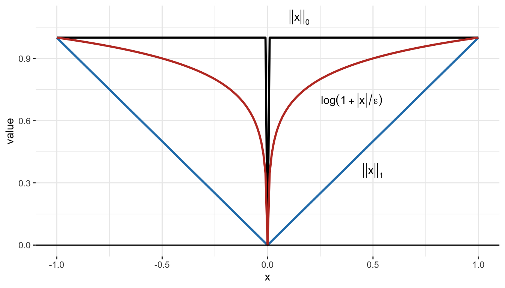
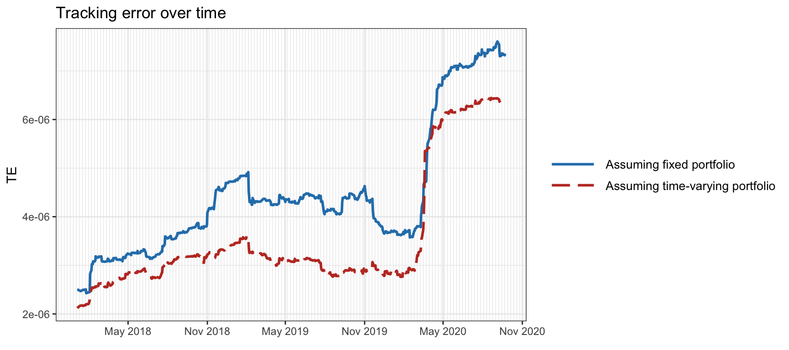
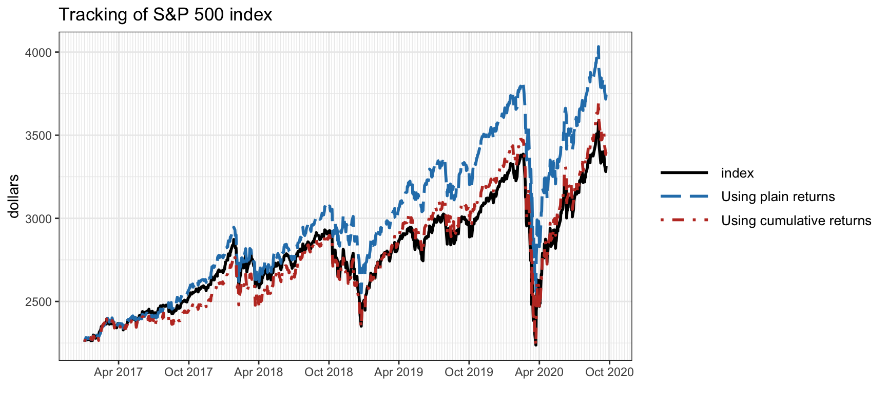
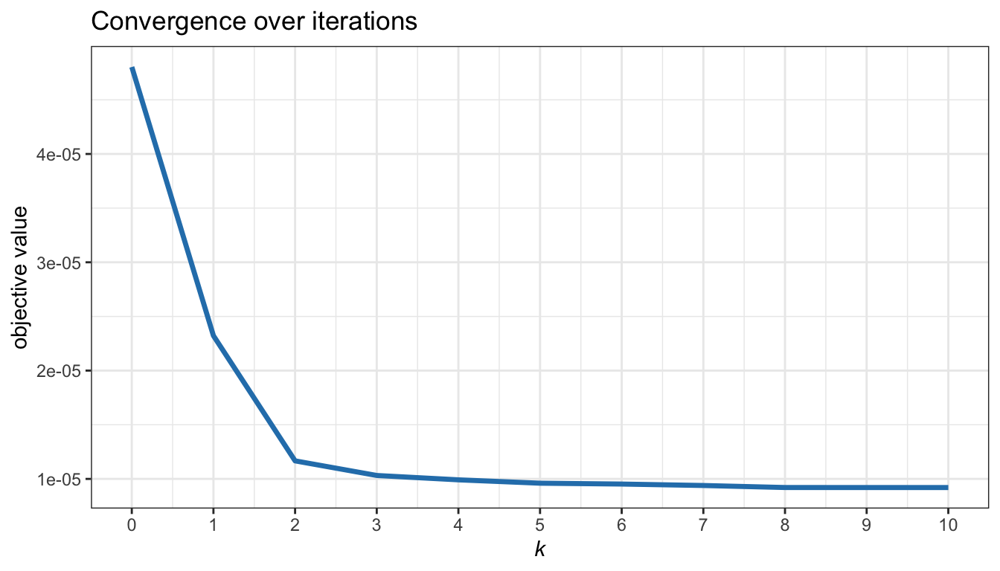

# Index Tracking Portfolios {#index-tracking}

> If you have assumed a character beyond your strength, you have both played a part ill, and have fallen in an unbecoming manner: you have gone aground.
>
> --- Epictetus, _The Enchiridion_

\bigskip

> "I never met another man I'd rather be. And even if that's a delusion, it's a lucky one."
>
> --- Charles Bukowski

<!---
> "I’d compare stock pickers to astrologers but I don’t want to bad mouth astrologers."
>
> --- Eugene Fama
--->

\afterquotespace
\acknowledgementCUP

Can we outsmart the market? The efficient-market hypothesis states that the price of a security already contains all the publicly available information about the future [@Fama1970], although another line of thought supports precisely the opposite view in favor of inefficient and irrational markets [@Shiller1981]. In any case, beating the market is routinely promised by investment funds, hedge funds, financial experts, but do they keep up their promises? Empirical analysis of data shows that about 95% of funds do not outperform the market [@Malkiel1973].

This chapter explores the topic of market or index tracking as an alternative to active investment strategies that attempt to beat the market: from heuristic and discretionary approaches, to more sophisticated optimization formulations, and even the most recent techniques to automatically choose the number of active assets in a statistically controlled way.

  This material has been published as:
  Daniel P. Palomar (2025). _Portfolio Optimization: Theory and Application_. Cambridge University Press.
  This version is free to view and download for personal use only; not for re-distribution, re-sale, or use in derivative works. ©\ Daniel P. Palomar 2025.

## Active vs. Passive Strategies

Strategies followed by investors can be classified into two main families:

- _Active strategies_: the premise is that the market is not perfectly efficient [@Shiller1981] and through expertise one can add value by choosing high-performing assets and beat the market performance. Examples include the portfolios paradigms presented in the previous chapters, namely: mean--variance portfolios (Chapter\ \@ref(MPT)), high-order portfolios (Chapter\ \@ref(high-order-portfolios)), portfolios with alternative measures of risk (Chapter\ \@ref(alternative-risk-measure-portfolios)), risk parity portfolios (Chapter\ \@ref(RPP)), and graph-based portfolios (Chapter\ \@ref(graph-based-portfolios)).

- _Passive strategies_: the assumption is that the market is efficient [@Fama1970], in the sense that prices reflect all available information, and as a consequence the market cannot be beaten in the long run [@Malkiel1973]. Passive investing methods seek to avoid the fees and limited performance that may occur with frequent trading and instead focus on infrequent rebalancing. This chapter deals with the problem of index tracking as a way of passive investment [@Prigent2007; @BenidisFengPalomar2018monograph].
\index{efficient-market hypothesis (EMH)}

### Beating the Market
Can investors consistently beat the market? One only hears from the winners. Nobody writes articles celebrating the worst-performing mutual fund manager. However, to perform a proper data analysis, we also need to collect data from the losers and separate luck from skill. 

Data clearly shows that individual investors who trade stocks directly pay a tremendous performance penalty for active trading [@BarberOdean2000]. Perhaps expert financial managers can do better?

<!---
The efficient market theory says that stocks always trade at their fair value, that all information available to investors is incorporated into the price of the stocks immediately. It’s not possible to find mispriced securities unless one has inside information. Stocks are never under priced or over priced – they are always correctly priced. And changes in security prices are always justified by known information. As such, an investor can’t pick stocks and outperform the “market” because there isn’t any inefficiency to exploit.
--->

The percentage of fund managers who do not outperform the index can vary depending on the time period, the index being used as a benchmark, and the specific group of fund managers being analyzed. However, numerous studies have found that around 85%--95% of actively managed mutual funds run by professional fund managers fail to outperform their respective benchmark indices over the long term [@Malkiel1973].

Some interesting and even provocative conclusions include [@Malkiel1973]:

<!---
- "investors are far better off buying and holding an index fund than attempting to buy and sell individual securities or actively managed mutual funds;"

- "the market prices stocks so efficiently that a blindfolded chimpanzee throwing darts at the stock listings can select a portfolio that performs as well as those managed by the experts."
--->

> investors are far better off buying and holding an index fund than attempting to buy and sell individual securities or actively managed mutual funds;

and

> the market prices stocks so efficiently that a blindfolded chimpanzee throwing darts at the stock listings can select a portfolio that performs as well as those managed by the experts.

As a consequence, most investors have figured out that they are not good at stock-picking or managing trades; most professionals are not either. Thus, paying high mutual fund expenses to a manager who underperforms a benchmark makes little sense. This realization has led to the rise of indices and inexpensive _exchange-traded funds_ (ETFs).

### What is a Financial Index?
\index{financial index}
A financial index is defined as a collection of carefully selected assets to capture the value of a specific market or a segment of it. An index is effectively equivalent to a hypothetical portfolio of assets; however, one cannot invest directly in it, that is, an index is not a financial instrument that can be traded.

An index is defined by the universe of assets composing it and also the percentage of the composition. The most common type of index follows a capitalization-weighted (cap-weighted) approach:[^types-indices] the assets are weighted based on the ratio of their market capitalization (number of outstanding shares multiplied by share price) to the overall capitalization of the assets that compose the index. The index value is then proportional to the weighted average of the capitalization of the underlying assets.

[^types-indices]: Apart from the common cap-weighted indices (weighted according to the market capitalization), there are other types of index construction methods, such as price weighted, equal weighted, fundamentally weighted, and factor weighted.

Standard & Poor’s 500 (S&P 500) is one of the world’s best-known (cap-weighted) indices and one of the most commonly used benchmarks for the U.S. stock market. Figure\ \@ref(fig:SP500-index-long-term) shows the price of the S&P 500 index over more than a decade. As can be observed, the S&P 500 has historically risen and reasonable returns can be obtained simply by following the market without active risk management (this still holds after adjusting the price for inflation assuming a 2% annual inflation rate). Note that this period includes two severe crises: the 2007--2008 global financial crisis and the COVID-19 recession (starting around February 2020).

(\#fig:SP500-index-long-term)Price evolution of the S\&P 500 index.

While it is difficult to give a precise number of existing financial indices, as new indices are created and old indices are retired or replaced regularly, it is safe to say that there are thousands of financial indices that cover a wide range of asset classes, sectors, and regions. Some of the most well-known indices include the S&P 500 (USA), Dow Jones Industrial Average (USA), Nasdaq Composite (USA), Hang Seng Index (Hong Kong), Shanghai Shenzhen CSI 300 Index (mainland China), Nikkei 225 (Japan), FTSE 100 (UK), DAX (Germany), and IBEX 35 (Spain), among many others.

### Index Tracking
\index{index tracking}
An index is just a definition based on a hypothetical portfolio of assets and cannot be directly traded. In practice, one has to construct a real portfolio that tracks or mimics the index as closely as possible. _Index tracking_, also known as _index replication_, is a passive portfolio management strategy that attempts to reproduce the performance of a market index. 

In the current financial markets, there are a staggering number of ETFs that precisely track any given index and investors can directly trade them. However, these ETFs still have to be constructed by financial managers. For example, as of 2023, there are over 250 ETFs that track the S&P 500 index, with the most popular one being the SPDR S&P 500 ETF, which happens to be the largest and oldest ETF in the world. Figure\ \@ref(fig:SP500-vs-SPY) shows the S&P 500 index together with the SPDR S&P 500 ETF (under the ticker SPY). As can be observed from the plot, its value is approximately 1/10 of the cash S&P 500 level. Nevertheless, this ratio is not exactly maintained in the long run, as it goes approximately from 1/14 to 1/10 over time during 2007--2023. This is not critical since for hedging purposes it is the short-term variations that matter.

(\#fig:SP500-vs-SPY)Tracking of the S\&P 500 index by the SPDR S\&P 500 ETF.

The most straightforward approach to create a tracking portfolio is by buying appropriate quantities of all the assets that compose the index, so-called _full replication_. This technique requires knowledge of the precise index composition, which is not always available in real time. It also needs a regular rebalancing of all the portfolio positions as the index composition is updated (including the less liquid assets), which translates into transaction costs.
<!--- and effectively into an impossibility of a perfect tracking. Indeed, the transaction costs are key in index tracking and they may affect some assets more than others depending on the liquidity. --->

Due to the aforementioned transaction cost reasons and also logistic arguments (managing a smaller portfolio is more convenient), it is advantageous from a practical standpoint to hold active positions only on a _reduced basket_ of representative assets of the whole index universe. For example, instead of keeping an active portfolio of 500 assets to track the S&P 500 index, it may be better and simpler to invest in, say, only 20 assets properly selected to represent the index. This is referred to as _sparse index tracking_ or _portfolio compression_ [@JansenVanDijk2002; @MaringerOyewumi2007; @ScozzariTardellaPaterliniKrink2013; @XuLuXu2016; @BenidisFengPalomar2018; @BenidisFengPalomar2018monograph; @MachkourMumaPalomar2025-index-tracking]. Interestingly, this problem is related to sparse regression techniques in statistics, as described next.

## Sparse Regression {#sparse-regression}
A vector is _sparse_ if it has many elements equal to zero. Sparsity is a very important property in a wide variety of problems where proper control of the sparsity level is desired [@Elad2010].

The _cardinality_ of a vector $\bm{x}\in\R^N$, denoted by $\textm{card}(\bm{x})$, refers to the number of nonzero elements:
$$
\textm{card}(\bm{x}) \triangleq \sum_{i=1}^N 1\{x_i \neq 0\},
$$
where $1\{\cdot\}$ denotes the indicator function. It is often written as the $\ell_0$-pseudo-norm $\|\bm{x}\|_0$, which is not a norm (in fact, it is not even convex).

### Problem Formulation
\index{sparse regression}
_Sparse regression_ refers to a regression problem with the additional requirement that the solution has to be sparse. Some common formulations of sparse regression includes:

- Regularized sparse least squares (LS):
$$
\begin{array}{ll}
\underset{\bm{x}}{\textm{minimize}} & \left\Vert \bm{A}\bm{x} - \bm{b} \right\Vert_2^2 + \lambda \|\bm{x}\|_0,
\end{array}
$$
where the parameter $\lambda$ can be chosen to enforce more or less sparsity in the solution.

- Constrained sparse LS:
$$
\begin{array}{ll}
  \underset{\bm{x}}{\textm{minimize}} & \left\Vert \bm{A}\bm{x} - \bm{b} \right\Vert_2^2\\
  \textm{subject to} & \|\bm{x}\|_0 \leq k,
\end{array}
$$
where $k$ is a parameter to control the sparsity level.

- Sparse underdetermined system of linear equations:
$$
\begin{array}{ll}
  \underset{\bm{x}}{\textm{minimize}} & \|\bm{x}\|_0\\
  \textm{subject to} & \bm{A}\bm{x} = \bm{b},
\end{array}
$$
where the system of linear equations $\bm{A}\bm{x} = \bm{b}$ is underdetermined (so that it has an infinite number of solutions).

Unfortunately, the cardinality operator is noncontinuous, nondifferentiable, and nonconvex, which means that developing practical algorithms under sparsity is not trivial. As a matter of fact, this has been a well-researched topic for decades and mature approximate methods are currently available, as described next.

### Methods for Sparse Regression
The most common approach to deal with the cardinality operator is to approximate it with a more convenient form for optimization methods. Figure\ \@ref(fig:indicator-function-approximations) shows the following two approximations (along with the indicator function):

- _$\ell_1$-norm approximation_: $\|\bm{x}\|_0$ is simply approximated by $\|\bm{x}\|_1$. In the univariate case, it means that the indicator function $1\{t \neq 0\}$ is approximated by the absolute value $|t|$.

- _Concave approximation_: $\|\bm{x}\|_0$ is better approximated by a concave function (rendering the sparse regression problem nonconvex). In the univariate case, it means that the indicator function $1\{t \neq 0\}$ is approximated by a concave function, such as the log-function $\textm{log}(1+t/\varepsilon)$, where $\varepsilon$ is a parameter controlling the accuracy of the approximation, although many other concave approximation have been proposed [@CandesWakinBoyd2008].

(\#fig:indicator-function-approximations)Indicator function and approximations.

#### $\ell_1$-Norm Approximation {-}
The most popular algorithm for sparse regression is undoubtedly the _LASSO_ (least absolute shrinkage and selection operator) [@Tibshirani1996], which solves the following convex quadratic problem based on the $\ell_1$-norm approximation:
$$
\begin{array}{ll}
  \underset{\bm{x}}{\textm{minimize}} & \left\Vert \bm{A}\bm{x} - \bm{b} \right\Vert_2^2\\
  \textm{subject to} & \|\bm{x}\|_1 \leq t,
\end{array}
$$
where $t$ is a parameter to control the sparsity level.
<!---A related method is the iterative soft-thresholding algorithm, also known as _basis pursuit_ [@ChenDonohoSunders1998].--->

Another popular method for sparse regression is the _elastic net_ [@ZouHastie2005], which overcomes some of the limitations of the LASSO. In particular, if groups of variables are highly correlated, the LASSO tends to select one variable from a group and ignore the others. The elastic net is a regularized regression method that linearly combines the $\ell_1$ and $\ell_2$ penalties of the LASSO and ridge methods.

It is worth noting that nonnegativity constraints alone can also induce sparsity in the solution [@Meinshausen2013].

Similarly, the sparse resolution of an underdetermined system of linear equations can be recovered in practice, under some technical conditions, as a linear program [@CandesTao2005; @Donoho2006]:
$$
\begin{array}{ll}
  \underset{\bm{x}}{\textm{minimize}} & \|\bm{x}\|_1\\
  \textm{subject to} & \bm{A}\bm{x} = \bm{b}.
\end{array}
$$

#### Concave Approximation {-}
In some cases, the $\ell_1$-norm approximation is not good enough and one needs to resort to a more refined concave approximation (as illustrated in Figure\ \@ref(fig:indicator-function-approximations)):
$$
\|\bm{x}\|_0 \approx \sum_{i=1}^N \phi(|x_i|),
$$
where $\phi(\cdot)$ is an appropriate concave function, such as the popular log-function
$$
\phi(t) = \textm{log}(1+t/\varepsilon).
$$
Alternative concave approximations can be used [@CandesWakinBoyd2008], such as the arc-tangent function or the $\ell_p$-norm for $0<p<1$. 

However, a concave approximation leads to a nonconvex problem formulation, such as
$$
\begin{array}{ll}
\underset{\bm{x}}{\textm{minimize}} & \begin{aligned}[t] \left\Vert \bm{A}\bm{x} - \bm{b} \right\Vert_2^2 + \lambda \sum_{i=1}^N \textm{log}\left(1 + \frac{|x_i|}{\varepsilon}\right) \end{aligned}.
\end{array}
$$
Fortunately, we can use the majorization--minimization framework to derive iterative methods to solve problems with concave approximations of the cardinality, as explored next. Other families of algorithms have also been successfully employed such as _iteratively reweighted least squares_ (IRLS)  minimization [@DaubechiesDevoreFornasierGunturk2010].

### Preliminaries on MM
\index{algorithms!majorization--minimization (MM)}
The majorization--minimization (MM) method (or framework) approximates a difficult optimization problem by a sequence of simpler approximated problems. We now give a concise description. For details, the reader is referred to Section\ \@ref(MM) in Appendix\ \@ref(optimization-algorithms), as well as the concise tutorial in @HunterLange2004, the long tutorial with applications in @SunBabPal2017, and the convergence analysis in @RazaviyaynHongLuo2013.

Suppose the following (difficult) problem is to be solved:
$$
  \begin{array}{ll}
  \underset{\bm{x}}{\textm{minimize}} & f(\bm{x})\\
  \textm{subject to} & \bm{x} \in \mathcal{X},
  \end{array}
$$
where $f(\cdot)$ is the (possibly nonconvex) objective function and $\mathcal{X}$ is a (possibly nonconvex) set. Instead of attempting to directly obtain a solution $\bm{x}^\star$ (either a local or global solution), the MM method will produce a sequence of iterates $\bm{x}^0, \bm{x}^1, \bm{x}^2,\dots$ that will converge to $\bm{x}^\star$.

More specifically, at iteration $k$, MM approximates the objective function $f(\bm{x})$ by a surrogate function around the current point $\bm{x}^k$ (essentially, a tangent upper bound), denoted by $u\left(\bm{x};\bm{x}^k\right)$, leading to the sequence of (simpler) problems:
$$
\bm{x}^{k+1}=\textm{arg}\underset{\bm{x}\in\mathcal{X}}{\textm{min}}\;u\left(\bm{x};\bm{x}^k\right), \qquad k=0,1,2,\dots
$$

In order to guarantee convergence of the iterates, the surrogate function $u\left(\bm{x};\bm{x}^k\right)$ has to satisfy the following technical conditions [@RazaviyaynHongLuo2013; @SunBabPal2017]:

- _upper bound property_: $u\left(\bm{x};\bm{x}^k\right) \geq f\left(\bm{x}\right)$;
- _touching property_: $u\left(\bm{x}^k;\bm{x}^k\right) = f\left(\bm{x}^k\right)$; and
- _tangent property_: $u\left(\bm{x};\bm{x}^k\right)$ must be differentiable with $\nabla u\left(\bm{x};\bm{x}^k\right) = \nabla f\left(\bm{x}\right)$.

The surrogate function $u\left(\bm{x};\bm{x}^k\right)$ is also referred to as a _majorizer_ because it is an upper bound of the original function. The fact that, at each iteration, first the majorizer is constructed and then it is minimized gives the name _majorization--minimization_ to the method.

### Iterative Reweighted $\ell_1$-Norm Minimization
We now employ the MM framework to derive an iterative algorithm to solve sparse regression problems. For illustration purposes, we will focus on the following formulation with a concave approximation of the cardinality operator:
\begin{equation}
  \begin{array}{ll}
  \underset{\bm{x}}{\textm{minimize}} & \begin{aligned}[t] \sum_{i=1}^N \textm{log}\left(1 + \frac{|x_i|}{\varepsilon}\right) \end{aligned}\\
  \textm{subject to} & \bm{A}\bm{x} = \bm{b}.
  \end{array}
  (\#eq:log-sparse-system-equations)
\end{equation}
Recall that many other concave functions can be used similarly [@CandesWakinBoyd2008].

In order to use MM, we need a key component: a majorizer of the concave function $\textm{log}(1+t/\varepsilon)$, which means that it has to be an upper-bound tangent on the point of interest. 

::: {.lemma #log-majorizer name="Majorizer of the log function"}
The concave function $\phi(t) = \log(1+t/\varepsilon)$ is majorized at $t=t_0$ by its linearization:
$$
\phi(t) \le \phi(t_0) + \phi(t_0)'(t-t_0) = \phi(t_0) + \frac{1}{\varepsilon + t_0}(t-t_0).
$$
:::

According to Lemma \@ref(lem:log-majorizer), the term $\textm{log}\left(1 + |x_i|/\varepsilon\right)$ is majorized at $x_{i}^{k}$ (up to an irrelevant constant) by
$\alpha_i^k\left|x_{i}\right|$ with weight $\alpha_i^k = 1/(\varepsilon + |x_{i}^k|)$. 

\index{algorithms!sparse regression via MM}
Concluding, we can solve the nonconvex problem \@ref(eq:log-sparse-system-equations) by solving the following sequence of convex problems [@CandesWakinBoyd2008], for $k=0,1,2,\dots$:
\begin{equation}
  \begin{array}{ll}
  \underset{\bm{x}}{\textm{minimize}} & \begin{aligned}[t] \sum_{i=1}^N \alpha_i^k|x_i| \end{aligned}\\
  \textm{subject to} & \bm{A}\bm{x} = \bm{b},
  \end{array}
  (\#eq:log-sparse-system-equations-MM)
\end{equation}
where the objective function is a weighted $\ell_1$-norm with weights $\alpha_i^k = 1/(\varepsilon + |x_{i}^k|)$. That is, the concave approximation of the sparse regression in \@ref(eq:log-sparse-system-equations) has been effectively solved by a sequence of iterative reweighted $\ell_1$-norm minimization problems as in \@ref(eq:log-sparse-system-equations-MM) [@CandesWakinBoyd2008].

## Sparse Index Tracking {#sparse-index-tracking}
The problem of sparse index tracking is in fact an instance of sparse regression and a variety of methods have been proposed in the literature to deal with the difficulty of cardinality constraint or sparsity control [@JansenVanDijk2002; @MaringerOyewumi2007; @ScozzariTardellaPaterliniKrink2013; @XuLuXu2016; @BenidisFengPalomar2018; @BenidisFengPalomar2018monograph].
\index{index tracking}

### Tracking Error {#tracking-error}
The return of an index or benchmark $r_t^\textm{b}$ is obtained from the returns of the $N$ constituent assets $\bm{r}_t \in \R^N$ via the definition of the index portfolio $\bm{b}_t > \bm{0}$ (normalized to $\bm{1}^\T\bm{b}_t = 1$) as
\begin{equation}
  \bm{r}_t^\T \bm{b}_{t-1} = r_t^\textm{b},\quad t=1,\dots,T,
  (\#eq:ret-bt)
\end{equation}
where the vector $\bm{b}_t$ denotes the proportion of capital allocated to the assets (see Section\ \@ref(portfolio-NAV) for details of the notation). Note that it is also possible to define a portfolio in terms of number of shares instead of capital allocation.

If the portfolio is fixed over time, $\bm{b}_t = \bm{b}$, then the notation becomes more compact. Denoting by $\bm{X} \in \R^{T\times N}$ the matrix containing the return vectors $\bm{r}_t$ along the rows and by $\bm{r}^\textm{b} \in \R^{T}$ the vector containing the returns of the index, we can then write
\begin{equation}
  \bm{X} \bm{b} = \bm{r}^\textm{b}.
  (\#eq:ret-fixed-b)
\end{equation}
However, it is important to remark that in most practical cases the index portfolio changes over time and the notation in \@ref(eq:ret-bt) is the correct one.

The goal is to design a sparse portfolio $\w_t$ such that $\bm{r}_t^\T \w_{t-1} \approx r_t^\textm{b}$ as in \@ref(eq:ret-bt). For simplicity of notation, we can assume a fixed portfolio over time, $\w_t = \w$, and then the goal can be written as the approximation $\bm{X} \w \approx \bm{r}^\textm{b}$ similarly to \@ref(eq:ret-fixed-b). Thus, probably the simplest way to define the _tracking error_ (TE) is
\begin{equation}
  \textm{TE} = \frac{1}{T}\left\|\bm{r}^\textm{b} - \bm{X}\w\right\|^2_2,
  (\#eq:TE-fixed-b)
\end{equation}
which fits naturally in the context of sparse regression of Section\ \@ref(sparse-regression).
Further expanding this with $\bm{X} \bm{b} = \bm{r}^\textm{b}$ leads to
$$
\textm{TE} = (\bm{b} - \w)^\T \frac{1}{T}\bm{X}^\T\bm{X} (\bm{b} - \w),
$$
which can be interpreted as an approximation of an alternative definition of the tracking error based on $\bm{b}:$
$$
\textm{TE}^\textm{b} = (\bm{b} - \w)^\T \bSigma (\bm{b} - \w),
$$
where $\bSigma$ is the covariance matrix of the returns. However, this requires knowledge of $\bm{b}$, which may or may not be available. In addition, in most practical cases the index portfolio $\bm{b}_t$ changes over time. Thus, the empirical error measure in \@ref(eq:TE-fixed-b) is preferred.

The tracking error definition in \@ref(eq:TE-fixed-b) is the most widely adopted measure in the literature [@Shapcott1992; @JansenVanDijk2002; @XuLuXu2016; @ScozzariTardellaPaterliniKrink2013; @BenidisFengPalomar2018; @BenidisFengPalomar2018monograph], with some exceptions that involve the portfolio defined in terms of number of shares [@BeasleyMeadeChang2003; @MaringerOyewumi2007]. Other more sophisticated measures of error are considered in Section\ \@ref(extensions-index-tracking). 

#### Fixed vs. Time-Varying Portfolio {-}
The tracking error definition in \@ref(eq:TE-fixed-b) is very convenient because it fits naturally in the context of sparse regression of Section\ \@ref(sparse-regression). However, it is important to remark that in most practical cases the index portfolio changes over time. For example, for cap-weighted indices (the most common ones), the normalized portfolio evolves by definition as
$$
\bm{b}_t = \frac{\bm{b}_{t-1} \odot \left(\bm{1} + \bm{r}_t\right)}{\bm{b}_{t-1}^\T \left(\bm{1} + \bm{r}_t\right)}.
$$
<!---which happens to correspond to the natural evolution of a portfolio as price changes (see \@ref(eq:wt-evol)).--->

As a consequence, it makes little sense to try to approximate this time-varying portfolio $\bm{b}_t$ with a constant portfolio $\w$ (except for the convenience of the simplicity of notation). In addition, even if we really wanted a fixed portfolio $\w$, this would imply a frequent rebalancing (with the corresponding transaction cost) because the normalized portfolio would otherwise naturally change over time (see \@ref(eq:wt-evol) in Chapter\ \@ref(portfolio-101) for details) as
$$
\w_t = \frac{\w_{t-1} \odot \left(\bm{1} + \bm{r}_t\right)}{\w_{t-1}^\T \left(\bm{1} + \bm{r}_t\right)}.
$$

Interestingly, it is still possible to express a tracking error with more realistic time-varying portfolios in the same convenient form as \@ref(eq:TE-fixed-b). The key is the following approximation based on the assumption that the index is being tracked, $\bm{r}_t^\T \w_{t-1} \approx r_t^\textm{b}$:
$$
\w_t \approx \frac{\w_{t-1} \odot \left(\bm{1} + \bm{r}_t\right)}{1 + r_t^\textm{b}}  \approx \w_{0} \odot \bm{\alpha}_t,
$$
where $\w_{0}$ is the initial portfolio and 
\begin{equation}
  \bm{\alpha}_t = \prod_{t'=1}^{t}\frac{\bm{1} + \bm{r}_{t'}}{1 + r_{t'}^\textm{b}}
  (\#eq:alpha-bt)
\end{equation}
denotes weights based on the cumulative returns. This allows us to write the portfolio return as
$$
\bm{r}_t^\T \w_{t-1} \approx \bm{r}_t^\T \left(\w_{0} \odot \bm{\alpha}_{t-1}\right) = \tilde{\bm{r}}_t^\T \w_{0},
$$
where $\tilde{\bm{r}}_t = \bm{r}_t \odot \bm{\alpha}_{t-1}$ are properly weighted returns.

Thus, we can finally write the tracking error, similarly to \@ref(eq:TE-fixed-b), as
\begin{equation}
  \textm{TE}^\textm{time-varying} = \frac{1}{T}\left\|\bm{r}^\textm{b} - \tilde{\bm{X}}\w\right\|^2_2,
  (\#eq:TE-bt)
\end{equation}
where now $\tilde{\bm{X}}$ contains the weighted returns $\tilde{\bm{r}}_t$ along the rows and $\w$ denotes the initial portfolio $\w_0$.

Summarizing, the formulation in \@ref(eq:TE-fixed-b) assumes a fixed portfolio (as in most of the literature), which can be considered as a rough approximation, whereas \@ref(eq:TE-bt) provides a more accurate approximation.

Figure\ \@ref(fig:rolling-TE-wfixed-vs-wtimevarying) shows the tracking error over time with $K=20$ active assets under the approximation (or assumption) of a fixed portfolio $\w$ as in \@ref(eq:TE-fixed-b) and with the more accurate approximation of a time-varying portfolio as in \@ref(eq:TE-bt), which shows improved results.

(\#fig:rolling-TE-wfixed-vs-wtimevarying)Tracking error over time of the S\&P 500 index assuming fixed and time-varying portfolios.

#### Linear vs. Log-Returns {-}
Computing the portfolio returns as in \@ref(eq:ret-bt)--\@ref(eq:ret-fixed-b) or, simply, using the expression $\bm{X} \w$ implicitly assumes the use of linear returns in $\bm{X}$ and $\bm{r}^\textm{b}$ (recall that linear returns are additive along assets, cf. Chapter\ \@ref(portfolio-101)).

Nevertheless, one can similarly use log-returns in $\bm{X}$ and $\bm{r}^\textm{b}$ and define the tracking error in terms of log-returns. The log-returns $\bm{r}^{\textm{log}}_t$ and the linear returns $\bm{r}^{\textm{lin}}$ are related (see Chapter\ \@ref(portfolio-101)) as
$$
\bm{r}^{\textm{log}}_t = \textm{log}\left(\bm{1} + \bm{r}^{\textm{lin}}_t\right) \approx \bm{r}^{\textm{lin}}_t,
$$
because $\textm{log}(1 + x) \approx x$ for small $x$. Thus, the log-returns of the portfolio $\w$ can be approximated as
$$
\textm{log}\left(1 + \w^\T \bm{r}^{\textm{lin}}_t\right) \approx \w^\T \bm{r}^{\textm{log}}_t.
$$

In practice, the difference between using linear or log-returns is negligible.

#### Plain vs. Cumulative Returns {-}
It is worth pointing out that minimizing the error in terms of the period-by-period returns (plain returns) does not directly imply a better track of the cumulative returns (or price) over time. The reason is that the errors in the returns can accumulate over time on a more positive or negative side. If one really wants to control the long-term deviation of the cumulative returns, then the error measure should properly reflect this, for example, by using long-term returns rather than period-by-period returns or even by using cumulative returns [@BenidisFengPalomar2018monograph]. However, in numerous instances, tracking an index in the short term is essential for hedging purposes against other investments. In such cases, the objective is not to outperform the index, and it is the period-by-period returns that truly matter.

The price error can be measured by the tracking error in terms of the cumulative returns as
\begin{equation}
  \textm{TE}^\textm{cum} = \frac{1}{T}\left\|\bm{r}^\textm{b,cum} - \bm{X}^\textm{cum}\w\right\|^2_2,
  (\#eq:TE-cum-fixed-b)
\end{equation}
where $\bm{X}^\textm{cum}$ (similarly $\bm{r}^\textm{b,cum}$) denotes the cumulative returns, whose rows can be obtained as
<!---
$$
\bm{r}^\textm{cum}_t = 
\begin{cases}
  \bm{1} + \sum_{t'=1}^{t}\bm{r}_{t'},     & \textm{for log-returns}\\
  \prod_{t'=1}^{t}(\bm{1} + \bm{r}_{t'}),  & \textm{for linear returns}.
\end{cases}
$$
--->
$$
\bm{r}^\textm{cum}_t \approx \sum_{t'=1}^{t}\bm{r}_{t'}.
$$
For the case of linear returns, this expression follows from the approximation
$$
\prod_{t'=1}^{t}\left(\bm{1} + \bm{r}_{t'}^\T\w\right) - 1 \approx \prod_{t'=1}^{t} \textm{exp}\left(\bm{r}_{t'}^\T\w\right) - 1 =  \textm{exp}\left(\sum_{t'=1}^{t}\bm{r}_{t'}^\T\w\right) - 1 \approx \left(\sum_{t'=1}^{t}\bm{r}_{t'}\right)^\T\w,
$$
where we have used $1 + \bm{a}^\T\w \approx \textm{exp}(\bm{a}^\T\w)$. For log-returns, it follows from
$$
\textm{log}\left(\prod_{t'=1}^{t}\left(\bm{1} + \bm{r}_{t'}^\T\w\right)\right) = \sum_{t'=1}^{t} \textm{log}\left(\bm{1} + \bm{r}_{t'}^\T\w\right) \approx \left(\sum_{t'=1}^{t}\bm{r}_{t'}\right)^\T\w.
$$

Figure\ \@ref(fig:price-plain-vs-cum-returns) shows the tracking of the index price with $K=20$ active assets using plain and cumulative returns in the definition of tracking error as in \@ref(eq:TE-fixed-b) and \@ref(eq:TE-cum-fixed-b), respectively. Clearly, the cumulative returns provide a much better tracking of the index price (although not of the tracking error in terms of returns).

(\#fig:price-plain-vs-cum-returns)Tracking over time of the S\&P 500 index using plain returns and cumulative returns.

#### Summary of Tracking Errors {-}
Table\ \@ref(tab:tracking-matrix-table) summarizes the different tracking error definitions previously defined (ignoring the difference between linear and log-returns). To recall, the different data matrices employed are:

- $\bm{X}$: contains the plain returns $\bm{r}_t$ along the rows;

- $\tilde{\bm{X}}$: contains the weighted plain returns $\tilde{\bm{r}}_t = \bm{r}_t \odot \bm{\alpha}_{t-1}$ along the rows (with $\bm{\alpha}_t$ in \@ref(eq:alpha-bt));

- $\bm{X}^\textm{cum}$: contains the cumulative returns $\bm{r}^\textm{cum}_t \approx \sum_{t'=1}^{t}\bm{r}_{t'}$ along the rows; and

- $\tilde{\bm{X}}^\textm{cum}$: contains the weighted cumulative returns $\sum_{t'=1}^{t}\tilde{\bm{r}}_{t'}$.

<!---

(\#fig:tracking-matrix)Different data matrices employed in the definition of tracking error.

--->

<table class="table" style="width: auto !important; margin-left: auto; margin-right: auto;">
<caption>(\#tab:tracking-matrix-table)Different data matrices employed in the definition of tracking error.</caption>
 <thead>
  <tr>
   <th style="text-align:left;">   </th>
   <th style="text-align:center;"> Tracking of returns </th>
   <th style="text-align:center;"> Tracking of prices </th>
  </tr>
 </thead>
<tbody>
  <tr>
   <td style="text-align:left;"> Assuming $\bm{w}$ fixed </td>
   <td style="text-align:center;"> $\bm{X}$ </td>
   <td style="text-align:center;"> $\bm{X}^\textm{cum}$ </td>
  </tr>
  <tr>
   <td style="text-align:left;"> Assuming $\bm{w}$ time-varying </td>
   <td style="text-align:center;"> $\tilde{\bm{X}}$ </td>
   <td style="text-align:center;"> $\tilde{\bm{X}}^\textm{cum}$ </td>
  </tr>
</tbody>
</table>

### Problem Formulation
\index{index tracking}
\index{portfolios!index tracking}
\index{sparse regression!index tracking}
Formulating the index tracking problem is quite straightforward in terms of a sparse regression problem:
\begin{equation}
  \begin{array}{ll}
  \underset{\w}{\textm{minimize}} & \begin{aligned}[t] \frac{1}{T}\left\|\bm{r}^\textm{b} - \bm{X}\w\right\|^2_2 + \lambda \|\w\|_0 \end{aligned}\\
  \textm{subject to} & \begin{aligned}[t] \w \in \mathcal{W} \end{aligned},
  \end{array}
  (\#eq:index-tracking-sparse-TE)
\end{equation}
where the parameter $\lambda$ controls the level of sparsity in the portfolio, $\mathcal{W}$ denotes an arbitrary constraint set, such as $\mathcal{W} = \{\w \mid \bm{1}^\T\w=1, \w\ge\bm{0} \}$, and matrix $\bm{X}$ contains the returns of the assets (any version of returns as explored in Section\ \@ref(tracking-error)).

Index tracking is a type of passive investment that avoids the expensive transaction costs incurred by frequent trading associated with active portfolio management. Therefore, it may be advantageous to explicitly control the turnover in the formulation \@ref(eq:index-tracking-sparse-TE) by adding a penalty term or constraint to control the turnover $\| \w - \w_0 \|_1$, where $\w_0$ is the current portfolio [@BenidisFengPalomar2018; @BenidisFengPalomar2018monograph]. In practice, other variations on the basic index tracking formulation \@ref(eq:index-tracking-sparse-TE) are commonly used and will be explored in Section\ \@ref(extensions-index-tracking).

Recall that the cardinality operator on the portfolio $\|\w\|_0$ is noncontinuous, nondifferentiable, and nonconvex, which means that developing practical algorithms under sparsity is not trivial. We will start with some heuristic methods and build up to the state-of-the-art solutions based on MM.

### Methods for Sparse Index Tracking
An important observation is that if we knew a priori the active assets, then the index tracking would be a trivial convex regression problem without the difficulty of sparsity control. This leads to two-step approaches that first select the active assets and then proceed with the weight computation [@JansenVanDijk2002]. Nevertheless, such two-step approaches are not optimal and one can always do better by solving the problem jointly in a single step. Several methods have been proposed in the literature; some of them are computationally intensive, such as mixed integer programming or differential evolution techniques [@MaringerOyewumi2007], while others are computationally feasible but theoretically cannot guarantee to produce a globally optimal solution, such as the iterative reweighted $\ell_1$-norm optimization method [@BenidisFengPalomar2018; @BenidisFengPalomar2018monograph] or the projected gradient method [@XuLuXu2016].

#### Naive Two-Step Design {-}
This approach first selects the desired $K$ active assets from the universe of $N$ assets (with $K \ll N$) in some heuristic way [@JansenVanDijk2002]. This can be done, for example, based on 

- the weight of the assets in the index definition (e.g., the largest $K$ assets in $\bm{b}$);
- the market capitalization of the assets; or
- the strength of correlation between the assets and the index.

Once the active assets have been selected, then the weights are taken directly from the index definition $\bm{b}$ if available; otherwise, one can simply do a dense regression to obtain a proxy for $\bm{b}$.

In more detail, we can define the Boolean pattern vector $\bm{s} \in \R^{N}$ based on the selected assets:
$$
s_i=\begin{cases} 
1\quad & \textm{if the }i\textm{th asset is selected},\\
0      & \textm{otherwise},
\end{cases}
$$

so that $\bm{1}^\T\bm{s}=K$. Then, we can explicitly write the weights $\w$ proportional to the definition in $\bm{b}$ (although properly scaled so that $\bm{1}^\T\w=1$):
$$
\w = \frac{\bm{b} \odot \bm{s}}{\bm{1}^\T(\bm{b} \odot \bm{s})},
$$
where $\odot$ denotes the Hadamard (elementwise) product. 

#### Two-Step Design with Refitted Weights {-}
This approach refines the previous one by trying to refit the weights after the selection of the active assets [@JansenVanDijk2002]. To be exact, after the $K$ assets have been selected and the Boolean pattern vector $\bm{s}$ has been computed, we can form a simple regression problem over the active assets without having to deal with the sparsity issue. Thus, the original problem \@ref(eq:index-tracking-sparse-TE) becomes 
$$
  \begin{array}{ll}
  \underset{\w}{\textm{minimize}} & \begin{aligned}[t] \frac{1}{T}\left\|\bm{r}^\textm{b} - \bm{X}\w\right\|^2_2 \end{aligned}\\
  \textm{subject to} 
  & \begin{aligned}[t] \w \in \mathcal{W}, \end{aligned}\\
  & \begin{aligned}[t] w_i = 0 \quad\textm{if}\quad s_i = 0 \end{aligned}
  \end{array}
$$
or, equivalently,
$$
  \begin{array}{ll}
  \underset{\w}{\textm{minimize}} & \begin{aligned}[t] \frac{1}{T}\left\|\bm{r}^\textm{b} - \bm{X}\w\right\|^2_2 \end{aligned}\\
  \textm{subject to} 
  & \begin{aligned}[t] \w \in \mathcal{W}, \end{aligned}\\
  & \begin{aligned}[t] \w \leq \bm{s}. \end{aligned}
  \end{array}
$$

#### Mixed Integer Programming Formulation {-}
In mixed integer programming (MIP), variables are allowed to be constrained to a discrete set, making the problem nonconvex and generally with an exponential worst-case complexity. This makes this approach impractical unless the dimensionality of the problem (number of assets) is very small [@ScozzariTardellaPaterliniKrink2013].

The MIP formulation of \@ref(eq:index-tracking-sparse-TE) can be written in terms of the Boolean pattern vector $\bm{s}$, which is now a variable:
$$
  \begin{array}{ll}
  \underset{\w,\bm{s}}{\textm{minimize}} & \begin{aligned}[t] \frac{1}{T}\left\|\bm{r}^\textm{b} - \bm{X}\w\right\|^2_2 \end{aligned}\\
  \textm{subject to} 
  & \begin{aligned}[t] \w \in \mathcal{W}, \end{aligned}\\
  & \begin{aligned}[t] \w \leq \bm{s}, \; \bm{1}^\T\bm{s}=K, \; s_i\in\{0,1\} \end{aligned}.
  \end{array}
$$

#### Evolutionary Algorithms {-}
_Evolutionary algorithms_ are a family of optimization and search techniques inspired by the process of natural evolution. They operate on populations of candidate solutions, called individuals, which evolve over time while attempting to improve their fitness. Successful solutions are selected and combined to produce new candidate solutions akin to the natural selection process in living organisms.

Evolutionary algorithms have been applied to a wide range of problems, including optimization, machine learning, and game playing. They are particularly suitable for complex, multimodal, and noisy search spaces, where traditional optimization methods might struggle. Some key advantages include their ability to explore large solution spaces, robustness against local optima, and parallelization potential.

Some popular evolutionary algorithms include _genetic algorithms_ and _differential evolution_. Genetic algorithms use a binary or symbolic representation for solutions and apply genetic operators like selection, crossover, and mutation to evolve populations of chromosomes. Differential evolution focuses on continuous optimization problems and is known for its ability to tackle high-dimensional, non-linear, and noisy problems.

Evolutionary algorithms have been employed for index tracking as a way to solve the complicated nonconvex mixed-integer problem formulation. Some examples include @Shapcott1992, @BeasleyMeadeChang2003, and @MaringerOyewumi2007. Nevertheless, the computational complexity of evolutionary algorithms can be high since a population of solutions have to be evolved over many generations to properly explore the nonconvex fitness surface.

#### Iterative Reweighted $\ell_1$-Norm Method {-}
Two main approaches were considered in Section\ \@ref(sparse-regression) for sparse regression: based on the $\ell_1$-norm approximation and based on a concave approximation. Unfortunately, the commonly used method based on the $\ell_1$-norm $\|\w\|_1$ cannot be used in the context of portfolio optimization due to the portfolio constraints $\bm{1}^\T\w=1$ and $\w\ge\bm{0}$ that lead trivially to
$$
\|\w\|_1 = \bm{1}^\T\w = 1.
$$

\index{index tracking}
\index{portfolios!index tracking}
Thus, we need to resort to a more refined concave approximation of \@ref(eq:index-tracking-sparse-TE); for example, based on the log approximation:
\begin{equation}
  \begin{array}{ll}
  \underset{\w}{\textm{minimize}} & \begin{aligned}[t] \frac{1}{T}\left\|\bm{r}^\textm{b} - \bm{X}\w\right\|^2_2 + \lambda \sum_{i=1}^N \textm{log}\left(1 + \frac{|w_i|}{\varepsilon}\right) \end{aligned}\\
  \textm{subject to} & \begin{aligned}[t] \w \in \mathcal{W} \end{aligned}.
  \end{array}
  (\#eq:index-tracking-wl1-norm-TE)
\end{equation}
This nonconvex problem can then be addressed with the MM framework to obtain a convenient iterative procedure called the _iterative reweighted $\ell_1$-norm method_ and summarized in Algorithm\ 13.1.[^R-sparseIndexTracking]

\index{algorithms!index tracking via MM}

:::: plain_algorithm
::: lined
**Algorithm 13.1**: Iterative reweighted $\ell_1$-norm method to solve the approximated sparse index tracking problem \@ref(eq:index-tracking-wl1-norm-TE).
:::
Choose initial point $\w^0 \in \mathcal{W}$;  
Set $k \gets 0$;  
**repeat**

  1. Compute weights $$\alpha_i^k = \frac{1}{\varepsilon + \left|w_i^k\right|};$$
  2. Solve the following weighted $\ell_1$-norm problem to obtain $\w^{k+1}$:
  $$
  \begin{array}{ll}
  \underset{\w}{\textm{minimize}} & \begin{aligned}[t] \frac{1}{T}\left\|\bm{r}^\textm{b} - \bm{X}\w\right\|^2_2 + \lambda \sum_{i=1}^N \alpha_i^k|w_i|\end{aligned}\\
  \textm{subject to} & \begin{aligned}[t] \w \in \mathcal{W} \end{aligned};
  \end{array}
  $$
  3. $k \gets k+1$;
  
**until** convergence;
::::

Since \@ref(eq:index-tracking-wl1-norm-TE) is a nonconvex problem, the algorithm may potentially get stuck in a local minimum. In practice, for highly sparse solutions this behavior can be observed. To deal with this issue, one can start with more dense solutions, corresponding to a small value of $\lambda$, and then sequentially increase the sparsity level by increasing $\lambda$ [@BenidisFengPalomar2018; @BenidisFengPalomar2018monograph].

It is interesting to remark that the main step of Algorithm\ 13.1 requires solving an $\ell_2$-norm weighted $\ell_1$-norm problem, which can be done with a quadratic program solver (assuming the feasible set $\mathcal{W}$ only contains linear and quadratic terms). Nevertheless, it is possible in most practical cases, to further majorize the problem in order to obtain a closed-form solution without the need for a solver [@BenidisFengPalomar2018; @BenidisFengPalomar2018monograph]. <!---A software implementation of Algorithm 13.1 is available in R.[^R-sparseIndexTracking]--->

[^R-sparseIndexTracking]: The R package [`sparseIndexTracking`](https://cran.r-project.org/package=sparseIndexTracking) implements Algorithm\ 13.1 based on @BenidisFengPalomar2018 and @BenidisFengPalomar2018monograph as well as a number of extensions covered in Section\ \@ref(extensions-index-tracking) [@sparseIndexTracking]. \index{R packages!sparseIndexTracking}

### Numerical Experiments

#### Convergence of the Iterative Reweighted $\ell_1$-Norm Method {-}
Figure\ \@ref(fig:convergence-index-tracking-MM) illustrates the convergence of the iterative reweighted $\ell_1$-norm method described in Algorithm\ 13.1. We can see that the convergence is extremely fast and that two to three iterations seem to reap most of the benefit.

(ref:convergence-index-tracking-MM) Convergence of the iterative reweighted $\ell_1$-norm method for sparse index tracking.

(\#fig:convergence-index-tracking-MM)(ref:convergence-index-tracking-MM)

#### Comparison of Algorithms {-}
We now compare the tracking of the S&P 500 index based on different tracking methods, namely:

- the naive two-step approach with proportional weights to the index definition;
- the two-step approach with refitted weights;
- the iterative reweighted $\ell_1$-norm method in Algorithm\ 13.1; and
- the MIP formulation (although the computational complexity is too high).

Figure\ \@ref(fig:rolling-TE-comparison-algorithms) shows the tracking error over time of the S&P 500 index with $K=20$ active assets (the MIP method is excluded due to its huge computational cost). The tracking portfolios are computed on a rolling-window basis with a lookback period of two years and recomputed every six months. To get a more complete picture, Figure\ \@ref(fig:TEvsK-tradeoff-comparison-algorithms) explores the trade-off of tracking error vs. the number of active assets $K$ (including the MIP method). We can observe that, as expected, the joint designs are superior to the traditional two-step approaches. While the MIP formulation is impractical due to the huge computational cost, the iterative reweighted $\ell_1$-norm method exhibits low complexity, making it a suitable approach in practice. For more exhaustive numerical comparisons, the reader is referred to @BenidisFengPalomar2018 and @BenidisFengPalomar2018monograph.

(\#fig:rolling-TE-comparison-algorithms)Tracking error over time of the S\&P 500 index for different algorithms.

(\#fig:TEvsK-tradeoff-comparison-algorithms)Tracking error of the S\&P 500 index vs. active assets for different algorithms.

#### Comparison of Formulations {-}
Finally, we consider again the comparison between assuming a fixed portfolio and a time-varying one in the definition of tracking error as in \@ref(eq:TE-fixed-b) and \@ref(eq:TE-bt), respectively. This comparison was already illustrated in Figure\ \@ref(fig:rolling-TE-wfixed-vs-wtimevarying) in terms of tracking error over time. For a more complete comparison, Figure\ \@ref(fig:TEvsK-tradeoff-wfixed-wtimevarying) shows the trade-off of tracking error vs. cardinality. Indeed, the error definition in \@ref(eq:TE-bt) under a time-varying portfolio is slightly more accurate.

(\#fig:TEvsK-tradeoff-wfixed-wtimevarying)Tracking error of the S\&P 500 index vs. active assets assuming fixed and time-varying portfolios.

## Enhanced Index Tracking {#extensions-index-tracking}
_Enhanced index tracking_ refers to variations on the basic index tracking formulation \@ref(eq:index-tracking-sparse-TE). They generally attempt to increase returns by building portfolios around index-like positions but then adding tactical tilts toward specific styles or individual stocks. This has been used by professional portfolio managers for decades [@XuMaLu2022] and some examples will be explored next.

### Alternative Tracking Error Measures
The tracking error used in Section\ \@ref(sparse-index-tracking) is based on the $\ell_2$-norm between the achieved returns $\bm{X}\w$ and the benchmark returns $\bm{r}^\textm{b}$:
\begin{equation}
  \textm{TE}(\w) = \frac{1}{T}\left\|\bm{r}^\textm{b} - \bm{X}\w\right\|^2_2.
  (\#eq:index-tracking-TE)
\end{equation}
This is a very simple way to measure the size of the tracking error and one could consider many other alternatives by either changing the norm (e.g., using the $\ell_1$-norm or the $\ell_p$-norm [@BeasleyMeadeChang2003]) or changing the error measure altogether, such as the excess return $\frac{1}{T} \bm{1}^\T\left(\bm{X}\w - \bm{r}^\textm{b}\right)$ [@BeasleyMeadeChang2003; @DoseCincotti2005], the downside risk, value at risk, or conditional value at risk (as defined in Chapter\ \@ref(portfolio-101) and explored in detail in Chapter\ \@ref(alternative-risk-measure-portfolios) for portfolio design). We now consider the downside risk and the $\ell_1$-norm tracking error for illustration purposes.

#### Downside Risk Error Measure {-}
A particularly interesting alternative is the _downside risk_ that only takes into account when the achieved returns are worse than those of the benchmark,
\begin{equation}
  \textm{DR}(\w) = \frac{1}{T}\left\|\left(\bm{r}^\textm{b} - \bm{X}\w\right)^+\right\|^2_2,
  (\#eq:index-tracking-DR)
\end{equation}
where the operator $(\cdot)^+\triangleq\textm{max}(0,\cdot)$ only considers returns smaller than the benchmark. This falls into the realm of enhanced index tracking.

It is worth pointing out that while using this tracking error measure may have the benefit of possibly beating the index, it is not appropriate for hedging purposes since that requires tracking the index in both directions.

Two key observations arise regarding portfolio optimization under the downside risk $\textm{DR}(\w)$. First, $\textm{DR}(\w)$ is a convex function of $\w$ and, therefore, it can be effectively optimized in practice with an appropriate solver. Second, it can be easily majorized for the purpose of using the MM method; in particular, we can choose a majorizer with the form of an $\ell_2$-norm and then the methods presented in Section\ \@ref(sparse-index-tracking) can be readily employed.

::: {.lemma #DR-majorizer name="Majorizer of the downside risk"}
The downside risk function $\textnormal{DR}(\w)$ in \@ref(eq:index-tracking-DR) is majorized at $\w = \w_0$ by $\textnormal{TE}(\w)$ in \@ref(eq:index-tracking-TE) with shifted benchmark returns $\tilde{\bm{r}}^\textnormal{b}$:
$$
\textnormal{DR}(\w) \le \frac{1}{T}\left\|\tilde{\bm{r}}^\textnormal{b} - \bm{X}\w\right\|^2_2,
$$
where $\tilde{\bm{r}}^\textnormal{b} = \bm{r}^\textnormal{b} + \left(\bm{X}\w_0 - \bm{r}^\textnormal{b}\right)^+$ [@BenidisFengPalomar2018; @BenidisFengPalomar2018monograph].
:::

The shifted benchmark returns $\tilde{\bm{r}}^\textm{b}$ in Lemma \@ref(lem:DR-majorizer) have an interesting interpretation: they are an improvement of the original returns $\bm{r}^\textm{b}$ for those returns that were outperformed by the nominal portfolio $\w_0$.

According to Lemma \@ref(lem:DR-majorizer), index tracking under the downside risk can still be accomplished with Algorithm\ 13.1 under a slight modification: at each iteration $k$, use the shifted benchmark returns $\big(\tilde{\bm{r}}^\textm{b}\big)^k = \bm{r}^\textm{b} + \left(\bm{X}\w^k - \bm{r}^\textm{b}\right)^+.$

#### $\ell_1$-Norm Tracking Error {-}
The TE in \@ref(eq:index-tracking-TE) is based on the $\ell_2$-norm, but this is a rather arbitrary choice. In fact, one may argue that the $\ell_1$-norm would make more sense:
\begin{equation}
  \textm{TE}_1(\w) = \frac{1}{T}\left\|\bm{r}^\textm{b} - \bm{X}\w\right\|_1.
  (\#eq:index-tracking-TE1)
\end{equation}
This error measure is a convex function and, furthermore, it can be conveniently majorized in the form of an $\ell_2$-norm as in the case of the tracking error considered in Section\ \@ref(sparse-index-tracking).

(ref:TE1-majorizer) Majorizer of the $\ell_1$-norm TE

::: {.lemma #TE1-majorizer name="(ref:TE1-majorizer)"}
The $\ell_1$-norm tracking error function $\textnormal{TE}_1(\w)$ in \@ref(eq:index-tracking-TE1) is majorized at $\w = \w_0$ by a weighted version of the $\textnormal{TE}(\w)$ in \@ref(eq:index-tracking-TE):
$$
\textnormal{TE}_1(\w) \le \frac{1}{T}\left\|\bm{r}^\textnormal{b} - \bm{X}\w\right\|_{2,\bm{\alpha}}^2,
$$
where $\|\bm{x}\|_{2,\bm{\alpha}}^2 \triangleq \sum_{i=1}^T \alpha_i x_i^2$ is the squared weighted $\ell_2$-norm with weights $\bm{\alpha} = 1/(2|\bm{r}^\textnormal{b} - \bm{X}\w_0|)$. See Section\ \@ref(MM) in Appendix\ \@ref(optimization-algorithms) for details.
:::

The weights in the weighted $\ell_2$-norm TE in Lemma \@ref(lem:TE1-majorizer) have a natural interpretation: their role is to down-weight the errors so that they grow in an approximately linear fashion like in the $\ell_1$-norm, as expected.

According to Lemma \@ref(lem:TE1-majorizer), index tracking under the $\ell_1$-norm TE can still be accomplished with Algorithm\ 13.1 under a slight modification: at each iteration $k$, use the weighted $\ell_2$-norm with weights $\bm{\alpha}^k = 1/(2|\bm{r}^\textm{b} - \bm{X}\w^k|).$

### Robust Tracking Error Measures
\index{robust estimators}
Robustness against outliers in the data is paramount in order to mitigate the effects of data contamination and avoid being sensitive or even breaking down (Section\ \@ref(heavy-tail-ML) in Chapter\ \@ref(iid-modeling) covers the topic of robust estimators).

Any tracking error measure can be made robust to make it less sensitive to outliers. For illustration purposes, take the tracking error in \@ref(eq:index-tracking-TE) used in Section\ \@ref(sparse-index-tracking). This measure is based on the $\ell_2$-norm between the achieved returns $\bm{X}\w$ and the benchmark returns $\bm{r}^\textm{b}$, but the $\ell_2$-norm is not a robust measure because it is sensitive to (anomalous) large errors due the the squaring operation. Of course, one alternative is to use the $\ell_1$-norm tracking error in \@ref(eq:index-tracking-TE1), which is naturally robust.

Alternatively, we can make the $\ell_2$-norm robust with the Huber penalty function [@Huber2011]:
$$\phi^{\textm{hub}}(x)=\begin{cases}
x^{2},                  & \quad|x|\leq M,\\
M\left(2|x| - M\right), & \quad|x|>M,
\end{cases}$$
which essentially behaves as the square function $x^2$ for arguments up to a magnitude of $M$ and as a linear function otherwise (this way outliers are not amplified). We can then define a Huberized version of the tracking error:
\begin{equation}
  \textm{Hub-TE}(\w) = \frac{1}{T}\sum_{t=1}^T \phi^{\textm{hub}}(r_t^\textm{b} - \bm{X}_{t,:}\w),
  (\#eq:index-tracking-Hub-TE)
\end{equation}
which is a convex function. In addition, it can be conveniently majorized in the form of an $\ell_2$-norm as in the case of the tracking error considered in Section\ \@ref(sparse-index-tracking).

::: {.lemma #Hub-TE-majorizer name="Majorizer of the Huberized TE"}
The Huberized tracking error function $\textnormal{Hub-TE}(\w)$ in \@ref(eq:index-tracking-Hub-TE) is majorized at $\w = \w_0$ by a weighted version of the $\textnormal{TE}(\w)$ in \@ref(eq:index-tracking-TE):
$$
\textnormal{Hub-TE}(\w) \le \frac{1}{T}\left\|\bm{r}^\textnormal{b} - \bm{X}\w\right\|_{2,\bm{\alpha}}^2 + \textm{const.},
$$
where $\|\bm{x}\|_{2,\bm{\alpha}}^2 \triangleq \sum_{i=1}^T \alpha_i x_i^2$ is the squared weighted $\ell_2$-norm with weights
$$
\bm{\alpha} = \textnormal{min}\left(\bm{1}, \frac{M}{|\bm{r}^\textnormal{b} - \bm{X}\w_0|}\right),
$$

and the term $\textm{const.}$ refers to an irrelevant constant term [@BenidisFengPalomar2018; @BenidisFengPalomar2018monograph].
:::

The weights in the Huberized TE have a very natural interpretation: their role is to down-weight the errors that are larger than $M$ in magnitude so that the squared values grow linearly instead.

According to Lemma \@ref(lem:Hub-TE-majorizer), index tracking under the Huberized TE can still be accomplished with Algorithm\ 13.1 under a slight modification: at each iteration $k$, use the weighted $\ell_2$-norm with weights
$$
\bm{\alpha}^k = \textm{min}\left(\bm{1}, \frac{M}{|\bm{r}^\textm{b} - \bm{X}\w^k|}\right).
$$

### Holding Constraints
In practice, portfolios typically have holding constraints:

- _upper bounds_ ($\w \le \bm{u}$): this is to avoid risk from allocating too much budget to a single asset and to promote diversification; and

- _lower bounds_ ($\w \ge \bm{l}$): this is to avoid very small positions that are irrelevant to the overall portfolio and just complicate the logistics.

These bound constraints are trivial linear inequality constraints. However, when dealing with sparsity, the lower bounds become incompatible with sparse solutions. In this case, the lower bounds should only become active for active assets:
$$
w_i \; \begin{cases}
\ge l_i, & \textm{if }w_i > 0,\\
= 0,     & \textm{otherwise}.
\end{cases}
$$
<!---
$$
w_i \ge l_i \times 1\{w_i>0\}
$$
--->
These complicated nonconvex constraints can be easily incorporated into evolutionary algorithms [@BeasleyMeadeChang2003; @MaringerOyewumi2007]. Interestingly, they can also be approximated and solved via the MM framework in a convenient way [@BenidisFengPalomar2018; @BenidisFengPalomar2018monograph].

### Group Sparsity
Stocks and other financial assets are classified and grouped together into sectors and industries. This organization is convenient for investors in order to easily diversify their investment across different sectors (which presumably are less correlated than stocks within each sector).

All the index tracking formulations considered thus far are able to control the sparsity of the portfolio via the term $\|\w\|_0$. Nevertheless, it is possible to have a more refined control by taking account of stock industry profiles. One way is by replacing the overall sparsity term $\|\w\|_0$ by a "group sparsity" term that is able to construct a portfolio composed of a specific number of stocks concentrating on a few industries, and ensures both industry-wise and within-industry sparsity [@XuMaLu2022].

### Numerical Experiments
We now compare the tracking of the S&P 500 index based on different tracking error measures of the cumulative returns, namely:

- TE in \@ref(eq:index-tracking-TE);
- Huberized TE in \@ref(eq:index-tracking-Hub-TE);
- $\ell_1$-norm TE in \@ref(eq:index-tracking-TE1); and
- DR in \@ref(eq:index-tracking-DR).

Figure\ \@ref(fig:wealth-comparison-extensions-index-tracking) shows the tracking over time with approximately $K=20$ active assets. The tracking portfolios are computed on a rolling-window basis with a lookback period of two years and recomputed every six months. As expected, one can observe that the design based on the downside risk beats the market (suitable for investment purposes) while the other measures generally track the index in both directions (appropriate for hedging purposes).<!--- The Huberized TE seems to work slightly better than the nominal TE.--->

(\#fig:wealth-comparison-extensions-index-tracking)Tracking over time of the S\&P 500 index under different tracking error measures.

## Automatic Sparsity Control
The sparse index tracking formulation in \@ref(eq:index-tracking-sparse-TE) includes the regularization term $\lambda \|\w\|_0$ in the objective, where $\lambda$ is a hyper-parameter to be chosen in order to get the desired level of sparsity. Alternatively, it can be formulated by moving the sparsity term to the constraints as $\|\w\|_0 \le k$, with $k$ denoting the desired level of sparsity. Either way, by properly adjusting the sparsity hyper-parameter, $\lambda$ or $k$, different points on the error vs. sparsity trade-off curves in Figures\ \@ref(fig:TEvsK-tradeoff-comparison-algorithms)--\@ref(fig:TEvsK-tradeoff-wfixed-wtimevarying) can be achieved.

In practice, however, the goal is to choose a proper operating point on the error vs. sparsity trade-off curve, preferably without having to compute the whole trade-off curve. Is there a convenient way to tune the sparsity hyper-parameter to get a proper operating point in the trade-off curve?

### False Discovery Rate (FDR)
\index{false discovery rate (FDR)}
To properly answer the question of how to choose the operating point on the trade-off curve, we need to introduce some concepts from statistics and hypothesis testing. In particular, a key quantity when deciding whether to use a variable or not in a regression problem is the _false discovery rate_ (FDR), which refers to the probability of wrongly including a variable. 

In some applications, such as genomics, including the wrong variables can be catastrophic as it implies that some gene is incorrectly associated with some medical condition. In finance, for example, hundreds of papers have been written attempting to discover factors that explain the cross-section of expected returns, but are these results false? Apparently so. Based on a hypothesis testing analysis of empirical tests since 1967, it seems that most claimed research findings in financial economics are likely false [@HarveyLiuZhu2016]. 

Controlling the FDR would be an ideal and sound way to decide whether to include a variable and this was achieved in the seminal paper by @BenjaminiHochberg1995. Since then, many FDR-controlling methods have been proposed, with the most popular one being based on the concept of _knockoffs_ [@BarberCandes2015]. Knockoffs are fictitious variables that are created for the purpose of FDR control; they need to mimic the covariance structure of the original variables and this can be computationally demanding since this requires the estimation of the covariance matrix, which can be difficult in high-dimensional settings.

More recently, a more practical method for FDR control called T-Rex (for Terminating-Random EXperiments) was proposed based on the concept of _dummies_ [@MachkourMumaPalomar2022-TRex]. Dummies are also fictitious variables used to control the FDR, but they are easy to generate since they do not require following the same covariance structure of the original variables. Instead, dummies can be sampled from any univariate probability distribution. The T-Rex method effectively reduces the computation time by two orders of magnitude compared to the competing methods.

### FDR for Index Tracking
\index{false discovery rate (FDR)!index tracking}
In the context of sparse index tracking, instead of selecting the sparsity level through trial and error, a more robust approach would be to precisely control the FDR. However, the interpretation of FDR is slightly different in this case because, strictly speaking, all the assets in the definition of an index are valid variables to be selected. Nevertheless, once an asset has been selected, it is typically the case that many other assets become redundant because they are highly correlated with that selected asset. In this sense we can say that selecting these irrelevant assets would be a "false discovery" and it is to be avoided.

The application of the T-Rex method to sparse index tracking with FDR control was developed in @MachkourMumaPalomar2025-index-tracking.[^R-TRexSelector] Rather than having to fix or tune the hyper-parameter $\lambda$ in \@ref(eq:index-tracking-sparse-TE), it automatically selects the assets to be included by controlling the FDR.

[^R-TRexSelector]: The R package [`TRexSelector`](https://cran.r-project.org/package=TRexSelector) [@TRexSelector] implements the T-Rex method based on @MachkourMumaPalomar2022-TRex and @MachkourMumaPalomar2025-index-tracking. \index{R packages!TRexSelector}

### Numerical Experiments
We now compare the tracking portfolios obtained from the sparse penalized regression formulation in \@ref(eq:index-tracking-sparse-TE) with the FDR-controlling T-Rex method [@MachkourMumaPalomar2025-index-tracking]. The tracking portfolios are computed on a rolling-window basis with a lookback period of two years and recomputed every six months.

Figure\ \@ref(fig:rolling-TE-comparison-FDR-index-tracking) shows the tracking error over time in terms of the plain returns \@ref(eq:TE-fixed-b) and cumulative returns \@ref(eq:TE-cum-fixed-b), as well as the cardinality of the portfolios over time. As can be seen, the formulation in \@ref(eq:index-tracking-sparse-TE) is very sensitive to the choice of the parameter $\lambda$, producing very different results in terms of tracking error and cardinality. On the other hand, the FDR-controlling T-Rex method automatically chooses the appropriate sparsity level without having to tune any parameter. The computational cost of T-Rex is slightly higher than that of solving \@ref(eq:index-tracking-sparse-TE) for a fixed $\lambda$ but lower than solving \@ref(eq:index-tracking-sparse-TE) for a whole range of values for $\lambda$.

(\#fig:rolling-TE-comparison-FDR-index-tracking)Tracking over time of the S\&P 500 index with and without FDR control.

<!---
Figure\ \@ref(fig:comparison-TEvsK-FDR-index-tracking) shows the achieved tracking error vs. the sparsity level. Problem \@ref(eq:index-tracking-sparse-TE) is very sensitive to the choice of the parameter $\lambda$; in fact, one can explore the whole trade-off curve by choosing different values of $\lambda$. On the other hand, the T-Rex method automatically chooses a good operating point on the trade-off curve and it is not very sensitive to the choice of the FDR value.

--->

## Summary
Active and passive strategies play a major role in the financial investment arena, both having theoretical and practical justifications albeit stemming from opposite views of the markets. Some key takeaways include:
<!---Index tracking is a major approach to passive investment with the following key points:--->

- _Passive investing methods_ seek to avoid the fees and limited performance that may occur with frequent active trading.

- _Index tracking_ is the mainstream approach for passive investment and simply tries to mimic an index, based on the assumption that the market is efficient and cannot be beaten.

- In current markets, there are thousands of _financial indices_ that cover a wide range of asset classes, sectors, and regions (e.g., the S&P 500). There are even more ETFs that precisely track any given index and investors can directly trade them (e.g., there are hundreds of ETFs that track the S&P 500 index).

- _Sparse index tracking_ is closely related to a fundamental problem in statistics called sparse regression. Its goal is to approximate an index but using a small number of active assets. The mathematical problem formulation requires a tracking error measure and a mechanism to control the sparsity level.

- A variety of _tracking error measures_ can be used for index tracking, such as the $\ell_2$-norm tracking error \@ref(eq:index-tracking-TE), the downside risk \@ref(eq:index-tracking-DR), the $\ell_1$-norm version \@ref(eq:index-tracking-TE1), and the Huberized robust version \@ref(eq:index-tracking-Hub-TE), among others.

- Many algorithms have been proposed for index tracking capable of controlling the sparsity or cardinality level. The iterative reweighted $\ell_1$-norm method in Algorithm\ 13.1 provides the best combination of tracking error while controlling the sparsity at a low computational cost.

- In practice, deciding the sparsity level is typically done by trial and error while tuning some hyper-parameter in a laborious and computationally demanding way. The recently proposed _FDR-controlling index tracking method_ is able to automatically determine the sparsity based on statistically sound hypothesis testing techniques.<!--- Figure\ \@ref(fig:rolling-TE-comparison-FDR-index-tracking) shows the effectiveness and convenience of this approach.--->

## Exercises {#exercises-ch13 -}
\markright{Exercises}

::: {.exercise name="Indices and ETFs"}
Download price data corresponding to some financial indices (e.g., the S&P 500, Dow Jones Industrial Average, Nasdaq) and some ETFs that track each of these indices (e.g., SPY for the S&P 500 index). Plot each index along with the corresponding ETFs in a linear and a logarithmic scale. Assess the tracking capabilities.
:::

::: {.exercise name="Active vs. passive investments"}
Download price data corresponding to some mutual funds and compare with appropriate financial indices. Plot the price time series and compute some performance measure, such as the Sharpe ratio, to compare their performance. Do these results support the efficient-market hypothesis, promoted by Fama, or the inefficient and irrational markets, promoted by Shiller?
:::

(ref:l1-norm-system-equations) Sparse regression via $\ell_1$-norm

::: {.exercise name="(ref:l1-norm-system-equations)"}
Generate an underdetermined system of linear equations $\bm{A}\bm{x} = \bm{b}$ with $\bm{A} \in \R^{5\times 10}$. Then, solve the following sparse underdetermined system of linear equations via brute force (i.e., trying all possible $2^{10}$ patterns for the variable $\bm{x}$):
$$
\begin{array}{ll}
  \underset{\bm{x}}{\textm{minimize}} & \|\bm{x}\|_0\\
  \textm{subject to} & \bm{A}\bm{x} = \bm{b}.
\end{array}
$$
Finally, solve the following linear program and compare the solution with the previous one:
$$
\begin{array}{ll}
  \underset{\bm{x}}{\textm{minimize}} & \|\bm{x}\|_1\\
  \textm{subject to} & \bm{A}\bm{x} = \bm{b}.
\end{array}
$$
:::

::: {.exercise name="Sparse least squares"}
Generate an overdetermined system of linear equations $\bm{A}\bm{x} = \bm{b}$ with $\bm{A} \in \R^{10\times 5}$. Consider the resolution of the sparse regression problem
$$
\begin{array}{ll}
  \underset{\bm{x}}{\textm{minimize}} & \left\Vert \bm{A}\bm{x} - \bm{b} \right\Vert_2^2\\
  \textm{subject to} & \|\bm{x}\|_0 \leq k
\end{array}
$$
via the following list of methods and plot the trade-off curve of regression error vs. sparsity level for each method:

a. Brute force (i.e., trying all possible $2^{5}$ patterns for the variable $\bm{x}$).

b. $\ell_1$-norm approximation:
$$
\begin{array}{ll}
\underset{\bm{x}}{\textm{minimize}} & \left\Vert \bm{A}\bm{x} - \bm{b} \right\Vert_2^2 + \lambda \|\bm{x}\|_1.
\end{array}
$$

c. Concave approximation using a general-purpose nonlinear solver:
$$
\begin{array}{ll}
\underset{\bm{x}}{\textm{minimize}} & \begin{aligned}[t] \left\Vert \bm{A}\bm{x} - \bm{b} \right\Vert_2^2 + \lambda \sum_{i=1}^N \textm{log}\left(1 + \frac{|x_i|}{\varepsilon}\right) \end{aligned}.
\end{array}
$$

d. Concave approximation again, but using the iterative reweighted $\ell_1$-norm method.
:::

::: {.exercise name="Cap-weighted indices"}
The portfolio of a cap-weighted index is defined in terms of the market capitalization. Denoting by $\bm{p}_t$ the prices of the $N$ assets at time $t$ and by $\bm{n}$ the number of outstanding shares of the $N$ assets. The capital portfolio of the assets is defined to be proportional to the market capitalization $\bm{n} \odot \bm{p}_t$, which leads to the normalized portfolio
$$
\bm{b}_t = \frac{\bm{n} \odot \bm{p}_t}{\bm{n}^\T\bm{p}_t}.
$$
Show that this normalized portfolio can also be expressed as
$$
\bm{b}_t = \frac{\bm{b}_{t-1} \odot \left(\bm{1} + \bm{r}_t\right)}{\bm{b}_{t-1}^\T \left(\bm{1} + \bm{r}_t\right)},
$$
where the returns are defined as
$$\bm{r}_t = \frac{\bm{p}_t - \bm{p}_{t-1}}{\bm{p}_{t-1}} = \frac{\bm{p}_t}{\bm{p}_{t-1}} - \bm{1}.$$
:::

::: {.exercise name="Tracking error measures"}
Download price data corresponding to some financial index (e.g., the S&P 500, Dow Jones Industrial Average, Nasdaq) and some ETFs that track the index (e.g., SPY for the S&P 500 index). Compute different error tracking measures, namely the $\ell_2$-norm tracking error, the downside risk, the $\ell_1$-norm tracking error, and the Huberized tracking error. Finally, plot a histogram of the tracking errors as a more complete picture of the tracking performance (note that the previous error measures are summarizations of the histogram).
:::

::: {.exercise name="Two-stage index tracking methods"}
Download price data corresponding to some financial index, such as the S&P 500, and the corresponding constituent $N$ assets for some period of time. Then, construct the benchmark return vector $\bm{r}^\textm{b}$ and the assets' return matrix $\bm{X}$, and formulate the sparse index tracking problem
$$
  \begin{array}{ll}
  \underset{\w}{\textm{minimize}} & \begin{aligned}[t] \frac{1}{T}\left\|\bm{r}^\textm{b} - \bm{X}\w\right\|^2_2 \end{aligned}\\
  \textm{subject to} & \begin{aligned}[t] \bm{1}^\T\w=1, \; \w\ge\bm{0}, \end{aligned}\\
                     & \begin{aligned}[t] \|\w\|_0 \le K. \end{aligned}
  \end{array}
$$

a. Solve the problem via a naive two-stage approach: simply select the $K$ active assets with some heuristic and then renormalize so that $\bm{1}^\T\w=1$.

b. Solve the problem via a two-stage approach with refitting of weights: select the $K$ active assets as before and then solve the convex regression problem with the selected assets.

Plot the trade-off curve of regression error vs. sparsity level $K$ for each method.
:::

::: {.exercise name="Sparse index tracking methods via concave sparsity approximation"}
Download price data corresponding to some financial index, such as the S&P 500, and the corresponding constituent $N$ assets for some period of time. Then, construct the benchmark return vector $\bm{r}^\textm{b}$ and the assets' return matrix $\bm{X}$, and formulate the sparse index tracking problem
$$
  \begin{array}{ll}
  \underset{\w}{\textm{minimize}} & \begin{aligned}[t] \frac{1}{T}\left\|\bm{r}^\textm{b} - \bm{X}\w\right\|^2_2 + \lambda \|\w\|_0 \end{aligned}\\
  \textm{subject to} & \begin{aligned}[t] \bm{1}^\T\w=1, \; \w\ge\bm{0} \end{aligned}
  \end{array}
$$
for different values of the hyper-parameter $\lambda$.

a. Approximate the sparsity regularizer with the concave log-function:
$$
  \begin{array}{ll}
  \underset{\w}{\textm{minimize}} & \begin{aligned}[t] \frac{1}{T}\left\|\bm{r}^\textm{b} - \bm{X}\w\right\|^2_2 + \lambda \sum_{i=1}^N \textm{log}\left(1 + \frac{|w_i|}{\varepsilon}\right) \end{aligned}\\
  \textm{subject to} & \begin{aligned}[t] \bm{1}^\T\w=1, \; \w\ge\bm{0} \end{aligned}.
  \end{array}
$$
Then solve the problem with a general-purpose nonconvex solver.

b. Apply the majorization--minimization approach to get the iterative reweighted $\ell_1$-norm method that solves sequentially, $k=0,1,2,\dots,$ the following:
  $$
  \begin{array}{ll}
  \underset{\w}{\textm{minimize}} & \begin{aligned}[t] \frac{1}{T}\left\|\bm{r}^\textm{b} - \bm{X}\w\right\|^2_2 + \lambda \sum_{i=1}^N \alpha_i^k|w_i|\end{aligned}\\
  \textm{subject to} & \begin{aligned}[t] \bm{1}^\T\w=1, \; \w\ge\bm{0}, \end{aligned}
  \end{array}
  $$
where
$$
\alpha_i^k = \frac{1}{\varepsilon + \left|w_i^k\right|}.
$$

Plot the trade-off curve of regression error vs. sparsity level for each method (by varying the hyper-parameter $\lambda$).
:::

::: {.exercise name="Sparse index tracking for downside risk"}
Download price data corresponding to some financial index, such as the S&P 500, and the corresponding constituent $N$ assets for some period of time. Then, construct the benchmark return vector $\bm{r}^\textm{b}$ and the assets' return matrix $\bm{X}$, and formulate the sparse index tracking problem
$$
  \begin{array}{ll}
  \underset{\w}{\textm{minimize}} & \begin{aligned}[t] \frac{1}{T}\left\|\left(\bm{r}^\textm{b} - \bm{X}\w\right)^+\right\|^2_2 + \lambda \|\w\|_0 \end{aligned}\\
  \textm{subject to} & \begin{aligned}[t] \bm{1}^\T\w=1, \; \w\ge\bm{0} \end{aligned}
  \end{array}
$$
for different values of the hyper-parameter $\lambda$.

a. Approximate the sparsity regularizer with the concave log-function and solve the problem with a general-purpose nonconvex solver.

b. Apply the majorization--minimization approach to get the iterative reweighted $\ell_1$-norm method that solves sequentially the following convex problem:
  $$
  \begin{array}{ll}
  \underset{\w}{\textm{minimize}} & \begin{aligned}[t] \frac{1}{T}\left\|\left(\bm{r}^\textm{b} - \bm{X}\w\right)^+\right\|^2_2 + \lambda \sum_{i=1}^N \alpha_i^k|w_i|\end{aligned}\\
  \textm{subject to} & \begin{aligned}[t] \bm{1}^\T\w=1, \; \w\ge\bm{0}, \end{aligned}
  \end{array}
  $$
where
$$
\alpha_i^k = \frac{1}{\varepsilon + \left|w_i^k\right|}.
$$

c. Apply the majorization--minimization approach fully to get the iterative reweighted $\ell_1$-norm method that solves sequentially the following convex problem:
  $$
  \begin{array}{ll}
  \underset{\w}{\textm{minimize}} & \begin{aligned}[t] \frac{1}{T}\left\|\big(\tilde{\bm{r}}^\textm{b}\big)^k - \bm{X}\w\right\|^2_2 + \lambda \sum_{i=1}^N \alpha_i^k|w_i|\end{aligned}\\
  \textm{subject to} & \begin{aligned}[t] \bm{1}^\T\w=1, \; \w\ge\bm{0}, \end{aligned}
  \end{array}
  $$
where now
$$\big(\tilde{\bm{r}}^\textm{b}\big)^k = \bm{r}^\textm{b} + \left(\bm{X}\w^k - \bm{r}^\textm{b}\right)^+.$$

Plot the trade-off curve of regression error vs. sparsity level for each method (by varying the hyper-parameter $\lambda$).
:::

::: {.exercise name="FDR-controlling method for sparse index tracking"}
Download price data corresponding to some financial index, such as the S&P 500, and the corresponding constituent $N$ assets for some period of time. Then, construct the benchmark return vector $\bm{r}^\textm{b}$ and the assets' return matrix $\bm{X}$, and formulate the sparse index tracking problem
$$
  \begin{array}{ll}
  \underset{\w}{\textm{minimize}} & \begin{aligned}[t] \frac{1}{T}\left\|\bm{r}^\textm{b} - \bm{X}\w\right\|^2_2 + \lambda \|\w\|_0 \end{aligned}\\
  \textm{subject to} & \begin{aligned}[t] \bm{1}^\T\w=1, \; \w\ge\bm{0}. \end{aligned}
  \end{array}
$$

a. Approximate the sparsity regularizer with the $\ell_1$-norm:
$$
  \begin{array}{ll}
  \underset{\w}{\textm{minimize}} & \begin{aligned}[t] \frac{1}{T}\left\|\bm{r}^\textm{b} - \bm{X}\w\right\|^2_2 + \lambda \|\w\|_1 \end{aligned}\\
  \textm{subject to} & \begin{aligned}[t] \bm{1}^\T\w=1, \; \w\ge\bm{0} \end{aligned}.
  \end{array}
$$
Then solve the problem for different values of $\lambda$ and plot the trade-off curve of regression error vs. sparsity level.

b. Employ the T-Rex method to automatically choose the active assets with FDR control.

<!---
3. Approximate the sparsity regularizer with the concave log-function:
$$
  \begin{array}{ll}
  \underset{\w}{\textm{minimize}} & \begin{aligned}[t] \frac{1}{T}\left\|\bm{r}^\textm{b} - \bm{X}\w\right\|^2_2 + \lambda \sum_{i=1}^N \textm{log}\left(1 + \frac{|w_i|}{\varepsilon}\right) \end{aligned}\\
  \textm{subject to} & \begin{aligned}[t] \bm{1}^\T\w=1, \; \w\ge\bm{0} \end{aligned}.
  \end{array}
$$

Apply the majorization--minimization approach to get the iterative reweighted $\ell_1$-norm method that solves sequentially $k=0,1,2,\dots,$ the following:
  $$
  \begin{array}{ll}
  \underset{\w}{\textm{minimize}} & \begin{aligned}[t] \frac{1}{T}\left\|\bm{r}^\textm{b} - \bm{X}\w\right\|^2_2 + \lambda \sum_{i=1}^N \alpha_i^k|w_i|\end{aligned}\\
  \textm{subject to} & \begin{aligned}[t] \bm{1}^\T\w=1, \; \w\ge\bm{0}, \end{aligned}
  \end{array}
  $$
where
$$
\alpha_i^k = \frac{1}{\varepsilon + \left|w_i^k\right|}.
$$

Plot the trade-off curve of regression error vs. sparsity level for each method (by varying the hyper-parameter $\lambda$).
--->
:::

