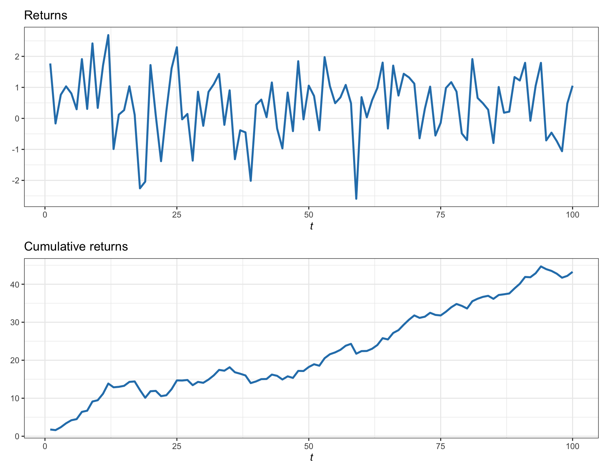

# Introduction {#intro}

> En un lugar de La Mancha, de cuyo nombre no quiero acordarme ...
>
> --- Miguel de Cervantes Saavedra, _Don Quixote_

<!---
> "In a village of La Mancha, the name of which I have no desire to call to mind..."
>
> --- Miguel de Cervantes Saavedra, Don Quixote
--->

<!---
> "There is no book ---no matter how bad it is--- that doesn't have something good in it."
>
> --- El Lazarillo de Tormes

“Live as if you were to die tomorrow. Learn as if you were to live forever.”
― Mahatma Gandhi
--->

\afterquotespace
\acknowledgementCUP

Modern portfolio theory started with Harry Markowitz’s 1952 seminal paper "Portfolio Selection" [@Markowitz1952], for which he would later receive the Nobel Prize in Economic Sciences[^not-nobel] in 1990. He put forth the idea that risk-averse investors should optimize their portfolio based on a combination of two objectives: expected return and risk. Until today, that idea has remained central to portfolio optimization. In practice, however, the vanilla Markowitz portfolio formulation does not perform as anticipated. Consequently, most practitioners either combine it with various heuristics or refrain from using it altogether.

Over the past 70 years, researchers and practitioners have reconsidered the Markowitz portfolio formulation, leading to numerous variations, enhancements, and alternatives. These include robust optimization methods, alternative risk measures, regularization through sparsity, improved covariance matrix estimators via random matrix theory, robust estimators for heavy tails, factor models, mean models, volatility clustering models, risk parity formulations, and more.

This book explores practical financial data modeling and portfolio optimization, covering a wide range of variations and extensions. It systematically starts with mathematical formulations and proceeds to develop practical numerical algorithms, supplemented with code examples to enhance understanding.

- The financial data modeling considered herein moves away from the unrealistic Gaussian assumption and delves into more realistic models based on heavy-tailed distributions. It encompasses an array of topics, ranging from basic time series models, making extensive use of Kalman filtering methods, to state-of-the-art techniques for estimating financial graphs.

- The portfolio formulations covered in this book span a wide range, from the original 1952 Markowitz's mean--variance portfolio and 1966 maximum Sharpe ratio portfolio, to more sophisticated formulations such as Kelly-based portfolios, utility-based portfolios, high-order portfolios, downside risk portfolios, semi-variance portfolios, CVaR portfolios, drawdown portfolios, risk parity portfolios, graph-based portfolios, index tracking portfolios, robust portfolios, bootstrapped portfolios, bagged portfolios, pairs trading portfolios, statistical arbitrage portfolios, and deep learning portfolios, among others. 

The primary focus and central theme of this book is on practical algorithms for portfolio formulations that can be effortlessly executed on a standard computer.

  This material has been published as:
  Daniel P. Palomar (2025). _Portfolio Optimization: Theory and Application_. Cambridge University Press.
  This version is free to view and download for personal use only; not for re-distribution, re-sale, or use in derivative works. ©\ Daniel P. Palomar 2025.

[^not-nobel]: To be exact, what is usually referred to as the Nobel Prize in Economic Sciences is actually the Sveriges Riksbank Prize in Economic Sciences in Memory of Alfred Nobel.

## What is Portfolio Optimization?
Suppose you observe a random variable $X$ with mean $\mu = \E[X]$ and variance $\sigma^2 = \E[(X - \mu)^2]$; for example, a normal (or Gaussian) random variable $X \sim \mathcal{N}(\mu,\sigma^2).$ The mean $\mu$ is the value you expect to obtain, whereas the variance $\sigma^2$ gives the variability or randomness around that value. The ratio $\mu/\sigma$ gives a measure of the deterministic-to-random balance. In finance, $X$ may represent the _return_ of an investment and the ratio $\mu/\sigma$ is called _Sharpe ratio_. In signal processing, it is more common to use the _signal-to-noise ratio (SNR)_ measured in units of power and defined as $\mu^2/\sigma^2$.

Now suppose that for each time $t$, a different (independent) value of the random variable is observed (called a random process or random time series): $X_t \sim \mathcal{N}(\mu,\sigma^2).$ In finance, these represent the returns of the investment, and the cumulative return is the accumulation of the previous returns, which reflects the accumulated wealth of the investment. Figure \@ref(fig:returns-and-cumreturns) shows a realization of such return random variables as well as the cumulative returns. 

(\#fig:returns-and-cumreturns)Illustration of random returns and cumulative returns.

The evolution of the cumulative returns or wealth over time, albeit random, is strongly determined by the value of the Sharpe ratio, $\mu/\sigma$, as illustrated in Figure \@ref(fig:cumreturns-vs-sr) for high and low values. If the Sharpe ratio is high, the cumulative return will have some fluctuations but with a consistent growth. On the other hand, if the ratio is low, the fluctuations become larger and one may even end up losing everything, leading to bankruptcy.

(\#fig:cumreturns-vs-sr)Illustration of cumulative returns with different values of Sharpe ratio.

What can an investor do to improve the cumulative return? While the random nature of the investment assets themselves cannot be changed, there are at least two dimensions that can be potentially exploited: the temporal dimension and the asset dimension.

- _Temporal dimension_: It may be the case that the distribution of the random return $X_t$ changes with time, leading to time-varying $\mu_t$ and $\sigma_t^2$. In that case, a smart investor will adapt the size of the investment to the current value of $\mu_t/\sigma_t$. In order to do that, one needs to develop an appropriate time series model, that is, a data model at time $t$ given the past observations. This is called _data modeling_ and it is explored in Part I of this book.

- _Asset dimension_: In general, an investor has a choice of $N$ potential assets in which to invest, with returns $X_i$ for $i=1,\dots,N.$ Suppose they are all independent and identically distributed (i.i.d.): $X_i \sim \mathcal{N}(\mu,\sigma^2).$ It follows from basic probability that the average of such returns, $\frac{1}{N}\sum_{i=1}^N X_i$, preserves the mean $\mu$ but enjoys a reduced variance of $\sigma^2/N.$ In finance, this average is achieved by distributing the capital equally over the $N$ assets (the popular $1/N$ portfolio precisely implements this). In practice, however, the $1/N$ factor in the reduction of the variance cannot be achieved because the random returns $X_i$ are correlated among the assets, that is, the assumption of uncorrelation does not hold. Over the decades, academics and practitioners have proposed a multitude of ways to properly allocate the capital, as opposed to the baseline $1/N$ allocation, in order to try to circumvent the inherent correlation of the assets and minimize the risk or variance. This is called _portfolio optimization_ (also known as _portfolio allocation_ or _portfolio design_) and it is covered in detail in Part II of this book.

 

## The Big Picture
The two main components for portfolio design are _data modeling_ and _portfolio optimization_. Figure \@ref(fig:block-diagram-modeling-mean-var-portfolio) illustrates these two building blocks for the case of mean--variance portfolios (i.e., based on the mean vector $\bmu$ and covariance matrix $\bSigma$) to produce the optimal portfolio weights\ $\w$.

(\#fig:block-diagram-modeling-mean-var-portfolio)Block diagram of data modeling and portfolio optimization.

Part I of this book examines the data modeling component in Figure \@ref(fig:block-diagram-modeling-mean-var-portfolio). The main purpose of this block is to characterize the statistical distribution of future returns, primarily in terms of the first- and second-order moments, $\bmu$ and $\bSigma$, which will be utilized by the portfolio optimization block later on.

Part II fully explores a wide variety of formulations for the portfolio optimization component in Figure \@ref(fig:block-diagram-modeling-mean-var-portfolio). These portfolio formulations can be classified according to different criteria leading to a diverse _taxonomy of portfolios_ as follows.

- Taxonomy according to the data used:

  + _second-order portfolios_: portfolios based on the mean and the variance, such as Markowitz mean--variance portfolio, maximum Sharpe ratio portfolio, index tracking portfolios, and volatility-based risk parity portfolios;
  + _high-order portfolios_: portfolios based directly on high-order moments as well as approximations of utility-based portfolios; and
  + _raw-data portfolios_: these include portfolios that require the raw data, such as downside risk portfolios, semi-variance portfolios, conditional variance-at-risk (CVaR) portfolios, drawdown portfolios, graph-based portfolios, and deep learning portfolios.    

- Taxonomy according to the view on the _efficient-market hypothesis_:[^EMH]

  + _active portfolios_: most of the portfolio formulations that attempt to beat the market; and
  + _passive portfolios_: index tracking portfolios which simply track the market, avoiding frequent portfolio rebalancing.

- Taxonomy according to  the myopic nature of the portfolio formulation: 

  + _single period portfolios_: most of the formulations considered here are based on a single step into the future; and
  + _multi-period portfolios_: more involved formulations that consider several steps into the future so that the long-term effect of current actions is better taken into account; this is not covered in this book, see [@Boyd_etal2017monograph] for a monograph on multi-period portfolio optimization.

[^EMH]: The efficient-market hypothesis states that asset prices reflect all information and, therefore, it should be impossible to outperform the overall market through expert stock selection or market timing.

## Outline of the Book
This book is organized into two main parts, comprising a total of 16 chapters, along with two appendices at the end. The content of each of the chapters is outlined next.

Part I. _Financial Data_: This part focuses on financial data modeling, which is a necessary component before the portfolio design.

- Chapter\ \@ref(stylized-facts) discusses _stylized facts_ in financial data. These unique characteristics differentiate financial data from other types of data. Some of these characteristics include lack of stationarity, volatility clustering, heavy-tailed distributions, and strong asset correlation. This chapter provides a concise and visual overview of these stylized facts to help readers better understand and analyze financial data.

- Chapter\ \@ref(iid-modeling) focuses on _i.i.d.\ modeling_ in financial data. Although the i.i.d. model is a simplistic approximation, it is still widely used in practice. However, challenges arise due to non-Gaussian distributions and noise, which are often ignored in financial literature. To address these challenges, robust and heavy-tailed estimators for the mean vector and the covariance matrix are necessary, and this chapter provides detailed explanations for these estimators. Furthermore, incorporating prior information through techniques such as shrinkage, factor modeling, and Black--Litterman fusion can significantly improve the accuracy of estimates. Due to the breadth of topics covered in this chapter, the length is rather long, but it provides readers with a comprehensive understanding of i.i.d. modeling for financial data.

- Chapter\ \@ref(time-series-modeling) explores the application of _time series models_ to financial data to capture temporal dependencies for both mean modeling and variance modeling. While mean models provide debatable improvement over the i.i.d. approach, variance models, including GARCH-related models and stochastic volatility models, have been shown to be effective in capturing the volatility of financial data (the latter showing improved results but at a higher computational cost). This chapter presents a unified modeling approach through state-space modeling with special emphasis on the use of the efficient Kalman filter, which notably allows the approximation of stochastic volatility models with low computational cost.

- Chapter\ \@ref(graph-modeling) focuses on _financial graphs_ and their applications in financial data analysis. While graphical modeling of financial data originated in 1999, many methods have since been proposed. Among these methods, sparse Gaussian models are suitable for providing basic insights, low-rank formulations can be used to cluster assets, and heavy-tailed models are appropriate for accounting for non-Gaussian data. Graph-based techniques can provide valuable visual and analytical tools for financial data analysis. This chapter provides an overview of cutting-edge techniques for graph modeling of financial assets, allowing readers to gain a deeper understanding of the applications and benefits of financial graphs in data analysis.

Part II. _Portfolio Optimization_: This part contains a wide range of chapters covering various portfolio formulations with corresponding algorithms and examples.

- Chapter\ \@ref(portfolio-101) provides a comprehensive introduction to _portfolio basics_. The chapter covers fundamental topics such as portfolio notation, cumulative return calculation, transaction costs, portfolio rebalancing, practical constraints, measures of performance, simple heuristic portfolios, and basic risk-based portfolios. While the chapter covers the basics, it also includes an interesting nugget on the interpretation of the heuristic quintile portfolio, widely used by practitioners, as a formally derived robust portfolio. This chapter serves as an excellent starting point for readers new to portfolio management, providing them with the foundational knowledge necessary to understand and build portfolios.

- Chapter\ \@ref(MPT) delves into the topic of _modern portfolio theory_, which is the main focus of the majority of textbooks on portfolio design. In this book, this chapter serves as a starting point for exploring a wide range of different portfolio formulations. The chapter begins with an introduction to the basic mean--variance portfolio and then moves on to the often-ignored maximum Sharpe ratio portfolio, for which several practical numerical algorithms are presented in detail (such as bisection, Dinkelbach, and Schaible transform-based methods). The Kelly portfolio and utility-based portfolios are also introduced. The chapter concludes with a discussion of a recently proposed universal algorithm that can be utilized to solve portfolios based on any trade-off between the mean and variance. Overall, this chapter provides readers with a comprehensive understanding of modern portfolio theory and its practical applications.

- Chapter\ \@ref(backtesting) focuses on _portfolio backtesting_, which is essential in strategy evaluation. Many biases, such as overfitting, can invalidate backtesting results, making it a challenging task. As a consequence, published backtests should not be trusted blindly. This chapter delves into the common pitfalls and dangers of backtesting, which are often ignored in textbooks, and puts forward the approach of multiple randomized backtests to help mitigate risks. The chapter also discusses the benefits of stress testing with resampled data to complement the backtesting results. By providing readers with a comprehensive understanding of the challenges of backtesting and suggesting practical solutions to overcome them, this chapter serves as an essential guide for portfolio assessment.

- Chapter\ \@ref(high-order-portfolios) explores _high-order portfolios_, which introduce high-order moments in the mean--variance formulation. This idea dates back to the beginning of modern portfolio theory, but until recently it was impractical due to difficulties in parameter estimation, excessive memory requirements, and the complexity of optimization methods for a realistic number of assets. This chapter covers all the basics of high-order portfolios and introduces recent advances that make this approach practical. 

- Chapter\ \@ref(alternative-risk-measure-portfolios) considers _portfolios with alternative measures of risk_. While variance is the most commonly used measure of risk in portfolio optimization, many advanced risk measures, such as downside risk, semi-variance, CVaR, and drawdown, can also be incorporated. These measures can be formulated in convex form, allowing for the use of efficient algorithms. This chapter provides an overview of these sophisticated alternatives to Markowitz's seminal mean--variance formulation.

- Chapter\ \@ref(RPP) presents _risk parity portfolios_, which aim to diversify risk allocation beyond equal capital allocation. These portfolios were proposed by practitioners and rely on using granular asset risk contributions rather than overall portfolio risk. This chapter presents risk parity portfolios progressively, starting from a naive diagonal formulation and progressing to sophisticated convex and nonconvex formulations. It also covers a wide range of numerical algorithms, including newly proposed techniques. 

- Chapter\ \@ref(graph-based-portfolios) gives an overview of _graph-based portfolios_, which utilize graphical representations of asset relationships learned from data to improve the portfolio design. Graph-based portfolios enable hierarchical clustering and novel formulations that account for asset interconnectivity, enhancing portfolio construction. This chapter provides a comprehensive overview of all existing graph-based portfolios, presenting a unified view of the different approaches.

- Chapter\ \@ref(index-tracking) covers _index tracking portfolios_, which are designed to mimic an index under the assumption that the market is efficient and cannot be beaten. Sparse index tracking further improves this approach by using few assets, posing a sparse regression problem. This chapter provides a state-of-the-art overview of the existing methodologies and introduces new formulations for index tracking portfolios. It also includes a cutting-edge algorithm that automatically selects the right level of sparsity, making index tracking more efficient and effective. 

- Chapter\ \@ref(robust-portfolios) gives an overview of _robust portfolios_, which aim to address the inevitable parameter estimation errors that can lead to meaningless or catastrophic results if ignored. While optimal portfolio solutions may seem ideal in theory, practical implementation requires techniques like robust optimization and resampling methods. This chapter covers these standard techniques, providing readers with a comprehensive understanding of robust portfolios and how to optimize them.

- Chapter\ \@ref(pairs-trading) explores _pairs trading_ or _statistical arbitrage portfolios_, which are market-neutral strategies designed to be orthogonal to the market trend. These strategies trade on the oscillations among different assets, making them a popular technique in advanced portfolio management. This chapter provides an overview of the basics of pairs trading and statistical arbitrage, as well as exploring the more sophisticated use of Kalman filtering. 

- Chapter\ \@ref(DL-portfolios) presents the concept of _deep learning portfolios_, which utilize deep learning techniques to analyze financial time series data and optimize portfolios. While deep learning has revolutionized fields like natural language processing and computer vision, its potential in finance remains uncertain due to challenges such as limited availability of nonstationary data and the weakness of the signal buried in noise. This chapter provides a standalone account of deep learning and the current efforts in the financial arena, acknowledging the risk of becoming quickly obsolete but still providing a good starting point.

  
Appendices \ \@ref(convex-optimization) and \@ref(optimization-algorithms). _Preliminaries on Optimization_: This final part provides an overview of basic concepts in optimization theory (Appendix\ \@ref(convex-optimization)) and a concise account of practical algorithms (Appendix\ \@ref(optimization-algorithms)) used throughout the book.

  
## Comparison with Existing Books
The financial literature on data modeling and portfolio design is extensive and diverse. This book aims to provide a unique perspective on these topics, and it is instructive to compare it with some of the existing textbooks.

- _Financial data modeling_: Many excellent textbooks cover financial data modeling, such as @CampbellLoMacKinlay1997, @Meucci2005, @Tsay2010, @RuppertMatteson2015, @Lutkepohl2007, @Tsay2013, @Fabozzi2007, @FabozziFocardiKolm2010, and @FengPal2016monograph. In this book, Chapters\ \@ref(iid-modeling) and\ \@ref(time-series-modeling) provide a succinct overview of i.i.d. models and models with temporal structure, respectively. Particular emphasis is placed on heavy-tailed models and estimators (as opposed to the more traditional methods based on the Gaussian assumption), stochastic volatility models (usually not receiving their deserved attention), and the use of state-space models with Kalman filtering as a unified approach with efficient algorithms.

- _Modern portfolio theory_: Traditional books that focus primarily on portfolio foundations and mean--variance portfolios include @GrinoldKahn2000, @Meucci2005, @CornuejolsTutuncu2006, @Fabozzi2007, @Prigent2007, @MichaudMichaud2008, @Bacon2008, and @FabozziFocardiKolm2010. In this book, Chapters\ \@ref(portfolio-101) and\ \@ref(MPT) cover this material with an optimization perspective, including utility-based portfolios, a recent derivation of the otherwise heuristic quintile portfolio as a robust solution, and particularly delving in detail into the nonconvex formulation of the maximum Sharpe ratio portfolio. It also provides a recently proposed universal algorithm for all these portfolios based on different trade-offs of the mean and variance.
<!---[@JoshiPaterson2013; @CapinskiKopp2014]--->

- _Risk parity portfolios_: Roncalli's book [@Roncalli2013] provides a detailed mathematical treatment (see also @FengPal2016monograph), while Qian's book [@Qian2016] covers the fundamentals. In this book, Chapter\ \@ref(RPP) covers risk parity portfolios from an optimization perspective, progressively covering the naive solution, the vanilla convex formulations, and the more practical and general nonconvex formulations, with emphasis on the numerical algorithms.

- _Backtesting_: López de Prado's book [@DePrado2018] covers backtesting and its dangers in great detail from the perspective of machine learning, while @Pardo2008 focuses on the walk-forward backtest. In this book, Chapter\ \@ref(backtesting) explores the many dangers of backtesting and the different forms of executing backtesting based on market data, as well as synthetic data, with abundant figures.

- _Index tracking_: The topic of index tracking is treated in detail in @Prigent2007 and @BenidisFengPalomar2018monograph, with shorter treatments in @CornuejolsTutuncu2006 and @FengPal2016monograph. In this book, Chapter\ \@ref(index-tracking) provides a concise yet broad state-of-the-art exposure, offering new formulations and a cutting-edge algorithm that automatically selects the right level of sparsity.

- _Robust portfolios_: Robust optimization is widely explored within the context of portfolio design, with standard references including @Fabozzi2007 and @CornuejolsTutuncu2006 (see also @FengPal2016monograph). In this book, Chapter\ \@ref(robust-portfolios) gives a concise presentation of these techniques for obtaining robust portfolios with illustrative numerical experiments.

- _Pairs trading_: The standard reference to this topic is @Vidyamurthy2004; see also @FengPal2016monograph. In this book, Chapter\ \@ref(pairs-trading) provides full coverage of the basics and presents a more sophisticated use of the Kalman filter for better adaptability over time.

- _High-frequency trading_: High-frequency data and trading based on the limit order book require a completely different treatment than what is covered in this book. Some key references include @AbergelAnaneChakrabortiJedidiToke2016, @LehalleLaruelle2018, @BouchaudBonartDonierGould2018, and @Kissell2020.

- _Machine learning in finance_: Recent textbooks that give a broad account of the use of machine learning in financial systems include @DePrado2018 and @DixonHalperinBilokon2020. In this book, Chapter\ \@ref(DL-portfolios) briefly discusses machine learning and deep learning techniques in the context of portfolio design.

## Reading Guidelines
This book has been written under the premise that each chapter can be read independently. For example, a reader who is already familiar with portfolio optimization can jump directly to Chapter\ \@ref(DL-portfolios) on deep learning portfolios or to Chapter\ \@ref(pairs-trading) on pairs trading.

Some suggested ways to read the book include the following approaches:

- A "reader in a rush" can go directly to Chapter\ \@ref(portfolio-101) for portfolio basics and Chapter\ \@ref(MPT) for modern portfolio theory, perhaps also taking a quick look at Chapter \@ref(stylized-facts) on stylized facts of financial data, and then jump to any other chapter, for example Chapter\ \@ref(robust-portfolios) on robust portfolios or Chapter\ \@ref(high-order-portfolios) on high-order portfolios.

- A "reader with a bit more time," apart from the basic Chapters\ \@ref(stylized-facts),\ \@ref(portfolio-101), and\ \@ref(MPT), could also read Chapter\ \@ref(iid-modeling) on i.i.d. data modeling and Chapter\ \@ref(backtesting) on portfolio backtesting to get a better grasp of the fundamentals.

- For full coverage of all the different portfolio designs, a reader can go over any chapter in Part II; that is, apart from the fundamental Chapters\ \@ref(portfolio-101)--\@ref(backtesting), one can explore (in any particular order):
  - high-order portfolios (Chapter\ \@ref(high-order-portfolios));
  - portfolios with alternative risk measures (Chapter\ \@ref(alternative-risk-measure-portfolios));
  - risk parity portfolios (Chapter\ \@ref(RPP));
  - graph-based portfolios (Chapter\ \@ref(graph-based-portfolios));
  - index tracking portfolios (Chapter\ \@ref(index-tracking));
  - robust portfolios (Chapter\ \@ref(robust-portfolios));
  - pairs trading or statistical arbitrage portfolios (Chapter\ \@ref(pairs-trading)); and
  - deep learning portfolios (Chapter\ \@ref(DL-portfolios)).
  
- To complete the financial data modeling, one should go over all the chapters in Part\ I: apart from Chapters\ \@ref(stylized-facts) and\ \@ref(iid-modeling); Chapter\ \@ref(time-series-modeling) covers time series modeling, and Chapter\ \@ref(graph-modeling) explores the more recent topic of graph modeling of financial assets.

- In order to gain a more solid understanding of the portfolio optimization formulations and algorithms, a reader may want to go over Appendices\ \@ref(convex-optimization) and\ \@ref(optimization-algorithms), that is, the basics of convex optimization theory in Appendix\ \@ref(convex-optimization) and optimization algorithms in Appendix\ \@ref(optimization-algorithms).

## Notation
Notation differs depending on the research area and on the personal taste of the author. This book mainly follows the notation widely accepted in the statistics, signal processing, and operations research communities.

To differentiate the dimensionality of quantities we employ lowercase for scalars, boldface lowercase for (column) vectors, and boldface uppercase for matrices, for example, $x$, $\bm{x}$, and $\bm{X}$, respectively. The $i$th entry of vector $\bm{x}$ is denoted by $x_i$ and the $(i,j)$th element of matrix $\bm{X}$ by $X_{i,j}$. The elementwise product (also termed the Hadamard product) and elementwise division are denoted by $\odot$ and $\oslash$, respectively, e.g., $\bm{x}\odot\bm{y}$ and $\bm{x}\oslash\bm{y}$ ($\bm{x}/\bm{y}$ abusing notation); similarly, the Kronecker product is denoted by $\otimes$. The transpose of a vector $\bm{x}$ or a matrix $\bm{X}$ are denoted by $\bm{x}^\T$ and $\bm{X}^\T$, respectively. The inverse, trace, and determinant of matrix $\bm{X}$ are denoted by $\bm{X}^{-1}$, $\textm{Tr}(\bm{X})$, and $|\bm{X}|$ (or $\textm{det}(\bm{X})$), respectively. The norm of a vector is written as $\|\bm{x}\|$, which can be further specified as the $\ell_2$-norm $\|\bm{x}\|_2$ (also termed the Euclidean norm), the $\ell_1$-norm $\|\bm{x}\|_1$, and the $\ell_\infty$-norm $\|\bm{x}\|_\infty$. The operator $(\bm{x})^+$ denotes the projection onto the nonnegative orthant, that is, $(\bm{x})^+\triangleq\textm{max}(\bm{0},\bm{x})$. We denote by $\bm{I}$ the identity matrix of appropriate dimensions.

For random variables, $\textm{Pr}[\cdot]$ denotes probability, and the operators $\E[\cdot]$, $\textm{Std}[\cdot]$, $\textm{Var}[\cdot]$, and $\textm{Cov}[\cdot]$ denote expected value, standard deviation, variance, and covariance matrix, respectively.

The set of real numbers is denoted by $\R$ (nonnegative real numbers by $\R_{+}$ and positive real numbers by $\R_{++}$). The set of $m\times n$ matrices is denoted by $\R^{m\times n}$, the set of symmetric $n\times n$ matrices by $\mathbb{S}^{n}$, and the set of positive semidefinite $n\times n$ matrices by $\mathbb{S}^{n}_+$. By $\bm{a}\geq\bm{b}$ we denote elementwise inequality (i.e., $a_i \geq b_i$). The matrix inequalities $\bm{A}\succeq\bm{B}$ and $\bm{A}\succ\bm{B}$ denote that $\bm{A}-\bm{B}$ is positive semidefinite and positive definite, respectively. The indicator function is denoted by $1\{\cdot\}$ or $I(\cdot)$.

<!---
The operator $\textm{diag}(\bm{X})$ constructs a vector with the diagonal elements of $\bm{X}$.
--->

Table\ \@ref(tab:abbreviations) lists the most common abbreviations used throughout the book, and Table\ \@ref(tab:math-notation) provides some key financial mathematical symbols.

<table>
<caption>(\#tab:abbreviations)Common abbreviations used in the book.</caption>
 <thead>
  <tr>
   <th style="text-align:left;"> Abbreviation </th>
   <th style="text-align:left;"> Meaning </th>
  </tr>
 </thead>
<tbody>
  <tr>
   <td style="text-align:left;"> AI </td>
   <td style="text-align:left;"> Artificial intelligence </td>
  </tr>
  <tr>
   <td style="text-align:left;"> AR </td>
   <td style="text-align:left;"> Autoregressive </td>
  </tr>
  <tr>
   <td style="text-align:left;"> ARCH </td>
   <td style="text-align:left;"> Autoregressive conditional heteroskedasticity </td>
  </tr>
  <tr>
   <td style="text-align:left;"> ARIMA </td>
   <td style="text-align:left;"> Autoregressive integrated moving average </td>
  </tr>
  <tr>
   <td style="text-align:left;"> ARMA </td>
   <td style="text-align:left;"> Autoregressive moving average </td>
  </tr>
  <tr>
   <td style="text-align:left;"> B&H portfolio </td>
   <td style="text-align:left;"> Buy and hold portfolio </td>
  </tr>
  <tr>
   <td style="text-align:left;"> BCD </td>
   <td style="text-align:left;"> Block coordinate descent </td>
  </tr>
  <tr>
   <td style="text-align:left;"> CAPM </td>
   <td style="text-align:left;"> Capital asset pricing model </td>
  </tr>
  <tr>
   <td style="text-align:left;"> CCC </td>
   <td style="text-align:left;"> Constant conditional correlation </td>
  </tr>
  <tr>
   <td style="text-align:left;"> CP </td>
   <td style="text-align:left;"> Conic problem/program </td>
  </tr>
  <tr>
   <td style="text-align:left;"> CVaR </td>
   <td style="text-align:left;"> Conditional value-at-risk </td>
  </tr>
  <tr>
   <td style="text-align:left;"> DCC </td>
   <td style="text-align:left;"> Dynamic conditional correlation </td>
  </tr>
  <tr>
   <td style="text-align:left;"> DD </td>
   <td style="text-align:left;"> Drawdown </td>
  </tr>
  <tr>
   <td style="text-align:left;"> DL </td>
   <td style="text-align:left;"> Deep learning </td>
  </tr>
  <tr>
   <td style="text-align:left;"> DR </td>
   <td style="text-align:left;"> Downside risk </td>
  </tr>
  <tr>
   <td style="text-align:left;"> ES </td>
   <td style="text-align:left;"> Expected shortfall </td>
  </tr>
  <tr>
   <td style="text-align:left;"> EWMA </td>
   <td style="text-align:left;"> Exponentially weighted moving average </td>
  </tr>
  <tr>
   <td style="text-align:left;"> EWP </td>
   <td style="text-align:left;"> Equally weighted portfolio (a.k.a. $1/N$ portfolio) </td>
  </tr>
  <tr>
   <td style="text-align:left;"> FP </td>
   <td style="text-align:left;"> Fractional problem/program </td>
  </tr>
  <tr>
   <td style="text-align:left;"> FX </td>
   <td style="text-align:left;"> Foreign exchange </td>
  </tr>
  <tr>
   <td style="text-align:left;"> GARCH </td>
   <td style="text-align:left;"> Generalized autoregressive conditional heteroskedasticity </td>
  </tr>
  <tr>
   <td style="text-align:left;"> GICS </td>
   <td style="text-align:left;"> Global Industry Classification Standard </td>
  </tr>
  <tr>
   <td style="text-align:left;"> GMRP </td>
   <td style="text-align:left;"> Global maximum return portfolio </td>
  </tr>
  <tr>
   <td style="text-align:left;"> GMVP </td>
   <td style="text-align:left;"> Global minimum variance portfolio </td>
  </tr>
  <tr>
   <td style="text-align:left;"> GP </td>
   <td style="text-align:left;"> Geometric problem/program </td>
  </tr>
  <tr>
   <td style="text-align:left;"> HRP </td>
   <td style="text-align:left;"> Hierarchical risk parity </td>
  </tr>
  <tr>
   <td style="text-align:left;"> i.i.d. </td>
   <td style="text-align:left;"> independent and identically distributed </td>
  </tr>
  <tr>
   <td style="text-align:left;"> IPM </td>
   <td style="text-align:left;"> Interior-point method </td>
  </tr>
  <tr>
   <td style="text-align:left;"> IVarP </td>
   <td style="text-align:left;"> Inverse variance portfolio </td>
  </tr>
  <tr>
   <td style="text-align:left;"> IVolP </td>
   <td style="text-align:left;"> Inverse volatility portfolio </td>
  </tr>
  <tr>
   <td style="text-align:left;"> LFP </td>
   <td style="text-align:left;"> Linear fractional problem/program </td>
  </tr>
  <tr>
   <td style="text-align:left;"> LP </td>
   <td style="text-align:left;"> Linear problem/program </td>
  </tr>
  <tr>
   <td style="text-align:left;"> LPM </td>
   <td style="text-align:left;"> Lower partial moment </td>
  </tr>
  <tr>
   <td style="text-align:left;"> LS </td>
   <td style="text-align:left;"> Least squares </td>
  </tr>
  <tr>
   <td style="text-align:left;"> MA </td>
   <td style="text-align:left;"> Moving average </td>
  </tr>
  <tr>
   <td style="text-align:left;"> MDecP </td>
   <td style="text-align:left;"> Maximum decorrelation portfolio </td>
  </tr>
  <tr>
   <td style="text-align:left;"> MDivP </td>
   <td style="text-align:left;"> Most diversified portfolio </td>
  </tr>
  <tr>
   <td style="text-align:left;"> ML </td>
   <td style="text-align:left;"> Maximum likelihood or machine learning (depending on context) </td>
  </tr>
  <tr>
   <td style="text-align:left;"> MM </td>
   <td style="text-align:left;"> Majorization--minimization </td>
  </tr>
  <tr>
   <td style="text-align:left;"> MSRP </td>
   <td style="text-align:left;"> Maximum Sharpe ratio portfolio </td>
  </tr>
  <tr>
   <td style="text-align:left;"> MVolP </td>
   <td style="text-align:left;"> Mean--volatility portfolio </td>
  </tr>
  <tr>
   <td style="text-align:left;"> MVP </td>
   <td style="text-align:left;"> Mean--variance portfolio </td>
  </tr>
  <tr>
   <td style="text-align:left;"> MVSK </td>
   <td style="text-align:left;"> Mean--variance--skewness--kurtosis </td>
  </tr>
  <tr>
   <td style="text-align:left;"> NAV </td>
   <td style="text-align:left;"> Net asset value </td>
  </tr>
  <tr>
   <td style="text-align:left;"> P&L </td>
   <td style="text-align:left;"> Profit and loss </td>
  </tr>
  <tr>
   <td style="text-align:left;"> QCQP </td>
   <td style="text-align:left;"> Quadratically--constrained quadratic problem/program </td>
  </tr>
  <tr>
   <td style="text-align:left;"> QP </td>
   <td style="text-align:left;"> Quadratic problem/program </td>
  </tr>
  <tr>
   <td style="text-align:left;"> QuintP </td>
   <td style="text-align:left;"> Quintile portfolio </td>
  </tr>
  <tr>
   <td style="text-align:left;"> RPP </td>
   <td style="text-align:left;"> Risk parity portfolio </td>
  </tr>
  <tr>
   <td style="text-align:left;"> S&P 500 </td>
   <td style="text-align:left;"> Standard & Poor’s 500 </td>
  </tr>
  <tr>
   <td style="text-align:left;"> SCA </td>
   <td style="text-align:left;"> Successive convex approximation </td>
  </tr>
  <tr>
   <td style="text-align:left;"> SDP </td>
   <td style="text-align:left;"> Semidefinite problem/program </td>
  </tr>
  <tr>
   <td style="text-align:left;"> SOCP </td>
   <td style="text-align:left;"> Second-order cone problem/program </td>
  </tr>
  <tr>
   <td style="text-align:left;"> SR </td>
   <td style="text-align:left;"> Sharpe ratio </td>
  </tr>
  <tr>
   <td style="text-align:left;"> SV </td>
   <td style="text-align:left;"> Stochastic volatility </td>
  </tr>
  <tr>
   <td style="text-align:left;"> TE </td>
   <td style="text-align:left;"> Tracking error </td>
  </tr>
  <tr>
   <td style="text-align:left;"> VaR </td>
   <td style="text-align:left;"> Value-at-risk </td>
  </tr>
  <tr>
   <td style="text-align:left;"> VARMA </td>
   <td style="text-align:left;"> Vector autoregressive moving average </td>
  </tr>
  <tr>
   <td style="text-align:left;"> VECM </td>
   <td style="text-align:left;"> Vector error correction model </td>
  </tr>
</tbody>
</table>

<table>
<caption>(\#tab:math-notation)Mathematical notation used in the book.</caption>
 <thead>
  <tr>
   <th style="text-align:left;"> Term </th>
   <th style="text-align:left;"> Meaning </th>
  </tr>
 </thead>
<tbody>
  <tr>
   <td style="text-align:left;"> $\bm{w}$ </td>
   <td style="text-align:left;"> Normalized portfolio weight vector </td>
  </tr>
  <tr>
   <td style="text-align:left;"> $\bm{w}^\textm{cap}$ </td>
   <td style="text-align:left;"> Portfolio capital allocation vector (e.g., in units of US dollar) </td>
  </tr>
  <tr>
   <td style="text-align:left;"> $\bm{w}^\textm{units}$ </td>
   <td style="text-align:left;"> Portfolio unit allocation vector (e.g., in units of shares for stocks) </td>
  </tr>
  <tr>
   <td style="text-align:left;"> $\bm{p}_t$ </td>
   <td style="text-align:left;"> Price vector of assets at time $t$ </td>
  </tr>
  <tr>
   <td style="text-align:left;"> $\bm{y}_t$ </td>
   <td style="text-align:left;"> Log-price vector of assets at time $t$ </td>
  </tr>
  <tr>
   <td style="text-align:left;"> $\bm{r}_t$ ($\bm{x}_t$) </td>
   <td style="text-align:left;"> Return vector of assets at time $t$ (linear or log-returns, depending on context) </td>
  </tr>
  <tr>
   <td style="text-align:left;"> $\bm{r}^{\textm{lin}}_t$ </td>
   <td style="text-align:left;"> Linear returns vector of assets at time $t$ </td>
  </tr>
  <tr>
   <td style="text-align:left;"> $\bm{r}^{\textm{log}}_t$ </td>
   <td style="text-align:left;"> Log-returns vector of assets at time $t$ </td>
  </tr>
  <tr>
   <td style="text-align:left;"> $\bmu_t$ </td>
   <td style="text-align:left;"> Vector of expected value of returns $\bm{r}_t$ </td>
  </tr>
  <tr>
   <td style="text-align:left;"> $\bSigma_t$ </td>
   <td style="text-align:left;"> Covariance matrix of returns $\bm{r}_t$ </td>
  </tr>
  <tr>
   <td style="text-align:left;"> $N$ </td>
   <td style="text-align:left;"> Number of financial assets in the considered universe </td>
  </tr>
  <tr>
   <td style="text-align:left;"> $T$ </td>
   <td style="text-align:left;"> Number of temporal observations $t=1,\dots,T$ </td>
  </tr>
  <tr>
   <td style="text-align:left;"> $\mathcal{N}(\bmu, \bSigma)$ </td>
   <td style="text-align:left;"> Normal or Gaussian multivariate distribution with mean $\bmu$ and covariance $\bSigma$ </td>
  </tr>
</tbody>
</table>

## Website for the Book
The book is supplemented with a variety of additional materials, including slides, sample code, exercises with solutions, and videos. These supplementary resources can be accessed on the companion website at:

\begin{center}
\href{https://portfoliooptimizationbook.com}{portfoliooptimizationbook.com}
\end{center}

[portfoliooptimizationbook.com](https://portfoliooptimizationbook.com)

## Code Examples
This book is supplemented with a large number of code examples in R and Python that can reproduce all the figures in the book. These supplementary resources are available on the companion website for the book. <!---Note that many other programming languages are used in different specialized financial areas, such as derivative pricing or high-frequency trading, e.g., C, C++, Rust, OCaml, etc.--->

Generally speaking, the resolution of all the portfolio optimization formulations covered in the book can be approached in a variety of ways, namely:

- Use a software package or library specifically designed to optimize portfolios under a wide variety of formulations and constraints. Examples include the popular R package [`fPortfolio`](https://cran.r-project.org/package=fPortfolio) [@fPortfolio] and the Python packages [`Riskfolio-Lib`](https://riskfolio-lib.readthedocs.io) [@RiskfolioLib] and [`PyPortfolioOpt`](https://pyportfolioopt.readthedocs.io) [@PyPortfolioOpt_JOSS2021]. \index{R packages!fPortfolio} \index{Python packages!Riskfolio-Lib} \index{Python packages!PyPortfolioOpt}

- Utilize a modeling framework like CVX, which automatically calls upon a solver behind the scenes, available for programming languages including Python, R, and Julia [@GrantBoyd2008; @GrantBoyd2014; @FuNarasimhanBoyd2020; @CVXR]. \index{R packages!CVXR} \index{Python packages!CVXPY}

- Directly invoke an appropriate solver.

- Develop ad\ hoc efficient algorithms for specific formulations, as done in the packages developed by the [ConvexFi](https://github.com/convexfi) group.[^convexfi]

[^convexfi]: Convex Optimization in Finance group: https://github.com/convexfi

