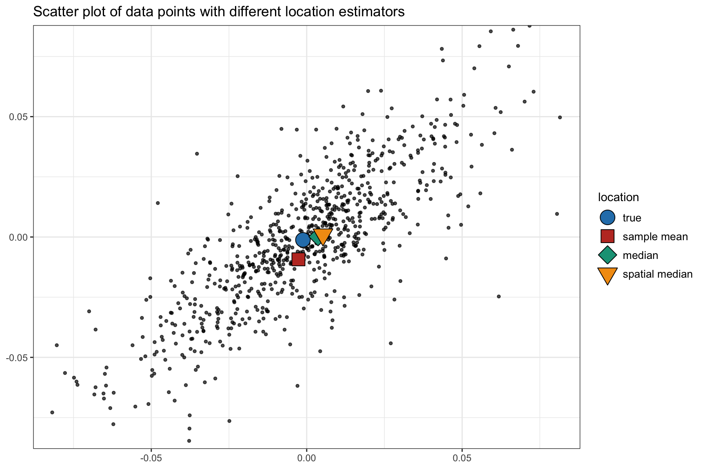
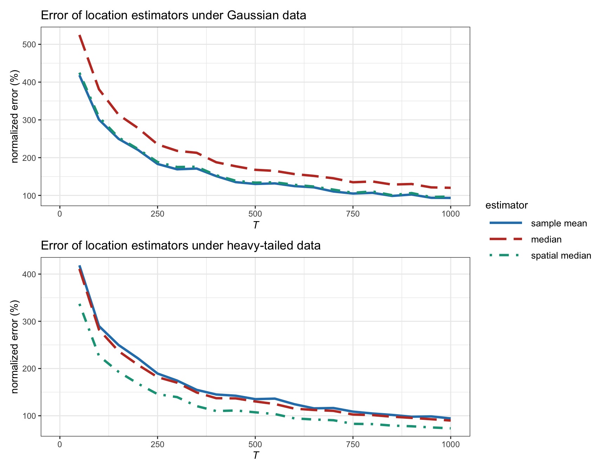
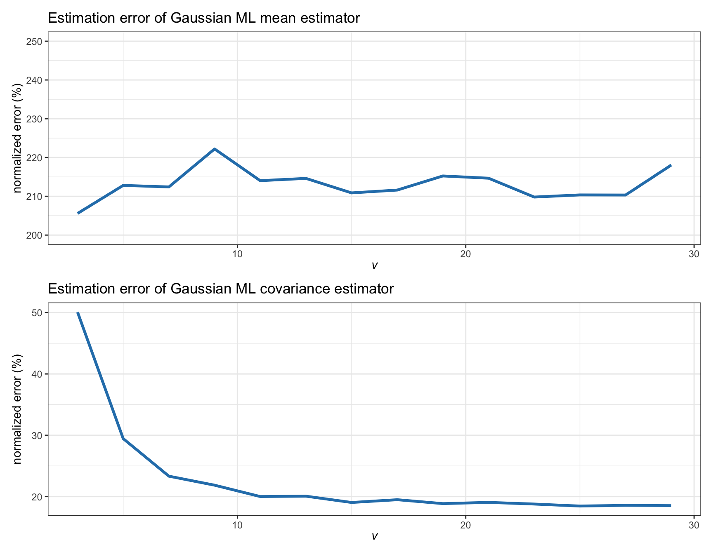
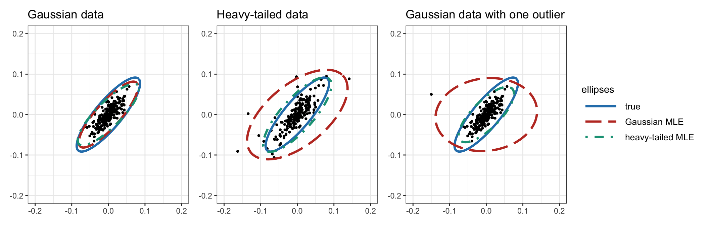

# Financial Data: I.I.D. Modeling {#iid-modeling}

> "All models are wrong, but some are useful."
>
> --- George E. P. Box

<!---
> "In an efficient market, at any point in time, the actual price of a security will be a good estimate of its intrinsic value."
>
> --- Eugene Fama
--->

<!---
> "I take the market-efficiency hypothesis to be the simple statement that security prices fully reflect all available information."
>
> --- Eugene Fama
--->

\afterquotespace
\acknowledgementCUP

\index{efficient-market hypothesis (EMH)}
Under the efficient-market hypothesis [@Fama1970], the price of a security is a good estimate of its intrinsic value. That is, any information about future prospects is already incorporated in the current price, so that the forecast is just the current price. This leads to modeling the prices as a random walk [@Malkiel1973] and, equivalently, the returns as a sequence of independent and identically distributed (i.i.d.) random variables. In the case of multiple assets, the random variables denote the returns of all the assets, leading to a multivariate random variable. This is a simple and convenient model, which in fact was already employed in Markowitz's seminal paper on portfolio design [@Markowitz1952].

Under the i.i.d. model, no temporal structure is incorporated and the returns at a given time are assumed to be independent from other time instances; in addition, the distribution of the random returns over time is assumed fixed. Hence the terminology "independent and identically distributed." This chapter explores the characterization of the multivariate i.i.d. distribution, from the simplest sample estimators to the more sophisticated robust non-Gaussian estimators that may include prior information in the form of shrinkage, factor modeling, or prior views.

  This material has been published as:
  Daniel P. Palomar (2025). _Portfolio Optimization: Theory and Application_. Cambridge University Press.
  This version is free to view and download for personal use only; not for re-distribution, re-sale, or use in derivative works. ©\ Daniel P. Palomar 2025.

## I.I.D. Model
\index{i.i.d. model}
Chapter\ \@ref(stylized-facts) gives an exploratory view of financial data and the important stylized facts. This chapter explores a simple but useful and popular way to model financial data. Suppose we have $N$ securities or tradable assets -- possibly from distinct asset classes such as bonds, equities, commodities, mutual funds, currencies, and cryptos -- and let $\bm{x}_t\in\R^N$ (often denoted as $\bm{r}_t$) denote the random returns of the assets at time $t$. Note that the time index $t$ can denote any arbitrary period such as minutes, hours, days, weeks, months, quarters, years, and so on.

Under the i.i.d. model, the returns are simply modeled as
\begin{equation}
  \bm{x}_t = \bmu + \bm{\epsilon}_t,
  (\#eq:iid-model)
\end{equation}
where $\bmu\in\R^N$ denotes the expected return and $\bm{\epsilon}_t\in\R^N$ is the residual component with zero mean and covariance matrix $\bSigma\in\R^{N\times N}$. This model can be motivated by the efficient-market hypothesis [@Fama1970].[^Fama-nobel-prize] Figure\ \@ref(fig:iid-time-series) shows an example of a synthetic univariate Gaussian i.i.d. time series. \index{efficient-market hypothesis (EMH)}

[^Fama-nobel-prize]: Eugene F. Fama was awarded the 2013 Sveriges Riksbank Prize in Economic Sciences in Memory of Alfred Nobel for his work on the efficient-market hypothesis. Ironically, Robert J. Shiller was co-awarded the same prize precisely for his work on the inefficiency of markets. \index{Nobel prize!Eugene F. Fama} \index{Nobel prize!Robert J. Shiller}

(\#fig:iid-time-series)Example of a synthetic Gaussian i.i.d. time series.

\index{random walk}
To be more exact, the i.i.d. model in \@ref(eq:iid-model) corresponds to the _random walk_ model [@Malkiel1973; @CampbellLoMacKinlay1997] on the log-prices $\bm{y}_t \triangleq \textm{log}\; \bm{p}_{t}$ (also referred to as the _geometric random walk_ model on the prices):
$$
\bm{y}_{t} = \bmu + \bm{y}_{t-1} + \bm{\epsilon}_t,
$$
which leads to \@ref(eq:iid-model) when $\bm{x}_t$ denotes the log-returns: $\bm{x}_t = \bm{y}_t - \bm{y}_{t-1}.$

The i.i.d. model in \@ref(eq:iid-model) ignores any temporal structure or dependency in the data. Chapter\ \@ref(time-series-modeling) considers more sophisticated time series models that attempt to incorporate the time structure. Some accessible textbooks that cover financial data modeling are @Meucci2005, @Tsay2010, @RuppertMatteson2015, with more emphasis on the multivariate case in @Lutkepohl2007 and @Tsay2013.

## Sample Estimators {#sample-estimators}
\index{sample estimators}
\index{mean estimators!sample mean}
\index{covariance matrix estimators!sample covariance matrix}
\index{sample mean|see{mean estimator, sample mean}}
\index{sample covariance matrix|see{covariance matrix estimator, sample covariance matrix}}
In practice, the parameters of the i.i.d. model in \@ref(eq:iid-model), $(\bmu, \bSigma)$, are unknown and have to be estimated using historical data $\bm{x}_1,\dots,\bm{x}_T$ containing $T$ past observations. The simplest estimators are the _sample mean_,
\begin{equation}
  \hat{\bmu} = \frac{1}{T}\sum_{t=1}^{T}\bm{x}_{t},
  (\#eq:sample-mean)
\end{equation}
and the _sample covariance matrix_,
\begin{equation}
  \hat{\bSigma} = \frac{1}{T-1}\sum_{t=1}^{T}(\bm{x}_t - \hat{\bmu})(\bm{x}_t - \hat{\bmu})^\T,
  (\#eq:SCM)
\end{equation}
where the "hat" notation "$\;\hat{\;}\;$" denotes estimation.

One important property is that these estimators are _unbiased_, namely,
$$
\E\left[\hat{\bmu}\right] = \bmu, \qquad 
\E\big[\hat{\bSigma}\big] = \bSigma.
$$
<!---
$$
\begin{aligned}
  \E\left[\hat{\bmu}\right] &= \bmu\\
  \E\big[\hat{\bSigma}\big] &= \bSigma.
\end{aligned}
$$
--->
In words, the random estimates $\hat{\bmu}$ and $\hat{\bSigma}$ are centered around the true values. In fact, the factor of $1/(T - 1)$ in the sample covariance matrix is precisely chosen so that the estimator is unbiased; if, instead, the more natural factor $1/T$ is used, then the estimator is biased: $\E\big[\hat{\bSigma}\big] = \left(1 - \frac{1}{T}\right)\bSigma.$

Another important property is that these estimators are _consistent_, that is, from the law of large numbers [@Papoulis1991; @Anderson2003] it follows that
$$
  \lim_{T\rightarrow\infty} \hat{\bmu} = \bmu, \qquad
  \lim_{T\rightarrow\infty} \hat{\bSigma} = \bSigma.
$$

<!---
$$
\begin{aligned}
  \lim_{T\rightarrow\infty} \hat{\bmu} &= \bmu\\
  \lim_{T\rightarrow\infty} \hat{\bSigma} &= \bSigma.
\end{aligned}
$$
--->
In words, the sample estimates converge to the true quantities as the number of observations $T$ grows. Figure\ \@ref(fig:sample-estimators-vs-T) shows how the estimation error indeed goes to zero as $T$ grows for synthetic Gaussian data of dimension $N=100$ (in particular, the normalized error is used, defined as $100\times\|\hat{\bmu} - \bmu\|/\|\bmu\|$ for the case of the sample mean, and similarly for the sample covariance matrix).

(\#fig:sample-estimators-vs-T)Estimation error of sample estimators vs. number of observations (for Gaussian data with $N=100$).

These sample estimators $\hat{\bmu}$ and $\hat{\bSigma}$ are easy to understand, simple to implement, and cheap in terms of computational cost. However, they are only good estimators for a large number of observations $T$; otherwise, the estimation error becomes unacceptable. In particular, the sample mean is a very inefficient estimator, producing very noisy estimates [@ChopraZiemba93; @Meucci2005]. This can be observed in Figure\ \@ref(fig:sample-estimators-vs-T), where the normalized error of $\hat{\bmu}$ for $N=100$ and $T=500$ is over 100%, which means that the error is as large as the true $\bmu$. In practice, however, there are two main reasons why $T$ cannot be chosen large enough to produce good estimations:

- _Lack of available historical data_: For example, if we use use daily stock data (i.e., 252 observations per year) and the universe size is, say, $N=500$, then a popular rule of thumb suggests that we should use $T \approx 10\times N$ observations, which means 20 years of data. Generally speaking, 20 years of data are rarely available for the whole universe of assets.

- _Lack of stationarity_: Even if we had available all the historical data we wanted, because financial data is not stationary over long periods of time, it does not make much sense to use such data: the market behavior and dynamics 20 years ago are too different from the current ones (cf. Chapter\ \@ref(stylized-facts)).

As a consequence, in a practical setting, the amount of data that can be used is very limited. But then, the estimates $\hat{\bmu}$ and $\hat{\bSigma}$ will be very noisy, particularly the sample mean. This is, in fact, the "Achilles' heel" of portfolio optimization: $\hat{\bmu}$ and $\hat{\bSigma}$ will inevitably contain estimation noise which will lead to erratic portfolio designs. This is why Markowitz's portfolio has not been fully embraced by practitioners.

In the rest of this chapter, we will get a deeper perspective on why sample estimators perform so poorly with financial data and, then, we will explore a number of different ways to improve them.

## Location Estimators {#location-estimators}
From the i.i.d. model in \@ref(eq:iid-model), the parameter $\bmu$ can be interpreted as the "center" or "location" around which the random points are distributed. Thus, it makes sense to try to estimate this location, which can be done in a variety of ways. The classical approach is based on least squares fitting, but it is very sensitive to extreme observations and missing values; thus, alternative robust multivariate location estimators have been thoroughly studied in the literature. In fact, this topic can be traced back to the 1960s [@Huber1964; @Maronna1976], as surveyed in @Small1990, @Huber2011, and @Oja2013.

### Least Squares Estimator
\index{least squares (LS)}
The method of least squares (LS) dates back to 1795 when Gauss used it to study planetary motions. It deals with the linear model $\bm{y} = \bm{A}\bm{x} + \bm{\epsilon}$ by solving the problem [@Scharf1991; @Kay1993]
$$
\begin{array}{ll}
\underset{\bm{x}}{\textm{minimize}} & \left\Vert \bm{y} - \bm{A}\bm{x} \right\Vert_2^2,
\end{array}
$$
which has the closed-form solution $\bm{x}^{\star}=\left(\bm{A}^\T\bm{A}\right)^{-1}\bm{A}^\T\bm{y}$.

\index{mean estimators!sample mean}
Going back to the i.i.d. model in \@ref(eq:iid-model), we can now formulate the estimation of the center of the points, $\bm{x}_t = \bmu + \bm{\epsilon}_t$, as an LS problem:
$$
\begin{array}{ll}
\underset{\bmu}{\textm{minimize}} & \begin{aligned}[t] \sum_{t=1}^{T} \left\Vert \bm{x}_t - \bmu \right\Vert_2^2 \end{aligned},
\end{array}
$$
whose solution, interestingly, coincides with the sample mean in \@ref(eq:sample-mean):
$$
\hat{\bmu} = \frac{1}{T}\sum_{t=1}^{T}\bm{x}_{t}.
$$

The sample mean is well known to suffer from lack of robustness against contaminated points or _outliers_, as well as against distributions with heavy tails (as will be empirically verified later in Figure\ \@ref(fig:location-estimators-vs-T)).

### Median Estimator
\index{mean estimators!median}
The median of a sample of points is the value separating the higher half from the lower half of the points. It may be thought of as the "middle" value of the points. The main advantage of the median compared to the mean (often described as the "average") is that it is not affected by a small proportion of extremely large or small values. Thus, it is a natural robust estimate and provides a better representation of a "typical" value. It is also possible to further improve on the median by using additional information from the data points such as the sample size, range, and quartile values [@WanWangTong2014].

In the multivariate case, there are multiple ways to extend the concept of median, as surveyed in @Small1990, @Huber2011, and @Oja2013, to obtain a natural robust estimate of the center of the distribution or set of points. One straightforward extension consists of employing the univariate median elementwise.

In the context of the i.i.d. model in \@ref(eq:iid-model), it turns out that this elementwise median can be formulated as the solution to the following problem:
$$\begin{array}{ll}
\underset{\bmu}{\textm{minimize}} & \begin{aligned}[t] \sum_{t=1}^{T} \left\Vert \bm{x}_t - \bmu \right\Vert_1 \end{aligned},
\end{array}
$$
where now the $\ell_1$-norm is the measure of error instead of the squared $\ell_2$-norm as in the case of the sample mean.

### Spatial Median Estimator
\index{mean estimators!spatial median}
Another way to extend the univariate median to the multivariate case is the so-called _spatial median_ or _geometric median_ (also known as the $L_1$ median) obtained as the solution to the problem
$$
\begin{array}{ll}
\underset{\bmu}{\textm{minimize}} & \begin{aligned}[t] \sum_{t=1}^{T} \left\Vert \bm{x}_t - \bmu \right\Vert_2 \end{aligned},
\end{array}
$$
where now the $\ell_2$-norm or Euclidean distance is the measure of error instead of the $\ell_1$-norm or the squared $\ell_2$-norm. Interestingly, the lack of the squaring operator has a huge effect; for example, the estimator for each element is no longer independent of the other elements (as is the case with the sample mean and elementwise median). The spatial median has the desired property that for $N=1$ it reduces to the univariate median.

The spatial median is the solution to a convex second-order cone problem (SOCP) and can be solved with an SOCP solver. Alternatively, very efficient iterative algorithms can be derived by solving a sequence of LS problems via the majorization--minimization (MM) method [@SunBabPal2017]; see also Section\ \@ref(MM) in Appendix\ \@ref(optimization-algorithms) for details. \index{majorization--minimization (MM)}

### Numerical Experiments
Figure\ \@ref(fig:scatter-plots-location-methods) illustrates the different location estimators in a two-dimensional ($N=2$) case. Since this is just one realization, we cannot conclude which method is preferable.

(\#fig:scatter-plots-location-methods)Illustration of different location estimators.

Figure\ \@ref(fig:location-estimators-vs-T) shows the estimation error of different location estimators as a function of the number of observations $T$ for synthetic Gaussian and heavy-tailed data (the mean vector $\bmu$ and covariance matrix $\bSigma$ are taken as measured in typical stock market data). For Gaussian data, the sample mean is the best estimator (as further analyzed in Section\ \@ref(Gaussian-ML)), with the spatial median almost identical, and the elementwise median being the worst. For heavy-tailed data, the sample mean is as bad as the median and the spatial median remains the best. Overall, the spatial median seems to be the best option as it is robust to outliers and does not underperform under Gaussian data. 

(\#fig:location-estimators-vs-T)Estimation error of location estimators vs. number of observations (with $N=100$).

Figure\ \@ref(fig:location-estimators-vs-nu) examines in more detail the effect of the heavy tails in the estimation error for synthetic data following a $t$ distribution with degrees of freedom $\nu$. Financial data typically corresponds to $\nu$ on the order of somewhere between 4 and 5, which is significantly heavy-tailed, whereas a large value of $\nu$ corresponds to a Gaussian distribution. We can observe that the error for the sample mean remains similar regardless of $\nu$. Interestingly, the spatial median is similar to the sample mean for large $\nu$ (Gaussian regime) whereas it becomes better for heavy tails. Again, this illustrates the robustness of the spatial median.

(\#fig:location-estimators-vs-nu)Estimation error of location estimators vs. degrees of freedom in a $t$ distribution (with $T=200$ and $N=100$).

## Gaussian ML Estimators {#Gaussian-ML}
### Preliminaries on ML Estimation
\index{maximum likelihood (ML)}
_Maximum likelihood_ (ML) estimation is an important technique in _estimation theory_ [@Kay1993; @Scharf1991; @Anderson2003]. The idea is very simple. Suppose the probability of a random variable $\bm{x}$ can be "measured" by the probability distribution function (pdf) $f$.[^pdf-for-probability] Then the probability of a series of $T$ independent given observations $\bm{x}_1,\dots,\bm{x}_T$ can be measured by the product $f(\bm{x}_1) \times \cdots \times f(\bm{x}_T)$. Suppose now that we have to guess which of two possible distributions, $f_1$ and $f_2$, is more likely to have produced these observations. It seems reasonable to choose as most likely the one that gives the largest probability of observing these observations. Now, suppose we have a family of possible distributions parameterized by the parameter vector $\bm{\theta}$: $f_{\bm{\theta}}$, which is called _likelihood function_ when viewed as a function of $\bm{\theta}$ for the given observations. Again, it seems reasonable to choose as the most likely $\bm{\theta}$ the one that gives the largest probability of observing these observations. This is precisely the essence of ML estimation and can be written as the following optimization problem:
$$
\begin{array}{ll}
\underset{\bm{\theta}}{\textm{maximize}} & f_{\bm{\theta}}(\bm{x}_1) \times \cdots \times f_{\bm{\theta}}(\bm{x}_T),
\end{array}
$$
where $\bm{x}_1,\dots,\bm{x}_T$ denote the $T$ given observations. For mathematical convenience, ML estimation is equivalently formulated as the maximization of the log-likelihood function:
$$
\begin{array}{ll}
\underset{\bm{\theta}}{\textm{maximize}} & \begin{aligned}[t] \sum_{t=1}^T \textm{log}\;f_{\bm{\theta}}(\bm{x}_t) \end{aligned}.
\end{array}
$$

[^pdf-for-probability]: To be precise, the term $f(\bm{x}_0)d\bm{x}$ gives the probability of observing $\bm{x}$ in a region centered around $\bm{x}_0$ with volume $d\bm{x}$.

The ML estimator (MLE) enjoys many desirable theoretical properties that make it an _asymptotically optimal_ estimator (asymptotic in the number of observations $T$). More specifically, the MLE is asymptotically unbiased and it asymptotically attains the Cramér--Rao bound (which gives the lowest possible variance attainable by an unbiased estimator); in other words, it is _asymptotically efficient_ [@Kay1993; @Scharf1991]. In practice, however, the key question is how large $T$ has to be for the asymptotic properties to effectively hold.

### Gaussian ML Estimation
\index{maximum likelihood (ML)!Gaussian estimators}
The pdf corresponding to the i.i.d. model \@ref(eq:iid-model), assuming that the residual follows a multivariate normal or Gaussian distribution, is
\begin{equation}
  f(\bm{x}) = \frac{1}{\sqrt{(2\pi)^N|\bSigma|}} \textm{exp}\left(-\frac{1}{2}(\bm{x} - \bmu)^\T\bSigma^{-1}(\bm{x} - \bmu)\right),
  (\#eq:mvnorm-pdf)
\end{equation}
from which we can see that the parameters of the model are $\bm{\theta} = (\bmu,\bSigma)$.

Given $T$ observations $\bm{x}_1,\dots,\bm{x}_T$, the MLE can then be formulated (ignoring irrelevant constant terms) as
$$
\begin{array}{ll}
\underset{\bmu,\bSigma}{\textm{minimize}} & \begin{aligned}[t] \textm{log det}(\bSigma) + \frac{1}{T}\sum_{t=1}^T (\bm{x}_t - \bmu)^\T\bSigma^{-1}(\bm{x}_t - \bmu), \end{aligned}
\end{array}
$$
where $\textm{log det}(\cdot)$ denotes the logarithm of the determinant of a matrix.

Setting the gradient of the objective function with respect to $\bmu$ and $\bSigma^{-1}$ to zero leads to 
$$
\begin{aligned}
  \frac{1}{T}\sum_{t=1}^T (\bm{x} - \bmu) &= \bm{0},\\
  -\bSigma + \frac{1}{T}\sum_{t=1}^T (\bm{x}_t - \bmu)(\bm{x}_t - \bmu)^\T &= \bm{0},
\end{aligned}
$$
which results in the following estimators for $\bmu$ and $\bSigma$:
\index{mean estimators!Gaussian estimator}
\index{covariance matrix estimators!Gaussian estimator}
\begin{equation}
  \begin{aligned}
  \hat{\bmu}    &= \frac{1}{T}\sum_{t=1}^T \bm{x}_t,\\
  \hat{\bSigma} &= \frac{1}{T}\sum_{t=1}^T (\bm{x}_t - \bmu)(\bm{x}_t - \bmu)^\T.
  \end{aligned}
  (\#eq:GMLE)
\end{equation}
Interestingly, these estimators coincide with the sample estimators in \@ref(eq:sample-mean) and \@ref(eq:SCM), apart from the factor $1/T$ instead of the factor $1/(T - 1)$. The ML estimator of the covariance matrix is biased since $\E\big[\hat{\bSigma}\big] = \left(1 - \frac{1}{T}\right)\bSigma;$ however, it is asymptotically unbiased as $T \rightarrow \infty$ (as already expected from the asymptotic optimality of ML).

At first, it may seem that we have not achieved anything new, since we had already derived the same estimators from the perspective of sample estimators and from the perspective of least squares. However, after more careful thought, we have actually learned that the sample estimators are optimal when the data is Gaussian distributed, but not otherwise. That is, when the data has a different distribution, the optimal ML estimators can be expected to be different, as explored later in Section\ \@ref(heavy-tail-ML).

### Numerical Experiments
Figure\ \@ref(fig:Gaussian-ML-estimators-vs-T) shows the estimation error of the ML estimators for the mean and covariance matrix as a function of the number of observations $T$ for synthetic Gaussian and heavy-tailed data. We can observe how the estimation of the covariance matrix $\bSigma$ becomes much worse for heavy-tailed data, whereas the estimation of the mean $\bmu$ remains similar.

(\#fig:Gaussian-ML-estimators-vs-T)Estimation error of Gaussian ML estimators vs. number of observations (with $N=100$).

Figure\ \@ref(fig:Gaussian-ML-estimators-vs-nu) examines in more detail the effect of the heavy tails in the estimation error for synthetic data following a $t$ distribution with degrees of freedom $\nu$. We can confirm that the error in the estimation of the mean remains the same, whereas the estimation of the covariance matrix becomes worse as the distribution exhibits heavier tails. Nevertheless, we should not forget that the size of the error is one order of magnitude larger for the mean than for the covariance matrix.

(\#fig:Gaussian-ML-estimators-vs-nu)Estimation error of Gaussian ML estimators vs. degrees of freedom in a $t$ distribution (with $T=200$ and $N=100$).

## Heavy-Tailed ML Estimators {#heavy-tail-ML}
Gaussian ML estimators are optimal, in the sense of maximizing the likelihood of the observations, whenever data follow the Gaussian distribution. However, if data follow a heavy-tailed distribution -- like it is the case with financial data -- then we need some further understanding of the potentially detrimental effect. On the one hand, since the ML estimators coincide with the sample estimators in Section \@ref(sample-estimators), we know they are unbiased and consistent, which are desirable properties. But, on the other hand, is this sufficient or can we do better?

### The Failure of Gaussian ML Estimators
As explored in Section\ \@ref(Gaussian-ML), Figure\ \@ref(fig:Gaussian-ML-estimators-vs-T) demonstrates that the effect of heavy tails in the estimation of the covariance matrix is significant, whereas it is almost nonexistent for the estimation of the mean. Figure\ \@ref(fig:Gaussian-ML-estimators-vs-nu) further shows the error as a function of how heavy the tails are (small $\nu$ represents heavy-tailed distributions whereas large $\nu$ tends to a Gaussian distribution).

To further understand the detrimental effect of heavy tails, Figure\ \@ref(fig:scatter-plots-Gaussian-MLE) illustrates this effect, as well as the effect of outliers in otherwise Gaussian data. In this example, $T=10$ data points are used for the estimation of the two-dimensional covariance matrix, which satisfies the ratio $T/N = 5$. It is very clear that, while for Gaussian data the Gaussian ML estimator (or sample covariance matrix) follows the true covariance matrix very closely, once we include a single outlier in the Gaussian data or we use heavy-tailed data, the estimation is disastrous. Still, most practitioners and academics adopt the sample covariance matrix due to its simplicity.

(\#fig:scatter-plots-Gaussian-MLE)Effect of heavy tails and outliers in the Gaussian ML covariance matrix estimator.

### Heavy-Tailed ML Estimation {#subsec-heavy-tail-ML}
\index{maximum likelihood (ML)!heavy-tailed estimators}
We have empirically observed that the Gaussian MLE for the covariance matrix significantly degrades when the data distribution exhibits heavy tails (see Figures \@ref(fig:Gaussian-ML-estimators-vs-T), \@ref(fig:Gaussian-ML-estimators-vs-nu), and \@ref(fig:scatter-plots-Gaussian-MLE)). But this is not unexpected since the sample covariance matrix is optimal only under the Gaussian distribution as derived in Section\ \@ref(Gaussian-ML). Thus, to derive an improved estimator, we should drop the Gaussian assumption and instead consider a heavy-tailed distribution in the derivation of optimal ML estimators. There are many families of distributions with heavy tails [@McNeilFreyEmbrechts2015] and, for simplicity, we will focus our attention on the Student $t$ distribution or, simply, $t$ distribution, which is widely used to model heavy tails via the parameter $\nu$. It is worth noting that using any other heavy-tailed distribution shows little difference.

The pdf corresponding to the i.i.d. model \@ref(eq:iid-model), assuming now that the residual term follows a multivariate $t$ distribution, is
$$
f(\bm{x}) = \frac{\Gamma((\nu+N)/2)}{\Gamma(\nu/2)\sqrt{(\nu\pi)^N|\bSigma|}} \left(1 + \frac{1}{\nu}(\bm{x} - \bmu)^\T\bSigma^{-1}(\bm{x} - \bmu)\right)^{-(\nu+N)/2},
$$
where $\Gamma(\cdot)$ is the gamma function,[^gamma-function] $\bmu$ is the location parameter (which coincides with the mean vector for $\nu>1$ as in the Gaussian case and is undefined otherwise), $\bSigma$ denotes the _scatter matrix_ (not to be confused with the covariance matrix, which can now be obtained as $\frac{\nu}{\nu-2}\bSigma$ if $\nu>2$ and is undefined otherwise), and $\nu$ denotes the "degrees of freedom" that controls how heavy or thick the tails are ($\nu\approx4$ corresponds to significantly heavy tails, whereas $\nu\rightarrow\infty$ corresponds to the Gaussian distribution). Thus, the parameters of this model are $\bm{\theta} = (\bmu, \bSigma, \nu)$, which includes the extra scalar parameter $\nu$ compared to the Gaussian case in \@ref(eq:mvnorm-pdf). This parameter can either be fixed to some reasonable value (financial data typically satisfies $\nu\approx4$ or $\nu\approx5$) or can be estimated together with the other parameters.

[^gamma-function]: The gamma function is defined as $\Gamma(z) = \int_0^\infty t^{z-1}e^{-t}\,\mathrm{d}t$. For a positive integer $n$, it corresponds to the factorial function $\Gamma(n)=(n-1)!$.

The MLE can then be formulated, given $T$ observations $\bm{x}_1,\dots,\bm{x}_T$, as
$$
\begin{array}{ll}
\underset{\bmu,\bSigma,\nu}{\textm{minimize}} & \begin{aligned}[t] 
\textm{log det}(\bSigma) + \frac{\nu+N}{T} \sum_{t=1}^T \textm{log} \left(1 + \frac{1}{\nu}(\bm{x}_t - \bmu)^\T\bSigma^{-1}(\bm{x}_t - \bmu)\right)\\
+ 2\;\textm{log}\;\Gamma(\nu/2) + N\textm{log}(\nu) - 2\;\textm{log}\;\Gamma\left(\frac{\nu+N}{2}\right). \end{aligned}
\end{array}
$$

For simplicity we will fix the parameter $\nu = 4$, and then only the first two terms in the problem formulation become relevant in the estimation of the remaining parameters $\bmu$ and $\bSigma$. Setting the gradient of the objective function with respect to $\bmu$ and $\bSigma^{-1}$ to zero leads to 
$$
\begin{aligned}
  \frac{1}{T} \sum_{t=1}^T \frac{\nu+N}{\nu + (\bm{x}_t - \bmu)^\T\bSigma^{-1}(\bm{x}_t - \bmu)} (\bm{x}_t - \bmu) &= \bm{0},\\
  -\bSigma + \frac{1}{T}\sum_{t=1}^T \frac{\nu+N}{\nu + (\bm{x}_t - \bmu)^\T\bSigma^{-1}(\bm{x}_t - \bmu)} (\bm{x}_t - \bmu)(\bm{x}_t - \bmu)^\T &= \bm{0},
\end{aligned}
$$
which can be conveniently rewritten as the following fixed-point equations for $\bmu$ and $\bSigma$:
\index{mean estimators!heavy-tailed estimator}
\index{covariance matrix estimators!heavy-tailed estimator}
\begin{equation}
  \begin{aligned}
  \bmu    &= \frac{\frac{1}{T}\sum_{t=1}^T w_t(\bmu,\bSigma) \times \bm{x}_t}{\frac{1}{T}\sum_{t=1}^T w_t(\bmu,\bSigma)},\\
  \bSigma &= \frac{1}{T}\sum_{t=1}^T w_t(\bmu,\bSigma) \times (\bm{x}_t - \bmu)(\bm{x}_t - \bmu)^\T,
\end{aligned}
  (\#eq:fixed-point-tML)
\end{equation}
where we define the weights
\begin{equation}
  w_t(\bmu,\bSigma) = \frac{\nu+N}{\nu + (\bm{x}_t - \bmu)^\T\bSigma^{-1}(\bm{x}_t - \bmu)}.
  (\#eq:weights-tMLE)
\end{equation}

It is important to remark that \@ref(eq:fixed-point-tML) are fixed-point equations because the parameters $\bmu$ and $\bSigma$ appear on both sides of the equalities, which makes their calculation not trivial. Existence of a solution is guaranteed if $T > N + 1$ [@KentTyler1991]; conditions for existence and uniqueness with optional shrinkage were derived in @SunBabPal2015.

Nevertheless, these fixed-point equations have a beautiful interpretation: if one assumes the weights $w_t$ to be known, then the expressions in \@ref(eq:fixed-point-tML) become a weighted version of the Gaussian MLE expressions in \@ref(eq:GMLE). Interestingly, the weights $w_t$ have the insightful interpretation that they become smaller as the point $\bm{x}_t$ is further away from the center $\bmu$, which means that they automatically down-weight the outliers. Thus, we can expect these estimators to be robust to outliers, unlike the Gaussian ML estimators in \@ref(eq:GMLE) whose performance can be severely degraded in the presence of outliers. Observe that as $\nu\rightarrow\infty$, i.e., as the distribution becomes Gaussian, the weights in \@ref(eq:weights-tMLE) tend to 1 (unweighted case) as expected.

In practice, a simple way to solve the fixed-point equations in \@ref(eq:fixed-point-tML) is via an iterative process whereby the weights are fixed to the most current value and then $\bmu$ and $\bSigma$ are updated.[^R-fit_mvt] Specifically, the iterations for $k=0,1,2,\dots$ are given as follows:
\begin{equation}
  \begin{aligned}
  \bmu^{k+1}    &= \frac{\frac{1}{T}\sum_{t=1}^T w_t(\bmu^k,\bSigma^k) \times \bm{x}_t}{\frac{1}{T}\sum_{t=1}^T w_t(\bmu^k,\bSigma^k)},\\
  \bSigma^{k+1} &= \frac{1}{T}\sum_{t=1}^T w_t(\bmu^{k+1},\bSigma^k)  \times (\bm{x}_t - \bmu^{k+1})(\bm{x}_t - \bmu^{k+1})^\T.
  \end{aligned}
  (\#eq:iterative-tMLE)
\end{equation}

The iterative updates in \@ref(eq:iterative-tMLE) can be formally derived from the ML formulation and shown to converge to the optimal solution by means of the MM algorithmic framework. For details on MM, the reader is referred to @SunBabPal2017 and Section\ \@ref(MM) in Appendix\ \@ref(optimization-algorithms). For the specific derivation of \@ref(eq:iterative-tMLE), together with technical conditions for the convergence of the algorithm, details can be found in @KentTylerVard1994 and in @SunBabPal2015 from the MM perspective. For convenience, this MM-based method is summarized in Algorithm\ 3.1. In addition, the estimation of $\nu$ is further considered in @LiuRubin95 and acceleration methods for faster convergence are derived in @LiuRubinWu98. \index{majorization--minimization (MM)}

[^R-fit_mvt]: The R package [`fitHeavyTail`](https://cran.r-project.org/package=fitHeavyTail) contains the function `fit_mvt()` to solve the fixed-point equations \@ref(eq:fixed-point-tML)-\@ref(eq:weights-tMLE) iteratively via \@ref(eq:iterative-tMLE) [@fitHeavyTail]. \index{R packages!fitHeavyTail}

\index{algorithms!heavy-tailed ML fixed-point via MM}

:::: plain_algorithm
::: lined
**Algorithm 3.1**: MM-based method to solve the heavy-tailed ML fixed-point equations in \@ref(eq:fixed-point-tML).
:::
Choose initial point $(\bmu^0,\bSigma^0)$;  
Set $k \gets 0$;  
**repeat**

  1. Iterate the weighted sample mean and sample covariance matrix as
  $$
  \begin{aligned}
    \bmu^{k+1}    &= \frac{\frac{1}{T}\sum_{t=1}^T w_t(\bmu^k,\bSigma^k) \times \bm{x}_t}{\frac{1}{T}\sum_{t=1}^T w_t(\bmu^k,\bSigma^k)},\\
    \bSigma^{k+1} &= \frac{1}{T}\sum_{t=1}^T w_t(\bmu^{k+1},\bSigma^k)  \times (\bm{x}_t - \bmu^{k+1})(\bm{x}_t - \bmu^{k+1})^\T,
  \end{aligned}
  $$
  where the weights are defined in \@ref(eq:weights-tMLE);
  2. $k \gets k+1$;
  
**until** convergence;
::::

Figure\ \@ref(fig:scatter-plots-t-MLE) illustrates the robustness of the heavy-tailed ML estimator, compared with the Gaussian ML estimator, under data with heavy tails and outliers. The difference observed is quite dramatic and should serve as a red flag to practitioners for using the sample covariance matrix when dealing with heavy-tailed data.

(\#fig:scatter-plots-t-MLE)Effect of heavy tails and outliers in heavy-tailed ML covariance matrix estimator.

### Robust Estimators
\index{robust estimators}
What happens if the true distribution that generates the data deviates slightly from the assumed -- typically Gaussian -- one? Estimators that are not very sensitive to outliers or distribution contamination are generally referred to as _robust estimators_.

The robustness of estimators can be objectively measured in different ways; notably, with the _influence function_, which measures the effect when the true distribution slightly deviates from the assumed one, and the _breakdown point_, which is the minimum fraction of contaminated data points that can render the estimator useless.

As already discussed in Section\ \@ref(Gaussian-ML), sample estimators or Gaussian ML estimators are not robust against deviations from the Gaussian distribution. It is well known that they are very sensitive to the tails of the distribution [@Huber1964; @Maronna1976]. In fact, their influence function is unbounded, meaning that an infinitesimal point mass contamination can have an arbitrarily large influence. In addition, a single contaminated point can ruin the sample mean or the sample covariance matrix, that is, the breakdown point is $1/T$. For reference, the median has a breakdown of around 0.5, that is, one needs more than 50% of the points contaminated to ruin it. On the other hand, as will be further elaborated next, the heavy-tailed ML estimators from Section\ \@ref(subsec-heavy-tail-ML) can be shown to be robust estimators.

Some classical early references on robust estimation are @Huber1964 for the univariate case and @Maronna1976 for the multivariate case, whereas more modern surveys include @MaronnaMartinYohhai2006, @Huber2011, @WieselZhang2014, and Chapter 4 in @ZoubirKoivunenOllilaMuma2018.

#### $M$-Estimators {-}
\index{mean estimators!$M$-estimators}
\index{covariance matrix estimators!$M$-estimators}
The term $M$-estimators for robust estimation goes back to the 1960s [@Huber1964]. In a nutshell, $M$-estimators for the location and scatter parameters, $\bmu$ and $\bSigma$, are defined by the following fixed-point equations:
\begin{equation}
  \begin{aligned}
  \frac{1}{T} \sum_{t=1}^T u_1\left(\sqrt{(\bm{x}_t - \bmu)^\T\bSigma^{-1}(\bm{x}_t - \bmu)}\right) (\bm{x}_t - \bmu) &= \bm{0},\\
  \frac{1}{T}\sum_{t=1}^T u_2\left((\bm{x}_t - \bmu)^\T\bSigma^{-1}(\bm{x}_t - \bmu)\right) (\bm{x}_t - \bmu)(\bm{x}_t - \bmu)^\T &= \bSigma,
  \end{aligned}
  (\#eq:fixed-point-M-estimators)
\end{equation}
where $u_1(\cdot)$ and $u_2(\cdot)$ are weight functions satisfying some conditions [@Maronna1976; @MaronnaMartinYohhai2006]. 

$M$-estimators are a generalization of the maximum likelihood estimators and can be regarded as the weighted sample mean and the weighted sample covariance matrix. In terms of robustness, they have a desirable bounded influence function, although the breakdown point is still relatively low [@Maronna1976; @MaronnaMartinYohhai2006]. Other estimators, such as the minimum volume ellipsoid and minimum covariance determinant, have higher breakdown points.

The Gaussian ML estimators can be obtained from the $M$-estimators in \@ref(eq:fixed-point-M-estimators) with the trivial choice of weight functions $u_1(s) = u_2(s) = 1$.

A notable common choice to obtain robust estimators is to choose the weight functions based on Huber's $\psi$-function $\psi(z,k)=\textm{max}(-k,\textm{min}(z,k))$, where $k$ is a positive constant that caps the argument $z$ from above and below, as follows [@Maronna1976]:
$$
\begin{aligned}
  u_1(s) &= \psi(z,k)/s,\\
  u_2(s) &= \psi(z,k^2)/(\beta s),
\end{aligned}
$$
where $\beta$ is a properly chosen constant.

Interestingly, the $M$-estimators in \@ref(eq:fixed-point-M-estimators) particularize to the heavy-tailed ML estimators derived in \@ref(eq:weights-tMLE) for the choice
$$
u_1(s) = u_2(s^2) = \frac{\nu + N}{\nu + s^2}.
$$

#### Tyler's Estimator {-}
\index{Tyler's estimator}
\index{covariance matrix estimators!Tyler's estimator}
In 1987, Tyler proposed an estimator for the scatter matrix (which is proportional to the covariance matrix) for heavy-tailed distributions [@Tyler1987]. The idea is very simple and ingenious, as described next. Interestingly, Tyler's estimator can be shown to be the most robust version of an $M$-estimator.

Suppose the random variable $\bm{x}$ follows a zero-mean elliptical distribution -- which means that the distribution depends on $\bm{x}$ through the term $\bm{x}^\T\bSigma^{-1}\bm{x}$. If the mean is not zero, then it has to be estimated with some location estimator, as described in Section\ \@ref(location-estimators), and then subtracted from the observations so that they have zero mean.

The key idea is to normalize the observations
$$
\bm{s}_t = \frac{\bm{x}_t}{\|\bm{x}_t\|_2}
$$
and then use ML based on these normalized points. The surprising fact is that the pdf of the normalized points can be analytically derived -- known as angular distribution -- as
$$
f(\bm{s}) \propto \frac{1}{\sqrt{|\bSigma|}} \left(\bm{s}^\T\bSigma^{-1}\bm{s}\right)^{-N/2},
$$
which is independent of the shape of the tails and still contains the parameter $\bSigma$ which we wish to estimate.

The MLE can then be formulated, given $T$ observations $\bm{x}_1,\dots,\bm{x}_T$ and noting that $\left(\bm{s}_t^\T\bSigma^{-1}\bm{s}_t\right)^{-N/2} \propto \left(\bm{x}_t^\T\bSigma^{-1}\bm{x}_t\right)^{-N/2}$, as
$$
\begin{array}{ll}
\underset{\bSigma}{\textm{minimize}} & \begin{aligned}[t] 
\textm{log det}(\bSigma) + \frac{N}{T} \sum_{t=1}^T \textm{log} \left(\bm{x}_t^\T\bSigma^{-1}\bm{x}_t\right). \end{aligned}
\end{array}
$$
Setting the gradient with respect to $\bSigma^{-1}$ leads to the following fixed-point equation (which has the same form as the one for the heavy-tailed MLE in \@ref(eq:fixed-point-tML)):
$$
\bSigma = \frac{1}{T}\sum_{t=1}^T w_t(\bSigma) \times \bm{x}_t \bm{x}_t^\T,
$$
where the weights are now given by
\begin{equation}
  w_t(\bSigma) = \frac{N}{\bm{x}_t^\T\bSigma^{-1}\bm{x}_t}.
  (\#eq:weights-Tyler)
\end{equation}
Observe that these weights behave similarly to those in \@ref(eq:weights-tMLE), in the sense of down-weighting the outliers and making the estimator robust. Existence of a solution is guaranteed if $T > N$ [@Tyler1987]; conditions for existence and uniqueness with optional shrinkage were derived in @ChenWieselHero2011, @Wiesel2012, and @SunBabPal2014.

This fixed-point equation can be solved iteratively like in the case of the heavy-tailed MLE in Section\ \@ref(subsec-heavy-tail-ML), see @Tyler1987 and @SunBabPal2014. However, it is important to realize that Tyler's method can only estimate the parameter $\bSigma$ up to a scaling factor, as can be observed from the invariance of the likelihood function with respect to a scaling factor in $\bSigma$. In fact, this should not be surprising since the normalization of the original points destroys the information of such a scaling factor. In practice, the scaling factor $\kappa$ can be recovered with some simple heuristic to enforce
$$
\textm{diag}(\kappa\times \bSigma) \approx \hat{\bm{\sigma}}^2,
$$
where $\hat{\bm{\sigma}}^2$ denotes some robust estimation of the variances of the assets; for example,
$$
\kappa = \frac{1}{N}\bm{1}^\T\left(\hat{\bm{\sigma}}^2/\textm{diag}(\bSigma)\right).
$$

### Numerical Experiments
We now proceed to a final comparison of the presented robust estimators benchmarked against the traditional and popular Gaussian-based estimator. In particular, the following estimators are considered for the mean and covariance matrix:

- Gaussian MLE
- heavy-tailed MLE
- Tyler's estimator for the covariance matrix (with spatial median for the location).

Figure\ \@ref(fig:comparison-estimators-vs-T) shows the estimation error as a function of the number of observations $T$ for synthetic heavy-tailed data ($t$ distribution with $\nu=4$). The heavy-tailed MLE is the best, followed closely by the Tyler estimator (with the spatial median estimator for the mean), while the Gaussian MLE is the worst by far.

(\#fig:comparison-estimators-vs-T)Estimation error of different ML estimators vs. number of observations (for $t$-distributed heavy-tailed data with $\nu=4$ and $N=100$).

Figure\ \@ref(fig:comparison-estimators-vs-nu) examines in more detail the effect of the heavy tails in the estimation error for synthetic data following a $t$ distribution with degrees of freedom $\nu$. We can confirm that for Gaussian tails, the Gaussian MLE is similar to the heavy-tailed MLE; however, as the tails become heavier (smaller values of $\nu$), the difference becomes quite significant in favor of the robust heavy-tailed MLE.

(\#fig:comparison-estimators-vs-nu)Estimation error of different ML estimators vs. degrees of freedom in a $t$ distribution (with $T=200$ and $N=100$).

The final conclusion could not be more clear: financial data is heavy-tailed and one must necessarily use robust heavy-tailed ML estimators (like the one summarized in Algorithm\ 3.1). Interestingly, the computational cost of the robust estimators is not much higher than the traditional sample estimators because the algorithm converges in just a few iterations (each iteration has a cost comparable to the sample estimators). Indeed, Figure\ \@ref(fig:tMLE-convergence) indicates that the algorithm converges in three to five iterations in this particular example with heavy-tailed data (following a $t$ distribution with $\nu=4$) with $T=200$ observations and $N=100$ assets.

(\#fig:tMLE-convergence)Convergence of robust heavy-tailed ML estimators.

Nevertheless, it is important to emphasize that the errors in the estimation of the mean vector $\bmu$ based on historical data are extremely large (see Figures\ \@ref(fig:comparison-estimators-vs-T) and\ \@ref(fig:comparison-estimators-vs-nu)), to the point that such estimations may become useless in practice. This is precisely why practitioners typically obtain factors from data providers (at a high premium) and then use them to estimate $\bmu$ via regression. Alternatively, many portfolio designs that ignore any estimation of $\bmu$ are quite common, for example the global minimum variance portfolio (see Chapter\ \@ref(portfolio-101)) and the risk parity portfolio (see Chapter\ \@ref(RPP)).

## Prior Information: Shrinkage, Factor Models, and Black--Litterman
All the estimators thus far surveyed in this chapter are based purely on the $T$ historical data points $\bm{x}_1,\dots,\bm{x}_T$. Unfortunately, in many practical settings, as discussed in Section\ \@ref(sample-estimators), the number of observations is not large enough to achieve proper estimation of the model parameters with a sufficiently small error. Researchers and practitioners have spent decades trying to deal with this issue and devising a variety of mechanisms to improve the estimators. The basic recipe is to somehow incorporate any prior information that one may have available. We will next give an overview of three notable ways to incorporate prior information into the parameter estimation process:

- _shrinkage_: to incorporate prior knowledge on the parameters in the form of targets;
- _factor modeling_: to incorporate structural information; and
- _Black--Litterman_: to combine the data with discretionary views.

Each of these approaches deserves a whole chapter -- if not a whole book -- but we will merely scratch the tip of the iceberg here, while providing key references for the interested reader to probe further.

### Shrinkage {#shrinkage}
\index{shrinkage estimators}
Shrinkage is a popular technique to reduce the estimation error by introducing a _bias_ in the estimator. In statistics, this idea goes back to 1955 with Stein's seminal publication [@Stein1955]. In the financial area, it was popularized by its application to shrinkage in the covariance matrix in the early 2000s [@LedoitWolf2004] and it is now covered in many textbooks [@Meucci2005] and surveys [@BunBouchaudPotters2017].

The mean squared error (MSE) of an estimator can be separated into two terms: the bias and the variance. This is a basic concept in estimation theory referred to as the _bias--variance trade-off_ [@Scharf1991; @Kay1993]. Mathematically, for a given parameter $\bm{\theta}$ and an estimator $\hat{\bm{\theta}}$, the bias--variance trade-off reads:
$$
\begin{aligned}
  \textm{MSE}(\hat{\bm{\theta}}) 
  & \triangleq \E\left[\big\|\hat{\bm{\theta}} - \bm{\theta}\big\|^2\right]\\
  & = \E\left[\big\|\hat{\bm{\theta}} - \E\big[\hat{\bm{\theta}}\big]\big\|^2\right] + 
      \big\|\E\big[\hat{\bm{\theta}}\big] - \bm{\theta}\big\|^2\\
  & = \textm{Var}\big(\hat{\bm{\theta}}\big) + \textm{Bias}^2\big(\hat{\bm{\theta}}\big).
\end{aligned}
$$

In the small-sample regime (i.e., when the number of observations is small), the main source of error comes from the variance of the estimator (since the estimator is based on a small number of random samples). In the large-sample regime, on the other hand, one may expect the variance of the estimator to be reduced and the bias to dominate the overall error.

Traditionally, unbiased estimators had always been desirable. To the surprise of the statistical community, Stein proved in 1955 in a seminal paper [@Stein1955] that it might be advantageous to allow for some bias in order to achieve a smaller overall error. This can be implemented by shrinking the estimator to some known target value. Mathematically, for a given estimator $\hat{\bm{\theta}}$ and some target $\bm{\theta}^\textm{tgt}$ (i.e., the prior information), a shrinkage estimator is given by
$$
\hat{\bm{\theta}}^\textm{sh} = (1 - \rho)\, \hat{\bm{\theta}} + \rho\, \bm{\theta}^\textm{tgt},
$$
where $\rho$ (with $0 \le \rho \le 1$) is the shrinkage trade-off parameter or shrinkage factor.

In practice, there are two important issues when implementing shrinkage:

- the choice of the target $\bm{\theta}^\textm{tgt}$, which represents the prior information and, in a financial context, may come from discretionary views on the market;

- the choice of the shrinkage factor $\rho$, which may look like a trivial problem, but the reality is that tons of ink have been devoted to this topic in the literature.

While the choice of the target is important, it is perhaps surprising that the most critical part is the choice of the shrinkage factor $\rho$. The reason is that, no matter how poorly chosen the target is, a proper choice of the shrinkage factor can always weight the target in the right amount. There are two main philosophies when it comes to choosing the shrinkage factor $\rho$:

- _empirical choice_ based on cross-validation, and
- _analytical choice_ based on sophisticated mathematics.

In our context of financial data, the parameter $\bm{\theta}$ may represent the mean vector $\bmu$ or the covariance matrix $\bSigma$, and the estimator $\hat{\bm{\theta}}$ may be, for example, the sample mean or the sample covariance matrix.

#### Shrinking the Mean Vector {-}
Consider the mean vector $\bmu$ and the sample mean estimator in \@ref(eq:sample-mean):
$$
\hat{\bmu} = \frac{1}{T}\sum_{t=1}^{T}\bm{x}_{t}.
$$
As we know from Section\ \@ref(sample-estimators), the sample mean $\hat{\bmu}$ is an unbiased estimator, $\E\left[\hat{\bmu}\right] = \bmu$. In addition, from the central limit theorem, we can further characterize its distribution as
$$
\hat{\bmu} \sim \mathcal{N}\left(\bmu,\frac{1}{T}\bSigma\right)
$$
and its MSE as
$$
\E\left[\big\|\hat{\bmu} - \bmu\big\|^2\right] = \frac{1}{T}\textm{Tr}(\bSigma).
$$

The startling result proved by Stein in 1955 is that, in terms of MSE, this approach is suboptimal and it is better to allow some bias in order to reduce the overall MSE, which can be achieved in the form of shrinkage.

\index{shrinkage estimators!James--Stein's shrinkage mean estimator}
\index{mean estimators!James--Stein's shrinkage estimator}
The so-called _James--Stein estimator_ [@JamesStein1961] is
$$
\hat{\bmu}^\textm{JS} = (1 - \rho)\, \hat{\bmu} + \rho\, \bmu^\textm{tgt},
$$
where $\bmu^\textm{tgt}$ is the target and $\rho$ the shrinkage factor. To be precise, regardless of the chosen target $\bmu^\textm{tgt}$, one can always improve the MSE,
$$
\E\left[\big\|\hat{\bmu}^\textm{JS} - \bmu\big\|^2\right] \leq \E\left[\big\|\hat{\bmu} - \bmu\big\|^2\right],
$$
with a properly chosen $\rho$, such as [@Jorion1986]
$$
\rho = \frac{(N+2)}{(N+2) + T\times\left(\hat{\bmu} - \bmu^\textm{tgt}\right)^\T\bSigma^{-1}\left(\hat{\bmu} - \bmu^\textm{tgt}\right)},
$$
where, in practice, $\bSigma$ can be replaced by an estimation $\hat{\bSigma}$. The choice of $\rho$ was also considered under heavy-tailed distributions in @SrivastavaBilodeau1989.

<!---
$$
\rho = \textm{min}\left(1, \frac{(N-2)/T}{\left(\hat{\bmu} - \bmu^\textm{tgt}\right)^\T\bSigma^{-1}\left(\hat{\bmu} - \bmu^\textm{tgt}\right)}\right),
$$
where, in practice, an estimation of $\bSigma$ can be used instead.
--->

<!---
$$
\rho = \frac{1}{T}\frac{N\,\bar{\lambda} - 2\lambda_{\textm{max}}}{\big\|\hat{\bmu} - \bmu^\textm{tgt}\big\|^2},
$$
where $\bar{\lambda}$ and $\lambda_{\textm{max}}$ are the average and maximum values, respectively, of the eigenvalues of $\bSigma$ (in practice, an estimation $\hat{\bSigma}$ can be used instead).
--->

It is worth emphasizing that this result holds regardless of the choice of the target $\bmu^\textm{tgt}$. In other words, one can choose the target as bad as desired, but still the MSE can be reduced (a phenomenon often referred to as the Stein paradox). This happens because the value of $\rho$ automatically adapts in the following ways:

- $\rho \rightarrow 0$ as $T$ increases, that is, the more observations, the stronger the belief in the original sample mean estimator;
- $\rho \rightarrow 0$ as the target disagrees with the sample mean (built-in safety mechanism under wrongly chosen targets).

While it is true that the MSE can be reduced no matter the choice of the target, the size of the improvement will obviously depend on how good and informative the target is. Any available prior information can be incorporated in the target. Some reasonable and common choices are [@Jorion1986]:

- _zero_: $\bmu^\textm{tgt} = \bm{0}$;
- _grand mean_: $\bmu^\textm{tgt} = \frac{\bm{1}^\T\hat{\bmu}}{N}\times\bm{1}$; and
- _volatility-weighted grand mean_: $\bmu^\textm{tgt} = \frac{\bm{1}^\T\hat{\bSigma}^{-1}\hat{\bmu}}{\bm{1}^\T\hat{\bSigma}^{-1}\bm{1}}\times\bm{1}$.

<!---
Alternatively:

- _zero mean_: $$\bmu^\textm{tgt} = \bm{0};$$
- _grand mean_: $$\bmu^\textm{tgt} = \frac{\bm{1}^\T\hat{\bmu}}{N}\times\bm{1};$$
- _volatility-weighted grand mean_: $$\bmu^\textm{tgt} = \frac{\bm{1}^\T\hat{\bSigma}^{-1}\hat{\bmu}}{\bm{1}^\T\hat{\bSigma}^{-1}\bm{1}}\times\bm{1}.$$

Alternatively:
$$
\begin{array}{ll}
\textm{zero mean:}                      & \bmu^\textm{tgt} = \bm{0}\\
\textm{grand mean:}                     & \bmu^\textm{tgt} = \frac{\bm{1}^\T\hat{\bmu}}{N}\times\bm{1}\\
\textm{volatility-weighted grand mean:} & \bmu^\textm{tgt} = \frac{\bm{1}^\T\hat{\bSigma}^{-1}\hat{\bmu}}{\bm{1}^\T\hat{\bSigma}^{-1}\bm{1}}\times\bm{1}.
\end{array}
$$
--->

#### Shrinking the Covariance Matrix {-}
Consider the covariance matrix $\bSigma$ and the sample covariance matrix estimator in \@ref(eq:SCM):
$$
\hat{\bSigma} = \frac{1}{T-1}\sum_{t=1}^{T}(\bm{x}_t - \hat{\bmu})(\bm{x}_t - \hat{\bmu})^\T.
$$
As we know from Section\ \@ref(sample-estimators), the sample covariance matrix $\hat{\bSigma}$ is an unbiased estimator, $\E\big[\hat{\bSigma}\big] = \bSigma$. We will now introduce some bias in the form of shrinkage.

\index{shrinkage estimators!shrinkage covariance matrix estimator}
\index{covariance matrix estimators!shrinkage estimator}
The shrinkage estimator for the covariance matrix has the form
$$
\hat{\bSigma}^\textm{sh} = (1 - \rho)\, \hat{\bSigma} + \rho\, \bSigma^\textm{tgt},
$$
where $\bSigma^\textm{tgt}$ is the target and $\rho$ the shrinkage factor.

The idea of shrinkage of the covariance matrix had been already used in the 1980s, for example in wireless communications systems under the term "diagonal loading" [@Abramovich1981]. In finance, it was popularized in the early 2000s [@LedoitWolf2003; @LedoitWolf2004] and more mature tools developed in recent decades [@BunBouchaudPotters2017].

Common choices for the covariance matrix target are:

- _scaled identity_: $\bSigma^\textm{tgt} = \frac{1}{N}\textm{Tr}\big(\hat{\bSigma}\big)\times\bm{I}$;
- _diagonal matrix_: $\bSigma^\textm{tgt} = \textm{Diag}\big(\hat{\bSigma}\big)$, which is equivalent to using the identity matrix as the correlation matrix target, that is, $\bm{C}^\textm{tgt} = \bm{I}$; and
- _equal-correlation matrix_: $\bm{C}^\textm{tgt}$ with off-diagonal elements all equal to the average cross-correlation of assets.

The shrinkage factor $\rho$ can be determined empirically via cross-validation or analytically via a mathematically sophisticated approach such as random matrix theory (RMT) [@BunBouchaudPotters2016; @BunBouchaudPotters2017]. This was made popular in the financial community by Ledoit and Wolf in the early 2000s [@LedoitWolf2003; @LedoitWolf2004]. The idea is simple: choose $\rho$ to form the shrinkage estimator $\hat{\bSigma}^\textm{sh}$ in order to minimize the error measure $\E\left[\big\|\hat{\bSigma}^\textm{sh} - \bSigma\big\|_\textm{F}^2\right]$, where $\|\cdot\|_\textm{F}$ denotes the Frobenius norm. Of course, this problem is ill-posed since precisely the true covariance matrix $\bSigma$ is unknown; otherwise, the so-called "oracle" solution is obtained as
$$
\rho = \frac{\E\left[\big\|\hat{\bSigma} - \bSigma\big\|_\textm{F}^2\right]}{\E\left[\big\|\hat{\bSigma} - \bSigma^\textm{tgt}\big\|_\textm{F}^2\right]}.
$$
This is where the magic of RMT truly shines: asymptotically for large $T$ and $N$, one can derive a consistent estimator that does not require knowledge of $\bSigma$ as
\begin{equation}
  \rho = \textm{min}\left(1, \frac{\frac{1}{T}\sum_{t=1}^T \big\|\hat{\bSigma} - \bm{x}_t\bm{x}_t^\T\big\|_\textm{F}^2}{\big\|\hat{\bSigma} - \bSigma^\textm{tgt}\big\|_\textm{F}^2}\right).
  (\#eq:rho-LW)
\end{equation}
The usefulness of RMT is that the results are extremely good even when $T$ and $N$ are not very large, that is, the asymptotics kick in very fast in practice.

One important way to extend shrinkage is to consider heavy-tailed distributions (introduced in Section\ \@ref(heavy-tail-ML)) and derive an appropriate choice for $\rho$ under heavy tails [@ChenWieselHero2011; @OllilaRaninen2019; @OllilaPascalPalomar2021; @OllilaPalomarPascal2023].

It is worth pointing out that the shrinkage factor in \@ref(eq:rho-LW) is derived to minimize the error measure $\E\left[\big\|\hat{\bSigma}^\textm{sh} - \bSigma\big\|_\textm{F}^2\right]$. Alternatively, one can consider more meaningful measures of error better suited to the purpose of portfolio design, with the drawback that the mathematical derivation of $\rho$ becomes more involved and cannot be obtained in a nice closed-form expression such as \@ref(eq:rho-LW). Some examples include the following (cf. @FengPal2016monograph):

- Portfolios designed based on $\bSigma$ are more directly related to the inverse covariance matrix $\bSigma^{-1}$ (see Chapter\ \@ref(MPT)). Thus, it makes sense to measure the error in terms of the inverse covariance matrix instead, $\E\left[\big\|\big(\hat{\bSigma}^\textm{sh}\big)^{-1} - \bSigma^{-1}\big\|_\textm{F}^2\right]$ [@ZhangRubioPalomar2013].

- Portfolios are typically evaluated in terms of the Sharpe ratio, which is related to the term $\bSigma^{-1}\bmu$ (see Chapter\ \@ref(MPT)). Thus, it has more practical meaning to choose $\rho$ to maximize the achieved Sharpe ratio [@ZhangRubioPalomarMestre2013; @LedoitWolf2017].

The covariance shrinkage estimator is a linear combination of the estimate $\hat{\bSigma}$ and the target $\bSigma^\textm{tgt}$. Another way to extend this idea is to consider a nonlinear shrinkage in terms of eigenvalues of the covariance matrix, which again leads to an increased sophistication in the required mathematics, for example, @LedoitWolf2017, @BunBouchaudPotters2016, @BunBouchaudPotters2017, @Bartz2016, and @TylerYi2020.

#### Numerical Experiments {-}
Figure\ \@ref(fig:shrinkage-estimators-vs-T) shows the estimation error of shrinkage estimators as a function of the number of observations $T$ for synthetic Gaussian data. We can observe that a clear improvement is achieved in the estimation of the mean vector, whereas only a modest improvement is achieved in the estimation of the covariance matrix. As expected, the benefit of shrinkage diminishes as the number of observations grows large.

Interestingly, shrinkage to zero seems to produce the best results. This is not unexpected since, according to the efficient-market hypothesis [@Fama1970], the prices are expected to contain all the current information of the assets (including future prospects). Thus, a reasonable forecast for the prices are just the current prices or, equivalently in terms of returns, the zero return vector.

It is important to emphasize that these numerical results are obtained in terms of the mean squared error of the estimators. However, in the context of portfolio optimization, the mean squared error may not be the best measure of errors. Thus, these results should be taken with a grain of salt and more appropriate measures of error should probably be considered [@LedoitWolf2017].

(\#fig:shrinkage-estimators-vs-T)Estimation error of different shrinkage estimators vs. number of observations (for Gaussian data with $N=100$).

### Factor Models {#factor-models}
\index{factor models}
Factor modeling is standard material in finance and can be found in many textbooks, such as @CampbellLoMacKinlay1997, @FabozziFocardiKolm2010, @Tsay2010, @RuppertMatteson2015, @Lutkepohl2007, and @Tsay2013.

The idea is to introduce prior information into the basic i.i.d. model of the returns in \@ref(eq:iid-model), $\bm{x}_t = \bmu + \bm{\epsilon}_t$, in the form of a more sophisticated asset structure. For example, the simplest case is the single-factor model
\begin{equation}
\bm{x}_t = \bm{\alpha} + \bm{\beta} f^\textm{mkt}_t + \bm{\epsilon}_t,
  (\#eq:single-factor-model)
\end{equation}
where $\bm{\alpha}\in\R^N$ and $\bm{\beta}\in\R^N$ are the so-called "alpha" and "beta" of the $N$ assets, respectively, the scalar $f^\textm{mkt}_t$ is the market factor (or market index), and $\bm{\epsilon}_t$ is the zero-mean residual component. The "beta" refers to how sensitive the asset is to the overall market, whereas the "alpha" indicates the excess return of the asset. As explored in Chapter\ \@ref(portfolio-101), one common constraint in portfolio design is to be market neutral, which refers precisely to the portfolio being orthogonal to $\bm{\beta}$.

\index{CAPM}
\index{capital asset pricing model (CAPM)|see{CAPM}}
The single-factor model in \@ref(eq:single-factor-model) has some connection with the capital asset pricing model (CAPM) introduced by @Sharpe1964. In particular, the CAPM is concerned with the expected excess returns and assumes a zero "alpha",
\begin{equation}
  \E[x_i] - r_{\textm{f}} = \beta_i \left(\E\left[f^\textm{mkt}]\right] - r_{\textm{f}}\right),
  (\#eq:CAPM)
\end{equation}
where $r_{\textm{f}}$ denotes the risk-free asset return.

More generally, the multi-factor model is
\begin{equation}
  \bm{x}_t = \bm{\alpha} + \bm{B} \bm{f}_t + \bm{\epsilon}_t,
  (\#eq:factor-model)
\end{equation}
where now $\bm{f}_t\in\R^K$ contains $K$ factors (also termed _risk factors_)---typically with $K\ll N$---and the matrix $\bm{B}\in\R^{N\times K}$ contains along its columns the betas (also called _factor loadings_) for each of the factors. It is also possible to include time dependency in the factors, leading to the so-called _dynamic factor models_ [@FabozziFocardiKolm2010].

The residual term $\bm{\epsilon}_t$ in \@ref(eq:single-factor-model) and \@ref(eq:factor-model) -- typically referred to as the _idiosyncratic component_ -- is assumed to have independent elements or, in other words, a diagonal covariance matrix $\bm{\Psi} = \textm{Diag}(\psi_1, \dots, \psi_N)\in\R^{N\times N}$. The rationale is that the correlation among the assets is already modeled by the other term via the factors.

One key realization in factor modeling is that the number of parameters of the model to be estimated is significantly reduced. For example, in the case of $N=500$ assets and $K=3$ factors, the number of parameters in the plain i.i.d. model in \@ref(eq:iid-model) is 125750 ($N$ for $\bmu$ and $N(N + 1)/2$ for the symmetric covariance matrix $\bSigma$), whereas for the factor model in \@ref(eq:factor-model) the number of parameters is 2500 ($N$ for $\bm{\alpha}$, $NK$ for $\bm{B}$, and $N$ for the diagonal covariance matrix $\bm{\Psi}$).

\index{mean estimators!factor model estimator}
\index{covariance matrix estimators!factor model estimator}
The mean and covariance matrix according to the model \@ref(eq:factor-model) are given by
\begin{equation}
  \begin{aligned}
  \bmu    &= \bm{\alpha} + \bm{B} \bmu_f,\\
  \bSigma &= \bm{B} \bSigma_f \bm{B}^\T + \bm{\Psi},
  \end{aligned}
  (\#eq:mu-Sigma-factor-model)
\end{equation}
where $\bmu_f$ and $\bSigma_f$ are the mean vector and covariance matrix, respectively, of the factors $\bm{f}_t$. Observe that the covariance matrix has effectively been decomposed into a low-rank component $\bm{B} \bSigma_f \bm{B}^\T$ (with rank $K$) and a full-rank diagonal component $\bm{\Psi}$.

Essentially, factor models decompose the asset returns into two parts: the low-dimensional factor component, $\bm{B} \bm{f}_t$, and the idiosyncratic residual noise $\bm{\epsilon}_t$. Depending on the assumptions made on the factors $\bm{f}_t$ and "betas" in $\bm{B}$, factor models can be classified into three types:

- _Macroeconomic factor models_: Factors are observable economic and financial time series but the loading matrix $\bm{B}$ is unknown.

- _Fundamental factor models_: Some models construct the loading matrix $\bm{B}$ from asset characteristics with unknown factors, whereas others construct the factors from asset characteristics first.

- _Statistical factor models_: Both the factors and the loading matrix $\bm{B}$ are unknown.

#### Macroeconomic Factor Models {-}
In macroeconomic factor models, the factors are observable time series such as the market index, the growth rate of the GDP,[^GDP] interest rate, inflation rate, and so on. In the investment world, factors are computed in complicated proprietary ways from a variety of nonaccessible sources of data and, typically, investment funds pay a substantial premium to have access to them. Such expensive factors are not available to small investors, which have to rely on readily available sources of data.

[^GDP]: The gross domestic product (GDP) is a monetary measure of the market value of all the final goods and services produced and sold in a specific time period by a country.
 

Given the factors, the estimation of the model parameters can be easily formulated as a simple least squares regression problem,
$$
\begin{array}{ll}
\underset{\bm{\alpha},\bm{B}}{\textm{minimize}} & \begin{aligned}[t] \sum_{t=1}^{T} \left\Vert \bm{x}_t -  \left(\bm{\alpha} + \bm{B} \bm{f}_t \right)\right\Vert_2^2\end{aligned},
\end{array}
$$
from which $\bmu$ and $\bSigma$ can then be obtained from \@ref(eq:mu-Sigma-factor-model).

#### Fundamental Factor Models {-}
Fundamental factor models use observable asset-specific characteristics (termed fundamentals), such as industry classification, market capitalization, style classification (e.g., value, growth), to determine the factors. Typically, two approaches are followed in the industry:

- _Fama--French approach_: First, a portfolio is formed based on the chosen asset-specific characteristics to obtain the factors $\bm{f}_t$. Then, the loading factors $\bm{B}$ are obtained as in the macroeconomic factor models. The original model was composed of $K=3$ factors, namely, the size of firms, book-to-market values, and excess return on the market [@FamaFrench1992], and was later extended to $K=5$ factors [@FamaFrench2015].

- _Barra risk factor analysis approach_ (developed by Barra Inc. in 1975): First, the loading factors in $\bm{B}$ are constructed from observable asset characteristics (e.g., based on industry classification). Then, the factors $\bm{f}_t$ can be estimated via regression (note that this is the opposite of macroeconomic factor models).

#### Statistical Factor Models {-}
Statistical factor models work under the premise that both the factors $\bm{f}_t$ and the loading factor matrix $\bm{B}$ are unknown. At first, it may seem impossible to be able to fit such a model due to so many unknowns. After careful inspection, one realizes that the effect of the factor model structure in \@ref(eq:factor-model) is to introduce some structure in the parameters as in \@ref(eq:mu-Sigma-factor-model). Basically, now the covariance matrix $\bSigma$ has a very specific structure in the form of a low-rank component $\bm{B} \bSigma_f \bm{B}^\T$ and a diagonal matrix $\bm{\Psi}$. Since $\bSigma_f$ is unknown, this decomposition has an infinite number of solutions because we can always right-multiply $\bm{B}$ and multiply $\bSigma_f$ on both sides by an arbitrary invertible matrix. Thus, without loss of generality, we will assume that the factors are zero-mean and normalized (i.e., $\bmu_f=\bm{0}$ and $\bSigma_f = \bm{I}$). 

A heuristic formulation follows from first computing the sample covariance matrix $\hat{\bSigma}$ and then approximating it with the desired structure [@SardarabadiVanderVeen2018]:
$$
  \begin{array}{ll}
  \underset{\bm{B},\bm{\psi}}{\textm{minimize}} & \|\hat{\bSigma} - \left(\bm{B}\bm{B}^\T + \textm{Diag}(\bm{\psi})\right)\|_\textm{F}^2.
  \end{array}
$$

Alternatively, we can directly formulate the ML estimation of the parameters  (similarly to Section\ \@ref(Gaussian-ML)) but imposing such a structure. Suppose that the returns $\bm{x}_t$, factors $\bm{f}_t$, and residuals $\bm{\epsilon}_t$ follow a Gaussian distribution, then the ML estimation can be formulated as
\begin{equation}
  \begin{array}{ll}
  \underset{\bm{\alpha}, \bSigma, \bm{B}, \bm{\psi}}{\textm{minimize}} & \begin{aligned}[t] \textm{log det}(\bSigma) + \frac{1}{T}\sum_{t=1}^T (\bm{x}_t - \bm{\alpha})^\T\bSigma^{-1}(\bm{x}_t - \bm{\alpha}) \end{aligned}\\
  \textm{subject to} & \begin{aligned}[t] \bSigma = \bm{B}\bm{B}^\T + \textm{Diag}(\bm{\psi}). \end{aligned}
  \end{array}
  (\#eq:low-rank-factor-model)
\end{equation}
Unfortunately, due to the nonconvex nature of the structural constraint, this problem is difficult to solve. Iterative algorithms were developed in @Santamaria_etal2017 and @KhamaruMazumder2019.

Even better, we can depart from the unrealistic Gaussian assumption and formulate the ML estimation under a heavy-tailed distribution, making the problem even more complicated. An iterative MM-based algorithm was proposed for this robust formulation in @ZhouLiuKumarPalomar2020.

Another extension to this problem formulation comes from introducing additional structure commonly observed in financial data such as nonnegative asset correlation (see Section\ \@ref(stylized-asset-structure) in Chapter\ \@ref(stylized-facts)) as considered in @ZhouYingPalomar2022.

#### Principal Component Analysis (PCA) {-}
\index{PCA}
\index{principal component analysis (PCA)|see{PCA}}
High-dimensional data can be challenging to analyze and model; as a consequence it has been widely studied by researchers in both statistics and signal processing. In most practical applications, high-dimensional data have most of their variation in a lower-dimensional subspace that can be found using dimension reduction techniques. The most popular one is _principal component analysis_ (PCA), which can be used as an approximated way to solve the statistical factor model fitting in \@ref(eq:low-rank-factor-model). We will now introduce the basics of PCA; for more information, the reader is referred to standard textbooks such as @Jolliffe2002, @HastieTibshiraniFriedman2009, and @JamesWittenHastieTibshirani2013.

PCA tries to capture the direction $\bm{u}$ of maximum variance of the vector-valued random variable $\bm{x}$ by maximizing the variance, $\textm{Var}(\bm{u}^\T\bm{x}) = \bm{u}^\T\bSigma\bm{u}$, whose solution is given by the eigenvector of $\bSigma$ corresponding to the maximum eigenvalue. This procedure can be repeated by adding more directions of maximum variance provided they are orthogonal to the previously found ones, which reduces to an eigenvalue decomposition problem. Let $\bm{U}\bm{D}\bm{U}^\T$ be the eigendecomposition of matrix $\bSigma$, where $\bm{U}$ contains the (orthogonal) eigenvectors along the columns and $\bm{D}$ is a diagonal matrix containing the eigenvalues in decreasing order, $\lambda_1 \ge \dots \ge \lambda_N$. Then, the best low-rank approximation of matrix $\bSigma$ can be easily obtained using the strongest eigenvector-eigenvalues. That is, the best approximation with rank $K$ is $\bSigma \approx \bm{U}^{(K)}\bm{D}^{(K)}\bm{U}^{(K)\;\T}$, where matrix $\bm{U}^{(K)}$ contains the first $K$ columns of $\bm{U}$ and $\bm{D}^{(K)}$ is a diagonal matrix containing the largest $K$ diagonal elements. The larger the number of components $K$, the better the approximation will be but with the risk of overfitting. In practice, choosing $K$ is critical, as a relatively small value of $K$ may already capture a large percentage of the variance.

Using PCA to approximate the solution to \@ref(eq:low-rank-factor-model) is simple. First, start by computing the sample covariance matrix (i.e., ignoring the structure). At this point, if we were to approximate this matrix with its $K$ principal components $\bm{U}^{(K)}\bm{D}^{(K)}\bm{U}^{(K)\;\T}$, we would be missing the diagonal matrix component $\bm{\Psi}$. A simple heuristic approximates this diagonal matrix by a scaled identity matrix $\kappa\bm{I}$, where $\kappa$ is the average of the $N-K$ smallest eigenvalues. Summarizing, the approximate solution is
$$
\begin{aligned}
  \bm{B}    &= \bm{U}^{(K)}\textm{Diag}\left(\sqrt{\lambda_1 - \kappa}, \dots, \sqrt{\lambda_K - \kappa}\right),\\
  \bm{\Psi} &= \kappa\bm{I},
\end{aligned}
$$
where $\kappa = \frac{1}{N-K}\sum_{i=K+1}^N D_{ii}$. This finally leads to the estimator
\index{covariance matrix estimators!PCA estimator}
$$
\hat{\bSigma} = \bm{U}\textm{Diag}\left(\lambda_1, \dots, \lambda_K, \kappa, \dots, \kappa\right)\bm{U}^\T.
$$
Interestingly, what PCA has achieved in this case is some kind of noise averaging of the smallest eigenvalues. This idea of noise cleaning is reminiscent of the concept of shrinkage from Section\ \@ref(shrinkage).

#### Numerical Experiments {-}
For illustration purposes, we now evaluate the estimation of the covariance matrix under the factor model assumption following the formulation in \@ref(eq:low-rank-factor-model). It is important to emphasize that if the actual data do not comply with the assumed factor model structure, then the estimation under the formulation in \@ref(eq:low-rank-factor-model) may produce worse results than the plain sample covariance matrix. Therefore, the choice of employing the factor model structure in the estimation process has to be carefully made at the risk of the user. Trading strategies based on factor modeling are discussed in detail in @FabozziFocardiKolm2010.

Figure\ \@ref(fig:PCA-vs-T) shows the estimation error of the covariance matrix estimated under the factor model structure in \@ref(eq:low-rank-factor-model) for different numbers of principal components, compared to the benchmark sample covariance matrix, as a function of the number of observations $T$ for synthetic Gaussian data with a covariance matrix that complies with the factor model structure with $K=3$. We can observe that when the estimation method uses the true value of $K$, then the estimation becomes slightly better than the sample covariance matrix (as expected). However, using the wrong choice of $K$ can have drastic consequences (such as $K=1$).

(\#fig:PCA-vs-T)Estimation error of covariance matrix under factor modeling vs. number of observations (with $N=100$).

### Black--Litterman Model
\index{Black--Litterman model}
The Black--Litterman model was proposed in 1991 [@BlackLitterman1991] and has become standard material in finance as described in many textbooks, such as @FabozziFocardiKolm2010 and @Meucci2005. It is a mathematical technique that combines parameter estimation based on historical observation of the past $T$ samples $\bm{x}_1,\dots,\bm{x}_T$ with some prior information on these parameters.

The Black--Litterman model considers the following two components:

- _Market equilibrium_: One source of information for $\bmu$ is the market, for example, the sample mean $\hat{\bmu}=\frac{1}{T} \sum_{t=1}^T \bm{x}_t$. We can explicitly write this estimate $\bm{\pi}=\hat{\bmu}$ in terms of the actual $\bmu$ and the estimation error:
\begin{equation}
  \bm{\pi} = \bmu + \bm{\epsilon},
  (\#eq:BL-market)
\end{equation}
where the error component $\bm{\epsilon}$ is assumed zero-mean and with covariance matrix $\tau \bSigma$. The parameter $\tau$ can be selected via cross-validation or simply chosen as $\tau = 1/T$ (i.e., the more observations the less uncertainty on the market equilibrium).

- _Investor's views_: Suppose we have $K$ views summarized from investors written in the form
\begin{equation}
  \bm{v} = \bm{P}\bmu + \bm{e},
  (\#eq:BL-views)
\end{equation}
where $\bm{v} \in \R^K$ and $\bm{P} \in \R^{K\times N}$ characterize the absolute or relative views, and the error term $\bm{e}$, which is assumed zero-mean with covariance $\bm{\Omega}$, measures the uncertainty of the views. Exactly how to obtain such views is the secret of each investor.

::: {.example name="Quantitative investor's views"}
Suppose there are $N=5$ stocks and two independent views on them [@FabozziFocardiKolm2010]:

- Stock 1 will have a return of 1.5% with standard deviation of 1%.
- Stock 3 will outperform Stock 2 by 4% with a standard deviation of 1%.

Mathematically, we can express these two views as
$$
\begin{bmatrix}
1.5\%\\
4\%
\end{bmatrix}
=
\begin{bmatrix}
1 &  0 & 0 & 0 & 0\\
0 & -1 & 1 & 0 & 0
\end{bmatrix} \bmu + \bm{e},
$$
with the covariance of $\bm{e}$ given by $\bm{\Omega} = \begin{bmatrix}
1\%^2 &  0\\
0 &  1\%^2
\end{bmatrix}$.
:::

On some occasions, the investor may only have qualitative views (as opposed to quantitative ones), that is, only matrix $\bm{P}$ is specified while the views $\bm{v}$ and the uncertainty $\bm{\Omega}$ are undefined. Then, one can choose them as follows [@Meucci2005]:
$$
v_i = \left(\bm{P}\bm{\pi}\right)_i + \eta_i\sqrt{\left(\bm{P}\bSigma\bm{P}^\T\right)_{ii}} \qquad i=1,\dots,K,
$$
where $\eta_i \in \{-\beta, -\alpha, +\alpha, +\beta\}$ defines "very bearish," "bearish," "bullish," and "very bullish" views, respectively (typical choices are $\alpha=1$ and $\beta=2$); as for the uncertainty,
$$
\bm{\Omega} = \frac{1}{c}\bm{P}\bSigma\bm{P}^\T,
$$
where the scatter structure of the uncertainty is inherited from the market volatilities and correlations, and $c \in (0,\infty)$ represents the overall level of confidence in the views.

An alternative to the previous market equilibrium $\bm{\pi}=\hat{\bmu}$ can be derived from the CAPM model in \@ref(eq:CAPM) as
$$
\bm{\pi} = \bm{\beta} \left(\E\left[f^\textm{mkt}]\right] - r_{\textm{f}}\right).
$$

#### Merging the Market Equilibrium with the Views {-}
The combination of the market equilibrium and the investor's views can be mathematically formulated in a variety of ways, ranging from least squares formulations, through maximum likelihood, and even different Bayesian formulations. Interestingly, the solution is the same (or very similar) as we briefly discuss next in three particular formulations.

- _Weighted least squares formulation_: First, we rewrite the equations \@ref(eq:BL-market) and \@ref(eq:BL-views) in a more compact way as
$$
\bm{y} = \bm{X}\bmu + \bm{n},
$$
where $\bm{y} = \begin{bmatrix} \bm{\pi}\\ \bm{v}\end{bmatrix}$, $\bm{X} = \begin{bmatrix} \bm{I}\\ \bm{P}\end{bmatrix}$, and the covariance matrix of the noise term $\bm{n}$ is given by $\bm{V} = \begin{bmatrix} \tau \bSigma & \bm{0}\\ \bm{0} & \bm{\Omega}\end{bmatrix}$. Then we can formulate the problem as a weighted least squares problem [@FengPal2016monograph]:
$$
\begin{array}{ll}
\underset{\bmu}{\textm{minimize}} & \left(\bm{y} - \bm{X}\bmu \right)^\T\bm{V}^{-1}\left(\bm{y} - \bm{X}\bmu \right),
\end{array}
$$
with solution
\index{mean estimators!Black--Litterman estimator}
\index{covariance matrix estimators!Black--Litterman estimator}
\begin{equation}
  \begin{aligned}
  \bmu_{\textm{BL}} &= \left(\bm{X}^\T\bm{V}^{-1}\bm{X}\right)^{-1}\bm{V}^{-1}\bm{y}\\
  &= \left((\tau\bSigma)^{-1} + \bm{P}^\T\bm{\Omega}^{-1}\bm{P}\right)^{-1}\left((\tau\bSigma)^{-1}\bm{\pi} + \bm{P}^\T\bm{\Omega}^{-1}\bm{v}\right),
  \end{aligned}
  (\#eq:BL-mu)
\end{equation}
which has covariance matrix
\begin{equation}
  \textm{Cov}(\bmu_{\textm{BL}}) = \left((\tau\bSigma)^{-1} + \bm{P}^\T\bm{\Omega}^{-1}\bm{P}\right)^{-1}.
  (\#eq:BL-mu-covmat)
\end{equation}

- _Original Bayesian formulation_: The original formulation [@BlackLitterman1991] assumes prior Gaussian distributions. In particular, the returns are modeled as $\bm{x} \sim \mathcal{N}(\bmu,\bSigma)$, where $\bSigma$ is assumed known but now $\bmu$ is modeled as random with a Gaussian distribution:
$$
\bmu \sim \mathcal{N}(\bm{\pi},\tau\bSigma),
$$
where $\bm{\pi}$ represents the best guess for $\bmu$ and $\tau\bSigma$ is the uncertainty of this guess. Note that this implies that $\bm{x} \sim \mathcal{N}(\bm{\pi},(1 + \tau)\bSigma)$. The views are also modeled as following a Gaussian distribution:
$$
\bm{P}\bmu \sim \mathcal{N}(\bm{v},\bm{\Omega}).
$$
Then, the posterior distribution of $\bmu$ given $\bm{v}$ and $\bm{\Omega}$ follows from Bayes' formula as
$$
\bmu \mid \bm{v},\bm{\Omega} \sim \mathcal{N}\left(\bmu_{\textm{BL}},\bSigma_{\textm{BL}}\right),
$$
where the posterior mean is exactly like the previous LS solution in \@ref(eq:BL-mu) and $\bSigma_{\textm{BL}} = \textm{Cov}(\bmu_{\textm{BL}}) + \bSigma$ with $\textm{Cov}(\bmu_{\textm{BL}})$ in \@ref(eq:BL-mu-covmat). By using the matrix inversion lemma, we can further rewrite the Black--Litterman estimators for the mean and covariance matrix as
\index{mean estimators!Black--Litterman estimator}
\index{covariance matrix estimators!Black--Litterman estimator}
\begin{equation}
  \begin{aligned}
  \bmu_{\textm{BL}} &= \bm{\pi} + \tau\bSigma\bm{P}^\T\left(\tau\bm{P}\bSigma\bm{P}^\T + \bm{\Omega}\right)^{-1}(\bm{v} - \bm{P}\bm{\pi}),\\
  \bSigma_{\textm{BL}} &= (1+\tau)\bSigma - \tau^2\bSigma\bm{P}^\T\left(\tau\bm{P}\bSigma\bm{P}^\T + \bm{\Omega}\right)^{-1}\bm{P}\bSigma.
  \end{aligned}
  (\#eq:BL-mu-and-sigma)
\end{equation}

- _Alternative Bayesian formulation_: It is worth mentioning a variation of the original Bayesian formulation in @Meucci2005, where the views are modeled on the random returns, $\bm{v} = \bm{P}\bm{x} + \bm{e}$, unlike \@ref(eq:BL-views) where the views are on $\bmu$. In this case, one can similarly derive the posterior distribution of the returns with a result similar to \@ref(eq:BL-mu-and-sigma).

As a final observation, it is insightful to consider the two extremes:

- $\tau = 0$: We give total accuracy to the market equilibrium and, as expected, we get
$$
\bmu_{\textm{BL}} = \bm{\pi}.
$$
- $\tau \rightarrow \infty$: We give no value at all to the market equilibrium and, therefore, the investor's views dominate:
$$
\bmu_{\textm{BL}} = \left(\bm{P}^\T\bm{\Omega}^{-1}\bm{P}\right)^{-1}\left(\bm{P}^\T\bm{\Omega}^{-1}\bm{v}\right).
$$
In the general case with $0 < \tau < \infty$, $\bmu_{\textm{BL}}$ is a weighted combination of these two extreme cases, which is actually related to the concept of shrinkage explored in Section\ \@ref(shrinkage).

## Summary
Countless models have been put forth in the literature for financial data. The i.i.d. model may be a rough approximation of reality, but it is functional and widely used by academics and practitioners. Some key points of the i.i.d. model for financial data include:

- _Sample estimators perform poorly_: This is not unexpected since the sample mean and sample covariance matrix are optimal estimators under the assumption of Gaussian-distributed data, which does not hold in practice.

- _Robust estimators are necessary_: The spatial median and Tyler estimator are examples of robust estimators against outliers for the mean vector and covariance matrix, respectively. 

- _Heavy-tailed estimators are well suited to financial data_: Estimators derived under the assumption of heavy-tailed distributed data are naturally robust and fit financial data well. In addition, simple iterative algorithms can be used to compute them in practice.

- _Estimating the mean vector from historical data is extremely noisy_: Practitioners typically obtain factors from data providers (at a high premium) and then use them for regression; using just historical data is the "poor man's" substitute and it is not without its risks.

- _Prior information should be used when available_: This can be, among others, in the form of a shrinkage target, factor modeling, or information fusion via the Black--Litterman model (or similar).

## Exercises {#exercises-ch3 -}
\markright{Exercises}

::: {.exercise name="Unbiasedness and consistency of sample mean estimator"}
Consider a univariate Gaussian-distributed i.i.d. time series with mean $0.01$ and variance 1, $x_t \sim \mathcal{N}(0.01, 1), \; t=1,\dots,T$.

a. Generate data for $T=10$ and compute the sample mean. Repeat the experiment multiple times and plot the histogram of the estimated mean value. Confirm that the expected value of the histogram coincides with the true mean value. 
b. Now repeat the experiment with $T=20$ observations and compare the histograms (also compute the standard deviation of each histogram). 
c. Finally, repeat the experiment multiple times, for different numbers of observations $T=10,20,\dots,100$, and plot the mean squared error of the estimation as a function of $T.$
:::

::: {.exercise name="Bias of sample covariance matrix"}
Suppose we have $T$ i.i.d. $N$-dimensional observations $\bm{x}_1,\dots,\bm{x}_T$ distributed as $\bm{x}_t \sim \mathcal{N}(\bmu,\bSigma)$.

a. Derive the following expected value based on the true $\bmu$:
$$
\E\left[\sum_{t=1}^{T}(\bm{x}_t - \bmu)(\bm{x}_t - \bmu)^\T\right].
$$
b. Derive the following expected value based now on the sample mean $\hat{\bmu} = \frac{1}{T}\sum_{t=1}^{T}\bm{x}_{t}$:
$$
\E\left[\sum_{t=1}^{T}(\bm{x}_t - \hat{\bmu})(\bm{x}_t - \hat{\bmu})^\T\right].
$$
c. Discuss the appropriate normalization factor, $1/(T-1)$ or $1/T$, to be used in the expression of the sample covariance matrix.
:::

::: {.exercise name="Location estimators"}
Consider a two-dimensional ($N=2$) Gaussian-distributed i.i.d. time series with zero mean and identity covariance matrix, $\bm{x}_t \sim \mathcal{N}(\bm{0}, \bm{I}), \; t=1,\dots,T$.

a. Generate data for $T=20$ and estimate the mean vector $\bmu$ via the sample mean, the median, and the spatial median. Visualize the results in a scatter plot.
b. Repeat the experiment multiple times, for different numbers of observations $T=10,20,\dots,100$, and plot the mean squared error as a function of $T$.
:::

::: {.exercise name="Location estimators with outliers"}
Consider a two-dimensional ($N=2$) Gaussian-distributed i.i.d. time series with zero mean and identity covariance matrix, $\bm{x}_t \sim \mathcal{N}(\bm{0}, \bm{I}), \; t=1,\dots,T$.

a. Generate data for $T=20$ and estimate the mean vector $\bmu$ via the sample mean, the median, and the spatial median. Visualize the results in a scatter plot. Repeat the experiment multiple times and compute the mean squared error of the estimators. 
b. Then, add some small percentage of outliers in the observations, for example, distributed as $\bm{x}_t \sim \mathcal{N}(0.1\times\bm{1}, \bm{I})$, and compute again the mean squared error of the estimators. 
c. Finally, repeat the experiment multiple times and plot the estimation error as a function of the percentage of outliers. Observe the robustness of the three estimators against outliers and discuss.
:::

::: {.exercise name="Derivation of sample mean as location estimator"}
Given the observations $\bm{x}_t, \; t=1,\dots,T$, the sample mean can be derived as the solution to the following optimization problem:
$$
\begin{array}{ll}
\underset{\bmu}{\textm{minimize}} & \begin{aligned}[t] \sum_{t=1}^{T} \left\Vert \bm{x}_t - \bmu \right\Vert_2^2 \end{aligned}.
\end{array}
$$

a. Is this problem convex? What class of optimization problem is it?
b. Derive the solution in closed form by setting the gradient with respect to $\bmu$ to zero.
:::

::: {.exercise name="Computation of spatial median as location estimator"}
Given the observations $\bm{x}_t, \; t=1,\dots,T$, the spatial median can be derived as the solution to the following optimization problem:
$$
\begin{array}{ll}
\underset{\bmu}{\textm{minimize}} & \begin{aligned}[t] \sum_{t=1}^{T} \left\Vert \bm{x}_t - \bmu \right\Vert_2 \end{aligned}.
\end{array}
$$

a. Is this problem convex? What class of optimization problem is it?
b. Can a closed-form solution be obtained as in the case of the sample mean?
c. Develop an iterative algorithm to compute the spatial median by solving a sequence of weighted sample means. Hint: find a majorizer of the $\ell_2$-norm in the form of a squared $\ell_2$-norm and then employ the majorization--minimization framework.
:::

::: {.exercise name="ML estimation of covariance matrix"}
Consider an $N$-dimensional i.i.d. time series with zero mean and identity covariance matrix, $\bm{x}_t \sim \mathcal{N}(\bm{0}, \bm{I}), \; t=1,\dots,T$.

a. Generate Gaussian data for $N=10$ and $T=50$ and estimate the covariance matrix $\bSigma$ via the Gaussian ML estimator and the heavy-tailed ML estimator. Run the experiment multiple times and compute the mean squared error of the estimators. 

b. Now repeat the whole experiment but generating instead heavy-tailed data (e.g., following a $t$ distribution) with the same mean and covariance matrix. Observe the robustness of the two estimators against heavy tails and discuss.
:::

::: {.exercise name="Derivation of Gaussian ML estimators"}
Given $T$ $N$-dimensional observations $\bm{x}_1,\dots,\bm{x}_T$, the Gaussian ML estimation for $\bmu$ and $\bSigma$ is formulated as
$$
\begin{array}{ll}
\underset{\bmu,\bSigma}{\textm{minimize}} & \begin{aligned}[t] \textm{log det}(\bSigma) + \frac{1}{T}\sum_{t=1}^T (\bm{x}_t - \bmu)^\T\bSigma^{-1}(\bm{x}_t - \bmu). \end{aligned}
\end{array}
$$
Derive the estimators by setting the gradient of the objective function with respect to $\bmu$ and $\bSigma^{-1}$ to zero.
:::

::: {.exercise name="Derivation of heavy-tailed ML estimators"}
Given $T$ $N$-dimensional observations $\bm{x}_1,\dots,\bm{x}_T$, the heavy-tailed ML estimation (under the $t$ distribution with degrees of freedom $\nu$) for $\bmu$ and $\bSigma$ is formulated as
$$
\begin{array}{ll}
\underset{\bmu,\bSigma}{\textm{minimize}} & \begin{aligned}[t] 
\textm{log det}(\bSigma) + \frac{\nu+N}{T} \sum_{t=1}^T \textm{log} \left(1 + \frac{1}{\nu}(\bm{x}_t - \bmu)^\T\bSigma^{-1}(\bm{x}_t - \bmu)\right). \end{aligned}
\end{array}
$$
Derive the fixed-point equations characterizing the estimators by setting the gradient of the objective function with respect to $\bmu$ and $\bSigma^{-1}$ to zero.
:::

::: {.exercise name="Shrinkage James--Stein estimator for the sample mean"}
Consider a Gaussian-distributed i.i.d. $N$-dimensional time series with zero mean and identity covariance matrix, $\bm{x}_t \sim \mathcal{N}(\bm{0}, \bm{I}), \; t=1,\dots,T.$

a. Generate data for $N=10$ and $T=20$, and estimate the mean vector with the sample mean and with the shrinkage James--Stein estimator. 
b. Run the experiment multiple times and compute the mean squared error of the estimators. 
c. Finally, repeat the experiment multiple times, for different numbers of observations $T=10,20,\dots,100$, and plot the mean squared error as a function of $T$.
:::

::: {.exercise name="Shrinkage sample covariance matrix estimator"}
Consider a Gaussian-distributed i.i.d. $N$-dimensional time series with zero mean and identity covariance matrix, $\bm{x}_t \sim \mathcal{N}(\bm{0}, \bm{I}), \; t=1,\dots,T.$

a. Generate data for $N=10$ and $T=20$, and estimate the covariance matrix with the sample covariance matrix and with the shrinkage Ledoit--Wolf estimator. 
b. Run the experiment multiple times and compute the mean squared error of the estimators. 
c. Finally, repeat the experiment multiple times, for different numbers of observations $T=10,20,\dots,100$, and plot the mean squared error as a function of $T$.
:::

::: {.exercise name="Factor model estimator"}
Consider a Gaussian-distributed i.i.d. $N$-dimensional time series with zero mean and covariance matrix with a single-factor structure $\bSigma = \bm{\beta}\bm{\beta}^\T + \bm{I}$ (e.g., with $\bm{\beta} = \bm{1}$), $\bm{x}_t \sim \mathcal{N}(\bm{0}, \bSigma), \; t=1,\dots,T.$

a. Generate data for $N=10$ and $T=20$, and estimate the covariance matrix with the sample covariance matrix and with the single-factor model structure (e.g., with PCA).
b. Run the experiment multiple times and compute the mean squared error of the estimators. 
c. Finally, repeat the experiment multiple times, for different numbers of observations $T=10,20,\dots,100$, and plot the mean squared error as a function of $T$.
:::

