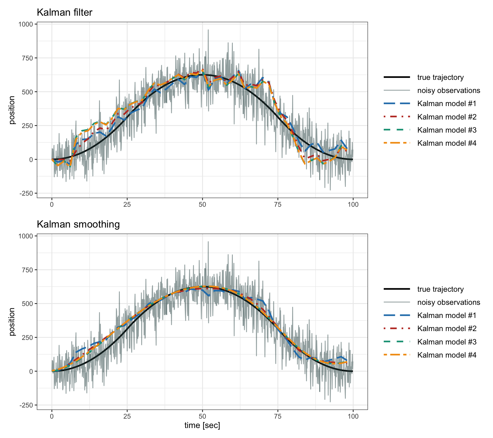
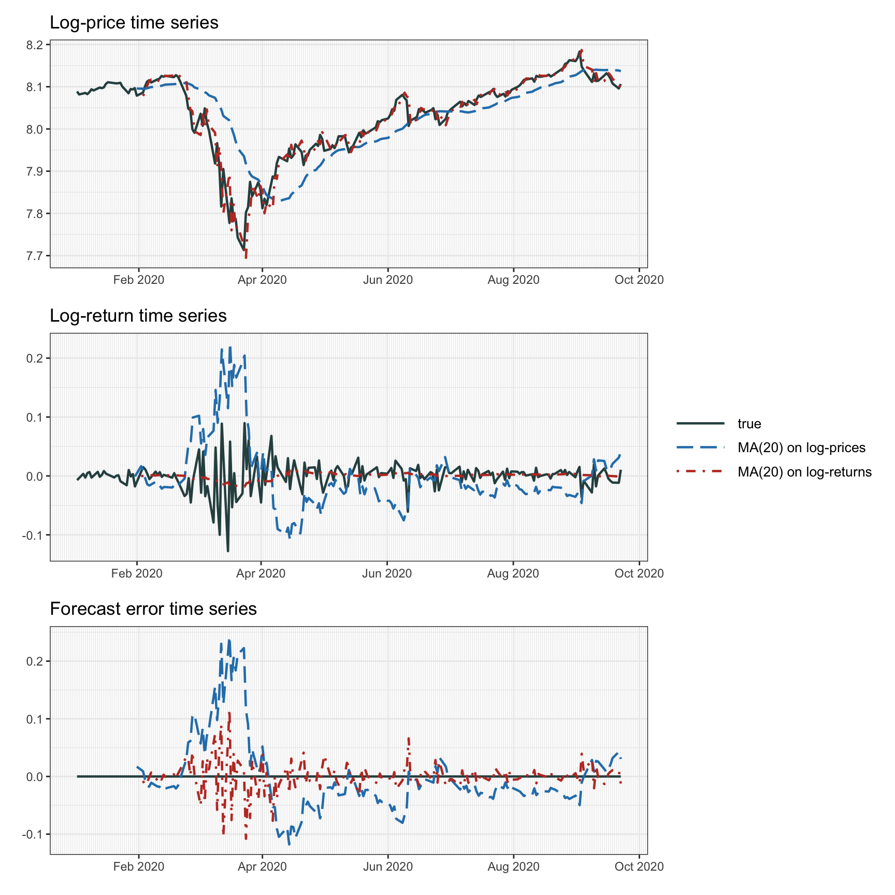
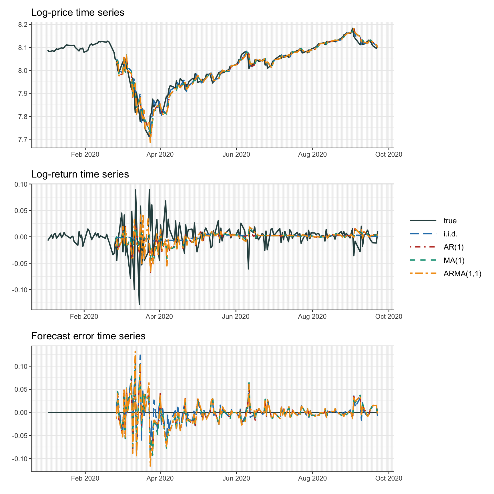
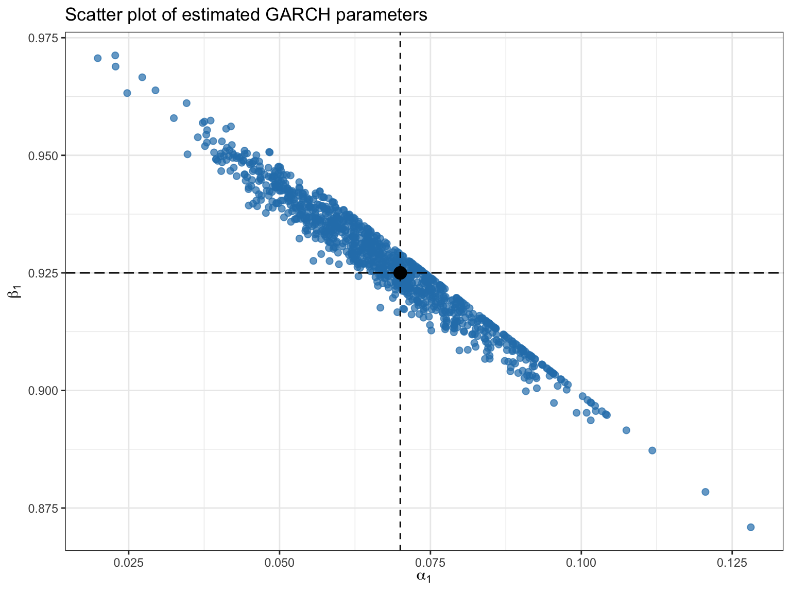
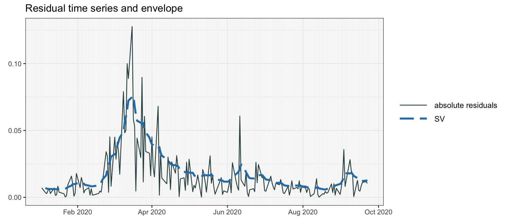

# Financial Data: Time Series Modeling {#time-series-modeling}

> "It is very hard to predict, especially the future."
>
> --- Niels Bohr

\afterquotespace
\acknowledgementCUP

\index{efficient-market hypothesis (EMH)}
The efficient-market hypothesis states that the price of a security already contains all the publicly available information about the future [@Fama1970]. From that, it makes sense to model a sequence of prices as a random walk [@Malkiel1973] or, equivalently, to model returns as a sequence of independent and identically distributed (i.i.d.) random variables as explored in Chapter\ \@ref(iid-modeling). This is a widely adopted model by practitioners and academics. <!---In a nutshell, this means that data can be basically modeled with a constant mean vector and a covariance matrix.--->

Nevertheless, another line of thought precisely supports the opposite view in favor of inefficient and irrational markets [@Shiller1981] under so-called behavioral finance [@Shiller2003]. Indeed, it is undeniable that financial data exhibit some temporal structure that could be potentially modeled and exploited [@LoMacKinlay2002]. One of the most noticeable structural aspects is the volatility clustering (described in Chapter\ \@ref(stylized-facts)). This chapter examines the temporal structure in financial time series in the form of mean models and variance (or volatility) models with an emphasis on the Kalman filter.

  This material has been published as:
  Daniel P. Palomar (2025). _Portfolio Optimization: Theory and Application_. Cambridge University Press.
  This version is free to view and download for personal use only; not for re-distribution, re-sale, or use in derivative works. ©\ Daniel P. Palomar 2025.

## Temporal Structure
From the exploratory analysis of financial data and stylized facts in Chapter\ \@ref(stylized-facts), one can either assume the i.i.d. model, as pursued in detail in Chapter\ \@ref(iid-modeling), or try to incorporate some temporal structure in the model, as this chapter attempts.

\index{efficient-market hypothesis (EMH)}
The i.i.d. model can be motivated by Fama's efficient-market hypothesis [@Fama1970], which holds that one cannot forecast future prices since the price of a security already contains all the publicly available information. On the other hand, an equally popular line of thought in finance supports inefficient and irrational markets [@Shiller1981] under behavioral finance [@Shiller2003].[^Shiller-nobel-prize] Under this premise, the market is predictable to some degree and perhaps it may move in trends so that the study of past prices can be used to forecast future price direction. 

[^Shiller-nobel-prize]: It is somewhat interesting that both Robert J. Shiller and Eugene F. Fama were awarded
the 2013 Sveriges Riksbank Prize in Economic Sciences in Memory of Alfred Nobel, when they support opposing views on the nature of financial markets, namely, the inefficiency of markets and the efficient-market hypothesis, respectively. \index{Nobel prize!Eugene F. Fama} \index{Nobel prize!Robert J. Shiller}

\index{conditional models}
Thus, rather than assuming the random walk model [@Malkiel1973], we will focus on nonrandom walk models [@LoMacKinlay2002]. Suppose we have $N$ securities or tradable assets and let $\bm{x}_t\in\R^N$ be the random returns of the assets at time $t$. Instead of using the i.i.d. model for the returns, $\bm{x}_t = \bmu + \bm{\epsilon}_t$ as in \@ref(eq:iid-model), we will now transition to a more general model in which the returns, $\bm{x}_t$, are modeled conditioned on the past observations, denoted by $\mathcal{F}_{t-1} \triangleq \{\dots,\bm{x}_{t-2},\bm{x}_{t-1}\}$, and then write
\begin{equation}
  \bm{x}_t = \bmu_t + \bm{\epsilon}_t,
  (\#eq:general-time-series-model)
\end{equation}
where $\bmu_t\in\R^N$ is the _conditional expected return_ 
$$\bmu_t = \E\left[\bm{x}_t \mid \mathcal{F}_{t-1}\right]$$ 
and $\bm{\epsilon}_t\in\R^N$ denotes the error in the model (also called innovation or residual) with zero mean and _conditional covariance matrix_ 
$$\bSigma_t = \E\left[(\bm{x}_t - \bmu_t)(\bm{x}_t - \bmu_t)^\T \mid \mathcal{F}_{t-1}\right].$$

The i.i.d. model in \@ref(eq:iid-model) from Chapter\ \@ref(iid-modeling) can be obtained with the particular choice $\bmu_t = \bmu$ and $\bSigma_t = \bSigma$, which remain fixed over time. \index{i.i.d. model}

Modeling the returns $\bm{x}_t$ conditioned on the historical data $\mathcal{F}_{t-1}$ is precisely one of the objectives in the field of _econometrics_, which integrates statistical and mathematical models to formulate theories or test existing hypotheses in economics, as well as to predict future trends based on historical data. Figure\ \@ref(fig:ar1-time-series) shows an example of a synthetic univariate Gaussian AR(1) time series (model described later), where we can observe some temporal structure.

(\#fig:ar1-time-series)Example of a synthetic Gaussian AR(1) time series.

Some accessible textbooks that cover financial data modeling include @Tsay2010 and @RuppertMatteson2015, with more emphasis on the multivariate case in @Lutkepohl2007 and @Tsay2013. Some excellent survey papers are also available, such as @BollerslevChouKroner1992, @Taylor1994, and @PoonGranger2003. 

This chapter deviates slightly from the conventional econometric modeling approaches, which typically revolve around autoregressive models and "GARCH" volatility models. Instead, the emphasis is placed on the simplicity of models combined with the versatile Kalman filter (often underutilized in financial literature, although still covered in @Tsay2010 and @Lutkepohl2007). Additionally, stochastic volatility modeling is emphasized here, which frequently does not receive the attention it deserves in favor of more popular "GARCH" models. Specifically, after an introduction to Kalman filtering in Section\ \@ref(kalman), the following two families of models are presented:

- _mean models_: for the conditional expected return $\bmu_t = \E\left[\bm{x}_t \mid \mathcal{F}_{t-1}\right]$ in Section\ \@ref(mean-modeling); and

- _variance models_: for the conditional covariance matrix $\bSigma_t = \E\left[(\bm{x}_t - \bmu_t)(\bm{x}_t - \bmu_t)^\T \mid \mathcal{F}_{t-1}\right]$ in Section\ \@ref(variance-modeling).

## Kalman Filter {#kalman}
\index{state-space model|see{Kalman, state-space model}}
\index{Kalman}
\index{Kalman!state-space model}
_State-space modeling_ provides a unified framework for treating a wide range of problems in time series analysis. It can be thought of as a universal and flexible modeling approach with a very efficient algorithm: the _Kalman filter_. The basic idea is to assume that the evolution of the system over time is driven by a series of unobserved or hidden values, which can only be measured indirectly through observations of the system output. This modeling can be used for filtering, smoothing, and forecasting.

The Kalman filter is named after Rudolf E. Kalman, who was one of the primary developers of the theory [@Kalman1960]. It is sometimes called the Kalman--Bucy filter or even Stratonovich--Kalman--Bucy filter, because Richard S. Bucy also contributed to the theory and Ruslan Stratonovich earlier proposed a more general nonlinear version. Arguably, some of the most comprehensive and authoritative classical references for state-space models and Kalman filtering include the textbooks @AndersonMoore1979 and @DurbinKoopman2012, which was originally published in 2001. Other textbook references on time series and the Kalman filter include @BrockwellDavis2002, @ShumwayStoffer2017, @Harvey1989 and, in particular, for financial time series, @ZivotWangKoopman2004, @Tsay2010, @Lutkepohl2007, and @HarveyKoopman2009.

The Kalman filter, which was employed by NASA during the 1960s in the Apollo program, now boasts a vast array of technological applications. It is commonly utilized in the guidance, navigation, and control of vehicles, including aircraft, spacecraft, and maritime vessels. It has also found applications in time series analysis, signal processing, and econometrics. More recently, it has become a key component in robotic motion planning and control, as well as trajectory optimization.

Currently, the software implementation of Kalman filtering is widespread and numerous libraries are available in most programming languages, for example @Kalman_in_R_JSS2011, @SSM_in_R_JSS2011, @KFAS_JSS2017, and @MARSS_RJournal2012 for the R programming language.

### State-Space Model
\index{Kalman!state-space model}
\index{Kalman!state-space model!observation equation}
\index{Kalman!state-space model!state equation}
Mathematically, the Kalman filter is based on the following linear Gaussian state-space model with discrete time $t=1,\dots,T$ [@DurbinKoopman2012]:
\begin{equation}
  \qquad\qquad
  \begin{aligned}
  \bm{y}_t          &= \bm{Z}\bm{\alpha}_t + \bm{\epsilon}_t\\
  \bm{\alpha}_{t+1} &= \bm{T}\bm{\alpha}_t + \bm{\eta}_t
  \end{aligned}
  \quad
  \begin{aligned}
  & \textm{(observation equation)},\\
  & \textm{(state equation)},
  \end{aligned}
  (\#eq:state-space-model)
\end{equation}
where $\bm{y}_t$ denotes the observations over time with observation matrix $\bm{Z}$, $\bm{\alpha}_t$ represents the unobserved or hidden internal state with state transition matrix $\bm{T}$, and the two noise terms $\bm{\epsilon}_t$ and $\bm{\eta}_t$ are Gaussian distributed with zero mean and covariance matrices $\bm{H}$ and $\bm{Q}$, respectively, that is, $\bm{\epsilon}_t \sim \mathcal{N}(\bm{0},\bm{H})$ and $\bm{\eta}_t \sim \mathcal{N}(\bm{0},\bm{Q})$. The initial state can be modeled as $\bm{\alpha}_1 \sim \mathcal{N}(\bm{a}_1,\bm{P}_1)$. Mature and efficient software implementations of the model in \@ref(eq:state-space-model) are readily available, for example @KFAS_JSS2017.[^KFAS-package]

[^KFAS-package]: The R package [`KFAS`](https://cran.r-project.org/package=KFAS) implements the Kalman filter for the model \@ref(eq:state-space-model) [@KFAS_JSS2017]. \index{R packages!KFAS}
The Python package [`filterpy`](https://github.com/rlabbe/filterpy) provides Kalman methods. \index{Python packages!filterpy}

It is worth mentioning that an alternative notation widespread in the literature for the state-space model \@ref(eq:state-space-model) is to shift the time index in the state equation by one: $\bm{\alpha}_{t} = \bm{T}\bm{\alpha}_{t-1} + \bm{\eta}_t$. This change in notation only has a slight effect on the initial point of the system, which is now $\bm{\alpha}_{0}$ (corresponding to the time before the first observation) instead of $\bm{\alpha}_{1}$ (corresponding to the same time as the first observation); other than that, it is just a notational preference.

The parameters of the state-space model in \@ref(eq:state-space-model) (i.e., $\bm{Z}$, $\bm{T}$, $\bm{H}$, $\bm{Q}$, $\bm{a}_1$, and $\bm{P}_1$) can be provided by the user (if known). Otherwise, they can be inferred from the data with algorithms based on maximum likelihood estimation. Again, mature and efficient software implementations are available for parameter fitting [@MARSS_RJournal2012].[^MARSS-package] In order to build some intuition about state-space models, let us look at a simple yet illustrative example.

[^MARSS-package]: The R package [`MARSS`](https://cran.r-project.org/package=MARSS) implements algorithms for fitting the unknown parameters of the state-space model \@ref(eq:state-space-model) based on observed time series data [@MARSS_RJournal2012]. \index{R packages!MARSS}

::: {.example #tracking name="Tracking via state-space model"}
Suppose we want to track an object in one dimension over time, $x_t$, from noisy measurements $y_t= x_t + \epsilon_t$ measured at time intervals $\Delta t$. We provide four different ways to model this system, from the simplest to the most advanced, based on the state-space model in \@ref(eq:state-space-model).

1. If we define the internal state simply as the position, $\alpha_t = x_t$, then \@ref(eq:state-space-model) simply becomes
$$
\begin{aligned}
  y_t     &= x_t + \epsilon_t,\\
  x_{t+1} &= x_t + \eta_t,
\end{aligned}
$$
where it is tacitly assumed that the position $x_t$ does not change much.

2. If now we incorporate the velocity $v_t$ in the internal state, $\bm{\alpha}_t = \begin{bmatrix} x_t\\ v_t \end{bmatrix}$, then the state-space model becomes
$$
\begin{aligned}
  y_t &= \begin{bmatrix} 1 & 0 \end{bmatrix} \begin{bmatrix} x_t\\ v_t \end{bmatrix} + \epsilon_t,\\
  \begin{bmatrix} x_{t+1}\\ v_{t+1} \end{bmatrix} &= \begin{bmatrix} 1 & \Delta t\\ 0 & 1 \end{bmatrix} \begin{bmatrix} x_t\\ v_t \end{bmatrix} + \bm{\eta}_t,
\end{aligned}
$$
where now the position is better modeled thanks to also modeling the velocity.

3. We can further include the acceleration $a_t$ in the internal state, $\bm{\alpha}_t = \begin{bmatrix} x_t\\ v_t\\ a_t \end{bmatrix}$, leading to the state-space model
$$
\begin{aligned}
  y_t &= \begin{bmatrix} 1 & 0 & 0\end{bmatrix} \begin{bmatrix} x_t\\ v_t\\ a_t \end{bmatrix} + \epsilon_t,\\
  \begin{bmatrix} x_{t+1}\\ v_{t+1}\\ a_{t+1} \end{bmatrix} &= \begin{bmatrix} 1 & \Delta t & 0\\ 0 & 1 & \Delta t\\ 0 & 0 & 1\end{bmatrix} \begin{bmatrix} x_t\\ v_t\\ a_t \end{bmatrix} + \bm{\eta}_t.
\end{aligned}
$$

4. Finally, we can further improve the model, especially if the sampling rate is not high enough, by including the acceleration in the position equation, $x_{t+1} = x_t + \Delta t v_t + \frac{1}{2}\Delta t^2 a_t$, leading to
$$
\begin{aligned}
  y_t &= \begin{bmatrix} 1 & 0 & 0\end{bmatrix} \begin{bmatrix} x_t\\ v_t\\ a_t \end{bmatrix} + \epsilon_t,\\
  \begin{bmatrix} x_{t+1}\\ v_{t+1}\\ a_{t+1} \end{bmatrix} &= \begin{bmatrix} 1 & \Delta t & \frac{1}{2}\Delta t^2\\ 0 & 1 & \Delta t\\ 0 & 0 & 1\end{bmatrix} \begin{bmatrix} x_t\\ v_t\\ a_t \end{bmatrix} + \bm{\eta}_t.
\end{aligned}
$$
:::

It is important to emphasize that the state-space model in \@ref(eq:state-space-model) is not the most general one. One trivial extension is to allow the parameters $\bm{Z}$, $\bm{T}$, $\bm{H}$, and $\bm{Q}$ to change over time: $\bm{Z}_t$, $\bm{T}_t$, $\bm{H}_t$, and $\bm{Q}_t$. More generally, one can relax the two key assumptions in \@ref(eq:state-space-model), by (i)\ allowing nonlinear functions of $\bm{\alpha}_t$ (instead of the linear functions $\bm{Z}\bm{\alpha}_t$ and $\bm{T}\bm{\alpha}_t$) and (ii)\ not assuming the noise distributions to be Gaussian. This leads to extensions proposed in the literature such as the _extended Kalman filter_, the _unscented Kalman filter_, and even the more general (albeit more computationally demanding) _particle filtering_ [@DurbinKoopman2012].

### Kalman Filtering and Smoothing
The Kalman filter is a very efficient algorithm to optimally solve the state-space model in \@ref(eq:state-space-model), which is linear and assumes Gaussian distributions for the noise terms. Its computational cost is manageable to the point that it was even used in the Apollo program by NASA in the 1960s: it was quite remarkable that it could be implemented in a tiny and rudimentary computer (2$\,$KB of magnetic core RAM, 36$\,$KB of core rope memory (ROM), CPU built from ICs with a clock speed under 100$\,$kHz).

\index{Kalman!Kalman filtering}
The objective of _Kalman filtering_ is to characterize the distribution of the hidden state at time $t$, $\bm{\alpha}_t$, given the observations up to (and including) time $t$, $\bm{y}_1,\dots,\bm{y}_t$, that is, in a causal manner. Since the distribution of the noise terms is Gaussian, it follows that the conditional distribution of $\bm{\alpha}_t$ is also Gaussian; therefore, it suffices to characterize the conditional mean and conditional covariance matrix:
$$
\begin{aligned}
  \bm{a}_{t\mid t} &\triangleq \E\left[\bm{\alpha}_t \mid (\bm{y}_1,\dots,\bm{y}_t)\right],\\
  \bm{P}_{t\mid t} &\triangleq \textm{Cov}\left[\bm{\alpha}_t \mid (\bm{y}_1,\dots,\bm{y}_t)\right].
\end{aligned}
$$
For forecasting purposes, one is really interested in the distribution of the hidden state at time $t+1$, $\bm{\alpha}_{t+1}$, given the observations up to (and including) time $t$, denoted by $\bm{a}_{t+1\mid t}$ and $\bm{P}_{t+1\mid t}$. These filtering and forecasting quantities can be efficiently computed using a "forward pass" algorithm that goes from $t=1$ to $t=T$ in a sequential way, so that it can operate in real time [@DurbinKoopman2012]. \index{Kalman!Kalman forecasting}

\index{Kalman!Kalman smoothing}
On the other hand, the objective of _Kalman smoothing_ is to characterize the distribution of the hidden state at time $t$, $\bm{\alpha}_t$, given all the observations, $\bm{y}_1,\dots,\bm{y}_T$, that is, in a noncausal manner. Such a distribution is also Gaussian and it is fully characterized by the following conditional mean and conditional covariance matrix:
$$
\begin{aligned}
  \bm{a}_{t\mid T} &\triangleq \E\left[\bm{\alpha}_t \mid (\bm{y}_1,\dots,\bm{y}_T)\right],\\
  \bm{P}_{t\mid T} &\triangleq \textm{Cov}\left[\bm{\alpha}_t \mid (\bm{y}_1,\dots,\bm{y}_T)\right].
\end{aligned}
$$
Interestingly, these quantities can also be efficiently computed using a "backward pass" algorithm that goes from $t=T$ to $t=1$ [@DurbinKoopman2012]. Since this requires all observations, it is naturally a batch-processing algorithm rather than an online one.

Overall, the full characterization of the hidden states executes both forward and backward passes very efficiently. The choice of filtering vs. smoothing depends on whether the application requires a causal approach (real time) or noncausal (batch processing). Obviously, the hidden state characterization of smoothing is much better than filtering as it uses more information.

Figure\ \@ref(fig:kalman-tracking-example) shows the result of Kalman filtering and Kalman smoothing for the four different state-space models in Example \@ref(exm:tracking) (properly fitting the variances of the noise terms via maximum likelihood). In general, the more accurate the model, the better the performance. In this specific example, however, the differences are minimal. On the other hand, Kalman smoothing significantly outperforms Kalman filtering because it has access to all observations simultaneously.

(ref:kalman-tracking-example) Example of Kalman position tracking under the four different models from Example \@ref(exm:tracking).

(\#fig:kalman-tracking-example)(ref:kalman-tracking-example)

## Mean Modeling {#mean-modeling}
In econometrics, we are interested in forecasting the future values of a financial time series given past observations. A first choice we need to make is whether to focus on the time series of the prices or the returns. Of course they are trivially related to each other, but it is not clear a priori which one is more manageable: the returns tend to be more constant and are easier to model, whereas the prices tend to present a trend. Recall that the log-prices are denoted as $\bm{y}_t = \textm{log}\; \bm{p}_{t}$ and the log-returns as $\bm{x}_t = \bm{y}_t - \bm{y}_{t-1}$ (see Chapter\ \@ref(iid-modeling) for the random walk model).

Unless otherwise stated, we will focus on the univariate case (single asset) for simplicity. In fact, in most practical cases, the multivariate case can be treated on an asset-by-asset basis. Thus, the objective is to compute the expectation of the future value of the time series at time $t$ based on the past observations $\mathcal{F}_{t-1}$ with the hope of extracting any structural information, that is, either $\E[y_t \mid \mathcal{F}_{t-1}]$ for the log-prices or $\E[x_t \mid \mathcal{F}_{t-1}]$ for the log-returns.

Readers should be aware that there might not be any significant temporal structural information to leverage. In such cases, the i.i.d. model from Chapter\ \@ref(iid-modeling) would suffice. In fact, this is partly supported by the exploratory data analysis in Section\ \@ref(temporal-structure) of Chapter\ \@ref(stylized-facts), where the autocorrelation of the returns appears to be insignificant. Ultimately, this depends on the nature of the data and, specifically, on the frequency of the data observations.

### Moving Average (MA) {#MA}
Inspired by the i.i.d. model for the returns $x_t = \mu + \epsilon_t$ in \@ref(eq:iid-model), the simplest way to estimate $\mu$ is by taking the average of several observations in order to reduce the effect of the noise or innovation component $\epsilon_t.$

\index{MA}
\index{moving average (MA)|see{MA}}
The _moving average_ (MA) of order $q$, denoted by MA$(q)$, is
\begin{equation}
  \hat{x}_t = \frac{1}{q}\sum_{i=1}^q x_{t-i},
  (\#eq:MA-x)
\end{equation}
where $q$ denotes the lookback and determines the amount of averaging. Since this sample mean is computed for each value of $t$ on a rolling-window basis, it is also commonly referred to as _rolling means_. A noncausal variation (appropriate for smoothing but not for forecasting) considers a centered version of the moving average by using past and future samples around $x_t$.

Observe that, under the i.i.d. model $x_t = \mu + \epsilon_t$, the moving average is indeed estimating $\mu$ by averaging the noise:
$$
\hat{x}_t = \mu + \frac{1}{q}\sum_{i=1}^q \epsilon_{t-i},
$$
where the averaged noise component has a variance reduced by a factor of $q$. If, instead of the i.i.d. model, $\mu_t$ is allowed to change over time, the effect of the moving average is to approximate this slowly changing value.

It is insightful to explore the interpretation of the moving average on the log-returns from the perspective of log-prices. Using $x_t = y_t - y_{t-1}$, the moving average in \@ref(eq:MA-x) can be rewritten as
$$
\hat{x}_t = \frac{1}{q} (y_{t-1} - y_{t-q-1}).
$$
This shows that it is effectively computing the trend of the log-prices in the form of a slope.

Alternatively, the moving average operation can be implemented on the log-prices instead of log-returns:
\begin{equation}
  \hat{y}_t = \frac{1}{q}\sum_{i=1}^q y_{t-i}.
  (\#eq:MA-y)
\end{equation}

This is widely employed in the context of "charting" or "technical analysis" [@Malkiel1973], where it is typically performed directly on the prices $p_t$ (without the log operation). However, this does not seem to have any solid mathematical foundation apart from the visual interpretation of "smoothing" the noisy time series.

<!---
---
because the effect in terms of log-returns is an average where past observations are given more weight than the ones close in time:
$$
\begin{aligned}
\hat{y}_t 
&= y_{t-1} - \frac{m-1}{m}(\mu + \epsilon_{t-1}) - \dots - \frac{1}{m}(\mu + \epsilon_{t-m+1})\\
&= y_{t-1} - \frac{m-1}{2}\mu - \frac{m-1}{m}\epsilon_{t-1} - \dots - \frac{1}{m}\epsilon_{t-m+1}\\
\end{aligned}
$$
or, expressed in terms of log-returns,
$$
\hat{x}_t = \hat{y}_t - y_{t-1} = - \frac{m-1}{2}\mu + noise,
$$
where the noise has a variance of approximately $m/3$.
--->

Figure\ \@ref(fig:mean-modeling-MA) illustrates the effect of forecasting via moving averages performed on the log-prices and log-returns. As expected from the theoretical analysis, the MA on the log-prices is much worse, albeit being widely used in the "charting" community. Note that the difference of using prices instead of log-prices or using returns instead of log-returns is insignificant and not reported. Table\ \@ref(tab:mean-modeling-MA-table) reports the mean squared error of the forecasting and it shows that, again, averaging the log-returns makes more sense (the lookback value $q$ can be more carefully selected for improved performance).

(\#fig:mean-modeling-MA)Forecasting with moving average.

<table>
<caption>(\#tab:mean-modeling-MA-table)Comparison of moving average forecasting in terms of mean squared error.</caption>
 <thead>
  <tr>
   <th style="text-align:left;">   </th>
   <th style="text-align:left;"> MSE </th>
  </tr>
 </thead>
<tbody>
  <tr>
   <td style="text-align:left;"> MA(20) on log-prices </td>
   <td style="text-align:left;"> 0.004 032 </td>
  </tr>
  <tr>
   <td style="text-align:left;"> MA(20) on log-returns </td>
   <td style="text-align:left;"> 0.000 725 </td>
  </tr>
</tbody>
</table>

### EWMA {#EMA}
\index{EWMA}
\index{EMA|see{EWMA}}
\index{exponentially weighted moving average (EWMA)|see{EWMA}}
The simple moving average in Section\ \@ref(MA) essentially computes the average of the past observations. However, one can argue that the more recent observations should be weighted more than the less recent ones. This can be conveniently achieved with the _exponentially weighted moving average_ (EWMA), or simply _exponential moving average_ (EMA), with the recursive computation
\begin{equation}
  \hat{x}_t = \alpha x_{t-1} + (1 - \alpha) \hat{x}_{t-1},
  (\#eq:EMA-x)
\end{equation}
where $\alpha$ (with $0\leq\alpha\leq1$) determines the exponential decay or memory.

We can easily see that this recursion is effectively implementing exponential weights (hence the name):
$$
\hat{x}_t = \alpha x_{t-1} + \alpha(1 - \alpha) x_{t-2} + \alpha(1 - \alpha)^2 x_{t-3} + \alpha(1 - \alpha)^3 x_{t-4} + \cdots
$$

<!---
 [@DurbinKoopman2012]
 
Figure\ \@ref(fig:mean-modeling-EMA) illustrates the effect of forecasting via the EMA (with $\alpha = 0.18$) performed on the log-prices and log-returns. Compared to the MA forecasting, it seems to react a bit faster, but otherwise similar.

--->

### ARMA Modeling {#ARMA}
The "bread and butter" modeling and forecasting techniques in finance are extensions of the basic MA and EMA models previously described. These classical methods are essentially autoregressive models that attempt to capture any existing linear structure in the return time series. These models have been extensively explored for the past five decades and have reached a good level of maturity. We now summarize the basic ideas without going into any level of detail; more information can be found in the many comprehensive textbooks [@Lutkepohl2007; @Tsay2010; @Tsay2013; @RuppertMatteson2015].

\index{AR model}
The most basic _autoregressive_ (AR) model is of order $1$, denoted by AR$(1)$, given as
$$
x_t = \phi_0 + \phi_1 x_{t-1} + \epsilon_t,
$$
where $\phi_0$ and $\phi_1$ (as well as the variance $\sigma^2$ of the noise term $\epsilon_t$) are the parameters of the model to be determined via a fitting procedure on historical data. This model attemps to capture any linear dependency between the consecutive returns. More generally, an autoregressive model of order $p$, AR$(p)$, is given by
$$
x_t = \phi_0 + \sum_{i=1}^p \phi_i x_{t-i} + \epsilon_t,
$$
which now contains more parameters, $\phi_0,\dots,\phi_p$ and $\sigma^2$, to be fitted (also, the order $p$ has to be determined).

\index{ARMA model}
Similarly, we have the moving average models that attempt to exploit any linear dependency from past noise terms by averaging the last $q$ values. Combining both components leads us to the popular _autoregressive moving average_ (ARMA) models. In particular, an ARMA model of orders $p$ and $q$, denoted by ARMA$(p,q)$, is written as
\begin{equation}
  x_t = \phi_0 + \sum_{i=1}^p \phi_i x_{t-i} + \epsilon_t - \sum_{j=1}^q \psi_j \epsilon_{t-j},
  (\#eq:ARMA)
\end{equation}
where now the parameters are $\phi_0,\dots,\phi_p$, $\psi_1,\dots,\psi_q$ and $\sigma^2$.

Under the ARMA model in \@ref(eq:ARMA), the forecast of $x_t$ is given by the conditional expected return
$$
\hat{x}_t \triangleq \mu_t = \E[x_t \mid \mathcal{F}_{t-1}] = \phi_0 + \sum_{i=1}^p \phi_i x_{t-i},
$$
with conditional variance
$$
\sigma^2_t = \E[(x_t - \mu_t)^2 \mid \mathcal{F}_{t-1}] = \sigma^2,
$$
where $\sigma^2$ is the (constant) variance of the noise term $\epsilon_t$. Thus, ARMA modeling can properly deal with time-varying mean models; however, the variance is still constant. Time-varying variance models are considered in Section\ \@ref(variance-modeling).

\index{ARIMA model}
The ARMA model is defined on the log-returns $x_t$, which are stationary (the first and second moments are time invariant), as opposed to the log-prices $y_t$, which are nonstationary (e.g., a random walk). That is, the original log-price time series cannot be modeled directly and we have to compute the first-order difference to get $x_t = y_t - y_{t-1}$. In general, for other types of time series, we may need to take the $d$th-order difference before employing an ARMA model [@Tsay2010]. This is precisely what is termed the _autoregressive integrated moving average_ (ARIMA) model, denoted by ARIMA$(p,d,q)$, and is given by
$$
x_t = \phi_0 + \sum_{i=1}^p \phi_i x_{t-i} + \epsilon_t - \sum_{j=1}^q \psi_j \epsilon_{t-j},
$$
where $x_t$ is obtained by differencing the original time series $y_t$ $d$ times. Thus, an ARIMA model (with $d=1$) on the log-prices is equivalent to an ARMA model on the log-returns.

ARMA models require the appropriate coefficients to properly fit the data. Mature and efficient software implementations are readily available in most programming languages for ARMA modeling, including the fitting process.[^rugarch-package]

[^rugarch-package]: The R package [`rugarch`](https://cran.r-project.org/package=rugarch) implements algorithms for fitting a wide range of different ARMA models to time series data [@rugarch]. Many other packages are also available in R. \index{R packages!rugarch}
The Python package [`statsmodels`](https://github.com/statsmodels/statsmodels) contains a number of statistical data modeling methods. \index{Python packages!statsmodels}

All the previous models require order selection. The order of a model is characterized by the integers $p$ and $q$ that indicate the number of parameters. In practice, the order of a model is unknown and also has to be determined from historical data [@Lutkepohl2007]. The higher the order, the more parameters the model contains to better fit the data; however, this comes with the danger of overfitting, that is, fitting the historical data (including the noise) too well at the expense of not being able to fit the future data appropriately. The topic of overfitting is discussed in Chapter\ \@ref(backtesting) in the context of backtesting. There are two main approaches to choosing the model order:

- _cross-validation_: based on splitting the historical data into a training part and a cross-validation part, the latter being used to test the model trained with different values of orders; and

- _penalization methods_: based on taking into account the number of parameters of the model with a penalty term in the assessment of the model, which has led to many methods, such as AIC, BIC, SIC, HQIC, and so on [@Lutkepohl2007].

Figure\ \@ref(fig:mean-modeling-ARMA) illustrates the effect of forecasting via ARMA modeling based on some specific choices of the orders, namely, i.i.d. model, AR(1), MA(1), and ARMA(1,1). Table\ \@ref(tab:mean-modeling-ARMA-table) reports the mean squared error of the forecasts, from which we can infer that the i.i.d. modeling gives the best fit (not unexpected given the lack of strong autocorrelations in the returns).

(\#fig:mean-modeling-ARMA)Forecasting with ARMA models.

<table>
<caption>(\#tab:mean-modeling-ARMA-table)Comparison of ARMA forecasting in terms of mean squared error.</caption>
 <thead>
  <tr>
   <th style="text-align:left;">   </th>
   <th style="text-align:left;"> MSE </th>
  </tr>
 </thead>
<tbody>
  <tr>
   <td style="text-align:left;"> i.i.d. </td>
   <td style="text-align:left;"> 0.000 754 </td>
  </tr>
  <tr>
   <td style="text-align:left;"> AR(1) </td>
   <td style="text-align:left;"> 0.000 793 </td>
  </tr>
  <tr>
   <td style="text-align:left;"> MA(1) </td>
   <td style="text-align:left;"> 0.000 805 </td>
  </tr>
  <tr>
   <td style="text-align:left;"> ARMA(1,1) </td>
   <td style="text-align:left;"> 0.000 914 </td>
  </tr>
</tbody>
</table>

### Seasonality Decomposition
\index{structural time series models}
\index{seasonality decomposition}
\index{exponential smoothing methods}
In a _structural time series model_, the observed time series is viewed as a sum of unobserved components such as a trend, a seasonal component, and an irregular component [@Lutkepohl2007; @DurbinKoopman2012]. For example, the random walk model for the log-prices, $y_t = y_{t-1} + \mu + \epsilon_t$, can be extended to include the seasonal component $\gamma_t$ as
$$
y_t = \mu_t + \gamma_t + \epsilon_t,
$$
where $\mu_t$ is the trend that can be modeled, for example, as $\mu_t = \mu_{t-1} + \eta_t$, and the seasonal component $\gamma_t$ (with $s$ seasons in a period) as $\gamma_t = -\sum_{j=1}^{s-1}\gamma_{t-j} + \omega_t$ so that the sum over a full period is approximately zero ($\omega_t$ is a small white noise term).

\index{volatility smile}
The topic of time series decomposition has received a lot of attention and a wide variety of models have been proposed since the 1950s [@HyndmanKoehlerOrdSnyder2008]. They are often referred to as _exponential smoothing methods_ since they are sophisticated versions of the EWMA described in Section\ \@ref(EMA) combined with the idea of decomposition of the observed time series into a variety of terms such as trend, seasonality, cycle, and so on. These methods can be extremely useful if the time series indeed contains such seasonality and cyclic components. For example, intraday financial data clearly contains specific components that change with some pattern during the day, such as the so-called "volatility smile" pattern, which refers to the volatility being higher at the beginning and end of the day, while being low during the middle of the day. Interestingly, the intraday volatility decomposition can be efficiently modeled via a state-space representation and implemented with the Kalman algorithm [@ChenFengPalomar2016; @XiuPalomar2023].

### Kalman Modeling {#Kalman-univariate-mean-modeling}
The random walk model for the log-prices, $y_t = y_{t-1} + \mu + \epsilon_t$ with $\epsilon_t \sim \mathcal{N}(0, \sigma^2)$, is equivalent to the i.i.d. model for the log-returns, $x_t = \mu + \epsilon_t$, and the results of Chapter\ \@ref(iid-modeling) can be used to fit the time series. Realistically, the drift parameter $\mu$ (as well as the volatility $\sigma^2$) will surely be time-varying. The state-space model \@ref(eq:state-space-model) and the Kalman algorithm, described in Section\ \@ref(kalman), can be effectively used precisely to allow some time variation on the drift by treating it as a hidden state that evolves over time. In addition, it allows a more precise separation of the noise into observational noise and drift noise  as described next.

\index{Kalman!mean models}
The simple moving average used in \@ref(eq:MA-x) on the log-returns follows naturally from the i.i.d. model $x_t = \mu + \epsilon_t$ as a way to estimate $\mu$. That is, we can reinterpret \@ref(eq:MA-x) in terms of estimating the drift $\mu$ based on the historical data up to time $t-1$,
$$
\hat{\mu}_t = \frac{1}{m}\sum_{i=1}^m x_{t-i},
$$
and then forecasting the value at time $t$ as $\hat{x}_t = \hat{\mu}_t$. Instead, we can conveniently use a state-space model to allow the drift to slowly change over time by modeling the drift as the hidden state, $\alpha_t = \mu_t$, that evolves over time. This is the so-called _local level_ model [@DurbinKoopman2012]:
\begin{equation}
  \begin{aligned}
  x_t       &= \mu_t + \epsilon_t\\
  \mu_{t+1} &= \mu_t + \eta_t,
  \end{aligned}
  (\#eq:kalman-local-trend-model)
\end{equation}
where the noise term $\eta_t$ allows $\mu_t$ to evolve over time. This model is expected to be more accurate than the simple moving average in \@ref(eq:MA-x). In addition, there is no parameter $q$ to be chosen like in the MA$(q)$ in \@ref(eq:MA-x). Of course, this model still requires the values of the variances of the noise terms, which can be chosen a priori or learned automatically via maximum likelihood.

Alternatively, the moving average was used in \@ref(eq:MA-y) on the log-prices in a rather heuristic way to smooth the otherwise noisy time series. We can again use a state-space model to improve the modeling. For example, if we define the hidden state $\alpha_t$ as a noiseless version of the log-prices, $\alpha_t = \tilde{y}_t$, we can write
\begin{equation}
  \begin{aligned}
  y_t             &= \tilde{y}_t + \epsilon_t,\\
  \tilde{y}_{t+1} &= \tilde{y}_t + \mu + \eta_t,
  \end{aligned}
  (\#eq:kalman-trend-model-2)
\end{equation}
which allows for some observation noise via $\epsilon_t$ and some noise in the state transition via $\eta_t$. We can also allow the drift to be time-varying, $\mu_t$, by augmenting the hidden state as $\bm{\alpha}_t = \begin{bmatrix} \tilde{y}_t\\ \mu_t \end{bmatrix}$, leading to the so-called _local linear trend_ model [@DurbinKoopman2012]:
\begin{equation}
\begin{aligned}
  y_t &= \begin{bmatrix} 1 & 0 \end{bmatrix} \begin{bmatrix} \tilde{y}_t\\ \mu_t \end{bmatrix} + \epsilon_t,\\
  \begin{bmatrix} \tilde{y}_{t+1}\\ \mu_{t+1} \end{bmatrix} &= \begin{bmatrix} 1 & 1\\ 0 & 1 \end{bmatrix} \begin{bmatrix} \tilde{y}_t\\ \mu_t \end{bmatrix} + \bm{\eta}_t.
\end{aligned}
  (\#eq:kalman-trend-model-3)
\end{equation}

Figure\ \@ref(fig:mean-modeling-kalman) illustrates the effect of forecasting via Kalman filtering based on the previous three models, namely, Kalman on log-returns (with dynamic drift $\mu_t$), Kalman on log-prices (with static drift $\mu$), and Kalman on log-prices (with dynamic drift $\mu_t$). The difference is small. Table\ \@ref(tab:mean-modeling-kalman-table) reports the mean squared error of the forecasts, from which we can appreciate that as the models become more accurate the performance improves. Nevertheless, from a practical standpoint, one has to make a decision of complexity vs. meaningful performance. As a final remark, note that the performance of Kalman modeling is better than the previously explored models, namely, MA, EWMA, and ARMA.

(\#fig:mean-modeling-kalman)Forecasting with Kalman.

<table>
<caption>(\#tab:mean-modeling-kalman-table)Comparison of Kalman forecasting in terms of mean squared error.</caption>
 <thead>
  <tr>
   <th style="text-align:left;">   </th>
   <th style="text-align:left;"> MSE </th>
  </tr>
 </thead>
<tbody>
  <tr>
   <td style="text-align:left;"> Kalman on log-returns (dynamic) </td>
   <td style="text-align:left;"> 0.000 632 </td>
  </tr>
  <tr>
   <td style="text-align:left;"> Kalman on log-prices (static) </td>
   <td style="text-align:left;"> 0.000 560 </td>
  </tr>
  <tr>
   <td style="text-align:left;"> Kalman on log-prices (dynamic) </td>
   <td style="text-align:left;"> 0.000 557 </td>
  </tr>
</tbody>
</table>

It is worth mentioning that Kalman filtering can be employed in the context of ARMA modeling from Section\ \@ref(ARMA) simply by rewriting the ARMA model in \@ref(eq:ARMA), $x_t = \phi_0 + \sum_{i=1}^p \phi_i x_{t-i} + \epsilon_t - \sum_{j=1}^q \psi_j \epsilon_{t-j}$, in terms of the state-space model in \@ref(eq:state-space-model). This can be done in a multitude of ways [@ZivotWangKoopman2004; @Lutkepohl2007; @Tsay2010; @DurbinKoopman2012]. For example, an AR$(p)$ can be modeled by defining the hidden state as $\bm{\alpha}_t = \begin{bmatrix} x_t\\ \vdots\\ x_{t-p+1} \end{bmatrix}$, leading to
$$
\begin{aligned}
  x_t &= \begin{bmatrix} 1 & 0 & \dots & 0 \end{bmatrix} \bm{\alpha}_t,\\
  \bm{\alpha}_{t+1} &= \begin{bmatrix} \phi_0\\ 0\\ \vdots\\ 0 \end{bmatrix} + \begin{bmatrix} \phi_1 & \dots & \phi_{p-1} & \phi_p\\ 1 & \dots & 0 & 0\\ \vdots & \ddots & \vdots & \vdots\\ 0 & \dots & 1 & 0\\ \end{bmatrix} \bm{\alpha}_t + \begin{bmatrix} \epsilon_t\\ 0\\ \vdots\\ 0 \end{bmatrix}.
\end{aligned}
$$

<!---
### Numerical experiments

Here we simply compare the best methods overviewed for each type of modeling, namely:

- MA
- EMA
- ARMA
- Kalman
--->

### Extension to the Multivariate Case {#multivariate-mean-models}
In practice, we typically deal with $N$ assets, so the previous univariate mean modeling approaches need to be extended to the multivariate case, which is quite straightforward. In fact, the simple MA and EWMA models from Sections\ \@ref(MA) and\ \@ref(EMA) can be directly applied to each of the assets separately. We will next briefly describe the extension for ARMA modeling and for the state-space representation of Kalman modeling.

#### VARMA {-}
\index{VARMA model}
The ARMA model in Section\ \@ref(ARMA) can be straightforwardly extended to the multivariate case by using matrix coefficients instead of scalar coefficients. Similarly to the ARMA$(p,q)$ model in \@ref(eq:ARMA), a vector ARMA (VARMA) model of orders $p$ and $q$, denoted by VARMA$(p,q)$, becomes
\begin{equation}
\bm{x}_t = \bm{\phi}_0 + \sum_{i=1}^p \bm{\Phi}_i \bm{x}_{t-i} + \bm{\epsilon}_t - \sum_{j=1}^q \bm{\Psi}_j \bm{\epsilon}_{t-j},
  (\#eq:VARMA)
\end{equation}
where now the parameters are $\bm{\phi}_0 \in \R^N$, $\bm{\Phi}_1,\dots,\bm{\Phi}_p\in\R^{N\times N}$, $\bm{\Psi}_1,\dots,\bm{\Psi}_q\in\R^{N\times N}$, and $\bm{\Sigma}\in\R^{N\times N}$ is the covariance matrix of $\bm{\epsilon}_t$.

While this extension looks trivial on paper, it quickly becomes impractical due to the exploding number of parameters. For the ARMA$(p,q)$ model in \@ref(eq:ARMA) the number of parameters is simply $1+p+q+1$, whereas in the VARMA$(p,q)$ case it increases to $N + (p+q)\times N^2 + N(N-1)/2$, which grows as $N^2$. In other words, the number of parameters quickly explodes quadratically with the number of assets. The danger of fitting a model with such a large number of parameters is overfitting. This can be mitigated by either having a large number of observations in the historical data (which is rarely the case in financial applications) or by reducing the number of parameters, for example by forcing the matrix coefficients to be sparse. Note that if the matrix coefficients are forced to be diagonal matrices, then the model trivially reduces to asset-by-asset ARMA modeling.

#### VECM {-}
\index{VECM model}
Interestingly, in the multivariate case, a new model emerges based on the concept of _cointegration_, termed the _vector error correction model_ (VECM) [@EngleGranger1987]. The VECM model was proposed as a way to apply the ARMA model on the log-prices instead on the log-returns as in Section\ \@ref(ARMA). The danger of modeling directly the log-prices is the lack of stationarity, which is why the safe approach is to differentiate first to obtain the log-returns prior to any modeling. However, the process of differentiating may potentially destroy some structure in the time series. Applying a VAR$(p)$ model on the log-prices $\bm{y}_t$ and using $\bm{x}_t = \bm{y}_t - \bm{y}_{t-1}$, the model can be finally written in terms of the log-returns as
$$
\bm{x}_t = \bm{\phi}_0 + \bm{\Pi}\bm{y}_{t-1} + \sum_{i=1}^{p-1} \tilde{\bm{\Phi}}_i \bm{x}_{t-i} + \bm{\epsilon}_t,
$$
where the matrix coefficients $\tilde{\bm{\Phi}}_i$ can be straightforwardly related to $\bm{\Phi}_i$ in \@ref(eq:VARMA) [@Tsay2013].

Even though this model is written in terms of the log-returns $\bm{x}_t$, there is a new term that contains the log-prices: $\bm{\Pi}\bm{y}_{t-1}$. As it turns out, the matrix $\bm{\Pi}$ is of utmost importance: by decomposing it as $\bm{\Pi}=\bm{\alpha}\bm{\beta}^\T$, the matrix $\bm{\beta} \in \R^{N\times r}$, with $r$ being the number of columns, reveals that the nonstationary log-prices $\bm{y}_t$ become stationary after multiplication with $\bm{\beta}^\T$, that is, they are cointegrated. This cointegration relationship is key in the design of mean-reverting time series in the context of _pairs trading_ or _statistical arbitrage_ considered in Chapter\ \@ref(pairs-trading).

#### Multivariate Kalman Modeling {-}
\index{Kalman!mean models}
Finally, we can consider a state-space model for Kalman filtering, as in Section\ \@ref(Kalman-univariate-mean-modeling), properly extended to the vector case. For simplicity, we focus on the local trend model in \@ref(eq:kalman-local-trend-model). If we apply it on an asset-by-asset basis for $i=1,\dots,N$, we simply obtain
$$
\begin{aligned}
  x_{i,t}       &= \mu_{i,t} + \epsilon_{i,t},\\
  \mu_{i,t+1}   &= \mu_{i,t} + \eta_{i,t},
\end{aligned}
$$
where $\epsilon_{i,t} \sim \mathcal{N}(0, h_i)$ is the observation noise and $\eta_{i,t} \sim \mathcal{N}(0, q_i)$ is the drift noise. However, if we allow the noise terms for the different assets to be correlated, then we can write the more general vector model
$$
\begin{aligned}
  \bm{x}_{t}       &= \bm{\mu}_{t} + \bm{\epsilon}_{t},\\
  \bm{\mu}_{t+1}   &= \bm{\mu}_{t} + \bm{\eta}_{t},
\end{aligned}
$$
where now the observation noise vector is $\bm{\epsilon}_{t} \sim \mathcal{N}(0, \bm{H})$ and the drift noise vector is $\bm{\eta}_{i,t} \sim \mathcal{N}(0, \bm{Q})$, both of which can model the asset correlation.

## Volatility/Variance Modeling {#variance-modeling}
\index{volatility modeling}
\index{variance modeling}
_Volatility clustering_ is a stylized fact of financial data that refers to the observation that large price changes tend to be followed by large price changes (ignoring the sign), whereas small price changes tend to be followed by small price changes [@Mandelbrot1963; @Fama1965]. This phenomenon of volatility clustering, showcased in the exploratory data analysis in Section\ \@ref(temporal-structure) of Chapter\ \@ref(stylized-facts), clearly reveals temporal structure that can potentially be exploited through proper modeling.

Section\ \@ref(mean-modeling) has focused on using the temporal structure for the purpose of mean modeling or modeling of the conditional expected return $\bm{\mu}_t$ in \@ref(eq:general-time-series-model) under a constant conditional variance. We now explore a variety of models to exploit the temporal structure in the modeling of the conditional variance $\bm{\Sigma}_t$.

Unless otherwise stated, we will focus on the univariate case (single asset) for simplicity. Therefore, the objective is to compute the expectation of the future variance of the time series at time $t$ based on the past observations $\mathcal{F}_{t-1}$, that is, $\textm{Var}[\epsilon_t \mid \mathcal{F}_{t-1}] = \E[\epsilon_t^2]$ in \@ref(eq:general-time-series-model), where $\epsilon_t = x_t - \mu_t$ is the forecasting error or innovation term. In practice, since the magnitude of $\mu_t$ is much smaller than that of the observed noisy data $x_t$, one can also focus, for simplicity and with a negligible effect in accuracy, on $\E[x_t^2 \mid \mathcal{F}_{t-1}]$. Note that the volatility is not a directly observable quantity (although meaningful proxies can be used) and defining an error measure requires some careful thought [@PoonGranger2003]; alternatively, a visual inspection of the result is also of practical relevance.

The topic of volatility modeling or variance modeling is standard material in many textbooks [@Lutkepohl2007; @Tsay2010; @RuppertMatteson2015], as well as some specific overview papers [@BollerslevChouKroner1992; @Taylor1994; @PoonGranger2003].

### Moving Average (MA) {#MA-variance}
\index{volatility envelope}
Under the i.i.d. model in \@ref(eq:iid-model), the residual is distributed as $\epsilon_t \sim \mathcal{N}(0,\sigma^2)$ and the simplest way to estimate its variance $\sigma^2 = \E[\epsilon_t^2]$ is by taking the average of the squared values. In practice, the variance and volatility are slowly time-varying, denoted by $\sigma_t^2$ and $\sigma_t$, respectively. The _volatility envelope_ precisely refers to the time-varying volatility $\sigma_t$.

\index{MA!volatility envelope}
To allow for a slowly time-varying variance, we can use a moving average or rolling means (like in Section\ \@ref(MA)) on the squared residuals:
\begin{equation}
  \hat{\sigma}_t^2 = \frac{1}{q}\sum_{i=1}^q \epsilon_{t-i}^2.
  (\#eq:MA-var)
\end{equation}
Figure\ \@ref(fig:var-modeling-MA) illustrates the volatility envelope computed via MAs of different lengths.

(\#fig:var-modeling-MA)Volatility envelope with moving averages.

### EWMA {#EWMA-variance}
\index{EWMA!volatility envelope}
Similarly to Section\ \@ref(EMA), we can put more weight on the recent observations. One option is to use exponential weights, which can be efficiently computed recursively as
\begin{equation}
  \hat{\sigma}_t^2 = \alpha \epsilon_{t-1}^2 + (1 - \alpha) \hat{\sigma}_{t-1}^2,
  (\#eq:EMA-var)
\end{equation}
where $\alpha$ ($0\leq\alpha\leq1$) determines the exponential decay or memory.

Figure\ \@ref(fig:var-modeling-EMA) shows the volatility envelope computed via EWMAs of different memory. Whenever there is a large residual spike, the subsequent exponential decay of the volatility can be observed.

(\#fig:var-modeling-EMA)Volatility envelope with EWMA.

### GARCH Modeling {#GARCH}
_Heteroskedasticity_ is the technical term that refers to the phenomenon of a time-varying variance. The _autoregressive conditional heteroskedasticity_ (ARCH) model is one of the earliest models to deal with heteroskedasticity and, in particular, the volatility clustering effect.

\index{ARCH model}
\index{autoregressive conditional heteroskedasticity (ARCH)|see{ARCH}}
The (linear) ARCH model of order $q$, denoted by ARCH$(q)$, was proposed by @Engle1982[^Engle-nobel-prize] and it is defined as
\begin{equation}
  \begin{aligned}
  \epsilon_t &= \sigma_t z_t,\\
  \sigma_t^2 &= \omega + \sum_{i=1}^q \alpha_i \epsilon_{t-i}^2,
  \end{aligned}
  (\#eq:ARCH)
\end{equation}
where $\epsilon_t$ is the innovation to be modeled, $z_t$ is an i.i.d. random variable with zero mean and unit variance, $\sigma_t$ is the slowly time-varying volatility envelope (expressed as a moving average of the past squared residuals), and the parameters of the model are $\omega > 0$ and $\alpha_1,\dots,\alpha_q \ge 0$.

[^Engle-nobel-prize]: Robert F. Engle was awarded the 2003 Sveriges Riksbank Prize in Economic Sciences in Memory of Alfred Nobel "for methods of analyzing economic time series with time-varying volatility (ARCH)." \index{Nobel prize!Robert F. Engle}

An important limitation of the ARCH model is that the high volatility is not persistent enough (unless $q$ is chosen very large) to capture the phenomenon of volatility clustering. This can be overcome by the _generalized ARCH_ (GARCH) model proposed by @Bollerslev1986.

\index{GARCH model}
\index{generalized autoregressive conditional heteroskedasticity (GARCH)|see{GARCH}}
The (linear) GARCH model of orders $p$ and $q$, denoted by GARCH$(p,q)$, is
\begin{equation}
  \begin{aligned}
  \epsilon_t &= \sigma_t z_t,\\
  \sigma_t^2 &= \omega + \sum_{i=1}^q \alpha_i \epsilon_{t-i}^2 + \sum_{j=1}^p \beta_j \sigma_{t-j}^2,
  \end{aligned}
  (\#eq:GARCH)
\end{equation}
where now the parameters are $\omega > 0$, $\alpha_1,\dots,\alpha_q \ge0$, and $\beta_1,\dots,\beta_p \ge0$ (one technical condition to guarantee stationarity is $\sum_{i=1}^q \alpha_i + \sum_{j=1}^p \beta_j < 1$). This is formally an ARMA model on $\epsilon_{t}^2$. The recursive component in $\sigma_t$ allows the volatility to be more persistent in time.

\index{volatility smile}
Since the ARCH and GARCH models were proposed in the 1980s, a wide range of extensions and variations, including nonlinear recursions and non-Gaussian distributed innovations, have appeared in the econometric literature, cf. @BollerslevChouKroner1992, @Lutkepohl2007, @Tsay2010, and @RuppertMatteson2015. In the case of intraday financial data, the model is extended to include the intraday pattern, the so-called "volatility smile" [@EngleSokalska2012; @XiuPalomar2023].

GARCH models require the appropriate coefficients to properly fit the data and this is typically done in practice via maximum likelihood procedures. Mature and efficient software implementations are readily available in most programming languages.[^rugarch-fGarch-package]

[^rugarch-fGarch-package]: The R packages [`rugarch`](https://cran.r-project.org/package=rugarch) and [`fGarch`](https://cran.r-project.org/package=fGarch) implement algorithms for fitting a wide range of different GARCH models to time series data [@rugarch; @fGarch]. \index{R packages!rugarch} \index{R packages!fGarch}

Figure\ \@ref(fig:var-modeling-GARCH) shows the volatility envelope computed via different ARCH and GARCH models. As in the EWMA case, whenever a large spike appears, a subsequent exponential decay of the volatility can be observed.

(\#fig:var-modeling-GARCH)Volatility envelope with GARCH models.

#### Criticism of GARCH Models {-}
GARCH models are extremely popular and well-researched in econometrics. Nevertheless, one has to admit that they are essentially "glorified" exponentially weighted moving averages. Indeed, taking the GARCH variance modeling in \@ref(eq:GARCH) and setting, for simplicity, $p=q=1$, $\omega=0$, and $\beta_1 = 1 - \alpha_1$, we obtain
$$
\sigma_t^2 =  \alpha_1 \epsilon_{t-1}^2 + (1 - \alpha_1) \sigma_{t-1}^2,
$$
which looks exactly like the EWMA in \@ref(eq:EMA-var). In words, GARCH models attempt to represent the volatility as a series of (unpredictable) spikes that decay exponentially over time. As a consequence, the volatility curve looks rugged and composed of overlapping exponential curves. Arguably this is not how a slowly time-varying envelope is expected to look, but nevertheless these models have enjoyed an unparalleled popularity.

\index{GARCH model}
In addition, the estimation of the GARCH parameters (model fitting) is extremely "data hungry." That is, unless the number of observations is really large, estimation of the parameters becomes unreliable as illustrated with the following numerical example.[^garch-criticism] Figure\ \@ref(fig:GARCH-unstable) shows a scatter plot with 1000 Monte Carlo random simulations of the parameter estimation values of a GARCH(1,1) model with $\omega=0$, $\alpha_1 = 0.07$, and $\beta_1 = 0.925$ based on $T=1000$ observations. The variation in the estimated parameters is around $0.1$, which is quite large even though 1000 observations were used (4 years of daily data).

[^garch-criticism]: Patrick Burns delivered an insightful presentation at the Imperial College Algorithmic Trading Conference on 8\ December, 2012, exposing the limitations of GARCH models in favor of stochastic volatility models.

(\#fig:GARCH-unstable)Instability in GARCH model fitting.

### Stochastic Volatility Modeling {#stochastic-volatility}
\index{stochastic volatility (SV)}
\index{SV|see{stochastic volatility (SV)}}
In 1982, Taylor proposed in a seminal work to model the volatility probabilistically via a state-space model termed the _stochastic volatility_ (SV) model [@Taylor1982]. Even though SV and GARCH were proposed in the same year, SV modeling has not enjoyed the same popularity as GARCH modeling in econometrics. One possible reason is that the fitting process is theoretically more involved and computationally demanding; in fact, a maximum likelihood optimization cannot be exactly formulated for SV [@KimShephardChib1998; @PoonGranger2003]. Nevertheless, as explored in later in Section\ \@ref(Kalman-univariate-var-modeling), Kalman filtering can be efficiently used as a good practical approximation [@HarveyRuizShephard1994; @Ruiz1994].

The SV model is conveniently written in terms of the log-variance, $h_t = \textm{log}(\sigma_t^2)$, as
\begin{equation}
  \begin{aligned}
  \epsilon_t  &= \textm{exp}(h_t/2) z_t,\\
  h_t         &= \gamma + \phi h_{t-1} + \eta_t,
  \end{aligned}
  (\#eq:SV)
\end{equation}
where the first equation is equivalent to that in the ARCH and GARCH models, $\epsilon_t = \sigma_t z_t$, and the second equation models the volatility dynamics with parameters $\gamma$ and $\phi$ in a stochastic way via the residual term $\eta_t$.

To gain more insight, we can rewrite the volatility state transition equation from \@ref(eq:SV) in terms of $\sigma_t^2$ as
$$
\textm{log}(\sigma_t^2) = \gamma + \phi \, \textm{log}(\sigma_{t-1}^2) + \eta_t,
$$
which allows a clearer comparison with a GARCH(1,1) model:
$$
\sigma_t^2 = \omega + \beta_1 \sigma_{t-1}^2 + \alpha_1 \epsilon_{t-1}^2.
$$
As we can observe, the main difference (apart from modeling the log variance instead of the variance, which has also been done in the exponential GARCH model) appears in the noise term $\eta_t$ in the volatility state transition equation. This difference may seem tiny and insignificant, but it actually makes it fundamentally different to GARCH models where the time-varying volatility is assumed to follow a deterministic instead of stochastic evolution.

SV models, albeit not having received the same attention as GARCH models, are still covered in some excellent overview papers [@Taylor1994; @HarveyRuizShephard1994; @Ruiz1994; @KimShephardChib1998; @PoonGranger2003] and standard textbooks [@Tsay2010].

SV modeling requires the appropriate coefficients to properly fit the data. Unlike GARCH models, this coefficient estimation process is mathematically more involved and computationally more demanding. Typically, computationally intensive Markov chain Monte Carlo (MCMC) algorithms are employed [@KimShephardChib1998].[^stochvol-package] In the next section, we consider an efficient quasi-likelihood method via Kalman filtering [@Ruiz1994; @HarveyRuizShephard1994].

[^stochvol-package]: The R package [`stochvol`](https://cran.r-project.org/package=stochvol) implements an MCMC algorithm for fitting SV models [@Kastner2016]. \index{R packages!stochvol}
The Python package [`PyMC`](https://www.pymc.io/) contains a MCMC methods that can be used for SV modeling. \index{Python packages!PyMC}

Figure\ \@ref(fig:var-modeling-SV) displays the volatility envelope calculated using the SV model. As can be observed, the envelope appears smooth, contrasting with the rugged overlap of decaying exponential curves observed in GARCH modeling.

(\#fig:var-modeling-SV)Volatility envelope with SV modeling via MCMC.

### Kalman Modeling {#Kalman-univariate-var-modeling}
\index{Kalman!volatility models}
The SV model can be written with a state-space representation and approximately solved via the Kalman filtering as described next [@HarveyRuizShephard1994; @Ruiz1994; @ZivotWangKoopman2004].

Taking the logarithm in the SV squared observation equation in \@ref(eq:SV), $\epsilon_t^2  = \textm{exp}(h_t) z_t^2$, gives
$$
\textm{log}(\epsilon_t^2) = h_t + \textm{log}(z_t^2),
$$
where $\textm{log}(z_t^2)$ is a non-Gaussian i.i.d. process. If a Gaussian distribution $z_t \sim \mathcal{N}(0, 1)$ is assumed, then the mean and variance of $\textm{log}(z_t^2)$ are $\psi(1/2) - \textm{log}(1/2) \approx -1.27$ and $\pi^2/2$, respectively, where $\psi(\cdot)$ denotes the digamma function. Similarly, if a heavy-tailed $t$ distribution is assumed with $\nu$ degrees of freedom, then the mean is approximately $-1.27 - \psi(\nu/2) + \textm{log}(\nu/2)$ and the variance $\pi^2/2 + \psi'(\nu/2)$, where $\psi'(\cdot)$ is the trigamma function.

\index{stochastic volatility (SV)!AR(1) state-space model}
Thus, under the Gaussian assumption for $z_t$, the SV model in \@ref(eq:SV) can be approximated as
\begin{equation}
  \begin{aligned}
  \textm{log}(\epsilon_t^2)   &= -1.27 + h_t + \xi_t,\\
  h_t                         &= \gamma + \phi h_{t-1} + \eta_t,
  \end{aligned}
  (\#eq:SV-log)
\end{equation}
where $\xi_t$ is a non-Gaussian i.i.d. process with zero mean and variance $\pi^2/2$, and the parameters of the model are $\gamma$, $\phi$, and the variance $\sigma_{\eta}^2$ of $\eta_t$. This model fits the state-space representation in \@ref(eq:state-space-model); however, since $\xi_t$ is not Gaussian then Kalman filtering will not produce optimal results.

\index{stochastic volatility (SV)!random walk state-space model}
One particular case of \@ref(eq:SV-log) is the random walk plus noise model with $\gamma=0$ and $\phi = 1$:
\begin{equation}
  \begin{aligned}
  \textm{log}(\epsilon_t^2)   &= -1.27 + h_t + \xi_t,\\
  h_t                         &= h_{t-1} + \eta_t,
  \end{aligned}
  (\#eq:SV-log-random-walk)
\end{equation}
with the single remaining parameter $\sigma_{\eta}^2$.

<!---
where the remaining parameter $\sigma_{\eta}^2$ can be easily estimated from
$$
\sigma_{\eta}^2 = \textm{Var}[\textm{log}(\epsilon_t^2) - \textm{log}(\epsilon_{t-1}^2)] - \pi^2.
$$
--->

It is important to realize that the different choices of model will produce different volatility envelopes. Since the volatility is unobservable, it is not clear how to choose the best model. In some cases, however, it is possible to observe the volatility, called "realized volatility," and then the model can be fitted in a better way. One example is when higher-frequency data is available and can be used to compute the realized volatility during the slower-frequency period, for example, hourly data can be used to estimate the daily volatility.

Figure\ \@ref(fig:var-modeling-SV-Kalman) shows the volatility envelope forecast according to the SV model via Kalman filtering. If a noncausal envelope is allowed, then we can instead use Kalman smoothing as in Figure\ \@ref(fig:var-modeling-SV-Kalman-smoothing), which clearly produces much smoother and more accurate envelopes at the expense of using noncausal data.

(\#fig:var-modeling-SV-Kalman)Volatility envelope with SV modeling via Kalman filter.

(\#fig:var-modeling-SV-Kalman-smoothing)Volatility envelope with SV modeling via Kalman smoother.

### Extension to the Multivariate Case {#multivariate-var-models}
All the previous (univariate) volatility models can be applied to $N$ assets on an asset-by-asset basis. Nevertheless, it may be advantageous to use a multivariate model that can better model the common volatility clustering observed in market data.

#### Multivariate EWMA {-}
\index{EWMA!multivariate volatility model}
To start with, following the univariate EMWA volatility modeling from Section\ \@ref(EWMA-variance), we can easily extend the univariate estimation in \@ref(eq:EMA-var) to the multivariate case as
$$
\hat{\bm{\Sigma}}_t = \alpha \bm{\epsilon}_{t-1}\bm{\epsilon}_{t-1}^\T + (1 - \alpha) \hat{\bm{\Sigma}}_{t-1},
$$
where $\bm{\epsilon}_t = \bm{x}_t - \bmu_t \in \R^N$ is the forecasting error vector and $\alpha$ is the smoothing parameter that determines the exponential decay or memory. This model can easily be extended so that each asset has a different smoothing parameter [@Tsay2013].

#### Multivariate GARCH {-}
\index{GARCH model!multivariate}
Numerous attempts have been made to extend the univariate GARCH models (see Section\ \@ref(GARCH)) to the multivariate case [@BollerslevChouKroner1992; @Lutkepohl2007; @Tsay2013]. Similarly to the univariate cases in \@ref(eq:ARCH) and \@ref(eq:GARCH), the forecasting error vector can be conveniently decomposed as
$$
\bm{\epsilon}_t = \bm{\Sigma}_t^{1/2} \bm{z}_t,
$$
where $\bm{z}_t \in \R^{N}$ is a zero-mean random vector with identity covariance matrix and the volatility is modeled by the matrix $\bm{\Sigma}_t^{1/2} \in \R^{N\times N}$, which is the square-root matrix of $\bm{\Sigma}_t$ (satisfying $\bm{\Sigma}_t^{\T/2} \bm{\Sigma}_t^{1/2} = \bm{\Sigma}_t$). In other words, $\bm{\Sigma}_t$ is the covariance matrix that generalizes the variance $\sigma_t^2$ in the univariate case and $\bm{\Sigma}_t^{1/2}$ is the matrix generalization of the volatility $\sigma_t$.

The complication arises when modeling the dynamics of the volatility matrix $\bm{\Sigma}_t^{1/2}$, particularly due to the significant increase in the number of parameters when transitioning from univariate to multivariate analysis. As always, the problem with a large number of parameters is that the model will inevitably suffer from overfitting in a practical setting. A wide range of models have been proposed in the literature trying to cope with this issue; see the overview in @BollerslevChouKroner1992. A naive extension is the multivariate GARCH model, which simply follows from the univariate GARCH model by vectorizing all the matrix terms (each of dimension $N^2$) resulting in model coefficients in the form of huge matrices of dimension $N^2 \times N^2$. Subsequent proposals attempted to reduce the number of parameters by incorporating some structure in the matrix coefficients, such as enforcing diagonal matrices. However, the number of parameters remains on the order of $N^2$, which is still too large to prevent overfitting. 

<!---
The diagonal vector GARCH (DVEC GARCH) model [@BollerslevEngleWooldridge1988] attemps to reduce the number of paramters in the VEC GARCH model by constraining the matrix coefficients to be diagonal, but still the number of parameters is on the order of $N^2$ which is too large to avoid overfitting. Another popular model is the BEKK [@EngleKroner1995], but also by  $N^2$ parameters.
--->

\index{CCC model}
\index{constant conditional correlation (CCC)|see{CCC}}
The _constant conditional correlation_ (CCC) model addresses the dimensionality issue by modeling the heteroskedasticity in each asset with univariate models (asset by asset) combined with a constant correlation matrix for all the assets [@Bollerslev1990]. Mathematically, the model is
$$
\bm{\Sigma}_t = \bm{D}_t\bm{C}\bm{D}_t,
$$
where $\bm{D}_t = \textm{Diag}(\sigma_{1,t},\dots,\sigma_{N,t})$ represents the time-varying conditional volatilities of each of the assets and the matrix $\bm{C}$ is the constant correlation matrix. This model is very convenient in practice because it avoids the explosion of the number of parameters. Basically, the volatility envelope of each asset is first modeled individually and removed from the data as $\bar{\bm{\epsilon}}_t = \bm{D}_t^{-1}\bm{\epsilon}_t$, and then the correlation structure of the multivariate data $\bar{\bm{\epsilon}}_t$ (with approximately constant volatility) is obtained. A disadvantage of this model is the fact that the correlation structure is fixed.

\index{DCC model}
\index{dynamic conditional correlation (DCC)|see{DCC}}
The _dynamic conditional correlation_ (DCC) model precisely addresses the drawback of the CCC model and allows the correlation matrix to change over time, but using a single scalar parameter to avoid overfitting [@Engle2002]. To be precise, the time-varying correlation matrix $\bm{C}_t$ is obtained via an exponentially weighted moving average of the data with removed volatility $\bar{\bm{\epsilon}}_t$,
$$
\bm{Q}_t = \alpha \bar{\bm{\epsilon}}_{t-1}\bar{\bm{\epsilon}}_{t-1}^\T + (1 - \alpha) \bm{Q}_{t-1},
$$
with an additional normalization step in case a correlation matrix is desired (with diagonal elements equal to one):
$$
\bm{C}_t = \textm{Diag}(\bm{Q}_t)^{-1/2} \bm{Q}_t \textm{Diag}(\bm{Q}_t)^{-1/2}.
$$
One disadvantage of this model is that it forces all the correlation coefficients to have the same memory via the same $\alpha$, which could be further relaxed at the expense of more parameters.

\index{GARCH model!multivariate}
\index{DCC model}
Thus, the recommended procedure for building DCC models is [@Tsay2013]:

1. Use any of the mean modeling techniques from Section\ \@ref(mean-modeling) to obtain a forecast $\bmu_t$ and then compute the residual or error vector of the forecast $\bm{\epsilon}_t = \bm{x}_t - \bmu_t$.

2. Apply any of the univariate volatility models from Section\ \@ref(variance-modeling) to obtain the volatility envelopes for the $N$ assets $(\sigma_{1,t},\dots,\sigma_{N,t})$.

3. Standardize each of the series with the volatility envelope, $\bar{\bm{\epsilon}}_t = \bm{D}_t^{-1}\bm{\epsilon}_t$, so that a series with approximately constant envelope is obtained.

4. Compute either a fixed covariance matrix of the multivariate series $\bar{\bm{\epsilon}}_t$ or an exponentially weighted moving average version.

It is worth mentioning that copulas are another popular approach for multivariate modeling that can be combined with DCC models [@Tsay2013; @RuppertMatteson2015].

#### Multivariate SV {-}
\index{stochastic volatility (SV)!multivariate}
The multivariate extension of the SV observation equation $\epsilon_t = \textm{exp}(h_t/2) z_t$ in \@ref(eq:SV) is
$$
\bm{\epsilon}_t  = \textm{Diag}\left(\textm{exp}(\bm{h}_t/2)\right) \bm{z}_t,
$$
where now $\bm{h}_t = \textm{log}(\bm{\sigma}_t^2)$ denotes the log-variance vector and $\bm{z}_t$ is a random vector with zero mean and fixed covariance matrix $\bm{\Sigma}_z$. The covariance matrix modeled in this way can be expressed as $\bSigma_t = \textm{Diag}\left(\textm{exp}(\bm{h}_t/2)\right) \bm{\Sigma}_z \textm{Diag}\left(\textm{exp}(\bm{h}_t/2)\right)$, which has the same form as the CCC model, that is, the covariance matrix can be decomposed into the time-varying volatilities and the fixed matrix that models the fixed correlations.

\index{stochastic volatility (SV)!AR(1) state-space model}
Similarly to \@ref(eq:SV-log), taking the logarithm of the observation equation leads to the following approximated state-space model [@HarveyRuizShephard1994]:
\begin{equation}
  \begin{aligned}
  \textm{log}\left(\bm{\epsilon}_t^2\right)  &= -1.27\times\bm{1} + \bm{h}_t + \bm{\xi}_t,\\
  \bm{h}_t       &= \bm{\gamma} + \textm{Diag}\left(\bm{\phi}\right) \bm{h}_{t-1} + \bm{\eta}_t,
  \end{aligned}
  (\#eq:multivariate-SV-log)
\end{equation}
where now $\bm{\xi}_t$ is a non-Gaussian i.i.d. vector process with zero mean and a covariance matrix $\bm{\Sigma}_{\xi}$ that can be obtained from $\bm{\Sigma}_z$ [@HarveyRuizShephard1994]. In particular, if $\bm{\Sigma}_z = \bm{I}$ then $\bm{\Sigma}_{\xi} = \pi^2/2 \times \bm{I}$, which then reduces to an asset-by-asset model.

\index{stochastic volatility (SV)!random walk state-space model}
Similarly, the multivariate version of the random walk plus noise model in \@ref(eq:SV-log-random-walk) is
\begin{equation}
  \begin{aligned}
  \textm{log}\left(\bm{\epsilon}_t^2\right)  &= -1.27\times\bm{1} + \bm{h}_t + \bm{\xi}_t\\
  \bm{h}_t         &= \bm{h}_{t-1} + \bm{\eta}_t.
  \end{aligned}
  (\#eq:multivariate-SV-random-walk)
\end{equation}

Other extensions of SV, including common factors and heavy-tailed distributions, have also been considered [@HarveyRuizShephard1994].

<!---
## Joint mean-variance modeling

- Combination of ARMA and GARCH

- Kalman for joint modeling
--->

## Summary
Hundreds of models have been proposed over the past decades for financial time series attempting to incorporate temporal structure, both for mean modeling, $\bm{\mu}_t$, and variance modeling, $\bm{\Sigma}_t$, with the following takeaways:

- _Mean models_ range from simple moving averages to more sophisticated ARMA models (or even VECM). However, it is debatable whether they can outperform the simple i.i.d. model, particularly considering the small autocorrelation exhibited by typical financial time series. Nonetheless, the conclusion may greatly depend on the nature and frequency of the financial data.

- _Variance (or volatility) models_ are undoubtedly practical, as financial data clearly displays a significant degree of temporal structure in variance (or volatility). Two main approaches exist: GARCH modeling, which is by far the most popular direction in econometrics, and stochastic volatility modeling, which arguably produces a more desirable volatility envelope. Interestingly, stochastic volatility has not gained the same popularity as GARCH models, perhaps due to its higher computational complexity (although this can be remedied via Kalman filtering).

- _State-space modeling_ provides a general and convenient framework for financial time series. In fact, it embraces most of the common models for the mean and it approximates reasonably well the variance models, such as stochastic volatility modeling.

- The _Kalman filter_ is an efficient algorithm for fitting financial time series that can be represented as a state-space model. Moreover, it enables time-varying modeling, which is essential for financial data. However, its usage does not seem to be as widespread as it deserves within the financial community, despite being covered in standard time series textbooks.

## Exercises {#exercises-ch4 -}
\markright{Exercises}

Choose one or several assets (e.g., stocks or cryptocurrencies) for the following exercises.

### Mean Modeling {-}

::: {.exercise name="Autocorrelation function of returns"}
Choose one asset and plot the autocorrelation function of the log-returns at different frequencies.
:::

::: {.exercise name="MA modeling"}
Choose one asset and try the MA$(q)$ model on the log-returns and log-prices for different values of the lookback $q$. Compute the mean squared error of the forecast.
:::

::: {.exercise name="EWMA modeling"}
Choose one asset and try the EWMA model on the log-returns and log-prices for different values of the memory $\alpha$. Compute the mean squared error of the forecast.
:::

::: {.exercise name="ARMA modeling"}
Choose one asset and experiment with ARMA$(p,q)$ models with different values of $p$ and $q$. Compute the mean squared error of the forecast.
:::

::: {.exercise name="Kalman for mean modeling"}
Choose one asset and experiment with different state-space models together with Kalman filtering. Compute the mean squared error of the forecast.
:::

::: {.exercise name="Kalman for ARMA modeling"}
Choose one asset and compare the results of a direct ARMA model with the corresponding state-space model via Kalman filtering.
:::

::: {.exercise name="VARMA modeling"}
Choose several assets and compare the results of asset-by-asset ARMA modeling and VARMA modeling. Discuss the results.
:::

::: {.exercise name="Kalman for multivariate mean modeling"}
Choose several assets and compare the results of asset-by-asset Kalman modeling and vector Kalman modeling. Discuss the results.
:::

### Volatility Envelope Modeling {-}

::: {.exercise name="Autocorrelation function of absolute returns"}
Choose one asset and plot the autocorrelation function of the absolute value of the log-returns at different frequencies.
:::

::: {.exercise name="MA volatility modeling"}
Choose one asset and try the MA$(q)$ model on the squared log-returns for different values of the lookback $q$. Plot the volatility envelope.
:::

::: {.exercise name="EWMA volatility modeling"}
Choose one asset and try the EWMA model on the squared log-returns for different values of the memory $\alpha$. Plot the volatility envelope.
:::

::: {.exercise name="ARCH volatility modeling"}
Choose one asset and experiment with ARCH$(q)$ models with different values of $q$. Plot the volatility envelope.
:::

::: {.exercise name="GARCH volatility modeling"}
Choose one asset and experiment with GARCH$(p,q)$ models with different values of $p$ and $q$. Plot the volatility envelope.
:::

::: {.exercise name="SV modeling"}
Choose one asset and experiment with the SV model. Plot the volatility envelope and compare with the GARCH modeling.
:::

::: {.exercise name="Kalman SV modeling"}
Choose one asset and experiment with the SV model via Kalman filtering. Try the AR(1) model and the random walk model. In addition, compare the models under the Gaussian distribution and the heavy-tailed $t$ distribution.
:::

::: {.exercise name="Multivariate GARCH modeling"}
Choose several assets and compare the results of asset-by-asset GARCH modeling and multivariate GARCH modeling via the constant conditional correlation model. Discuss the results.
:::

::: {.exercise name="Kalman for multivariate SV modeling"}
Choose several assets and compare the results of asset-by-asset Kalman SV modeling and vector Kalman SV modeling (including correlation among assets). Discuss the results.
:::

