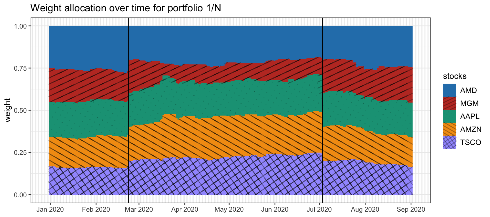
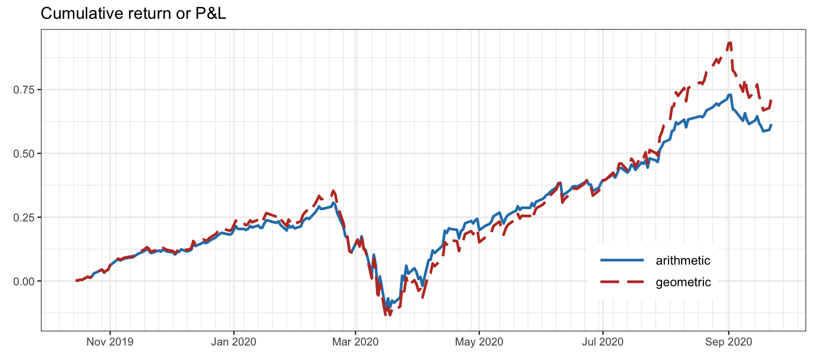
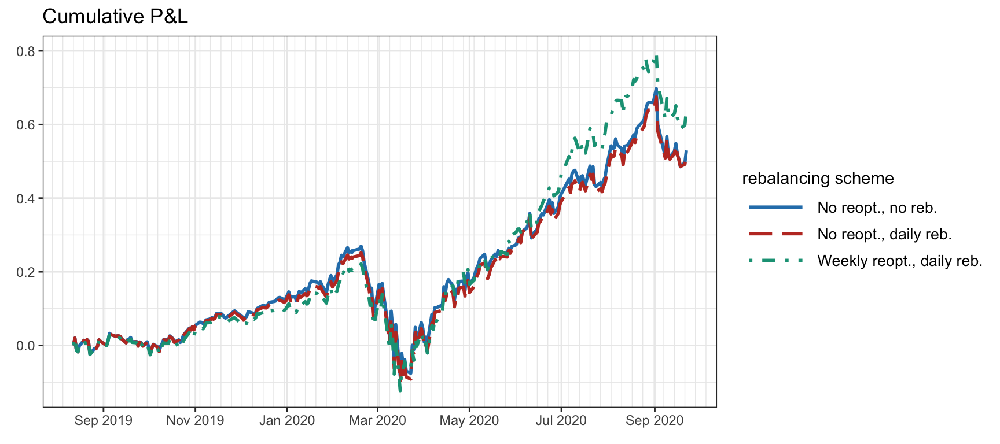
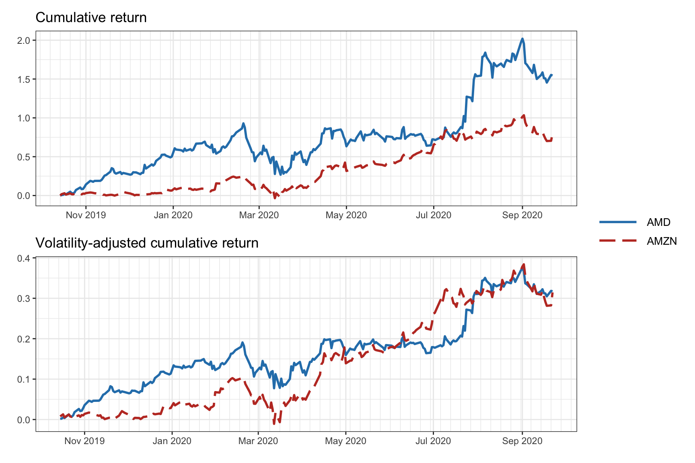
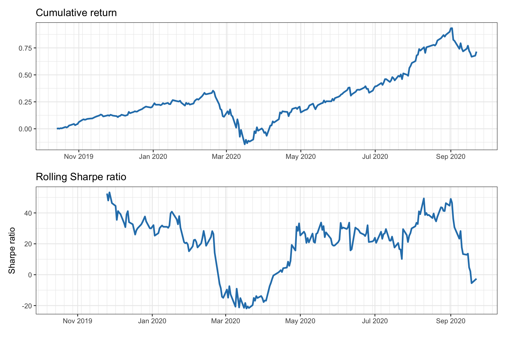
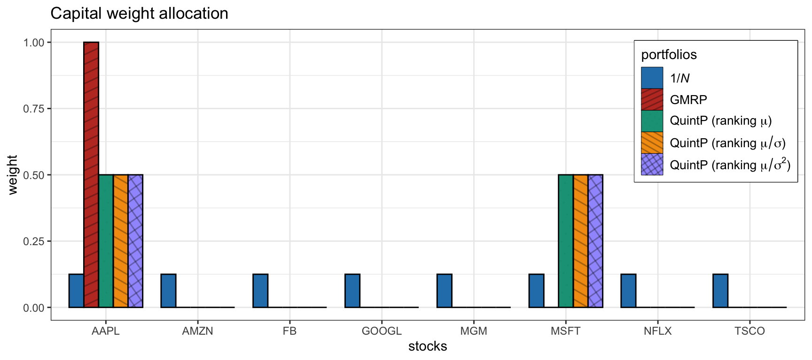
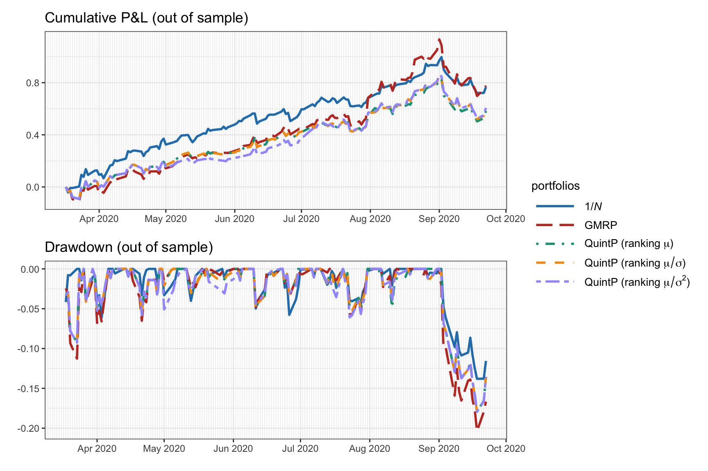
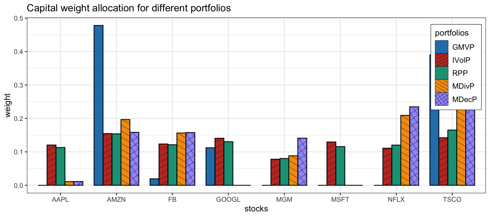
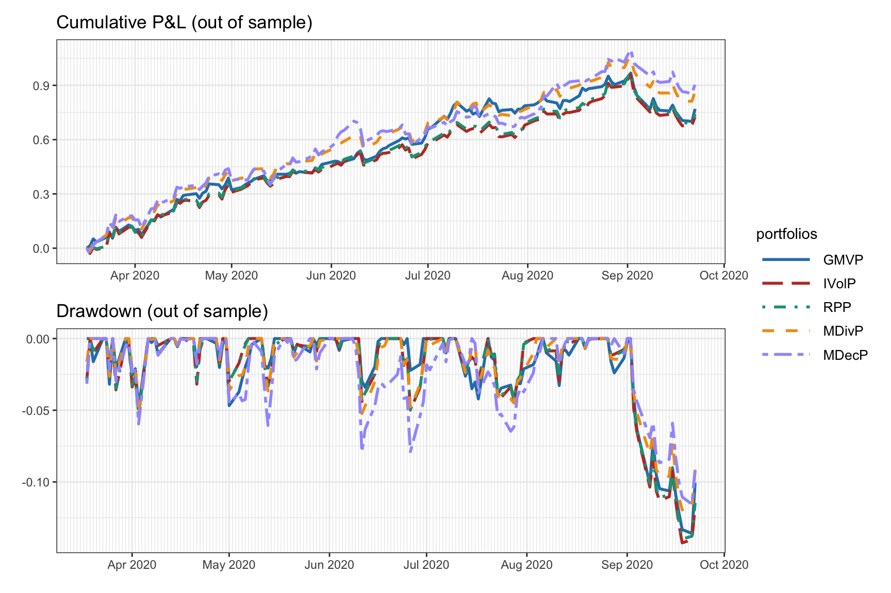

# Portfolio Basics {#portfolio-101}

> It is not the man who has too little, but the man who craves more, that is poor.
>
> --- Seneca, _Letters to Lucilius_

<!---
> "A successful man is one who can lay a firm foundation with the bricks others have thrown at him."
>
> --- David Brinkley
--->

\afterquotespace
\acknowledgementCUP

In this chapter, we introduce fundamental concepts related to portfolios, including the definition of portfolio weights and the notion of rebalancing. We also discuss common portfolio constraints and performance metrics, as well as a selection of prevalent heuristic and risk-based portfolios employed by practitioners. Examples of these portfolios include the equal-weighted $1/N$ portfolio, the quintile portfolio, and the global minimum variance portfolio.

  This material has been published as:
  Daniel P. Palomar (2025). _Portfolio Optimization: Theory and Application_. Cambridge University Press.
  This version is free to view and download for personal use only; not for re-distribution, re-sale, or use in derivative works. ©\ Daniel P. Palomar 2025.

## Fundamentals
### Data Modeling
Following Chapters\ \@ref(stylized-facts)--\@ref(time-series-modeling) on financial data modeling, we denote the prices of a universe of $N$ assets by $\bm{p}_t \in \R^N$, the _linear returns_ by
$$\bm{r}^{\textm{lin}}_t = \frac{\bm{p}_t - \bm{p}_{t-1}}{\bm{p}_{t-1}} = \frac{\bm{p}_t}{\bm{p}_{t-1}} - \bm{1},$$
where the division is elementwise (with some abuse of notation), and the _log-returns_ by 
$$\bm{r}^{\textm{log}}_t = \textm{log}\;\bm{p}_t - \textm{log}\;\bm{p}_{t-1},$$ where the time index $t$ can denote any arbitrary period such as minutes, hours, days, weeks, months, quarters, years, $\ldots$

The goal of the different financial data econometric models in Chapter\ \@ref(iid-modeling), for the i.i.d. case, and Chapter\ \@ref(time-series-modeling), for time series with temporal structure, is to form a forecast or model for the returns at time $t$ based on the previous historical data up to time $t-1$, denoted by $\mathcal{F}_{t-1}$. This modeling is typically done in terms of the conditional first- and second-order moments, that is, the conditional mean vector and covariance matrix:
$$
\begin{aligned}
\bmu^{\textm{log}}_{t}	  &\triangleq \E\left[\bm{r}^{\textm{log}}_{t} \mid \mathcal{F}_{t-1}\right],\\
\bSigma^{\textm{log}}_{t}	&\triangleq \textm{Cov}\left[\bm{r}^{\textm{log}}_{t} \mid \mathcal{F}_{t-1}\right] = \E\left[\left(\bm{r}^{\textm{log}}_{t}-\bmu^{\textm{log}}_{t})(\bm{r}^{\textm{log}}_{t}-\bmu^{\textm{log}}_{t}\right)^\T \mid \mathcal{F}_{t-1}\right].
\end{aligned}
$$

We remark that the majority of financial data models refer to the log-returns and not to the linear returns; for example, the random walk model for the log-prices in Chapter\ \@ref(iid-modeling). However, to compute the return of a portfolio, from which its performance can be derived, it is the linear returns of the assets that are needed. This seems to create an impasse: we prefer to model the log-returns but what is really needed is the model of the linear returns. 

In practice, since linear returns are very close to log-returns, $\bm{r}^{\textm{lin}}_t \approx \bm{r}^{\textm{log}}_t$, for small values of the returns (see Chapter\ \@ref(stylized-facts)), most practitioners and academics simply use the following approximation and otherwise ignore the distinction between log- and linear returns:
$$
\begin{aligned}
\bmu^{\textm{lin}}_{t} &\approx \bmu^{\textm{log}}_{t},\\
\bSigma^{\textm{lin}}_{t} &\approx \bSigma^{\textm{log}}_{t}.
\end{aligned}
$$
Mathematically, using the relationship between log-returns and linear returns, $\bm{r}^{\textm{log}}_t = \textm{log}\big(\bm{1} + \bm{r}^{\textm{lin}}_t\big)$, or, equivalently, $\bm{r}^{\textm{lin}}_t = \textm{exp}\big(\bm{r}^{\textm{log}}_t\big) - \bm{1}$, it follows that the mean vector and covariance matrix of the linear returns can be obtained from those of the log-returns as
$$
\begin{aligned}
\bmu^{\textm{lin}}_{t} &= \textm{exp}\left(\bmu^{\textm{log}}_t + \frac{1}{2}\textm{diag}\left(\bSigma^{\textm{log}}_t\right)\right) - \bm{1},\\
\left[\bSigma^{\textm{lin}}_{t}\right]_{ij} &= \left(\textm{exp}\left(\left[\bSigma^{\textm{log}}_{t}\right]_{ij}\right) - 1\right) \times\\
 & \qquad\textm{exp}\left(\left[\bmu^{\textm{log}}_t\right]_i + \left[\bmu^{\textm{log}}_t\right]_j + \frac{1}{2}\left(\left[\bSigma^{\textm{log}}_{t}\right]_{ii} + \left[\bSigma^{\textm{log}}_{t}\right]_{jj}\right)\right).
\end{aligned}
$$
However, due to the inherent noise in the estimation of the mean and covariance matrix, it is not clear that these more mathematically exact approximations give a practical advantage.

For the sake of notation, in the rest of the chapter we will drop the time dependency of the first- and second-order moments. In fact, in many cases the adopted econometric model is the i.i.d. one (see Chapter\ \@ref(iid-modeling)), which assumes no time dependency. In addition, we will refer to the linear moments by default:
$$
\begin{aligned}
\bmu    &= \bmu^{\textm{lin}}_{t},\\
\bSigma &= \bSigma^{\textm{lin}}_{t}.
\end{aligned}
$$

### Portfolio Return and Net Asset Value (NAV) {#portfolio-NAV}
A _portfolio_ is simply an allocation of the available budget among $N$ risky assets (the amount not invested is kept as cash). The most common way to define a portfolio at time $t$ is via its _dollar allocation_[^dollar-amount] or _capital allocation_ $\w^\textm{cap}_t\in\R^N,$ where $w^\textm{cap}_{i,t}$ denotes the dollar or capital amount allocated to the $i$th asset. Typically we denote the cash as a separate scalar $c^\textm{cap}_t\in\R,$ although it is also possible to include it as part of the portfolio vector $\w^\textm{cap}_t$ by considering it as one extra riskless asset (however, that would produce a singular covariance matrix, which may lead to numerical issues in the optimization part). Another way to represent a portfolio is via the number of units held for the assets $\w^\textm{units}_t\in\R^N$; for example, in the case of a stock, a unit represents a share of a company and, in the case of a cryptocurrency, it represents a coin amount.

[^dollar-amount]: The term "dollar" is an abuse of terminology and it can, of course, refer to any currency, such as the Euro, or even a cryptocurrency, such as Bitcoin.

It is important to realize that if the unit amount is kept constant over time, $\w_t^\textm{units}=\w^\textm{units}$, then the dollar amount will change as the prices of the assets change: $\w^\textm{cap}_t = \w^\textm{units} \odot \bm{p}_t$.[^notation-vector-prod-div] To be exact, the change in the portfolio is
\begin{equation}
  \w^\textm{cap}_t = \w^\textm{cap}_{t-1} \odot \left(\bm{p}_t\oslash\bm{p}_{t-1}\right) = \w^\textm{cap}_{t-1} \odot \left(\bm{1} + \bm{r}^{\textm{lin}}_t\right),
  (\#eq:wt-evol)
\end{equation}
while the cash remains constant, $c^\textm{cap}_t = c^\textm{cap}_{t-1}$, unless there is some cash contribution or withdrawal (negative contribution), in which case it would have to be reflected as $c^\textm{cap}_t = c^\textm{cap}_{t-1} + \textm{contribution}_{t-1}$. If a fixed dollar amount over time is desired, $\w^\textm{cap}_t = \w^\textm{cap}$, then the portfolio has to be regularly _rebalanced_, that is, the components of $\w^\textm{cap}_t$ have to be adjusted (by buying or selling the assets) to bring them back to the originally designed positions, incurring in transaction costs. Figure\ \@ref(fig:w-rebalancing) illustrates the change of the $1/N$ portfolio over time until a rebalance is executed.

[^notation-vector-prod-div]: For convenience of notation, we denote the elementwise product between vectors by $\odot$ and elementwise division by $\oslash$.

(\#fig:w-rebalancing)Evolution of the $1/N$ portfolio over time with effect of rebalancing (vertical lines).

#### NAV and Return {-}
\index{net asset value (NAV)}
The portfolio _net asset value_ (NAV), commonly referred to as _wealth_, is defined as the value of the portfolio at the current market valuation including cash:
\begin{equation}
  \textm{NAV}_t \triangleq \bm{1}^\T\w^\textm{cap}_t + c^\textm{cap}_t.
  (\#eq:def-NAV)
\end{equation}
Plugging the portfolio time evolution \@ref(eq:wt-evol) into \@ref(eq:def-NAV) gives the NAV evolution
\begin{equation}
  \begin{aligned}[b]
  \textm{NAV}_t &= \bm{1}^\T\w^\textm{cap}_t + c^\textm{cap}_t\\
  &= \bm{1}^\T\left(\w^\textm{cap}_{t-1}  \odot \left(\bm{1} + \bm{r}^{\textm{lin}}_t\right)\right) + c^\textm{cap}_{t-1}\\
  &= \textm{NAV}_{t-1} + \left(\w^{\textm{cap}}_{t-1}\right)^\T\bm{r}^{\textm{lin}}_t,
  \end{aligned}
  (\#eq:NAV-evolution)
\end{equation}
which indicates that the change in NAV depends on the assets' returns and the portfolio via the term $\big(\w^{\textm{cap}}_{t-1}\big)^\T\bm{r}^{\textm{lin}}_t$.

The _portfolio return_ is then[^portfolio-return-with-contribution]
\begin{equation}
  R^\textm{portf}_t \triangleq \frac{\textm{NAV}_t - \textm{NAV}_{t-1}}{\textm{NAV}_{t-1}} = \w_{t-1}^\T\bm{r}^{\textm{lin}}_t,
  (\#eq:portfolio-return)
\end{equation}
where 
\begin{equation}
  \w_{t} = \w^\textm{cap}_{t}/\textm{NAV}_{t}
  (\#eq:normalized-portfolio)
\end{equation}
is the normalized portfolio with respect to the current NAV. In portfolio design or portfolio optimization, it is precisely the normalized version $\w_{t}$ that is obtained. The expression $\w_{t-1}^\T\bm{r}^{\textm{lin}}_t$ in \@ref(eq:portfolio-return) explains what is commonly referred to as the _asset additivity property_ of the linear returns (as opposed to the _time additivity property_ of the log-returns). Figure\ \@ref(fig:return-NAV) shows the return and NAV of a portfolio over time.

[^portfolio-return-with-contribution]: Note that if there have been cash constributions, they have to be removed in the computation of the portfolio return: $R^\textm{portf}_t \triangleq (\textm{NAV}_t - \textm{NAV}_{t-1}  - \textm{contribution}_{t-1})/\textm{NAV}_{t-1} = \w_{t-1}^\T\bm{r}^{\textm{lin}}_t$.

(\#fig:return-NAV)Return and NAV of the $1/N$ portfolio over time.

Care has to be taken with the definition and implication of the time index, as illustrated in Figure\ \@ref(fig:portfolio-time-notation-simple). The portfolio at time $t$ is $\w_t$, which has used information up to time $t-1$ (since that is the information used to estimate the moments $\bmu_t$ and $\bSigma_t$) and executed at time $t$.[^instantaneous-execution] At this point, one might be tempted to obtain the return of the portfolio by multiplying the portfolio $\w_t$ by the return at the same period $\bm{r}^{\textm{lin}}_t$, but this would be incorrect as it would incur a look-ahead bias (refer to Chapter\ \@ref(backtesting) for the dangers of backtesting). Since $\w_t$ is the portfolio executed and held at time $t$, with prices $\bm{p}_t$, its return can be computed upon observing the prices $\bm{p}_{t+1}$, that is, as $\w_{t}^\T\bm{r}^{\textm{lin}}_{t+1}.$ Note that some authors instead define the returns with a shift in the time index so that $\bm{p}_t$ can be multiplied by $\bm{r}^{\textm{lin}}_{t}$.

[^instantaneous-execution]: It could be argued that it might be possible to execute the portfolio instantaneously after observing the data at time $t-1$, although that would imply an instantaneous (or sufficiently fast) forecast, portfolio design, and market execution.

(\#fig:portfolio-time-notation-simple)Portfolio notation over time periods.

The first- and second-order moments of the portfolio return are key quantities in portfolio optimization. For a given portfolio, the expected value and variance of the portfolio return in \@ref(eq:portfolio-return) are given by
$$
\begin{aligned}
\E\left[R^\textm{portf}_t\right] &= \w_{t-1}^\T\bmu,\\
\textm{Var}\left[R^\textm{portf}_t\right] &= \w_{t-1}^\T\bSigma\w_{t-1}.
\end{aligned}
$$

### Cumulative Return {#cum-PnL}
\index{cumulative return}
\index{return!cumulative return}
\index{cumulative P\&L}
The portfolio return at each given time $t$ is a key quantity for assessing the portfolio performance. However, it is also invaluable to compute the _cumulative return_ from inception to time $t$, also referred to as _cumulative profit and loss_ (P&L).

Essentially, the cumulative return is equivalent to the NAV (or wealth), except that it is normalized and the initial NAV (or budget) is subtracted as $\textm{NAV}_t/\textm{NAV}_0 - 1$ (also, it does not account for contributions or redemptions related to the strategy). A plot of the cumulative return over time should start at zero, whereas a plot of the NAV or portfolio wealth starts at 1 (assuming it is normalized).

It is important to note that the cumulative return and NAV not only depend on the portfolio design at each period but also on the budget invested at each period (while some of the budget may remain as cash reserves). The amount of capital invested is often called _position size_. We now consider two extreme cases: full reinvesting and constant reinvesting.

- _Full reinvesting_: Suppose we design a normalized portfolio $\w_t$ and we fully reinvest the current NAV: $\w^\textm{cap}_t = \textm{NAV}_{t}\times\w_t$. Then, the NAV evolution in \@ref(eq:NAV-evolution) leads to 
$$
\textm{NAV}_t = \textm{NAV}_{t-1} + \textm{NAV}_{t-1}\times\w_{t-1}^\T\bm{r}^{\textm{lin}}_t = \textm{NAV}_{t-1} \times \left(1 + R^\textm{portf}_t\right),
$$
which corresponds to a _geometric growth_:
\begin{equation}
  \textm{NAV}_t = \textm{NAV}_{0} \times \left(1 + R^\textm{portf}_1\right) \times \left(1 + R^\textm{portf}_2\right) \times \dots \times    \left(1 + R^\textm{portf}_t\right).
  (\#eq:NAV-geometric)
\end{equation}

- _Constant reinvesting_: Now, suppose we design the same normalized portfolio $\w_t$ but we keep reinvesting the same initial NAV: $\w^\textm{cap}_t = \textm{NAV}_{0}\times\w_t$. Then, the NAV evolution in \@ref(eq:NAV-evolution) leads to 
$$
\textm{NAV}_t = \textm{NAV}_{t-1} + \textm{NAV}_{0}\times\w_{t-1}^\T\bm{r}^{\textm{lin}}_t = \textm{NAV}_{t-1} + \textm{NAV}_{0}\times R^\textm{portf}_t,
$$
which corresponds to an _arithmetic growth_:
\begin{equation}
  \textm{NAV}_t = \textm{NAV}_{0} \times \left(1 + R^\textm{portf}_1 + R^\textm{portf}_2 + \dots + R^\textm{portf}_t\right).
  (\#eq:NAV-arithmetic)
\end{equation}

Figure\ \@ref(fig:NAV-arithmetic-vs-geometric) illustrates the difference between arithmetic and geometric cumulative returns: the shape of the curves is similar except that the swings are bigger for the geometric case. As previously mentioned, these curves start at 1, so strictly speaking they refer to the normalized NAV or wealth, while the cumulative returns should be shifted down to 0. This abuse of notation is understood in the financial context and no further comment or distinction will be made.

(\#fig:NAV-arithmetic-vs-geometric)Comparison of arithmetic and geometric cumulative returns.

### Transaction Costs {#transaction-cost}
\index{transaction costs}
\index{portfolios!transaction costs}

Every financial trade has an associated cost, called the _transaction cost_, that will diminish the overall return of the investment. Transaction costs consists of two terms: _commission fee_ and _slippage_. The commission fee is the payment we make to our broker for completing the transaction. There is no universal scheme for commission fees: it depends on the country and the specific broker. For example, the U.S. in general has lower commission fees than European and Asian countries. Slippage refers to the difference between the expected price of a trade and the price at which the trade is actually executed. It does not directly refer to a negative or positive movement, as any change between the expected and actual prices can qualify. In general, liquid[^liquidity] assets have smaller slippage than illiquid assets.

[^liquidity]: Liquidity refers to the efficiency or ease with which an asset or security can be converted into ready cash without affecting its market price. The most liquid asset of all is cash itself.

Suppose the current portfolio $\w^\textm{cap}_t$ is rebalanced to $\w^{\textm{cap},\textm{reb}}_t$. Then the portfolio NAV will decrease by the transaction cost, denoted by $\phi\big(\w^\textm{cap}_t \rightarrow \w^{\textm{cap},\textm{reb}}_t\big)$. The notation details of the NAV computation may differ depending on whether the transaction cost is accounted after the price change or before. Calculating the NAV after the rebalancing and the price change, equation \@ref(eq:wt-evol) is modified to
$$
\begin{aligned}
\textm{NAV}_t 
&= \bm{1}^\T\w^{\textm{cap}}_t + c^{\textm{cap}}_t\\
&= \bm{1}^\T\left(\w^{\textm{cap},\textm{reb}}_{t-1} \odot \left(\bm{1} + \bm{r}^{\textm{lin}}_t\right)\right) + c^{\textm{cap},\textm{reb}}_{t-1} - \phi\left(\w^{\textm{cap}}_{t-1} \rightarrow \w^{\textm{cap},\textm{reb}}_{t-1}\right)\\
&= \textm{NAV}_{t-1} + \big(\w^{\textm{cap},\textm{reb}}_{t-1}\big)^\T\bm{r}^{\textm{lin}}_t - \phi\left(\w^{\textm{cap}}_{t-1} \rightarrow \w^{\textm{cap},\textm{reb}}_{t-1}\right),
\end{aligned}
$$
with the portfolio return then given by
$$
R^\textm{portf}_t = \big(\w_{t-1}^{\textm{reb}}\big)^\T\bm{r}^{\textm{lin}}_t - \phi\left(\w_{t-1} \rightarrow \w_{t-1}^\textm{reb}\right),
$$
where the first term corresponds to the return due to the change of prices and the second term is the penalty due to transaction costs. Figure\ \@ref(fig:effect-tc) shows the effect of transaction costs with daily rebalancing and 90 basis points (bps)[^bps] of fees.

[^bps]: Basis points, denoted by bps, represents a factor of $10^{-4}$. For example, 16 bps means 0.0016 or 0.16%.

The expected value and variance of the portfolio return in this case are given by
$$
\begin{aligned}
\E\left[R^\textm{portf}_t\right] &= \left(\w^\textm{reb}_{t-1}\right)^\T\bmu - \phi\left(\w_{t-1} \rightarrow \w_{t-1}^\textm{reb}\right),\\
\textm{Var}\left[R^\textm{portf}_t\right] &= \left(\w^\textm{reb}_{t-1}\right)^\T\bSigma\w^\textm{reb}_{t-1}.
\end{aligned}
$$

(\#fig:effect-tc)Effect of transaction costs on the NAV (with daily rebalancing and 90 bps of fees).

Let us focus on the form of the transaction cost function, which can be decomposed into fees and slippage:
$$
\phi\left(\w_{t} \rightarrow \w_{t}^\textm{reb}\right) = \phi^\textm{fees}\left(\w_{t} \rightarrow \w_{t}^\textm{reb}\right) + \phi^\textm{slippage}\left(\w_{t} \rightarrow \w_{t}^\textm{reb}\right).
$$
<!---Since the orders for each of the $N$ assets are executed separately, we have
$$
\phi\left(\w_{t} \rightarrow \w_{t}^\textm{reb}\right) = \sum_{i=1}^N \phi\left(w_{it} \rightarrow w_{it}^\textm{reb}\right).
$$--->

The details of $\phi^\textm{fees}(\cdot)$ depend on the specific broker, but it can be approximated as being proportional to the turnover, $\|\w_{t}^\textm{reb} - \w_{t}\|_1 = \sum_{i=1}^N |w_{it}^\textm{reb} - w_{it}|$, leading to
$$
\phi^\textm{fees}\left(\w_{t} \rightarrow \w_{t}^\textm{reb}\right) \approx \tau^\textm{fee}\|\w_{t}^\textm{reb} - \w_{t}\|_1,
$$
where the fee factor $\tau^\textm{fee}$ is typically around $1--30$ bps. Keep in mind that some brokers include a minimum cost and may also have calculations based on shares instead of dollar amount.[^IB-fees]

[^IB-fees]: Fees of popular broker dealer Interactive Brokers: [www.interactivebrokers.com](https://www.interactivebrokers.com/en/index.php?f=commission&p=stocks)

Let us consider the costs due to slippage, $\phi^\textm{slippage}\left(\w_{t} \rightarrow \w_{t}^\textm{reb}\right)$. Slippage can also be approximated as proportional to the turnover (assuming that the liquidity is enough to absorb the order executed, otherwise it can significantly increase due to market impact), but the slippage will be different for each asset: 
$$
\phi^\textm{slippage}\left(\w_{t} \rightarrow \w_{t}^\textm{reb}\right) \approx \sum_{i=1}^N \tau_i^\textm{slippage}|w_{it}^\textm{reb} - w_{it}|,
$$
where $\tau_i^\textm{slippage}$ is the asset-dependent slippage factor. In practice, the slippage factor can be estimated from the bid--ask spread of an asset. Although one can find various models to estimate slippage, a simple one is the following:
$$
\tau^\textm{slippage} = \frac{\textm{half of spread}}{\textm{middle of spread}} 
= \frac{0.5(\textm{bid} - \textm{ask})}{0.5(\textm{bid} + \textm{ask})}
= \frac{\textm{bid} - \textm{ask}}{\textm{bid} + \textm{ask}}.
$$

When assessing the performance of a portfolio via backtests, it is recommended to account for transaction costs to get a more realistic result, as shown in Figure\ \@ref(fig:effect-tc). Since the transaction costs depend on the turnover, it also important to monitor the turnover of the strategy or related measures such as return on turnover.

### Portfolio Rebalancing {#portfolio-rebalancing}
\index{portfolios!portfolio rebalancing}
\index{portfolio rebalancing|see{portfolios}}
Since rebalancing a portfolio entails transaction costs, there is a fundamental trade-off: we should rebalance the portfolio frequently (so as to match the currently held portfolio in the market with the desired one) but not that frequently in order to keep the transaction costs low.

The simplest way to rebalance a portfolio is with a regular calendar-based scheme, such as daily, weekly, or monthly rebalancing. There are other rebalancing schemes that decide whether to rebalance in an adaptive fashion; for example, rebalance $\w_{t} \rightarrow \w_{t}^\textm{reb}$ only if their distance is above some small threshold, which is used to ignore unnecessary rebalancing due to errors in the estimation and portfolio design process. Some common ways to measure the difference between portfolios include the turnover $\|\w_{t}^\textm{reb} - \w_{t}\|_1$ or some measure of statistical difference such as the squared Mahalanobis distance $(\w_{t}^\textm{reb} - \w_{t})^\T\bSigma^{-1}(\w_{t}^\textm{reb} - \w_{t})$ [@Scherer2002] or the tracking error squared distance $(\w_{t}^\textm{reb} - \w_{t})^\T\bSigma(\w_{t}^\textm{reb} - \w_{t})$ widely used in asset management [@MichaudMichaud2008], where $\bSigma$ denotes the covariance matrix of the assets. At the same time, the turnover $\|\w_{t}^\textm{reb} - \w_{t}\|_1$ is typically upper-bounded or penalized in the portfolio design process to avoid frequent and large rebalancing.

The portfolio time-index notation illustrated in Figure\ \@ref(fig:portfolio-time-notation-simple) does not take into account the portfolio rebalancing process. To properly reflect that, the notation necessarily becomes more involved. A common way is to refine the notation by considering that each period $t$ can be divided into the beginning of period (bop) and the end of period (eop); for example, the portfolio $\w_{t}$ can be more finely separated into $\w^\textm{bop}_{t}$ and $\w^\textm{eop}_{t}$, as shown in Figure\ \@ref(fig:portfolio-time-notation-detailed).

(\#fig:portfolio-time-notation-detailed)Portfolio notation over time periods with rebalancing.

According to this notation, the change from $\w^\textm{bop}_{t}$ to $\w^\textm{eop}_{t}$ is due to the price change as in \@ref(eq:wt-evol),
$$
\w^\textm{eop}_{t} = \w^\textm{bop}_{t} \odot \left(\bm{1} + \bm{r}^{\textm{lin}}_t\right),
$$
and the change from $\w^\textm{eop}_{t}$ to $\w^\textm{bop}_{t+1}$ is due to the rebalancing which incurs a transaction cost (if there is no rebalancing, then simply $\w^\textm{bop}_{t+1}=\w^\textm{eop}_{t}$). For example, suppose that we rebalance a fixed portfolio $\w$ at each period $t$ and ignore the transaction cost; then, the portfolio after rebalancing is $\w^\textm{bop}_{t}=\w$, after the prices change it becomes
$\w^\textm{eop}_{t} = \w^\textm{bop}_{t} \odot \left(\bm{1} + \bm{r}^{\textm{lin}}_t\right)$, and the portfolio return from \@ref(eq:portfolio-return) is
\begin{equation}
  R^\textm{portf}_t = \w^\T\bm{r}^{\textm{lin}}_t.
  (\#eq:fixed-portfolio-return)
\end{equation}

Figure\ \@ref(fig:PnL-rebalancing-schemes) illustrates the effect of different reoptimization and rebalancing schemes with transaction costs of 20 bps (rebalancing refers to executing the desired portfolio in the market, whereas reoptimization refers to collecting new data, estimating the mean and covariance matrix, and solving an optimization problem to design a new portfolio).

(\#fig:PnL-rebalancing-schemes)Backtest cumulative P\&L of a portfolio with different reoptimization and rebalancing schemes.

## Portfolio Constraints {#portfolio-constraints}
We now briefly describe the most commonly used constraints in portfolio design or optimization. Some constraints are imposed by the regulators or brokers (like shorting constraints, leverage constraints, and margin requirements), while others are optional depending on the investor's views (such as being market neutral or controlling the portfolio sparsity level or even enforcing diversity). For simplicity of notation, in the following we omit the time dependency and express a variety of constraints in terms of the (normalized) portfolio $\w$ defined in \@ref(eq:normalized-portfolio). It is important to recognize whether the constraints are convex, as that means that they can be efficiently handled later in the optimization process (see Appendix\ \@ref(convex-optimization)).
\index{portfolio constraints}
\index{portfolios!constraints|see{portfolio constraints}}

### Long-Only or No-Shorting Constraint
\index{portfolio constraints!long-only}
\index{portfolio constraints!no-shorting}
In financial markets, an investor or trader typically buys stocks taking what is called _long positions_. Interestingly, in some financial markets, a broker may allow the investor to _short sell_ or _short_ some stocks (i.e., to borrow some shares and sell them, with the commitment of buying them back later) for a corresponding borrowing fee. This means that the corresponding elements of $\w$ can be negative.

If shorting is not allowed, the constraint is 
$$\w \geq \bm{0},$$
which is linear and, hence, convex.

### Capital Budget Constraint
\index{portfolio constraints!capital budget}
Assuming no shorting and no other kind of leverage, the portfolio must satisfy the budget constraint
$$\bm{1}^\T\w + c	= 1,$$
which is linear and, hence, convex.

Alternatively, it can be rewritten without the cash variable as
$$\bm{1}^\T\w \leq 1.$$
If, instead, equality is imposed, the implication is that the cash is zero so that the portfolio is fully invested in the risky assets.

In practice, this constraint needs to be used in conjunction with some other constraint such as a no-shorting constraint or leverage constraint. Otherwise the positions may be unbounded resulting in unrealistic large positions.

### Holding Constraints
\index{portfolio constraints!holding}
Practitioners always set limits on maximum positions to avoid overexposure and ensure diversification, that is, upper bounds $\bm{u}$ on the portfolio elements. On occasions, they may also have minimum positions if they are sure they want to hold certain assets, that is, lower bounds $\bm{l}$.

Thus, holding constraints are imposed via lower and upper bounds:
$$\bm{l}\leq\w\leq\bm{u},$$
which are linear and, hence, convex.

### Cardinality Constraint
\index{portfolio constraints!cardinality}
While the universe of assets may be large (say 500 stocks), an investor typically wants to limit the number of active positions (i.e., positions with nonzero allocations) to simplify the logistics of the operation and reduce the rebalancing.

Limiting the number of active positions to $K$ is mathematically equivalent to placing an upper bound on the cardinality of the portfolio vector:
$$\|\w\|_0\leq K,$$
where $\|\cdot\|_0$ is the cardinality operator or $\ell_0$-pseudo-norm (which counts the number of nonzero elements). This constraint is nonconvex and, therefore, difficult to handle.

### Turnover Constraint
\index{portfolio constraints!turnover}
As discussed in Section\ \@ref(portfolio-NAV), transaction costs are approximately proportional to the turnover. Therefore, it makes sense to control the turnover when designing the portfolio.

Suppose the currently held portfolio is $\w_0$. Then the turnover constraint is of the form
$$\|\w - \w_0\|_1\leq u,$$
where $u$ denotes the maximum turnover allowed. This constraint is convex because norms are convex functions (see Appendix\ \@ref(convex-optimization)).

### Market-Neutral constraint
\index{portfolio constraints!market neutral}
According to factor modeling with the market as the single factor, the returns can be expressed as $\bm{r}_t = \bm{\alpha} + \bm{\beta}\cdot r_t^\textm{mkt} + \bm{\epsilon}_t$ (see Chapter\ \@ref(iid-modeling) for details).

Portfolio managers typically want to avoid exposure to the market, which means that they want the portfolio orthogonal to the "beta":
$$\bm{\beta}^\T\w = \bm{0},$$
which is linear and, hence, convex.

### Dollar-Neutral Constraint
\index{portfolio constraints!dollar neutral}
When shorting is allowed, one may want to balance the long and short positions in what is called a dollar-neutral position:
$$\bm{1}^\T\w = \bm{0}.$$

In practice, the dollar-neutral constraint should be used in conjunction with some leverage constraint. Some academic papers and capital asset pricing models assume, in effect, that one can sell a security short without limit and use the proceeds to buy securities long. This is a mathematically convenient assumption for hypothetical models of the economy, but it is unrealistic [@JacobsLevyMarkowitz2005]. 

### Diversification Constraint
\index{portfolio constraints!diversification}
Some portfolio designs tend to concentrate the allocation in a few assets. The quantity $\|\w\|_2^2=\w^\T\w =\sum_{i=1}^N w_i^2$ can be used as a diversification measure [@GoetzmannKumar2008; @DeMiguelGarlappiNogalesUppal2009]. In fact, the quantity $\|\w\|_2^2$ is the Herfindahl index of the weights of the portfolio. A lower value is indicative of a higher level of diversification; it is lower-bounded by $1/N$ and upper-bounded by $1$. Therefore, one can promote diversification with the constraint:
$$\|\w\|_2^2\leq D,$$
where $1/N \leq D<1$. This constraint is convex because norms are convex functions (see Appendix\ \@ref(convex-optimization)).

### Leverage Constraint
\index{portfolio constraints!leverage}
Regulations in countries typically limit the amount that can be borrowed for long and short positions. For example, in the U.S., the Federal Reserve System established Regulation T (Reg T) that limits the borrowing to be no greater than 50% of the securities purchase price. The 50% requirement is called the initial margin, but certain brokers may have stricter requirements.

The total amount of long and short positions can be measured with the $\ell_1$-norm $\|\w\|_1=\sum_{i=1}^N |w_i|$ and the leverage constraint can be written mathematically as
$$\|\w\|_1\leq 2,$$
where the factor of 2 indicates that 50% is being borrowed.

### Margin Requirements
\index{portfolio constraints!margin}
When borrowing is involved, apart from the leverage constraints imposed by regulators such as Reg T, brokers will impose margin requirements to reserve collateral[^collateral] and ensure that the borrower can pay back the loan later.

[^collateral]: The term collateral refers to an asset that a lender accepts as security for a loan. The collateral acts as a form of protection for the lender. That is, if the borrower defaults on their loan payments, the lender can seize the collateral and sell it to recoup some or all of its losses.

The capital budget constraint $\bm{1}^\T\w \leq 1$ cannot be used in isolation when borrowing is involved since it would imply that an investor can use all the cash from short-selling to buy stocks, which is not the case in real life [@JacobsLevyMarkowitz2005]. 

The broker will impose margin requirements in both long and short positions. For a long position, the broker may allow borrowing, say, 50% of the value of the position. For short positions, by definition the investor is borrowing stocks; the cash from short-selling is controlled by the broker as cash collateral but one is also required to have some equity as the “initial margin” to establish the positions; usually the overall collateral is about 105%.

It is convenient to separate the positions of the portfolio into longs and shorts: 
$$\w = \w^+ - \w^-,$$
where $\w^+ \ge \bm{0}$ denotes the longs and $\w^- \ge \bm{0}$ the shorts. The margin requirement can then be expressed as
$$
m^\textm{long}\times\bm{1}^\T\w^+ + m^\textm{short}\times\bm{1}^\T\w^- \leq 1,
$$
where $m^\textm{long}$ and $m^\textm{short}$ control how much margin is required for longs and shorts, respectively. For example, a broker may impose $m^\textm{long}=0.5$ and $m^\textm{short}=0.05$.

## Performance Measures {#performance-measures}
There are many ways to assess the performance of a portfolio. The key quantity in most of the performance measures is the portfolio return over time \@ref(eq:portfolio-return), which for the case of a fixed portfolio $\w$ can be written as in \@ref(eq:fixed-portfolio-return): $R^\textm{portf}_t = \w^\T\bm{r}_t$ (for the sake of notation we use $\bm{r}_t$ to denote the linear returns $\bm{r}^{\textm{lin}}_t$). We now list the most commonly used performance measures; for a detailed and extensive treatment, see @Bacon2008.
\index{portfolio performance measures}
\index{portfolio risk measures|see{portfolio performance measures}}
\index{portfolios!performance measures|see{portfolio performance measures}}
\index{portfolios!risk measures|see{portfolio performance measures}}

### Expected Return {#expected-return}
\index{portfolio performance measures!expected return}
The expected return of the portfolio is simply given by
$$\E\left[R_t^\textm{portf}\right] = \w^\T\bmu,$$
which is actually the expected return over one period $t$. This measure quantifies the average benefit of the investment but ignores the risk.

In most cases, however, it is the _annualized return_ that is reported. This simply requires scaling with a factor equal to the number of periods over a year, $\gamma$, leading to
$$\textm{Annualized Return} = \gamma\times\w^\T\bmu.$$

Suppose the periods are days (i.e., daily prices); if we trade on the stock market then $\gamma=252$ is typically the number of tradable days per year (excluding weekends and holidays, which depend on the country), whereas on cryptocurrency markets $\gamma=365$ since they operate nonstop. Suppose now that the periods are hours (i.e., hourly prices); then the scaling factor in cryptocurrency markets would be $\gamma=365\times24=8760$ (in stock markets it really depends on the country, since the hours per day differ and range from 5 to 9).

Given a sequence of $T$ portfolio returns, the annualized return can be computed via the sample mean,
$$
\frac{\gamma}{T}\sum_{t=1}^T R_t^\textm{portf},
$$
which implicitly assumes the use of arithmetic chaining to aggregate the returns. If, instead, one uses a geometric chaining to take into account compounding, the geometric mean should be used:
$$
\left(\prod_{t=1}^T \left(1 + R_t^\textm{portf}\right)\right)^{\gamma/T} - 1,
$$
which is also termed _compound annual growth rate_ (CAGR). Note that the geometric mean is always smaller than the arithmetic mean (i.e., with $\gamma=1$); however, once the annualization with the factor $\gamma$ is included, nothing can be said anymore. For example, an arbitrary sequence of returns has arithmetic mean 0.0047 and geometric mean 0.0040, but after annualizing with $\gamma=100$ they become 0.47 and 0.49, respectively.

### Volatility
\index{portfolio performance measures!volatility}
The volatility is the standard deviation of the portfolio return:
$$\textm{Std}\left[R_t^\textm{portf}\right] = \sqrt{\w^\T\bSigma\w}.$$
It is the simplest measure of risk of a portfolio. For convenience, one may also use the square of the volatility, that is, the variance of the portfolio return, as used by Markowitz in his seminal paper [@Markowitz1952].

To obtain the annualized volatility we need to multiply by the square root of the number of periods per year $\gamma$:
$$\textm{Annualized Volatility} = \sqrt{\gamma}\times\sqrt{\w^\T\bSigma\w}.$$

### Volatility-Adjusted Returns
\index{portfolio performance measures!volatility-adjusted returns}
Comparing portfolios by looking at the cumulative returns may be misleading since each portfolio may have a different volatility, since it is expected that a higher-volatility portfolio will also have a higher cumulative return (assuming a bull market). To get rid of this volatility artifact when comparing portfolios, some practitioners<!---, instead of using the portfolio returns $R^\textm{portf}_t = \w^\T\bm{r}_t$,---> prefer to use the volatility-adjusted returns defined as
$$
\bar{R}^\textm{portf}_t = \w^\T\bm{r}_t \times \frac{\sigma^\textm{target}}{\sigma_t},
$$
where $\sigma_t$ denotes the volatility of $\w^\T\bm{r}_t$ and $\sigma^\textm{target}$ is the desired target volatility for the portfolio.

Figure\ \@ref(fig:vol-adj-returns) compares the cumulative returns of two stocks (AMD and AMZN) with and without volatility adjustment. One can observe how from the non-adjusted version AMD may look better than AMZN, but this is misleading because it comes with much higher volatility. From the volatility-adjusted version, instead, it seems that AMZN has a better trade-off of final return and volatility. In fact, this trade-off is precisely captured by the Sharpe ratio described next.

(\#fig:vol-adj-returns)Cumulative returns and volatility-adjusted cumulative returns.

### Sharpe Ratio (SR) {#SR}
\index{portfolio performance measures!Sharpe ratio (SR)}
The _Sharpe ratio_ (SR) is the risk-adjusted expected excess return,
$$\textm{SR} = \frac{\w^\T\bmu - r_\textm{f}}{\sqrt{\w^\T\bSigma\w}},$$
where $r_\textm{f}$ is the risk-free rate (e.g., the interest rate on a three-month U.S. Treasury bill). It was proposed by William Sharpe in 1966 [@Sharpe1966]; see also @Sharpe1994.

Observe that the numerator is the excess return with respect to the risk-free rate; in practice, one may assume $r_\textm{f}\approx0$ and just use the expected return. Dividing by the risk gives the risk-adjusted return, that is, the return per unit of risk.

The annualized SR is
$$\textm{Annualized SR} = \sqrt{\gamma}\times\frac{\w^\T\bmu - r_\textm{f}}{\sqrt{\w^\T\bSigma\w}},$$
where $\gamma$ denotes the number of periods over a year as introduced in Section\ \@ref(expected-return).

For long periods of time, rather than simply computing the overall SR, it may be useful to compute the _rolling SR_, which is the time series of the SR over time computed on a rolling-window basis. Figure\ \@ref(fig:rolling-SR) shows the cumulative return and rolling annualized Sharpe ratio (with a rolling window of one month) of the $1/N$ portfolio with average Sharpe ratio of 1.65 over a universe of five stocks.

(\#fig:rolling-SR)Cumulative returns and rolling annualized Sharpe ratio.

Finally, it is worth mentioning that it is common among practitioners to use the compounded annualized return in the numerator of the Sharpe ratio  (i.e., using the geometric mean as previously mentioned in Section\ \@ref(expected-return)), often referred to as the _geometric Sharpe ratio_.

### Information Ratio (IR)
\index{portfolio performance measures!information ratio (IR)}
The Sharpe ratio uses the excess return in the numerator, that is, the portfolio return is compared or benchmarked against the return of the risk-free asset. The _information ratio_ (IR) instead uses an arbitrary benchmark, for example the market index:
$$\textm{IR} = \frac{\E\left[\w^\T\bm{r}_t - r_t^\textm{b}\right]}{\textm{Std}\left[\w^\T\bm{r}_t - r_t^\textm{b}\right]},$$
where $r_t^\textm{b}$ is the return of the benchmark.

### Downside Risk and Semi-Variance
\index{portfolio performance measures!downside risk}
\index{portfolio performance measures!semi-variance}
The variance of the portfolio (the square of the volatility), 
$$\textm{Var}\left[\w^\T\bm{r}_t\right] = \E\left[\left(\w^\T\bm{r}_t - \w^\T\bmu\right)^2\right],$$
is widely used as a proxy to measure the risk since it measures the deviation from the mean return. However, whereas the portfolio return underperforming the mean is clearly an undesired event, one can argue that the portfolio overperforming the mean should actually be welcomed and not counted as risk, as the variance does.

The _downside risk_ precisely measures the risk of the portfolio underperforming a desired reference level. One example of a downside risk measure is the _semi-variance_, already considered by @Markowitz1959:
$$\textm{SemiVar}\left[\w^\T\bm{r}_t\right] = \E\left[\left(\left(\w^\T\bmu - \w^\T\bm{r}_t\right)^+\right)^2\right],$$
where the operator $(\cdot)^+\triangleq\textm{max}(0,\cdot)$ precisely avoids penalizing when the return is above the mean. The square root of the semi-variance, called _semi-deviation_ or _downside deviation_, plays a role equivalent to the volatility.
\index{portfolio performance measures!downside deviation}
\index{portfolio performance measures!semi-deviation}

\index{portfolio performance measures!lower partial moment (LPM)}
There are other downside risk measures, for example the more general lower partial moment (LPM),
$$\textm{LPM}_\alpha(\tau) = \E\left[\left(\left(\tau - \w^\T\bm{r}_t\right)^+\right)^\alpha\right],$$
where $\tau$ is termed the disaster level and $\alpha$ reflects the investor's feeling about the relative consequences of falling short of $\tau$ by various amounts (namely, $\alpha>1$ for risk-averse investors, $\alpha=1$ for a neutral investor, and $0<\alpha<1$ for risk-seeking investors). By properly choosing the parameters $\alpha$ and $\tau$ most downside measures used in practice can be formed (for example, setting $\alpha=2$ and $\tau=\w^\T\bmu$ yields the semi-variance).

### Gain--Loss Ratio (GLR)
\index{portfolio performance measures!gain--loss ratio (GLR)}
The _gain--loss ratio_ (GLR) is actually a downside risk measure that represents the relative relationship of trades with a positive return and trades with a negative return:
$$\textm{GLR} = \frac{\E\left[ R^\textm{portf}_t \mid R^\textm{portf}_t > 0 \right]}{\E\left[ R^\textm{portf}_t \mid R^\textm{portf}_t < 0 \right]}.$$

### Sortino Ratio
\index{portfolio performance measures!Sortino ratio}
The _Sortino ratio_ is defined similarly to the Sharpe ratio but replacing the variance in the denominator by the semi-variance:
$$\textm{SoR} = \frac{\w^\T\bmu - r_\textm{f}}{\sqrt{\textm{SemiVar}\left[\w^\T\bm{r}_t\right]}}.$$

### Value-at-Risk (VaR)
\index{portfolio performance measures!value-at-risk (VaR)}
The portfolio variance (similarly the volatility) measures the deviation from the mean value as the risk. The semi-variance (similarly the semi-deviation) improves on this measure by only considering the deviations below the mean return. However, the key quantity in measuring risk is in the tail of the distribution of the random returns, simply because that is when the investor loses large amounts and can go bankrupt. Figure\ \@ref(fig:pdf-VaR-CVaR) illustrates the meaning of the most popular measures of risk in the context of the distribution of the portfolio returns.

(\#fig:pdf-VaR-CVaR)Illustration of distribution of returns and measures of risk.

To overcome the drawbacks of variance and semi-variance, another popular single side risk measurement is the _value-at-risk_ (VaR). This measure emerged as a distinct concept in the late 1980s, but it was not until 1994 that its development was extensive at J. P. Morgan, which published the methodology and gave free access to estimates of the necessary underlying parameters. In words, the VaR measures the maximum loss with a specified confidence level, such as 95%; more succinctly, it can be described as the quantile of the loss.

Denoting by the random variable $\xi$ the loss of a portfolio over a period of time (i.e., the negative return $\xi_t = -\w^\T\bm{r}_t$), the VaR is defined as
$$\textm{VaR}_{\alpha}	= \inf\left\{\xi_0 \mid \textm{Pr}\left(\xi\leq\xi_0\right)\geq\alpha\right\}$$
with $\alpha$ the confidence level, say, $\alpha=0.95$ for a 95% confidence level (meaning that in 95% of the cases the loss will be smaller than the VaR and only in 5% will the loss be larger; see Figure\ \@ref(fig:pdf-VaR-CVaR) in terms of returns rather than losses.

The drawback of this risk measure is that it does not quantify the shape of the tail. In plain words, it can tell you how often your portfolio losses will exceed $1 million, but not how much you could lose.

A second major drawback of the VaR is that the measure is not subadditive, which is critical for diversification. Subadditivity means that merging two portfolios cannot increase the risk, but VaR violates this principle.

<!---
Jorion, Philippe. 2007. Value at Risk: The New Benchmark for Managing Financial Risk. 3rd ed. New York: McGraw-Hill:114–118.
--->

### Conditional Value-at-Risk (CVaR)
\index{portfolio performance measures!conditional value-at-risk (CVaR)}
\index{portfolio performance measures!expected shortfall (ES)}
The _conditional value-at-risk_ (CVaR), also known as _expected shortfall_ (ES), is defined as the expected value of the loss tail:
$$\textm{CVaR}_{\alpha}	= \E\left[\xi \mid \xi\geq\textm{VaR}_{\alpha}\right].$$
Thus, the CVaR improves upon the VaR by taking into account the shape of the tail (losses exceeding the VaR) via its average value, as illustrated in Figure\ \@ref(fig:pdf-VaR-CVaR) in terms of returns rather than losses.

In plain words, the CVaR can now answer not only how often your portfolio losses will exceed $1 million, but also how much you would lose on average.

In addition, the CVaR is subadditive, which means that the measure satisfies what is expected from diversification by merging portfolios.

### Drawdown
\index{portfolio performance measures!drawdown}
The _drawdown_ (DD) measures the decline from a historical peak of the cumulative profit or NAV (assuming no cash contributions/redemptions):
$$D_t = \textm{HWM}_t - \textm{NAV}_t,$$
where $\textm{HWM}_t$ is the _high-water mark_ of the cumulative profit, defined as
$$\textm{HWM}_t = \underset{\tau\in[0,t]}{\textm{max}}\;\textm{NAV}_\tau.$$
Similarly, we can define the normalized drawdown as
$$\bar{D}_t = \frac{\textm{HWM}_t - \textm{NAV}_t}{\textm{HWM}_t}.$$
Figure\ \@ref(fig:cumPnL-drawdown-example) illustrates the drawdown corresponding to a cumulative P&L curve.

(\#fig:cumPnL-drawdown-example)Cumulative P\&L and corresponding drawdown of a portfolio.

It is interesting to notice that the drawdown is a _path-dependent measure_, as opposed to all the previously considered measures of performance. This means that it depends on the temporal order in which the returns $\bm{r}_t$ happen. This is in sharp contrast to the previously considered measures which are agnostic to the ordering of the returns. 

In practice, it is useful to condense the entire drawdown curve for a given period $t=1,\ldots,T$ into a single numerical value. This can be done in different ways, namely:

- _maximum drawdown_ (Max-DD): 
$$\textm{Max-DD} = \underset{1\le t\le T}{\textm{max}} \;\bar{D}_t;$$
- _average drawdown_ (Ave-DD): 
$$\textm{Ave-DD} = \frac{1}{T}\sum_{1\le t\le T} \bar{D}_t;$$
- _conditional drawdown at risk_ (CDaR) (defined similarly to the CVaR):
$$\textm{CDaR}_{\alpha}	= \E\left[\bar{D}_t \mid \bar{D}_t\geq\textm{VaR}_{\alpha}\right],$$
where $\textm{VaR}_{\alpha}$ is the value at risk of the drawdown $\bar{D}_t$ with confidence level $\alpha$.

### Calmar Ratio and Sterling Ratio
\index{portfolio performance measures!Calmar ratio}
\index{portfolio performance measures!Sterling ratio}
The _Calmar ratio_ modifies the Sharpe ratio by replacing the variance in the denominator with the maximum drawdown:
$$\textm{Calmar ratio} = \frac{\w^\T\bmu - r_\textm{f}}{\textm{Max-DD}}.$$

The _Sterling ratio_ is similar to the Calmar ratio except that it adds an excess risk measure to the maximum drawdown (typically of 10%):
$$\textm{Sterling ratio} = \frac{\w^\T\bmu - r_\textm{f}}{\textm{Max-DD} + 0.1}.$$

## Heuristic Portfolios {#heuristic-portfolios}
We begin our exploration of portfolios with some _heuristic_ portfolios that may not be formally derived in a mathematically sound manner, but have proven to be widely used by practitioners and can serve as benchmarks.

### Buy and Hold Portfolio
\index{portfolios!buy and hold (B\&H) portfolio}

One of the simplest investment strategies consists of selecting just one asset and allocating the whole budget to it:
\begin{equation}
  \w = \bm{e}_i,
  (\#eq:BnH-portfolio)
\end{equation}
where $\bm{e}_i$ denotes an all-zero vector with a one at the $i$th element. This is called single-asset _buy and hold_ (B&H), which lacks diversification. More generally, the B&H portfolio can be composed of several assets or ETFs, but always with a long horizon so that the portfolio is not adjusted over short horizons.

The belief behind such a strategy is that the asset will increase gradually in value over the investment period. The challenge, naturally, lies in determining which asset to invest in. One can use different methods, like fundamental analysis or technical analysis, to make the choice.

### Global Maximum Return Portfolio (GMRP) {#GMRP}
\index{portfolios!global maximum return portfolio (GMRP)}

The B&H portfolio allocates all the budget to a single asset chosen in a discretionary (e.g., based on expertise, opinion, or technical analysis) or mathematical (e.g., based on fundamental analysis or statistical analysis) manner. Interestingly, if the choice of the top-performing asset is based on the assets' return forecast $\bmu$, then it can be formally derived as the optimal portfolio of a poorly chosen cost function, as shown next.

Mathematically, the _global maximum return portfolio_ (GMRP) is formulated as
\begin{equation}
  \begin{array}{ll}
  \underset{\w}{\textm{maximize}} & \w^\T\bmu\\
  \textm{subject to} & \bm{1}^\T\w=1, \quad \w\ge\bm{0}.
  \end{array}
  (\#eq:GMRP)
\end{equation}

This problem is convex (in fact, a linear program (LP)) and can be optimally solved with an LP solver. In this case, the solution is trivial: allocate all the budget to the asset with largest return.

As a word of caution, one should not to be fooled by the sound and formal derivation of this portfolio, because it lacks diversification and it will perform poorly. Note that past performance is not a guarantee of future performance, which is related to the extremely noisy estimation of $\bmu$ in practice [@ChopraZiemba93].

### $1/N$ Portfolio {#EWP}
\index{portfolios!$1/N$ portfolio}
\index{portfolios!equally weighted portfolio (EWP)}

One of the most important goals of quantitative portfolio management is to diversify the investment across different assets in a portfolio, typically summarized as "do not put all your eggs in the same basket." The simplest way to achieve diversification is by allocating the capital equally across all the $N$ assets:
\begin{equation}
  \w = \frac{1}{N}\times\bm{1},
  (\#eq:EWP)
\end{equation}
where $\bm{1} \in \R^N$ denotes the all-one vector. This strategy is called the _equally weighted portfolio_ (EWP) or _$1/N$ portfolio_.

Historically, this strategy or philosophy has been called the "Talmudic rule" [@DuchinLevy2009] since the Babylonian Talmud recommended it approximately 1500 years ago: “A man should always place his money, one third in land, a third in merchandise, and keep a third in hand.”

It has gained much interest due to its superior historical performance and the emergence of several equally weighted ETFs [@DeMiguelGarlappiUppal2009]. For example, Standard & Poor has developed many S&P 500 equally weighted indices. In addition, the $1/N$ portfolio has been claimed to outperform Markowitz's mean--variance portfolio considered later in Section\ \@ref(mean-variance-portfolio) [@DeMiguelGarlappiUppal2009], although other studies disagree with these empirical results [@KritzmanPageTurkington2010].

#### $1/N$ Portfolio as an Optimal Robust Portfolio {-}
The $1/N$ portfolio has been introduced as a common-sense heuristic portfolio for diversification. Interestingly, it was recently shown to correspond to a formally derived optimal portfolio robust to estimation errors in $\bmu$ [@ZhouPalomar2020]. The reader is referred to the robust formulation in \@ref(eq:robust-GMRP) for more details and to Chapter\ \@ref(robust-portfolios) for an extensive treatment of robust portfolios.

### Quintile Portfolio {#quintile-portfolio}
The _quintile portfolio_ is widely used by practitioners. It is similar to the $1/N$ portfolio in that it allocates equally to the invested assets; however, it only uses the top-performing assets out of the universe of $N$ assets. In particular, the quintile portfolio selects the top fifth (or 20%) of the assets; however, one could select a different fraction, such as in the quartile portfolio (one fourth or 25% of the assets) or the decile portfolio (one tenth or 10% of the assets). If shorting is desired, then the bottom part of the assets can be short-sold, termed a long--short quintile portfolio.
\index{portfolios!quintile portfolio}

Suppose the assets have been properly reordered from top to bottom performers (and that $N$ is divisible by five for the sake of notation). Then, the quintile portfolio can be expressed as
\begin{equation}
  \w = \frac{1}{N/5}\begin{bmatrix}
  \begin{array}{c}
  1\\
  \vdots\\
  1
  \end{array}\\
  \begin{array}{c}
  0\\
  \vdots\\
  0
  \end{array}
  \end{bmatrix}
  \begin{array}{c}
  \left.\begin{array}{c}
  \\
  \\
  \\
  \end{array}\right\} 20\%\\
  \left.\begin{array}{c}
  \\
  \\
  \\
  \end{array}\right\} 80\%
  \end{array}.
  (\#eq:quintile-portfolio)
\end{equation}

The crux of the quintile portfolio lies in the ranking of the assets. One can rank the stocks in a multitude of ways, typically based on expensive factors that investment funds purchase at a premium price. It is also called _factor investing_ as it mimics the returns of some common factors [@Jurczenko2017]. 

Factor models, such as the capital asset pricing model (CAPM) [@Sharpe1964] and Fama--French model [@FamaFrench1993], were initially introduced to explain stock returns. Some of the factors used in these models are calculated as the excess returns of assets with attractive characteristics. For example, five well-known factors, namely, value, low size, low volatility, momentum, and quality, may be obtained by ranking the assets according to book-to-price ratio, low market capitalization, low standard deviation, return, and return on equity, respectively [@BenderBriandMelasSubramanian2013]. Empirical studies show that these factors have exhibited excess returns above the market. The quintile portfolio based on the momentum measured by the estimated return in the past few months is one of the most famous ones. A study found that about 77% of 155 mutual funds were actually using such a portfolio over the 1975--1984 period [@GrinblattTitmanWermers1995]. Interestingly, some investors might prefer the quintile portfolio based on the opposite of short-term return because they believe in short-term reversals. It has been a widely debated mystery how these simple portfolios defeat the more theoretical-based portfolios.

In the simplest case, if one only has access to publicly available price data, then some common possible ways to rank the assets are according to the following readily available scores:

- expected performance: $$\textm{score}=\bmu;$$
- Sharpe ratios: $$\textm{score}=\dfrac{\bmu}{\sqrt{\textm{diag}\left(\bSigma\right)}};$$
- mean-variance ratios: $$\textm{score}=\dfrac{\bmu}{\textm{diag}\left(\bSigma\right)}.$$

<!---
$$
  \begin{array}{ll}
  \textm{expected performance:} \qquad & \textm{score} = \bmu\\
  \textm{Sharpe ratio:}         \qquad & \textm{score} = \dfrac{\bmu}{\sqrt{\textm{diag}\left(\bSigma\right)}}\\
  \textm{mean-variance ratio:}  \qquad & \textm{score} = \dfrac{\bmu}{\textm{diag}\left(\bSigma\right)}.
  \end{array}
$$
--->

#### Quintile Portfolio as an Optimal Robust Portfolio {-}
The quintile portfolio has been introduced as a common-sense heuristic portfolio. However, it was recently shown to correspond to a formally derived optimal portfolio robust to estimation errors in $\bmu$ [@ZhouPalomar2020], as briefly described. The reader is referred to Chapter\ \@ref(robust-portfolios) for an extensive treatment of robust portfolios.
\index{portfolios!quintile portfolio}
\index{portfolios!robust portfolios}

Consider a robust formulation of the GMRP in \@ref(eq:GMRP):
\begin{equation}
  \begin{array}{ll}
  \underset{\w}{\textm{maximize}} & \underset{\bmu\in\mathcal{S}}{\textm{min}}\;\w^\T\bmu\\
  \textm{subject to} & \bm{1}^\T\w=1, \quad \w\ge\bm{0},
  \end{array}
  (\#eq:robust-GMRP)
\end{equation}
where the objective function is the worst-case return among the possible return vectors $\bmu\in\mathcal{S}$, and the uncertainty set $\mathcal{S}$ is defined as an $\ell_1$-norm ball around the estimated value of the returns $\bm{\hat{\mu}}$,
$$\mathcal{S} = \left\{\bm{\hat{\mu}} + \bm{e} \mid \|\bm{e}\|_1 \leq \epsilon\right\},$$
with $\epsilon$ being the size of the uncertainty region.

It turns out that for an appropriate choice of $\epsilon$, the solution to the robust formulation in \@ref(eq:robust-GMRP) is precisely the quintile portfolio in \@ref(eq:quintile-portfolio). Furthermore, the $1/N$ portfolio in \@ref(eq:EWP) can also be obtained as the solution to the robust formulation in \@ref(eq:robust-GMRP) for a sufficiently large value of $\epsilon$. This theoretical result helps explain the good performance exhibited by the $1/N$ portfolio and the quintile portfolio in practice, as they are indeed robust portfolios.

### Numerical Experiments {#experiments-heuristic-portfolios}
We now compare the heuristic GMRP, $1/N$ portfolio, and quintile portfolio based on different ranking of the stocks, namely, $\mu$, $\mu/\sigma$, and $\mu/\sigma^2$. We consider eight stocks from the S&P 500 during the period 2019--2020, and perform a simple backtest using 70% of the observations as training data while keeping 30% as test data (i.e., out of sample). More realistically, one should do multiple rolling-window backtests (see Chapter\ \@ref(backtesting) for an extensive treatment of backtesting).

Figure\ \@ref(fig:allocation-heuristic-portfolios) shows the normalized dollar allocation of the portfolios, where one can observe the difference in diversification. Figure\ \@ref(fig:PnL-drawdown-heuristic-portfolios) shows the out-of-sample backtest results in terms of cumulative P&L and drawdown. While it may initially look from the P&L that the GMRP performs the best, this is deceiving due to the increase in volatility, as can be observed clearly in the drawdown. The $1/N$ portfolio is the most diversified one and the best in terms of drawdown in this particularly backtest.

(\#fig:allocation-heuristic-portfolios)Portfolio allocation of some heuristic portfolios.

(\#fig:PnL-drawdown-heuristic-portfolios)Backtest cumulative P\&L and drawdown of some heuristic portfolios.

## Risk-Based Portfolios {#risk-based-portfolios}
We continue our exploration of portfolios with several _risk-based portfolios_ that are solely based on risk considerations, characterized by the covariance matrix $\bSigma$ [@ArdiaBolligerBoudtGagnonFleury2017], while totally ignoring the return forecast $\bmu$, due to the extremely noisy estimation of $\bmu$ in practice [@ChopraZiemba93].

### Global Minimum Variance Portfolio (GMVP) {#GMVP}
\index{portfolios!global minimum variance portfolio (GMVP)}
\index{GMVP|see{portfolios!global minimum variance portfolio (GMVP)}}

In Section\ \@ref(performance-measures), we saw that the portfolio volatility $\sqrt{\w^\T\bSigma\w}$ or, similarly, the variance $\w^\T\bSigma\w$, can be used as proxies for portfolio risk. The _global minimum variance portfolio_ (GMVP) is formulated as
\begin{equation}
  \begin{array}{ll}
  \underset{\w}{\textm{minimize}} & \w^\T\bSigma\w\\
  \textm{subject to} & \bm{1}^\T\w=1, \quad \w\ge\bm{0}.
  \end{array}
  (\#eq:GMVP)
\end{equation}
This problem is a convex quadratic program (QP) that can be easily solved with a QP solver.

If we ignore the no-shorting constraint $\w\ge\bm{0}$, then the problem admits the simple closed-form solution
\begin{equation}
  \w = \frac{1}{\bm{1}^\T\bSigma^{-1}\bm{1}} \bSigma^{-1}\bm{1}.
  (\#eq:GMVP-sol)
\end{equation}

This portfolio is widely used in academic papers for simplicity of evaluation, as well as for comparison purposes when evaluating different estimators of the covariance matrix $\bSigma$ (while ignoring the effect of the estimation of $\bmu$).

<!---
- However, if short-selling is allowed, one needs to limit the amount of leverage to avoid impractical solutions with very large positive and negative weights that cancel out.

- A sensible GMVP formulation with leverage is
$$\begin{array}{ll}
\underset{\mathbf{w}}{\textsf{minimize}} & \mathbf{w}^{T}\boldsymbol{\Sigma}\mathbf{w}\\
\textsf{subject to} 
& \mathbf{1}^T\mathbf{w}=1, \;\left\Vert \mathbf{w}\right\Vert _{1}\leq\gamma
\end{array}$$
where $\gamma\geq1$ is a parameter that **controls the amount of leverage**:
    + $\gamma=1$ means no shorting (so equivalent to $\mathbf{w}\geq\mathbf{0}$)
    + $\gamma>1$ allows some shorting as well as leverage in the longs, e.g., $\gamma=1.5$ would allow the portfolio $\mathbf{w}=\left(1.25,-0.25\right)$.
--->

### Inverse Volatility Portfolio (IVolP) {#IVolP}
The aim of the _inverse volatility portfolio_ (IVolP) is to control the portfolio risk in a simple way. It is defined as
\begin{equation}
  \w = \frac{\bm{\sigma}^{-1}}{\bm{1}^\T\bm{\sigma}^{-1}},
  (\#eq:IVolP)
\end{equation}
where $\bm{\sigma}^2 = \textm{diag}\left(\bSigma\right)$ denotes the assets' variances and $\bm{\sigma}$ are the assets' volatilities.

\index{portfolios!inverse volatility portfolio (IVolP)}

This portfolio allocates smaller weights to high-volatility assets and larger weights to low-volatility assets. It is also called _equal volatility portfolio_ because the weighted constituent assets have equal volatility:
$$
\textm{Std}(w_i r_i) = w_i \sigma_i \propto 1/N.
$$

It is worth comparing the IVolP with the GMVP in \@ref(eq:GMVP-sol) when the covariance matrix is assumed diagonal; in this case, the GVMP simplifies to
$$
\w = \frac{\bm{\sigma}^{-2}}{\bm{1}^\T\bm{\sigma}^{-2}},
$$
which, similary to \@ref(eq:IVolP), allocates smaller weights to high-volatility assets and vice versa.

### Risk Parity Portfolio (RPP)
\index{portfolios!risk parity portfolio (RPP)}
\index{portfolios!equal risk portfolio (ERP)}

The _risk parity portfolio_ (RPP), also termed _equal risk portfolio_ (ERP), aims at equalizing the risk contribution from the invested assets to the global portfolio risk [@Qian2005; @Roncalli2013; @Qian2016]. This portfolio design is extensively treated in Chapter\ \@ref(RPP) and here we provide a very concise summary.

The IVolP in \@ref(eq:IVolP) attempts to control the risk of each of the assets in a simple way, but it totally ignores the assets' correlations, that is, it implicitly assumes that the covariance matrix $\bSigma$ is diagonal. The RPP can be understood as a more sound formulation of the IVolP by properly taking the assets' correlations into account.

The RPP attemps to equalize the risk contributions from the assets, reminiscent of the way the $1/N$ portfolio equalizes the capital allocated to the assets, as shown in Figure\ \@ref(fig:dollar-to-risk-diversification).

<!---The $1/N$ portfolio diversifies the dollar allocation, but the assets' risk contribution is not diversified. On the other hand, the RPP precisely attemps to diversify the assets' risk contribution as shown in Figure\ \@ref(fig:dollar-to-risk-diversification).--->

(\#fig:dollar-to-risk-diversification)From dollar diversification ($1/N$ portfolio) to risk diversification (RPP).

### Most Diversified Portfolio (MDivP)
If markets are risk-efficient, it can be argued that assets will produce returns in proportion to their risk [@ChoueifatyCoignard2008]. This suggests that one might use a proxy for the assets' risk, such as the volatilities, $\bm{\sigma}$, in lieu of the forecast $\bmu$.

Specifically, the _diversification ratio_ (DR) is defined similarly to the Sharpe ratio (Section\ \@ref(performance-measures)) but using $\bm{\sigma}$ in lieu of $\bmu$:
$$\textm{DR} = \frac{\w^\T\bm{\sigma}}{\sqrt{\w^\T\bSigma\w}}.$$
For long-only portfolios, it can be shown that $\textm{DR}\ge1$ (for a single stock, it reduces to $\textm{DR}=1$).

\index{portfolios!most diversified portfolio (MDivP)}
The _most diversified portfolio_ (MDivP) is formulated as the maximization of the DR (akin to the maximization of the Sharpe ratio considered in Section\ \@ref(MSRP) from Chapter\ \@ref(MPT)):
\begin{equation}
  \begin{array}{ll}
  \underset{\w}{\textm{minimize}} & \dfrac{\w^\T\bm{\sigma}}{\sqrt{\w^\T\bSigma\w}}\\
  \textm{subject to} & \bm{1}^\T\w=1, \quad \w\ge\bm{0}.
  \end{array}
  (\#eq:MDivP)
\end{equation}

<!---
The MDivP has some interesting properties:

- the correlation $\rho$ of some portfolio $\w$ with the MDivP, denoted $\w^\textm{MDivP}$, is proportional to the DR of the portfolio:
$$\rho = \frac{\textm{DR}\left(\w\right)}{\textm{DR}\left(\w^\textm{MDivP}\right)};$$
- all the assets in the MDivP consequently have the same positive correlation to the MDivP;
- if all the stocks in the universe have the same volatility, then the MDivP is equivalent to the GMVP;
- the squared $\textm{DR}$ can be interpreted as the effective number of independent risk factors in the portfolio [@ChoueifatyFroidureReynier2013].
--->

### Maximum Decorrelation Portfolio (MDecP)
\index{portfolios!maximum decorrelation portfolio (MDecP)}

The _maximum decorrelation portfolio_ (MDecP) is defined similarly to the GMVP but using the _correlation matrix_ $\bm{C}$ in lieu of the covariance matrix $\bSigma$ [@ChristoffersenErrunzaJacobsLanglois2012]:
\begin{equation}
  \begin{array}{ll}
  \underset{\w}{\textm{minimize}} & \w^\T\bm{C}\w\\
  \textm{subject to} & \bm{1}^\T\w=1, \quad \w\ge\bm{0}.
  \end{array}
  (\#eq:MDecP)
\end{equation}
The correlation matrix $\bm{C}$ can be interpreted as the covariance matrix of the normalized assets such that they have unit volatility, that is, 
$$\bm{C} = \textm{Diag}\left(\bSigma\right)^{-1/2} \bSigma \textm{Diag}\left(\bSigma\right)^{-1/2},$$
where $\textm{Diag}(\cdot)$ keeps the diagonal elements of the matrix argument and sets the off-diagonal elements to zero.

The MDecP is not only related to the GMVP but also to the MDivP: when the MDecP weights are divided by their respective assets' volatilities and renormalized so that they sum to 1, the MDivP weights are obtained.

<!---
Some interesting properties include that the MDecP

- maximizes the DR when all assets have equal volatility; and 
- maximizes the SR when all assets have equal risks and returns.
--->

### Numerical Experiments
We now compare the following risk-based portfolios: GMVP, IVolP, RPP, MDivP, and MDecP. We consider eight stocks from the S&P 500 during the period 2019--2020, under the same setting as the experiments in Section\ \@ref(experiments-heuristic-portfolios).

Figure\ \@ref(fig:allocation-risk-based-portfolios) shows the normalized dollar allocation of the risk-based  portfolios, whereas Figure\ \@ref(fig:PnL-drawdown-risk-based-portfolios) shows the out-of-sample backtest results in terms of cumulative P&L and drawdown. Since all these portfolios are precisely obtained by somehow minizing the risk, the resulting drawdowns are small (compare with the drawdowns of the heuristic portfolios in Figure\ \@ref(fig:PnL-drawdown-heuristic-portfolios)).

(\#fig:allocation-risk-based-portfolios)Portfolio allocation of risk-based portfolios.

(\#fig:PnL-drawdown-risk-based-portfolios)Backtest cumulative P\&L and drawdown of risk-based portfolios.

## Summary
- A portfolio over $N$ assets is conveniently represented by the $N$-dimensional vector $\w$. The portfolio return is given by $\w^\T\bm{r}$, where $\bm{r}$ contains the returns of the assets.

- In practice, portfolios have to be periodically rebalanced, incurring transaction costs which erode the potential return.

- Portfolios typically need to satisfy many constraints, some imposed by the regulators or brokers (such as shorting, leverage, and margin requirements), while others depend on the investor's views (such as market neutrality, portfolio diversity, sparsity level, and turnover control). Most of these constraints are expressed as convex functions that can be easily handled in the optimization process (a notable exception is sparsity control).

- The performance of portfolios can be measured and monitored in a multitude of ways (such as Sharpe ratio, downside risk measures, drawdown, and CVaR). Most interesting is when such performance measures are included in the optimization process, leading to challenging formulations.

- Some heuristic portfolios have endured the test of time and can be easily calculated without the need for complicated optimization methods; notable examples are the $1/N$ portfolio and the family of quintile portfolios.

- Risk-based portfolios are focused on reducing the variability in the returns without attempting to ride the market trend; they are typically easy to compute and exhibit good results in practice.

## Exercises {#exercises-ch6 -}
\markright{Exercises}

::: {.exercise name="Effect of rebalancing"}
a. Download market data corresponding to $N$ assets (e.g., stocks or cryptocurrencies) during a period with $T$ observations, $\bm{r}_1, \dots, \bm{r}_T \in \R^N$.
b. Start with the $1/N$ portfolio at time $t=1$ and let the portfolio weights naturally evolve as the assets' prices change over time. Plot the portfolio weights and the NAV over time (assuming transaction costs of 90 bps).
c. Repeat using a regular calendar-based rebalancing scheme.
d. Repeat using an adaptive rebalancing scheme when the difference exceeds a threshold.
:::

::: {.exercise name="Portfolio constraints"}
Consider a universe of $N=2$ assets and draw the set of feasible portfolios under the following constraints:

a. Budget and no-shorting constraints:
$$
\bm{1}^\T\w \leq 1, \quad \w \ge \bm{0}.
$$
b. Budget fully invested and no-shorting constraints:
$$
\bm{1}^\T\w = 1, \quad \w \ge \bm{0}.
$$
c. Budget, no-shorting, and holding constraints:
$$
\bm{1}^\T\w \leq 1, \quad \w \ge \bm{0}, \quad \w \le 0.6\times\bm{1}.
$$
d. Budget and turnover constraints:
$$\bm{1}^\T\w \leq 1, \quad \|\w - \w_0\|_1\leq 0.5,$$
with $\w_0$ denoting the $1/N$ portfolio.
e. Leverage constraint:
$$\|\w\|_1\leq 1.$$
:::

::: {.exercise name="Performance measures"}
a. Download market data corresponding to the S&P 500 index.
b. Plot the returns and cumulative returns over time. 
c. Calculate the annualized expected return with arithmetic and geometric compounding.
d. Calculate the annualized volatility.
e. Plot the volatility-adjusted returns and cumulative returns over time. 
f. Calculate the annualized Sharpe ratio with arithmetic and geometric compounding.
g. Calculate the annualized semi-deviation and Sortino ratio.
h. Calculate the VaR and CVaR.
i. Plot the drawdown over time.
:::

::: {.exercise #heuristic-portfolios name="Heuristic portfolios"}
a. Download market data corresponding to $N$ assets during a period with $T$ observations.
b. Using 70% of the data, compute the $1/N$ portfolio and quintile portfolios using different ranking mechanisms.
c. Plot and compare the different portfolio allocations over time.
d. Using the remaining 30% of the data, assess the portfolios in terms of cumulative returns, volatility-adjusted cumulative returns, Sharpe ratio, and drawdown.
:::

::: {.exercise name="Risk-based portfolios"}
Repeat Exercise\ \@ref(exr:heuristic-portfolios) with the following risk-based portfolios:

a. GMVP
b. IVolP
c. MDivP
d. MDecP
:::

