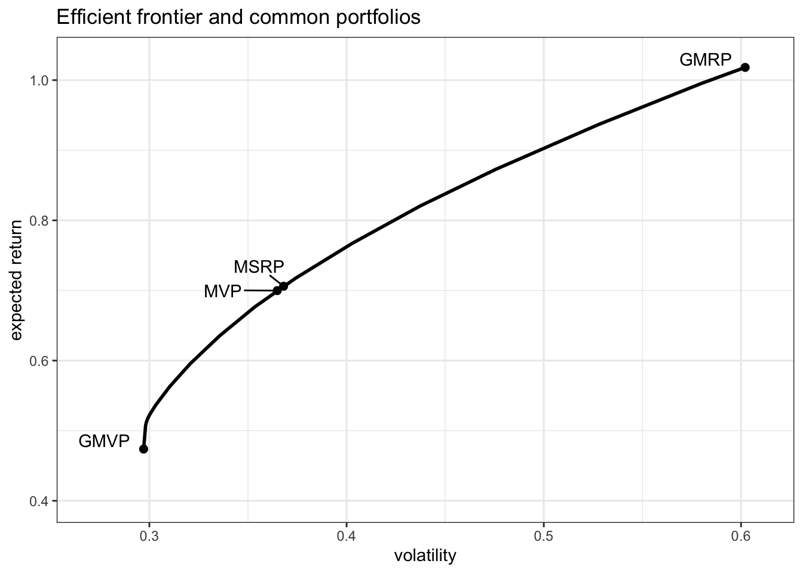
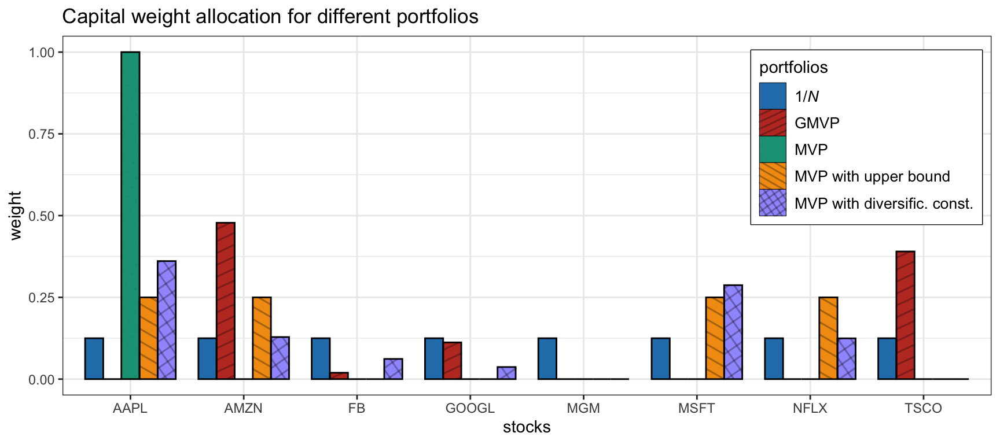

# Modern Portfolio Theory {#MPT}

> You must read, you must persevere, you must sit up nights, you must inquire, and exert the utmost power of your mind. If one way does not lead to the desired meaning, take another; if obstacles arise, then still another; until, if your strength holds out, you will find that clear which at first looked dark.
>
> --- Giovanni Boccaccio, _Genealogia deorum gentilium_

\afterquotespace
\acknowledgementCUP

Modern portfolio theory (MPT) started with Harry Markowitz’s 1952 seminal paper "Portfolio Selection" [@Markowitz1952], for which he would receive the Nobel prize in 1990. He put forth the idea that risk-adverse investors should optimize their portfolio based on a combination of two objectives: expected return and risk. That idea has remained central to portfolio optimization. In practice, however, the vanilla Markowitz portfolio formulation has some issues and drawbacks; as a consequence most practitioners tend to combine it with several heuristics or avoid it altogether. In this chapter, we explore the mean--variance Markowitz portfolio in its many facets.
\index{Nobel prize!Harry Markowitz}

  This material has been published as:
  Daniel P. Palomar (2025). _Portfolio Optimization: Theory and Application_. Cambridge University Press.
  This version is free to view and download for personal use only; not for re-distribution, re-sale, or use in derivative works. ©\ Daniel P. Palomar 2025.

## Mean--Variance Portfolio (MVP) {#mean-variance-portfolio}
This section considers the _mean--variance portfolio_ (MVP) proposed by Markowitz in his 1952 seminar paper
[@Markowitz1952]; see also the monographs @Rubinstein2002 and @KolmTutuncuFabozzi2014 with a retrospective view.
\index{Nobel prize!Harry Markowitz}

### Return--Risk Trade-Off {#return-risk-tradeoff}
While the expected return of the portfolio $\w^\T\bmu$ is a relevant quantity that measures the average or expected benefit (see Section\ \@ref(performance-measures)), it leaves one key element out: the risk. An investor needs to control the probability of going bankrupt. A _risk measure_ precisely quantifies how risky an investment strategy is. The most basic risk measure is the volatility $\sqrt{\w^\T\bSigma\w}$ or, similarly, the variance $\w^\T\bSigma\w$: a higher variance means that there are large peaks in the distribution of the returns, which may cause big losses. The volatility/variance has its limitations and a number of more sophisticated risk measures have been proposed in the literature such as downside risk measures (e.g., semi-variance), VaR, and CVaR (see Section\ \@ref(performance-measures)).

Precisely, Markowitz put forth the idea that risk-adverse investors should optimize their portfolio based on a combination of two objectives: expected return and risk [@Markowitz1952]. However, there is a trade-off between these two objectives: the higher the expected return, the higher the risk; the lower the risk, the lower the expected return. In other words, we are dealing with a multi-objective optimization problem (see Section\ \@ref(multi-objective-optimization) in Appendix\ \@ref(convex-optimization)) with its corresponding optimal trade-off curve (Pareto-optimal points), which is called the _efficient frontier_ in this portfolio context. Basically, the efficient frontier is a curve representing the best possible pair values of expected return and volatility that can be achieved by any feasible portfolio. The choice of a specific point on this trade-off curve depends on how aggressive or risk-averse the investor is. Figure\ \@ref(fig:efficient-frontier-feasible-portfolios) shows the trade-off between expected return and volatility.

(\#fig:efficient-frontier-feasible-portfolios)Trade-off between expected return and volatility: efficient frontier and 1,000 random feasible portfolios.

### MVP Formulation
Markowitz's portfolio formulation is a bi-objective optimization problem with the two objectives being the expected return $\w^\T\bmu$ and the risk measured by the volatility $\sqrt{\w^\T\bSigma\w}$ or, similarly, the variance $\w^\T\bSigma\w$. From an algorithmic perspective, it is more computationally efficient to use the variance than the volatility, since the former involves quadratic programming whereas the latter results in second-order cone programming (see Appendix\ \@ref(convex-optimization) and, more specifically, Section\ \@ref(solvers) in Appendix\ \@ref(optimization-algorithms) for algorithmic aspects of solvers).

\index{portfolios!mean--variance portfolio (MVP)}
\index{MVP|see{portfolios!mean--variance portfolio (MVP)}}

There are several ways to formulate a bi-objective optimization problem, as discussed in Section\ \@ref(multi-objective-optimization). The most convenient way is via scalarization of the two objectives into a single objective with a weighted sum [@Markowitz1952]:
\begin{equation}
  \begin{array}{ll}
  \underset{\w}{\textm{maximize}} & \w^\T\bmu - \frac{\lambda}{2}\w^\T\bSigma\w\\
  \textm{subject to} & \bm{1}^\T\w=1, \quad \w\ge\bm{0},
  \end{array}
  (\#eq:MVP)
\end{equation}
where $\lambda$ is a hyper-parameter that controls how risk-averse the investor is. The two constraints included are just for illustration purposes; in practice, one can include many of the other constraints listed in Section\ \@ref(portfolio-constraints), as elaborated in Section\ \@ref(MVP-with-many-constraints).

The choice of $\lambda$ in the MVP in \@ref(eq:MVP) will produce different portfolios that lie along the efficient frontier shown in Figure\ \@ref(fig:efficient-frontier-GMVP-MSRP-MVP). In fact, by letting $\lambda$ vary from $0$ to $\infty$, one can recover the whole efficient frontier. In particular, for $\lambda=0$ we recover the global maximum return portfolio (GMRP) described in Section\ \@ref(GMRP) (i.e., only the expected return is considered while the variance is ignored), whereas for $\lambda \rightarrow \infty$ we recover the global minimum variance portfolio (GMVP) considered in Section\ \@ref(GMVP) (i.e., the expected return is not used at all). Figure\ \@ref(fig:efficient-frontier-GMVP-MSRP-MVP) shows the efficient frontier together with these portfolios.

(\#fig:efficient-frontier-GMVP-MSRP-MVP)Efficient frontier and common portfolios.

Problem \@ref(eq:MVP) is a quadratic problem (QP) that can be easily solved with a QP solver (see Appendix\ \@ref(optimization-algorithms)). If we ignore the no-shorting constraint $\w\ge\bm{0}$, then the problem admits the simple closed-form solution
$$
\w = \frac{1}{\lambda} \bSigma^{-1}\left(\bmu + \nu\bm{1}\right),
$$
where $\nu$ is the optimal dual variable $\nu=\frac{\lambda-\bm{1}^{\T}\bSigma^{-1}\bmu}{\bm{1}^{\T}\bSigma^{-1}\bm{1}}$ chosen to satisfy the normalization constraint $\bm{1}^\T\w=1$.

::: {.example name="Optimum investment sizing"}
Suppose we have a single asset or a fully invested portfolio ($\bm{1}^\T\w=1$) with some returns over time $r_1, r_2, \dots$ The problem of investment sizing refers to determining how much of the budget should be allocated to this risky asset and how much should be kept in cash. The optimal sizing can be obtained from the MVP formulation in \@ref(eq:MVP) particularized to $N=1$ as
$$
  \begin{array}{ll}
  \underset{w}{\textm{maximize}} & w\mu - \frac{\lambda}{2}w^2\sigma^2\\
  \textm{subject to} & 0 \le w \le 1,
  \end{array}
$$
with solution
$$
w = \left[ \frac{1}{\lambda} \frac{\mu}{\sigma^2} \right]_0^1,
$$
where $[\cdot]_0^1$ denotes projection on the interval $[0,1]$. In particular, the growth rate is maximized when $\lambda=1$ (see Section\ \@ref(kelly-portfolio) for details) and then the optimal sizing turns out to be the (projected) mean-to-variance ratio: $w=[\mu/\sigma^2]_0^1$.
:::

There are two other widely used reformulations of Markowitz's portfolio. One formulation has the variance term as a constraint:
\begin{equation}
  \begin{array}{ll}
  \underset{\w}{\textm{maximize}} & \w^\T\bmu\\
  \textm{subject to} 
  & \w^\T\bSigma\w \leq \alpha,\\
  & \bm{1}^\T\w=1, \quad \w\ge\bm{0},
  \end{array}
  (\#eq:MVP-var-const)
\end{equation}
where $\alpha$ is a hyper-parameter that controls the maximum level of variance accepted. The other formulation, instead, has the expected return as a constraint:
\begin{equation}
  \begin{array}{ll}
  \underset{\w}{\textm{minimize}} & \w^\T\bSigma\w\\
  \textm{subject to} 
  & \w^\T\bmu \geq \beta,\\
  & \bm{1}^\T\w=1, \quad \w\ge\bm{0},
  \end{array}
  (\#eq:MVP-mean-const)
\end{equation}
where $\beta$ is a hyper-parameter that controls the minimum level of expected return accepted. 

Similarly to what happens with formulation \@ref(eq:MVP) as the hyper-parameter $\lambda$ is varied, formulations \@ref(eq:MVP-var-const) and \@ref(eq:MVP-mean-const) can also recover the whole efficient frontier by changing the hyper-parameters $\alpha$ and $\beta$, respectively.

The hyper-parameters in formulations \@ref(eq:MVP-var-const) and \@ref(eq:MVP-mean-const) have a more intuitive interpretation than that in formulation \@ref(eq:MVP), that is, maximum accepted variance and minimum accepted expected return. On the other hand, formulations \@ref(eq:MVP-var-const) and \@ref(eq:MVP-mean-const) may be infeasible if the hyper-parameters are not properly chosen, whereas formulation \@ref(eq:MVP) is always feasible regardless of the hyper-parameter $\lambda$. To avoid running into infeasibility issues, it is customary to choose the hyper-parameters based on benchmark portfolios such as the $1/N$ portfolio, i.e., 
$\alpha = \frac{1}{N^2}\bm{1}^\T\bSigma\bm{1}$ or $\beta = \frac{1}{N}\bm{1}^\T\bmu$.

Problem \@ref(eq:MVP-mean-const) is still a QP that can be solved efficiently with a QP solver; however, problem \@ref(eq:MVP-var-const) is a quadratically-constrained QP (QCQP) which typically requires a higher complexity either by using a QCQP solver or an SOCP solver (see Section\ \@ref(solvers) for details).

Commonly used programming languages in finance offer packages specifically designed to optimize portfolios under a wide variety of formulations and constraints, such as the popular R package [`fPortfolio`](https://cran.r-project.org/package=fPortfolio) [@fPortfolio] and the Python library [`Riskfolio-Lib`](https://riskfolio-lib.readthedocs.io) [@RiskfolioLib]. \index{R packages!fPortfolio} \index{Python packages!Riskfolio-Lib}

Figure\ \@ref(fig:w-MVP-lmd) shows the portfolio allocation of the MVP in \@ref(eq:MVP) for different values of $\lambda$, from which we can see the critical effect of the hyper-parameter in the final allocation. Figure\ \@ref(fig:PnL-drawdown-MVP-lmd) and Table\ \@ref(tab:performance-MVP-lmd) show the corresponding backtest results, indicating that smaller values of $\lambda$ suffer from a worse Sharpe ratio and a much severe drawdown than the largest ones.

(ref:w-MVP-lmd) Portfolio allocation of MVP with different values of hyper-parameter $\lambda$.

(\#fig:w-MVP-lmd)(ref:w-MVP-lmd)

(ref:PnL-drawdown-MVP-lmd) Backtest performance of MVP with different values of hyper-parameter $\lambda$.

(\#fig:PnL-drawdown-MVP-lmd)(ref:PnL-drawdown-MVP-lmd)

<table>
<caption>(\#tab:performance-MVP-lmd)Backtest performance of MVP with different values of hyper-parameter $\lambda$.</caption>
 <thead>
  <tr>
   <th style="text-align:left;"> Portfolio </th>
   <th style="text-align:right;"> Sharpe ratio </th>
   <th style="text-align:right;"> Annual return </th>
   <th style="text-align:right;"> Annual volatility </th>
   <th style="text-align:right;"> Max drawdown </th>
  </tr>
 </thead>
<tbody>
  <tr>
   <td style="text-align:left;"> $1/N$ </td>
   <td style="text-align:right;"> 3.34 </td>
   <td style="text-align:right;"> 115\% </td>
   <td style="text-align:right;"> 35\% </td>
   <td style="text-align:right;"> 14\% </td>
  </tr>
  <tr>
   <td style="text-align:left;"> MVP ($\lambda = 1$) </td>
   <td style="text-align:right;"> 2.60 </td>
   <td style="text-align:right;"> 112\% </td>
   <td style="text-align:right;"> 43\% </td>
   <td style="text-align:right;"> 20\% </td>
  </tr>
  <tr>
   <td style="text-align:left;"> MVP ($\lambda = 4$) </td>
   <td style="text-align:right;"> 2.57 </td>
   <td style="text-align:right;"> 106\% </td>
   <td style="text-align:right;"> 41\% </td>
   <td style="text-align:right;"> 19\% </td>
  </tr>
  <tr>
   <td style="text-align:left;"> MVP ($\lambda = 16$) </td>
   <td style="text-align:right;"> 3.37 </td>
   <td style="text-align:right;"> 113\% </td>
   <td style="text-align:right;"> 33\% </td>
   <td style="text-align:right;"> 15\% </td>
  </tr>
  <tr>
   <td style="text-align:left;"> MVP ($\lambda = 64$) </td>
   <td style="text-align:right;"> 3.65 </td>
   <td style="text-align:right;"> 116\% </td>
   <td style="text-align:right;"> 32\% </td>
   <td style="text-align:right;"> 14\% </td>
  </tr>
</tbody>
</table>

### MVP as a Regression
Interestingly, the MVP formulation can be interpreted as a regression problem. The key observation is that the variance of the portfolio can be seen as an $\ell_2$-norm error term. First, we rewrite the variance as
$$
\begin{aligned}
\w^\T\bSigma\w
&= \w^\T\E\left[(\bm{r}_t-\bmu)(\bm{r}_t-\bmu)^\T\right]\w\\
&= \E\left[(\w^\T(\bm{r}_t-\bmu))^2\right]\\
&= \E\left[(\w^\T\bm{r}_t-\rho)^2\right],
\end{aligned}
$$
where $\rho = \w^\T\bmu$. Then, we use the sample approximation for the expected value,
$$
\E\left[(\w^\T\bm{r}_t - \rho)^2\right] 
\approx \frac{1}{T}\sum_{t=1}^T (\w^\T\bm{r}_t - \rho)^2
= \frac{1}{T}\|\bm{R}\w - \rho\bm{1}\|_2^2,
$$
where $\bm{R} \triangleq \left[\bm{r}_1,\dots,\bm{r}_T \right]^\T$.

Now we can continue by rewriting the MVP formulation \@ref(eq:MVP) as the minimization
$$
\begin{array}{ll}
\underset{\w}{\textm{minimize}} & \w^\T\bSigma\w - \frac{2}{\lambda}\w^\T\bmu\\
\textm{subject to} & \bm{1}^\T\w=1, \quad \w\ge\bm{0}
\end{array}
$$
and finally substitute the variance with the $\ell_2$-norm expression:
\begin{equation}
  \begin{array}{ll}
  \underset{\w,\rho}{\textm{minimize}} & \frac{1}{T}\|\bm{R}\w - \rho\bm{1}\|_2^2 - \frac{2}{\lambda}\rho\\
  \textm{subject to} 
  & \rho = \w^\T\bmu,\\
  & \bm{1}^\T\w=1, \quad \w\ge\bm{0}.
  \end{array}
  (\#eq:MVP-regression)
\end{equation}
Note that the expected return, denoted by $\rho$, is also an optimization variable. Alternatively, one could fix $\rho$ to some predetermined value.

From the MVP formulation as a regression in \@ref(eq:MVP-regression), we can interpret the portfolio $\w$ as trying to obtain returns over time as constant as possible and equal to $\rho$. In other words, it is trying to achieve or track the expected return $\rho$ with minimum variance as measured by the $\ell_2$-norm. Interestingly, this interpretation is in fact related to the topic of index tracking in Chapter\ \@ref(index-tracking).

<!---
The attentive reader may have noticed that in this interpretation of the MVP as a regression problem, we have taken some liberties and interchangeably used linear returns and log-returns.
--->

### MVP with Practical Constraints {#MVP-with-many-constraints}
The previous MVP formulations in \@ref(eq:MVP), \@ref(eq:MVP-var-const), and \@ref(eq:MVP-mean-const) have included the two simple constraints $\bm{1}^\T\w=1$ and $\w\ge\bm{0}$ for simplicitly of exposition. In practice, however, there is a multitude of other constraints that an investor may want to use, as listed in Section\ \@ref(portfolio-constraints); see also @KolmTutuncuFabozzi2014.

For example, we can start with the basic MVP formulation in \@ref(eq:MVP) that only contains the budget and no-shorting constraints,
$$
\begin{array}{ll}
\underset{\w}{\textm{maximize}} & \begin{array}{l}\w^\T\bmu - \frac{\lambda}{2}\w^\T\bSigma\w\end{array}\\
\textm{subject to} & \begin{array}[t]{ll}
\bm{1}^\T\w=1 & \textm{budget},\\
\w\ge\bm{0}   & \textm{no-shorting},
\end{array}
\end{array}
$$
and change the constraints to reflect a more realistic trading situation:
\begin{equation}
  \begin{array}{ll}
  \underset{\w}{\textm{maximize}} & \begin{array}{l}\w^\T\bmu - \frac{\lambda}{2}\w^\T\bSigma\w\end{array}\\
  \textm{subject to} & \begin{array}[t]{ll}
  \left\Vert \w\right\Vert_1\leq\gamma & \textm{leverage},\\
  \left\Vert \w-\w_{0}\right\Vert _{1}\leq\tau & \textm{turnover},\\
  |\w| \leq \bm{u} & \textm{max positions},\\
  \bm{\beta}^\T\w = 0 & \textm{market neutral},\\
  \left\Vert \w\right\Vert _{0} \leq K & \textm{sparsity},
  \end{array}
  \end{array}
  (\#eq:MVP-many-constraints)
\end{equation}
where $\gamma\geq1$ controls the amount of shorting and leverage, $\tau>0$ controls the turnover (to limit the transaction costs in the rebalancing), $\bm{u}$ limits the position in each stock, $\bm{\beta}$ denotes the beta of the stocks, and $K$ controls the cardinality of the portfolio (to select a small set of stocks from the universe).

More generally, we can write the MVP formulation with a general set of constraints, denoted by $\mathcal{W}$, as
\begin{equation}
  \begin{array}{ll}
  \underset{\w}{\textm{maximize}} & \w^\T\bmu - \frac{\lambda}{2}\w^\T\bSigma\w\\
  \textm{subject to} & \w \in \mathcal{W}.
  \end{array}
  (\#eq:MVP-arbitrary-constraints-lala)
\end{equation}

From the optimization perspective, as long as the constraints in $\mathcal{W}$ are convex the problem will remain convex and will still be easy to solve. The only constraint that is nonconvex in \@ref(eq:MVP-many-constraints) is the cardinality constraint $\left\Vert \w\right\Vert _{0} \leq K$.

### Improving the MVP with Heuristics {#MVP-heuristic-constraints}
One of the main problems of the MVP is the lack of diversification, which goes against common practice. To address this issue, several heuristics have been proposed with good practical results such as no-shorting constraints, upper bound constraints, and $\ell_2$-norm constraints; see @KolmTutuncuFabozzi2014 for more details.

Imposing no-shorting constraints, $\w\ge\bm{0}$, seems to have significant practical benefits in reducing the amplification of the noise inherent in the estimated covariance matrix, even when the constraints are wrong [@JagannathanMa2003]. Surprisingly, with no-shorting constraints, the sample covariance matrix performs as well as more sophisticated covariance matrix estimators based on factor models, shrinkage estimators, or higher-frequency returns. Including upper bound constraints also has a regularization effect on the covariance matrix. 

For example, if we consider the GMVP from Section\ \@ref(GMVP) with constraints $\bm{1}^\T\w=1$ and $\bm{0}\leq\w\leq\bm{u}$, the optimal solution \@ref(eq:GMVP-sol) is still valid using instead the regularized covariance matrix
$$
\tilde{\bSigma} = \bSigma + \bm{\lambda}_0\bm{1}^\T + \bm{1}\bm{\lambda}_0^\T + \bm{\lambda}_{\textm{u}}\bm{1}^\T + \bm{1}\bm{\lambda}_{\textm{u}}^\T,
$$
where $\bm{\lambda}_0$ and $\bm{\lambda}_{\textm{u}}$ are the Lagrange multipliers corresponding to the no-shorting and upper bound constraints, respectively [@JagannathanMa2003]. This regularized covariance matrix $\tilde{\bSigma}$ can be interpreted as a shrunk version of $\bSigma$ with reduced sampling error. Interestingly, the same result can be obtained by instead including an $\ell_1$-norm constraint $\|\w\|_1\leq\delta$ [@DeMiguelGarlappiNogalesUppal2009].

One way to enforce diversity is via the diversification constraint $\|\w\|_2^2 \leq D$ (see Section\ \@ref(portfolio-constraints)). The maximum diversity level $D$ is lower bounded by $1/N$ (achieved by the $1/N$ portfolio) and could be chosen as the diversity achieved by some benchmark portfolio, for example, the GMVP gives $D = \bm{1}^\T\bSigma^{-2}\bm{1}/(\bm{1}^\T\bSigma^{-1}\bm{1})^2$.

For example, if we consider the GMVP with constraints $\bm{1}^\T\w=1$ and $\|\w\|_2^2 \leq D$, the optimal solution \@ref(eq:GMVP-sol) is still valid using instead the regularized covariance matrix
$$
\tilde{\bSigma} = \bSigma + \gamma\bm{I},
$$
leading to the portfolio
$$
\w = \frac{1}{\bm{1}^\T\left(\bSigma+\gamma\bm{I}\right)^{-1}\bm{1}} \left(\bSigma+\gamma\bm{I}\right)^{-1}\bm{1},
$$
where $\gamma\ge0$ is the Lagrange multiplier corresponding to the diversification constraint [@DeMiguelGarlappiNogalesUppal2009]. For $\gamma=0$ we recover the solution \@ref(eq:GMVP-sol), whereas for $\gamma\rightarrow\infty$ we obtain the $1/N$ portfolio. Interestingly, this solution is like shrinking the covariance matrix to the identity matrix with $\gamma$ being the shrinkage intensity (see Chapter\ \@ref(iid-modeling)).

Figure\ \@ref(fig:w-MVP-diversification-heuristics) illustrates the effect of two diversification heuristics on the portfolio allocation (namely, with upper bound $\|\w\|_\infty\leq0.25$ and diversification constraint $\|\w\|_2^2\leq 0.25$), which indeed improve the diversification. Figure\ \@ref(fig:PnL-drawdown-MVP-diversification-heuristics) and Table\ \@ref(tab:performance-MVP-diversification-heuristics) show the corresponding backtest results, indicating that the more diversified MVPs have a better Sharpe ratio and drawdown.

(\#fig:w-MVP-diversification-heuristics)Portfolio allocation of MVP under two diversification heuristics (upper bound and diversification constraint).

(\#fig:PnL-drawdown-MVP-diversification-heuristics)Backtest performance of MVP under two diversification heuristics (upper bound and diversification constraint).

<table>
<caption>(\#tab:performance-MVP-diversification-heuristics)Backtest performance of MVP under two diversification heuristics (upper bound and diversification constraint).</caption>
 <thead>
  <tr>
   <th style="text-align:left;"> Portfolio </th>
   <th style="text-align:right;"> Sharpe ratio </th>
   <th style="text-align:right;"> Annual return </th>
   <th style="text-align:right;"> Annual volatility </th>
   <th style="text-align:right;"> Max drawdown </th>
  </tr>
 </thead>
<tbody>
  <tr>
   <td style="text-align:left;"> 1/$N$ </td>
   <td style="text-align:right;"> 3.34 </td>
   <td style="text-align:right;"> 115\% </td>
   <td style="text-align:right;"> 35\% </td>
   <td style="text-align:right;"> 14\% </td>
  </tr>
  <tr>
   <td style="text-align:left;"> GMVP </td>
   <td style="text-align:right;"> 3.67 </td>
   <td style="text-align:right;"> 115\% </td>
   <td style="text-align:right;"> 31\% </td>
   <td style="text-align:right;"> 14\% </td>
  </tr>
  <tr>
   <td style="text-align:left;"> MVP </td>
   <td style="text-align:right;"> 2.44 </td>
   <td style="text-align:right;"> 99\% </td>
   <td style="text-align:right;"> 41\% </td>
   <td style="text-align:right;"> 19\% </td>
  </tr>
  <tr>
   <td style="text-align:left;"> MVP with upper bound </td>
   <td style="text-align:right;"> 2.98 </td>
   <td style="text-align:right;"> 96\% </td>
   <td style="text-align:right;"> 32\% </td>
   <td style="text-align:right;"> 14\% </td>
  </tr>
  <tr>
   <td style="text-align:left;"> MVP with diversific. const. </td>
   <td style="text-align:right;"> 2.79 </td>
   <td style="text-align:right;"> 97\% </td>
   <td style="text-align:right;"> 35\% </td>
   <td style="text-align:right;"> 16\% </td>
  </tr>
</tbody>
</table>

## Maximum Sharpe Ratio Portfolio {#MSRP}
Markowitz's mean--variance framework provides portfolios along the efficient frontier, that is, formulations \@ref(eq:MVP), \@ref(eq:MVP-var-const), and \@ref(eq:MVP-mean-const), by varying the hyper-parameters $\lambda$, $\alpha$, and $\beta$, respectively. The specific choice of a point on the efficient frontier depends on the risk aversion of the investor. Nevertheless, the most widely used performance measure is the Sharpe ratio and there is only one portfolio on the efficient frontier that achieves the maximum value, as indicated in Figure\ \@ref(fig:efficient-frontier-GMVP-MSRP-MVP) under MSRP.

\index{portfolios!maximum Sharpe ratio portfolio (MSRP)}
Precisely, in 1966, Sharpe proposed the _maximum Sharpe ratio portfolio_ (MSRP) formulation [@Sharpe1966] as
\begin{equation}
  \begin{array}{ll}
  \underset{\w}{\textm{maximize}} & \dfrac{\w^\T\bmu - r_\textm{f}}{\sqrt{\w^\T\bSigma\w}}\\
  \textm{subject to} & \begin{array}{l} \bm{1}^\T\w=1, \quad \w\ge\bm{0},\end{array}
  \end{array}
  (\#eq:MSRP)
\end{equation}
where $r_\textm{f}$ is the return of the risk-free asset. 

This problem is not convex, but it belongs to the class of _fractional programs_ (FPs) for which many solving methods are available, namely, the bisection, Dinkelbach, and Schaible transform methods as described next (see Section\ \@ref(taxonomy-convex-problems) in Appendix\ \@ref(convex-optimization) for a description of FPs and Section\ \@ref(methods-FP) in Appendix\ \@ref(optimization-algorithms) for more details on the algorithms).

### Bisection Method
Concave--convex FP can be conveniently solved via a sequence of convex feasibility problems, termed the bisection method (see Section\ \@ref(convex-optimization-problem) for details). For problem \@ref(eq:MSRP), the sequence of convex feasibility problems are of the form
\begin{equation}
  \begin{array}{ll}
  \underset{\w}{\textm{find}} & 
  \begin{array}{c} \w \end{array}\\
  \textm{subject to} & \begin{array}[t]{l}
  t \sqrt{\w^\T\bSigma\w} \leq \w^\T\bmu - r_\textm{f},\\
  \bm{1}^\T\w=1, \quad \w\ge\bm{0},
  \end{array}
  \end{array}
  (\#eq:MSRP-feasibility)
\end{equation}
where $t>0$ is a fixed parameter (not an optimization variable). This problem is convex and, in fact, a second-order cone program (SOCP) since the volatility can be written as an $\ell_2$-norm, $\sqrt{\w^\T\bSigma\w} = \|\bSigma^{1/2}\w\|_2$ (see Section\ \@ref(taxonomy-convex-problems)). Note that this convex feasibility reformulation can be infeasible in practice (e.g., if all the elements of $\bmu$ are negative), so care has to be taken for such a case. The method is summarized in Algorithm\ 7.1.

\index{algorithms!MSRP via bisection}

:::: plain_algorithm
::: lined
**Algorithm 7.1**: Bisection method to solve the MSRP in \@ref(eq:MSRP).
:::
Choose interval $[l,u]$ (with $l>0$) that contains the optimal Sharpe ratio, tolerance $\epsilon>0$;  
**repeat**

  1. $t \leftarrow (l+u)/2$;
  2. Solve the convex feasibility problem \@ref(eq:MSRP-feasibility);
  3. **if** feasible, **then** $l \leftarrow t$ and keep solution $\w$; **else** $u \leftarrow t$;
  
**until** $u-l \leq \epsilon$;
::::

### Dinkelbach Method
Concave--convex FPs can be solved via the Dinkelbach method [@Dinkelbach67] by solving a sequence of simpler convex problems (see Section\ \@ref(dinkelbach) for details). For problem \@ref(eq:MSRP), the sequence of convex problems is, in fact, a sequence of SOCPs of the form:
\begin{equation}
  \begin{array}{ll}
  \underset{\w}{\textm{maximize}} & \w^\T\bmu - r_\textm{f} - y^{k}\sqrt{\w^\T\bSigma\w}\\
  \textm{subject to} & \begin{array}{l} \bm{1}^\T\w=1, \quad \w\ge\bm{0},\end{array}
  \end{array}
  (\#eq:MSRP-dinkelbach)
\end{equation}
where the parameter $y^k$ is sequentially updated as
\begin{equation}
  y^{k} = \dfrac{(\w^k) ^\T \bmu - r_\textm{f}}{\sqrt{(\w^k)^\T\bSigma\w^k}}
  (\#eq:MSRP-dinkelbach-yk)
\end{equation}
with $k$ the iteration index. This is summarized in Algorithm\ 7.2.

\index{algorithms!MSRP via Dinkelbach}

:::: plain_algorithm
::: lined
**Algorithm 7.2**: Dinkelbach method to solve the MSRP in \@ref(eq:MSRP).
:::
Choose initial point $\w^0$;  
Set $k \gets 0$;  
**repeat**

  1. Set $y^{k}$ as in \@ref(eq:MSRP-dinkelbach-yk);
  2. Solve the convex problem \@ref(eq:MSRP-dinkelbach) and keep current solution as $\w^{k+1}$;
  3. $k \gets k+1$;
  
**until** convergence;
::::

### Schaible Transform Method
\index{optimization!Schaible transform}

Concave--convex FPs can be more efficiently solved via the Schaible transform [@Schaible74] without the need to resort to iterative schemes (see Section\ \@ref(schaible) for details). It turns out that problem \@ref(eq:MSRP) can be rewritten as
$$
\begin{array}{ll}
\underset{\bm{y},t}{\textm{maximize}} & \bm{y}^\T\left(\bmu - r_\textm{f}\bm{1}\right)\\
\textm{subject to}
& \sqrt{\bm{y}^\T\bSigma\bm{y}} \le 1,\\
& t > 0,\\
& \bm{1}^\T\bm{y}=t, \quad \bm{y}\ge\bm{0},
\end{array}
$$
which can be further simplified (eliminating variable $t$) to
\begin{equation}
  \begin{array}{ll}
  \underset{\bm{y}}{\textm{maximize}} & \bm{y}^\T\left(\bmu - r_\textm{f}\bm{1}\right)\\
  \textm{subject to} 
  & \bm{y}^\T\bSigma\bm{y} \le 1,\\
  & \bm{1}^\T\bm{y} > 0, \quad \bm{y}\ge\bm{0},
  \end{array}
  (\#eq:MSRP-schaible)
\end{equation}
from which the original variable $\w$ can be easily recovered from $\bm{y}$, and $t=\bm{1}^\T\bm{y}$ as $\w = \bm{y}/\left(\bm{1}^\T\bm{y}\right).$ Note that, since $\bm{y}\ge\bm{0}$, the constraint $\bm{1}^\T\bm{y} > 0$ can be safely ignored when solving the problem with an interior-point method (see Section\ \@ref(IPM) for details).

Interestingly, if we reformulate problem \@ref(eq:MSRP) as the minimization of $\sqrt{\w^\T\bSigma\w}/\left(\w^\T\bmu - r_\textm{f}\right)$, the Schaible transform leads to
\begin{equation}
  \begin{array}{ll}
  \underset{\bm{y}}{\textm{minimize}} & \bm{y}^\T\bSigma\bm{y}\\
  \textm{subject to} 
  & \bm{y}^\T\left(\bmu - r_\textm{f}\bm{1}\right) \ge 1,\\
  & \bm{1}^\T\bm{y} > 0, \quad \bm{y}\ge\bm{0},
  \end{array}
  (\#eq:MSRP-schaible-bis)
\end{equation}
where the inequality $\bm{y}^\T\left(\bmu - r_\textm{f}\bm{1}\right) \ge 1$ can be alternatively written as equality. Observe that the Schaible transform requires the denominator to be nonnegative, which in this case means $\bm{y}^\T\left(\bmu - r_\textm{f}\bm{1}\right) > 0$ or $\w^\T\bmu - r_\textm{f} > 0$; in other words, this alternative reformulation may or may not be feasible and care has to be taken for this case.

Problem \@ref(eq:MSRP-schaible) is a (convex) QCQP, which can be easily solved with a QCQP solver. However, the alternative problem reformulation in \@ref(eq:MSRP-schaible-bis) is a simpler QP, which is preferred since it can be solved with more efficient QP solvers (see Section\ \@ref(solvers) for details).

::: {.example name="MSRP with return and upper bound constraints"}
Consider the MSRP formulation with minimum return $\beta>0$ and upper bound $\bm{u}$ constraints:
$$\begin{array}{ll}
  \underset{\w}{\textm{maximize}} & \dfrac{\w^\T\bmu}{\sqrt{\w^\T\bSigma\w}}\\
  \textm{subject to} & 
  \begin{array}[t]{l}
    \w^\T\bmu \geq \beta,\\
    \bm{1}^\T\w=1, \quad \bm{0} \leq \w \leq \bm{u}.
  \end{array}
  \end{array}
$$
After applying the Schaible transform, the problem simplifies to the QP
$$\begin{array}{ll}
  \underset{\bm{y}}{\textm{minimize}} & \bm{y}^\T\bSigma\bm{y}\\
  \textm{subject to} 
  & \bm{y}^\T\bmu \ge 1,\\
  & 0 < \bm{1}^\T\bm{y} \leq \beta^{-1}, \quad \bm{0} \leq \bm{y} \leq \bm{u} \cdot \left(\bm{1}^\T\bm{y}\right),
  \end{array}
$$
from which the portfolio is obtained as $\w = \bm{y}/\left(\bm{1}^\T\bm{y}\right)$.
:::

::: {.example name="MSRP with shorting and return constraint"}
Consider the MSRP formulation with minimum return $\beta>0$ and with shorting allowed:
$$\begin{array}{ll}
  \underset{\w}{\textm{maximize}} & \dfrac{\w^\T\bmu}{\sqrt{\w^\T\bSigma\w}}\\
  \textm{subject to} & 
  \begin{array}[t]{l}
    \w^\T\bmu \geq \beta\\
    \|\w\|_1=1.
  \end{array}
  \end{array}
$$
After applying the Schaible transform, the problem simplifies to the QP
$$\begin{array}{ll}
  \underset{\bm{y}}{\textm{minimize}} & \bm{y}^\T\bSigma\bm{y}\\
  \textm{subject to} 
  & \bm{y}^\T\bmu \ge 1\\
  & 0 < \|\bm{y}\|_1 \leq \beta^{-1},
  \end{array}
$$
from which the portfolio is obtained as $\w = \bm{y}/\|\bm{y}\|_1$.
:::

<!---
#### Proof of convex reformulation of MSRP {-}
- Start with the original problem formulation:
$$
\begin{array}{ll}
\underset{\mathbf{w}}{\textsf{maximize}} &
\frac{\mathbf{w}^{T}\boldsymbol{\mu}-r_\textm{f}}{\sqrt{\mathbf{w}^{T}\boldsymbol{\Sigma}\mathbf{w}}}\\
\textsf{subject to} 
& \mathbf{1}^{T}\mathbf{w}=1\\
& \left(\mathbf{w}\geq\mathbf{0}\right)
\end{array}
\Longleftrightarrow
\begin{array}{ll}
\underset{\mathbf{w}}{\textsf{minimize}} & 
\frac{\sqrt{\mathbf{w}^{T}\boldsymbol{\Sigma}\mathbf{w}}}{\mathbf{w}^{T}(\boldsymbol{\mu}-r_\textm{f}\mathbf{1})}\\
\textsf{subject to} 
& \mathbf{1}^{T}\mathbf{w}=1\\
& \left(\mathbf{w}\geq\mathbf{0}\right)
\end{array}
$$

- Now, since the objective is scale invariant w.r.t. $\mathbf{w}$, we can choose the proper scaling factor for our convenience. We define $\tilde{\mathbf{w}}=t\mathbf{w}$ with the scaling factor $t=1/\left(\mathbf{w}^{T}\boldsymbol{\mu}-r_\textm{f}\right)>0$, so that the objective becomes $\tilde{\mathbf{w}}^{T}\boldsymbol{\Sigma}\tilde{\mathbf{w}}$, the sum constraint $\mathbf{1}^{T}\tilde{\mathbf{w}}=t$, and the problem is
$$\begin{array}{ll}
\underset{\mathbf{w},\tilde{\mathbf{w}},t}{\textsf{minimize}} & 
\sqrt{\tilde{\mathbf{w}}^{T}\boldsymbol{\Sigma}\tilde{\mathbf{w}}}\\
\textsf{subject to} 
& t=1/\mathbf{w}^{T}(\boldsymbol{\mu}-r_\textm{f}\mathbf{1})>0\\
& \tilde{\mathbf{w}}=t\mathbf{w}\\
& \mathbf{1}^{T}\tilde{\mathbf{w}}=t>0\\
& \left(\tilde{\mathbf{w}}\geq\mathbf{0}\right).
\end{array}$$

- The constraint $t=1/\mathbf{w}^{T}(\boldsymbol{\mu}-r_\textm{f}\mathbf{1})$ can be rewritten in terms of $\tilde{\mathbf{w}}$ as $1=\tilde{\mathbf{w}}^{T}(\boldsymbol{\mu}-r_\textm{f}\mathbf{1})$. So the problem becomes 
$$\begin{array}{ll}
\underset{\mathbf{w},\tilde{\mathbf{w}},t}{\textsf{minimize}} & 
\tilde{\mathbf{w}}^{T}\boldsymbol{\Sigma}\tilde{\mathbf{w}}\\
\textsf{subject to} 
& \tilde{\mathbf{w}}^{T}(\boldsymbol{\mu}-r_\textm{f}\mathbf{1})=1\\
& \tilde{\mathbf{w}}=t\mathbf{w}\\
& \mathbf{1}^{T}\tilde{\mathbf{w}}=t>0\\
& \left(\tilde{\mathbf{w}}\geq\mathbf{0}\right).
\end{array}$$

- Now, note that the strict inequality $t>0$ is equivalent to $t\geq0$ because $t=0$ can never happen as $\tilde{\mathbf{w}}$ would  would be zero and the first constraint would not be satisfied.

- Finally, we can now get rid of $\mathbf{w}$ and t in the formulation as they can be directly obtained as $t=\mathbf{1}^{T}\tilde{\mathbf{w}}$ and $\mathbf{w}=\tilde{\mathbf{w}}/t$:
$$\begin{array}{ll}
\underset{\tilde{\mathbf{w}}}{\textsf{minimize}} & 
\tilde{\mathbf{w}}^{T}\boldsymbol{\Sigma}\tilde{\mathbf{w}}\\
\textsf{subject to} 
& \tilde{\mathbf{w}}^{T}(\boldsymbol{\mu}-r_\textm{f}\mathbf{1})=1\\
& \mathbf{1}^{T}\tilde{\mathbf{w}}\geq0\\
& \left(\tilde{\mathbf{w}}\geq\mathbf{0}\right).
\end{array}$$

- QED!

- Recall that the portfolio is then obtained with the correct scaling factor as $\mathbf{w}=\tilde{\mathbf{w}}/(\mathbf{1}^{T}\tilde{\mathbf{w}})$.
--->

## Utility-Based Portfolios {#utility-based-portfolios}
All the previous porfolio formulations in Sections\ \@ref(mean-variance-portfolio) and\ \@ref(MSRP) are based on some judicious combination of the mean and variance of the returns $R^\textm{portf}_t = \w^\T\bm{r}_t$ (here, $\bm{r}_t$ denotes linear returns). However, it is possible to express the interest of the investor in a more general way via _utility functions_.

### Kelly Criterion Portfolio {#kelly-portfolio}
In 1956, a scientist working for Bell Labs, John Larry Kelly, Jr., brought together game theory and information theory [@Kelly1956]. He showed that in order to achieve maximum growth of wealth, a gambler should place bets that maximize the expected value of the logarithm of the capital, usually referred to as the _Kelly criterion_. The Kelly criterion was applied to portfolio design in @Markowitz1959; see also @Thorp1971 and @Thorp1997.[^beat-the-dealer]

[^beat-the-dealer]: Edward O. Thorp was an American math professor, author, and blackjack player who wrote _Beat the Dealer_ [@Thorp1962], which became a classic and was the first book to prove mathematically that the house advantage in blackjack could be overcome by card counting.

Recall from \@ref(eq:fixed-portfolio-return) that, for a given fixed portfolio $\w$, the returns are $R^\textm{portf}_t = \w^\T\bm{r}_t$. From the geometric compounding of the portfolio wealth of NAV in \@ref(eq:NAV-geometric), we can write the wealth accumulated during the periods $t=1,\dots,T$ as
$$
W_T = W_0\prod_{t=1}^T \frac{W_t}{W_{t-1}} = W_0\prod_{t=1}^T \left(1 + \w^\T\bm{r}_t\right),
$$
where $W_0$ is the initial wealth and $W_t$ the wealth at time period $t$.

It turns out that the wealth grows exponentially as $W_t\sim e^{t\times G}$ [@CoverThomas1991], where the exponent $G$ is the exponential rate of growth or, simply, _growth rate_:
$$
G = \underset{T\rightarrow\infty}{\textm{lim}} \;\textm{log}\left(\frac{W_T}{W_0}\right)^{1/T}.
$$
The growth rate can be estimated asymptotically by the law of large numbers as
$$
G = \underset{T\rightarrow\infty}{\textm{lim}} \; \frac{1}{T} \sum_{t=1}^T \textm{log}\left(1 + \w^\T\bm{r}_t\right) = \E\left[\textm{log}\left(1 + \w^\T\bm{r}\right)\right],
$$
where $\bm{r}$ is a random variable with the same distribution as each $\bm{r}_t$.

\index{portfolios!Kelly criterion portfolio}
Maximizing the growth rate effectively maximizes the long-term wealth and it is a very compelling choice for portfolio design. We call this formulation the _Kelly criterion portfolio_:
\begin{equation}
  \begin{array}{ll}
  \underset{\w}{\textm{maximize}} & \E\left[\textm{log}\left(1 + \w^\T\bm{r}\right)\right]\\
  \textm{subject to} & \bm{1}^\T\w=1, \quad \w\ge\bm{0}.
  \end{array}
  (\#eq:Kelly-portfolio)
\end{equation}
Good and bad properties of the Kelly criterion are discussed in @MacLeanThorpZiemba2010.

Problem \@ref(eq:Kelly-portfolio) is convex since the log is a concave function and it is a maximization problem. In practice, however, we need to find an appropriate way to deal with the expected value in the objective function as we discuss next via sample averages, the exponential cone, and other approximations.

#### Solving the Kelly Criterion Portfolio Directly via Sample Average {-}
In practice, the expectation in problem \@ref(eq:Kelly-portfolio) can be approximated by the sample mean:
$$
\E\left[\textm{log}\left(1 + \w^\T\bm{r}\right)\right] \approx \frac{1}{T} \sum_{t=1}^T \textm{log}\left(1 + \w^\T\bm{r}_t\right).
$$
However, finding a solver that can deal directly with the log function may be challenging.

#### Solving the Kelly Criterion Portfolio via Exponential Cone Programming {-}
Interestingly, this problem can be reformulated in terms of the exponential cone [@Cajas2021-kelly-portfolio], leading to _exponential cone programming_ for which solvers can be found.

Consider problem \@ref(eq:Kelly-portfolio) with the sample average approximation and with the additional slack variables $q_t$:
$$
\begin{array}{ll}
\underset{\w, \{q_t\}}{\textm{maximize}} & \frac{1}{T}\sum_{t=1}^T q_t\\
\textm{subject to} & q_t \leq \textm{log}\left(1 + \w^\T\bm{r}_t\right), \quad t=1,\dots,T,\\
& \bm{1}^\T\w=1, \quad \w\ge\bm{0}.
\end{array}
$$
The constraints $q_t \leq \textm{log}\left(1 + \w^\T\bm{r}_t\right)$ can be equivalently written as $\textm{exp}(q_t) \leq 1 + \w^\T\bm{r}_t$ and the Kelly portfolio can be finally written as the exponential cone program
\begin{equation}
  \begin{array}{ll}
  \underset{\w, \{q_t\}}{\textm{maximize}} & \frac{1}{T}\sum_{t=1}^T q_t\\
  \textm{subject to} & (q_t, 1, 1 + \w^\T\bm{r}_t) \in \mathcal{K}_\textm{exp}, \quad t=1,\dots,T,\\
  & \bm{1}^\T\w=1, \quad \w\ge\bm{0},
  \end{array}
  (\#eq:Kelly-portfolio-exp-cone)
\end{equation}
where $\mathcal{K}_\textm{exp}$ is the exponential cone [@Chares2007] defined as
$$
\mathcal{K}_{\textm{exp}} \triangleq \big\{(a,b,c) \mid c\geq b\,e^{a/b}, b>0\big\} \cup \big\{(a,b,c) \mid a\leq0, b=0, c\geq0\big\}.
$$
 

#### Solving the Kelly Criterion Portfolio via Mean--Variance Approximations {-}
The most common way to deal with the expectation in the objective of problem \@ref(eq:Kelly-portfolio) is via a first-order Taylor approximation[^Taylor-log-function] around the point $\bm{r}=\bm{0}$ [@Markowitz1959]:
\begin{equation}
  \E\left[\textm{log}\left(1 + \w^\T\bm{r}\right)\right] \approx \w^\T\bmu - \frac{1}{2}\w^\T\bSigma\w,
  (\#eq:log-approx-mean-var)
\end{equation}
which is a surprising and beautiful justification for the mean--variance formulation in \@ref(eq:MVP) (with $\lambda=1$), that is, 
$$
\begin{array}{ll}
\underset{\w}{\textm{maximize}} & \w^\T\bmu - \frac{1}{2}\w^\T\bSigma\w\\
\textm{subject to} & \bm{1}^\T\w=1, \quad \w\ge\bm{0}.
\end{array}
$$

[^Taylor-log-function]: The Taylor expansion of the log function around the point $x=x_0$ is
$$
\textm{log}(1 + x) = \textm{log}(1 + x_0) + \frac{1}{1 + x_0}(x - x_0) + \frac{1}{2}\frac{-1}{(1 + x_0)^2}(x - x_0)^2 + \cdots
$$

It is possible to find better Taylor approximations than \@ref(eq:log-approx-mean-var) around the point $\bm{r}=\bmu$, such as [@Markowitz1959]
\begin{equation}
  \E\left[\textm{log}\left(1 + \w^\T\bm{r}\right)\right] \approx \textm{log}\left(1 + \w^\T\bmu\right) -   \frac{1}{2}\frac{\w^\T\bSigma\w}{\left(1+\w^\T\bmu\right)^2}
  (\#eq:log-approx-mean-var-bis)
\end{equation}
or, further approximated,
\begin{equation}
  \E\left[\textm{log}\left(1 + \w^\T\bm{r}\right)\right] \approx \w^\T\bmu - \frac{1}{2}(\w^\T\bmu)^2 -   \frac{1}{2}\frac{\w^\T\bSigma\w}{1+2\w^\T\bmu}.
  (\#eq:log-approx-mean-var-bis2)
\end{equation}

One can also try an approximation over an interval (as opposed to the Taylor approximations, which focus on a single point) such as the Levy-Markowitz approximation [@LevyMarkowitz1979]:
\begin{equation}
  \begin{aligned}[b]
  \E\left[\textm{log}\left(1 + \w^\T\bm{r}\right)\right] &\approx
  \frac{1}{2\kappa^2}\textm{log}\left(\left(1+\w^\T\bmu\right)^2 - \kappa^2 \w^\T\bSigma\w\right)\\ 
  &\qquad + \left(1-\frac{1}{\kappa^2}\right)\textm{log}\left(1+\w^\T\bmu\right),
  \end{aligned}  
  (\#eq:log-approx-mean-var-Levy)
\end{equation}
where $\kappa$ measures the width of the approximating interval in standard deviations.

However, these other approximations may not bring any benefit in practice [@Pulley1983] due to the nonconvexity and the fact that the parameters $\bmu$ and $\bSigma$ contain estimation errors an order of magnitude larger than the potential benefit of these refined approximations. See @Markowitz2014 for a historical perspective on mean--variance approximations. Chapter\ \@ref(high-order-portfolios) explores higher-order moments, that is, skewness and kurtosis, to obtain better approximations for portfolio design.

### Expected Utility Theory
The model of rational decision-making in most of economics and statistics is _expected utility theory_, which was axiomatized by @NeumannMorgenstern1944 and @Savage1954.
\index{expected utility theory}

\index{portfolios!maximum expected utility portfolio}
In the context of portfolio design, the utility $U(\cdot)$ is a function of the random portfolio return $\w^\T\bm{r}$ and the objective is the maximization of the expected utility:
\begin{equation}
  \begin{array}{ll}
  \underset{\w}{\textm{maximize}} & \E\left[U(\w^\T\bm{r})\right]\\
  \textm{subject to} & \bm{1}^\T\w=1, \quad \w\ge\bm{0}.
  \end{array}
  (\#eq:utility-maximization)
\end{equation}

The Kelly criterion portfolio in \@ref(eq:Kelly-portfolio) is a particular case of the expected utility maximization in \@ref(eq:utility-maximization) by choosing the log utility $U(x) = \textm{log}\left(1 + x\right)$. Some (concave) utilities of interest include:

- $U(x) = \textm{log}\left(1 + x\right)$
- $U(x) = \sqrt{1 + x}$
- $U(x) = -\dfrac{1}{x}$
- $U(x) = -p\dfrac{1}{x^p}$ for $p>0$ (as $p\rightarrow0$ it converges to the log utility)
- $U(x) = -\dfrac{1}{\sqrt{1 + x}}$
- $U(x) = 1 - \textm{exp}(-\lambda x)$, with $\lambda>0$ being the risk aversion parameter.

However, this general expected utility theory, while useful in theory, is an elusive concept that may be of little practical help when faced with investment decisions, as opposed to the statistically sound Kelly criterion. As stated in @Roy1952:

> In calling in a utility function to our aid, an appearance of generality is achieved at the cost of a loss of practical significance, and applicability in our results. A man who seeks advice about his actions will not be grateful for the suggestion that he maximise expected utility.

Problem \@ref(eq:utility-maximization) is convex as long as the utility $U(\cdot)$ is a concave function. Similarly to the Kelly criterion portfolio, the expected utility portfolio formulation can be numerically solved in a direct way or via mean--variance approximations as described next.

#### Solving the Expected Utility Portfolio Directly via Sample Average {-}
In practice, problem \@ref(eq:utility-maximization) can be approximated by directly replacing the expectation in the objective function by the sample mean:
$$
\E\left[U(\w^\T\bm{r})\right] \approx \frac{1}{T} \sum_{t=1}^T U\left(\w^\T\bm{r}_t\right).
$$
However, finding a solver that can deal directly with the utility function $U(\cdot)$ may be challenging, even if it is a concave function.

#### Solving the Expected Utility Portfolio via Mean--Variance Approximations {-}
Similarly to the Kelly criterion portfolio, the most common way to deal with the expectation in the objective of problem \@ref(eq:utility-maximization) is via a mean--variance approximations similar to that in \@ref(eq:log-approx-mean-var); see @Markowitz2014.

We now consider some Taylor approximations around specific points[^Taylor-utility-function] [@Markowitz1959] and the Levy--Markowitz approximation along an interval (more specifically on three points of the interval) [@LevyMarkowitz1979].

[^Taylor-utility-function]: The Taylor expansion of a utility function $U(\cdot)$ around the point $x=x_0$ is
$$
U(x) \approx U(x_0) + U'(x_0)(x - x_0) + \frac{1}{2}U''(x_0)(x - x_0)^2 + \cdots
$$

The second-order Taylor approximation around the point $\bm{r}=\bm{0}$ is
\begin{equation}
  \begin{aligned}[b]
  \E\left[U(\w^\T\bm{r})\right] 
  & \approx U(0) + U'(0)\;\E\left[\w^\T\bm{r}\right]  + \frac{1}{2}U''(0)\;\E\left[(\w^\T\bm{r})^2\right]\\
  & = U(0) + U'(0)\;\w^\T\bmu + \frac{1}{2}U''(0)(\w^\T\bSigma\w + (\w^\T\bmu)^2),
  \end{aligned}
  (\#eq:utility-approx-mean-var-around0)
\end{equation}
whereas the approximation around the point $\bm{r}=\bmu$ reads
\begin{equation}
  \begin{aligned}[b]
  \E\left[U(\w^\T\bm{r})\right] 
  & \approx U(\w^\T\bmu) + U'(\w^\T\bmu)\E\left[\w^\T(\bm{r} - \bmu)\right]  + \frac{1}{2}U''(\w^\T\bmu)\E\left[(\w^\T(\bm{r}   - \bmu)^2\right]\\
  & = U(\w^\T\bmu) + \frac{1}{2}U''(\w^\T\bmu)\w^\T\bSigma\w.
  \end{aligned}
  (\#eq:utility-approx-mean-var-aroundmu)
\end{equation}

An approximation that fits the utility $U(\cdot)$ simultaneously on three points, namely, the mean $\w^\T\bmu$ (like the previous Taylor approximation) and the two points $\w^\T\bmu \pm \kappa\sqrt{\w^\T\bSigma\w}$ is @LevyMarkowitz1979\ [^Levy-log-function]
\begin{equation}
  \begin{aligned}[b]
  \E\left[U(\w^\T\bm{r})\right] 
  &\approx U(\w^\T\bmu)\\
  &\quad + \frac{U\left(\w^\T\bmu + \kappa\sqrt{\w^\T\bSigma\w}\right) + U\left(\w^\T\bmu - \kappa\sqrt{\w^\T\bSigma\w}\right) - 2U\left(\w^\T\bmu\right)}{2\kappa^2}.
  \end{aligned}
  (\#eq:utility-approx-mean-var-Levy)
\end{equation}

[^Levy-log-function]: The Levy approximation of an expected utility around an interval of width $\kappa$ standard deviations centered at the mean is
$$
\E\left[U(X)\right] \approx U(\mu) + \frac{1}{2\kappa^2}\left[U(\mu+\kappa\sigma) + U(\mu-\kappa\sigma) - 2U(\mu) \right],
$$
where $X$ denotes a random variable (with mean $\mu$ and standard deviation $\sigma$) and $U(\cdot)$ is the utility function.

Many empirical analyses have concluded that these mean--variance approximations perform well in practice for real data, and their difference is negligible [@Markowitz1959; @LevyMarkowitz1979; @Pulley1983; @Markowitz2014]. Chapter\ \@ref(high-order-portfolios) explores higher-order moments, that is, skewness and kurtosis, in these approximations for portfolio design.

## Universal Algorithm {#universal-algorithm}
This chapter has explored a large variety of portfolio formulations with one common theme: they are all based on different combinations of the mean and variance. Even the Kelly criterion-based or utility-based portfolios can be well approximated in terms of the mean and variance. Nevertheless, each of the formulations results in a different type of optimization problem (see the taxonomy of problems in Section\ \@ref(taxonomy-convex-problems)). This implies that each formulation requires a different numerical method or solver (see Appendix\ \@ref(optimization-algorithms) for details on algorithms) as listed next:

- scalarized MVP in \@ref(eq:MVP): requires a QP solver;
- mean-constrained MVP in \@ref(eq:MVP-mean-const): also needs a QP solver;
- variance-constrained MVP in \@ref(eq:MVP-var-const): requires a QCQP solver (with a higher computational complexity than a QP solver);
- MSRP in \@ref(eq:MSRP): this is an FP and can be solved via bisection of SOCPs, via the Dinkelbach sequence of SOCPs, or via the one-shot Schaible transformed QP;
- Kelly portfolio in \@ref(eq:Kelly-portfolio): after the approximation in \@ref(eq:log-approx-mean-var) this can be solved with a QP solver; and
- utility-based portfolios as in \@ref(eq:utility-maximization): also with a QP solver after some mean--variance approximation like in \@ref(eq:utility-approx-mean-var-around0) or \@ref(eq:utility-approx-mean-var-aroundmu).

Interestingly, since all such different formulations can be expressed as trade-offs of the mean and variance, the portfolios will naturally lie on the efficient frontier. This means that rather than dealing with each of the formulations separately, an alternative is to solve the basic mean--variance formulation with a properly chosen value of the hyper-parameter $\lambda$:
\begin{equation}
  \begin{array}{ll}
  \underset{\w}{\textm{maximize}} & \w^\T\bmu - \dfrac{\lambda}{2}\w^\T\bSigma\w\\
  \textm{subject to} & \w \in \mathcal{W},
  \end{array}
  (\#eq:MVP-arbitrary-constraints)
\end{equation}
where $\mathcal{W}$ denotes a general set of constraints for the portfolio (assumed for convenience to contain only linear and quadratic terms, which includes $\ell_1$-norms, $\ell_\infty$-norms, and $\ell_2$-norms). The challenge naturally lies in determining the appropriate value of the hyper-parameter $\lambda$ [@XiuWangPalomar2023].

Thus, a general framework can be formulated that embraces all such mean--variance problems as
\begin{equation}
  \begin{array}{ll}
  \underset{\w}{\textm{minimize}} & \begin{array}{l}f\left(\w^\T\bmu, \w^\T\bSigma\w\right)\end{array}\\
  \textm{subject to} & 
    \begin{array}[t]{ll}
    g\left(\w^\T\bmu, \w^\T\bSigma\w\right) \leq 0,\\
    \w\in\mathcal{W},
    \end{array}
  \end{array}
  (\#eq:universal-formulation)
\end{equation}
where $f(x,y)$ and $g(x,y)$ are two functions that consider a trade-off between the two arguments $x$ and $y$, which represent the mean and the variance of the portfolio<!--- (decreasing in $x$ and increasing in $y$)--->. Table\ \@ref(tab:portfolios-f-g) shows how $f(x,y)$ and $g(x,y)$ particularize to the many mean--variance formulations considered in this chapter.

<table>
<caption>(\#tab:portfolios-f-g)Portfolio formulations with the corresponding functions $f$ and $g$ in the general mean--variance formulation \@ref(eq:universal-formulation).</caption>
 <thead>
  <tr>
   <th style="text-align:left;"> Portfolio </th>
   <th style="text-align:left;"> $f(x,y)$ </th>
   <th style="text-align:left;"> $g(x,y)$ </th>
  </tr>
 </thead>
<tbody>
  <tr>
   <td style="text-align:left;"> MVP </td>
   <td style="text-align:left;"> $-x + \frac{\lambda}{2} y$ </td>
   <td style="text-align:left;"> --- </td>
  </tr>
  <tr>
   <td style="text-align:left;"> Mean--volatility portfolio </td>
   <td style="text-align:left;"> $-x + \kappa\sqrt{y}$ </td>
   <td style="text-align:left;"> --- </td>
  </tr>
  <tr>
   <td style="text-align:left;"> Mean-constrained MVP </td>
   <td style="text-align:left;"> $y$ </td>
   <td style="text-align:left;"> $\beta - x$ </td>
  </tr>
  <tr>
   <td style="text-align:left;"> Variance-constrained MVP </td>
   <td style="text-align:left;"> $-x$ </td>
   <td style="text-align:left;"> $y - \alpha$ </td>
  </tr>
  <tr>
   <td style="text-align:left;"> MSRP </td>
   <td style="text-align:left;"> $-\dfrac{x - r_\textm{f}}{\sqrt{y}}$ </td>
   <td style="text-align:left;"> --- </td>
  </tr>
  <tr>
   <td style="text-align:left;"> Kelly portfolio </td>
   <td style="text-align:left;"> $-x + \frac{1}{2} y$ </td>
   <td style="text-align:left;"> --- </td>
  </tr>
  <tr>
   <td style="text-align:left;"> Kelly portfolio </td>
   <td style="text-align:left;"> $-\textm{log}(1+x) + \frac{1}{2}\dfrac{y}{(1+x)^2}$ </td>
   <td style="text-align:left;"> --- </td>
  </tr>
  <tr>
   <td style="text-align:left;"> Kelly portfolio </td>
   <td style="text-align:left;"> $-x + \frac{1}{2}x^2 + \frac{1}{2}\dfrac{y}{1+2x}$ </td>
   <td style="text-align:left;"> --- </td>
  </tr>
  <tr>
   <td style="text-align:left;"> Kelly portfolio </td>
   <td style="text-align:left;"> $\begin{aligned}&-\left(1-\frac{1}{\kappa^2}\right)\textm{log}(1+x)\\ &\qquad -\frac{1}{2\kappa^2}\textm{log}\left((1+x)^2 - \kappa^2 y\right)\end{aligned}$ </td>
   <td style="text-align:left;"> --- </td>
  </tr>
  <tr>
   <td style="text-align:left;"> Expected utility portfolio </td>
   <td style="text-align:left;"> $-U(0) - U'(0)x - \frac{1}{2}U''(0)(y + x^2)$ </td>
   <td style="text-align:left;"> --- </td>
  </tr>
  <tr>
   <td style="text-align:left;"> Expected utility portfolio </td>
   <td style="text-align:left;"> $-U(x) - \frac{1}{2}U''(x)y$ </td>
   <td style="text-align:left;"> --- </td>
  </tr>
  <tr>
   <td style="text-align:left;"> Expected utility portfolio </td>
   <td style="text-align:left;"> $-\left(1-\dfrac{1}{\kappa^2}\right)U(x) - \dfrac{U(x + \kappa\sqrt{y}) + U(x - \kappa\sqrt{y})}{2\kappa^2}$ </td>
   <td style="text-align:left;"> --- </td>
  </tr>
</tbody>
</table>

<!---
Some examples include:

- $\phi(x,y) = x - \frac{\lambda}{2}y$ from \@ref(eq:log-approx-mean-var) with $\lambda=1$;
- $\phi(x,y) = \textm{log}(1+x) - \frac{1}{2}\dfrac{y}{(1+x)^2}$ from \@ref(eq:log-approx-mean-var-bis);
- $\phi(x,y) = x - \frac{1}{2}x^2 - \frac{1}{2}\dfrac{y}{1+2x}$ from \@ref(eq:log-approx-mean-var-bis2);
- $\phi(x,y) = \frac{1}{2\kappa^2}\textm{log}\left(\left(1+x\right)^2 - \kappa^2 y\right) + \left(1-\frac{1}{\kappa^2}\right)\textm{log}\left(1+x\right)$ from \@ref(eq:log-approx-mean-var-Levy);
- $\phi(x,y) = U(0) + U'(0)x + \frac{1}{2}U''(0)(y + x^2)$ from \@ref(eq:utility-approx-mean-var-around0);
- $\phi(x,y) = U(x) + \frac{1}{2}U''(x)y$ from \@ref(eq:utility-approx-mean-var-aroundmu); and
- $\phi(x,y) = U(x) + \frac{1}{2\kappa^2}\left[U\left(x + \kappa\sqrt{y}\right) + U\left(x - \kappa\sqrt{y}\right) - 2U\left(x\right)\right]$ from \@ref(eq:utility-approx-mean-var-Levy).
--->

Notably, it is possible to develop a universal algorithm for mean--variance formulations as in \@ref(eq:universal-formulation) [@XiuWangPalomar2023] with a computational cost orders of magnitude below off-the-shelf general-purpose QP, QCQP, or SOCP solvers. This unified formulation and algorithm provides several practical advantages:

1. Computational efficiency: It is considerably more efficient to solve a QP than some other more complicated class of problems such as QCQP or SOCP (see Section\ \@ref(solvers) for details).

2. Code reusability: One can devote time and energy to implementing the proper solver function call for problem \@ref(eq:MVP-arbitrary-constraints), with the advantage that the same code can then be reused for many different formulations as long as they are based on the mean and variance (simply using a different choice of $\lambda$).

3. Code specialization: Rather than using a general-purpose QP solver, an advanced user can develop a tailored numerical algorithm that takes advantage of the particularities of the specific portfolio formulation at hand (this can include the natural sparsity of the long-only portfolio via the active set method or any other numerical trick).

The derivation of the universal algorithm to solve \@ref(eq:universal-formulation) is based on the _successive convex approximation_ (SCA) method [@ScuFacSonPal2014]; see Section\ \@ref(SCA) in Appendix\ \@ref(optimization-algorithms) for details. In particular, we will successively approximate the problem by a QP, hence the method is called _sequential QP_ (SQP). For the sake of exposition, we will only consider the formulation \@ref(eq:universal-formulation) without the constraint function $g(x,y)$, that is,
\begin{equation}
  \begin{array}{ll}
  \underset{\w}{\textm{minimize}} & f\left(\w^\T\bmu, \w^\T\bSigma\w\right)\\
  \textm{subject to} & \w\in\mathcal{W}.
  \end{array}
  (\#eq:universal-formulation-without-g)
\end{equation}
For the more general case \@ref(eq:universal-formulation), the reader is referred to @XiuWangPalomar2023.

The idea of SCA (or SQP in this case) is to solve \@ref(eq:universal-formulation-without-g) by instead solving a sequence of simpler surrogate problems:
\begin{equation}
  \begin{array}{ll}
  \underset{\w}{\textm{minimize}} & \tilde{f}\left(\w;\w^k\right) + \frac{\tau^k}{2} \|\w - \w^k\|_2^2\\
  \textm{subject to} & \w\in\mathcal{W},
  \end{array}
  (\#eq:surrogate-universal-formulation)
\end{equation}
where $k$ denotes the iteration index, the surrogate function $\tilde{f}\left(\w;\w^k\right)$ is a quadratic approximation of $f$ around the previous point $\w^k$, and the last term is a quadratic proximal term added to make sure the objective function is strongly convex for convergence reasons [@ScuFacSonPal2014], which we will take as $\tau^k=0$. Solving \@ref(eq:surrogate-universal-formulation) sequentially will produce the iterates $\w^0,\w^1,\w^2,\dots$ until some convergence criterion is satisfied.

The surrogate quadratic function $\tilde{f}$ can be easily obtained by linearizing the original function $f$ in terms of $x=\w^\T\bmu$ and $y=\w^\T\bSigma\w$, leading to (ignoring the irrelevant constant terms):
\begin{equation}
  \tilde{f}\left(\w;\w^k\right) = -\alpha^k \w^\T\bmu + \dfrac{\beta^k}{2} \w^\T\bSigma\w,
  (\#eq:surrogate-function)
\end{equation}
where
\begin{equation}
  \begin{aligned}
  \alpha^k &= -\frac{\partial f}{\partial x}\left(x^k=\big(\w^k\big)^\T\bmu, y^k=\big(\w^k\big)^\T\bSigma\w^k\right),\\
  \beta^k &= 2\frac{\partial f}{\partial y}\left(x^k=\big(\w^k\big)^\T\bmu, y^k=\big(\w^k\big)^\T\bSigma\w^k\right).
  \end{aligned}
  (\#eq:alphak-betak)
\end{equation}
Table\ \@ref(tab:f-g-alpha-beta) shows the expressions of $\alpha^k$ and $\beta^k$ for some of the portfolio formulations.

<table>
<caption>(\#tab:f-g-alpha-beta)Portfolio formulations with the corresponding expressions for $\alpha^k$ and $\beta^k$.</caption>
 <thead>
  <tr>
   <th style="text-align:left;"> Portfolio </th>
   <th style="text-align:left;"> $f(x,y)$ </th>
   <th style="text-align:left;"> $\dfrac{\partial f}{\partial x}$ </th>
   <th style="text-align:left;"> $\dfrac{\partial f}{\partial y}$ </th>
   <th style="text-align:center;"> $\alpha^k$ </th>
   <th style="text-align:center;"> $\beta^k$ </th>
  </tr>
 </thead>
<tbody>
  <tr>
   <td style="text-align:left;"> MVP </td>
   <td style="text-align:left;"> $-x + \frac{\lambda}{2} y$ </td>
   <td style="text-align:left;"> $-1$ </td>
   <td style="text-align:left;"> $\lambda/2$ </td>
   <td style="text-align:center;"> $1$ </td>
   <td style="text-align:center;"> $\lambda$ </td>
  </tr>
  <tr>
   <td style="text-align:left;"> Mean--volatility portfolio </td>
   <td style="text-align:left;"> $-x + \kappa\sqrt{y}$ </td>
   <td style="text-align:left;"> $-1$ </td>
   <td style="text-align:left;"> $\dfrac{\kappa}{2\sqrt{y}}$ </td>
   <td style="text-align:center;"> $1$ </td>
   <td style="text-align:center;"> $\dfrac{\kappa}{\sqrt{(\w^k)^\T\bSigma\w^k}}$ </td>
  </tr>
  <tr>
   <td style="text-align:left;"> MSRP </td>
   <td style="text-align:left;"> $-\dfrac{x - r_\textm{f}}{\sqrt{y}}$ </td>
   <td style="text-align:left;"> $-\dfrac{1}{\sqrt{y}}$ </td>
   <td style="text-align:left;"> $\dfrac{x - r_\textm{f}}{2y^{3/2}}$ </td>
   <td style="text-align:center;"> $\dfrac{1}{\sqrt{(\w^k)^\T\bSigma\w^k}}$ </td>
   <td style="text-align:center;"> $\dfrac{(\w^k)^\T\bmu - r_\textm{f}}{\left((\w^k)^\T\bSigma\w^k\right)^{3/2}}$ </td>
  </tr>
  <tr>
   <td style="text-align:left;"> Kelly portfolio </td>
   <td style="text-align:left;"> $-x + \frac{1}{2} y$ </td>
   <td style="text-align:left;"> $-1$ </td>
   <td style="text-align:left;"> $1/2$ </td>
   <td style="text-align:center;"> $1$ </td>
   <td style="text-align:center;"> $1$ </td>
  </tr>
</tbody>
</table>

If we now plug \@ref(eq:surrogate-function) into \@ref(eq:surrogate-universal-formulation), after rearranging terms we get
$$
  \begin{array}{ll}
  \underset{\w}{\textm{minimize}} & -\w^\T\left(\alpha^k\bmu + \tau^k\w^k\right) + \dfrac{\beta^k}{2} \w^\T\left(\bSigma + \frac{\tau^k}{\beta^k}\bm{I}\right)\w\\
  \textm{subject to} & \w\in\mathcal{W},
  \end{array}
$$
which is clearly in the form of the basic mean--variance formulation in \@ref(eq:MVP-arbitrary-constraints).

Summarizing, we have essentially accomplished our original goal of solving any mean--variance formulation in the form of \@ref(eq:universal-formulation-without-g) (or, more generally, \@ref(eq:universal-formulation)) by solving a sequence of problems like \@ref(eq:MVP-arbitrary-constraints):
\begin{equation}
  \begin{array}{ll}
  \underset{\w}{\textm{maximize}} & \w^\T\bmu^k - \dfrac{\lambda^k}{2}\w^\T\bSigma^k\w\\
  \textm{subject to} & \w \in \mathcal{W},
  \end{array}
  (\#eq:MVP-arbitrary-constraints-k)
\end{equation}
with
\begin{equation}
  \begin{aligned}
  \bmu^k &= \bmu + \frac{\tau^k}{\alpha^k}\w^k,\\
  \bSigma^k &= \bSigma + \frac{\tau^k}{\beta^k}\bm{I},\\
  \lambda^k &= \frac{\beta^k}{\alpha^k}.
  \end{aligned}
  (\#eq:muk-Sigmak-lmdk)
\end{equation}

Algorithm 7.3 summarizes this SQP procedure for mean--variance formulations.

\index{algorithms!universal mean--variance portfolios}

:::: plain_algorithm
::: lined
**Algorithm 7.3**: Universal SQP-MVP method to solve \@ref(eq:universal-formulation-without-g).
:::

Choose initial point $\w^0 \in \mathcal{W}$, sequences $\{\tau^k\}$ and $\{\gamma^k\}$;  
Set $k \gets 0$;  
**repeat**

  1. Compute $\alpha^k$ and $\beta^k$ as in \@ref(eq:alphak-betak);
  2. Compute $\bmu^k$, $\bSigma^k$, and $\lambda^k$ as in \@ref(eq:muk-Sigmak-lmdk);
  3. Solve the QP in \@ref(eq:MVP-arbitrary-constraints-k) and keep solution as $\w^{k+1/2}$;
  4. Set $\w^{k+1} = \w^k + \gamma_t \left(\w^{k+1/2} - \w^k\right)$;
  3. $k \gets k+1$;
  
**until** convergence;
::::

::: {.example name="MSRP"}
Consider the MSRP formulation
$$
  \begin{array}{ll}
  \underset{\w}{\textm{maximize}} & \dfrac{\w^\T\bmu - r_\textm{f}}{\sqrt{\w^\T\bSigma\w}}\\
  \textm{subject to} & \begin{array}{l} \bm{1}^\T\w=1, \quad \w\ge\bm{0}.\end{array}
  \end{array}
$$
This problem is an FP and can be solved in different ways as covered in Section\ \@ref(MSRP). Alternatively, it can be solved via a sequence of simple QPs with Algorithm 7.3 (using $\tau^k=0$ and $\gamma^k=1$) as follows. From Table\ \@ref(tab:f-g-alpha-beta), we read the expressions for $\alpha^k$ and $\beta^k$, leading to the surrogate mean--variance problem
$$
\begin{array}{ll}
\underset{\w}{\textm{maximize}} & \w^\T\bmu - \dfrac{\lambda^k}{2}\w^\T\bSigma\w\\
\textm{subject to} & \bm{1}^\T\w=1, \quad \w\ge\bm{0},
\end{array}
$$
where $\lambda^k = \beta^k/\alpha^k = \dfrac{(\w^k)^\T\bmu - r_\textm{f}}{(\w^k)^\T\bSigma\w^k}$. Figure\ \@ref(fig:MSRP-SQP-MVP-convergence) shows the convergence of this numerical method compared with the solution via the Schaible transform (see Section\ \@ref(MSRP)), from which we can see that it converges in one to two iterations.
:::

(\#fig:MSRP-SQP-MVP-convergence)Convergence of the SQP-MVP algorithm for the MSRP formulation.

::: {.example name="Mean--volatility portfolio"}
Consider the mean--volatility formulation
$$
\begin{array}{ll}
\underset{\w}{\textm{maximize}} & \w^\T\bmu - \kappa\sqrt{\w^\T\bSigma\w}\\
\textm{subject to} & \bm{1}^\T\w=1, \quad \w\ge\bm{0},
\end{array}
$$
where $\kappa$ is a given positive number to control the risk aversion. This problem is a convex SOCP and can be solved with an SOCP solver. Alternatively, it can be solved via a sequence of simple QPs with Algorithm 7.3 (using $\tau^k=0$ and $\gamma^k=1$) as follows. From Table\ \@ref(tab:f-g-alpha-beta), we obtain $\alpha^k = 1$ and $\beta^k = \kappa/\sqrt{(\w^k)^\T\bSigma\w^k}$, which leads to the surrogate mean--variance problem
$$
\begin{array}{ll}
\underset{\w}{\textm{maximize}} & \w^\T\bmu - \dfrac{\lambda^k}{2}\w^\T\bSigma\w\\
\textm{subject to} & \bm{1}^\T\w=1, \quad \w\ge\bm{0},
\end{array}
$$
where $\lambda^k = \beta^k/\alpha^k = \kappa/\sqrt{(\w^k)^\T\bSigma\w^k}$. Figure\ \@ref(fig:MVolP-SQP-MVP-convergence) shows the convergence of this numerical method compared with the solution via an SOCP solver; basically it converges in one iteration.
:::

(\#fig:MVolP-SQP-MVP-convergence)Convergence of the SQP-MVP algorithm for the mean--volatility formulation.

## Drawbacks {#MVP-drawbacks}
Markowitz's mean--variance portfolio, while great in theory, is dangerous in practice, so practitioners use it with caution. It has even been referred to as the "Markowitz optimization enigma" and sometimes the portfolio optimization is referred to as "error maximizer" [@Michaud1989]. There are multiple reasons for this, and academics and practitioners have proposed improvements and alternatives since Markowitz's seminal paper [@Markowitz1952]. As stated in @Michaud1989:

> ... it remains one of the outstanding puzzles of modern finance that MV optimization has yet to meet with widespread acceptance by the investment community...

The extensions and improvements to the basic MVP are endless. To name a few: improved parameter estimation via shrinkage estimators or Black--Litterman-style approaches, robust portfolio optimization, alternative measures of risk, modeling of transaction costs, and multi-period portfolio optimization (see @KolmTutuncuFabozzi2014). We next elaborate on some of these points.

### Noisy Estimation of the Expected Returns
It has long been recognized that mean--variance efficient portfolios constructed using sample means and sample covariance matrices perform poorly out of sample. The primary reason is that the sample mean is an extremely imprecise estimator of the population mean $\bmu$ [@ChopraZiemba93]. The estimation of the covariance matrix $\bSigma$ also contains errors but the magnitude of such errors (and their effect in the portfolio) is not comparable to that of the errors in the estimation of $\bmu$. For example, in @JagannathanMa2003 it is stated:

> The estimation error in the sample mean is so large nothing much is lost in ignoring the mean altogether when no further information about the population mean is available. For example, the global minimum variance portfolio has as large an out-of-sample Sharpe ratio as other efficient portfolios when past historical average returns are used as proxies for expected returns.

Figure\ \@ref(fig:unstable-MVP) illustrates how unstable the MVP is by showing several realizations of the portfolio under different resamplings of the returns used to estimate the expected returns.

(\#fig:unstable-MVP)Effect of parameter estimation noise in the MVP allocation.

This motivates the pragmatic employment of the risk-based portfolios considered in Section\ \@ref(risk-based-portfolios), which do not make use of $\bmu$ at all, or the use of the $1/N$ portfolio introduced in Section\ \@ref(EWP). Alternatively, Section\ \@ref(MVP-heuristic-constraints) explores several heuristic constraints that can help improve the practical performance of the otherwise unstable MVP. Indeed, as stated in @Michaud1989:

> The major problem with MV optimization is its tendency to maximize the effects of errors in the input assumptions. Unconstrained MV optimization can yield results that are inferior to those of simple equal-weighting schemes.

There are at least two nonexclusive ways to attempt to fix this problem of the noise in the estimated parameters $\bmu$ and $\bSigma$ and its effect in the portfolio: improved estimators and robust optimization. One way is by improving the estimation process to reduce the noise as explored in Chapter\ \@ref(iid-modeling). This includes the use of prior information in the Black--Litterman framework or via shrinkage, as well as employing better statistical models for the data such as heavy-tailed distributions (as opposed to the Gaussian or normal distribution). Another way is to embrace the fact that the parameters contain noise and employ statistical techniques such as bootstrapping or resampling, as well as the more sophisticated robust optimization techniques explored in Chapter\ \@ref(robust-portfolios).

### Variance or Volatility as Measure of Risk
In Markowtiz's mean--variance portfolio, the risk is measured by the variance or, equivalently, by the volatility [@Markowitz1952]. The rationale is that a higher variance means that there are large peaks in the return distribution which may cause big losses. However, Markowitz himself already recognized and stressed the limitations of mean--variance analysis [@Markowitz1959].

To start with, the variance is not a good measure of risk in practice since it penalizes both the unwanted losses and the desired negative losses (i.e., positive gains). Indeed, the mean--variance portfolio framework penalizes up-side and down-side risk equally, whereas most investors do not mind up-side risk. In addition, the variance only measures the width of the main mode of the probability distribution, whereas the most critical part lies in the tail of big losses (see Figure\ \@ref(fig:pdf-VaR-CVaR)). The solution is to use alternative measures for risk such as downside risk, semi-variance, VaR, CVaR, and drawdown [@McNeilFreyEmbrechts2015]; see Section\ \@ref(performance-measures).

Chapter\ \@ref(alternative-risk-measure-portfolios) explores portfolio formulations under alternative risk measures such as downside risk, semi-variance, VaR, CVaR, and drawdown.

### Single-Number Measure of Risk
Regardless of the choice of risk measure (i.e., variance, volatility, downside risk, semi-variance, VaR, CVaR, or worst drawdown), the risk of the portfolio is measured by a single number. This risk characterization may not be enough to properly understand the risk contribution from the different assets, which leads us to the concept of _risk diversification_ to avoid concentration of risk into a few assets (e.g., as was observed during the 2008 financial crisis).

Particularly, the _risk parity portfolio_, considered in Chapter\ \@ref(RPP), delves into the decomposition of the overall risk into contributions from each of the assets [@Qian2005] and allows proper risk diversification.

## Summary
- In 1952, Markowitz published a seminal paper that initiated the era referred to as modern portfolio theory, which postulates the design of a portfolio in terms of expected return and variance as a measure of risk.

- This mean--variance formulation is in the form of a convex problem that can be efficiently solved and has remained central in portfolio optimization. Rather than a unique solution, it produces an efficient frontier of portfolios with different risk profiles.

- Unfortunately, it performs poorly in practice due to a multitude of reasons, such as the sensitivity to errors in the parameters that characterize the market (i.e., the expected return vector and covariance matrix) or the simplistic characterization of risk via the variance or volatility.

- To overcome these drawbacks, practitioners have come up with a variety of tricks and improvements, namely, adding heuristic constraints to control the solution, improving the estimators of the market parameters (such as shrinkage estimators or robust estimators), using alternative measures of risk, characterizing the risk with a more refined risk-profile vector, and so on.

- One particular solution of interest that lies on the efficient frontier is the portfolio that maximizes the Sharpe ratio. Its formulation leads to a nonconvex problem with potentially difficult resolution. Fortunately, a number of practical numerical methods exist that produce the optimal solution.

- The Kelly criterion portfolio and, more generally, expected utility portfolios are generalizations of the formulation of the trade-off between expected return and risk. In practice, however, they are closely approximated by the mean--variance framework and efficient numerical algorithms are available.

## Exercises {#exercises-ch7 -}
\markright{Exercises}

::: {.exercise #efficient-frontier name="Efficient frontier"}
a. Download market data corresponding to $N$ assets (e.g., stocks or cryptocurrencies) during a period with $T$ observations, $\bm{r}_1, \dots, \bm{r}_T \in \R^N$.
b. Estimate the expected return vector $\bmu$ and covariance matrix $\bSigma$.
c. Plot the mean--volatility efficient frontier computed by solving different mean--variance formulations, namely:
    + the scalarized form:
$$
  \begin{array}{ll}
  \underset{\w}{\textm{maximize}} & \w^\T\bmu - \frac{\lambda}{2}\w^\T\bSigma\w\\
  \textm{subject to} & \bm{1}^\T\w=1, \quad \w\ge\bm{0};
  \end{array}
$$
    + the variance-constrained form:
$$
  \begin{array}{ll}
  \underset{\w}{\textm{maximize}} & \w^\T\bmu\\
  \textm{subject to} 
  & \w^\T\bSigma\w \leq \alpha,\\
  & \bm{1}^\T\w=1, \quad \w\ge\bm{0};
  \end{array}
$$
    + the expected return-constrained scalarized form:
$$
  \begin{array}{ll}
  \underset{\w}{\textm{minimize}} & \w^\T\bSigma\w\\
  \textm{subject to} 
  & \w^\T\bmu \geq \beta,\\
  & \bm{1}^\T\w=1, \quad \w\ge\bm{0}.
  \end{array}
$$
d. Discuss the benefits and drawbacks of the three methods for calculating the efficient frontier.
:::

::: {.exercise name="Efficient frontier with practical constraints"}
Repeat Exercise\ \@ref(exr:efficient-frontier) including different realistic constraints and discuss the differences. In particular:

- leverage constraint: $\left\Vert \w\right\Vert_1\leq\gamma$
- turnover constraint: $\left\Vert \w-\w_{0}\right\Vert _{1}\leq\tau$
- max position constraint: $|\w| \leq \bm{u}$
- market neutral constraint: $\bm{\beta}^\T\w = 0$
- sparsity constraint: $\left\Vert \w\right\Vert _{0} \leq K.$
:::

::: {.exercise #efficient-frontier-out-of-sample name="Efficient frontier out of sample"}
a. Download market data corresponding to $N$ assets during a period with $T$ observations.
b. Using 70% of the data:
    + estimate the expected return vector $\bmu$ and covariance matrix $\bSigma$;
    + plot the mean--volatility efficient frontier by solving mean--variance formulations; and
    + plot some randomly generated feasible portfolios.
c. Using the remaining 30% of the data (out of sample):
    + estimate the expected return vector $\bmu$ and covariance matrix $\bSigma$;
    + plot the new mean--volatility efficient frontier; and
    + re-evaluate and plot the mean and volatility of the previously computed portfolios (the ones defining the efficient frontier and the random ones).
d. Discuss the difference between the two efficient frontiers, as well as  how the portfolios shift from in-sample to out-of-sample performance.
:::

(ref:exc-mvp-heuristics) Improving the mean--variance portfolio with heuristics

::: {.exercise name="(ref:exc-mvp-heuristics)"}
Repeat Exercise\ \@ref(exr:efficient-frontier-out-of-sample) including the following heuristic constraints to regularize the mean--variance portfolios:

  - upper bound constraint: $\|\w\|_\infty\leq0.25$
  - diversification constraint: $\|\w\|_2^2\leq 0.25.$
:::

::: {.exercise name="Computation of the MSRP"}
a. Download market data corresponding to $N$ assets during a period with $T$ observations.
b. Estimate the expected return vector $\bmu$ and covariance matrix $\bSigma$.
c. Compute the maximum Sharpe ratio portfolio
$$
  \begin{array}{ll}
  \underset{\w}{\textm{maximize}} & \dfrac{\w^\T\bmu - r_\textm{f}}{\sqrt{\w^\T\bSigma\w}}\\
  \textm{subject to} & \begin{array}{l} \bm{1}^\T\w=1, \quad \w\ge\bm{0},\end{array}
  \end{array}
$$
with the following methods:
    + bisection method
    + Dinkelbach method
    + Schaible transform method.
:::

::: {.exercise name="Kelly portfolio"}
a. Download market data corresponding to $N$ assets during a period with $T$ observations.
b. Compute the Kelly portfolio
$$
  \begin{array}{ll}
  \underset{\w}{\textm{maximize}} & \E\left[\textm{log}\left(1 + \w^\T\bm{r}\right)\right]\\
  \textm{subject to} & \bm{1}^\T\w=1, \quad \w\ge\bm{0},
  \end{array}
$$
with the following methods:
    + sample average approximation
    + mean--variance approximation
    + Levy--Markowitz approximation.
:::

\needspace{4\baselineskip}
::: {.exercise name="Expected utility portfolio"}
a. Download market data corresponding to $N$ assets during a period with $T$ observations.
b. Compute the expected utility portfolio
$$
  \begin{array}{ll}
  \underset{\w}{\textm{maximize}} & \E\left[U(\w^\T\bm{r})\right]\\
  \textm{subject to} & \bm{1}^\T\w=1, \quad \w\ge\bm{0},
  \end{array}
$$
with different utilities such as
    + $U(x) = \textm{log}\left(1 + x\right)$
    + $U(x) = \sqrt{1 + x}$
    + $U(x) = -1/x$
    + $U(x) = -p/x^p$ with $p>0$
    + $U(x) = -1/\sqrt{1 + x}$
    + $U(x) = 1 - \textm{exp}(-\lambda x)$ with $\lambda>0$.
:::

(ref:exc-mv-approx) Universal successive mean--variance approximation method

::: {.exercise name="(ref:exc-mv-approx)"}
a. Consider the maximum Sharpe ratio portfolio,
$$
  \begin{array}{ll}
  \underset{\w}{\textm{maximize}} & \dfrac{\w^\T\bmu - r_\textm{f}}{\sqrt{\w^\T\bSigma\w}}\\
  \textm{subject to} & \begin{array}{l} \bm{1}^\T\w=1, \quad \w\ge\bm{0},\end{array}
  \end{array}
$$
and the mean--volatility portfolio,
$$
\begin{array}{ll}
\underset{\w}{\textm{maximize}} & \w^\T\bmu - \kappa\sqrt{\w^\T\bSigma\w}\\
\textm{subject to} & \bm{1}^\T\w=1, \quad \w\ge\bm{0},
\end{array}
$$
both of which lie on the efficient frontier.
b. Solve them with some appropriate method.
c. Solve them via the universal successive mean--variance approximation method, which at each iteration $k$, solves the mean--variance problem
$$
\begin{array}{ll}
\underset{\w}{\textm{maximize}} & \w^\T\bmu - \dfrac{\lambda^k}{2}\w^\T\bSigma\w\\
\textm{subject to} & \bm{1}^\T\w=1, \quad \w\ge\bm{0},
\end{array}
$$
with a properly chosen $\lambda^k$.
d. Compare the obtained solutions and the computational cost.
:::

