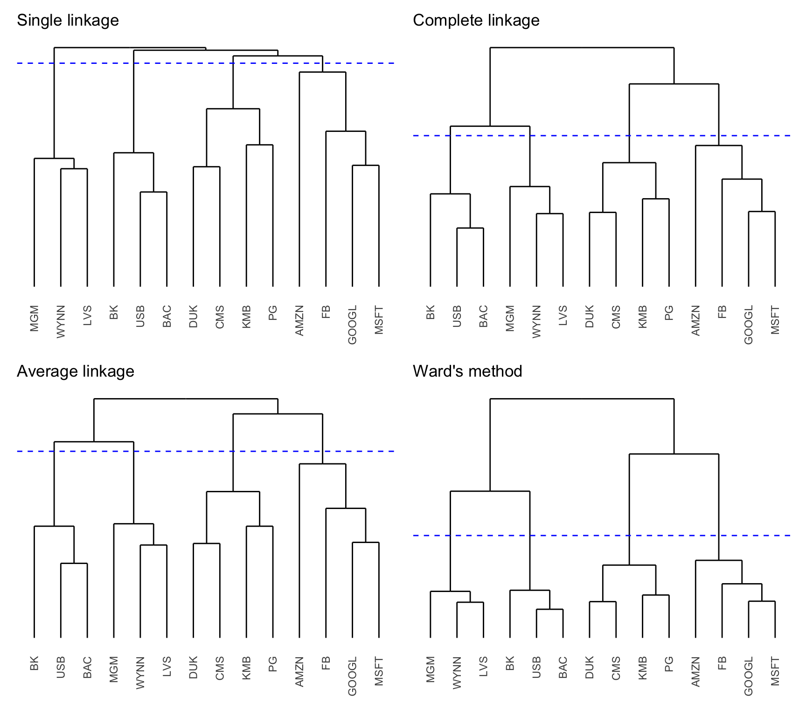
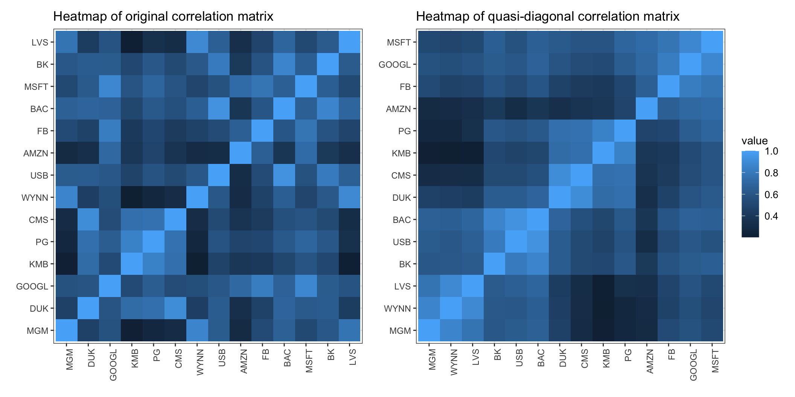
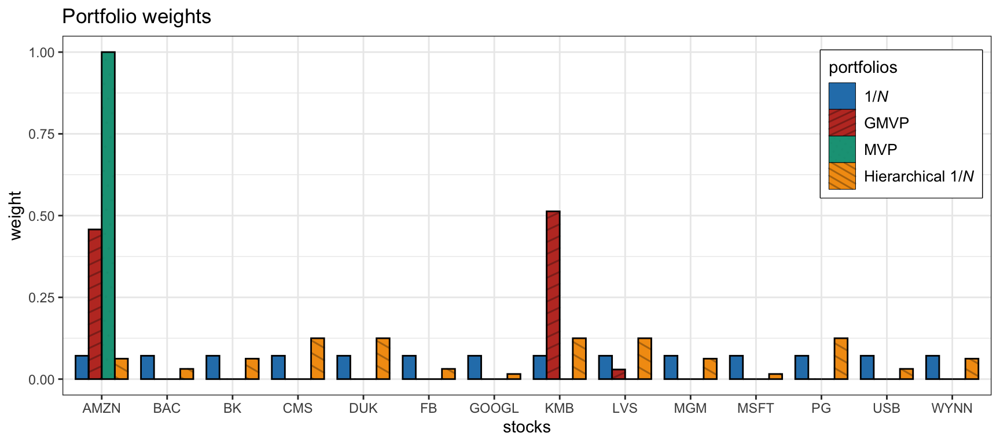
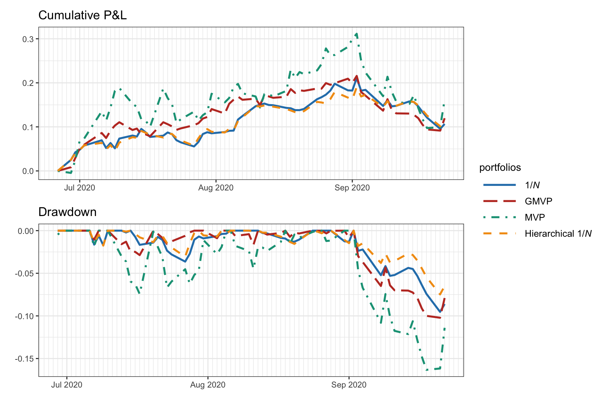
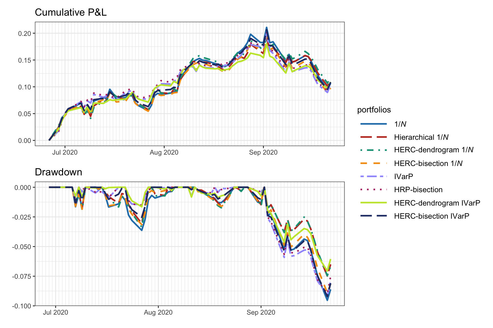
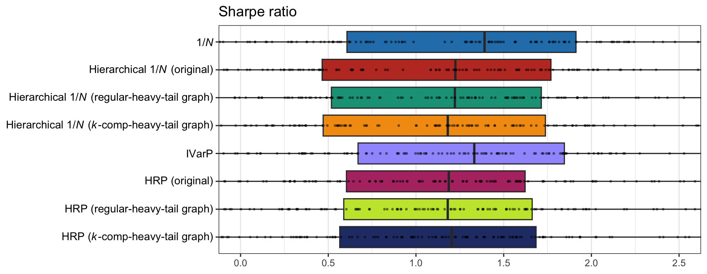
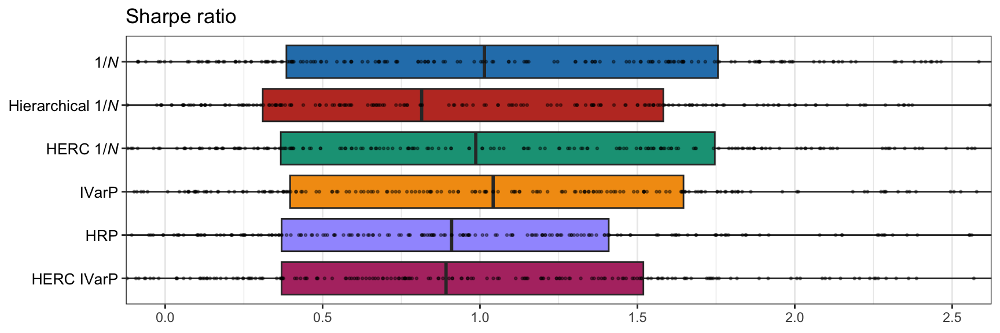

# Graph-Based Portfolios {#graph-based-portfolios}

> Too much and too little wine. Give him none, he cannot find truth; give him too much, the same.
>
> --- Blaise Pascal, _Pensées_

\afterquotespace
\acknowledgementCUP

Amid an overload of information in the modern era, graphs provide a convenient and compact way to represent big data, analyze the structure of large networks, and extract patterns that may otherwise go unnoticed. In the context of financial data, graphs of assets provide key information for modern portfolio design that may be incorporated, for example, into the basic mean--variance portfolio formulation (which obtains the portfolio as a trade-off between the expected return and the risk measured by the variance). Nevertheless, exactly how to use this graph information in the portfolio optimization process is still an open question. This chapter explores some attempts in the literature.

  This material has been published as:
  Daniel P. Palomar (2025). _Portfolio Optimization: Theory and Application_. Cambridge University Press.
  This version is free to view and download for personal use only; not for re-distribution, re-sale, or use in derivative works. ©\ Daniel P. Palomar 2025.

## Introduction
Markowitz's mean--variance portfolio [@Markowitz1952] formulates the portfolio design as a trade-off between the expected return $\w^\T\bmu$ and the risk measured by the variance $\w^\T\bSigma\w$ (see Chapter\ \@ref(MPT) for details):
$$
  \begin{array}{ll}
  \underset{\w}{\textm{maximize}} & \w^\T\bmu - \frac{\lambda}{2}\w^\T\bSigma\w\\
  \textm{subject to} & \w \in \mathcal{W},
  \end{array}
$$
where $\lambda$ is a hyper-parameter that controls the investor's risk-aversion and $\mathcal{W}$ denotes an arbitrary constraint set, such as $\mathcal{W} = \{\w \mid \bm{1}^\T\w=1, \w\ge\bm{0} \}$.

Unfortunately, Markowitz's mean--variance portfolio is severely affected by the ever-present estimation errors in the mean vector $\bmu$ and covariance matrix $\bSigma$. The question is whether this portfolio design can be improved with knowledge of the graph of assets by somehow capitalizing on the key connections revealed by the graph connectivity pattern.

<!---
https://hudsonthames.org/beyond-risk-parity-the-hierarchical-equal-risk-contribution-algorithm/
https://hudsonthames.org/portfolio-optimisation-with-portfoliolab-hierarchical-equal-risk-contribution/
--->

### Graphs and Distance Matrices
Graph-based portfolios are constructed from the graph information of the assets, which can be conveniently encoded in the form of a distance matrix containing the distance between each pair of assets. There are numerous methods to acquire this graph information. We start with two simple approaches and then consider two more sophisticated graph estimation methods from Chapter\ \@ref(graph-modeling).

A popular and simple way to obtain a distance matrix $\bm{D}$ is directly from the assets' correlations [@Mantegna1999] as
\begin{equation}
  D_{ij} = \sqrt{\frac{1}{2}(1 - \rho_{ij})},
  (\#eq:corr-distance-matrix)
\end{equation}
where $\rho_{ij}$ is the correlation between assets $i$ and $j$; an alternative is $D_{ij} = 1 - \rho_{ij}^2$. This is equivalent to the Euclidean distance between the standardized columns of the data matrix $\bm{X}.$ In more detail, denote the de-meaned and normalized $i$th column of the data matrix by $\tilde{\bm{x}}_i = (\bm{x}_i - \mu_i)/\sigma_i,$ where $\mu_i$ and $\sigma_i$ are the mean and volatility of $\bm{x}_i$, respectively. Then, the empirical value of the correlation can be written as $\rho_{ij} = \frac{1}{T}\tilde{\bm{x}}_i^\T\tilde{\bm{x}}_j$, where $T$ is the number of observations, and the normalized squared Euclidean distance between $\tilde{\bm{x}}_i$ and $\tilde{\bm{x}}_j$ is $\frac{1}{T}\|\tilde{\bm{x}}_i - \tilde{\bm{x}}_j\|_2^2 = 2(1 - \rho_{ij}),$ which coincides with $D_{ij}$ in \@ref(eq:corr-distance-matrix) up to a scaling factor. Needless to say, other distance functions could be used to compute the distance matrix; for example, the $p$-norm or Minkowski metric $D_{ij} = \|\tilde{\bm{x}}_i - \tilde{\bm{x}}_j\|_p,$ where $\|\bm{a}\|_p \triangleq \left(\sum_{t=1}^T |a_i|^p\right)^{1/p}$, which for $p=1$ becomes the Manhattan distance and for $p=2$ the Euclidean distance.

A drawback of such a correlation-based distance matrix is that each element only contains information involving two assets, ignoring the rest of the assets. A more holistic definition is to compute a new distance matrix $\tilde{\bm{D}}$ with elements containing the Euclidean distance between pairs of columns of $\bm{D}$ [@DePrado2016]:
\begin{equation}
  \tilde{D}_{ij} = \|\bm{d}_i - \bm{d}_j\|_2,
  (\#eq:corr-distance2-matrix)
\end{equation}
where $\bm{d}_i$ is the $i$th column of $\bm{D}$. Thus, each element of $\tilde{\bm{D}}$ is a function of the entire correlation matrix rather than a particular correlation value like in $\bm{D}$. In other words, $D_{ij}$ is the distance between two assets while $\tilde{D}_{ij}$ indicates the closeness in similarity of these assets with the rest of the universe.

::: {.example #toy-distance-matrices name="Distance matrix of a toy example"}
Consider the following correlation matrix of three variables [@DePrado2016]:
$$
\bm{C}=\begin{bmatrix}
1   & 0.7 & 0.2\\
0.7 & 1   & -0.2\\
0.2 & -0.2   & 1
\end{bmatrix}.
$$
The corresponding correlation-based distance matrix \@ref(eq:corr-distance-matrix) is
$$
\bm{D}=\begin{bmatrix}
0      & 0.3873 & 0.6325\\
0.3873 & 0      & 0.7746\\
0.6325 & 0.7746 & 0
\end{bmatrix}
$$
and the Euclidean distance matrix of correlation distances \@ref(eq:corr-distance2-matrix) is
$$
\tilde{\bm{D}}=\begin{bmatrix}
0      & 0.5659 & 0.9747\\
0.5659 & 0      & 1.1225\\
0.9747 & 1.1225 & 0
\end{bmatrix}.
$$
:::

\index{graphs!financial graphs}
As an alternative to these heuristic definitions of graph distance matrices, Chapter\ \@ref(graph-modeling) offers an extensive overview of graphs and presents a wide variety of graph estimation methods derived from data. For financial time series corresponding to $T$ observations of $N$ assets, with the observations denoted $\bm{x}^{(t)} \in \R^N$, for $t=1,\dots,T,$ the recommended methods in Section\ \@ref(summary-financial-graphs) are:[^R-package-fingraph]

[^R-package-fingraph]: The R package [`fingraph`](https://github.com/convexfi/fingraph), based on @CardosoYingPalomar_NeurIPS2021, contains efficient implementations for the two formulations \@ref(eq:regular-heavy-tail-graph) and \@ref(eq:kcomp-heavy-tail-graph); namely, the functions `learn_regular_heavytail_graph()` for the heavy-tailed MRF \@ref(eq:regular-heavy-tail-graph) and `learn_kcomp_heavytail_graph()` for the $k$-component heavy-tailed MRF \@ref(eq:kcomp-heavy-tail-graph) [@fingraph]. \index{R packages!fingraph}

\index{graphs!heavy-tailed graph}
\index{graphs!heavy-tailed Markow random field (MRF) graph}

- _Heavy-tailed Markov random field (MRF) with degree control_ in \@ref(eq:heavy-tail-graph-problem) [@CardosoYingPalomar_NeurIPS2021]:
\begin{equation}
  \begin{array}{ll}
  \underset{\bm{w}\geq\bm{0}}{\textm{maximize}} 
  & \begin{aligned}[t] \textm{log gdet}(\mathcal{L}(\bm{w})) - \frac{N+\nu}{T}\sum_{t=1}^T \textm{log}\left(\nu + (\bm{x}^{(t)})^\T\mathcal{L}(\bm{w})\bm{x}^{(t)}\right) \end{aligned}\\
  \textm{subject to} 
  & \mathfrak{d}(\bm{w}) = \bm{1},
  \end{array}
  (\#eq:regular-heavy-tail-graph)
\end{equation}
where $\textm{gdet}(\cdot)$ denotes the generalized determinant of a matrix (defined as the product of nonzero eigenvalues), the weight vector $\bm{w}$ is a compact representation of the graph information, $\mathcal{L}(\bm{w})$ is the Laplacian operator that produces the Laplacian matrix $\bm{L}$ from the weights, $\mathfrak{d}(\bm{w})$ is the degree operator that gives the degrees of the nodes, and $\nu$ is a hyper-parameter that controls the degree of heavy-tailness.

\index{graphs!heavy-tailed graph}
\index{graphs!$k$-component graph}

- _$k$-component heavy-tailed MRF with degree control_ [@CardosoYingPalomar_NeurIPS2021]:
\begin{equation}
  \begin{array}{cl}
  \underset{\bm{w}\geq\bm{0}, \bm{F}\in\R^{N\times k}}{\textm{maximize}} 
  & \begin{aligned}[t] \textm{log gdet}(\mathcal{L}(\bm{w})) - \frac{N+\nu}{T}\sum_{t=1}^T \textm{log}\left(\nu + (\bm{x}^{(t)})^\T\mathcal{L}(\bm{w})\bm{x}^{(t)}\right)\\ + \gamma \textm{Tr}\left(\bm{F}^\T\mathcal{L}(\bm{w})\bm{F}\right) \end{aligned}\\
  \textm{subject to} 
  & \mathfrak{d}(\bm{w}) = \bm{1}, \quad \bm{F}^\T\bm{F}=\bm{I},
  \end{array}
  (\#eq:kcomp-heavy-tail-graph)
\end{equation}
which incorporates the regularization term $\textm{Tr}(\bm{F}^\T\mathcal{L}(\bm{w})\bm{F})$, controlled by the hyper-parameter $\gamma$; the additional variable $\bm{F}$ is to enforce the low-rank property in the Laplacian matrix (i.e., enforce $\bm{L} = \mathcal{L}(\bm{w})$ to be rank $N-k)$, which corresponds to a $k$-component graph, that is, a graph with $k$ clusters.

After solving these graph learning formulations, the result is contained in the graph Laplacian matrix $\bm{L}=\mathcal{L}(\bm{w})$, from which a matrix akin to the correlation matrix can be obtained as
$$\bm{C} = \textm{abs}(\bm{L}),$$ 
where $\textm{abs}(\cdot)$ denotes the elementwise absolute value (basically, it keeps the diagonal elements equal to 1 and makes the off-diagonal elements nonnegative). Then, the distance matrix can be obtained as in \@ref(eq:corr-distance-matrix): $D_{ij} = \sqrt{\frac{1}{2}(1 - C_{ij})}$.

## Hierarchical Clustering and Dendrograms
_Clustering_ is a multivariate statistical data analysis used in many fields, including machine learning, data mining, pattern recognition, bioinformatics, and financial markets. It is an unsupervised classification method that groups elements into clusters of similar characteristics based on the data.

\index{hierarchical clustering}
_Hierarchical clustering_ refers to the formation of a recursive nested clustering. It builds a binary tree of data points that represents nested groups of similar points based on a measure of distance. On the other hand, _partitional clustering_ finds all the clusters simultaneously as a partition of the data points without imposing any hierarchical structure. One benefit of hierarchical clustering is that it allows exploring data on different levels of granularity.

\index{dendrogram}
A _dendrogram_ is simply a visual representation of such a tree that encodes the successive or hierarchical clustering. It provides a highly interpretable complete description of the hierarchical clustering in a graphical format. This is one of the main reasons for the popularity of hierarchical clustering methods. For instance, in Example \@ref(exm:toy-distance-matrices), items #1 and #2 have the smallest distance of $0.5659$ and would be clustered together first, followed by item #3. This is illustrated in the dendrogram in Figure\ \@ref(fig:dendrogram-toy-example), which shows in a tree structure this bottom-up hierarchical clustering process.

(ref:dendrogram-toy-example) Dendrogram of toy Example \@ref(exm:toy-distance-matrices).

(\#fig:dendrogram-toy-example)(ref:dendrogram-toy-example)

### Basic Procedure
Hierarchical clustering requires a distance matrix $\bm{D}$ and proceeds to sequentially cluster items based on distance [@HastieTibshiraniFriedman2009; @JamesWittenHastieTibshirani2013]. Strategies for hierarchical clustering can be divided into two basic paradigms: agglomerative (bottom-up) and divisive (top-down). Bottom-up strategies start with every item representing a singleton cluster and then combine the clusters sequentially, reducing the number of clusters at each step until only one cluster is left. Alternatively, top-down strategies start with all the items in one cluster and recursively divide each cluster into smaller clusters. Each level of the hierarchy represents a particular grouping of the data into disjoint clusters of observations. The entire hierarchy represents an ordered sequence of such groupings. 

Consider the bottom-up approach in which, at each step, the two closest (least dissimilar) clusters are merged into a single cluster, producing one less cluster at the next higher level. This process requires a measure of dissimilarity between two clusters and different definitions of the distance between clusters can produce radically different dendrograms. In addition, there are different ways to merge the clusters, termed _linkage clustering_; most notably:[^linkage]

- _single linkage_: the distance between two clusters is the minimum distance between any two points in the clusters, which is related to the so-called minimum spanning tree;

- _complete linkage_:  the distance between two clusters is the maximum of the distance between any two points in the clusters;

- _average linkage_:  the distance between two clusters is the average of the distance between any two points in the clusters; and

- _Ward's method_: the distance between two clusters is the increase of the squared error from when two clusters are merged, which is related to distances between centroids of clusters [@Ward1963].

[^linkage]: Hierarchical clustering is a fundamental method available in most programming languages; for example, the base function `hclust()` in R and the method `scipy.cluster.hierarchy.linkage()` from the Python library `scipy`. \index{Python packages!scipy}

The effect of the linkage clustering method is very important as it significantly affects the hierarchical clustering obtained [@Raffinot2017]. Single linkage tends to produce a "chaining" effect in the tree (described in Section\ \@ref(hierarchical-1overN)) and an imbalance of large and small groups, whereas complete linkage typically produces more balanced groups, and average linkage is an intermediate case. Ward's method often produces similar results to average linkage. Figure\ \@ref(fig:dendrograms-sp500) shows the dendrograms corresponding to the four different linkage methods for some S&P 500 stocks corresponding to different sectors during 2015--2020. Various numbers of clusters can be achieved by cutting the tree at distinct heights; for instance, four clusters can be acquired through suitable cuts, although they differ depending on the linkage methods used.

(\#fig:dendrograms-sp500)Dendrograms of S\&P 500 stocks (with cut to produce four clusters).

### Number of Clusters
Traversing the dendrogram top-down, one starts with a giant cluster containing all the items all the way down to $N$ singleton clusters, each containing a single item. In practice, however, it may not be necessary or convenient to deal with $N$ singleton clusters, in order to avoid overfitting of the data.

Representing the data by fewer clusters necessarily loses certain fine details, but achieves simplification. However, choosing the best number of clusters is not easy: too few clusters and the algorithm may fail to find true patterns; too many clusters and it may discover spurious patterns that do not really exist. Thus, it is convenient to have an automatic way of detecting the most appropriate number of clusters to avoid overfitting.
 
One popular way to determine the number of clusters is the so-called _gap statistic_ [@TibshiraniWaltherHastie2001]. Basically, it compares the logarithm of the empirical within-cluster dissimilarity and the corresponding one for uniformly distributed data, which is a distribution with no obvious clustering.

<!---
Perhaps include plot like here: 
https://hudsonthames.org/portfolio-optimisation-with-portfoliolab-hierarchical-equal-risk-contribution/
--->

### Quasi-diagonalization of Correlation Matrix
Hierarchical clustering can be used to reorder the items in the correlation matrix so that similar assets (i.e., items that cluster early) are placed closer to each other, whereas dissimilar assets are placed far apart. This is called _matrix seriation_ or _matrix quasi-diagonalization_ and it is a very old statistical technique used to rearrange the data to show the inherent clusters clearly. This rearranges the original correlation matrix of assets into a quasi-diagonal correlation matrix, revealing similar assets as blocks along the main diagonal, whereas the correlation matrix of the original randomly ordered items presents no visual pattern.

To illustrate this process, Figure\ \@ref(fig:heatmaps-sp500) shows the heatmaps of the original correlation matrix (with randomly ordered stocks) and the quasi-diagonal version (i.e., after a reordering of the stocks to better visualize the correlated stocks along the diagonal blocks) based on the hierarchical clustering (using single linkage). From the quasi-digonal correlation matrix one can clearly identify four clusters, which can also be observed in the dendrograms in Figure\ \@ref(fig:dendrograms-sp500).

(\#fig:heatmaps-sp500)Effect of seriation in the correlation matrix of S\&P 500 stocks.

## Hierarchical Clustering-Based Portfolios
An alternative to using the noisy estimates of the mean vector $\bmu$ and covariance matrix $\bSigma$ in the mean--variance formulation is to design portfolios based on the graph of assets. This may produce more robust portfolios, more diversified, and with better risk-adjusted performance. Indeed, once the assets are hierarchically clustered, a variety of portfolios can be conveniently designed without relying so much on the noisy estimates of the mean vector and covariance matrix. 

Hierarchical clustering aims to achieve diversification by a mechanism that distributes capital weights appropriately across the hierarchically nested clusters. The diversification scheme indicates which stocks are isolated far away from the bulk of stocks and should receive a higher weight as they are contributors to diversification. The whole process can be visualized based on the hierarchical tree layout.

The general description of hierarchical clustering-based portfolios is simple. The idea is to start with the total capital at the top and then proceed to allocate the capital through the hierarchical clustering along the dendrogram in a top-down manner. The starting point is the top giant cluster, which contains all the items, and the method proceeds down sequentially, where each cluster is successively divided into two sub-clusters. Every time a cluster is divided into two sub-clusters, the weight of the cluster has to be split into the two sub-clusters and the portfolios for the sub-clusters have to be designed.

\index{hierarchical clustering portfolios}
\index{portfolios!hierarchical clustering based}
\index{hierarchical clustering portfolios|seealso{portfolios}}
The different hierarchical clustering-based portfolios (considered next in detail) are fully described by the following characteristics:

1. _distance matrix_: used to define the graph (e.g., correlation-based distance matrix in \@ref(eq:corr-distance-matrix), distance matrix of the columns of such distance matrix as in \@ref(eq:corr-distance2-matrix), or obtained from some more sophisticated graph learning procedure);
2. _linkage method_: employed in the hierarchical clustering process (e.g., single, complete, average, or Ward);
3. _clustering stopping criterion_: used to stop the hierarchical clustering process (e.g., all the way down to single-item clusters or early stopping based on the gap statistic); 
4. _splitting criterion_: to recursively split the assets (e.g., simply bisection or based on the dendrogram);
5. _intra-weight allocation_: used within clusters; and
6. _inter-weight allocation_: used across clusters.

The following subsections explore in detail several hierarchical clustering-based portfolios, namely, the hierarchical $1/N$ portfolio, the hierarchical risk parity portfolio, and the hierarchical equal risk contribution portfolio.

### Hierarchical $1/N$ Portfolio {#hierarchical-1overN}
\index{portfolios!hierarchical clustering based!hierarchical $1/N$ portfolio}
\index{portfolios!hierarchical clustering based!cluster-based waterfall portfolio}
In 2011, a simple graph-based portfolio termed the _cluster-based waterfall portfolio_ was proposed in @Papenbrock2011. The approach is based on the hierarchical tree obtained from the correlation-based distance matrix in \@ref(eq:corr-distance-matrix). The allocation process goes over the dendrogram in a top-down manner, splitting the weights equally at each splitting point (i.e., the $1/N$ portfolio or equally weighted portfolio from Section\ \@ref(EWP)). Figure\ \@ref(fig:hierarchical-1overN-allocation) illustrates this top-down process of equal weight splitting.

(ref:hierarchical-1overN-allocation) Illustration of the hierarchical $1/N$ portfolio construction in a top-down manner.

(\#fig:hierarchical-1overN-allocation)(ref:hierarchical-1overN-allocation)

It is important to realize that the choice of linkage method has a significant effect on the concentration of the weight allocation, as illustrated in Figure\ \@ref(fig:chaining-effect-allocation). Basically, single linkage suffers from the "chaining" effect by which assets are branched out one by one, resulting in very high weights on some stocks; complete linkage produces more even groups and weights; average linkage lies somewhere in between, and Ward's method is similar to complete linkage producing slightly even more balanced groups and more equal weights. Note that the regular $1/N$ portfolio lies on the extreme of totally equalized weights, which amounts to not using any graph information at all, and is hence referred to as the _naive $1/N$_ portfolio, as opposed to the hierarchical $1/N$ portfolio, which is based on the graph information.

(ref:chaining-effect-allocation) Chaining effect of different linkage methods on the hierarchical $1/N$ allocation.

(\#fig:chaining-effect-allocation)(ref:chaining-effect-allocation)

Summary of the hierarchical $1/N$ portfolio [@Papenbrock2011]:

1. _distance matrix_: correlation-based distance matrix $D_{ij} = \sqrt{\frac{1}{2}(1 - \rho_{ij})}$ as in \@ref(eq:corr-distance-matrix);
2. _linkage method_: recommended methods are single linkage (for high-risk investors willing to take high stakes in single assets) and Ward's method (for risk-averse investors with less concentration on single assets);
3. _clustering stopping criterion_: all the way down to single-item clusters; 
4. _splitting criterion_: following the dendrogram;
5. _intra-weight allocation_: $1/N$ portfolio; and
6. _inter-weight allocation_: $1/N$ portfolio with $N=2$, that is, 50%--50% split at each branching.

#### Numerical Results {-}

We compare different versions of the hierarchical $1/N$ portfolio along with some benchmarks. We first compare the hierarchical $1/N$ portfolio with the four different linkage methods along with the naive $1/N$ portfolio (illustrated in Figure\ \@ref(fig:chaining-effect-allocation)). Figure\ \@ref(fig:allocation-H1overN-linkage) shows the portfolio weights: in this particular case the average linkage coincides with Ward's method. Figure\ \@ref(fig:PnL-drawdown-H1overN-linkage) shows the cumulative P&L and drawdown of the portfolios for a single illustrative backtest: as already indicated in the original publication [@Papenbrock2011], Ward's method is a good choice and will be used subsequently.

(\#fig:allocation-H1overN-linkage)Portfolio allocation of hierarchical $1/N$ portfolios with different linkage methods.

(\#fig:PnL-drawdown-H1overN-linkage)Backtest performance of hierarchical $1/N$ portfolios with different linkage methods.

Now we compare the use of the correlation-based distance matrix in \@ref(eq:corr-distance-matrix), which was the choice in @Papenbrock2011, with the correlation-based distance-of-distance matrix in \@ref(eq:corr-distance2-matrix), as used in @DePrado2016, as well as the graphs estimated via \@ref(eq:regular-heavy-tail-graph) and \@ref(eq:kcomp-heavy-tail-graph). Figure\ \@ref(fig:allocation-H1overN-dist-vs-dist2) compares the portfolio allocations, whereas Figure\ \@ref(fig:PnL-drawdown-H1overN-dist-vs-dist2) shows the cumulative P&L and drawdown of the portfolios for a single illustrative backtest. In this particular case, it seems that the simple correlation-based distance-of-distance matrix in \@ref(eq:corr-distance2-matrix) shows a better drawdown, but more exhaustive backtests are necessary before concluding anything.

(\#fig:allocation-H1overN-dist-vs-dist2)Portfolio allocation of hierarchical $1/N$ portfolios with different distance matrices.

(\#fig:PnL-drawdown-H1overN-dist-vs-dist2)Backtest performance of hierarchical $1/N$ portfolios with different distance matrices.

Finally, we compare the selected version of the hierarchical $1/N$ portfolio (using Ward's method for the linkage and the correlation-based distance-of-distance matrix in \@ref(eq:corr-distance2-matrix)) with the following benchmarks: naive $1/N$ portfolio, global minimum variance portfolio (GMVP), and Markowitz mean--variance portfolio (MVP). Figure\ \@ref(fig:allocation-H1overN-comparison) compares the portfolio allocations, from where we can clearly see the difference in diversification. Figure\ \@ref(fig:PnL-drawdown-H1overN-comparison) shows the cumulative P&L and drawdown of the portfolios for a single illustrative backtest: as expected, the MVP shows the worst drawdown (due to the sensitivity to the estimation of $\bmu$), followed by GMVP and $1/N$ portfolio, with the hierarchical $1/N$ portfolio having the mildest drawdown. Nevertheless, the reader is reminded that this is just a single anecdotal backtest and a proper empirical evaluation based on multiple randomized backtests is necessary, as explored further in Section\ \@ref(multiple-backtests-HRP).

(\#fig:allocation-H1overN-comparison)Portfolio allocation of hierarchical $1/N$ portfolio along benchmarks.

(\#fig:PnL-drawdown-H1overN-comparison)Backtest performance of hierarchical $1/N$ portfolio along benchmarks.

### Hierarchical Risk Parity (HRP) Portfolio {#HRP}
\index{portfolios!hierarchical clustering based!hierarchical risk parity (HRP) portfolio}
In 2016, a graph-based portfolio was proposed [@DePrado2016] called the _hierarchical risk parity_ (HRP) portfolio. The method is based on the hierarchical tree obtained from the correlation-based distance-of-distance matrix in \@ref(eq:corr-distance2-matrix) and the single linkage method. The allocation process goes over the dendrogram in a top-down manner, splitting the weights based on the inverse-variance portfolio (IVarP).

Before going into the details of HRP, let us start by recalling that the global minimum variance portfolio with budget constraint is formulated (see Section\ \@ref(GMVP) in Chapter\ \@ref(portfolio-101)) as
$$
  \begin{array}{ll}
  \underset{\w}{\textm{minimize}} & \w^\T\bSigma\w\\
  \textm{subject to} & \w^\T\bm{1} = 1,
  \end{array}
$$
with solution
$$
\w = \frac{\bSigma^{-1}\bm{1}}{\bm{1}^\T\bSigma^{-1}\bm{1}}.
$$
If the covariance matrix $\bSigma$ is diagonal, with diagonal elements denoted by $\bm{\sigma}^2 = \textm{diag}(\bSigma)$, then the solution simplifies to the inverse-variance portfolio:
\begin{equation}
  \w = \frac{\bm{\sigma}^{-2}}{\bm{1}^\T\bm{\sigma}^{-2}},
  (\#eq:IVarP)
\end{equation}
which, for the particular case of $N=2$ assets, becomes
\begin{equation}
  \begin{bmatrix}
  w_1\\
  w_2
  \end{bmatrix} =
  \begin{bmatrix}
  \sigma_1^{-2}/(\sigma_1^{-2} + \sigma_2^{-2})\\
  \sigma_2^{-2}/(\sigma_1^{-2} + \sigma_2^{-2})
  \end{bmatrix} =
  \begin{bmatrix}
  \sigma_2^{2}/(\sigma_1^{2} + \sigma_2^{2})\\
  \sigma_1^{2}/(\sigma_1^{2} + \sigma_2^{2})
  \end{bmatrix}.
  (\#eq:IVarP-2assets)
\end{equation}

We are now ready to go over the HRP portfolio design process. Similarly to the hierarchical $1/N$ portfolio, the allocation process goes over the dendrogram in a top-down manner, splitting the weights at each splitting point. A first difference in the HRP method proposed in @DePrado2016 is that the splitting is based on bisection (i.e., dividing the items into two halves) rather than the natural structure given by the dendrogram, as illustrated in Figure\ \@ref(fig:bisection-vs-dendrogram-splitting). With bisection splitting, the dendrogram still contributes with the ordering of the assets. A priori, one cannot say which of the two methods will perform better and this will be empirically evaluated later. The second main difference is that instead of basing the weight splitting on the $1/N$ portfolio with $N=2$, which leads to a 50%--50% split of the budget, the weight splitting is based on the IVarP with $N=2$ in \@ref(eq:IVarP-2assets). In order to compute the variances of the two branches $\sigma_1^{2}$ and $\sigma_2^{2}$, the method uses, at each branch, the IVarP \@ref(eq:IVarP) (which presumably is not too far from the optimal GMVP since we are dealing with a quasi-diagonal matrix). Algorithm 12.1 formalizes HRP portfolio construction.

(\#fig:bisection-vs-dendrogram-splitting)Comparison of bisection splitting and dendrogram-based splitting.

Summary of the HRP portfolio [@DePrado2016]:

1. _distance matrix_: correlation-based distance-of-distance matrix in \@ref(eq:corr-distance2-matrix);
2. _linkage method_: single linkage;
3. _clustering stopping criterion_: all the way down to single-item clusters; 
4. _splitting criterion_: directly bisection ignoring the grouping sizes from the dendrogram;
5. _intra-weight allocation_: IVarP; and
6. _inter-weight allocation_: IVarP for $N=2$ as in \@ref(eq:IVarP-2assets).

The HRP portfolio can be interpreted as a refined version of the inverse-variance portfolio. Indeed, at each step, given two subsets, the portfolio weights are scaled based on the inverse of the variances while ignoring the correlation between the subsets (presumably these subsets are not highly correlated). The only point where correlations are considered is in the computation of the variances of each of the subsets. In fact, when the covariance matrix is diagonal, then the inverse-variance portfolio, the global minimum variance portfolio, and the HRP portfolio coincide. A connection between the HRP portfolio and the minimum-variance portfolio is further outlined in Section\ \@ref(HRP-vs-GMVP).

:::: plain_algorithm
::: lined
**Algorithm 12.1**: HRP portfolio.
:::
Initialize list of groups of items $\mathcal{L} = \{L_0\}$, with $L_0 = \{1,\dots,N\}$, and unit weights $\w = \bm{1}$;

**repeat** for each tuple $L_i \in \mathcal{L}$ with $|L_i| > 1$:

1. Partition $L_i$ into two subsets, $L_i^{(1)}$ and $L_i^{(2)}$; two options are:
  
   - bisection split: following the dendrogram ordering, simply split it into two subsets of approximately equal size: $|L_i^{(1)}| = \textm{round}(|L_i|/2)$;
    
   - dendrogram split: follow the dendrogram split of this set into two subsets (i.e., not only ordering but size of subsets too);

2. Define the variance of each subset $L_i^{(j)}, j=1,2$, as ${\tilde{\sigma}_i^2}^{(j)} = \tilde{\w}_i^{(j)\T}\bSigma_i^{(j)}\tilde{\w}_i^{(j)}$, where $\bSigma_i^{(j)}$ is the covariance matrix of the elements in $L_i^{(j)}$ and $\tilde{\w}_i^{(j)}$ is the inverse-variance portfolio in \@ref(eq:IVarP);
    
3. Compute the split factor as in \@ref(eq:IVarP-2assets): $\alpha_i = {\tilde{\sigma}_i^2}^{(2)}/({\tilde{\sigma}_i^2}^{(1)} + {\tilde{\sigma}_i^2}^{(2)})$;
  
4. Rescale elements $n \in L_i^{(1)}$ in $\w$ by a factor of $\alpha_i$ and elements $n \in L_i^{(2)}$ in $\w$ by a factor of $(1- \alpha_i)$;

**until** $|L_i| = 1, \forall L_i \in L$;
::::

#### Numerical Results {-}

We now compare the HRP portfolios (both with bisection split and dendrogram split) with the following benchmarks: global minimum variance portfolio (GMVP) and inverse-variance portfolio (IVarP).

Figure\ \@ref(fig:allocation-HRP) shows the portfolio weights. The GMVP concentrates most of the weights into two assets, whereas the rest are more diversified. The HRP portfolios do not differ too much from the IVarP. Figure\ \@ref(fig:PnL-drawdown-HRP) shows the cumulative P&L and drawdown of the portfolios for a single illustrative backtest. The HRP portfolios seem to slightly improve on the IVarP; in addition, the graphs estimated via \@ref(eq:regular-heavy-tail-graph) and \@ref(eq:kcomp-heavy-tail-graph) seem to be better than the correlation-based distance-of-distance matrix in \@ref(eq:corr-distance2-matrix).

(\#fig:allocation-HRP)Portfolio allocation of HRP portfolios and benchmarks.

(\#fig:PnL-drawdown-HRP)Backtest performance of HRP portfolios and benchmarks.

### Hierarchical Equal Risk Contribution (HERC) Portfolio
\index{portfolios!hierarchical clustering based!hierarchical equal risk contribution (HERC) portfolio}
In 2018, a refined and extended version of the hierarchical $1/N$ portfolio of Section\ \@ref(hierarchical-1overN) and the HRP portfolio of Section\ \@ref(HRP) was proposed in [@Raffinot2018] called the _hierarchical equal risk contribution_ (HERC) portfolio. Basically, the two main differences are: 

- Early stopping in the hierarchical clustering to automatically select the appropriate number of clusters based on the gap statistic [@TibshiraniWaltherHastie2001], a technique already used in hierarchical clustering asset allocation [@Raffinot2017], as opposed to clustering all the way down to single assets as typically done in hierarchical clustering.

- Use of a general equal risk contribution to split the weights at each splitting point (which can be based on alternative measures of risk to the variance used in \@ref(eq:IVarP-2assets), such as standard deviation, conditional value-at-risk, conditional drawdown-at-risk, and so on:
\begin{equation}
  \begin{bmatrix}
  w_1\\
  w_2
  \end{bmatrix} =
  \begin{bmatrix}
  \textm{RC}_1/(\textm{RC}_1 + \textm{RC}_2)\\
  \textm{RC}_2/(\textm{RC}_1 + \textm{RC}_2)
  \end{bmatrix},
  (\#eq:ERC-2assets)
\end{equation}
where $\textm{RC}_i$ denotes the risk contribution of of the $i$th cluster. Observe that if $\textm{RC}_i = 1/\sigma_i^{2}$, then we recover \@ref(eq:IVarP-2assets).

The main findings in @Raffinot2018 can be summarized as follows:

> [T]he hierarchical $1/N$ portfolio is difficult to beat, but HERC portfolios based on downside risk measures achieve statistically better risk-adjusted performances, especially those based on the conditional drawdown-at-risk.

Figure\ \@ref(fig:tree-with-gap-statistics) illustrates the effect of early stopping in the hierarchical clustering process with a hierarchical $1/N$ portfolio. In particular a toy dendrogram is considered with five assets grouped into three and two clusters.

(\#fig:tree-with-gap-statistics)Effect of early stopping in the hierarchical clustering process.

<!---
Inspecting the inverse variance allocation in \@ref(eq:IVarP-2assets), the cluster with smaller variance gets a larger weight allocation and vice-versa. 
--->

<!---
In [@Raffinot2017], the hierarchical clustering asset allocation (HCAA) introduced the idea of stopping the hierarchical clustering process once an appropriate number of clusters is obtained via the Gap index method [@TibshiraniWaltherHastie2001]. In other words, instead of executing the hierarchical clustering until each group contains a single asset, the process is stopped early. As for the weight allocation, a variety of methods was considered ranging from the simplest $1/N$ portfolio, as in the hierarchical $1/N$ portfolio [@Papenbrock2011] from Section\ \@ref(hierarchical-1overN), and the inverse variance portfolio, as in the HRP portfolio [@DePrado2016] from Section\ \@ref(HRP), to other risk-based portfolios such as the risk parity portfolio (RPP) (see Chapter\ \@ref(RPP) for details).
--->

Summary of the HERC portfolio [@Raffinot2018]:

1. _distance matrix_: correlation-based distance-of-distance matrix in \@ref(eq:corr-distance2-matrix);
2. _linkage method_: Ward's method;
3. _clustering stopping criterion_: gap statistic [@TibshiraniWaltherHastie2001]; 
4. _splitting criterion_: following the dendrogram;
5. _intra-weight allocation_: $1/N$ portfolio; and
6. _inter-weight allocation_: equal risk constribution as in \@ref(eq:ERC-2assets).

#### Numerical Results {-}
For simplicity, for the weight splitting we simply use the two risk contribution measures, $\textm{RC}_i = 1$ and  $\textm{RC}_i = 1/\sigma_i^{2}$, leading to the 50%--50% split as in the hierarchical $1/N$ portfolio and to \@ref(eq:IVarP-2assets) as in the HRP portfolio.

We now compare the HERC portfolios (both with bisection split and dendrogram split) with the following benchmarks: $1/N$ portfolio, hierarchical $1/N$ portfolio, inverse-variance portfolio (IVarP), and HRP portfolio. Figure\ \@ref(fig:allocation-HERC) shows the portfolio weights, whereas Figure\ \@ref(fig:PnL-drawdown-HERC) shows the cumulative P&L and drawdown of the portfolios for a single illustrative backtest. It is difficult to conclude anything from this single backtest and more exhaustive backtests are necessary.

(\#fig:allocation-HERC)Portfolio allocation of HERC portfolios and benchmarks.

(\#fig:PnL-drawdown-HERC)Backtest performance of HERC portfolios and benchmarks.

### From Portfolio Risk Minimization to Hierarchical Portfolios {#HRP-vs-GMVP}
The essence of the hierarchical portfolios covered in this section lies in successive partitioning of the set of assets with a proper inter-set capital allocation and intra-set portfolio allocation. To be more specific, at each round of this successive partitioning, we partition a set of assets, with covariance matrix $\bSigma$, into two subsets $A$ and $B$, with covariance matrices $\bSigma_A$ and $\bSigma_B$, respectively. Then, the portfolio is constructed as
\begin{equation}
  \w \propto
  \begin{bmatrix}
  \frac{1}{\nu(\bSigma_A)} \w(\bSigma_A)\\[0.2em]
  \frac{1}{\nu(\bSigma_B)} \w(\bSigma_B)
  \end{bmatrix},
  (\#eq:w-2group-hierarchical)
\end{equation}
where $\nu\left(\cdot\right)$ and $\w\left(\cdot\right)$ denote some measure of risk and portfolio construction, respectively, for a set of assets with given covariance matrix. The first component $1/\nu(\cdot)$ provides the capital allocation into the two subsets (inversely proportional to the risk), whereas the second component $\w(\cdot)$ gives the (normalized) portfolio allocation for each subset.

The particular form of $\nu(\cdot)$ and $\w(\cdot)$ in \@ref(eq:w-2group-hierarchical) depends on each type of hierarchical portfolio. For example, in the case of the HRP portfolio covered in Section\ \@ref(HRP):

- the intra-weight (normalized) allocation is given by the inverse-variance portfolio \@ref(eq:IVarP),
$$
\w(\bSigma) = \frac{\bm{\sigma}^{-2}}{\bm{1}^\T \bm{\sigma}^{-2}},
$$
where $\bm{\sigma}^2 = \textm{diag}(\bSigma)$ denotes the variance of the assets, and

- the measure of risk (whose inverse gives the capital or inter-weight allocation) is measured by the variance \@ref(eq:IVarP-2assets),
$$
\nu\left(\bSigma\right) = \w(\bSigma)^\T\,\bSigma\,\w(\bSigma).
$$

However, the basic structure of hierarchical portfolios \@ref(eq:w-2group-hierarchical) is heuristic and suboptimal, which is understandable since the motivation was not optimality but stability against estimation errors. One reason for the lack of optimality can be seen in the fact that the portfolios in each of the two groups, $\w(\bSigma_A)$ and $\w(\bSigma_B)$, are oblivious to each other and the two groups are only jointly adjusted in the final normalization step of \@ref(eq:w-2group-hierarchical) (note the notation $\propto$ which requires a normalization that depends on all the elements). On the other hand, portfolios designed based on the minimization of some properly chosen measure of risk are not heuristic by definition but optimal according to the design criterion. Can we make an explicit connection between the two paradigms? Can we somehow derive an expression similar to \@ref(eq:w-2group-hierarchical) but more formally justified and optimally chosen?

A positive answer was provided in @Cotton2023 as described next. Consider the global minimum variance portfolio (see Section\ \@ref(GMVP) in Chapter\ \@ref(portfolio-101)):
$$
  \begin{array}{ll}
  \underset{\w}{\textm{minimize}} & \w^\T\bSigma\w\\
  \textm{subject to} & \w^\T\bm{1} = 1.
  \end{array}
$$
Interestingly, by partitioning $\bSigma$ as
$$
\bSigma =
  \begin{bmatrix}
  \bSigma_A & \bSigma_{AB}\\
  \bSigma_{BA} & \bSigma_{B}
  \end{bmatrix},
$$
the optimal solution can be written (up to a scaling factor) in a form reminiscent to \@ref(eq:w-2group-hierarchical) as
$$
\w \propto \bSigma^{-1}\bm{1} = 
  \begin{bmatrix}
  (\bSigma_A^\textm{c})^{-1} \bm{b}_A\\
  (\bSigma_B^\textm{c})^{-1} \bm{b}_B
  \end{bmatrix},
$$
where $\bSigma_A^\textm{c}$ and $\bSigma_B^\textm{c}$ are the Schur complements of $\bSigma_A$ and $\bSigma_B$,[^schur-complement] respectively,
$$
  \begin{aligned}
  \bSigma_A^\textm{c} &= \bSigma_A - \bSigma_{AB}\bSigma_B^{-1}\bSigma_{BA},\\
  \bSigma_B^\textm{c} &= \bSigma_B - \bSigma_{BA}\bSigma_A^{-1}\bSigma_{AB},
  \end{aligned}
$$
and
$$
\begin{aligned}
  \bm{b}_A &= \bm{1} - \bSigma_{AB}\bSigma_B^{-1}\bm{1},\\
  \bm{b}_B &= \bm{1} - \bSigma_{BA}\bSigma_A^{-1}\bm{1}.
\end{aligned}
$$

[^schur-complement]: The Schur complement of a block matrix is a key tool in the fields of numerical analysis, statistics, and matrix analysis. For our motivation, it suffices to know that it naturally appears in the inverse of a $2\times2$ matrix:
$$
  \begin{bmatrix}
  \bSigma_A & \bSigma_{AB}\\
  \bSigma_{BA} & \bSigma_{B}
  \end{bmatrix}^{-1} = 
  \begin{bmatrix}
  \big(\bSigma_A - \bSigma_{AB}\bSigma_B^{-1}\bSigma_{BA}\big)^{-1} & 0\\
  0 & \big(\bSigma_B - \bSigma_{BA}\bSigma_A^{-1}\bSigma_{AB}\big)^{-1}
  \end{bmatrix}
  \cdot
  \begin{bmatrix}
  \bm{I} & -\bSigma_{AB}\bSigma_B^{-1}\\
  \bSigma_{BA}\bSigma_A^{-1} & \bm{I}
  \end{bmatrix}.
$$

<!---$$
\begin{array}{l}
  \begin{bmatrix}
  \bSigma_A & \bSigma_{AB}\\
  \bSigma_{BA} & \bSigma_{B}
  \end{bmatrix}^{-1} = \\
  \qquad\begin{bmatrix}
  \left(\bSigma_A - \bSigma_{AB}\bSigma_B^{-1}\bSigma_{BA}\right)^{-1} & 0\\
  0 & \left(\bSigma_B - \bSigma_{BA}\bSigma_A^{-1}\bSigma_{AB}\right)^{-1}
  \end{bmatrix}
  \begin{bmatrix}
  \bm{I} & -\bSigma_{AB}\bSigma_B^{-1}\\
  \bSigma_{BA}\bSigma_A^{-1} & \bm{I}
  \end{bmatrix}.
\end{array}
$$--->

Finally, this optimal solution can be further rewritten in a form similar to \@ref(eq:w-2group-hierarchical) as
\begin{equation}
  \w \propto
  \begin{bmatrix}
  \frac{1}{\nu(\bSigma_A^\textm{c}, \bm{b}_A)} \w(\bSigma_A^\textm{c}, \bm{b}_A)\\[0.5em]
  \frac{1}{\nu(\bSigma_B^\textm{c}, \bm{b}_B)} \w(\bSigma_B^\textm{c}, \bm{b}_B)
  \end{bmatrix},
  (\#eq:w-2group-GMVP)
\end{equation}
where the (normalized) allocation is
$$
\w(\bSigma, \bm{b}) = \frac{\bSigma^{-1}\bm{b}}{\bm{b}^\T\bSigma^{-1}\bm{b}}
$$
and the measure of risk is
$$
\nu(\bSigma, \bm{b}) = \left(\w(\bSigma, \bm{b})\right)^\T\bSigma\,\w(\bSigma, \bm{b}) = \frac{1}{\bm{b}^\T\bSigma^{-1}\bm{b}}.
$$

At this point it is important to realize that optimal portfolio in \@ref(eq:w-2group-GMVP) becomes a hierarchical portfolio \@ref(eq:w-2group-hierarchical) if one replaces $\bSigma_A^\textm{c} \rightarrow \bSigma_A$ and $\bm{b}_A \rightarrow \bm{1}$ (and similarly for $\bSigma_B^\textm{c}$ and $\bm{b}_B$). This observation naturally leads to the idea of transitioning from one set of parameters to the other in a smooth way to provide a continuum ranging from a hierarchical portfolio to a minimum risk portfolio as some scalar parameter $\gamma$ goes from 0 to 1. There are multiple ways of doing such a smooth transition; some examples include:

- convex combination:
$$
  \begin{aligned}
  \bSigma_A^{(\gamma)} &= (1 - \gamma) \bSigma_A + \gamma \bSigma_A^\textm{c} = \bSigma_A - \gamma \bSigma_{AB}\bSigma_B^{-1}\bSigma_{BA},\\
  \bm{b}_A^{(\gamma)}  &= (1 - \gamma) \bm{1}    + \gamma \bm{b}_A    = \bm{1}    - \gamma \bSigma_{AB}\bSigma_B^{-1}\bm{1};
  \end{aligned}
$$

- geodesic-convex combination [@Wiesel2012b]:
$$
  \begin{aligned}
  \bSigma_A^{(\gamma)} &= \bSigma_A^{1/2} \left(\bSigma_A^{-1/2} \bSigma_A^\textm{c} \bSigma_A^{-1/2}\right)^\gamma \bSigma_A^{1/2},\\
  \bm{b}_A^{(\gamma)}  &= \bm{b}_A^\gamma,
  \end{aligned}
$$
where the matrix power is defined via the power of the eigenvalues.

## Numerical Experiments {#multiple-backtests-HRP}
After looking at several graph-based portfolios and observing their performance over single backtests, we now resort to an empirical evaluation based on multiple randomized backtests. In particular, we take a dataset of the S&P 500 stocks over the period 2015--2020 and generate 200 resamples each with $N=50$ randomly selected stocks and a random period of two years. Then, for each resample, we perform a walk-forward backtest with a lookback window of one year, reoptimizing the portfolio every month. Note that more exhaustive backtests should be conducted with a wide variety of data before drawing any firm conclusion.

### Splitting: Bisection vs. Dendrogram
We start by comparing the two splitting methods considered: direct bisection (after reordering the assets with the dendrogram) and following the natural splits of the dendrogram, as illustrated in Figure\ \@ref(fig:bisection-vs-dendrogram-splitting). In principle, one may expect that following the natural dendrogram should be more faithful to the structure in the actual data as opposed to bisection, which somehow breaks the dendrogram. Interestingly, the empirical evaluation in Figure\ \@ref(fig:graph-based-portfolios-boxplots-splitting) seems to suggest otherwise. One possible explanation is that bisection provides more balanced clusters while still using the reordering information provided by the dendrogram.

(\#fig:graph-based-portfolios-boxplots-splitting)Comparison of graph-based portfolios: bisection vs. dendrogram splitting.

### Graph Estimation: Simple vs. Sophisticated
Then we evaluate whether the more sophisticated graph estimation methods can bring any benefit to the portfolios. In principle, one may expect a positive answer, but the empirical results in Figure\ \@ref(fig:graph-based-portfolios-comparison-boxplots-graphs) show that this is not so clear and further analysis is required.

(\#fig:graph-based-portfolios-comparison-boxplots-graphs)Comparison of graph-based portfolios: simple vs. sophisticated graph learning methods.

### Final Comparison
Finally, we perform a comparison of the graph-based portfolios (using the simple graph-based distance-of-distance matrix in \@ref(eq:corr-distance2-matrix)), along with the benchmarks $1/N$ portfolio and IVarP:

- hierarchical $1/N$ portfolio
- HERC $1/N$ portfolio
- HRP portfolio
- HERC IVarP.

The empirical results in Table\ \@ref(tab:graph-based-portfolios-comparison-table-final) and Figures\ \@ref(fig:graph-based-portfolios-comparison-barplot-final)--\@ref(fig:graph-based-portfolios-comparison-boxplots-final) show that the various methods do not appear significantly different and a more exhaustive comparison is needed before drawing any clear conclusion.

<table>
<caption>(\#tab:graph-based-portfolios-comparison-table-final)Comparison of selected graph-based portfolios: performance measures.</caption>
 <thead>
  <tr>
   <th style="text-align:left;"> Portfolio </th>
   <th style="text-align:center;"> Sharpe ratio </th>
   <th style="text-align:center;"> Annual return </th>
   <th style="text-align:center;"> Annual volatility </th>
   <th style="text-align:center;"> Sortino ratio </th>
   <th style="text-align:center;"> Max drawdown </th>
   <th style="text-align:center;"> CVaR (0.95) </th>
  </tr>
 </thead>
<tbody>
  <tr>
   <td style="text-align:left;"> 1/$N$ </td>
   <td style="text-align:center;"> 1.01 </td>
   <td style="text-align:center;"> 14\% </td>
   <td style="text-align:center;"> 14\% </td>
   <td style="text-align:center;"> 1.39 </td>
   <td style="text-align:center;"> 11\% </td>
   <td style="text-align:center;"> 2\% </td>
  </tr>
  <tr>
   <td style="text-align:left;"> Hierarchical 1/$N$ </td>
   <td style="text-align:center;"> 0.81 </td>
   <td style="text-align:center;"> 12\% </td>
   <td style="text-align:center;"> 14\% </td>
   <td style="text-align:center;"> 1.12 </td>
   <td style="text-align:center;"> 11\% </td>
   <td style="text-align:center;"> 2\% </td>
  </tr>
  <tr>
   <td style="text-align:left;"> HERC 1/$N$ </td>
   <td style="text-align:center;"> 0.99 </td>
   <td style="text-align:center;"> 14\% </td>
   <td style="text-align:center;"> 14\% </td>
   <td style="text-align:center;"> 1.31 </td>
   <td style="text-align:center;"> 11\% </td>
   <td style="text-align:center;"> 2\% </td>
  </tr>
  <tr>
   <td style="text-align:left;"> IVarP </td>
   <td style="text-align:center;"> 1.04 </td>
   <td style="text-align:center;"> 13\% </td>
   <td style="text-align:center;"> 12\% </td>
   <td style="text-align:center;"> 1.44 </td>
   <td style="text-align:center;"> 10\% </td>
   <td style="text-align:center;"> 2\% </td>
  </tr>
  <tr>
   <td style="text-align:left;"> HRP </td>
   <td style="text-align:center;"> 0.91 </td>
   <td style="text-align:center;"> 11\% </td>
   <td style="text-align:center;"> 12\% </td>
   <td style="text-align:center;"> 1.26 </td>
   <td style="text-align:center;"> 10\% </td>
   <td style="text-align:center;"> 2\% </td>
  </tr>
  <tr>
   <td style="text-align:left;"> HERC IVarP </td>
   <td style="text-align:center;"> 0.89 </td>
   <td style="text-align:center;"> 12\% </td>
   <td style="text-align:center;"> 13\% </td>
   <td style="text-align:center;"> 1.21 </td>
   <td style="text-align:center;"> 10\% </td>
   <td style="text-align:center;"> 2\% </td>
  </tr>
</tbody>
</table>

(\#fig:graph-based-portfolios-comparison-barplot-final)Comparison of selected graph-based portfolios: barplots of maximum drawdown and annualized volatility.

(\#fig:graph-based-portfolios-comparison-boxplots-final)Comparison of selected graph-based portfolios: boxplots of Sharpe ratio.

## Summary
Graphs provide a convenient and compact way to represent big data, exposing the underlying structure and existing patterns that may otherwise go unnoticed. In the context of portfolio design, the following key takeaway points can be identified.

- In finance, graphs can represent the relationship among assets: each asset is a node and their pairwise relationships are represented by edges of different strength.

- Financial graphs can be learned automatically from collected data (see Chapter\ \@ref(graph-modeling)). The recommended graph learning formulations are the heavy-tailed Markov random field \@ref(eq:regular-heavy-tail-graph) or, if a clustered graph is desired, the $k$-component version \@ref(eq:kcomp-heavy-tail-graph).

- Hierarchical clustering methods can be used to partition the assets into clusters with different levels of detail from the graph information.

- Graph information of assets should be taken into account in the portfolio formulation. Further work needs to be done, but some notable examples include: the hierarchical $1/N$ portfolio, the hierarchical risk parity portfolio, and the hierarchical equal risk contribution portfolio.

## Exercises {#exercises-ch12 -}
\markright{Exercises}

::: {.exercise name="Learning heavy-tailed financial graphs"}
a. Download market data corresponding to $N$ assets (e.g., stocks or cryptocurrencies) during a period with $T$ observations, and form the data matrix $\bm{X}\in\R^{T\times N}$.

b. Learn a Gaussian MRF graph:
$$
\begin{array}{ll}
\underset{\bm{w}\geq\bm{0}}{\textm{maximize}} & \textm{log gdet}(\mathcal{L}(\bm{w})) - \textm{Tr}(\mathcal{L}(\bm{w})\bm{S})\\
\textm{subject to} & \mathfrak{d}(\bm{w}) = \bm{1},
\end{array}
$$
where $\bm{S}$ is the sample covariance matrix of the data, $\mathcal{L}(\bm{w})$ is the Laplacian operator that produces the Laplacian matrix $\bm{L}$ from the weights $\bm{w}$, and  $\mathfrak{d}(\bm{w})$ is the degree operator that gives the degrees of the nodes.

c. Learn a heavy-tailed MRF graph directly:
$$
  \begin{array}{ll}
  \underset{\bm{w}\geq\bm{0}}{\textm{maximize}} 
  & \begin{aligned}[t] \textm{log gdet}(\mathcal{L}(\bm{w})) - \frac{N+\nu}{T}\sum_{t=1}^T \textm{log}\left(\nu + (\bm{x}^{(t)})^\T\mathcal{L}(\bm{w})\bm{x}^{(t)}\right) \end{aligned}\\
  \textm{subject to} & \mathfrak{d}(\bm{w}) = \bm{1},
  \end{array}
$$
where $\bm{x}^{(t)}$ is the $t$th row of the data matrix $\bm{X}$.

d. Learn a heavy-tailed MRF graph by solving the sequence of Gaussianized problems for $k=1,2,\dots$
$$
\begin{array}{ll}
\underset{\bm{w}\geq\bm{0}}{\textm{maximize}} & \textm{log gdet}(\mathcal{L}(\bm{w})) - \textm{Tr}(\mathcal{L}(\bm{w})\bm{S}^k)\\
\textm{subject to} & \mathfrak{d}(\bm{w}) = \bm{1},
\end{array}
$$
where $\bm{S}^k$ is the weighted sample covariance matrix
$$
\bm{S}^k = \frac{1}{T}\sum_{t=1}^T w_t^k \times \bm{x}^{(t)}(\bm{x}^{(t)})^\T,
$$
with weights $w_t^k = \dfrac{N + \nu}{\nu + (\bm{x}^{(t)})^\T\mathcal{L}(\bm{w}^k)\bm{x}^{(t)}}$.

e. Plot the graphs and compare them visually.

f. Compute the dendrogram for each of the graphs and compare them.
:::

(ref:ex-12-2) Hierarchical $1/N$ portfolio

::: {.exercise name="(ref:ex-12-2)"}
a. Download market data corresponding to $N$ assets during a period with $T$ observations, and form the data matrix $\bm{X}\in\R^{T\times N}$.
b. Learn the graph distance matrix based on (i)\ a simple distance matrix from the distance between the time series of asset pairs, and (ii)\ a heavy-tailed MRF graph formulation.
c. Construct the hierarchical $1/N$ portfolio.
d. Plot the portfolio allocation and perform a backtest (comparing with the $1/N$ portfolio).
:::

::: {.exercise name="Hierarchical risk parity (HRP) portfolio"}
a. Download market data corresponding to $N$ assets during a period with $T$ observations, and form the data matrix $\bm{X}\in\R^{T\times N}$.
b. Learn the graph distance matrix based on (i)\ a simple distance matrix from the distance between the time series of asset pairs, and (ii)\ a heavy-tailed MRF graph formulation.
c. Construct the HRP portfolio.
d. Plot the portfolio allocation and perform a backtest (comparing with the inverse-variance portfolio).
:::

::: {.exercise name="Hierarchical equal risk contribution (HERC) portfolio"}
a. Download market data corresponding to $N$ assets during a period with $T$ observations, and form the data matrix $\bm{X}\in\R^{T\times N}$.
b. Learn the graph distance matrix based on (i)\ a simple distance matrix from the distance between the time series of asset pairs, and (ii)\ a heavy-tailed MRF graph formulation.
c. Construct the HERC portfolio.
d. Plot the portfolio allocation and perform a backtest (comparing with the hierarchical $1/N$ portfolio and HRP portfolio).
:::

::: {.exercise name="From minimum variance portfolio to hierarchical portfolio"}
a. Derive the inverse of the $2\times2$ block matrix
$$
\bSigma =
  \begin{bmatrix}
  \bSigma_A & \bSigma_{AB}\\
  \bSigma_{BA} & \bSigma_{B}
  \end{bmatrix},
$$
identifying the Schur complements of $\bSigma_A$ and $\bSigma_B$ defined, respectively, as
$$
  \begin{aligned}
  \bSigma_A^\textm{c} &= \bSigma_A - \bSigma_{AB}\bSigma_B^{-1}\bSigma_{BA},\\
  \bSigma_B^\textm{c} &= \bSigma_B - \bSigma_{BA}\bSigma_A^{-1}\bSigma_{AB}.
  \end{aligned}
$$

b. Derive the global minimum variance portfolio
$$
  \begin{array}{ll}
  \underset{\w}{\textm{minimize}} & \w^\T\bSigma\w\\
  \textm{subject to} & \w^\T\bm{1} = 1
  \end{array}
$$
in the form (up to a scaling factor)
$$
\w \propto \bSigma^{-1}\bm{1} = 
  \begin{bmatrix}
  (\bSigma_A^\textm{c})^{-1} \bm{b}_A\\
  (\bSigma_B^\textm{c})^{-1} \bm{b}_B
  \end{bmatrix},
$$
where
$$
\begin{aligned}
  \bm{b}_A &= \bm{1} - \bSigma_{AB}\bSigma_B^{-1}\bm{1},\\
  \bm{b}_B &= \bm{1} - \bSigma_{BA}\bSigma_A^{-1}\bm{1}.
\end{aligned}
$$

c. Rewrite the solution in the form
$$
  \w \propto
  \begin{bmatrix}
  \frac{1}{\nu\left(\bSigma_A^\textm{c}, \bm{b}_A\right)} \w\left(\bSigma_A^\textm{c}, \bm{b}_A\right)\\
  \frac{1}{\nu\left(\bSigma_B^\textm{c}, \bm{b}_B\right)} \w\left(\bSigma_B^\textm{c}, \bm{b}_B\right)
  \end{bmatrix},
$$
for properly defined (normalized) allocation $\w(\bSigma, \bm{b})$ and measure of risk $\nu(\bSigma, \bm{b})$.
:::

