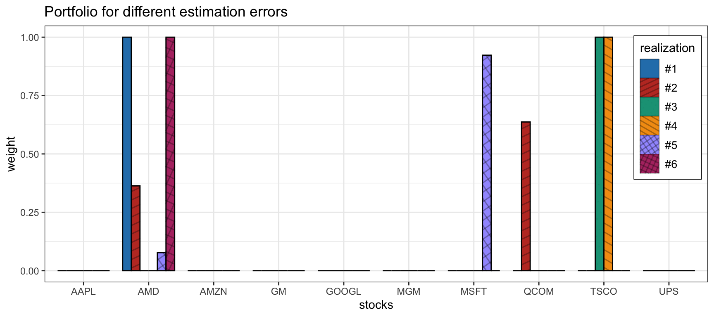
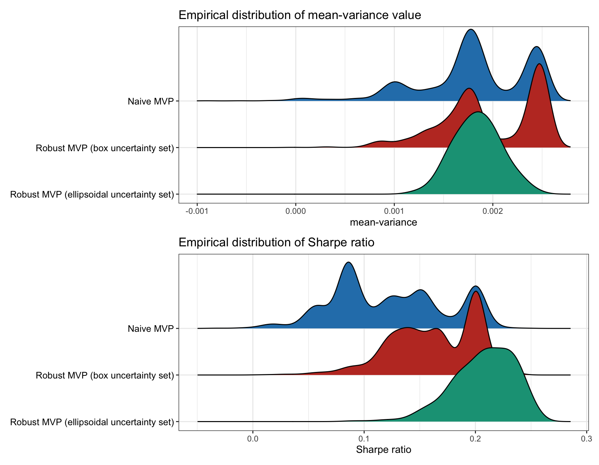
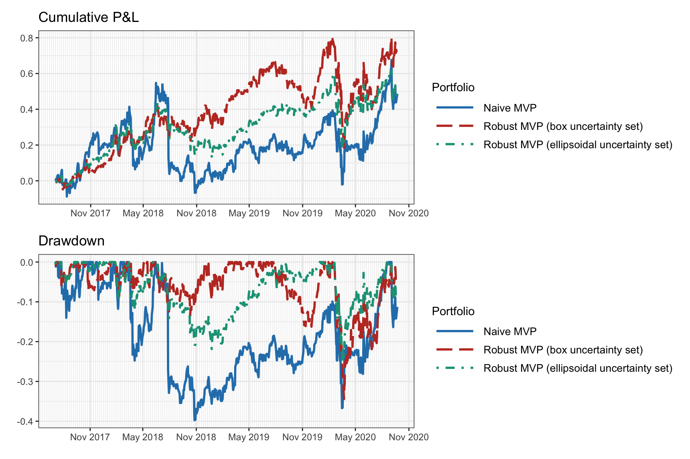
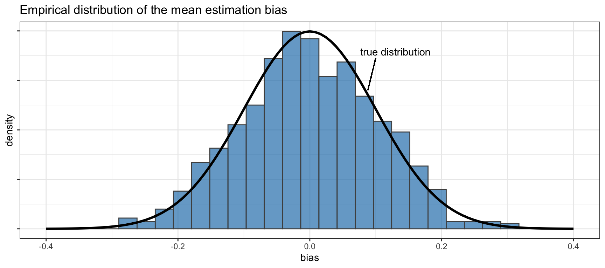
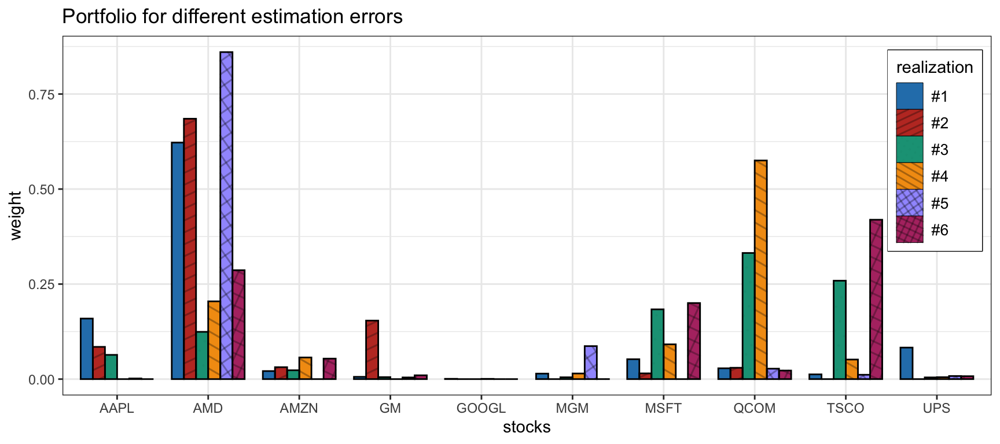
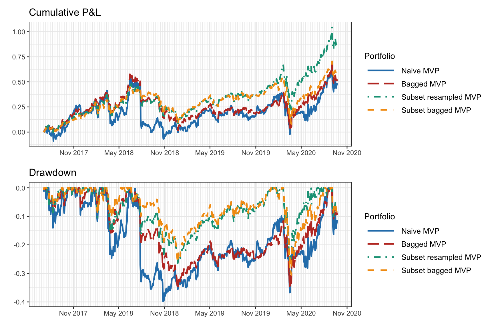
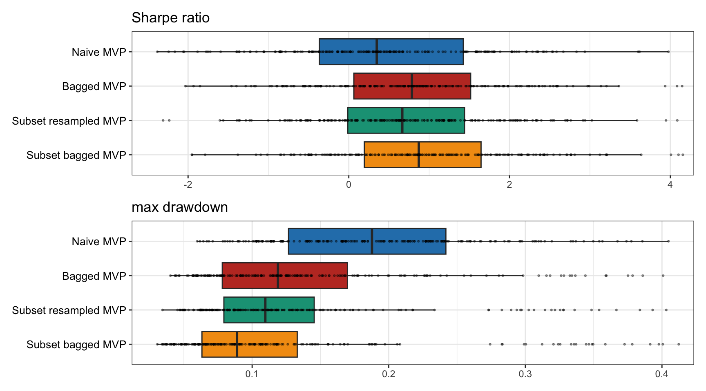

# Robust Portfolios {#robust-portfolios}

> "Nobody's easier to fool [ ...] than the person who is convinced that he is right."
>
> --- Haruki Murakami, 1Q84

\bigskip

> In theory there is no difference between theory and practice, while in practice there is.
>
> --- Benjamin Brewster, _The Yale Literary Magazine_

<!---
\bigskip

> "By failing to prepare, you are preparing to fail."
>
> --- Benjamin Franklin
--->

<!---
> "The problem with the world is that the intelligent people are full of doubts, while the stupid ones are full of confidence."
> 
> --- Charles Bukowski
--->

\afterquotespace
\acknowledgementCUP

Markowitz’s mean--variance portfolio optimizes a trade-off between expected return and risk measured by the variance. This formulation requires a prior estimation of some parameters: the mean vector and covariance matrix of the assets. In ideal conditions, this would be a perfectly fine approach. In practice, however, this fails miserably due to estimation errors in these parameters, which is one of the reasons why Markowitz's portfolio has not been widely adopted by practitioners. This has been referred to as the "Markowitz optimization enigma" and portfolio optimization problems have been called "estimation-error maximizers."

The parameters of an optimization problem have to be estimated and they will inevitably contain estimation errors. The naive approach simply ignores the existence of such estimation errors and proceeds as if the parameters were perfectly known. This leads to totally unacceptable solutions due to their instability and sensitivity to errors. Fortunately, several approaches have been proposed in the literature to mitigate such sensitivity.

This chapter explores two main approaches to deal with the error sensitivity:

- _Robust optimization_ is a way to formulate optimization problems such that they are aware of the possible errors in the parameters. This approach goes back to the 1990s in the operations research literature and can be effectively applied to portfolio optimization.

- _Resampling and bootstrapping methods_ constitute the bread and butter in the statistics literature. They rely on a smart resampling of the data to obtain multiple solutions that are then aggregated to form the final stable solution.

The good news is that these two philosophies are very mature and do not destroy the convexity (if any) of the original portfolio formulation.

  This material has been published as:
  Daniel P. Palomar (2025). _Portfolio Optimization: Theory and Application_. Cambridge University Press.
  This version is free to view and download for personal use only; not for re-distribution, re-sale, or use in derivative works. ©\ Daniel P. Palomar 2025.

## Introduction
Markowitz's mean--variance portfolio [@Markowitz1952] formulates the portfolio design as a trade-off between the expected return $\w^\T\bmu$ and the risk measured by the variance $\w^\T\bSigma\w$ (see Chapter\ \@ref(MPT) for details):
$$
  \begin{array}{ll}
  \underset{\w}{\textm{maximize}} & \w^\T\bmu - \frac{\lambda}{2}\w^\T\bSigma\w\\
  \textm{subject to} & \w \in \mathcal{W},
  \end{array}
$$
where $(\bmu, \bSigma)$ are the parameters, $\lambda$ is a hyper-parameter that controls the investor's risk aversion, and $\mathcal{W}$ denotes an arbitrary constraint set, such as $\mathcal{W} = \{\w \mid \bm{1}^\T\w=1, \w\ge\bm{0} \}$.

In practice, the parameters $(\bmu, \bSigma)$ are unknown and have to be estimated using historical data $\bm{x}_1,\dots,\bm{x}_T$ containing the past $T$ observations of the assets' returns. There is a wide span of different estimators, ranging from the simplest sample estimators to the more sophisticated shrinkage heavy-tailed maximum likelihood estimators (see Chapter\ \@ref(iid-modeling) for a variety of estimation techniques). Regardless of the estimation method employed, there will always be an estimation error that depends on the number of observations. In practice, the amount of available historical data is limited (lack of stationarity does not help either) and the estimates $\hat{\bmu}$ and $\hat{\bSigma}$ will be very noisy, particularly $\hat{\bmu}$ [@Michaud1989; @BestGrauer1991; @ChopraZiemba93]; see Section\ \@ref(sample-estimators) in Chapter\ \@ref(iid-modeling) for more details.

This is, in fact, the "Achilles' heel" of portfolio optimization: the estimations $\hat{\bmu}$ and $\hat{\bSigma}$ will inevitably contain estimation noise which will lead to erratic portfolio designs. This is why Markowitz's portfolio has not been fully embraced by practitioners. This was clearly summarized by Michaud in the context of mean--variance formulations [@Michaud1989]:

- Portfolio optimization problems are "estimation-error maximizers."
- "Optimal" portfolios are financially meaningless (absence of significant investment value).

Figure\ \@ref(fig:sensitivity-naive-portfolio) illustrates the sensitivity of the mean--variance portfolio (with $\lambda=1$) for six different realizations of the estimation error in the parameters. As can be observed, the behavior is totally erratic because the solutions are too sensitive to the errors in the parameters. In fact, each realization is very different from the others and this is unacceptable from a practical standpoint. One cannot let the portfolio allocation depend on the flap of a butterfly's wings.

(\#fig:sensitivity-naive-portfolio)Sensitivity of the naive mean--variance portfolio.

## Robust Portfolio Optimization
\index{robust optimization}
After a brief introduction to robust optimization, we will illustrate its application to portfolio design based on the mean--variance formulation, although the techniques can be applied to other portfolio formulations.

### Robust Optimization
Consider a general mathematical optimization problem with optimization variable $\bm{x}$ making explicit the dependency of the functions on the parameter $\bm{\theta}$:
$$
  \begin{array}{ll}
  \underset{\bm{x}}{\textm{minimize}} & \begin{array}[t]{l} f_{0}(\bm{x}; \bm{\theta}) \end{array}\\
  \textm{subject to} 
  & \begin{array}[t]{l}
      f_{i}(\bm{x}; \bm{\theta})\leq0,\\
      h_{i}(\bm{x}; \bm{\theta})=0,
    \end{array}
    \quad
    \begin{array}[t]{l}
      i=1,\ldots,m,\\
      i=1,\ldots,p,
    \end{array}
  \end{array}
$$

where $f_{0}$ is the objective function, $f_{i},\; i=1,\ldots,m,$ are the inequality constraint functions, and $h_{i},\; i=1,\ldots,p,$ are the equality constraint functions. The parameter $\bm{\theta}$ is something given externally and not to be optimized. For example, in the case of the mean--variance portfolio, we have $\bm{\theta}=(\bmu, \bSigma)$. We denote a solution to this problem by  $\bm{x}^\star(\bm{\theta})$, where the dependency on $\bm{\theta}$ is again made explicit.

In practice, however, $\bm{\theta}$ is unknown and has to be estimated as $\hat{\bm{\theta}}$. The problem, of course, is that the solution obtained by solving the optimization problem using the estimated $\hat{\bm{\theta}}$, denoted by $\bm{x}^\star(\hat{\bm{\theta}})$, differs from the desired one: $\bm{x}^\star(\hat{\bm{\theta}}) \neq \bm{x}^\star(\bm{\theta})$. The question is whether it is still approximately equal, $\bm{x}^\star(\hat{\bm{\theta}}) \approx \bm{x}^\star(\bm{\theta})$, or totally different. The answer depends on each particular problem formulation; for the mean--variance portfolio formulation it turns out to be quite different (as illustrated in Figure\ \@ref(fig:sensitivity-naive-portfolio)).

There are several ways to make the problem robust to parameter errors:
  
- _Stochastic optimization_ relies on a probabilistic modeling of the parameter [@Prekopa1995; @RuszczynskiShapiro2003; @BirgeLouveaux2011] and may include:  

  + expectations: average behavior;
  + chance constraints: probabilistic constraints.
  
- _Worst-case robust optimization_ relies on the definition of an uncertainty set for the parameter [@BenTalGhaouiNemirovski2009; @BenTalNemirovski2008; @BertsimasBrownCaramanis2011; @Lobo2000].

#### Stochastic Optimization {-}
\index{robust optimization!stochastic optimization}
In stochastic robust optimization, the estimated parameter $\hat{\bm{\theta}}$ is modeled as a random variable that fluctuates around its true value $\bm{\theta}$. For convenience, the true value is modeled as a random variable around the estimated value (with an additive noise) as
$$
\bm{\theta} = \hat{\bm{\theta}} + \bm{\delta},
$$
where $\bm{\delta}$ is the estimation error modeled as a zero-mean random variable with some distribution such as Gaussian. In practice, it is critical to choose the covariance matrix (or shape) of the error term properly.

Then, rather than using a naive and wrong constraint of the form
$$
f\big(\bm{x}; \hat{\bm{\theta}}\big) \le \alpha,
$$
we can use the "average constraint"
$$
\E_{\bm{\theta}}\left[f(\bm{x}; \bm{\theta})\right] \le \alpha,
$$
where the expectation is with respect to the random variable $\bm{\theta}$. The interpretation is that the constraint will be satisfied on average, which is a relaxation of the true constraint.

It is important to point out that this stochastic average constraint preserves convexity. That is, if $f(\cdot; \bm{\theta})$ is convex for each $\bm{\theta}$, then its expected value over $\bm{\theta}$ is also convex (the sum of convex functions preserves convexity, see Appendix\ \@ref(convex-optimization) for details).

In practice, the expected value can be implemented in different ways, for example:

- _brute-force sampling_: simply sample the random variable $\bm{\theta}$ $S$ times and use the constraint
$$
\frac{1}{S}\sum_{i=1}^S f(\bm{x}; \bm{\theta}_i) \le \alpha;
$$
- _adaptive sampling_: sample the random variable $\bm{\theta}$ in a smart and efficient way at each iteration while the problem is being solved;
- _closed-form expression_: compute the expected value in closed form whenever possible (see Example \@ref(exm:stochastic-quadratic));
- _stochastic programming_: a wide variety of numerical methods have been developed for stochastic optimization under the umbrella of stochastic programming [@Prekopa1995; @RuszczynskiShapiro2003; @BirgeLouveaux2011].

::: {.example #stochastic-quadratic name="Stochastic average constraint in closed form"}
Suppose we have the quadratic constraint $f(\bm{x}; \bm{\theta}) = (\bm{c}^\T\bm{x})^2$, where the parameter is $\bm{\theta} = \bm{c}$, modeled as $\bm{c} = \hat{\bm{c}} + \bm{\delta}$, where $\bm{\delta}$ is zero-mean with covariance matrix $\bm{Q}$. Then the expected value is
$$
\begin{aligned}
  \E_{\bm{\theta}}\left[f(\bm{x}; \bm{\theta})\right] 
  &= \E_{\bm{\delta}}\left[\left((\hat{\bm{c}} + \bm{\delta})^\T\bm{x}\right)^2\right]\\
  &= \E_{\bm{\delta}}\left[(\hat{\bm{c}}^\T\bm{x})^2 + \bm{x}^\T \bm{\delta} \bm{\delta}^\T \bm{x}\right]\\
  &= (\hat{\bm{c}}^\T\bm{x})^2 + \bm{x}^\T \bm{Q} \bm{x},
  \end{aligned}
$$
which, interestingly, has the form of the naive version plus a quadratic regularization term.
:::

The problem with expectations and satisfying constraints on average is that there is no control about any specific realization of the estimation error. This relaxed control may not be acceptable in many applications as the constraint will be violated in many instances. The worst-case approach (considered later) tries to deal with this issue, but it may be too conservative. Chance constraints attempt to achieve a compromise between being too relaxed or overly conservative. They are also based on a statistical modeling of the estimation error, but instead of focusing on the average they focus on satisfying the constraint with some high probability (say, 95% of the cases). In this approach, the naive constraint $f(\bm{x}; \hat{\bm{\theta}}) \le \alpha$ is replaced with 
$$
\textm{Pr}\left[ f(\bm{x}; \bm{\theta}) \le \alpha \right] \ge \epsilon,
$$
where $\epsilon$ is the confidence level, say, $\epsilon=0.95$ for 95%. Unfortunately, chance or probabilistic constraints are generally very hard to deal with and one typically has to resort to approximations [@BenTalNemirovski2008; @BenTalGhaouiNemirovski2009].

#### Worst-Case Robust Optimization {-}
\index{robust optimization!worst-case robust optimization}
In worst-case robust optimization, the parameter $\bm{\theta}$ is not characterized statistically. Instead, it is assumed to lie within an uncertainty region near the estimated value:
$$
\bm{\theta} \in \mathcal{U}_{\bm{\theta}},
$$
where $\mathcal{U}_{\bm{\theta}}$ is the uncertainty set centered at $\hat{\bm{\theta}}$.

In practice, it is critical to choose the shape and size of the uncertainty set properly. Typical choices for the shape for a size of $\epsilon$ are:

- _spherical set_: $\quad \mathcal{U}_{\bm{\theta}}	= \left\{\bm{\theta} \mid \|\bm{\theta} - \hat{\bm{\theta}}\|_2 \le \epsilon\right\};$
- _box set_: $\quad \mathcal{U}_{\bm{\theta}}	= \left\{\bm{\theta} \mid \|\bm{\theta} - \hat{\bm{\theta}}\|_\infty \le \epsilon\right\};$
- _ellipsoidal set_: $\quad \mathcal{U}_{\bm{\theta}}	= \left\{\bm{\theta} \mid \big(\bm{\theta} - \hat{\bm{\theta}}\big)^\T\bm{S}^{-1}\big(\bm{\theta} - \hat{\bm{\theta}}\big) \le \epsilon^2\right\},$ where $\bm{S}\succ\bm{0}$ defines the shape of the ellipsoid.

<!---
- _spherical set_: 
$$\mathcal{U}_{\bm{\theta}}	= \left\{\bm{\theta} \mid \|\bm{\theta} - \hat{\bm{\theta}}\|_2 \le \epsilon\right\};$$
- _box set_:
$$\mathcal{U}_{\bm{\theta}}	= \left\{\bm{\theta} \mid \|\bm{\theta} - \hat{\bm{\theta}}\|_\infty \le \epsilon\right\};$$

- _ellipsoidal set_:
$$\mathcal{U}_{\bm{\theta}}	= \left\{\bm{\theta} \mid \big(\bm{\theta} - \hat{\bm{\theta}}\big)^\T\bm{S}^{-1}\big(\bm{\theta} - \hat{\bm{\theta}}\big) \le \epsilon^2\right\},$$
where $\bm{S}\succ\bm{0}$ defines the shape of the ellipsoid.
--->

Then, rather than using a naive and wrong constraint of the form
$$
f\big(\bm{x}; \hat{\bm{\theta}}\big) \le \alpha,
$$
we can use the worst-case constraint
$$
\underset{\bm{\theta} \in \mathcal{U}_{\hat{\bm{\theta}}}}{\textm{sup}} \; f(\bm{x}; \bm{\theta}) \le \alpha.
$$
The interpretation is that the constraint will be satisfied for any point inside the uncertainty set, which is a conservative approach.

It is important to point out that this worst-case constraint preserves convexity. That is, if $f(\cdot; \bm{\theta})$ is convex for each $\bm{\theta}$, then its worst case over $\bm{\theta}$ is also convex (the pointwise maximum of convex functions preserves convexity, see Appendix\ \@ref(convex-optimization) for details).

In practice, the expected value can be implemented in different ways, for example:

- _brute-force sampling_: simply sample the uncertainty set $\mathcal{U}_{\bm{\theta}}$ $S$ times and use the constraint
$$
\underset{i=1,\dots,S}{\textm{max}} \; f(\bm{x}; \bm{\theta}_i) \le \alpha
$$
or, equivalently, include $S$ constraints
$$
f(\bm{x}; \bm{\theta}_i) \le \alpha, \qquad i=1,\dots,S;
$$
- _adaptive sampling algorithms_: sample the uncertainty set $\mathcal{U}_{\hat{\bm{\theta}}}$ in a smart and efficient way at each iteration while the problem is being solved;
- _closed-form expression_: compute the supremum in closed form whenever possible (see Example \@ref(exm:worst-case-quadratic));
- _via Lagrange duality_: in some cases, it is possible to rewrite the worst-case supremum as an infimum that can later be combined with the outer portfolio optimization layer;
- _saddle-point optimization_: as a last resort, since the worst-case design is expressed in the form of a min--max (minimax) formulation, numerical methods specifically designed for minimax problems or related saddle-point problems can be used [@Bertsekas1999; @TutuncuKoenig2004].

::: {.example #worst-case-quadratic name="Worst-case constraint in closed form"}
Suppose we have the quadratic constraint $f(\bm{x}; \bm{\theta}) = (\bm{c}^\T\bm{x})^2$, where the parameter is $\bm{\theta} = \bm{c}$ and belongs to a spherical uncertainty set
$$\mathcal{U}	= \left\{\bm{c} \mid \|\bm{c} - \hat{\bm{c}}\|_2 \le \epsilon\right\}.$$
Then, the worst-case value is
$$
\begin{aligned}
  \underset{\bm{c} \in \mathcal{U}}{\textm{sup}}  \; |\bm{c}^\T\bm{x}| 
  &= \underset{\|\bm{\delta}\| \le \epsilon}{\textm{sup}} \; |(\hat{\bm{c}} + \bm{\delta})^\T\bm{x}| \\
  &= |\hat{\bm{c}}^\T\bm{x}| + \underset{\|\bm{\delta}\| \le \epsilon}{\textm{sup}} \; |\bm{\delta}^\T\bm{x}| \\
  &= |\hat{\bm{c}}^\T\bm{x}| + \epsilon \|\bm{x}\|_2,
\end{aligned}
$$
where we have used the triangle inequality and the Cauchy--Schwarz inequality (with upper bound achieved by $\bm{\delta} = \epsilon \, \bm{x}/\|\bm{x}\|_2$). Again, this expression has the form of the naive version plus a regularization term.
:::

As a final note, it is worth mentioning that worst-case uncertainty philosophy can be applied to probability distributions, referred to as distributional uncertainty models or distributionally robust optimization [@BertsimasBrownCaramanis2011].

### Robust Worst-Case Portfolios
\index{portfolios!robust portfolios}
\index{robust portfolios|see{portfolios!robust portfolios}}
For portfolio design, we will focus on the worst-case robust optimization philosophy, due to its simplicity and convenience [@Lobo2000; @GoldfarbIyengar2003; @TutuncuKoenig2004]; see also textbooks such as @CornuejolsTutuncu2006 and @Fabozzi2007.

#### Worst-Case Mean Vector $\bmu$ {-}
To study the uncertainty in $\bmu$, we consider the global maximum return portfolio (GMRP) for an estimated mean vector $\hat{\bmu}$ (see Chapter\ \@ref(portfolio-101) for details):
$$
  \begin{array}{ll}
  \underset{\w}{\textm{maximize}} & \w^\T\hat{\bmu}\\
  \textm{subject to} & \bm{1}^\T\w=1, \quad \w\ge\bm{0},
  \end{array}
$$
which is is known to be terribly sensitive to estimation errors.

We will instead use the worst-case formulation:
$$
  \begin{array}{ll}
  \underset{\w}{\textm{maximize}} & \textm{inf}_{\bmu \in \mathcal{U}_{\bmu}} \; \w^\T\bmu\\
  \textm{subject to} & \bm{1}^\T\w=1, \quad \w\ge\bm{0},
  \end{array}
$$
where typical choices for the uncertainty region $\mathcal{U}_{\bmu}$ are the ellipsoidal and box sets considered next.

::: {.lemma #worst-case-mean-ellipsoid name="Worst-case mean vector under ellipsoidal uncertainty set"}
Consider the ellipsoidal uncertainty set for $\bmu$
$$
\mathcal{U}_{\bmu} = \left\{\bmu = \hat{\bmu} + \kappa \bm{S}^{1/2}\bm{u} \mid \|\bm{u}\|_2 \le 1\right\},
$$
where $\bm{S}^{1/2}$ is the symmetric square-root matrix of the shape $\bm{S}$ (a typical choice is the covariance matrix scaled with the number of observations, $\bm{S}=(1/T)\bSigma$) and $\kappa$ determines the size of the ellipsoid. Then, the worst-case value of $\w^\T\bmu$ is
$$
\begin{aligned}
  \underset{\bmu \in \mathcal{U}_{\bmu}}{\textnormal{inf}}  \; \w^\T\bmu 
  &= \underset{\|\bm{u}\| \le 1}{\textnormal{inf}} \; \w^\T( \hat{\bmu} + \kappa \bm{S}^{1/2}\bm{u}) \\
  &= \w^\T\hat{\bmu} + \kappa\; \underset{\|\bm{u}\| \le 1}{\textnormal{inf}} \; \w^\T\bm{S}^{1/2}\bm{u} \\
  &= \w^\T\hat{\bmu} - \kappa\; \|\bm{S}^{1/2}\w\|_2,
\end{aligned}
$$
which follows from the Cauchy--Schwarz inequality with $\bm{u} = -\bm{S}^{1/2}\w/\|\bm{S}^{1/2}\w\|_2$.
:::

::: {.lemma #worst-case-mean-box name="Worst-case mean vector under box uncertainty set"}
Consider the box uncertainty set for $\bmu$
$$
\mathcal{U}_{\bmu} = \left\{\bmu \mid -\bm{\delta} \le \bmu - \hat{\bmu} \le \bm{\delta}\right\},
$$
where $\bm{\delta}$ is the half-width of the box in all dimensions. Then, the worst-case value of $\w^\T\bmu$ is
$$
\begin{aligned}
  \underset{\bmu \in \mathcal{U}_{\bmu}}{\textnormal{inf}}  \; \w^\T\bmu 
  &= \w^\T\hat{\bmu} - |\w|^\T\bm{\delta},
\end{aligned}
$$
where $|\w|$ denotes the elementwise absolute value of $\w$.
:::

\index{portfolios!robust portfolios}
\index{robust portfolios}
Thus, under an ellipsoidal uncertainty set as in Lemma \@ref(lem:worst-case-mean-ellipsoid), the robust version of the GMRP is
$$
  \begin{array}{ll}
  \underset{\w}{\textm{maximize}} & \w^\T\hat{\bmu} - \kappa\; \|\bm{S}^{1/2}\w\|_2\\
  \textm{subject to} & \bm{1}^\T\w=1, \quad \w\ge\bm{0},
  \end{array}
$$
which is still a convex problem but now the problem complexity has increased to that of a second-order cone program (from a simple linear program in the naive formulation).

Similarly, under a box uncertainty set as in Lemma \@ref(lem:worst-case-mean-box), the robust version of the GMRP is
$$
  \begin{array}{ll}
  \underset{\w}{\textm{maximize}} & \w^\T\hat{\bmu} - |\w|^\T\bm{\delta}\\
  \textm{subject to} & \bm{1}^\T\w=1, \quad \w\ge\bm{0},
  \end{array}
$$
which is still a convex problem and can be rewritten as a linear program after getting rid of the absolute value (see Appendix\ \@ref(convex-optimization) for details). In fact, under the constraints $\bm{1}^\T\w=1$ and $\w\ge\bm{0}$, the problem can be reduced to a naive GMRP where $\hat{\bmu}$ is replaced by $\hat{\bmu} - \bm{\delta}$.

There are other uncertainty sets that can also be considered, such as the $\ell_1$-norm ball. The following example illustrates a rather interesting case of how the otherwise heuristic quintile portfolio (see Section\ \@ref(quintile-portfolio) in Chapter\ \@ref(portfolio-101) for details) can be formally derived as a robust portfolio.

::: {.example #quintile-as-robust name="Quintile portfolio as a robust portfolio"}
The quintile portfolio is a heuristic portfolio widely used by practitioners (see Section\ \@ref(quintile-portfolio) in Chapter\ \@ref(portfolio-101) for details). It selects the top fifth of the assets (one could also select a different fraction of the assets) over which the capital is equally allocated. This is a common-sense heuristic portfolio widely used in practice. Interestingly, it can be shown to be the optimal solution to the worst-case GMRP with an $\ell_1$-norm ball uncertainty set around the estimated mean vector [@ZhouPalomar2020]:
$$
\mathcal{U}_{\bmu} = \left\{\hat{\bmu} + \bm{e} \mid \|\bm{e}\|_1 \leq \epsilon\right\}.
$$
:::

#### Worst-Case Covariance Matrix $\bSigma$ {-}
To study the uncertainty in $\bSigma$, we consider the global minimum variance portfolio (GMVP) for an estimated mean vector $\hat{\bSigma}$ (see Chapter\ \@ref(portfolio-101) for details):
$$
  \begin{array}{ll}
  \underset{\w}{\textm{minimize}} & \w^\T\hat{\bSigma}\w\\
  \textm{subject to} & \bm{1}^\T\w=1, \quad \w\ge\bm{0},
  \end{array}
$$
which is sensitive to estimation errors (albeit not as much as the previous sensitivity to errors in $\bmu$).

We will instead use the worst-case formulation:
$$
  \begin{array}{ll}
  \underset{\w}{\textm{minimize}} & \textm{sup}_{\bSigma \in \mathcal{U}_{\bSigma}} \; \w^\T\bSigma\w\\
  \textm{subject to} & \bm{1}^\T\w=1, \quad \w\ge\bm{0},
  \end{array}
$$
where typical choices for the uncertainty region $\mathcal{U}_{\bSigma}$ are the spherical, ellipsoidal, and box sets considered next.

::: {.lemma #worst-case-covmat-sphere name="Worst-case covariance matrix under a data spherical uncertainty set"}
Consider the spherical uncertainty set for the data matrix $\bm{X}\in\R^{T\times N}$ containing $T$ observations of the $N$ assets,
$$
\mathcal{U}_{\bm{X}} = \left\{\bm{X} \mid \|\bm{X} -\hat{\bm{X}}\|_\textnormal{F} \le \epsilon\right\},
$$
where $\epsilon$ determines the size of the sphere. Then, the worst-case value of $\sqrt{\w^\T\bSigma\w}$ under a sample covariance matrix estimation $\hat{\bSigma} = \frac{1}{T}\hat{\bm{X}}^\T\hat{\bm{X}}$ is
$$
\begin{aligned}
  \underset{\bm{X} \in \mathcal{U}_{\bm{X}}}{\textnormal{sup}}  \; \sqrt{\w^\T\left(\frac{1}{T}\bm{X}^\T\bm{X}\right)\w}
  &= \underset{\bm{X} \in \mathcal{U}_{\bm{X}}}{\textnormal{sup}}  \; \frac{1}{\sqrt{T}} \|\bm{X}\w\|_2\\
  &= \underset{\|\bm{\Delta}\|_\textnormal{F} \le \epsilon}{\textnormal{sup}}  \; \frac{1}{\sqrt{T}} \left\|(\hat{\bm{X}} + \bm{\Delta})\w\right\|_2\\
  &= \frac{1}{\sqrt{T}} \left\|\hat{\bm{X}}\w\right\|_2 + 
  \underset{\|\bm{\Delta}\|_\textnormal{F} \le \epsilon}{\textnormal{sup}}  \; \frac{1}{\sqrt{T}} \left\|\bm{\Delta}\w\right\|_2\\
  &= \frac{1}{\sqrt{T}} \left\|\hat{\bm{X}}\w\right\|_2 + \frac{1}{\sqrt{T}} \epsilon \|\w\|_2,
\end{aligned}
$$
where the third equality follows from the triangle inequality and is achieved when $\hat{\bm{X}}\w$ and $\bm{\Delta}\w$ are aligned.
:::

::: {.lemma #worst-case-covmat-ellipsoid name="Worst-case covariance matrix under an ellipsoidal uncertainty set"}
Consider the ellipsoidal uncertainty set for $\bSigma$
$$
\mathcal{U}_{\bSigma}	= \left\{\bSigma \succeq \bm{0} \mid \big(\textnormal{vec}(\bSigma) - \textnormal{vec}(\hat{\bSigma})\big)^\T \bm{S}^{-1} \big(\textnormal{vec}(\bSigma) - \textnormal{vec}(\hat{\bSigma})\big) \le \epsilon^2\right\},
$$
where $\textnormal{vec}(\cdot)$ denotes the operator that stacks the matrix argument into a vector, matrix $\bm{S}$ gives the shape of the ellipsoid, and $\epsilon$ determines the size. Then, the worst-case value of $\w^\T\bSigma\w$ given by the convex semidefinite problem
$$
  \begin{array}{ll}
  \underset{\bSigma}{\textm{maximize}} & \w^\T\bSigma\w\\
  \textm{subject to} 
  & \big(\textnormal{vec}(\bSigma) - \textnormal{vec}(\hat{\bSigma})\big)^\T \bm{S}^{-1} \big(\textnormal{vec}(\bSigma) - \textnormal{vec}(\hat{\bSigma})\big) \le \epsilon^2\\
  & \bSigma \succeq \bm{0},
  \end{array}
$$
can be rewritten as the Lagrange dual problem:
$$
  \begin{array}{ll}
  \underset{\bm{Z}}{\textm{minimize}} & 
  \textnormal{Tr}\left(\hat{\bSigma}\left(\w\w^\T+\bm{Z}\right)\right) + \epsilon\left\| \bm{S}^{1/2}\left(\textnormal{vec}(\w\w^\T)+\textnormal{vec}(\bm{Z})\right)\right\|_{2}\\
  \textm{subject to} 
  & \bm{Z} \succeq \bm{0},
  \end{array}
$$
which is a convex semidefinite problem.
:::

::: {.lemma #worst-case-covmat-box name="Worst-case covariance matrix under a box uncertainty set"}
Consider the box uncertainty set for $\bSigma$
$$
\mathcal{U}_{\bSigma} = \left\{\bSigma \succeq \bm{0} \mid \underline{\bSigma} \le \bSigma \le \overline{\bSigma}\right\},
$$
where $\underline{\bSigma}$ and $\overline{\bSigma}$ denote the elementwise lower and upper bounds, respectively. Then, the worst-case value of $\w^\T\bSigma\w$, given by the convex semidefinite problem
$$
  \begin{array}{ll}
  \underset{\bSigma}{\textm{maximize}} & \w^\T\bSigma\w\\
  \textm{subject to} 
  & \underline{\bSigma} \le \bSigma \le \overline{\bSigma},\\
  & \bSigma \succeq \bm{0},
  \end{array}
$$
can be rewritten as the Lagrange dual problem [@Lobo2000]
$$
  \begin{array}{ll}
  \underset{\overline{\bm{\Lambda}},\,\underline{\bm{\Lambda}}}{\textm{minimize}} & 
  \textnormal{Tr}\big(\overline{\bm{\Lambda}}\,\overline{\bSigma}\big) - \textnormal{Tr}\big(\underline{\bm{\Lambda}}\,\underline{\bSigma}\big)\\
  \textm{subject to} 
  & \begin{bmatrix}
    \overline{\bm{\Lambda}} - \underline{\bm{\Lambda}} & \w\\
    \w^\T & 1
  \end{bmatrix} \succeq \bm{0}\\
  & \overline{\bm{\Lambda}}\geq\bm{0},\quad\underline{\bm{\Lambda}}\geq\bm{0},
  \end{array}
$$
which is a convex semidefinite problem.
:::

\index{portfolios!robust portfolios}
\index{robust portfolios}
Thus, under a spherical uncertainty set for the data matrix as in Lemma \@ref(lem:worst-case-covmat-sphere), the robust version of the GMVP is
$$
  \begin{array}{ll}
  \underset{\w}{\textm{minimize}} & \left(\left\|\hat{\bm{X}}\w\right\|_2 + \epsilon \|\w\|_2\right)^2\\
  \textm{subject to} & \bm{1}^\T\w=1, \quad \w\ge\bm{0},
  \end{array}
$$
which is still a convex problem but now the problem complexity has increased to that of a second-order cone program (from a simple quadratic program in the naive formulation).

Interestingly, this problem bears a striking resemblance to a common heuristic called Tikhonov regularization:
$$
  \begin{array}{ll}
  \underset{\w}{\textm{minimize}} & \left\|\hat{\bm{X}}\w\right\|_2^2 + \epsilon \|\w\|_2^2\\
  \textm{subject to} & \bm{1}^\T\w=1, \quad \w\ge\bm{0},
  \end{array}
$$
where the objective function can be rewritten as $\w^\T\frac{1}{T}\big(\hat{\bm{X}}^\T\hat{\bm{X}} + \epsilon \bm{I}\big)\w$, which leads to a regularized sample covariance matrix (see Section\ \@ref(shrinkage) in Chapter\ \@ref(iid-modeling) for details on shrinkage).

Regarding the worst-case formulations that involve the Lagrange dual problem, the outer and inner minimizations can be simply written as a joint minimization. For example, under an ellipsoidal uncertainty set for the covariance matrix as in Lemma \@ref(lem:worst-case-covmat-ellipsoid), the robust version of the GMVP is [@FengPal2016monograph]
$$
  \begin{array}{ll}
  \underset{\w,\bm{W},\bm{Z}}{\textm{minimize}} & 
  \textm{Tr}\left(\hat{\bSigma}\left(\bm{W}+\bm{Z}\right)\right) + \epsilon\left\| \bm{S}^{1/2}\left(\textm{vec}(\bm{W})+\textm{vec}(\bm{Z})\right)\right\|_{2}\\
  \textm{subject to} 
  & \begin{bmatrix}
    \bm{W} & \w\\
    \w^\T & 1
  \end{bmatrix} \succeq \bm{0}\\
  & \bm{1}^\T\w=1, \quad \w\ge\bm{0},\\
  & \bm{Z} \succeq \bm{0},
  \end{array}
$$
which is still a convex problem but now the problem complexity has increased to that of a semidefinite program (from a simple quadratic program in the naive formulation). Note that the first matrix inequality is equivalent to $\bm{W}\succeq\w\w^\T$ and, at an optimal point, it can be shown to be satisfied with equality $\bm{W}=\w\w^\T$.

#### Worst-Case Mean Vector $\bmu$ and Covariance Matrix $\bSigma$ {-}
The previous worst-case formulations against uncertainty in the mean vector $\bmu$ and the covariance matrix $\bSigma$ can be trivially combined under the mean--variance portfolio formulation.

\index{portfolios!robust portfolios}
\index{robust portfolios}
For illustrative purposes, we consider the the mean--variance worst-case portfolio formulation under box uncertainty sets for $\bmu$ and $\bSigma$, as in Lemmas \@ref(lem:worst-case-mean-box) and \@ref(lem:worst-case-covmat-box), given by
$$
  \begin{array}{ll}
  \underset{\w,\,\overline{\bm{\Lambda}},\,\underline{\bm{\Lambda}}}{\textm{maximize}} & \w^\T\hat{\bmu} - |\w|^\T\bm{\delta} - \frac{\lambda}{2}
  \left( \textm{Tr}\big(\overline{\bm{\Lambda}}\,\overline{\bSigma}\big) - \textm{Tr}\big(\underline{\bm{\Lambda}}\,\underline{\bSigma}\big) \right)\\
  \textm{subject to} 
  & \bm{1}^\T\w=1, \quad \w\ge\bm{0},\\
  & \begin{bmatrix}
    \overline{\bm{\Lambda}} - \underline{\bm{\Lambda}} & \w\\
    \w^\T & 1
  \end{bmatrix} \succeq \bm{0},\\
  & \overline{\bm{\Lambda}}\geq\bm{0},\quad\underline{\bm{\Lambda}}\geq\bm{0},
  \end{array}
$$
which is a convex semidefinite problem.

Other more sophisticated uncertainty sets can be considered for the mean vector and the covariance matrix, such as based on factor modeling [@GoldfarbIyengar2003].

#### Other Worst-Case Performance Measures {-}
Apart from the mean--variance framework for portfolio optimization, many other portfolio designs can be formulated based on other objective functions or performance measures (see Chapter\ \@ref(alternative-risk-measure-portfolios) for details), as well as higher-order moments (see Chapter\ \@ref(high-order-portfolios)) or risk-parity portfolios (see Chapter\ \@ref(RPP)). Each such formulation can be robustified so that the solution becomes more stable and robust against estimation errors in the parameters. For example, the worst-case Sharpe ratio can be easily managed, as well as the the worst-case value-at-risk (VaR) [@ElGhaouiOksOustry2003].

### Numerical Experiments
The effectiveness of the different robust portfolio formulations depends on the shape as well as the size of the uncertainty region. These are parameters that have to be properly chosen and tuned to the type of data and nature of the financial market. Therefore, it is easy to overfit the model to the training data and extra care has to be taken.

The goal of a robust design should be in making the solution more stable and less sensitive to the error realization, but not necessarily improving the performance. In other words, one should aim at gaining robustness but not the best performance for a given backtest compared to a naive design.

We now evaluate robust portfolios under errors in the mean vector $\bmu$. Recall that robustness for the covariance matrix $\bSigma$ is not as critical, because the bottleneck in the estimation part is on the mean vector (see Chapter\ \@ref(iid-modeling) for details).

#### Sensitivity of Robust Portfolios {-}
The extreme sensitivity of a naive mean--variance portfolio was shown in Figure\ \@ref(fig:sensitivity-naive-portfolio). We now repeat the same numerical experiment with a robust formulation (still with $\lambda=1$).

Figure\ \@ref(fig:sensitivity-robust-mu-ellipse-portfolios) shows the sensitivity of a robust portfolio under an ellipsoidal uncertainty set for the mean vector $\bmu$ over six different realizations of the estimation error. Compared to Figure\ \@ref(fig:sensitivity-naive-portfolio), it is clearly more stable and less sensitive. Many other variations in the robust formulation can be similarly considered with similar results.

<!---
Figure\ \@ref(fig:sensitivity-robust-mu-box-portfolios) box uncertainty region with $\bm{\delta}=\kappa \times |\bm{\sigma}|$ and $\kappa=0.1$ (for a scaled identity covariance matrix with scaling factor $\sigma^2$, this means an uncertainty volume of $2\times0.1\times\sigma\prod_i u_i \le 2\times0.1\times\sigma\times(1/N)^N$).

Figure\ \@ref(fig:sensitivity-robust-mu-ellipse-portfolios) elliptical uncertainty region with $\kappa=0.1^{1/N}$ (for a scaled identity covariance matrix with scaling factor $\sigma^2$, this means an uncertainty volume of $2\times0.1$).

The elliptical uncertainty set seems to work better for the maximum return portfolio. It definitely provides more diversity compared to the naive solution, as well as being more stable (less sensitive). However, it is still too sensitive.

Summarizing, for the robust global maximum return portfolio, it seems that the ellipsoid uncertainty in $\bmu$ is more stable (and diverse) than the box uncertainly (which is totally unstable). Nevertheless, the allocation is still too sensitive owing to the fact that the global maximum return portfolio is probably not a good formulation as it ignores the covariance matrix.
--->

(\#fig:sensitivity-robust-mu-ellipse-portfolios)Sensitivity of the robust mean--variance portfolio under an ellipsoidal uncertainty set for $\bm{\mu}$.

#### Comparison of Naive vs. Robust Portfolios {-}
Now that we have empirically observed the improved stability of mean--variance robust designs, we can assess their performance (with box and ellipsoidal uncertainty sets for the mean vector $\bmu$) in comparison with the naive design. Backtests are conducted for 50 randomly chosen stocks from the S&P 500 during 2017--2020.

Figure\ \@ref(fig:naive-vs-robust-portfolios-distribution) shows the empirical distribution of the achieved mean--variance objective, as well as the Sharpe ratio, calculated over 1,000 Monte Carlo noisy observations. We can see that the robust designs avoid the worst-case realizations (the left tail in the distributions) at the expense of not achieving the best-case realizations (the right tail); thus, they are more stable and robust as expected.

(\#fig:naive-vs-robust-portfolios-distribution)Empirical performance distribution of naive vs. robust mean--variance portfolios.

Figure\ \@ref(fig:naive-vs-robust-portfolios-backtest) shows the cumulative return and drawdown of the naive and robust mean--variance portfolios for an illustrative backtest. We can observe how the robust portfolios do indeed seem to be more robust. However, this is just a single backtest and more exhaustive multiple backtest are necessary.

(\#fig:naive-vs-robust-portfolios-backtest)Backtest of naive vs. robust mean--variance portfolios.

Finally, multiple backtests are conducted for 200 realizations of 50 randomly chosen stocks from the S&P 500 from random periods during 2015--2020. Figure\ \@ref(fig:naive-vs-robust-portfolios-multiple-backtests) shows the results in terms of the Sharpe ratio and drawdown, confirming that the robust portfolios are superior to the naive portfolio.

(\#fig:naive-vs-robust-portfolios-multiple-backtests)Multiple backtests of naive vs. resampled mean--variance portfolios.

## Portfolio Resampling
We will first give an overview of resampling methods in statistics and then apply them to portfolio optimization.

### Resampling Methods
\index{resampling methods}
Estimating a parameter $\bm{\theta}$ with the value $\hat{\bm{\theta}}$ is of little use if one does not know how good that estimate is. In statistical inference, confidence intervals are key as they allow us to localize the true parameter on some interval with, say, 95% confidence. Traditionally, the derivation and analysis of confidence intervals was very theoretical with heavy use of mathematics. Resampling methods, instead, resort to computer-based numerical techniques for assessing statistical accuracy without formulas [@EfronTibshirani1993].
  
In statistics, _resampling_ is the creation of new samples based on a single observed sample block. Suppose we have $n$ observations, $\bm{x}_1,\dots,\bm{x}_n$, of a random variable $\bm{x}$ from which we estimate some parameters $\bm{\theta}$ as
$$
\hat{\bm{\theta}} = f(\bm{x}_1,\dots,\bm{x}_n),
$$
where $f(\cdot)$ denotes the estimator. The estimation $\hat{\bm{\theta}}$ is a random variable because it is based on $n$ random variables. It may seem that the only possible way to characterize the distribution of the estimation would be to somehow have access to more realizations of the random variable $\bm{x}$. However, this is precisely when resampling methods help to do some "magic." The most popular methods include cross-validation and the bootstrap [@EfronTibshirani1993].

#### Cross-Validation {-}
_Cross-validation_ is a type of resampling method widely used in portfolio backtesting (see Chapter\ \@ref(backtesting)) and machine learning (see Chapter\ \@ref(DL-portfolios)). The idea is simple and consists of dividing the $n$ observations into two groups: a training set for fitting or learning the estimator $f(\cdot)$ and a validation set for assessing its performance. This process can be repeated multiple times to provide multiple realizations of the performance value, which can then be used to compute the empirical performance. For example, $k$-fold cross-validation divides the set into $k$ subsets, where each is held back in turn as the validation set while using the others for training. Leave-one-out cross-validation is an extreme case where the original dataset of $n$ observations is divided into $k=n$ subsets, which means that for each subset a single observation is held back from the training process and used later for validation.

#### The Bootstrap {-}
\index{resampling methods!bootstrap}
\index{bootstrap|see{resampling methods!bootstrap}}
The _bootstrap_ is a type of resampling method proposed in 1979 by Efron, which appears truly magical but it is nevertheless based on sound statistical theory [@Efron1979]. In fact, the name itself (bootstrap) figuratively refers to the seemingly impossible task of lifting oneself by pulling on one's bootstraps.

The idea of the bootstrap is to mimic the original sampling process (from which the original $n$ observations $\bm{x}_1,\dots,\bm{x}_n$ were generated) by sampling these realizations $n$ times with replacement (some samples will be selected multiple times while others will not be used). This procedure is repeated $B$ times to obtain the bootstrap samples,
$$
\big(\bm{x}_1,\dots,\bm{x}_n\big) \rightarrow \left(\bm{x}_1^{*(b)},\dots,\bm{x}_n^{*(b)}\right), \quad b=1,\dots,B,
$$
each of which leads to a different realization of the estimation (bootstrap replicates),
$$
\hat{\bm{\theta}}^{*(b)} = f\left(\bm{x}_1^{*(b)},\dots,\bm{x}_n^{*(b)}\right), \quad b=1,\dots,B,
$$
from which measures of accuracy of the estimator (bias, variance, confidence intervals, etc.) can then be empirically obtained.

The key theoretical result is that the statistical behavior of the random resampled estimates $\hat{\bm{\theta}}^{*(b)}$ compared to $\hat{\bm{\theta}}$ (taken as the true parameter) faithfully represent the statistics of the random estimates $\hat{\bm{\theta}}$ compared to the true (unknown) parameter $\bm{\theta}$. More exactly, the estimations of accuracy are asymptotically consistent as $B\rightarrow\infty$ (under some technical conditions) [@EfronTibshirani1993]. This is a rather surprising result that allows the empirical assessment of the accuracy of the estimator without having access to the true parameter $\bm{\theta}$.

Figure\ \@ref(fig:original-vs-bootstrap-distribution) illustrates the magic of the bootstrap to estimate the accuracy of the sample mean estimator (from $n=100$ observations). In this case, the empirical distribution of the bias of the estimator is computed via $B=1,000$ bootstraps, producing an accurate histogram compared to the true distribution. In practice, confidence intervals may suffice to assess the accuracy and fewer bootstraps may be used (even fewer bootstraps are necessary to compute the standard deviation of the bias).

(\#fig:original-vs-bootstrap-distribution)Empirical distribution of the sample mean bias via the bootstrap.

 

#### The Jackknife {-}
\index{resampling methods!jackknife}
The _jackknife_, proposed in the mid-1950s by M. Quenouille, is the precursor of the bootstrap. It was derived for estimating biases and standard errors of sample estimators. Given the $n$ observations $\bm{x}_1,\dots,\bm{x}_n$, the $i$th _jackknife sample_ is obtained by removing the $i$th data point, $\bm{x}_1,\dots,\bm{x}_{i-1},\bm{x}_{i+1},\dots,\bm{x}_n$. This effectively produces $B=n$ bootstrap samples each with $n-1$ observations. The jackknife can be shown to be an approximation to the bootstrap; more exactly, it makes a linear approximation to the bootstrap. Its accuracy depends on how "smooth" the estimator is; for highly nonlinear functions the jackknife can be inefficient, sometimes dangerously so.

#### Variations of the Bootstrap {-}
\index{resampling methods!bootstrap}
A number of variations and extensions of the basic bootstrap have been proposed over the years. Some notable examples include:

- _Parametric bootstrap_: The original bootstrap methodology mimics the true data distribution by sampling the observations with replacement. Thus, the procedure is distribution-independent or nonparametric. However, there are parametric versions of the bootstrap [@EfronTibshirani1993]. The idea is to make some assumption concerning the true data distribution (for example, assuming the family of Gaussian distributions), estimate the parameters of the distribution from the observed data, and then generate as much data as desired using that parametric distribution.

- _Block bootstrap_: The basic bootstrap method breaks down when the data contains structural dependency. A variety of block bootstrap methods have been proposed to deal with dependent data [@Lahiri1999].

- _Random subspace method_: The random subspace method was proposed in the context of _decision trees_ in order to decrease the correlation among trees and avoid overfitting [@Ho1998]. The idea is to let each learner use a randomly chosen subspace of the features. In fact, this was a key component in the development of _random forests_ in machine learning.

- _Bag of little bootstraps_: In order to deal with large data sets with a massive number of observations, the bag of little bootstraps was proposed incorporating features of both the bootstrap and subsampling to yield a robust, computationally efficient means of assessing the quality of estimators [@KleinerTalwalkarSarkarJordan2014].

#### Bagging {-}
\index{resampling methods!bagging}
\index{bagging|see{resampling methods!bagging}}
The bootstrap is as a way of assessing the accuracy of a parameter estimate or a prediction; interestingly, it can also be used to improve the estimate or prediction itself. _Bootstrap aggregating_ or the acronym _bagging_ refers to a method for generating multiple versions of some estimator or predictor via the bootstrap and then using these to get an aggregated version [@Breiman1996; @HastieTibshiraniFriedman2009]. Bagging can improve the accuracy of the basic estimator or predictor, which typically suffers from sensitivity to the realization of the random data. Mathematically, bagging is a simple average of the bootstrap replicates:
$$
\hat{\bm{\theta}}^{\textm{bag}} = \frac{1}{B}\sum_{b=1}^B \hat{\bm{\theta}}^{*(b)}.
$$

### Portfolio Resampling
\index{portfolios!portfolio resampling}
\index{resampling methods!portfolio resampling}
In portfolio design, an optimization problem is formulated based on $T$ observations of the assets' returns, $\bm{x}_1,\dots,\bm{x}_T$, whose solution is supposedly an optimal portfolio $\w$. As previously discussed, this solution is very sensitive to the inherent noise in the observed data or in the noise in the estimated parameters used in the portfolio formulation, such as the mean vector $\hat{\bmu}$ and covariance matrix $\hat{\bSigma}$.

Fortunately, we can capitalize on the results from the past half-century in statistics; in particular, we can use resampling techniques, such as the bootstrap and bagging, to improve the portfolio design.

The idea of resampling was proposed in the 1990s as a way to assess the accuracy of designed portfolios. The naive approach consists of using the available data to design a series of mean--variance portfolios and then obtaining the efficient frontier, but this is totally unreliable due to the high sensitivity of these portfolios on the data realization (the computed efficient frontier is not realistic and not representative of new data). Instead, resampling allows the computation of a more reliable efficient frontier, called the _resampled efficient frontier_, as well as the identification of statistically equivalent portfolios [@Jorion1992; @Michaud1998].

In the context of data with temporal structure (as happens with many econometrics time series), apart from block bootstrap methods, a maximum entropy bootstrap has been proposed [@Vinod2006]. This method can be applied not only to time series of returns but even directly to time series of prices, which clearly have a strong temporal structure.

#### Portfolio Bagging {-}
\index{portfolios!portfolio bagging}
\index{resampling methods!portfolio bagging}
\index{algorithms!portfolio bagging}
\index{algorithms!portfolio resampling}
The technique of aggregating portfolios was considered in 1998 via a bagging procedure [@Michaud1998; @MichaudMichaud2007; @MichaudMichaud2008; @Scherer2002]:

1. Resample the original data $(\bm{x}_1,\dots,\bm{x}_T)$ $B$ times via the bootstrap method and estimate $B$ different versions of the mean vector and covariance matrix: $\hat{\bmu}^{*(b)}$ and $\hat{\bSigma}^{*(b)}$ for $b=1,\dots,B$.
2. Solve the optimal portfolio $\w^{*(b)}$ for each bootstrap sample.
3. Average the portfolios via bagging:
$$
\w^{\textm{bag}} = \frac{1}{B}\sum_{b=1}^B \w^{*(b)}.
$$

This bagging procedure for portfolio aggregation <!---is illustrated in Figure\ \@ref(fig:XXX). It---> is simple, and the only bottleneck is the increase in computational cost by a factor of the number of bootstraps $B$ compared to the naive approach.

<!---

(\#fig:portfolio-aggregation-bootstrap)Portfolio aggregation via the bootstrap.

--->

#### Portfolio Subset Resampling {-}
An attempt to reduce the computational cost of the portfolio bagging procedure is the _subset resampling_ technique [@ShenWang2017]. The idea is to sample the asset dimension rather than the observation (temporal) dimension, which is the same technique used to develop random forests [@Ho1998]. In more detail, instead of using all the $N$ assets, the method randomly selects a subset, for which a portfolio of reduced dimensionality can be designed, which translates into a reduced computational cost. A rule of thumb is to select subsets of $\lceil N^{0.7} \rceil$ or $\lceil N^{0.8} \rceil$ assets; for example, for $N=50$ the size of the subsets would be of $16$ or $23$, respectively. This procedure is repeated a number of times to finally aggregate all the computed portfolios. Note that since the portfolios are of reduced dimensionality, zeros are implicitly used in the elements corresponding to the other dimensions prior to the averaging.

A side benefit from the subset resampling technique, apart from the reduced computational cost, is that the parameters are better estimated because the ratio of observations to dimensionality is automatically increased in a significant way (see Chapter\ \@ref(iid-modeling) for details on parameter estimation). For example, suppose we have $T=252$ daily observations; the nominal ratio for $N=50$ assets would be $T/N \approx 5$, whereas the ratio for subset resampling would be $T/N^{0.7} \approx 16$ or $T/N^{0.8} \approx 11$. Numerical experiments will confirm that this is a good technique in practice.

#### Portfolio Subset Bagging {-}
Random subset resampling along the asset domain can be straightforwardly combined with the bootstrap along the temporal domain [@ShenWangPuWang2019]. In this case, each bootstrap sample only contains a subset of the $N$ assets.

### Numerical Experiments
The goal of portfolio resampling is in making the solution more stable and less sensitive to the errors in the parameter estimation, gaining in robustness compared to a naive design.

#### Sensitivity of Resampled Portfolios {-}
The extreme sensitivity of the naive mean--variance portfolio was shown in Figure\ \@ref(fig:sensitivity-naive-portfolio). Then, robust portfolio optimization was shown to be less sensitive in Figure\ \@ref(fig:sensitivity-robust-mu-ellipse-portfolios). We now repeat the same numerical experiment with resampled portfolios to observe their sensitivity.

Figure\ \@ref(fig:sensitivity-bagged-portfolio) shows the sensitivity of a bagged portfolio with $B=200$ bootstrap samples over six different realizations of the estimation error in the parameters. Compared to Figure\ \@ref(fig:sensitivity-naive-portfolio), it is clear that bagging helps to produce more stable and less sensitive portfolios.

(\#fig:sensitivity-bagged-portfolio)Sensitivity of the bagged mean--variance portfolio.

#### Comparison of Naive vs. Resampled Portfolios {-}
Now that we have empirically observed the improved stability of mean--variance resampled portfolios, we can assess their performance in comparison with the naive design. In particular, we consider resampled portfolios via bagging, subset resampling, and subset bagging. Backtests are conducted for 50 randomly chosen stocks from the S&P 500 during 2017--2020. 

Figure\ \@ref(fig:naive-vs-resampled-portfolios-distribution) shows the empirical distribution of the achieved mean--variance objective, as well as the Sharpe ratio, calculated over 1,000 Monte Carlo noisy observations. We can observe that resampled portfolios are more stable and do not suffer from extreme bad realizations (unlike the naive portfolio). However, the naive portfolio can be superior for some realizations.

(\#fig:naive-vs-resampled-portfolios-distribution)Empirical performance distribution of naive vs. resampled mean--variance portfolios.

Figure\ \@ref(fig:naive-vs-resampled-portfolios-backtest) shows the cumulative return and drawdown of the naive and resampled mean--variance portfolios for an illustrative backtest. We can observe how the resampled portfolios seem to be less noisy. However, this is just a single backtest and more exhaustive multiple backtests are necessary.

(\#fig:naive-vs-resampled-portfolios-backtest)Backtest of naive vs. resampled mean--variance portfolios.

Finally, multiple backtests are conducted for 200 realizations of 50 randomly chosen stocks from the S&P 500 from random periods during 2015--2020. Figure\ \@ref(fig:naive-vs-resampled-portfolios-multiple-backtests) shows the results in terms of the Sharpe ratio and drawdown, confirming that the resampled portfolios are superior to the naive portfolio.

(\#fig:naive-vs-resampled-portfolios-multiple-backtests)Multiple backtests of naive vs. resampled mean--variance portfolios.

## Summary {#summary-robust-portfolios}
An optimal solution to a portfolio optimization problem typically produces unacceptable results in practice, which may seem counterintuitive. Why is that and how can we address it? <!---Some important take-away points are:--->

- Under ideal conditions, the solution to a portfolio formulation should indeed achieve the desired optimal objective subject to the constraints.

- In reality, however, it may fail miserably. The reason is that the formulation relies on some parameters, such as the mean vector and covariance matrix, but these parameters have to be estimated from noisy and scarce data and will inevitably contain estimation errors.

- The end result of naively ignoring the parameter estimation errors in a portfolio formulation can be catastrophic. For this reason, such portfolio optimization problems have been called "estimation-error maximizers" with solutions that are financially meaningless.

- Some effective approaches to avoid naive solutions include:

  + _Robust portfolios_: Robust optimization is a mature approach in operations research that is able to incorporate the fact that the parameters in the formulation will contain some unknown errors (rather than naively assuming no errors). This has been widely developed in the context of portfolio optimization.

  + _Resampled portfolios_: Bootstrapping and resampling are mature techniques in statistics that allow the aggregation of multiple naive solutions into a more stable and reliable solution. These techniques can be easily applied to portfolio design.

<!---
Naive optimization: optimization problems formulated assuming that the parameters are perfectly known when they are not.
👉 the naive solution x⋆(θ̂ )
 may totally differ from the desired one x⋆(θ)
 (or not, depends on the type of problem)

Optimization under uncertainty of parameters:

- stochastic optimization (SO): models the parameters statistically and uses expectations and probabilities
  + requires modeling the probability distribution function
  + expectations only satisfy constraints on average, not for every instance
  + chance constraints are very hard to manipulate
- robust optimization (RO): assumes the true parameter is inside an uncertainty region centered around the estimation
  + the shape of the uncertainty region has to be chosen appropriately for the problem at hand
  + the size of the uncertainty region has to be carefully chosen or the solution may be too conservative to the point of being meaningless
  + usually easy to manipulate.
--->

<!---
A portfolio formulation expresses the desired objective subject to the constraints. Under ideal conditions, the solution should indeed achieve such objective. In reality, however, it fails miserably. The reason is that the formulation relies on some parameters, such as the mean vector and covariance matrix in the case of Markowitz's mean--variance portfolio, but these parameters have to be estimated from noisy and scarce data and will inevitably contain estimation errors. The end result of naively ignoring these errors in portfolio optimization is catastrophic unless properly tackled. We have overviewed two very different approaches for dealing with this critical problem:

- _Robust portfolios_: robust optimization is a mature area 

- _Resampled portfolios_:
--->

## Exercises {#exercises-ch14 -}
\markright{Exercises}

::: {.exercise #sensitivity-naive-portfolios name="Sensitivity of naive portfolios"}
a. Choose a portfolio optimization formulation.
b. Collect $T$ observations of the returns of $N$ assets, form the data matrix $\bm{X}\in\R^{T\times N}$, and estimate the mean vector and covariance matrix.
c. Sample $B$ times new data matrices $\bm{X}^{(b)}\in\R^{T\times N}$, $b=1,\dots,B$, from a Gaussian distribution with the previous mean vector and covariance matrix as true parameters of the distribution.
d. For each data sample, solve the portfolio optimization obtaining the solutions $\w^{(b)}$, $b=1,\dots,B$.
e. Compare the different portfolios $\w^{(b)}$: 
    + Use barplots to visually compare the allocations of the different portfolios.
    + Plot a histogram of the objective value achieved by the different portfolios (evaluated under the original mean vector and covariance matrix used to draw the sampled data).
:::

::: {.exercise name="Sensitivity of robust worst-case portfolios"}
Repeat Exercise\ \@ref(exr:sensitivity-naive-portfolios) but using a robust worst-case version of the portfolio formulation. Compare its sensitivity with that of the naive portfolio.
:::

::: {.exercise name="Sensitivity of resampled portfolios"}
Repeat Exercise\ \@ref(exr:sensitivity-naive-portfolios) but using a bagged version of the portfolio formulation. Compare its sensitivity with that of the naive portfolio.
:::

::: {.exercise name="Worst-case mean vector under an ellipsoidal uncertainty set"}
Consider the ellipsoidal uncertainty set for $\bmu$:
$$
\mathcal{U}_{\bmu} = \left\{\bmu = \hat{\bmu} + \kappa \bm{S}^{1/2}\bm{u} \mid \|\bm{u}\|_2 \le 1\right\},
$$
where $\bm{S}^{1/2}$ is the symmetric square-root matrix of the shape $\bm{S}$ and $\kappa$ determines the size of the ellipsoid. 

Derive the worst-case value of $\w^\T\bmu$.

<!---
Solution:

First, write
$$
\begin{aligned}
  \underset{\bmu \in \mathcal{U}_{\bmu}}{\textm{inf}}  \; \w^\T\bmu 
  &= \underset{\|\bm{u}\| \le 1}{\textm{inf}} \; \w^\T( \hat{\bmu} + \kappa \bm{S}^{1/2}\bm{u}) \\
  &= \w^\T\hat{\bmu} + \kappa\; \underset{\|\bm{u}\| \le 1}{\textm{inf}} \; \w^\T\bm{S}^{1/2}\bm{u}.
\end{aligned}
$$

Then, use Cauchy-Schwarz's inequality
$$
  \w^\T\bm{S}^{1/2}\bm{u} \ge - \|\bm{S}^{1/2}\w\|_2 \; \|\bm{u}\|_2 \ge - \|\bm{S}^{1/2}\w\|_2,
$$
with equalities achieved when $\bm{u}$ is aligned with $\bm{S}^{1/2}\w$ with opposite sign and when $\|\bm{u}\|_2=1$, that is, $\bm{u} = -\bm{S}^{1/2}\w/\|\bm{S}^{1/2}\w\|_2$.

Finally, we can write
$$
  \underset{\bmu \in \mathcal{U}_{\bmu}}{\textm{inf}}  \; \w^\T\bmu 
  = \w^\T\hat{\bmu} - \kappa\; \|\bm{S}^{1/2}\w\|_2.
$$
--->
:::

::: {.exercise name="Worst-case mean vector under a box uncertainty region"}
Consider the box uncertainty region for $\bmu$:
$$
\mathcal{U}_{\bmu} = \left\{\bmu \mid -\bm{\delta} \le \bmu - \hat{\bmu} \le \bm{\delta}\right\},
$$
where $\bm{\delta}$ is the half-width of the box in all dimensions. 

Derive the worst-case value of $\w^\T\bmu$.

<!---
Solution:

First note that for a bounded error $|e_i|\le\delta_i$:
$$
w_i e_i \ge
\begin{cases}
w_i \times (-\delta_i), & \quad w_i \ge 0\\
w_i \times \delta_i, & \quad w_i < 0,
\end{cases}
$$
or, more compactly, 
$$
w_i e_i \ge - |w_i| \delta_i.
$$

Then, it is straightforward to proceed elementwise to obtain
$$
\begin{aligned}
  \underset{\bmu \in \mathcal{U}_{\bmu}}{\textm{inf}}  \; \w^\T\bmu 
  &= \w^\T\hat{\bmu} + \underset{|\bm{e}| \le \bm{\delta}}{\textm{inf}}  \; \w^\T\bm{e} \\
  &= \w^\T\hat{\bmu} - |\w|^\T\bm{\delta},
\end{aligned}
$$
where $|\w|$ denotes the elementwise absolute value of $\w$.
--->
:::

::: {.exercise name="Worst-case covariance matrix under a data spherical uncertainty region"}
Consider the spherical uncertainty region for the data matrix $\bm{X}\in\R^{T\times N}$ (containing $T$ observations of the $N$ assets),
$$
\mathcal{U}_{\bm{X}} = \left\{\bm{X} \mid \|\bm{X} -\hat{\bm{X}}\|_\textm{F} \le \epsilon\right\}.
$$

Derive the worst-case value of $\w^\T\bSigma\w$ under a sample covariance estimation $\hat{\bSigma} = \frac{1}{T}\hat{\bm{X}}^\T\hat{\bm{X}}$.

<!---
Solution:

First, note that
$$
\begin{aligned}
  \underset{\bm{X} \in \mathcal{U}_{\bm{X}}}{\textm{sup}}  \; \w^\T\left(\frac{1}{T}\bm{X}^\T\bm{X}\right)\w
  &= \underset{\bm{X} \in \mathcal{U}_{\bm{X}}}{\textm{sup}}  \; \frac{1}{T} \|\bm{X}\w\|_2^2\\
  &= \underset{\|\bm{\Delta}\|_\textm{F} \le \epsilon}{\textm{sup}}  \; \frac{1}{T} \left\|(\hat{\bm{X}} + \bm{\Delta})\w\right\|_2^2.
\end{aligned}
$$

Then, use the triangle inequality
$$
  \left\|(\hat{\bm{X}} + \bm{\Delta})\w\right\|_2 \le 
  \left\|\hat{\bm{X}}\w\right\|_2 + \left\|\bm{\Delta}\w\right\|_2,
$$
with equality achieved when $\hat{\bm{X}}\w$ and $\bm{\Delta}\w$ are aligned.

Next, invoke the norm inequality
$$
\|\bm{\Delta}\w\|_2 \le \|\bm{\Delta}\|_{\textm{F}} \; \|\w\|_2 \le \epsilon \; \|\w\|_2,
$$
with equalities achieved when matrix $\bm{\Delta}$ is rank-one with right singular vector aligned with $\w$ and when $\|\bm{\Delta}\|_{\textm{F}} = \epsilon$ (this follows easily from $\w^{T}\bm{M}\w\leq\lambda_{\textm{max}}(\bm{M})\| \w\|^{2}\leq\textm{Tr}(\bm{M})\|\w\|^{2}$ for $\bm{M}\succeq\bm{0}$), leading to
$$
\bm{\Delta} = \epsilon \frac{\hat{\bm{X}}\w\w^{\T}}{\|\w\|_{2}\|\hat{\bm{X}}\w\|_{2}}.
$$

Finally, combining everything leads to
$$
  \underset{\bm{X} \in \mathcal{U}_{\bm{X}}}{\textm{sup}}  \; \w^\T\left(\frac{1}{T}\bm{X}^\T\bm{X}\right)\w 
  = \frac{1}{T} \left(\left\|\hat{\bm{X}}\w\right\|_2 + \epsilon \|\w\|_2\right)^2.
$$
--->
:::

(ref:exc-rob-mean-var) Robust worst-case mean--variance portfolio

::: {.exercise name="(ref:exc-rob-mean-var)"}
a. Formulate a minimax version of the robust worst-case mean--variance portfolio for some choice of uncertainty sets for the mean vector and covariance matrix.
b. Rewrite the problem in convex form by a brute-force sampling of the uncertainty sets and solve with a solver.
c. Rewrite the problem in convex form by properly dealing with the worst-case mean vector and covariance matrix (either deriving the closed form or via Lagrange duality), and solve with a solver.
d. Compare both solutions (try a different number of samples in the brute-force sampling approach).
:::

(ref:exc-convexity-rob-mean-var) Convexity of robust mean--variance portfolio under ellipsoidal covariance matrix

::: {.exercise name="(ref:exc-convexity-rob-mean-var)"}
a. Formulate in minimax form the robust mean--variance portfolio with robustness in the variance under an ellipsoidal uncertainty set for the covariance matrix.
b. Using the Lagrange dual problem version of the worst-case covariance matrix, rewrite the robust mean--variance portfolio as a regular (not minimax) optimization problem.
c. Is this optimization problem convex? If not, can you rewrite it in convex form as a semidefinite program?
:::

::: {.exercise name="Robust worst-case maximum Sharpe ratio portfolio"}
Write down the following portfolio formulations:

a. Naive formulation of the maximum Sharpe ratio portfolio in convex form.
b. Robust worst-case formulation of the maximum Sharpe ratio portfolio under general uncertainty sets for the mean vector and covariance matrix.
c. Choose some specific uncertainty regions and rewrite the robust worst-case formulation of the maximum Sharpe ratio in convex form.

<!---
- Recall the **maximum Sharpe ratio portfolio formulation** in convex form:
$$\begin{array}{ll}
\underset{\tilde{\mathbf{w}}}{\textsf{minimize}} &
\tilde{\mathbf{w}}^{T}\boldsymbol{\Sigma}\tilde{\mathbf{w}}\\
\textsf{subject to} 
& \tilde{\mathbf{w}}^{T}(\boldsymbol{\mu}-r_{f}\mathbf{1})=1\\
& \mathbf{1}^{T}\tilde{\mathbf{w}}\geq0\\
& \tilde{\mathbf{w}}\geq\mathbf{0}.
\end{array}$$

- The portfolio is then obtained with the correct scaling factor as $$\mathbf{w}=\tilde{\mathbf{w}}/(\mathbf{1}^{T}\tilde{\mathbf{w}}).$$

- In order to obtain a worst-case robust formulation, we first relax the equality $\tilde{\mathbf{w}}^{T}(\boldsymbol{\mu}-r_{f}\mathbf{1})=1$ to inequality $\tilde{\mathbf{w}}^{T}(\boldsymbol{\mu}-r_{f}\mathbf{1})\geq1$ since optimality is always achieved with equality anyway.

- The worst-case robut Sharpe ratio problem can be formulated as
$$\begin{array}{ll}
\underset{\tilde{\mathbf{w}}}{\textsf{minimize}} &
\underset{\boldsymbol{\Sigma}\in\mathcal{U}_{\boldsymbol{\Sigma}}}{\max}\tilde{\mathbf{w}}^{T}\boldsymbol{\Sigma}\tilde{\mathbf{w}}\\
\textsf{subject to}
& \underset{\boldsymbol{\mu}\in\mathcal{U}_{\boldsymbol{\mu}}}{\min}\tilde{\mathbf{w}}^{T}(\boldsymbol{\mu}-r_{f}\mathbf{1})\geq1\\
& \mathbf{1}^{T}\tilde{\mathbf{w}}\geq0\\
& \tilde{\mathbf{w}}\geq\mathbf{0}.
\end{array}$$

- Now we can use our favorite uncertainty sets $\mathcal{U}_{\boldsymbol{\mu}}$ and $\mathcal{U}_{\boldsymbol{\Sigma}}$ and proceed as before. Easy!
--->
:::

::: {.exercise name="Performance of resampled portfolios"}
a. Choose a portfolio optimization formulation.
b. Perform a backtest of
    + the naive portfolio
    + the bagged portfolio
    + the subset resampled portfolio
    + the subset bagged portfolio.
c. Compare the performance and the computational cost.
:::

