# Pairs Trading Portfolios {#pairs-trading}


> "A drunk man will find his way home, but a drunk bird may get lost forever."
>
> --- Shizuo Kakutani


\afterquotespace
\acknowledgementCUP

Pairs trading is a relative-value arbitrage strategy that has been known in the quantitative finance community since the mid-1980s. It seeks to identify two securities whose prices tend to stay together. Upon divergence, the undervalued security is bought long and the overvalued one is sold short, which is typically referred to as a contrarian philosophy (buy when everyone else is selling and vice versa). When the prices revert back to their historical equilibrium, the trade is closed and a profit is realized.

Mathematically, the two assets are combined into a virtual asset with mean reversion, that is, having an historical equilibrium value to which it eventually reverts. A key property of pairs trading is that it exploits the relative mispricings between the two securities while maintaining market neutrality (i.e., not being affected by the market trend). This is in contrast to momentum-based strategies, which precisely try to capture the market trend while treating the fluctuations as undesired noise. The extension of pairs trading to more than two assets is referred to as statistical arbitrage.

In a nutshell, while momentum-based strategies capitalize on the price trend, pairs trading exploits the mean-reverting fluctuations around that trend. This chapter starts with the basic concepts and covers the whole process, from discovering pairs to trading them based on sophisticated Kalman modeling techniques.


<p style="font-size:80%; color:grey; border: 1px solid lightgray; border-radius: 10px; padding: 10px; margin: 20px;">
  This material has been published as:
  Daniel P. Palomar (2025). _Portfolio Optimization: Theory and Application_. Cambridge University Press.
  This version is free to view and download for personal use only; not for re-distribution, re-sale, or use in derivative works. ©\ Daniel P. Palomar 2025.
</p>


## Mean Reversion
\index{mean reversion}
_Mean reversion_ is a property of a time series that means that there is a long-term average value around which the series may fluctuate over time but eventually will revert back to [@Vidyamurthy2004; @Ehrman2006; @Chan2013]. This property plays a crucial role in pairs trading, where the mean-reverting time series is artificially constructed by combining two (or more) assets. The mean reversion allows the trader to buy at a low price with the expectation that the price will return to the long-term mean over time. When the price reverts back to its historical average, the trader will close the position to realize a profit. Of course, this relies on the assumption that the historical relationship between the assets will persist in the future, which carries some risk; careful monitoring is key.

More generally, there are two types of mean reversion that trading strategies commonly exploit [@Chan2013]:

- _Longitudinal or time series mean reversion_: This occurs when mean reversion takes place along the time axis, and there is a long-term average value. The deviation happens at one point in time in one direction and at another point in time in the opposite direction.

- _Cross-sectional mean reversion_: This type of mean reversion occurs along the asset axis, and there is an average value across assets. Some assets deviate in one direction, while others deviate in the opposite direction [@FabozziFocardiKolm2010].


_Stationarity_ is a property related to mean reversion, but different. Stationarity refers to the property that the statistics of a time series remain fixed over time. In that sense, a stationary time series can be considered mean reverting [@Vidyamurthy2004], but not the other way around. <!---Even _weak stationarity_, which requires only to the first- and second-order moments of the distribution to remain constant, may be too restrictive. For example, Figure\ \@ref(fig:example-nonstationary-mean-reverting) shows a nonstationary time series with a time-varying envelope (not even weakly stationary) which nevertheless shows mean reversion. In any case, weakly stationarity could be used as a proxy for mean reversion, albeit on occasion being too restrictive.

<div class="figure" style="text-align: center">

<p class="caption">(\#fig:example-nonstationary-mean-reverting)Example of a nonstationary but still mean-reverting time series.</p>
</div>
--->

_Unit-root stationarity_ is a specific type of stationarity [@Tsay2010; @Tsay2013]. It refers to modeling the time series with an autoregressive (AR) model with no unit roots (this is related to an Ornstein--Uhlenbeck process in continuous time). A time series with a unit root is not stationary and tends to diverge over time. A notable example of unit-root nonstationarity is the random walk model commonly employed for log-prices (see Chapter\ \@ref(iid-modeling)):
$$
y_{t} = \mu + y_{t-1} + \epsilon_t,
$$
where $y_{t}$ denotes the log-price at period $t$, $\mu$ is the drift, and $\epsilon_t$ is the residual. Figure\ \@ref(fig:example-random-walk) shows an example of a time series with a unit root that does not return to the mean in a controlled way.[^random-walk-2D] On the other hand, in the absence of a unit root, the time series will not diverge and will eventually return to the mean; an example is the AR model of order 1 (AR(1)):
$$
y_{t} = \mu + \rho\,y_{t-1} + \epsilon_t,
$$
with $|\rho|<1$. Figure\ \@ref(fig:example-AR1) illustrates an AR(1) time series with no unit root ($\rho=0.2$) and $\mu=0$, which reverts to the mean in a controlled way.

[^random-walk-2D]: Mathematically, it can be shown that a random walk in one dimension and even in two dimensions (e.g., a drunken man walking on a surface) will eventually return to the starting point. Interestingly, this property does not hold in three dimensions (e.g., a drunken bird flying).

<div class="figure" style="text-align: center">

<p class="caption">(\#fig:example-random-walk)Example of a random walk (nonstationary time series with unit root).</p>
</div>

<div class="figure" style="text-align: center">
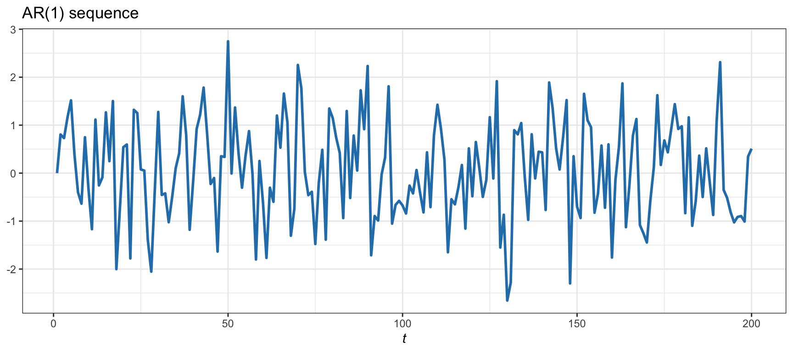
<p class="caption">(\#fig:example-AR1)Example of a unit-root stationary AR(1) sequence.</p>
</div>

Even though mean reversion and unit-root stationarity are not equivalent concepts, from a practical standpoint unit-root stationarity is a convenient proxy for mean reversion [@Tsay2010; @Tsay2013]. In fact, testing for unit-root stationarity is the de facto approach for determining mean reversion in practice.


_Differencing_ is an operation commonly used to obtain stationarity [@Tsay2010; @Tsay2013]. It refers to taking differences between consecutive samples of a time series $y_1, y_2, y_3, \dots$ to produce $\Delta y_t = y_t - y_{t-1}$. The importance of this operation is that a nonstationary time series, such as a random walk, may become stationary after differencing. This is precisely the case when differencing the log-prices of an asset to obtain the log-returns (see Chapter\ \@ref(iid-modeling) for details); we then say that log-prices are integrated of order 1 (higher-order differencing can also be considered).

<!---
Mathematically, a time series is called integrated of order $p$, denoted as $I(p)$, if it becomes weakly stationary after differencing $p$ times, while not being weakly stationary after differencing $p-1$ times. According to this, we can say that stock log-prices are integrated of order 1, $I(1)$: they are not stationary (random walk) but the log-returns are (at least for some duration).
--->


## Cointegration and Correlation {#cointegration-vs-correlation}
Mean reversion, as previously described, refers to the tendency of a time series to return to its long-term average value over time. This property allows for a simple trading strategy: buy when below the average and sell when above. While it is virtually impossible to find an asset with controlled and predictable mean reversion, it is much easier to discover pairs of assets with a combined mean reversion property.


### Cointegration
\index{cointegration}
_Cointegration_ refers to a property by which two (or more) assets, while not being mean reverting individually, may be mean reverting with respect to each other [@Vidyamurthy2004; @Ehrman2006; @Chan2013]. This commonly happens when the series themselves contain stochastic trends (i.e., they are nonstationary) but nevertheless they move closely together over time in a way that their difference remains stable (i.e., stationary). Thus, the concept of cointegration mimics the existence of a long-run equilibrium to which an economic system converges over time.

The intuitive idea is that, while it may be difficult or impossible to predict individual assets, it may be easier to predict their relative behavior. The typical example used to illustrate the concept of cointegration is that of a drunken man wandering the streets (random walk) with a dog (illustrated in Figure\ \@ref(fig:drunkman-with-dog)). Both paths of man and dog are nonstationary and difficult to predict, but the distance between them is mean reverting and stationary.


(ref:drunkman-with-dog) Random walk by a drunken man with a dog.\protect\raisebox{-.9ex}{\protect\footnotemark}

<div class="figure" style="text-align: center">

<p class="caption">(\#fig:drunkman-with-dog)(ref:drunkman-with-dog)</p>
</div>
\footnotetext{Image credit: doodlemachine/DigitalVision Vectors/Getty Images.}

<!---
**Alternative for HTML Output:**
```markdown
(ref:drunkman-with-dog) Random walk by a drunken man with a dog.[^image-credit-man-with-dog]

[^image-credit-man-with-dog]: Image credit

```
knitr::include_graphics("figures/pairs-trading/man-with-dog-GettyImage.jpg")    
```
--->

Mathematically, a multivariate time series, $\bm{y}_1,\bm{y}_2,\bm{y}_3,\dots$, is cointegrated if some linear combination becomes integrated of lower order, for example, if $\bm{y}_t$ is not stationary but the linear combination $\w^\T\bm{y}_t$ is stationary for some weights $\w$. In this sense, cointegration can be thought of as a more refined version of a time series being integrated of order 1. To be more specific, suppose the multivariate time series $\bm{y}_t$ denotes the log-prices of some stocks. Such a time series is nonstationary (random walk) but after differencing we obtain the log-returns, which are stationary. Cointegration provides a more refined version that allows us to obtain a stationary time series without having to difference it. Instead, by taking a linear combination $\w^\T\bm{y}_t$ we might be able to obtain a stationary time series. As covered later, this property has remarkable consequences in terms of trading and it forms the basics of pairs trading.

A simple and common way to model cointegration of two time series is as
\begin{equation}
  \begin{aligned}
  y_{1t} &= \gamma \, x_{t} + w_{1t},\\
  y_{2t} &= x_{t} + w_{2t},
  \end{aligned}
  (\#eq:pairs-common-trend)
\end{equation}
where $x_t$ is a stochastic common trend defined as a random walk,
$$
x_{t} = x_{t-1} + w_{t},
$$
and the terms $w_{1t}$, $w_{2t}$, $w_{t}$ are i.i.d. residual terms, mutually independent, with variances $\sigma_1^2$, $\sigma_2^2$, and $\sigma^2$, respectively. The coefficient $\gamma$ is the key quantity that determines the cointegration relationship. It is important to note that each of the time series, $y_{1t}$ and $y_{2t}$, is a random walk plus additional noise, therefore nonstationary. However, since they share a common stochastic trend, a simple linear combination of the two can eliminate this trend. The so-called _spread_ is precisely this linear combination without the trend:
$$
z_{t} = y_{1t} - \gamma \, y_{2t} = w_{1t} - \gamma \, w_{2t},
$$
which is stationary and mean reverting.


### Correlation
\index{correlation}
_Correlation_ is a basic concept in probability that refers to how "related" two random variables are. We can use this measure for stationary time series but definitely not with nonstationary time series. In fact, when we refer to correlation between two financial assets, we are actually employing this concept on the returns of the assets and not the price values.

Specifically, given two time series of log-prices, $y_{1t}$ and $y_{2t}$, we can obtain the log-returns as the differences $\Delta y_{1t}$ and $\Delta y_{2t}$. Then the correlation can be safely defined, assuming stationarity, as
$$
\rho = \frac{\E\left[\left(\Delta y_{1t} - \mu_1\right) \cdot \left(\Delta y_{2t} - \mu_2\right)\right]}{\sqrt{\textm{Var}(\Delta y_{1t}) \cdot \textm{Var}(\Delta y_{2t})}},
$$
where $\mu_1$ and $\mu_2$ denote the means of $\Delta y_{1t}$ and $\Delta y_{2t}$, respectively, and the denominator normalizes with respect to the variances of the two variables, $\textm{Var}(\Delta y_{1t})$ and $\textm{Var}(\Delta y_{1t})$, so that the correlation is bounded as $-1 \le \rho \le 1$.

The interpretation of correlation is quite simple: it is high when the two time series co-move (they move simultaneously in the same direction) and it is zero when they move independently.


### Correlation vs. Cointegration
At this point, the concepts of correlation and cointegration have been introduced, but their similarity and difference may be unclear and confusing. After all, it seems that they both try to capture the concept of similarity of movements of two time series, so superficially they may seem to be similar concepts. However, they are totally different right from their definition.

As a matter of fact, the correlation of the differences of the two cointegrated time series in the model \@ref(eq:pairs-common-trend) can be analytically derived as
$$
\rho = \frac{1}{\sqrt{1+2\frac{\sigma_{1}^{2}}{\sigma^{2}}}\sqrt{1+2\frac{\sigma_{2}^{2}}{\sigma^{2}}}},
$$
which can be made as small as desired by properly choosing the variances of the residual terms $\sigma_1^2$, $\sigma_2^2$, and $\sigma^2$. That is, we can have two perfectly cointegrated time series with an arbitrarily small correlation, which may be surprising at first. This reveals that cointegration and correlation are two totally different concepts, yet they both attempt to measure the similarity of the movements of two time series. The following examples illustrate this difference.


::: {.example #time-series-cointegrated-uncorrelated name="Example of cointegrated time series with low correlation"}
Consider the common trend model in \@ref(eq:pairs-common-trend) with $\gamma=1$ and the standard deviations $\sigma=0.1$ and $\sigma_1=\sigma_2=0.2$. The theoretical correlation is $\rho=$ 0.111, whereas the empirical correlation computed with 200 observations is $\rho=0.034$, and with $2\,000$ observations $\rho=0.108$. Figure\ \@ref(fig:time-series-cointegrated-uncorrelated) shows the two nonstationary time series, $y_{1t}$ and $y_{2t}$, the stationary spread, $z_{t}$, as well as the scatter plot of the differences $\Delta y_{1t}$ vs. $\Delta y_{2t}$, which does not show any preferred direction as expected for low correlation.
:::

<div class="figure" style="text-align: center">

<p class="caption">(\#fig:time-series-cointegrated-uncorrelated)Example of cointegrated time series with low correlation.</p>
</div>


::: {.example #time-series-notcointegrated-correlated name="Example of non-cointegrated time series with high correlation"}
Consider the common trend model in \@ref(eq:pairs-common-trend) with $\gamma=1$ and the standard deviations $\sigma=0.3$ and $\sigma_1=\sigma_2=0.05$. In addition, add the linear trend $0.01\times t$ to the first time series $y_{1t}$, which will destroy the cointegration between the two time series while not affecting the correlation. In this case, the theoretical correlation is $\rho=$ 0.947, whereas the empirical correlation computed with 200 observations is $\rho=0.952$, and with $2\,000$ observations $\rho=0.941$. Figure\ \@ref(fig:time-series-notcointegrated-correlated) shows the two nonstationary time series, $y_{1t}$ and $y_{2t}$, the nonstationary spread, $z_{t}$, as well as the scatter plot of the differences $\Delta y_{1t}$ vs. $\Delta y_{2t}$, which clearly shows a preferred direction as expected for high correlation.
:::

<div class="figure" style="text-align: center">

<p class="caption">(\#fig:time-series-notcointegrated-correlated)Example of non-cointegrated time series with high correlation.</p>
</div>


Thus, both correlation and cointegration attempt to measure the same concept of co-movement of time series, but they do it in very different ways, namely:

- Correlation is high when the two time series co-move (they move simultaneously in the same direction) and zero when they move independently.

- Cointegration is high when the two time series move together and remain close to each other, and nonexistent when they do not stay together.


One way to understand the fundamental difference is in terms of short term vs. long term. Correlation is concerned with the short-term movements, that is, the directional movement from one period to the next, while ignoring the long-term trends. Cointegration, on the other hand, focuses on the long term, that is, whether the two time series have diverged or not after many periods, while being oblivious to short-term variations.


This short term vs. long term interpretation can be made more precise as follows. Define the difference of a time series $y_{t}$ over $k$ periods as $r_t(k) = y_{t} - y_{t-k}$. Our goal is to measure the similarity of two time series $y_{1t}$ and $y_{2t}$ over $t=0,\dots,T$:

- Correlation does it via the one-period differences $r_{1t}(1) = \Delta y_{1t}$ and $r_{2t}(1) = \Delta y_{2t}$ over $t=1,\dots,T$.

- Cointegration measures the difference between the two time series $y_{1t} - y_{2t}$ (assuming $\gamma=1$ for simplicity). Equivalently, each time series can be shifted with its initial value and then they can be compared for divergence. Interestingly, these shifted time series are precisely the $t$-period differences $r_{1t}(t) = y_{1t} - y_{10}$ and $r_{2t}(t) = y_{2t} - y_{20}$ over $t=1,\dots,T$.


For pairs trading, it is the cointegration that matters, and not the correlation, because the focus is precisely on the long-term mean reversion property.


## Pairs Trading {#pairs-trading-overview}
\index{pairs trading}
\index{statistical arbitrage}
Trading an asset with mean reversion is quite simple: buy when it is below its mean value and unwind the position when it recovers to make a profit; similarly, short-sell it when it is above its mean value and unwind the position when it reverts back. Unfortunately, it is virtually impossible to find such a mean-reverting asset directly in a financial market. In fact, if there were such an asset, then many traders would notice and trade it, which would immediately eliminate its profitability.

In practice, one can attempt to discover a cointegrated pair of assets and then create a virtual mean-reverting asset (a spread). By virtue of the mean reversion property of the constructed spread, the common market trend present in the two original assets is nonexistent in the spread, which means that the spread does not follow the market trend and it is market neutral.

_Pairs trading_ is a market-neutral strategy that trades a mean-reverting spread. That is, it identifies two historically cointegrated financial instruments, such as stocks, and takes long and short positions in the two instruments when their prices deviate from their historical mean relationship, with the expectation that the prices will eventually revert back to the historical equilibrium, allowing the trader to profit from the convergence. Some monographic books on pairs trading include @Vidyamurthy2004, @Ehrman2006, and @Chan2013; see also @FengPal2016monograph.

Pairs trading was developed in the mid-1980s by a quantitative trading team led by Nunzio Tartaglia at Morgan Stanley, achieving significant success. The team was disbanded in 1989 and the members joined various other trading firms. As a consequence, the initial secrecy of pairs trading was lost and the technique spread over the quant community.


Trading strategies can be broadly classified according to the underlying philosophy as follows:

- _Momentum-based strategies (or directional trading)_: These attempt to capture the market trend while treating the fluctuations as undesired noise (risk).

- _Pairs trading (or statistical arbitrage)_: These strategies are market neutral and try to trade the mean-reverting fluctuations of the relative mispricings between the two securities.

Figure\ \@ref(fig:decomposition-momentum-noise) displays the breakdown of an asset's prices into the trend component (captured by momentum-based strategies) and the mean-reverting component (captured by pairs trading).

<div class="figure" style="text-align: center">

<p class="caption">(\#fig:decomposition-momentum-noise)Decomposition of asset price into trend component and mean-reverting component.</p>
</div>


### Spread
\index{spread}
The simplest implementation of pairs trading is based on comparing the spread of the two time series $y_{1t}$ and $y_{2t}$ to a threshold $s_0$. Suppose that the spread
$$
z_{t} = y_{1t} - \gamma \, y_{2t}
$$
is mean reverting with mean $\mu$. Then, the idea is to either buy if the spread is low, $z_t < \mu - s_0$, or short-sell if it is high, $z_t > \mu + s_0$, and then unwind the position, for example, when it reverts back to the mean after $k$ periods, leading to a difference of at least $|z_{t+k} - z_{t}| \ge s_0$. Figure\ \@ref(fig:pairs-trading) illustrates this process of pairs trading by buying and short-selling the spread according based on the threshold $s_0 = 1.5$.

<div class="figure" style="text-align: center">

<p class="caption">(\#fig:pairs-trading)Illustration of pairs trading via thresholds on the spread.</p>
</div>


### Prices vs. Log-Prices
Pairs trading can be implemented in terms of prices or log-prices. This is determined by whether cointegration is exhibited by time series or prices or log-prices. The interpretation is slighly different as explained next.

Suppose first that $y_{1t}$ and $y_{2t}$ represent the prices of the two assets that define the mean-reverting spread $z_{t} = y_{1t} - \gamma \, y_{2t}$. In this case, the coefficients used in the spread (1 and $\gamma$) represent number of shares (to be bought and sold) and the spread has a meaning of price value. Thus, the spread difference corresponds to the profit made during the $k$ periods (ignoring transaction costs):
$$
z_{t+k} - z_{t} = s_0.
$$

Suppose now that $y_{1t}$ and $y_{2t}$ represent the log-prices of two assets. In this case, it is convenient to use the portfolio notation (see Chapter\ \@ref(portfolio-101)). Basically, we can define the two-asset portfolio
$$
\w = \begin{bmatrix} \;\;\;1\\ -\gamma \end{bmatrix},
$$
where now the coefficients 1 and $\gamma$ represent normalized dollar values instead of shares, and the spread can be compactly written as
$$
z_{t} = \w^\T\bm{y}_{t},
$$
where $\bm{y}_{t} = \begin{bmatrix} y_{1t}\\ y_{2t} \end{bmatrix}$. With this notation, it becomes evident that the spread difference corresponds (approximately) to the return made during the $k$ periods (ignoring transaction costs):
$$
\w^\T \left( \bm{y}_{t+k} - \bm{y}_{t} \right) = z_{t+k} - z_{t} = s_0.
$$

Note that this is an approximation because the return of the portfolio should be calculated using the linear returns, $\w^\T \left( \textm{exp}(\bm{y}_{t+k} - \bm{y}_{t}) - \bm{1} \right)$, instead of the log-returns; nevertheless, these two quantities are approximately equal because $\textm{exp}(x) - 1 \approx x$ for small $x$ (see Chapter\ \@ref(portfolio-101) for details). Also, note that this portfolio has leverage $1 + \gamma$, so in practice we may want to normalize it to unit leverage.

Summarizing, depending on whether the original cointegrated time series correspond to prices or log-prices, the threshold $s_0$ will determine the absolute profit or the return of the trade over these $k$ periods. The choice is dictated by the nature of the cointegration of the time series. It is important to remark that in the case of cointegrated log-prices, the portfolio $\w$ has a meaning of normalized dollars, which may require a rebalancing over time (increased transaction costs); for cointegrated prices, the number of shares naturally stays constant over time and does not require rebalancing. This makes cointegrated price series more attractive; unfortunately, in practice, it is more difficult to find cointegrated price series since the noise in prices is less symmetric than that in log-prices, making the potential spreads less stationary.


### Is Pairs Trading Profitable?
It is important to note that pairs trading relies on the assumption that the historical relationship between the two instruments will persist in the future. However, this is not always the case and cointegration between financial instruments can change over time due to various factors, such as market conditions, industry trends, or company-specific events. Therefore, pairs trading carries risks, and traders should carefully monitor the relationship between the instruments and use risk management techniques to protect their positions. Some publications show that pairs trading can provide profits [@ElliottHoekMalcolm2005; @GatevGoetzmannRouwenhorst2006; @AvellanedaLee2010], while others indicate that cointegration relationships may not be preserved over time [@Chan2013; @Clegg2014].

The positive results should always be taken with a grain of salt for a number of reasons: backtests may ignore transaction costs, which can exceed the profit made trading the spread [@Chan2008]; strategies may have yielded profits in the past while their effectiveness may have diminished in more recent times [@Chan2013]; and the practical implementation entails certain technical difficulties, such as the potential lack of liquidity for short-selling, the danger of margin calls (being forced to liquidate positions during inopportune times), the need for higher-frequency trading due to the competition of other traders, and the decimalization of U.S. stock prices, which caused bid--ask spreads to dramatically narrow, affecting the spreads [@Chan2013]. Nevertheless, the proper use of Kalman filtering (covered in Section\ \@ref(kalman-pairs-trading)) and VECM modeling (overviewed in Section\ \@ref(statarb)) can help remedy many of the shortcomings.


### Design of Pairs Trading
We have covered the basic idea of pairs trading, which relies on cointegrated pairs. The rest of this chapter revolves around the design of pairs trading in detail. In a nutshell, the objective is to trade profitably a mean-reverting spread, which requires: (i)\ discovering cointegrated pairs (Section\ \@ref(discovering-pairs)), from simple prescreening to more sophisticated statistical tests, and (ii)\ designing the trading strategy (Section\ \@ref(trading-spread)), which basically boils down to the choice of the threshold $s_0$ or other more sophisticated methods.

More advanced topics include the use of Kalman filtering for estimating a time-varying cointegration relationship (Section\ \@ref(kalman-pairs-trading)) and the extension of pairs trading to more than two assets (Section\ \@ref(statarb)).


## Discovering Cointegrated Pairs {#discovering-pairs}
\index{cointegration}
The key in pairs trading lies in being able to discover cointegrated pairs. The available methods range from simple heuristics to sophisticated multivariate modeling [@Krauss2017].


### Prescreening
Prescreening is a simple and cheap process by which many pairs can be easily discarded while some potential pairs are selected for further analysis. A common heuristic proxy for cointegration is the normalized price distance (NPD) defined as [@GatevGoetzmannRouwenhorst2006]
$$
\textm{NPD} \triangleq \sum_{t=1}^{T}\left(\tilde{p}_{1t} - \tilde{p}_{2t}\right)^{2},
$$
where $\tilde{p}_{1t}$ and $\tilde{p}_{2t}$ are the normalized prices,
$$
\begin{aligned}
  \tilde{p}_{1t} &= p_{1t}/p_{10},\\
  \tilde{p}_{2t} &= p_{2t}/p_{20},
\end{aligned}
$$
with $p_{1t}$ and $p_{2t}$ being the original prices.

A similar distance measure can be defined in terms of log-prices, $y_{1t}$ and $y_{2t}$, by subtracting the initial value:
$$
\begin{aligned}
  \tilde{y}_{1t} &= y_{1t} - y_{10},\\
  \tilde{y}_{2t} &= y_{2t} - y_{20}.
\end{aligned}
$$
Note that these shifted log-prices correspond to the long-term difference series, that is, the log-returns over long periods described earlier in Section\ \@ref(cointegration-vs-correlation) and denoted by $r_{1t}(t)$ and $r_{2t}(t)$.


### Cointegration Tests
\index{cointegration!tests}
After the initial prescreening process of potential cointegrated pairs of assets, a more thorough analysis has to be performed. This is the job of the _cointegration tests_ developed in the statistics literature for decades [@Harris1995; @Tsay2010; @Tsay2013]. In a nutshell, these tests check whether or not a linear combination of the two time series follows a stationary autoregressive model and will be mean reverting. A time series with a unit root is nonstationary and behaves like a random walk. On the other hand, in the absence of unit roots, a time series tends to revert to its long-term mean. Thus, cointegration tests are typically implemented via unit-root stationarity tests.

Mathematically, we want to determine whether there exists a value of $\gamma$ such that the spread
$$
z_{t} = y_{1t} - \gamma \, y_{2t}
$$
is stationary. Note that, in practice, the mean of the spread $\mu$ (equilibrium value) is not necessarily zero and $\gamma$ does not have to be one. In fact, many studies artificially set $\gamma=1$ to obtain dollar-neutral strategies [@ElliottHoekMalcolm2005; @GatevGoetzmannRouwenhorst2006; @TriantafyllopoulosMontana2011]; however, that reduces the number of cointegrated pairs.

One of the simplest and most direct methods to test for cointegration is the Engle--Granger[^Engle-Granger-nobel-prize] test [@EngleGranger1987]. It is based on two steps: first, the value of $\gamma$ is obtained via least squares regression, and then the residual is tested for stationarity.[^cointegration-packages] More exactly, the two sequences $y_{1t}$ and $y_{2t}$ are regressed against each other (see Chapter\ \@ref(iid-modeling) for details on least squares regression),
$$
y_{1t} - \gamma \, y_{2t} = \mu + r_t,
$$
and the residual $r_t$ is checked for unit-root stationarity or some form of mean reversion.

[^Engle-Granger-nobel-prize]: The Sveriges Riksbank Prize in Economic Sciences in Memory of Alfred Nobel 2003 was divided equally between Robert F. Engle III "for methods of analyzing economic time series with time-varying volatility (ARCH)" and Clive W. J. Granger "for methods of analyzing economic time series with common trends (cointegration)." \index{Nobel prize!Robert F. Engle} \index{Nobel prize!Clive W. J. Granger}

[^cointegration-packages]: The R packages [`urca`](https://cran.r-project.org/package=urca) and [`egcm`](https://cran.r-project.org/package=egcm) implement a long list of stationarity and cointegration tests [@urca; @egcm]. \index{R packages!urca} \index{R packages!egcm}


There are many heuristic ways to measure the strength of the mean reversion of the residual. For example, one can use the mean-crossing rate, that is, the number of times the residual crosses its mean value over a period of time [@Vidyamurthy2004]: the higher the mean crossing rate, the stronger the mean reversion. Another measure is the half-life of the mean reversion [@Chan2013], which quantifies the time it takes for a time series to return to within half of the distance from the mean after deviating a certain amount from the mean.


More formally, we can use mathematically well-defined statistical tests. A variety of such tests have been proposed over time, with some of the most popular ones being [@BanerjeeDoladoGalbraithHendry1993; @Harris1995; @Pfaff2008; @Tsay2010; @Tsay2013]:

- Dickey--Fuller (DF)
- augmented Dickey--Fuller (ADF)
- Phillips--Perron (PP)
- Pantula, Gonzales-Farias, and Fuller (PGFF) <!---[@PantulaGonzalezFariasFuller1994]--->
- Elliott, Rothenberg, and Stock DF-GLS (ERSD)
- Johansen's trace test (JOT)
- Schmidt and Phillips rho (SPR)


For example, the simplest model for the residual is
$$
r_t = \rho \, r_{t-1} + \epsilon_t,
$$
where $\epsilon_t$ is the innovation term, and stationarity requires no unit root in the autoregressive term, that is, $|\rho| < 1$. The DF test [@DickeyFuller1979] precisely formulates a hypothesis testing problem by defining the null hypothesis as a unit root being present ($\rho=1$) and the alternative hypothesis as the series being stationary ($|\rho|<1$). Under these two hypotheses, a small $p$-value[^p-value-ch15] indicates strong stationarity (rejection of the null hypothesis). The model for the residual can be extended to incorporate a constant and a linear trend:
$$
r_t = \phi_0 + c\,t +  \rho\,r_{t-1} + \epsilon_t.
$$
The popular ADF test includes further higher-order autoregressive terms in the model.

[^p-value-ch15]: The $p$-value is the probability of obtaining the observed results under the assumption that the null hypothesis is correct. A small $p$-value means that there is strong evidence to reject the null hypothesis and accept the alternative hypothesis. Typical thresholds for determining whether a $p$-value is small enough are in the range 0.01--0.05.


### Cointegration of More Than Two Time Series
The Engle--Granger cointegration test has some drawbacks: it is designed for two time series (assets) and, even then, the first step in performing the regression of one time series vs. the other is sensitive to the ordering of the variables. The method can be naturally extended to more than two assets (described in Section\ \@ref(statarb)), but then the ordering of the variables becomes more critical. An alternative method is Johansen's test [@Johansen1991; @Johansen1995], which is based on a multivariate time series modeling, explored in Section\ \@ref(statarb) (see Chapter\ \@ref(time-series-modeling) for details on time series models).

Specifically, Johansen's test first fits a multivariate VECM time series model for $N$ assets (see \@ref(eq:VECM) in Section\ \@ref(statarb)), which contains a key $N \times N$ matrix $\bm{\Pi}$ characterizing the cointegration. Then, it proceeds to analyze the rank of this matrix $\bm{\Pi}$, which precisely reveals the number of different cointegration relationships present.


### Are Cointegrated Pairs Persistent?
It may seem that once a cointegrated pair has been discovered and has passed the necessary tests, the job is done and pairs trading will be profitable. Unfortunately, an additional issue to consider is whether this cointegration will be persistent over time or not. 

In practice, it is not difficult to find cointegrated pairs during some chosen period of time of historical data, but they can just as easily lose cointegration in the subsequent out-of-sample period [@Chan2013]. The reason for this difficulty is that the fortunes of one company can change very quickly depending on management decisions, the competition, or simply bad news affecting one company and not the other.

In fact, empirical studies have shown evidence that does not support the hypothesis that cointegration is a persistent property [@Clegg2014]. The spread series of pairs are typically affected by a steady stream of permanent shocks that affect the cointegration. To bypass such practical problems, time-varying versions of cointegration can be considered (see Section\ \@ref(kalman-pairs-trading) for the use of Kalman filtering) and even relaxed forms of cointegration can also be entertained, such as the concept of partial cointegration that allows the spread to contain a random walk component [@CleggKrauss2018].


### Numerical Experiments
We start with synthetic data and then consider some real examples based on stocks, commodities, and exchange-traded funds (ETFs).


#### Synthetic Data in Example \@ref(exm:time-series-cointegrated-uncorrelated) {-}
Recall Example \@ref(exm:time-series-cointegrated-uncorrelated), and the corresponding Figure\ \@ref(fig:time-series-cointegrated-uncorrelated), where a synthetic cointegrated time series was generated with low correlation. The estimated cointegration relationship via least squares based on $T=200$ observations is
$$
\begin{aligned}
  y_{2t} &= 0.80 \; y_{1t} + 0.20 + r_t,\\
  r_t    &= 0.12 \, r_{t-1} + \epsilon_t,
\end{aligned}
$$
where the residual $r_t$ has a small autoregressive coefficient of 0.12, indicating no unit root. This can be observed from the plot of the residual in Figure\ \@ref(fig:residual-cointegrated-uncorrelated-example), with an estimated half-life of 0.33 (strong mean reversion). More quantitatively, Table\ \@ref(tab:tests-cointegrated-uncorrelated-example) gives the $p$-values corresponding to several cointegration and residual unit-root tests. All the $p$-values are below a reasonable threshold of, say, 0.01 and therefore the null hypothesis (existence of a unit root) can be rejected, which means cointegration of the two time series is accepted.


(ref:residual-cointegrated-uncorrelated-example) Cointegration residual for Example \@ref(exm:time-series-cointegrated-uncorrelated) with cointegration and low correlation.

<div class="figure" style="text-align: center">

<p class="caption">(\#fig:residual-cointegrated-uncorrelated-example)(ref:residual-cointegrated-uncorrelated-example)</p>
</div>

<table class="table" style="width: auto !important; margin-left: auto; margin-right: auto;">
<caption>(\#tab:tests-cointegrated-uncorrelated-example)Cointegration and residual unit-root tests for Example 15.1.</caption>
 <thead>
  <tr>
   <th style="text-align:left;"> Test </th>
   <th style="text-align:center;"> $p$-value </th>
  </tr>
 </thead>
<tbody>
  <tr>
   <td style="text-align:left;width: 10em; "> ADF </td>
   <td style="text-align:center;width: 10em; "> 0.0081 </td>
  </tr>
  <tr>
   <td style="text-align:left;width: 10em; "> PP </td>
   <td style="text-align:center;width: 10em; "> 0.0001 </td>
  </tr>
  <tr>
   <td style="text-align:left;width: 10em; "> PGFF </td>
   <td style="text-align:center;width: 10em; "> 0.0001 </td>
  </tr>
  <tr>
   <td style="text-align:left;width: 10em; "> ERSD </td>
   <td style="text-align:center;width: 10em; "> 0.0008 </td>
  </tr>
  <tr>
   <td style="text-align:left;width: 10em; "> JOT </td>
   <td style="text-align:center;width: 10em; "> 0.0001 </td>
  </tr>
  <tr>
   <td style="text-align:left;width: 10em; "> SPR </td>
   <td style="text-align:center;width: 10em; "> 0.0001 </td>
  </tr>
</tbody>
</table>


#### Synthetic Data in Example \@ref(exm:time-series-notcointegrated-correlated) {-}
Consider now Example \@ref(exm:time-series-notcointegrated-correlated), and the corresponding Figure\ \@ref(fig:time-series-notcointegrated-correlated), where a synthetic non-cointegrated time series was generated with high correlation. The estimated cointegration relationship via least squares based on $T=200$ observations is
$$
\begin{aligned}
  y_{2t} &= 0.68 y_{1t} + 0.16 + r_t,\\
  r_t    &= 0.91 r_{t-1} + \epsilon_t,
\end{aligned}
$$
where the residual $r_t$ has a dangerous autoregressive coefficient of 0.91, which is close to 1, suggesting that the existence of a unit root cannot be excluded. This can be corroborated from the residual shown in Figure\ \@ref(fig:residual-notcointegrated-correlated-example), with an estimated half-life of 7.29 (weak mean reversion). Additionally, Table\ \@ref(tab:tests-notcointegrated-correlated-example) gives the $p$-values corresponding to several cointegration and residual unit-root tests. In this case, all the $p$-values are much higher than any reasonable threshold of, say, 0.01 and therefore the null hypothesis (existence of a unit root) cannot be rejected, which means we cannot conclude that the two time series are cointegrated.


(ref:residual-notcointegrated-correlated-example) Cointegration residual for Example \@ref(exm:time-series-notcointegrated-correlated) with no cointegration and high correlation.

<div class="figure" style="text-align: center">
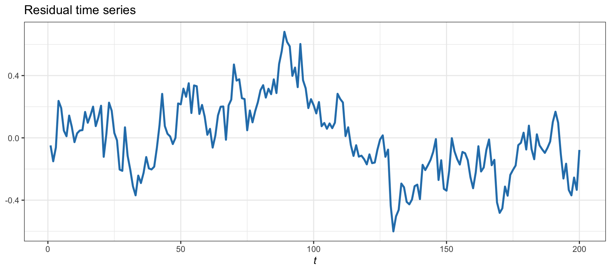
<p class="caption">(\#fig:residual-notcointegrated-correlated-example)(ref:residual-notcointegrated-correlated-example)</p>
</div>

<table class="table" style="width: auto !important; margin-left: auto; margin-right: auto;">
<caption>(\#tab:tests-notcointegrated-correlated-example)Cointegration and residual unit-root tests for Example 15.2.</caption>
 <thead>
  <tr>
   <th style="text-align:left;"> Test </th>
   <th style="text-align:center;"> $p$-value </th>
  </tr>
 </thead>
<tbody>
  <tr>
   <td style="text-align:left;width: 10em; "> ADF </td>
   <td style="text-align:center;width: 10em; "> 0.4529 </td>
  </tr>
  <tr>
   <td style="text-align:left;width: 10em; "> PP </td>
   <td style="text-align:center;width: 10em; "> 0.0608 </td>
  </tr>
  <tr>
   <td style="text-align:left;width: 10em; "> PGFF </td>
   <td style="text-align:center;width: 10em; "> 0.0700 </td>
  </tr>
  <tr>
   <td style="text-align:left;width: 10em; "> ERSD </td>
   <td style="text-align:center;width: 10em; "> 0.0767 </td>
  </tr>
  <tr>
   <td style="text-align:left;width: 10em; "> JOT </td>
   <td style="text-align:center;width: 10em; "> 0.0996 </td>
  </tr>
  <tr>
   <td style="text-align:left;width: 10em; "> SPR </td>
   <td style="text-align:center;width: 10em; "> 0.2671 </td>
  </tr>
</tbody>
</table>


#### Market Data: EWA and EWC {-}
EWA is an ETF that tracks the performance of the MSCI[^MSCI] Australia Index, which includes Australian companies from various sectors such as financials, materials, healthcare, consumer staples, and energy. Similarly, EWC is an ETF that tracks the performance of the MSCI Canada Index. Thus, the EWA and EWC provide exposure to the Australian and Canadian equity markets, respectively, and can be used by investors to gain broad exposure to these countries' economies.

[^MSCI]: Morgan Stanley Capital International (MSCI) is a leading provider of investment decision support tools and services. The company is best known for its global equity indices, which are widely used by investors to benchmark and analyze the performance of equity markets around the world.

EWA and EWC constitute a popular example in the quant community of cointegrated ETFs [@Chan2013]. The logic is that both the Canadian and Australian economies are commodity based, therefore their stock market performance is likely to be related through natural resources' prices.


The cointegration relationship during 2016--2019 is estimated via least squares. When EWA is regressed against EWC, the resulting hedge ratio is $\gamma=0.74$; but when EWC is regressed against EWA, we obtain 1.27, which is not exactly the inverse, $1/0.74 \approx 1.35$. If instead we employ Johansen's test, we obtain the more accurate weights of 1 for EWA and $-0.80$ for EWC.

Figure\ \@ref(fig:residual-EWA-vs-EWC) shows the residual of the cointegration relationship (spread), with an estimated half-life of 19 days (not very strong mean reversion). Table\ \@ref(tab:tests-EWA-vs-EWC) shows the results for the cointegration tests, with the majority of the tests indicating cointegration at the 1% level (i.e., $p$-value less than 0.01), albeit two of the tests reject cointegration, so caution should be taken.

<div class="figure" style="text-align: center">
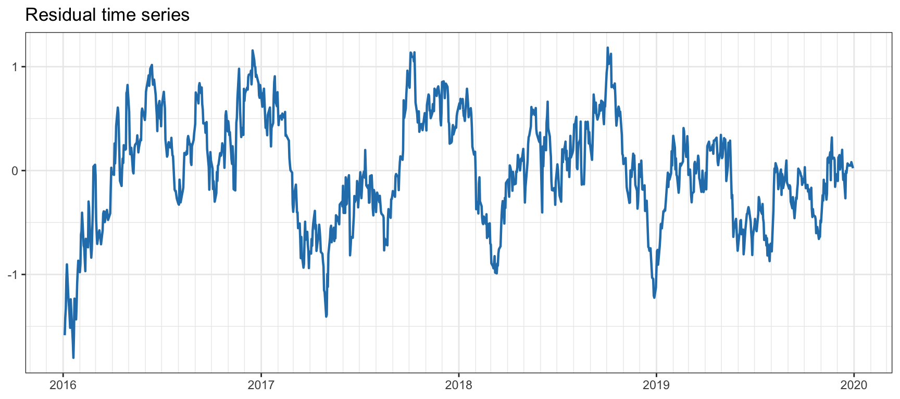
<p class="caption">(\#fig:residual-EWA-vs-EWC)Cointegration residual for EWA--EWC.</p>
</div>

<table class="table" style="width: auto !important; margin-left: auto; margin-right: auto;">
<caption>(\#tab:tests-EWA-vs-EWC)Cointegration and residual unit-root tests for EWA--EWC.</caption>
 <thead>
  <tr>
   <th style="text-align:left;"> Test </th>
   <th style="text-align:center;"> $p$-value </th>
  </tr>
 </thead>
<tbody>
  <tr>
   <td style="text-align:left;width: 10em; "> ADF </td>
   <td style="text-align:center;width: 10em; "> 0.0049 </td>
  </tr>
  <tr>
   <td style="text-align:left;width: 10em; "> PP </td>
   <td style="text-align:center;width: 10em; "> 0.0058 </td>
  </tr>
  <tr>
   <td style="text-align:left;width: 10em; "> PGFF </td>
   <td style="text-align:center;width: 10em; "> 0.0062 </td>
  </tr>
  <tr>
   <td style="text-align:left;width: 10em; "> ERSD </td>
   <td style="text-align:center;width: 10em; "> 0.5310 </td>
  </tr>
  <tr>
   <td style="text-align:left;width: 10em; "> JOT </td>
   <td style="text-align:center;width: 10em; "> 0.0069 </td>
  </tr>
  <tr>
   <td style="text-align:left;width: 10em; "> SPR </td>
   <td style="text-align:center;width: 10em; "> 0.3840 </td>
  </tr>
</tbody>
</table>


#### Market Data: Coca-Cola and Pepsi {-}
The stocks Coca-Cola (with ticker KO) and Pepsi (with ticker PEP) are often mentioned as an example of a pair of securities in the same industry group for which pairs trading might be fruitful. However, as already pointed out in @Chan2008, they do not seem to be cointegrated.

We assess the cointegration relationship during 2017--2019 via least squares. Their returns show a correlation of 0.66, which is statistically significant, but different from cointegration. Figure\ \@ref(fig:residual-KO-vs-PEP) shows the residual of the cointegration relationship (spread), with an estimated half-life of 70 days (not indicative of any cointegration). Table\ \@ref(tab:tests-KO-vs-PEP) shows the results for the cointegration tests, all of which reject the hypothesis of cointegration (all $p$-values are much larger than 0.01).


<div class="figure" style="text-align: center">

<p class="caption">(\#fig:residual-KO-vs-PEP)Cointegration residual for KO--PEP.</p>
</div>


<table class="table" style="width: auto !important; margin-left: auto; margin-right: auto;">
<caption>(\#tab:tests-KO-vs-PEP)Cointegration and residual unit-root tests for KO--PEP.</caption>
 <thead>
  <tr>
   <th style="text-align:left;"> Test </th>
   <th style="text-align:center;"> $p$-value </th>
  </tr>
 </thead>
<tbody>
  <tr>
   <td style="text-align:left;width: 10em; "> ADF </td>
   <td style="text-align:center;width: 10em; "> 0.2675 </td>
  </tr>
  <tr>
   <td style="text-align:left;width: 10em; "> PP </td>
   <td style="text-align:center;width: 10em; "> 0.1845 </td>
  </tr>
  <tr>
   <td style="text-align:left;width: 10em; "> PGFF </td>
   <td style="text-align:center;width: 10em; "> 0.1395 </td>
  </tr>
  <tr>
   <td style="text-align:left;width: 10em; "> ERSD </td>
   <td style="text-align:center;width: 10em; "> 0.0484 </td>
  </tr>
  <tr>
   <td style="text-align:left;width: 10em; "> JOT </td>
   <td style="text-align:center;width: 10em; "> 0.5627 </td>
  </tr>
  <tr>
   <td style="text-align:left;width: 10em; "> SPR </td>
   <td style="text-align:center;width: 10em; "> 0.1982 </td>
  </tr>
</tbody>
</table>


#### Market Data: SPY, IVV, and VOO {-}
Standard & Poor’s 500 (S&P 500) is one of the world’s best-known indices and one of the most commonly used benchmarks for the U.S. stock market. There are a multitude of ETFs that track this index, such as Standard & Poor's Depository Receipts SPY, iShares IVV, and Vanguard's VOO. Given that they all track the same underlying asset, it is likely that these three ETFs will have a strong cointegrating relationship.

In this case, since we want to assess cointegration among more than two time series, namely, SPY, IVV, and VOO, we cannot use the Enger--Granger test. Instead, we have to resort to Johansen's test, which first fits a VECM multivariate model and then proceeds to check sequentially the rank of matrix $\bm{\Pi}\in\R^{3 \times 3}$, which satisfies $0 \le r \le 3$.

Based on the period 2017--2019, Johansen's test produces the following results:

- First, the null hypothesis is $r=0$ vs. the alternative hypothesis $r>0$: there is clear evidence to reject the null hypothesis.
- Then, the null hypothesis is $r \le 1$ vs. the alternative hypothesis $r>1$: again we have sufficient evidence to reject the null hypothesis.
- Finally, the null hypothesis is $r \le 2$ vs. the alternative hypothesis $r>2$: in this case we cannot reject the null hypothesis.

Thus, the conclusion is that the rank is $r=2$, that is, we can find two different cointegrating relationships, whose residuals are shown in Figure\ \@ref(fig:residual-SPY-IVV-VOO).

<div class="figure" style="text-align: center">
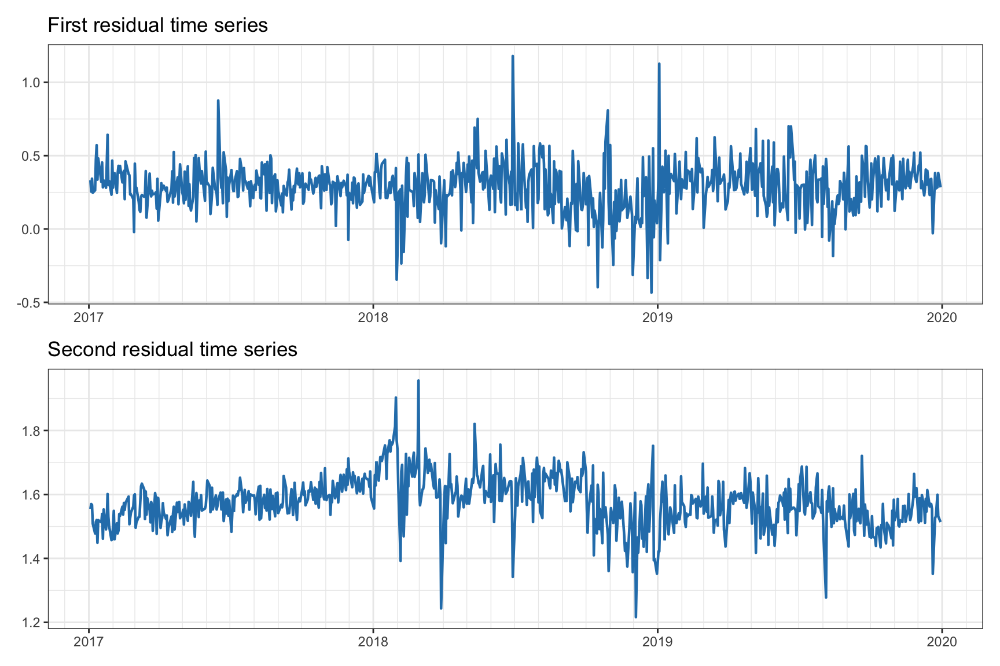
<p class="caption">(\#fig:residual-SPY-IVV-VOO)Cointegration residuals for SPY--IVV--VOO.</p>
</div>


## Trading the Spread {#trading-spread}
\index{spread}
Suppose we have discovered a cointegrated pair of log-price time series, $y_{1t}$ and $y_{2t}$, and have formed the spread $y_{1t} - \gamma \, y_{2t},$ which is effectively using the two-asset portfolio $\w = \left[1, -\gamma\right]^\T$ with a leverage of $\| \w\|_1 = 1+\gamma$. In order to make fair comparisons, it is necessary to normalize the leverage to 1. Thus, the portfolio with normalized leverage is
\begin{equation}
  \w = \frac{1}{1+\gamma}\begin{bmatrix} \;\;\;1\\ -\gamma \end{bmatrix},
  (\#eq:w-pairs-trading)
\end{equation}
with corresponding normalized spread $z_{t} = \w^\T\bm{y}_{t}$. The return of this portfolio at time $t$ (ignoring transaction costs) is given by $\w^\T \left( \bm{y}_{t} - \bm{y}_{t-1} \right) = z_{t} - z_{t-1}$ (see Chapter\ \@ref(portfolio-101) for details on portfolio notation). Suppose we enter a position at time $t$ and after $k$ periods the spread reverts to the mean and the position is closed. This would lead to a difference of at least $|z_{t+k} - z_{t}| \ge s_0$, which is the portfolio return during these $k$ periods.


Trading the spread boils down to deciding when to buy or short-sell the spread, and how much to invest (termed sizing). This is conveniently done by defining a "signal" time series $s_1, s_2, s_3,\dots$, where $s_t$ denotes the sizing (positive for buying, zero for no position, and negative for short-selling) usually bounded as $-1 \le s_t \le 1$ to control the leverage. We will assume that the value of the signal at time $t,$ $s_t,$ has been decided based on information up to (and including) time $t$, that is, $\dots,\bm{y}_{t-2},\bm{y}_{t-1},\bm{y}_{t}$. Thus, the combination of the spread portfolio \@ref(eq:w-pairs-trading) and the signal $s_t$ produces the time-varying portfolio $s_t \times \w$, with corresponding return
$$
R^\textm{portf}_t = s_{t-1} \times \w^\T \left( \bm{y}_{t} - \bm{y}_{t-1} \right) = s_{t-1} \times (z_{t} - z_{t-1}).
$$

### Trading Strategies
To define a strategy to trade the spread, it suffices to determine a rule for the sizing signal $s_t$. For this purpose, it is convenient to use a normalized version of the spread, called the standard score or $z$-score:
$$
z^\textm{score}_t = \frac{z_t - \E[z_t]}{\sqrt{\textm{Var}(z_t)}},
$$
which has zero mean and unit variance. This $z$-score cannot be used in a real implementation since it is not causal and suffers from look-ahead bias (when estimating the mean and variance). A naive approach would be to use some training data to determine the mean and standard deviation, and then apply that to the future out-of-sample data. A more sophisticated way is to make the calculation adaptive by implementing it in a rolling fashion, for example via the so-called Bollinger Bands.

Bollinger Bands are a technical trading tool created by John Bollinger in the early 1980s. They arose from the need for adaptive trading bands and the observation that volatility was dynamic. They are computed on a rolling-window basis over some lookback window. In particular, the rolling mean and rolling standard deviation are first computed, from which the upper and lower bands are easily obtained (typically the mean plus/minus one or two standard deviations). In the context of the $z$-score, the spread can be adaptively normalized with the rolling mean and rolling standard deviation.


We now describe two of the simplest possible strategies for trading a spread, namely, the linear strategy and the thresholded strategy.

- The _linear strategy_ is very simple to describe based on the contrarian idea of buying low and selling high [@Chan2013]. As a first attempt, we could define the sizing signal simply as the negative $z$-score, $s_t = -z^\textm{score}_t$, to gradually scale-in and scale-out or, even better, including a scaling factor as $s_t = -z^\textm{score}_t / s_0$, where $s_0$ denotes the threshold at which the signal is fully leveraged. In practice, to limit the leverage to 1, we can project this value to lie in the interval $[-1,1]$:
$$
s_t = -\left[\frac{z^\textm{score}_t}{s_0}\right]_{-1}^{+1},
$$
where $[\cdot]_a^b$ clips the argument to $a$ if below that value and to $b$ if above that value. 

- The _thresholded strategy_ follows similarly the contrarian nature of buying low and selling high, but rather than linear it takes an all-in or all-out sizing based on thresholds [@Vidyamurthy2004]. The simplest implementation is based on comparing the $z$-score to a threshold $s_0$: buy when the $z$-score is below $-s_0$ and short-sell when it is above $s_0$, while unwinding the position after reverting to the equilibrium value of zero. In terms of the sizing signal:
$$
s_t = 
\begin{cases}
  \begin{aligned}
  +1 &\qquad \textm{if } z^\textm{score}_t < - s_0,\\
   0 &\qquad \textm{after }z^\textm{score}_t\textm{ reverts to }0,\\
  -1 &\qquad \textm{if } z^\textm{score}_t > + s_0.
  \end{aligned}
\end{cases}
$$


Figures\ \@ref(fig:pairs-trading-linear-strategy) and\ \@ref(fig:pairs-trading-thresholded-strategy) illustrate the linear and thresholded strategies, respectively, based on a synthetic spread generated as an AR(1) with an autoregressive coefficient of 0.7. Observe the different nature of the sizing signal: continuous vs. on--off. The thresholds have been chosen arbitrarily as $s_0=1$ and should be properly optimized for maximizing the profit (as described in detail in the next section). In practice, the rolling version of the $z$-score should be used to make it implementable without look-ahead bias, such as based on the Bollinger Bands [@Chan2013].


<div class="figure" style="text-align: center">
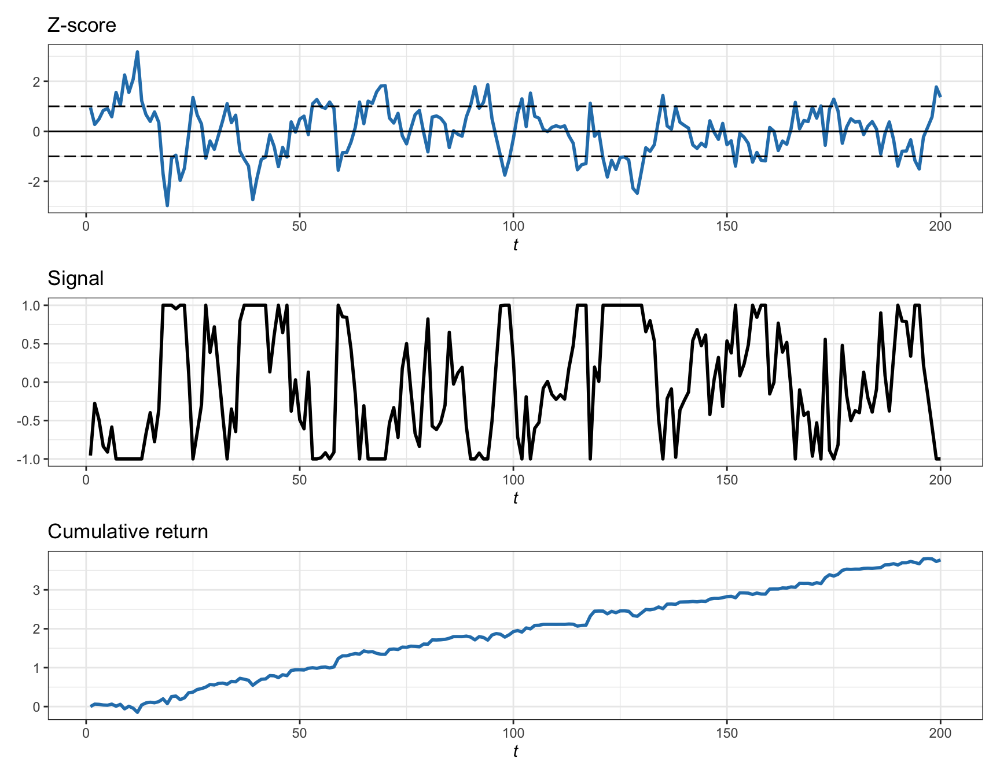
<p class="caption">(\#fig:pairs-trading-linear-strategy)Illustration of pairs trading via the linear strategy on the spread.</p>
</div>


<div class="figure" style="text-align: center">
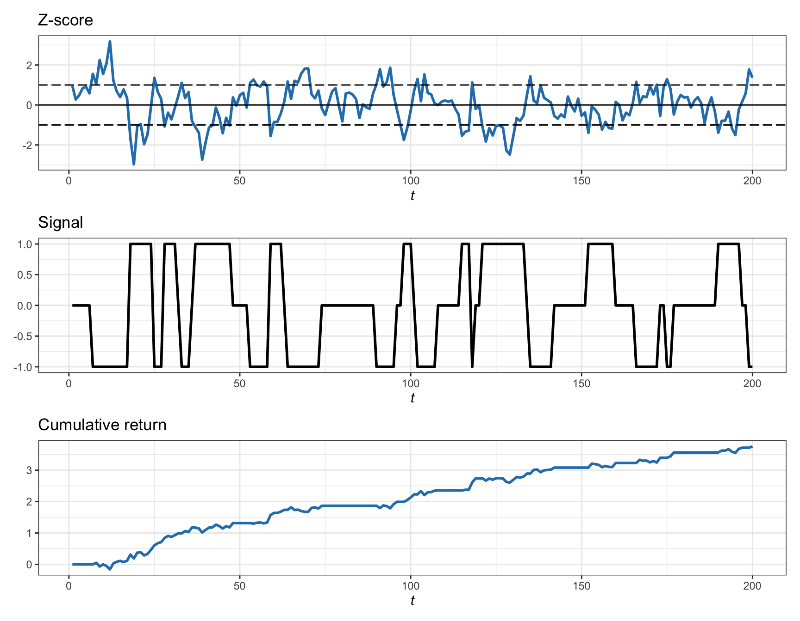
<p class="caption">(\#fig:pairs-trading-thresholded-strategy)Illustration of pairs trading via the thresholded strategy on the spread.</p>
</div>


### Optimizing the Threshold
Consider now the simple thresholded strategy that buys when the $z$-score is below the threshold $-s_0$ and short-sells when it is above $s_0$, unwinding the position after reverting to the equilibrium value of zero. Note that in terms of the spread, the threshold is $s_0 \times \sigma$, where $\sigma$ is the standard deviation of the spread.

The choice of this threshold is critical as it determines how often the position is closed (cashing a profit) as well as how large that minimum profit is. The total profit equals the number of trades times the profit of each trade. Recall that, when a position is closed after $k$ periods, the meaning of the spread difference $z_{t+k} - z_t$ depends on whether the spread represents log-prices or prices:

- for log-prices, the spread difference denotes the log-return of the profit;
- for prices, the spread difference denotes the absolute profit (to be scaled with the initial budget).

Thus, after $N^\textm{trades}$ successful trades have been executed, the total (uncompounded) profit can be accounted as $N^\textm{trades} \times \sigma\, s_0$ (the compounded profit could also be used).
<!---
- for log-prices: $N^\textm{trades} \times \sigma\, s_0$ is the total return (with compounding it would be $(1 + \sigma\, s_0)^{N^\textm{trades}} - 1$);
- for prices: $N^\textm{trades} \times \sigma\, s_0$ is the total profit (to be scaled with the initial budget).

For momentum-based strategies, traders typically reinvest any profit, implying a compounded return calculation. In pairs trading, however, due to the small capacity of such strategies (large amounts invested would automatically reduce the spread), it is reasonable to fix the invested amount, which implies an uncompounded calculation of the return.
--->

We will now obtain the optimum choice of the threshold to maximize the total profit in both parametric and nonparametric approaches.

#### Parametric Approach {-}
Suppose the $z$-score follows a standard normal distribution, $z^\textm{score}_t \sim \mathcal{N}(0,1)$. Then, the probability that it deviates from zero by $s_0$ or more is $1 - \Phi(s_{0})$, where $\Phi(\cdot)$ is the cumulative distribution function (cdf) of the standard normal distribution. For a time series path of $T$ periods, the number of tradable events (in one direction) can be approximated by $T \times (1 - \Phi(s_{0}))$ with a total profit of $T \left(1 - \Phi(s_{0})\right) \times \sigma\, s_0$.

Thus, under this simple parametric model, the optimal threshold can be obtained simply as
$$
s_{0}^{\star} = \underset{s_0}{\textm{arg}\;\textm{max}} \, \left(1 - \Phi(s_{0})\right) \times s_0.
$$
Figure\ \@ref(fig:parametric-profit-pairs-trading) illustrates the parametric evaluation of the profit vs. the threshold for a synthetic Gaussian spread.


<div class="figure" style="text-align: center">

<p class="caption">(\#fig:parametric-profit-pairs-trading)Calculation of optimum threshold in pairs trading via a parametric approach.</p>
</div>


#### Nonparametric Data-Driven Approach {-}
An alternative to the parametric approach (based on a probably inaccurate model) is a data-driven approach that does not rely on any model assumption. The idea is to simply use the available data to empirically count the number of tradable events for each possible threshold. Given $T$ observations of the $z$-score, $z^\textm{score}_t$ for $t=1,\dots,T$, and $J$ discretized threshold values, $s_{01},\dots,s_{0J}$, we can compute the empirical trading frequency for each threshold $s_{0j}$ (in one direction) as
$$
\bar{f}_{j}	=\frac{1}{T}\sum_{t=1}^{T}1{\{z^\textm{score}_t>s_{0j}\}},
$$

where $1\{\cdot\}$ is the indicator function that equals 1 if the argument is true and zero otherwise. 

Unfortunately, the empirical values $\bar{f}_{j}$ can be very noisy, which can affect the assessment of the total profit. One way to reduce the noise in the values $\bar{\bm{f}} = (\bar{f}_{1},\dots,\bar{f}_{J})$ is by taking advantage of the fact that the trading frequency should be a smooth function of the threshold. We can obtain a smoothed version by solving the least squares problem
$$
\underset{\bm{f}}{\textm{minimize}} \quad \sum_{j=1}^{J}(f_{j} - \bar{f}_{j})^{2}+\lambda\sum_{j=1}^{J-1}(f_{j}-f_{j+1})^{2},
$$
where the first term measures the difference between the noisy and smoothed values, and the second term enforces smoothness controlled by the hyper-parameter $\lambda$. This problem can be rewritten with a compact notation as
$$
\underset{\bm{f}}{\textm{minimize}} \quad \|\bm{f} - \bar{\bm{f}}\|_{2}^{2} + \lambda \|\bm{D}\bm{f}\|_{2}^{2},
$$
where $\bm{D}$ is a difference matrix defined as
$$
\bm{D} = \begin{bmatrix}
 1 & -1\\
   & 1 & -1\\
   &  & \ddots & \ddots\\
   &  &  & 1 & -1
\end{bmatrix} \in \R^{(J-1) \times J}.
$$
Since this problem is a least squares, we can write down the solution in closed form as
$$
\bm{f}^{\star} = \left(\bm{I} + \lambda\bm{D}^\T\bm{D}\right)^{-1}\bar{\bm{f}}.
$$

Finally, the optimal threshold can be obtained by maximizing the smoothed total profit:
$$
s_{0}^{\star} = \underset{s_{0j}\in\{s_{01},s_{02},\dots,s_{0J}\}}{\textm{arg}\;\textm{max}} \, s_{0j} \times f_{j}.
$$
Figure\ \@ref(fig:nonparametric-profit-pairs-trading) illustrates the nonparametric evaluation of the profit vs. the threshold for a synthetic Gaussian spread (both the original noisy version and the improved smoothed version).

<div class="figure" style="text-align: center">

<p class="caption">(\#fig:nonparametric-profit-pairs-trading)Calculation of optimum threshold in pairs trading via a nonparametric approach.</p>
</div>


### Numerical Experiments
We now execute pairs trading with market data examples during 2013--2022. The first two years are used to estimate the hedge factor $\gamma$, which is critical to form the spread. Then the spread is traded over the remaining out-of-sample period. The $z$-score is computed on a rolling-window basis (as in Bollinger Bands) to make sure it adapts to the market changes over time and stays mean reverting. To trade the spread, the thresholded strategy is employed (the linear strategy can also be used with very similar results). For simplicity, the threshold is simply chosen as $s_0=1$; of course it could be optimized but care has to be taken to avoid look-ahead bias and overfitting (see Chapter\ \@ref(backtesting) for the dangers of backtesting and overfitting of hyper-parameters).


#### Market Data: EWA and EWC {-}
We start with the two ETFs EWA and EWC, which track the performance of the Australian and Canadian economies, respectively. As previously checked in Section\ \@ref(discovering-pairs), the majority of the tests indicate that cointegration is present during most of the period, although in occasions it may be lost. The $z$-score is computed on a rolling-window basis with a lookback period of six months.

Figure\ \@ref(fig:pairs-trading-LS-BB6months-EWA-vs-EWC) shows the spread (with hedge ratio $\gamma$ estimated via least squares during the first two years), the $z$-score, the trading signal, and the cumulative return. We can observe that the spread does not show a strong persistent cointegration relationship over the whole period; in practice, the hedge ratio should be adapted over time. The $z$-score is able to produce a more constant mean-reverting version due to the rolling window adaptation. In any case, any practical implementation of pairs trading would recompute the hedge ratio over time, as assumed in the rest of the experiments via a rolling least squares.

Figure\ \@ref(fig:pairs-trading-rollingLS-BB6months-EWA-vs-EWC) shows the results when the hedge ratio $\gamma$ is computed on a rolling-window basis with a lookback period of two years. We can appreciate that the spread has been improved compared to the previous fixed least squares and looks more mean-reverting. Still, the $z$-score is able to further improve it and produce a much better mean reverting version. The cumulative return shows the improvement thanks to the rolling least squares approach; nevertheless, it is much better to use the Kalman filter as explored in Section\ \@ref(kalman-pairs-trading).


<div class="figure" style="text-align: center">
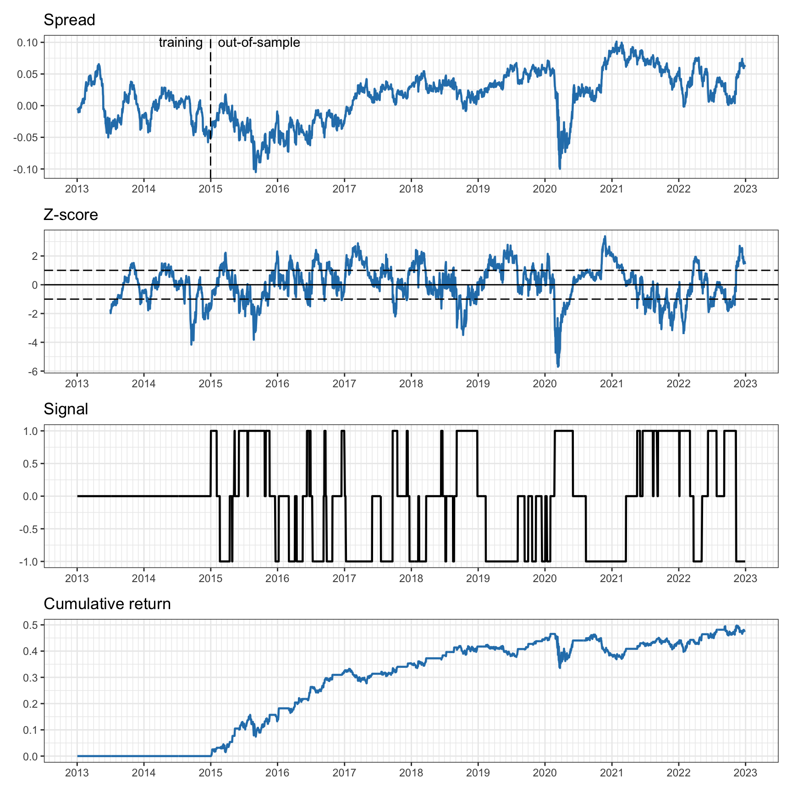
<p class="caption">(\#fig:pairs-trading-LS-BB6months-EWA-vs-EWC)Pairs trading on EWA--EWC with six-month rolling $z$-score and two-year fixed least squares.</p>
</div>


<div class="figure" style="text-align: center">
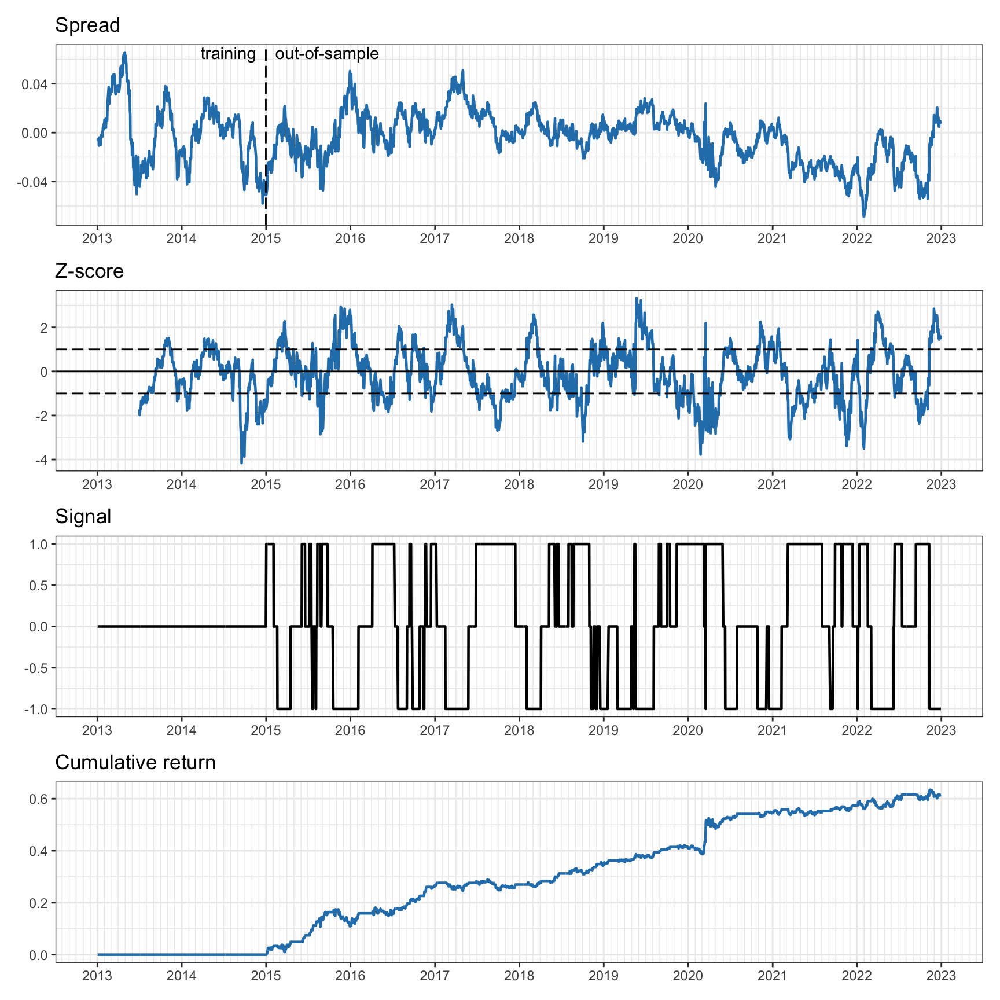
<p class="caption">(\#fig:pairs-trading-rollingLS-BB6months-EWA-vs-EWC)Pairs trading on EWA--EWC with six-month rolling $z$-score and two-year rolling least squares.</p>
</div>


#### Market Data: KO and PEP {-}
We continue with an attempt to execute pairs trading on the stocks Coca-Cola (KO) and Pepsi (PEP), which do not seem to be cointegrated according to the previous experiments in Section\ \@ref(discovering-pairs). To be realistic, the hedge ratio $\gamma$ is estimated via a rolling least squares with a lookback period of two years (this may help in adapting to the changing cointegration relationship). The $z$-score is computed on a rolling-window basis with a lookback period of six months (as well as one month for a faster adaptation).

Figure\ \@ref(fig:pairs-trading-rollingLS-BB6months-KO-vs-PEP) shows the spread, the $z$-score, the trading signal, and the cumulative return. We can observe that the spread loses the mean reversion property despite the rolling nature of the hedge ratio calculation. The $z$-score is able to produce a more constant mean-reverting version, but still one can observe jumps indicating loss of cointegration. The cumulative return indicates that trading is not very successful.

Figure\ \@ref(fig:pairs-trading-rollingLS-BB1month-KO-vs-PEP) shows the results when the $z$-score is calculated with a faster adaptability using a lookback period of one month (as opposed to the previous six months). The $z$-score looks much better, with a strong mean reversion. This translates into higher-frequency trading (compare the frequency in the signals), but still the cumulative return does not seem to indicate good profitability.


<div class="figure" style="text-align: center">
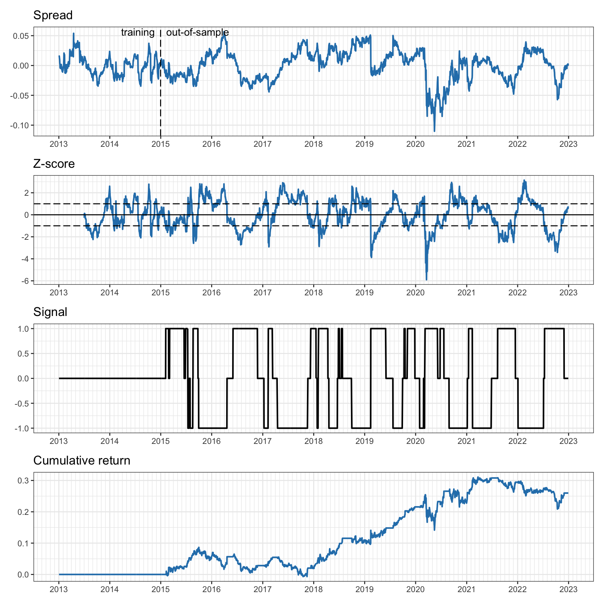
<p class="caption">(\#fig:pairs-trading-rollingLS-BB6months-KO-vs-PEP)Pairs trading on KO--PEP with six-month rolling $z$-score and two-year rolling least squares.</p>
</div>


<div class="figure" style="text-align: center">
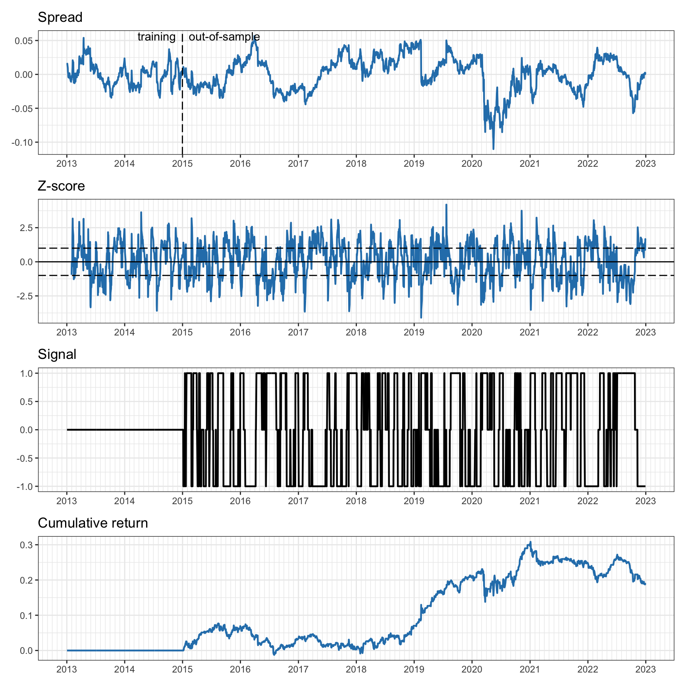
<p class="caption">(\#fig:pairs-trading-rollingLS-BB1month-KO-vs-PEP)Pairs trading on KO--PEP with one-month rolling $z$-score and two-year rolling least squares.</p>
</div>


## Kalman Filtering for Pairs Trading {#kalman-pairs-trading}
\index{spread}
A key component in pairs trading is the construction of a mean-reverting spread
$$
z_{t} = y_{1t} - \gamma \, y_{2t} = \mu + r_t,
$$
where $\gamma$ is the hedge ratio, $\mu$ is the mean, and $r_t$ is the zero-mean residual. Then the trading strategy will properly size the trade depending on the distance of the spread $z_{t}$ from the equilibrium value $\mu$.

Construction of the spread requires careful estimation of the hedge ratio $\gamma$, as well as the mean of the spread $\mu$. The traditional way is to employ least squares regression. In practice, the hedge ratio and the mean will slowly change over time and then the least squares solution should be recomputed on a rolling-window basis. However, it is better to employ a more sophisticated time-varying modeling and estimation technique based on state-space modeling and the Kalman filter [@Chan2013; @FengPal2016monograph].


### Spread Modeling via Least Squares
The method of least squares (LS) dates back to 1795 when Gauss used it to study planetary motions. It deals with the linear model $\bm{y} = \bm{A}\bm{x} + \bm{\epsilon}$ by solving the problem [@Scharf1991; @Kay1993]
$$
\begin{array}{ll}
  \underset{\bm{x}}{\textm{minimize}} & \left\Vert \bm{y} - \bm{A}\bm{x} \right\Vert_2^2,
\end{array}
$$
whose solution gives the least squares estimate $\hat{\bm{x}}=\left(\bm{A}^\T\bm{A}\right)^{-1}\bm{A}^\T\bm{y}$. In addition, the covariance matrix of the estimate $\hat{\bm{x}}$ is given by $\sigma_\epsilon^2\left(\bm{A}^\T\bm{A}\right)^{-1}$, where $\sigma_\epsilon^2$ is the variance of the residual $\bm{\epsilon}$ (in practice, the variance of the estimated residual $\hat{\bm{\epsilon}} = \bm{y} - \bm{A}\hat{\bm{x}}$ can be used instead).


In our context of spread modeling, we want to fit $y_{1t} \approx \mu + \gamma \, y_{2t}$ based on $T$ observations, so the LS formulation becomes
$$
\begin{array}{ll}
  \underset{\mu,\gamma}{\textm{minimize}} & \left\Vert \bm{y}_1 - \left(\mu \bm{1} + \gamma \, \bm{y}_2\right) \right\Vert_2^2,
\end{array}
$$
where the vectors $\bm{y}_1$ and $\bm{y}_2$ contain the $T$ observations of the two time series, and $\bm{1}$ is the all-ones vector. The solution gives the estimates
$$
\begin{bmatrix}
\begin{array}{ll}
  \hat{\mu} \\ \hat{\gamma}
\end{array}
\end{bmatrix} = 
\begin{bmatrix}
\begin{array}{ll}
  \bm{1}^\T\bm{1}   & \bm{1}^\T\bm{y}_2\\
  \bm{y}_2^\T\bm{1} & \bm{y}_2^\T\bm{y}_2
\end{array}
\end{bmatrix}^{-1}
\begin{bmatrix}
\begin{array}{ll}
  \bm{1}^\T\bm{y}_1\\ 
  \bm{y}_2^\T\bm{y}_1 
\end{array}
\end{bmatrix}.
$$

In practice, it is more convenient to first remove the mean of $\bm{y}_1$ and $\bm{y}_2$ to produce the centered versions $\bar{\bm{y}}_1$ and $\bar{\bm{y}}_2$, then estimate the hedge ratio as
$$
\hat{\gamma} = \frac{\bar{\bm{y}}_2^\T \bar{\bm{y}}_1}{\bar{\bm{y}}_2^\T \bar{\bm{y}}_2},
$$
and finally compute the sample mean of $\bm{y}_1 - \hat{\gamma} \, \bm{y}_2$:
$$
\hat{\mu} = \frac{\bm{1}^\T(\bm{y}_1 - \hat{\gamma} \, \bm{y}_2)}{T}.
$$

The variance of these estimates is given by
$$
\begin{array}{ll}
  \textm{Var}[\hat{\gamma}] &= \frac{1}{T} \; \sigma_\epsilon^2 / \sigma_2^2,\\
  \textm{Var}[\hat{\mu}]    &= \frac{1}{T} \;\sigma_\epsilon^2,
\end{array}
$$
where $\sigma_2^2$ is the variance of $\bm{y}_2$ and $\sigma_\epsilon^2$ is the variance of the residual $\bm{\epsilon}$.


It is important to reiterate that in practice the hedge ratio and the mean will slowly change over time, as denoted by $\gamma_t$ and $\mu_t$, and the least squares solution must be recomputed on a rolling-window basis (based on a lookback window of past samples). Nevertheless, this time-varying case is better handled with Kalman filtering, as described next.


 

### Primer on the Kalman Filter
\index{Kalman}
_State-space modeling_ provides a unified framework for treating a wide range of problems in time series analysis. It can be thought of as a universal and flexible modeling approach with a very efficient algorithm, the _Kalman filter_. The basic idea is to assume that the evolution of the system over time is driven by a series of unobserved or hidden values, which can only be measured indirectly through observations of the system output. This model can be used for filtering, smoothing, and forecasting. Here we provide a concise summary; more details on state-space modeling and Kalman filtering can be found in Section\ \@ref(kalman) of Chapter\ \@ref(time-series-modeling).

The Kalman filter, which was employed by NASA during the 1960s in the Apollo program, now boasts a vast array of technological applications. It is commonly utilized in the guidance, navigation, and control of vehicles, including aircraft, spacecraft, and maritime vessels. It has also found applications in time series analysis, signal processing, and econometrics. More recently, it has become a key component in robotic motion planning and control, as well as trajectory optimization.

State-space models and Kalman filtering are mature topics with excellent textbooks available such as the classical references @AndersonMoore1979 and @DurbinKoopman2012, which was originally published in 2001. Other textbook references on time series and the Kalman filter include @BrockwellDavis2002, @ShumwayStoffer2017, @Harvey1989 and, in particular, for financial time series, @ZivotWangKoopman2004, @Tsay2010, @Lutkepohl2007, and @HarveyKoopman2009.

Mathematically, the Kalman filter is based on the following linear Gaussian state-space model with discrete time $t=1,\dots,T$ [@DurbinKoopman2012]:
$$
  \qquad\qquad
  \begin{aligned}
  \bm{y}_t          &= \bm{Z}_t\bm{\alpha}_t + \bm{\epsilon}_t\\
  \bm{\alpha}_{t+1} &= \bm{T}_t\bm{\alpha}_t + \bm{\eta}_t
  \end{aligned}
  \quad
  \begin{aligned}
  & \textm{(observation equation)},\\
  & \textm{(state equation)},
  \end{aligned}
$$
where $\bm{y}_t$ denotes the observations over time with observation matrix $\bm{Z}_t$, $\bm{\alpha}_t$ represents the unobserved or hidden internal state with state transition matrix $\bm{T}_t$, and the two noise terms $\bm{\epsilon}_t$ and $\bm{\eta}_t$ are Gaussian distributed with zero mean and covariance matrices $\bm{H}$ and $\bm{Q}$, respectively, that is, $\bm{\epsilon}_t \sim \mathcal{N}(\bm{0},\bm{H})$ and $\bm{\eta}_t \sim \mathcal{N}(\bm{0},\bm{Q})$. The initial state can be modeled as $\bm{\alpha}_1 \sim \mathcal{N}(\bm{a}_1,\bm{P}_1)$. Mature and efficient software implementations are readily available [@Kalman_in_R_JSS2011; @SSM_in_R_JSS2011; @KFAS_JSS2017; @MARSS_RJournal2012].[^KFAS-package-bis]

[^KFAS-package-bis]: The Kalman filter is implemented in the R package [`KFAS`](https://cran.r-project.org/package=KFAS) [@KFAS_JSS2017] and the Python package [`filterpy`](https://github.com/rlabbe/filterpy). \index{R packages!KFAS} \index{Python packages!filterpy}

The parameters of the state-space model (i.e., $\bm{Z}_t$, $\bm{T}_t$, $\bm{H}$, $\bm{Q}$, $\bm{a}_1$, and $\bm{P}_1$) can be either provided by the user (if known) or inferred from the data with algorithms based on the maximum likelihood method. Again, mature and efficient software implementations are available for this parameter fitting [@MARSS_RJournal2012].[^MARSS-package-bis]

[^MARSS-package-bis]: The R package [`MARSS`](https://cran.r-project.org/package=MARSS) implements algorithms for fitting state-space models to time series data [@MARSS_RJournal2012]. \index{R packages!MARSS}


\index{Kalman!Kalman filtering}
\index{Kalman!Kalman forecasting}
To be more precise, the Kalman filter is a very efficient algorithm to optimally characterize the distribution of the hidden state at time $t$, $\bm{\alpha}_t$, in a causal manner. In particular, $\bm{\alpha}_{t|t-1}$ and $\bm{\alpha}_{t|t}$ denote the expected value given the observations up to time $t-1$ and $t$, respectively. These quantities can be efficiently computed using a "forward pass" algorithm that goes from $t=1$ to $t=T$ in a recursive way, so that it can operate in real time [@DurbinKoopman2012]. <!---The Kalman smoothing characterizes the distribution of the hidden state at time $t$, $\bm{\alpha}_t$, given all the observations, $\bm{y}_1,\dots,\bm{y}_T$, i.e., in a non-causal manner. Interestingly, these quantities can also be efficiently computed using a "backward pass" algorithm that goes from $t=T$ to $t=1$ [@DurbinKoopman2012].\index{Kalman!Kalman smoothing}--->


### Spread Modeling via Kalman
\index{Kalman}
In our context of spread modeling, we want to model $y_{1t} \approx \mu_t + \gamma_t \, y_{2t}$, where now $\mu_t$ and $\gamma_t$ change slowly over time. This can be done conveniently via a state-space modeling by identifying the hidden state as $\bm{\alpha}_t = \left(\mu_t, \gamma_t\right)$, leading to
\begin{equation}
\begin{aligned}
  y_{1t}          
    &= \begin{bmatrix} 1 & y_{2t} \end{bmatrix} \begin{bmatrix} \mu_t\\ \gamma_t \end{bmatrix} + \epsilon_t,\\
  \begin{bmatrix} \mu_{t+1}\\ \gamma_{t+1} \end{bmatrix} 
    &= \begin{bmatrix} 1 & 0\\ 0 & 1 \end{bmatrix} \begin{bmatrix} \mu_t\\ \gamma_t \end{bmatrix} + \begin{bmatrix} \eta_{1t}\\ \eta_{2t} \end{bmatrix} ,
\end{aligned}
  (\#eq:pairs-trading-kalman)
\end{equation}
where all the noise components are independent and distributed as $\epsilon_t \sim \mathcal{N}(0,\sigma_\epsilon^2)$, $\eta_{1t} \sim \mathcal{N}(0,\sigma_{\mu}^2)$, and $\eta_{2t} \sim \mathcal{N}(0,\sigma_{\gamma}^2)$, the state transition matrix is the identity $\bm{T}=\bm{I}$, the observation matrix is $\bm{Z}_t=\begin{bmatrix} 1 & y_{2t} \end{bmatrix}$, and the initial states are $\mu_{1} \sim \mathcal{N}\left(\bar{\mu},\sigma_{\mu,1}^2\right)$ and $\gamma_{1} \sim \mathcal{N}\left(\bar{\gamma},\sigma_{\gamma,1}^2\right)$.

The normalized spread, with leverage one (see \@ref(eq:w-pairs-trading)), can then be obtained as
$$
z_{t} = \frac{1}{1 + \gamma_{t|t-1}} \left(y_{1t} - \gamma_{t|t-1} \, y_{2t} - \mu_{t|t-1}\right),
$$
where $\mu_{t|t-1}$ and $\gamma_{t|t-1}$ are the hidden states estimated by the Kalman algorithm.


The model parameters $\sigma_\epsilon^2$, $\sigma_\mu^2$, and $\sigma_\gamma^2$ (and the initial states) can be determined by simple heuristics or optimally estimated from the data (more computationally demanding). For example, one can use initial training data of $T^\textm{LS}$ samples to estimate $\mu$ and $\gamma$ via least squares, $\mu^\textm{LS}$ and $\gamma^\textm{LS}$, obtaining the estimated residual $\epsilon_t^\textm{LS}$. Then the following provide an effective heuristic for the state-space model parameters:
$$
  \begin{aligned}
  \sigma_\epsilon^2  &=    \textm{Var}\left[\epsilon_t^\textm{LS}\right],\\
  \mu_1              &\sim \mathcal{N}\left(\mu^\textm{LS}, \frac{1}{T^\textm{LS}}\textm{Var}\left[\epsilon_t^\textm{LS}\right]\right),\\
  \gamma_1           &\sim \mathcal{N}\left(\gamma^\textm{LS}, \frac{1}{T^\textm{LS}}\frac{\textm{Var}\left[\epsilon_t^\textm{LS}\right]}{\textm{Var}\left[y_{2t}\right]}\right),\\
  \sigma_\mu^2       &=    \alpha \times \textm{Var}\left[\epsilon_t^\textm{LS}\right],\\
  \sigma_\gamma^2    &=    \alpha \times \frac{\textm{Var}\left[\epsilon_t^\textm{LS}\right]}{\textm{Var}\left[y_{2t}\right]},
  \end{aligned}
$$
where the hyper-parameter $\alpha$ determines the ratio of the variability of the slowly time-varying hidden states to the variability of the spread.


The state-space model of the spread in \@ref(eq:pairs-trading-kalman) can be extended in different ways to potentially improve the performance. One simple extension involves modeling not only the hedge ratio but also its momentum or velocity. This can be done by expanding the hidden state to $\bm{\alpha}_t = \left(\mu_t, \gamma_t, \dot{\gamma}_t\right)$, which leads to the state-space model
\begin{equation}
  \begin{aligned}
  y_{1t}          
    &= \begin{bmatrix} 1 & y_{2t} & 0 \end{bmatrix} \begin{bmatrix} \mu_t\\ \gamma_t\\ \dot{\gamma}_t \end{bmatrix} + \epsilon_t,\\
  \begin{bmatrix} \mu_{t+1}\\ \gamma_{t+1}\\ \dot{\gamma}_{t+1} \end{bmatrix} 
    &= \begin{bmatrix} 1 & 0 & 0\\ 0 & 1 & 1\\0 & 0 & 1 \end{bmatrix} \begin{bmatrix} \mu_t\\ \gamma_t\\ \dot{\gamma}_t \end{bmatrix} + \bm{\eta}_{t}.
  \end{aligned}
  (\#eq:pairs-trading-kalman-momentunm)
\end{equation}
This model makes $\gamma_{t}$ less noisy and provides a better spread, as shown later in the numerical experiments.


Another extension of the state-space modeling in \@ref(eq:pairs-trading-kalman) under the concept of partial cointegration is to model the spread with an autoregressive component [@CleggKrauss2018]. This can be done by defining the hidden state as $\bm{\alpha}_t = \left(\mu_t, \gamma_t, \epsilon_t\right)$, leading to
\begin{equation}
  \begin{aligned}
  y_{1t}          
    &= \begin{bmatrix} 1 & y_{2t} & 1 \end{bmatrix} \begin{bmatrix} \mu_t\\ \gamma_t\\ \epsilon_t \end{bmatrix},\\
  \begin{bmatrix} \mu_{t+1}\\ \gamma_{t+1}\\ \epsilon_{t+1} \end{bmatrix} 
    &= \begin{bmatrix} 1 & 0 & 0\\ 0 & 1 & 0\\0 & 0 & \rho \end{bmatrix} \begin{bmatrix} \mu_t\\ \gamma_t\\ \epsilon_t \end{bmatrix} + \bm{\eta}_{t},
  \end{aligned}
  (\#eq:pairs-trading-kalman-PCI)
\end{equation}
where $\rho$ is a parameter to be estimated satisfying $|\rho|<1$ (or fixed to some reasonable value like $\rho=0.9)$.


### Numerical Experiments
We now repeat the pairs trading experiments with market data during 2013--2022 as in Section\ \@ref(trading-spread). As before, the $z$-score is computed on a rolling-window basis with a lookback period of six months and pairs trading is implemented via the thresholded strategy with a threshold of $s_0=1$. The difference is that we now employ three different methods to track the hedge ratio over time: (i)\ rolling least squares with lookback period of two years, (ii)\ basic Kalman based on \@ref(eq:pairs-trading-kalman) with $\alpha=10^{-5}$, and (iii)\ Kalman with momentum based on \@ref(eq:pairs-trading-kalman-momentunm) with $\alpha=10^{-6}$. All these parameters have been fixed and could be further optimized; in particular, all the parameters in the state-space model can be learned to better fit the data via maximum likelihood estimation methods.


#### Market Data: EWA and EWC {-}
We first consider the two ETFs EWA and EWC, which track the performance of the Australian and Canadian economies, respectively. As concluded in Section\ \@ref(trading-spread), EWA and EWC are cointegrated, and pairs trading was evaluated in Section\ \@ref(trading-spread) based on least squares. We now experiment with the Kalman-based methods to see what improvement can be obtained.

Figure\ \@ref(fig:pairs-trading-EWA-vs-EWC-hedge-ratio) shows the estimated hedge ratios over time, which should be quite constant since the assets are cointegrated. We can observe that the rolling least squares is very noisy with the value wildly varying between 0.6 and 1.2 (of course a longer lookback period could be used, but then it would not adapt fast enough if the true hedge ratio changed). The two Kalman-based methods, on the other hand, are much more stable with the value between 0.55 and 0.65 (both methods look similar but the difference will become clear later).

Figure\ \@ref(fig:pairs-trading-EWA-vs-EWC-spread) presents the spreads resulting from the three methods. It is quite apparent that the spreads from the Kalman-based methods are much more stationary and mean reverting than the one from the rolling least squares. One important point to notice is that the variance of the spread obtained from the Kalman methods depends on the choice of $\alpha$: if the spread variance becomes too small, then the profit may totally disappear after taking into account transaction costs, so care has to be taken with this choice.

Finally, Figure\ \@ref(fig:pairs-trading-EWA-vs-EWC-cumret) provides the cumulative returns obtained by the three methods (ignoring transaction costs). The difference among the methods is quite obvious: not only is the final value very different (0.6, 2.0, and 3.2), but the curves obtained with the Kalman-based methods are less noisy and exhibit a much better drawdown. Again, it is important to reiterate that special care has to be taken in practice with the choice of $\alpha$ so that the spread variance is large enough to provide a profit after transaction costs.


<div class="figure" style="text-align: center">

<p class="caption">(\#fig:pairs-trading-EWA-vs-EWC-hedge-ratio)Tracking of hedge ratio for pairs trading on EWA--EWC.</p>
</div>


<div class="figure" style="text-align: center">
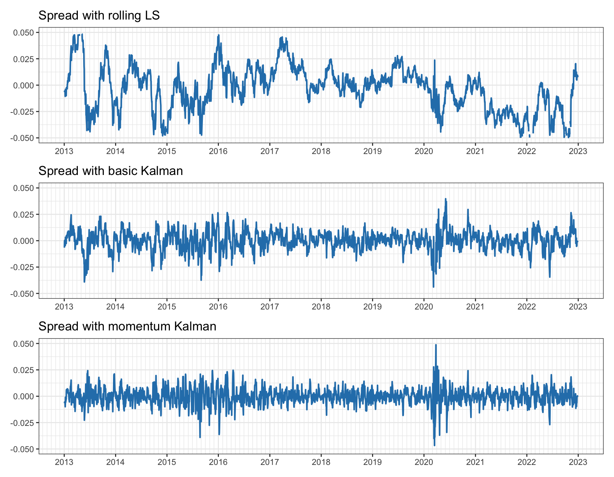
<p class="caption">(\#fig:pairs-trading-EWA-vs-EWC-spread)Spread for pairs trading on EWA--EWC.</p>
</div>

<div class="figure" style="text-align: center">
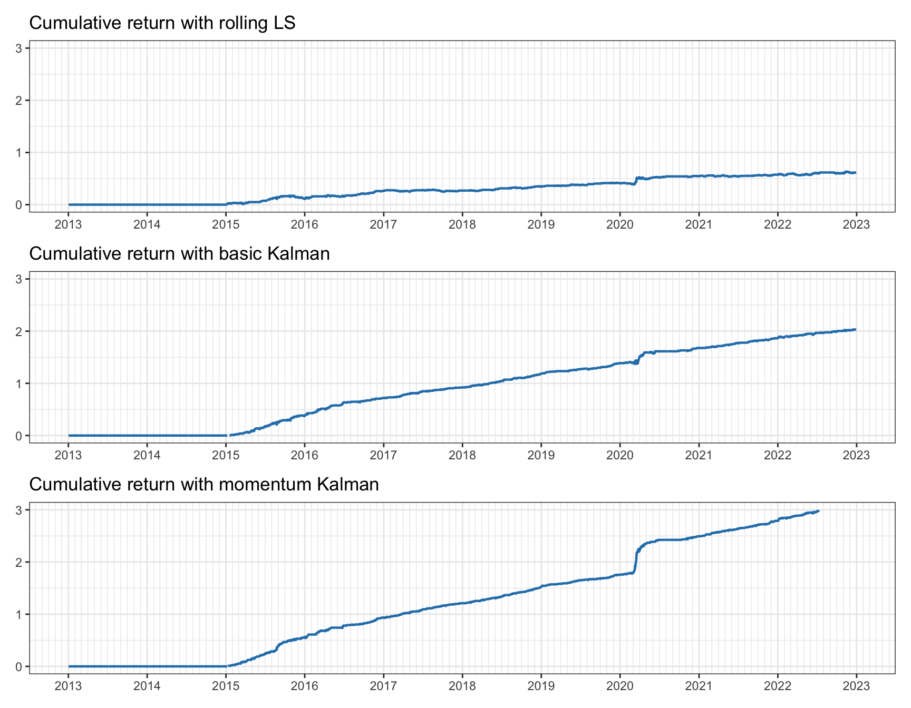
<p class="caption">(\#fig:pairs-trading-EWA-vs-EWC-cumret)Cumulative return for pairs trading on EWA--EWC.</p>
</div>


#### Market Data: KO and PEP {-}
Next, we revisit pairs trading with the stocks Coca-Cola (KO) and Pepsi (PEP). As concluded from the cointegration tests in Section\ \@ref(discovering-pairs), they do not seem to be cointegrated. In addition, from the trading experiments in Section\ \@ref(trading-spread), profitability was dubious as indicated in Figures\ \@ref(fig:pairs-trading-rollingLS-BB6months-KO-vs-PEP) and\ \@ref(fig:pairs-trading-rollingLS-BB6months-EWA-vs-EWC). We now look to see if the situation can be resolved with the Kalman-based methods.

Figure\ \@ref(fig:pairs-trading-KO-vs-PEP-hedge-ratio) shows the estimated hedge ratios over time. Again, we can observe that rolling least squares is noisy and not very consistent, whereas Kalman-based methods are stable while still being able to adapt to the big change that happens in early 2020 (perhaps due to the COVID-19 pandemic).

Figure\ \@ref(fig:pairs-trading-KO-vs-PEP-spread) gives the spreads, and one can clearly appreciate a significant difference among the three methods. Observe early 2020: rolling least squares loses the tracking and cointegration is clearly lost, the basic Kalman is able to track after a momentary loss reflected in the shock on the spread, and the Kalman with momentum is able to track much better.

Finally, Figure\ \@ref(fig:pairs-trading-KO-vs-PEP-cumret) provides the cumulative returns, which gives a very clear picture. The difference among the three methods is quite astonishing. However, once more, one cannot forget that transaction costs have not been considered. In any case, the drawdown with Kalman-based methods is totally under control (unlike with rolling least squares). The conclusion is very clear: Kalman filtering is a must in pairs trading.

<div class="figure" style="text-align: center">
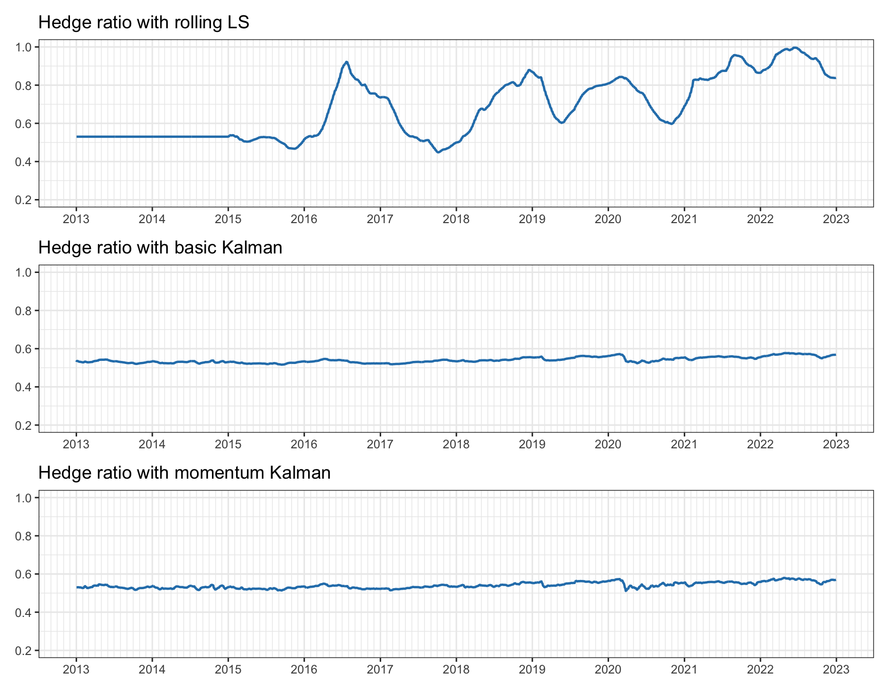
<p class="caption">(\#fig:pairs-trading-KO-vs-PEP-hedge-ratio)Tracking of hedge ratio for pairs trading on KO--PEP.</p>
</div>


<div class="figure" style="text-align: center">
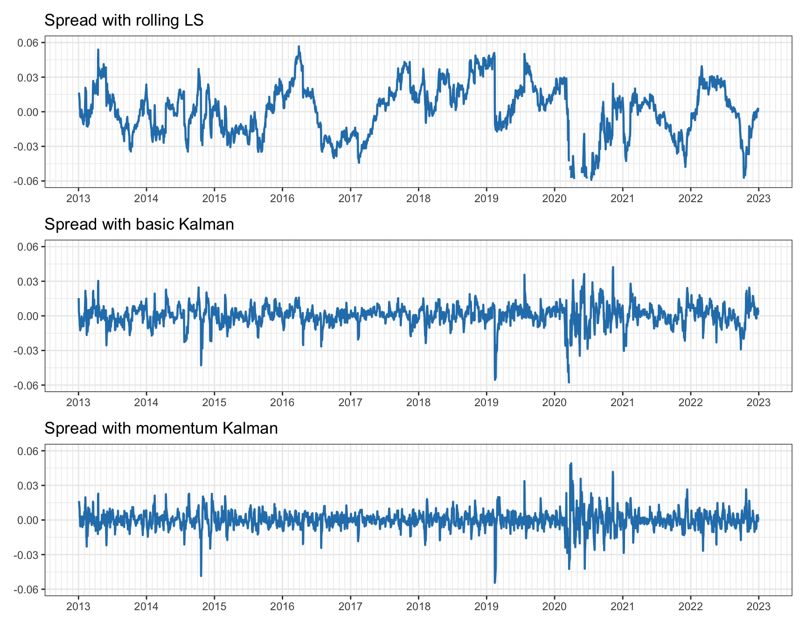
<p class="caption">(\#fig:pairs-trading-KO-vs-PEP-spread)Spread for pairs trading on KO--PEP.</p>
</div>


<div class="figure" style="text-align: center">

<p class="caption">(\#fig:pairs-trading-KO-vs-PEP-cumret)Cumulative return for pairs trading on KO--PEP.</p>
</div>


## Statistical Arbitrage {#statarb}
\index{pairs trading}
\index{statistical arbitrage}
Pairs trading focuses on discovering cointegration and tracking the cointegration relationship between pairs of assets. However, the idea can be naturally extended to more than two assets for more flexibility. This is more generally referred to as _statistical arbitrage_ or, for short, _StatArb_.

Cointegration for more than two assets follows essentially the same idea: construct a linear combination of multiple time series such that the combination is mean reverting. The difference is that the mathematical modeling to capture the multiple cointegration relationships becomes more involved.


### Least Squares
Least squares can still be used to determine the cointegration relationship. In the case of $K>2$ time series, we still need to choose the one to be regressed by the others. Suppose we want to fit $y_{1t} \approx \mu + \sum_{k=2}^K \gamma_k \, y_{kt}$ based on $T$ observations. Then, the least squares formulation is
$$
\begin{array}{ll}
  \underset{\mu,\bm{\gamma}}{\textm{minimize}} & \left\Vert \bm{y}_1 - \left(\mu \bm{1} + \bm{Y}_2 \bm{\gamma}\right) \right\Vert_2^2,
\end{array}
$$
where the vector $\bm{y}_1$ contains the $T$ observations of the first time series, the matrix $\bm{Y}_2$ contains the $T$ observations of the remaining $K-1$ time series columnwise, and vector $\bm{\gamma} \in \R^{K-1}$ contains the $K-1$ hedge ratios. The solution gives the estimates
$$
\begin{bmatrix}
\begin{array}{ll}
  \hat{\mu} \\ \hat{\bm{\gamma}}
\end{array}
\end{bmatrix} = 
\begin{bmatrix}
\begin{array}{ll}
  \bm{1}^\T\bm{1}   & \bm{1}^\T\bm{Y}_2\\
  \bm{Y}_2^\T\bm{1} & \bm{Y}_2^\T\bm{Y}_2
\end{array}
\end{bmatrix}^{-1}
\begin{bmatrix}
\begin{array}{ll}
  \bm{1}^\T\bm{y}_1\\ 
  \bm{Y}_2^\T\bm{y}_1 
\end{array}
\end{bmatrix}.
$$
In practice, this estimation process has to be performed on a rolling-window basis to adapt to the slow changes over time.

The normalized portfolio (with leverage 1) is
$$\w = \frac{1}{1+\|\bm{\gamma}\|_1}\begin{bmatrix} \;\;\;1\\ -\bm{\gamma} \end{bmatrix},$$
with corresponding normalized spread $z_{t} = \w^\T\bm{y}_{t}$.

It is important to point out that this approach produces a single cointegration relationship, but there may be others that have gone unnoticed. One approach could be to iteratively try to capture more cointegration relationships orthogonal to the previously discovered ones. In addition, this method requires choosing one time series (out of the $K$ possible ones) to be regressed. In practice, the discovery of multiple cointegration relationships is better achieved by the more sophisticated VECM modeling described next.


### VECM
\index{VECM model}
A very common model in econometrics for a multivariate time series (typically denoting the log-prices of $N$ assets), $\bm{y}_1,\bm{y}_2,\bm{y}_3,\dots$, is based on taking the first-order difference, $\Delta \bm{y}_t = \bm{y}_t - \bm{y}_{t-1}$, and then using a vector autoregressive (VAR) model of order $p$:
$$
\Delta \bm{y}_t = \bm{\phi}_0 + \sum_{i=1}^p \bm{\Phi}_i \Delta \bm{y}_{t-i} + \bm{\epsilon}_t,
$$
where the parameters of the model are $\bm{\phi}_0 \in \R^N$, $\bm{\Phi}_1,\dots,\bm{\Phi}_p\in\R^{N\times N}$, and $\bm{\epsilon}_t$ is the innovation term (see Section\ \@ref(mean-modeling) in Chapter\ \@ref(time-series-modeling) for details). This approach has the feature that due to the differencing it is a stationary model. Unfortunately, this differencing may also destroy some interesting structure in the original data.


The _vector error correction model_ (VECM) [@EngleGranger1987] was proposed as a way to apply the VAR model directly on the original sequence without differencing, with the potential danger of lack of stationarity. Employing the VAR model on the original series $\bm{y}_t$ and rewriting it in terms of $\Delta \bm{y}_t$ leads to the more refined model
\begin{equation}
  \Delta \bm{y}_t = \bm{\phi}_0 + \bm{\Pi}\bm{y}_{t-1} + \sum_{i=1}^{p-1} \tilde{\bm{\Phi}}_i \Delta \bm{y}_{t-i} + \bm{\epsilon}_t,
  (\#eq:VECM)
\end{equation}
where the matrix coefficients $\bm{\Pi} \in \R^{N\times N}$ and $\tilde{\bm{\Phi}}_1,\dots,\tilde{\bm{\Phi}}_{p-1} \in \R^{N\times N}$ can be related to the $\bm{\Phi}_i$ used in the previous VAR model. This model includes the term $\bm{\Pi}\bm{y}_{t-1}$ that could potentially make the model nonstationary because the time series $\bm{y}_t$ is nonstationary. However, after a careful inspection of \@ref(eq:VECM), it is clear that since the left-hand side, $\Delta \bm{y}_t$, is stationary, so must be the right-hand side, which implies that $\bm{\Pi}\bm{y}_{t-1}$ must be stationary.

As it turns out, the matrix $\bm{\Pi}$ is of utmost importance in guaranteeing stationarity of the term $\bm{\Pi}\bm{y}_{t}$. In general, this matrix will be of low rank, which means that it can be decomposed as the product of two matrices,
$$
\bm{\Pi}=\bm{\alpha}\bm{\beta}^\T,
$$
with $\bm{\alpha}, \bm{\beta} \in \R^{N\times K}$ having $K$ columns, where $K$ is the rank of $\bm{\Pi}$. This reveals that the nonstationary series $\bm{y}_t$ (log-prices) becomes stationary after multiplication with $\bm{\beta}^\T$. In other words, the multivariate time series $\bm{y}_t$ is cointegrated and each column of matrix $\bm{\beta}$ produces a different cointegration relationship. 

To be more precise, three cases can be identified in terms of the rank of $\bm{\Pi}$:

- $K=N$: this means that $\bm{y}_t$ is already stationary (rarely the case in practice);
- $K=0$: this means that $\bm{y}_t$ is not cointegrated (VECM reduces to a VAR model); and
- $1<K<N$: this is the interesting case that provides $K$ different cointegration relationships.

Recall that Johansen's test [@Johansen1991; @Johansen1995] described in Section\ \@ref(discovering-pairs) precisely tests the value of the rank of the matrix $\bm{\Pi}$ arising in the VECM time series modeling.


<!---
## Factor models
### Statistical arbitrage based on factor models
- Suppose the stock $i$ is cointegrated with some tradable factors:
$$y_{it}	=\boldsymbol{\pi}_{i}^{T}\mathbf{y}_{t}^{f}+w_{it}$$
where
    - $y_{it}$ is the log-price of the stock $i$,
    - $\mathbf{y}_{t}^{f}$ is the log-price of the tradable factors,
    - $\boldsymbol{\pi}_{i}$ is the vector of loading coefficients
    - $w_{it}$ is a stationary mean reversion process.

- It can also be written in a factor model form:
$$r_{it} = \boldsymbol{\pi}_{i}^{T}\mathbf{f}_{t}+\varepsilon_{it}$$
where
    - $r_{it}=y_{it}-y_{i,t-1}$ is the log-return of stock $i$,
    - $\mathbf{f}_{t}=\mathbf{y}_{t}^{f}-\mathbf{y}_{t-1}^{f}$ is the log-returns of the tradable factors, and
    - $\varepsilon_{it}=w_{it}-w_{i,t-1}$ is the specific noise.


### Statistical arbitrage based on factor models
- Recall the factor model form expression
$$r_{it} = \boldsymbol{\pi}_{i}^{T}\mathbf{f}_{t}+\varepsilon_{it}$$

- The idea now is to first properly select some tradable factors $\mathbf{f}_{t}$ and then test whether the cumulative summation of the resulted specific noise $\varepsilon_{it}$, i.e., $w_{it}=\sum_{j=0}^{t}\varepsilon_{ij}$, is stationary or not.

- If positive, then one can define a spread to be 
$$\begin{aligned}
z_{it} = w_{it} &=	\sum_{j=0}^{t}\left(r_{ij}-\boldsymbol{\pi}_{i}^{T}\mathbf{f}_{j}\right)=\left[\begin{array}{cc}
1 & -\boldsymbol{\pi}_{i}^{T}\end{array}\right]\left(\sum_{j=0}^{t}\left[\begin{array}{c}
r_{ij}\\
\mathbf{f}_{j}
\end{array}\right]\right)\\
	& =	\left[\begin{array}{cc}
1 & -\boldsymbol{\pi}_{i}^{T}\end{array}\right]\left[\begin{array}{c}
y_{it}\\
\mathbf{y}_{t}^{f}
\end{array}\right]
\end{aligned}$$


### Statistical arbitrage based on factor models
- Some tradable examples\footfullcite{Avellaneda2010} of $\mathbf{f}_{t}$ are the log-returns of
    - (explicit factors) the sector ETFs and/or
    - (hidden factors) several largest eigen-portfolios[^eigen-portfolio]
    
- Again, for each constructed cointegration component, one can study the spread and find the optimal trading thresholds as before.

[^eigen-portfolio]: A eigen-portfolio is a portfolio whose weight is a eigenvector of the covariance matrix of the stock returns.

--->


### Optimum Mean-Reverting Portfolio
Least squares and VECM modeling can be conveniently employed to obtain cointegration relationships that produce mean-reverting spreads for pairs trading or statistical arbitrage strategies. In fact, VECM provides us with $K$ different cointegration relationships contained in the columns of the matrix $\bm{\beta} \in \R^{N\times K}$. This means that $K$ different pairs trading strategies could be run in parallel, fully exploiting all these $K$ directions in the $N$-dimensional space. 

Alternatively, an optimization-based approach can be taken to design the portfolio that produces the spread. Since the profit in pairs trading is determined by the product of the number of trades and the threshold, the goal is to maximize the zero-crossing rate (which determines the number of trades) as well as the variance of the spread (which determines the threshold). In practice, several proxies can be used to quantify the zero-crossing rate, producing a variety of problem formulations [@Aspremont2011; @CuturiAspremont2013; @CuturiAspremont2016].

A combined approach of VECM modeling and the optimization-based approach can also be taken. The $K$-dimensional subspace defined by the matrix $\bm{\beta}$ in VECM modeling can be interpreted as defining a _cointegration subspace_. From this perspective, any portfolio lying within this subspace will provide a mean-reverting spread. Then, rather than using all the $K$ dimensions to run $K$ pairs trading strategies in parallel, one could try to further optimize one or more portfolios within that subspace to obtain the best possible spreads [@ZhaoPalomar2018; @ZhaoZhouPalomar2019]. Overall, this would imply running fewer strategies in parallel but perhaps with stronger mean reversion.

Mathematically, it is convenient to formulate this problem in terms of a portfolio on the $K$ spreads rather than on the $N$ original assets as follows. 

1. From the $K$ columns of matrix $\bm{\beta}$, we get $K$ cointegration relationships: 
$$\bm{\beta}_k\in\R^N, \qquad k=1,\dots,K.$$
2. We can then construct $K$ portfolios (normalized with leverage 1):
$$
\w_k = \frac{1}{\|\bm{\beta}_k\|_1} \bm{\beta}_k, \qquad k=1,\dots,K.
$$
3. From these portfolios, we can compute the $K$ spreads from the original time series $\bm{y}_{t}\in\R^{N}$:
$$
z_{kt} = \w_k^\T\bm{y}_{t}, \qquad k=1,\dots,K,
$$
or, more compactly,
$$
\bm{z}_t = \left[\w_1 \dots \w_K \right]^\T \bm{y}_{t} \in \R^{K}.
$$
4. At this point, we can conveniently optimize a $K$-dimensional portfolio $\w_z \in \R^{K}$ on the spreads $\bm{z}_t$, from which the overall portfolio to be executed on the underlying assets $\bm{y}_t$ can be recovered as
$$
\w^\textm{overall} = \left[\w_1 \dots \w_K \right] \times \w_z.
$$


We can now focus on the optimization of the spread portfolio $\w_z$ defined on the spreads $\bm{z}_t$ [@ZhaoPalomar2018; @ZhaoZhouPalomar2019]. To design the spread portfolio, the goal is to optimize some proxy of the zero-crossing rate while controlling the spread variance. Defining for convenience the lagged covariance matrices of the spreads as
$$
\bm{M}_i = \E\left[ \left(\bm{z}_{t}-\E[\bm{z}_{t}]\right) \left(\bm{z}_{t+i}-\E[\bm{z}_{t+i}]\right)^\T \right], \qquad i=0,1,2,\dots
$$
we can express the variance of the resulting spread as $\w_z^\T \bm{M}_{0} \w_z$. As for the zero-crossing rate, it is not that straightforward to obtain a convenient expression and several proxies have been proposed in the literature [@CuturiAspremont2013; @CuturiAspremont2016; @ZhaoPalomar2018; @ZhaoZhouPalomar2019]:

- _Predictability statistic_: This tries to measure the similarity of a random signal to white noise (small predictability means closer to white noise and vice versa). Mathematically, it is defined as the proportion of the signal variance that is predicted by the autoregressive coefficient in an AR(1) model [@BoxTiao1977]. Assuming that the spreads follow a vector AR(1) model, $\bm{z}_{t} = \bm{A}\bm{z}_{t-1} + \epsilon_t$ with the autoregressive matrix coefficient given by $\bm{A}=\bm{M}_1^\T\bm{M}_0^{-1}$, it follows that the predictability statistic for the final spread $\w_z^\T\bm{z}_t$ can be written as
$$
\textm{pre}(\w_z) = \frac{\w_z^\T \bm{A}\bm{M}_0\bm{A}^\T \w_z}{\w_z^\T \bm{M}_{0} \w_z} = \frac{\w_z^\T \bm{M}_1^\T\bm{M}_0^{-1}\bm{M}_1 \w_z}{\w_z^\T \bm{M}_{0} \w_z}.
$$

- _Portmanteau statistic_: This also tries to measure the similarity of a random process to white noise. 
The portmanteau statistic of order $p$ is defined as $\sum_{i=1}^p \rho_i^2$, where $\rho_i$ is the signal autocorrelation at the $i$th lag [@BoxPierce1970]. Applied to our case, the portmanteau statistic for the final spread $\w_z^\T\bm{z}_t$ is
$$
\textm{por}(\w_z) = \sum_{i=1}^p \left(\frac{\w_z^\T \bm{M}_i \w_z}{\w_z^\T \bm{M}_{0} \w_z}\right)^2.
$$

- _Crossing statistic_: This is defined as the number of zero crossings of a centered stationary process and is given by $\textm{arccos}(\rho_1)/\pi$ [@Ylvisaker1965; @Kedem1994]. Maximizing the number of zero crossings is then equivalent to minimizing $\rho_1$. For the final spread $\w_z^\T\bm{z}_t$, the crossing statistic is given by 
$$
\textm{cro}(\w_z) = \frac{\w_z^\T \bm{M}_1 \w_z}{\w_z^\T \bm{M}_{0} \w_z}.
$$
The penalized crossing statistic combines $\textm{cro}(\w_z)$ with $\textm{por}(\w_z)$ to minimize the high-order autocorrelations [@CuturiAspremont2013; @CuturiAspremont2016]:
$$
\textm{pcro}(\w_z) = \frac{\w_z^\T \bm{M}_1 \w_z}{\w_z^\T \bm{M}_{0} \w_z} + \eta \sum_{i=2}^p \left(\frac{\w_z^\T \bm{M}_i \w_z}{\w_z^\T \bm{M}_{0} \w_z}\right)^2,
$$
where $\eta$ is a hyper-parameter that controls the high-order penalization term.


To summarize, we can formulate a mean-reverting portfolio to optimize some zero-crossing proxy, such as $\textm{pcro}(\w_z)$, while fixing the spread variance:
\begin{equation}
  \begin{array}{ll}
  \underset{\w_z}{\textm{minimize}} & \w_z^\T \bm{M}_1 \w_z + \eta \sum_{i=2}^p \left(\w_z^\T \bm{M}_i \w_z\right)^2\\
  \textm{subject to} 
    & \w_z^\T \bm{M}_{0} \w_z \ge \nu,\\
    & \w_z \in \mathcal{W},
  \end{array}
  (\#eq:mean-reverting-portfolio)
\end{equation}
where $\nu$, $\eta$ are hyper-parameters, and $\mathcal{W}$ denotes some portfolio constraints, such as $\|\w_z\|_2 = 1$ to avoid numerical issues [@CuturiAspremont2013], a sparsity constraint $\|\w_z\|_0 = k$ [@CuturiAspremont2016], a budget / market exposure constraint $\bm{1}^\T \w_z = 1 / 0$ [@ZhaoPalomar2018], a leverage constraint $\|\w_z\|_1 = 1$ [@ZhaoZhouPalomar2019] or, even better in practice, a leverage constraint on the overall portfolio [@ZhaoZhouPalomar2019]:
$$
\| \left[\w_1 \dots \w_K \right] \times \w_z \|_1 = 1.
$$


### Numerical Experiments

#### Market Data: SPY, IVV, and VOO {-}
To illustrate multiple cointegration relationships via VECM modeling, we consider again three ETFs that track the S&P 500 index, namely, Standard & Poor's Depository Receipts SPY, iShares IVV, and Vanguard's VOO. As previously verified in Section\ \@ref(discovering-pairs), Johansen's test indicates two cointegration relationships present, which can be exploited via statistical arbitrage.

Figure\ \@ref(fig:statarb-SPY-IVV-VOO-comparison-cumret) shows the cumulative returns obtained by executing pairs trading on (i)\ the first (strongest) spread, (ii)\ the second (weaker) spread, (iii)\ the optimized spread according to \@ref(eq:mean-reverting-portfolio), and (iv)\ both spreads in parallel (allocating half of the budget to each spread). It can be observed that the strongest spread is better than the second spread. The optimized spread does not seem to offer an improvement in this particular case (for a larger dimensionality of the cointegrated subspace it may still offer some benefits). Last, but not least, using both spreads in parallel offers a steadier cumulative return (i.e., better Sharpe ratio) as expected from the diversity gain. Table\ \@ref(tab:statarb-SPY-IVV-VOO-comparison-SR) provides the Sharpe ratios of the different approaches for a more quantitative comparison.


<div class="figure" style="text-align: center">

<p class="caption">(\#fig:statarb-SPY-IVV-VOO-comparison-cumret)Cumulative return for pairs trading on SPY--IVV--VOO: single spreads, both in parallel, and optimized spread.</p>
</div>

<table class="table" style="width: auto !important; margin-left: auto; margin-right: auto;">
<caption>(\#tab:statarb-SPY-IVV-VOO-comparison-SR)Sharpe ratios for pairs trading on SPY--IVV--VOO: single spreads, both in parallel, and optimized spread.</caption>
 <thead>
  <tr>
   <th style="text-align:left;"> Spread </th>
   <th style="text-align:center;"> Sharpe ratio </th>
  </tr>
 </thead>
<tbody>
  <tr>
   <td style="text-align:left;width: 15em; "> Spread \#1 </td>
   <td style="text-align:center;width: 15em; "> 6.78 </td>
  </tr>
  <tr>
   <td style="text-align:left;width: 15em; "> Spread \#2 </td>
   <td style="text-align:center;width: 15em; "> 5.39 </td>
  </tr>
  <tr>
   <td style="text-align:left;width: 15em; "> Optimized spread </td>
   <td style="text-align:center;width: 15em; "> 6.75 </td>
  </tr>
  <tr>
   <td style="text-align:left;width: 15em; "> Both spreads </td>
   <td style="text-align:center;width: 15em; "> 8.37 </td>
  </tr>
</tbody>
</table>


## Summary
Pairs trading or, more generally, statistical arbitrage refer to market-neutral strategies that arbitrage on the relative value of assets. Some key concepts include:

- _Mean reversion_ of a time series means that there is a long-term average value around which the series may fluctuate over time but eventually will revert back to. This allows the contrarian strategy of buying low and selling high (as opposed to a momentum-based strategy, which would buy as the price increases and sell while the price decreases).

- _Cointegration_ refers to assets that are not mean reverting themselves, but combined together in the right way become mean reverting.

- _Pairs trading_ is a strategy invented in the 1980s that combines two cointegrated assets to generate a synthetic mean-reverting asset. This mean reversion implies that the strategy is not affected by the market trend, that is, it is market neutral. This is in contrast to momentum-based strategies that precisely follow the market trend and exhibit a high market exposure.

- _Implementation_ of pairs trading requires:

  + discovering cointegrated assets, for example, via cointegration statistical tests;
  + tracking the cointegration relationship over time, either via rolling least squares or the Kalman filtering; and
  + executing the actual trading, typically with a simple thresholded strategy.
  
- _Kalman filtering_, originally developed in the 1960s for vehicle guidance and navigation, is key to tracking cointegration over time. A variety of different state-space models can be formulated to track cointegration and then solved via the Kalman algorithm.

- _Statistical arbitrage_ is the generalization of pairs trading to more than two assets. This requires more sophisticated multivariate modeling of the assets (VECM modeling) to discover the cointegration relationships.


## Exercises {#exercises-ch15 -}
\markright{Exercises}

::: {.exercise name="Mean reversion"}
a. Generate a random walk and plot it. Is it stationary? Does it revert to the mean?
b. Generate an AR(1) sequence with autoregressive coefficient less than 1 and plot it. Is it stationary? Does it revert to the mean?
c. Change the autoregressive coefficient of the AR(1) model and observe how the strength of the mean reversion changes.
:::


::: {.exercise name="Cointegration vs. correlation"}
Consider the cointegration model of two time series with a common trend:
$$
  \begin{aligned}
  y_{1t} &= x_{t} + w_{1t},\\
  y_{2t} &= x_{t} + w_{2t},
  \end{aligned}
$$
where $x_t$ is a stochastic common trend defined as a random walk,
$$
x_{t} = x_{t-1} + w_{t},
$$
and the terms $w_{1t}$, $w_{2t}$, $w_{t}$ are i.i.d. residual terms, mutually independent, with variances $\sigma_1^2$, $\sigma_2^2$, and $\sigma^2$, respectively.

Generate realizations of such time series with different values for the residual variances and plot the sequences as well as the scatter plot of the series differences ($\Delta y_{1t}$ vs. $\Delta y_{2t}$). Choose the appropriate values of the variances to obtain cointegrated time series with low correlation as well as non-cointegrated time series with high correlation.
:::


::: {.exercise name="Simple pairs trading on AR(1) spread"}
Generate a synthetic mean-reverting spread with an AR(1) model for the log-prices, implement a simple pairs trading strategy based on thresholds, and plot the cumulative return (ignoring transaction costs). 

Note: with a buy position, the portfolio return is the same as that of the spread; with a short position, it is the opposite; and with no position, it is just zero.
:::


::: {.exercise name="Discovering cointegrated pairs"}
a. Download market data corresponding to several assets (e.g., stocks, commodities, ETFs, or cryptocurrencies).
b. Implement a prescreening approach on different pairs based on normalized prices.
c. Then consider running cointegration tests on the successful pairs from the prescreening phase. In particular, try some of the following tests:  
    + DF
    + ADF
    + PP
    + PGFF
    + ERSD
    + JOT
    + SPR
d. Plot the spreads of the successful cointegrated pairs as well as some of the unsuccessful ones for comparison.
:::


::: {.exercise #pairs-trading-LS name="Pairs trading with least squares"}
a. Download market data corresponding to a pair of cointegrated assets (e.g., stocks, commodities, ETFs, or cryptocurrencies).
b. Using an initial window as training data, estimate the hedge ratio $\gamma$ via least squares.
c. Using that hedge ratio, compute the normalized spread (with leverage 1) in the remaining window as test data, that is, a spread obtained using the normalized portfolio
$$
\w = \frac{1}{1+\gamma}\begin{bmatrix} \;\;\;1\\ -\gamma \end{bmatrix}.
$$
d. Trade the normalized spread via the thresholded strategy.
e. Plot the cumulative return ignoring transaction costs.
f. Plot the cumulative return including transaction costs (e.g., as 30--90 bps of the portfolio turnover).
:::


::: {.exercise name="Pairs trading with rolling least squares"}
Repeat Exercise\ \@ref(exr:pairs-trading-LS) but using rolling least squares to track the hedge ratio over time $\gamma_t$.
:::


::: {.exercise name="Pairs trading with Kalman filtering"}
Repeat Exercise\ \@ref(exr:pairs-trading-LS) but using the Kalman filter to better track the hedge ratio over time $\gamma_t$.
:::


::: {.exercise name="Statistical arbitrage with more than two assets"}
a. Download market data corresponding to $N>2$ cointegrated assets (e.g., stocks, commodities, ETFs, or cryptocurrencies).
b. Choose a pair of assets and implement pairs trading via least squares.
c. With all the $N$ assets, use VECM to obtain $K>2$ cointegration relationships and then:
    + implement pairs trading with the strongest direction;
    + implement $K$ parallel pairs trading and combine the result into a final cumulative return plot.
d. Compare and discuss the three implementations: pairs trading on just two assets, pairs trading on the strongest of the $K$ directions, and $K$ parallel pairs trading.
:::


