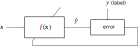
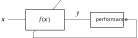
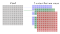
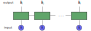

# Deep Learning Portfolios {#DL-portfolios}

> "Robots took the jobs of factory workers. Artificial intelligence will take the jobs of PMs."
>
> --- Anonymous

<!---
“Recipes tell you nothing. Learning techniques is the key.”
— Tom Colicchio

“A man who carries a cat by the tail learns something he can learn in no other way.”
— Mark Twain

“Anyone who stops learning is old, whether at twenty or eighty.”
— Henry Ford

If you put garbage in a computer nothing comes out but garbage. But this garbage, having passed through a very expensive machine, is somehow ennobled and none dare criticize it.

— Rory Bremner
--->

\afterquotespace
\acknowledgementCUP

_Artificial intelligence_ (AI) is a very broad term that, roughly speaking, refers to the general ability of computers to emulate human thought and perform tasks in real-world environments. _Machine learning_ (ML) is a subset of AI that refers to the technologies and algorithms that enable systems to identify patterns, make decisions, and improve themselves through experience and data. In particular, _neural networks_ (NN) are flexible architectures that attempt to emulate the structure of the neurons in the human brain and provide very powerful tools for systems to learn automatically from examples. This is in opposition to the traditional approach in computer science where the machine is already programmed beforehand to perform one specific task, such as the portfolio formulations considered in this book.

More specifically, _deep neural networks_, also broadly referred to as _deep learning_ (DL), have ignited a revolution in many domain-specific areas with outstanding performance, putting previous traditional methods to shame in terms of performance. Some areas revolutionized by deep neural networks (in the sense of achieving close-to-human or superhuman performance) include:

- _image recognition_: superhuman performance (this goes from simple recognition of cats to sophisticated cancer detection from X-rays); 
- _natural language processing_ (NLP): human-level performance;
- _board and video games_: superhuman performance (e.g., chess, Go, and Atari video games);
- _video processing_: close-to-human performance (e.g., real-time video navigation in drones);
- _protein folding_: superhuman performance;
- _self-driving cars_: not yet superhuman or even human-level, but soon to arrive;
- _professional and academic benchmarks_: human-level performance (e.g., passing a simulated bar exam with a score around the top 10% of test takers).

The million-dollar question is whether this revolution will extend to financial systems. To start with, there are many ways in which DL can be used in financial systems. In fact, it has already been successfully employed in some specific problems, such as sentiment analysis of news, credit default detection, or satellite image analysis to detect stock levels or crop production related to companies.

Following the theme of this book, we will investigate how DL can be applied in portfolio design. That is, whether one can design a black box that takes as input some financial data and outputs the portfolio to be used. At the time this book was written, the subject was still developing, and the answer to this question remained unclear. In fact, numerous papers were being published, and various open-source software libraries were becoming available.
<!---Most likely, the answer will not be binary (i.e., yes or no) and, instead, will depend on the nature and frequency of the data fed into the system. Nevertheless, the jury is still out.--->

  This material has been published as:
  Daniel P. Palomar (2025). _Portfolio Optimization: Theory and Application_. Cambridge University Press.
  This version is free to view and download for personal use only; not for re-distribution, re-sale, or use in derivative works. ©\ Daniel P. Palomar 2025.

## Machine Learning {#ML}
\index{machine learning (ML)}
The approach taken in this book has been based on first modeling the data and then designing a portfolio based on such a model, as illustrated in the big-picture diagram of Figure\ \@ref(fig:block-diagram-modeling-mean-var-portfolio) in Chapter\ \@ref(intro). In machine learning, the approach is more direct and algorithm based, attempting to _learn_ a "black-box" model of reality [@Breiman2001]. A thorough explanation of _statistical learning_ (which can be loosely considered equivalent to machine learning) can be found in the textbooks @HastieTibshiraniFriedman2009, @JamesWittenHastieTibshirani2013, and @ShalevBenDavid2014.

Machine learning encompasses a variety of tools for understanding data. The fundamental paradigms of machine learning include:

- _Supervised learning_: The task is to learn a function that maps an input to an output based on example input--output pairs (i.e., providing output labels).

- _Reinforcement learning_: The task is again to learn a mapping function but without explicit input--output examples. Instead, it is based on a reward function that evaluates the performance of the current state and action.

- _Unsupervised learning_: In this case, there are inputs but no supervised output (labels) or reward function. Nevertheless, one can still learn relationships and structure from such data (examples are clustering and the more sophisticated graph learning explored in Chapter\ \@ref(graph-modeling) with applications for portfolio design in Chapter\ \@ref(graph-based-portfolios)).

<!---
[^RL]: Some machine learning algorithms do not just experience a fixed dataset. For example, reinforcement learning (RL) algorithms interact with an environment, so there is a feedback loop between the learning system and its experiences.
--->

<!---
Historically, statistical learning goes back to the introduction of least squares at the beginning of the nineteenth century, what is now called _linear regression_. By the end of the 1970s, many more techniques for learning from data were available, but still they were almost exclusively linear methods, because fitting non-linear relationships was computationally infeasible at the time. In the mid-1980s, classification and regression trees were introduced as one of the first practical implementations of _nonlinear methods_. Since that time, machine learning has emerged as a new subfield in statistics, focused on supervised and unsupervised modeling and prediction. In recent years, progress in statistical learning has been marked by the increasing availability of powerful and relatively user-friendly software.

One example is forecasting of stock market data. We could take the prices of the previous days as the input to the system, and attempt to forecast either the future price or at least the trend (i.e., up or down); the former case with a continuous value to forecast is called _regression_, whereas the latter with a discrete or categorical value to forecast is called _classification_.
--->

### Black-Box Modeling
Historically, statistical learning goes back to the introduction of least squares at the beginning of the nineteenth century, what is now called _linear regression_. By the end of the 1970s, many more techniques for learning from data were available, but still they were almost exclusively linear methods, because fitting nonlinear relationships was computationally infeasible at the time. In the mid-1980s, classification and regression trees were introduced as one of the first practical implementations of _nonlinear methods_. Since that time, machine learning has emerged as a new subfield in statistics, focused on supervised and unsupervised modeling and prediction. In recent years, progress in statistical learning has been marked by the increasing availability of powerful and relatively user-friendly software.

The basic idea of ML is to model and learn the input--output relationship or mapping of some system. Denoting the input or $p$ _features_ as $\bm{x}=(x_1, \dots, x_p)$ and the output as $y$, we conjecture that reality can be modeled as the noisy relationship
$$
y = f(\bm{x}) + \epsilon,
$$
where $f$ is some unknown function, to be learned, that maps $\bm{x}$ into $y$, and $\epsilon$ denotes the random noise. This modeling via the function $f$ is what is usually referred to as "black box," in the sense that no attempt is made at understanding the mapping $f$, it is simply learned.

One of the main reasons to estimate or learn the function $f$ is for prediction, also termed forecasting if the prediction is for a future time: assuming a given input $\bm{x}$ is available, the output $y$ can be predicted as
$$
\hat{y} = f(\bm{x}).
$$

Depending on the nature of the output $y$, ML systems are classified into

- _regression_: the output is a real-valued number; and
- _classification_: the output can only take discrete values, such as $\{0,1\}$ or $\{\textm{cat},\textm{dog}\}$.

<!---
The accuracy of $\hat{y}$ as a prediction for $y$ can be split into two terms: the irreducible component is due to the intrinsic error term $\epsilon$, which cannot be eliminated, whereas the reducible term is due to errors in the estimation of $f$ and can be potentially reduced. In order to estimate or learn the function $f$, we need to specify the form of $f$ and the learning mechanism.
--->

### Measuring Performance
In order to learn the function $f$, we need to be able to evaluate how good a candidate model is. This is conveniently done by defining an error function, also known as a loss (or cost) function. Any appropriate error function for the problem at hand can be used; the two typical choices for error functions are

- _mean squared error_ (MSE) for regression:
$$
\textm{MSE} \triangleq \E\left[\left(y - \hat{y}\right)^2\right] = \E\left[\left(y - f(\bm{x})\right)^2\right];
$$
- _accuracy_ (ACC) for classification:[^classification-measures]
$$
\textm{ACC} \triangleq \E\left[I\left(y = \hat{y}\right)\right] = \E\left[I\left(y = f(\bm{x})\right)\right],
$$
where $I\left(y = \hat{y}\right)$ is the indicator function that equals 1 if $y = \hat{y}$ (i.e., correct classification) and zero otherwise (i.e., classification error).

[^classification-measures]: For classification systems, a large number of performance measures are commonly used, such as accuracy, precision, recall, sensitivity, specificity, miss rate, false discovery rate, among others. All these quantities are easily defined based on the number of true positives, true negatives, false positives, and false negatives. For instance, the accuracy is computed as the sum of true positives and true negatives normalized with the total number of samples.

<!---
and the _mean absolute error_ (MAE),
$$
\textm{MAE} = \E\left[\left|y - \hat{y}\right|\right] \approx \frac{1}{n}\sum_{t=1}^n \left|y_t - \hat{y}_t\right| = \frac{1}{n}\sum_{t=1}^n \left|y_t - f(\bm{x}_t)\right|.
$$
--->

The expectation operator $\E\left[\cdot\right]$ is over the distribution of random input--output pairs $(\bm{x},y)$. In practice, however, this expectation has to be approximated via the sample mean over some observations. To be specific, in supervised learning, the estimation or learning of the function $f$ is performed based on $n$ observations or data points called _training data_:
$$\{(\bm{x}_1,y_1),(\bm{x}_2,y_2), \dots, (\bm{x}_n,y_n)\}.$$
The performance or error measure can then be computed using the training data. The hope is that this training error will be close to the true error, but in practice this is not the case since the learning process can lead to a small training error that is not representative of the actual error, a phenomenon termed _overfitting_. To properly evaluate the performance of a system, new data that has not been used during the learning process has to be employed for testing, termed _test data_, producing the test performance, such as the test MSE or test ACC, which is representative of the true performance. Figure\ \@ref(fig:overfitting) illustrates the difference between the training MSE and the test MSE of a system as the complexity of the model $f$ increases (i.e., the number of parameters or degrees of freedom). The divergence between the training MSE and test MSE after some point of complexity implies overfitting: the system is fitting the noise in the training data that is not representative of the test data.

(\#fig:overfitting)Overfitting: training error and test error.

### Learning the Model
\index{machine learning (ML)!learning}
The black-box model $f$ is learned based on the training data by minimizing the training error or optimizing a performance measure. The specific mechanism by which $f$ is learned depends on the particular black-box model. For example, in artificial neural networks, the training algorithms are variations of stochastic gradient descent (described in Section\ \@ref(DL)).

Supervised learning is used to learn the function $f$ based on input--output pairs (i.e., with labels) in order to minimize the error (e.g., MSE or ACC), as illustrated by the block diagram in Figure\ \@ref(fig:block-diagram-supervised-learning-error). When explicit labels are not available but the performance of the model can be measured, reinforcement learning can be effectively used, as illustrated by the block diagram in Figure\ \@ref(fig:block-diagram-reinforcement-learning).

(\#fig:block-diagram-supervised-learning-error)Supervised learning in ML via error minimization.

<!---
The block diagram in Figure\ \@ref(fig:block-diagram-supervised-learning-performance) illustrates this supervised learning process that resembles a reinforcement learning architecture (strictly speaking, reinforcement learning uses feedback in the form of rewards or punishments based on the actions).
--->

(\#fig:block-diagram-reinforcement-learning)Reinforcement learning in ML via performance optimization.

<!---
::: {.example name="Learning via error vs. performance."}
Suppose we want to learn a black-box model $f$ that computes the average of the $p$ input features $\bm{x}$, that is, we want $f(\bm{x}) = \frac{1}{p}\bm{1}^\T\bm{x}$. The typical direct way to formulate the problem is to first generate the desired labels for the training data precisely as $y_t = \frac{1}{p}\bm{1}^\T\bm{x}_t$ and then learn $f$ via error minimization as in Figure\ \@ref(fig:block-diagram-supervised-learning-error). An alternative indirect way, which does not require the explicit computation of the labels, is to simply optimize a performance measure. In this case, since we want to learn a system that computes the average of the input features, we could choose to minimize the performance function $\E\left[\|\bm{x} - \bm{1}\times f(\bm{x})\|^2\right]$ as in Figure\ \@ref(fig:block-diagram-reinforcement-learning).
:::
--->

As mentioned before, extreme care has to be taken to avoid overfitting, that is, to avoid fitting the noise in the training data that is not representative of the rest of the data. In practice, this happens when there is too little training data or when the number of parameters (i.e., degrees of freedom) that characterize $f$ is too large, as illustrated in Figure\ \@ref(fig:overfitting). To avoid overfitting, two main philosophies have been developed in order to choose an adequate complexity for the model (i.e., the number of degrees of freedom or parameters), termed model assessment [@HastieTibshiraniFriedman2009, Chapter 7]:

- _Empirical cross-validation methods_: These simply rely on assessing the performance of a learned model $f$ (estimated from training data) on new data termed _cross-validation data_ (note that, once the final model for $f$ has been made, the final performance will be assessed on yet new data termed _test data_).

- _Statistical penalty methods_: To avoid reserving precious data for cross-validation, these methods rely on mathematically derived penalty terms on the degrees of freedom; for example, the Bayesian information criterion (BIC), the minimum description length (MDL), and the Akaike information criterion (AIC).

### Types of ML Models
\index{machine learning (ML)!models}
In practice, we cannot handle a totally arbitrary function $f$ in the whole space of possible functions. Instead, we constrain the search to some class of functions $f$ and employ some finite-dimensional parameters, denoted by $\bm{\theta}$, to conveniently characterize $f$. For example, linear models correspond to the form $f(\bm{x}) = \alpha + \bm{\beta}^\T\bm{x}$, with parameters $\bm{\theta} = (\alpha,\bm{\beta})$. Other classes of nonlinear models can adopt more complicated structures, but always with a finite number of parameters. 

Over the decades, since the advent of linear regression methods in the 1970s, a plethora of classes of functions have been proposed. The reason it was necessary to introduce so many different statistical learning approaches, rather than just a single best method, is because of the "no free lunch theorem" in statistics: no one method dominates all others over all possible data sets. On a particular data set, one specific method may work best, but some other method may work better on a different data set. Hence it is an important task to decide which method produces the best results for any given set of data. Selecting the best approach can be one of the most challenging parts of performing statistical learning in practice.

Some machine learning methods that have enjoyed success in ML include [@Vapnik1999; @Bishop2006; @HastieTibshiraniFriedman2009; @ShalevBenDavid2014]:

- linear models
- sparse linear models
- decision trees
- $k$-nearest neighbors
- bagging
- boosting
- random forests (boosting applied to decision trees)
- support vector machines (SVM)
- neural networks, which are the foundation of deep learning.

Interestingly, some of the more complex models, such as random forests and neural networks, are so-called _universal function approximators_, meaning that they are capable of approximating any nonlinear smooth function to any desired accuracy, provided that enough parameters are incorporated.

### Applications of ML in Finance {#ML-in-finance}
\index{machine learning (ML)!finance}
ML can be used in finance in a multitude of ways. In the context of this book, perhaps the two most obvious applications are time series forecasting and portfolio design. However, there are many other aspects where ML can be used, for example, credit risk [@Atiya2001], sentiment analysis, outlier detection, asset pricing, bet sizing, feature importance, order market execution, big data analysis [@DePrado2019-10applications], and so on.

@DePrado2018 gives a comprehensive treatment of recent machine learning advances in finance, with extensive treatment of the preprocessing and parsing of data from its unstructured form to the appropriate form for standard ML methods to be applied. On a more practical aspect, reasons why most machine learning funds fail are presented in @DePrado2018-10reasons.

In the realm of time series analysis, there exists a large number of publications addressing different aspects. An overview of machine learning techniques for time series forecasting is provided in @AhmedAtiyaGayarElShishiny2010 and @BontempiTaiebBorgne2012, while a comparison between support vector machines and neural networks in financial time series is performed in @CaoTay2003. Pattern recognition in time series is covered in @EslingAgon2012 and a comparison of various classifiers for predicting stock market price direction is provided in @BallingsPoelHespeelsGryp2015.

<!---a comparative analysis of ML methods for empirical asset pricing is given in [@GuKellyXiu2020].--->

<!---
As for the application in portfolio design, this chapter will delve into that.
--->

## Deep Learning {#DL}
\index{deep learning (DL)}
Conventional machine learning methods are limited in their ability to process raw data in the black-box model $f(\cdot)$. For decades, constructing machine-learning systems required careful engineering and considerable domain expertise to transform the raw data into a suitable feature vector $\bm{x}$ from which the learning subsystem could detect or classify patterns. These are known as _handcrafted features_, in contrast to the _learned features_ that a deep architecture can automatically obtain, a process referred to as _representation learning_.

_Deep learning_, broadly speaking, refers to methods and architectures that can automatically learn features by means of concatenation of multiple simple -- but nonlinear -- modules or layers, each of which transforms the representation at one level (starting with the raw input) into a representation at a higher, slightly more abstract, level. For example, an image comes in the form of an array of pixel values, and the learned features in the first layer of representation typically represent the presence or absence of edges at particular orientations and locations in the image. The second layer typically detects motifs by spotting particular arrangements of edges. The third layer may assemble motifs into larger combinations that correspond to parts of familiar objects, and subsequent layers would detect objects as combinations of these parts. The key aspect of deep learning is that these layers of features are not designed by human engineers: they are learned from data using a general-purpose learning procedure.

Quoting @LeCunBengioHinton2015:[^threee-godfathers]

> Deep learning allows computational models that are composed of multiple processing layers to learn representations of data with multiple levels of abstraction. These methods have dramatically improved the state-of-the-art in speech recognition, visual object recognition, object detection and many other domains such as drug discovery and genomics. Deep learning discovers intricate structure in large data sets by using the backpropagation algorithm to indicate how a machine should change its internal parameters that are used to compute the representation in each layer from the representation in the previous layer.

[^threee-godfathers]: Yoshua Bengio, Geoffrey Hinton, and Yann LeCun [@LeCunBengioHinton2015] were recipients of the 2018 ACM A. M. Turing Award for conceptual and engineering breakthroughs that have made deep neural networks a critical component of computing.

Deep learning is significantly advancing the solutions to problems that have long challenged the artificial intelligence community.
<!---It has turned out to be very good at discovering intricate structures in high-dimensional data and is therefore applicable to many domains of science, business and government. In addition to beating records in image recognition and speech recognition, it has beaten other machine-learning techniques at predicting the activity of potential drug molecules analysing particle accelerator data, reconstructing brain circuits in non-coding DNA on gene expression and disease . Perhaps more surprisingly, deep learning has produced extremely promising results for various tasks in natural language understanding, particularly topic classification, sentiment analysis, question answering and language translation.--->
In fact, deep learning has been so successful that it has been referred to with expressions such as "the unreasonable effectiveness of deep learning" and with questions like "Why does deep and cheap learning work so well?" [@LinTegmarkRolnick2017].

A concise account of deep learning can be found in @LeCunBengioHinton2015, whereas an excellent comprehensive textbook is @GoodfellowBengioCourville2016, and a superb short online introductory book is @Nielsen2015.

### Historical Snapshot
\index{deep learning (DL)!history}
Some of the fundamental ingredients of neural networks take us back centuries to 1676 (the chain rule of differential calculus), 1847 (gradient descent), 1951 (stochastic gradient descent), or 1970 (the backpropagation algorithm), to name a few. A detailed historical account of deep learning can be found in @Schmidhuber2015 and @Schmidhuber2022. At the risk of oversimplifying and for illustration purposes, some pivotal historical moments in DL include:

- 1962: Rosenblatt introduces the _multilayer perceptron_;
- 1967: Amari suggests training multilayer perceptrons with many layers via _stochastic gradient descent_;
- 1970: Linnainmaa publishes what is now known as _backpropagation_, the famous algorithm also known as "reverse mode of automatic differentiation" (it would take four decades until it became widely accepted);
- 1974--1980: first major "AI winter" (i.e., period of reduced funding and interest in AI);
- 1987--1993: second major "AI winter";
- 1997: LSTM networks introduced [@HochreiterSchmidhuber1997];
- 1998: CNN networks established [@LeCunBottouBengioHaffner1998];
- 2010: "AI spring" starts;
- 2012: AlexNet network achieves an error of 15.3% in the ImageNet 2012 Challenge, more than 10.8 percentage points lower than that of the runner up [@KrizhevskySutskeverHinton2012];
- 2014: GAN networks established and gained popularity for generating data;
- 2015: AlphaGo by DeepMind beats a professional Go player;
- 2016: Google Translate (originally deployed in 2006) switches to a neural machine translation engine;
- 2017: AlphaZero by DeepMind achieves superhuman level of play in the games of chess, Shogi, and Go;
- 2017: Transformer architecture is proposed based on the self-attention mechanism, which would then become the de facto architecture for most of the subsequent DL systems [@Vaswani_etal2017];
- 2018: GPT-1 (Generative Pre-Trained Transformer) for natural language processing with 117 million parameters, starting a series of advances in the so-called large language models (LLMs);
- 2019: GPT-2 with 1.5 billion parameters;
- 2020: GPT-3 with 175 billion parameters;
- 2022: ChatGPT: a popular chatbot built on GPT-3, astonished the general public, sparking numerous discussions and initiatives centered on AI safety;
- 2023: GPT-4 with ca. 1 trillion parameters [@OpenAI2023_GPT4], which allegedly already shows some sparks of artificial general intelligence (AGI) [@Bubeck_etal2023]. 

As of 2023, the momentum of AI systems based on deep learning is difficult to grasp and it is challenging to keep up with the state of the art. Dozens of startup companies and open-source initiatives are produced by the day, not to mention the astounding number of publications. The pace has become unimaginable and the progress impossible to forecast.

### Perceptron and Sigmoid Neuron
The _perceptron_[^perceptron] is a function that maps its input vector $\bm{x}$ to a binary output value according to
$$
f(\bm{x}) = \begin{cases}
1\quad \textm{if } \bm{w}^\T\bm{x} + b \geq 0,\\
0\quad \textm{otherwise},\\
\end{cases}
$$
where $\bm{w}$ is a vector of weights and $b$ is the bias. In other words, this function is the composition of the affine function $\bm{w}^\T\bm{x} + b$ with the nonlinear binary step function (also called the Heaviside function) $H(z)$ defined as 1 for $z\geq0$ and 0 otherwise, that is, $f(\bm{x}) = H(\bm{w}^\T\bm{x} + b)$ (alternatively, with the indicator function $I(\cdot)$, we can write $f(\bm{x}) = I(\bm{w}^\T\bm{x} + b \geq 0)$). The weights give different importance to the inputs and the bias is equivalent to having a nonzero activation threshold. This is a minimal approximation of how a biological neuron works.

[^perceptron]: Perceptrons were developed in the 1950s and 1960s by the scientist Frank Rosenblatt, inspired by earlier work by Warren McCulloch and Walter Pitts.

_Sigmoid neurons_ are similar to perceptrons, but modified so that small changes in their weights and bias cause only a small change in their output. That is the crucial fact that will allow a network of sigmoid neurons to learn. A sigmoid neuron is defined, similarly to a perceptron, as
$$
f(\bm{x}) = \sigma(\bm{w}^\T\bm{x} + b),
$$
where $\sigma$ is the _sigmoid function_ defined as $\sigma(z) = 1/(1 + e^{-z})$. Interestingly, when $z$ is a large positive number, then $e^{-z}\approx0$ and $\sigma(z)\approx1$, and when $z$ is very negative, then $e^{-z}\rightarrow\infty$ and $\sigma(z)\approx0$; this resembles the behavior of the perceptron. 

Both the Heaviside function $H(z)$ (also known as a step function) and the sigmoid function $\sigma(z)$ are types of nonlinear activation functions. These nonlinearities are key components in neural networks. Otherwise, the input--output relationship would simply be linear. Figure\ \@ref(fig:activation-functions) compares the nonlinear activation functions for the perceptron (i.e., the step function $H(z)$) and the sigmoid neuron (i.e., the sigmoid function $\sigma(z)$), as well as the popular ReLU function $\textm{ReLU}(z) = \textm{max}(0, z)$ to be discussed later.

(\#fig:activation-functions)Activation functions: step function (for the perceptron), sigmoid function (for the sigmoid neuron), and ReLU (popular in neural networks).

### Neural Networks
\index{deep learning (DL)!neural network}
\index{deep learning (DL)!multilayer perceptron}
Perceptrons can be combined in multiple layers, leading to what is referred to as _multilayer perceptron_ (MLP). In this way, perceptrons in subsequent layers can make decisions at a more complex and more abstract level than perceptrons in the first layer. In fact, MLPs are universal function approximators (they can approximate arbitrary functions as well as desired). 
<!---
Figure\ \@ref(fig:MLP) depicts an example of an MLP. 

--->

A _neural network_ is simply several layers of neurons of any type (in fact, with some abuse of terminology they are also referred to as MLPs). The leftmost layer is called the _input layer_ and it simply contains the input vector $\bm{x}$ (it is not an operational layer per se). After that come the _hidden layers_. Finally, the rightmost layer is called the _output layer_ and contains the output neurons. Figure\ \@ref(fig:MLP-2hiddenlayers) shows a four-layer network with two hidden layers.

(\#fig:MLP-2hiddenlayers)Example of a multilayer perceptron with two hidden layers.

The goal of a neural network is to approximate some (possibly vector-valued) function $\bm{f}$. Neural networks are often referred to as _feedforward neural networks_ to emphasize the fact that information flows from the input $\bm{x}$, through the intermediate layers, to the output $\bm{y}$, without feedback connections in which outputs of the model are fed back into itself. When feedback connections are included, they are called _recurrent neural networks_, as presented later.

When the number of layers, called the depth of the model, is large enough, the network is referred to as _deep_, leading to the so-called _deep neural network_, as well as the mouthful of a name "deep feedforward neural network."

Mathematically, each layer $i$ can be thought of as implementing a vector function $\bm{f}^{(i)}$, leading to a connected chain of functions (i.e., composition of functions)<!--- $\bm{f}(\bm{x}) = \bm{f}^{(n)}(\cdots\bm{f}^{(2)}(\bm{f}^{(1)}(\bm{x})))$--->, conveniently written as 
$$\bm{f} = \bm{f}^{(n)} \circ \dots \circ \bm{f}^{(2)} \circ \bm{f}^{(1)},$$
where $\circ$ denotes function composition. Each hidden layer of the network is typically vector valued, with their dimensionality determining the width of the model. In particular, each layer $i$ produces an intermediate vector $\bm{h}^{(i)}$ from the previous vector $\bm{h}^{(i-1)}$ (with $\bm{h}^{(0)} \triangleq \bm{x}$) as
$$
\bm{h}^{(i)} = \bm{f}^{(i)}\left(\bm{h}^{(i-1)}\right) = \bm{g}^{(i)}\left(\bm{W}^{(i)}\bm{h}^{(i-1)} + \bm{b}^{(i)}\right),
$$
where $\bm{f}^{(i)}$ is the composition of an affine function with the elementwise nonlinear activation function $\bm{g}^{(i)}.$ That is, each layer implements a function that is simply an affine function composed with a nonlinear activation function, although other operators are also used such as the max-pooling described later. Common elementwise nonlinear activation functions include:

- the _sigmoid function_: $$\sigma(z) = \frac{1}{1 + e^{-z}};$$
- the _hyperbolic tangent_: $$\textm{tanh}(z) = \frac{e^{z} - e^{-z}}{e^{z} + e^{-z}};$$
- the popular _rectified linear unit_ (ReLU) function: $$\textm{ReLU}(z) = \textm{max}(0, z),$$ which typically learns much faster in networks with many layers.

The output layer in classification problems typically employs the so-called _softmax function_,
\begin{equation}
  \textm{softmax}(\bm{z}) = \frac{e^{\bm{z}}}{\bm{1}^\T e^{\bm{z}}},
  (\#eq:softmax)
\end{equation}
where the exponentiation ensures the outputs are nonnegative and the normalization ensures they sum to one, that is, the output is effectively a probability mass function (in classification problems, each output value denotes the probability of each class). In regression problems, the output layer is typically a simple affine mapping without an activation function, that is, $\bm{g}(\bm{z})=\bm{z}$.

<!---
Thus, a standard $n$-layer feedforward neural network implements vector-valued functions of the form
$$
\bm{f}(\bm{x}) = \left(\bm{\sigma}_n \circ \bm{A}_n \circ \dots \circ \bm{\sigma}_2 \circ \bm{A}_2 \circ \bm{\sigma}_1 \circ \bm{A}_1\right) (\bm{x}),
$$
where the $\bm{\sigma}_i$ are simple nonlinear operators, and the $\bm{A}_i$ are affine transformations of the form $\bm{A}_i(\bm{x}) = \bm{W}_i\bm{x} + \bm{b}_i$ for matrices $\bm{W}_i$ and so-called bias vectors $\bm{b}_i$. Popular choices for these nonlinear operators $\bm{\sigma}_i$ include:

- _activation function_: some local nonlinear function $\sigma$ applied to each vector element, such as the sigmoid function $\sigma(z) = 1/(1 + e^{-z})$, the hyperbolic tangent $\textm{tanh}(z)$, or the popular _rectified linear unit_ (ReLU) function $\sigma(z) = \textm{max}(0, z) = (z)^+$ (the ReLU typically learns much faster in networks with many layers);
- _max-pooling_: computation of the maximum of all vector elements; and
- _softmax function_: exponentiation of all vector elements with a normalization so that they sum up to one:
$$
\bm{\sigma}(\bm{x}) = \frac{e^\bm{x}}{\sum_{\tilde{\bm{x}}}e^\Tilde{\bm{x}}}.
$$
--->

<!---
Each element of the vector may be interpreted as playing a role analogous to a neuron. Rather than thinking of the layer as representing a single vector-to-vector function,we can also think of the layer as consisting of many units that act in parallel, each representing a vector-to-scalar function. Each unit resembles a neuron in the sense that it receives input from many other units and computes its own activation value. The idea of using many layers of vector-valued representationsis drawn from neuroscience. The choice of the form of the functions $\bm{f}^{(i)}$ used to compute these representations is also loosely guided by neuroscientific observations about the functions that biological neurons compute. Modern neural network research, however, is guided by many mathematical and engineering disciplines, and the goal of neural networks is not to perfectly model the brain. It is best to think of feedforward networks as function approximation machines that are designed to achieve statistical generalization, occasionally drawing some insights from what weknow about the brain, rather than as models of brain function. 
--->

### Learning via Backpropagation
\index{deep learning (DL)!backpropagation}
As mentioned earlier in Section\ \@ref(ML), supervised learning involves developing a black-box model by training the system with data and minimizing an error function. This is achieved by adjusting specific parameters, commonly referred to as weights, which act as "knobs" determining the input--output function, as demonstrated in Figure\ \@ref(fig:block-diagram-supervised-learning-error). In a typical deep learning system, there may be hundreds of millions (or even billions) of these adjustable weights, and hundreds of millions of labeled examples with which to train the machine.

A conceptually simple way to learn the system is based on the gradient method. To adjust the weight vector $\bm{w}$, the learning algorithm computes the gradient vector of the error function $\xi(\bm{w})$, that is, $\partial{\xi}/\partial\bm{w}$, which indicates by what amount the error would increase or decrease if the weights were increased by a tiny amount. The weight vector is then adjusted in the opposite direction to the gradient vector to minimize the error or cost function:
$$
\bm{w}^{k+1} = \bm{w}^{k} - \kappa \frac{\partial{\xi}}{\partial\bm{w}},
$$
where $\kappa$ is the so-called _learning rate_.

The error or cost function is typically defined via a mathematical expectation over the distribution of the possible input--output pairs. In practice, it is not possible to evaluate such an expectation operator and one has to resort to a procedure called _stochastic gradient descent_ (SGD). This process involves presenting the input vector for several examples, computing the outputs and errors, determining the average gradient for those examples, and adjusting the weights accordingly. The procedure is repeated for numerous small sets of examples from the training set until the average of the objective function ceases to decrease. It is referred to as stochastic because each small set of examples provides a noisy estimate of the average gradient across all examples. This straightforward process typically identifies a good set of weights faster in comparison to more complex optimization methods. In multilayer architectures, one can compute gradients using the _backpropagation_ procedure, which is nothing more than a practical implementation of the chain rule for derivatives (this method was discovered independently by several different groups during the 1970s and 1980s). 

<!---
The key insight is that the derivative (or gradient) of the objective with respect to the input of a module can be computed by working backwards from the gradient with respect to the output of that module (or the input of the subsequent module). The backpropagation equation can be applied repeatedly to propagate gradients through all modules, starting from the output at the top (where the network produces its prediction) all the way to the bottom (where the external input is fed). Once these gradients have been computed, it is straightforward to compute the gradients with respect to the weights of each module. To go from one layer to the next, a set of units compute a weighted sum of their inputs from the previous layer and pass the result through a non-linear function. At present, the most popular non-linear function is the rectified linear unit (ReLU), which is simply the half-wave rectifier f(z) = max(z, 0). In past decades, neural nets used smoother non-linearities, such as tanh(z) or 1/(1 + exp(−z)), but the ReLU typically learns much faster in networks with many layers.
--->

<!---
After training, the performance of the system is measured on a different set of examples called test set. This serves to test the generalization ability of the machine, i.e., its ability to produce sensible answers on new inputs that it has never seen during training.
--->

In the late 1990s, neural nets and backpropagation were largely forsaken by the machine learning community and ignored by the computer vision and speech recognition communities. In particular, it was commonly thought that simple gradient descent would get trapped in poor local minima (weight configurations for which no small change would reduce the average error). In practice, however, this is rarely a problem with large networks. Regardless of the initial conditions, the system nearly always reaches solutions of very similar quality. Recent theoretical and empirical results strongly suggest that local minima are not a serious issue in general. 

### Deep Learning Architectures
Research in DL is extremely vibrant and new architectures are constantly being explored by practitioners and academics. In the following we describe some of the most relevant paradigms.

#### Fully-Connected Neural Networks {-}
\index{deep learning (DL)!multilayer perceptron}
The neural networks previously introduced are actually _fully connected neural networks_ in the sense that each neuron takes as inputs all the outputs from the previous layer and combines them with weights. This rapidly results in a significant increase in the number of weights to be trained as illustrated in Figure\ \@ref(fig:MLP-5hiddenlayers), which shows a very simple MLP with just five hidden layers.

(\#fig:MLP-5hiddenlayers)Large number of weights in a simple multilayer perceptron with five hidden layers.

To decrease the number of weights, it is necessary to incorporate a meaningful structure into the network, tailored to the specific application being addressed. By reducing the number of weights per layer, we can have many layers to express computationally large models, producing high levels of abstraction, while keeping the number of actual parameters manageable.

#### Convolutional Neural Networks (CNNs) {-}
\index{deep learning (DL)!convolutional neural network (CNN)}
One popular example in the history of deep learning is that of _convolutional neural networks_ (CNNs), based on the concept of convolution commonly used in signal processing. This network achieved many practical successes during the period when neural networks were out of favor and it has been widely adopted by the computer-vision community. The origins of CNNs go back to the 1970s, but the seminal paper establishing the modern subject of convolutional networks was @LeCunBottouBengioHaffner1998, where the architecture "LeNet-5" was proposed consisting of seven layers. Another important achievement was in 2012, with the "AlexNet" architecture [@KrizhevskySutskeverHinton2012] that blew existing image classification results out of the water.

The concept of CNNs originated from image processing, where the input is a two-dimensional image, and it makes sense for pixels to be processed only with their nearby pixels, rather than distant ones, as demonstrated in Figure\ \@ref(fig:CNN-filtering-1feature). Furthermore, the weights are shifted across the image, allowing them to be shared and reused by all neurons in the hidden layer. This introduces structure in the matrix $\bm{W}^{(i)}$ found in the affine mapping $\bm{W}^{(i)}\bm{h}^{(i-1)} + \bm{b}^{(i)}$. Specifically, the matrix $\bm{W}^{(i)}$ will be highly sparse (containing numerous zeros), and the nonzero elements will be repeated multiple times.

(\#fig:CNN-filtering-1feature)CNN filtering layer.

For instance, imagine having a $100 \times 100$ image, which corresponds to a $10\,000$-dimensional input vector. If the first hidden layer has the same size (i.e., the same number of neurons), a fully connected approach would require $10^8$ weights. In contrast, a CNN architecture would only need the coefficients of a $5 \times 5$, that is, 25 weights plus one for the bias. Of course, we cannot really do a direct comparison between the number of parameters, since the two models are different in essential ways. But, intuitively, it seems likely that the use of translation invariance by the convolutional layer will significantly reduce the number of parameters needed to achieve performance similar to the fully-connected model. That, in turn, will result in faster training for the convolutional model and, ultimately, will help us build deep networks using convolutional layers.

To reduce network complexity, CNNs use different stride lengths (when shifting the filter) and incorporate pooling layers, such as max-pooling, after convolutional layers to condense feature maps and retain information about the presence of features without precise location details.

<!---
To reduce the complexity of the network, instead of shifting the filter pixel by pixel, a different _stride length_ can be used. For instance, with a stride length of 2 (both horizontally and vertically), the output dimension would be $1/2\times 1/2 = 1/4$ of the input dimension.
--->

<!---
As can be seen from Figure\ \@ref(fig:CNN-filtering-1feature), due to the edge effects of the convolutional or filtering process, with a $5 \times 5$ filter the size of the first hidden layer would be $96 \times 96$ (2 pixels less along the borders) or 9,216 neurons. This is assuming that the filter is shifted pixel by pixel; in practice, however, sometimes a different _stride length_ is used. With a stride length of 2, the filter would be shifted every 2 pixels, so the first hidden layer would be $48 \times 48$ or 2,304 neurons. 
--->

<!---
The map from the input layer to the hidden layer is often referred to as _feature map_. In practice, multiple feature maps are used. For example, Figure\ \@ref(fig:CNN-overall-filtering-layer) illustrates 3 feature maps (each of them with different weights).

(\#fig:CNN-overall-filtering-layer)Three feature maps obtained after a filtering layer in a two-dimensional CNN.

--->

<!---
In addition to the convolutional layers just described, CNNs also contain pooling layers (usually immediately after convolutional layers) in order to further simplify the information at the output of convolutional layers. A pooling layer takes each feature map output from the convolutional layer (including the activation function), $\bm{g}^{(i)}\left(\bm{W}^{(i)}\bm{h}^{(i-1)} + \bm{b}^{(i)}\right)$, and prepares a condensed feature map. For instance, each unit in the pooling layer may summarize a region of, say, $2\times2$ neurons from the previous layer. As a concrete example, one common procedure for pooling is known as _max-pooling_, which simply outputs the maximum activation in the input region. Max-pooling layers effectively perform a kind of “zoom out”, keeping the information about whether a feature was present in a region of the previous layer, but not precisely where.
--->

<!---
, as illustrated in Figure\ \@ref(fig:CNN-maxpooling-layer). The output tells us if a feature was present in a region of the previous layer, but not precisely where. Max-pooling layers kind of “zoom out”. They allow later convolutional layers to work on larger sections of the data, because a small patch after the pooling layer corresponds to a much larger patch before it.

For example, Figure\ \@ref(fig:CNN-input-conv-max-output) shows the combination of the input layer (the image), a hidden convolutional layer, a max-pooling layer, and an output layer. In practice, many of these hidden layers (convolutional and pooling) are stacked after each other.

--->

An interesting extension of CNNs, which are based on processing neighboring pixels, is that of _graph CNNs_ [@Scarselli_etal2009], where the concept of neighborhood is generalized and indicated with a connectivity graph on the input elements (see Chapter\ \@ref(graph-modeling) for details on graphs).

#### Recursive Neural Networks (RNNs) {-}
\index{deep learning (DL)!recursive neural networks (RNN)}
Feedforward neural networks produce an output that solely depends on the current input; they do not have internal memory. _Recursive neural networks_ (RNNs), on the other hand, are neural networks with loops in them, allowing information to persist, that is, to have memory. 

Figure\ \@ref(fig:RNN) depicts an RNN layer, with an internal loop that allows the implementation of a function of all previous inputs $\bm{f}(\bm{x}_1, \bm{x}_2, \dots, \bm{x}_t)$.

(\#fig:RNN)RNN layer with a loop.

<!---
An RNN can be thought of as multiple copies of the same network, each passing a message to a successor, which makes more clear the memory effect. This is referred to as _unrolling_ of the network as illustrated in Figure\ \@ref(fig:RNN-unrolled).

(\#fig:RNN-unrolled)RNN unrolled.

--->

RNNs are appealing because they have the potential to link past information to current tasks. In instances where the gap between relevant information and its required location is small, RNNs can effectively learn to utilize past data. Nevertheless, when this gap widens significantly, standard RNNs struggle to learn how to connect the information. In theory, RNNs are fully capable of managing long-term dependencies. Yet, in practice, they often struggle to learn them due to the vanishing gradient problem during training. This issue has been addressed by introducing a specific RNN structure called LSTM.

#### Long Short-Term Memory (LSTM) Networks {-}
\index{deep learning (DL)!long short-term memory (LSTM)}
_Long short-term memory_ (LSTM) networks, a unique type of RNN capable of learning long-term dependencies, were introduced in @HochreiterSchmidhuber1997 and later refined and popularized in subsequent works. They have demonstrated remarkable success in various memory-dependent tasks, including natural language processing and time series analysis.

LSTMs are specifically engineered to tackle the long-term dependency issue. Rather than employing a basic feedback mechanism like vanilla RNNs, they utilize a complex structure composed of four interconnected sub-modules [@HochreiterSchmidhuber1997], resulting in a more effective learning process compared to other RNNs.

#### Transformers {-}
\index{deep learning (DL)!transformer}
The _transformer_ architecture, introduced in @Vaswani_etal2017, is a groundbreaking neural network design that revolutionized natural language processing tasks. Unlike CNNs and RNNs, transformers rely on self-attention mechanisms to process input sequences simultaneously, rather than sequentially like in RNNs. Transformers have arguably become the de facto universal architecture able to outperform existing architectures in most applications.

CNNs are adept at handling spatial data like images, while RNNs process sequential data but struggle with vanishing and exploding gradient issues. Transformers overcome these limitations by employing self-attention to weigh the importance of input elements, enabling parallel processing, faster training, and improved handling of long-range dependencies, along with position encoding to incorporate positional information.

The relevance of transformers stems from their exceptional performance on a wide range of tasks, such as machine translation, text summarization, and sentiment analysis. They form the basis of state-of-the-art models like GPT [@OpenAI2023_GPT4], which have achieved top results on benchmarks and enabled new applications, including conversational AI, automated content generation, and advanced language understanding.

Without going into the details of the architecture, it is worth a brief look at this self-attention mechanism that makes transformers unique. The idea is to present the network with all the inputs at once and let the network decide which parts of the input should influence other parts in an automatic way. Suppose that we have $n$ inputs, each of dimension $d$, arranged along the columns of the $n\times d$ matrix $\bm{V}$. The goal is to substitute each row of $\bm{V}$ by a proper linear weighted combination of all the rows, where the weights have to be calculated so that some inputs can influence other inputs in a precise manner. The way the weights are computed in a transformer is similar to the way "keys" in a database are "queried"; that is, by using a "query" matrix $\bm{Q}$ and a "key" matrix $\bm{K}$ (of the same dimension as $\bm{V}$), we can compute the inner product of the rows of $\bm{Q}$ and the rows of $\bm{K}$ to get a similarity matrix $\bm{Q}\bm{K}^\T$. At this point, we could use this similarity matrix as the weights; however, it is convenient to scale this matrix with the dimension of the keys $\sqrt{d_k}$ and then normalize the rows so that they are nonnegative numbers with a normalized sum via the softmax operator in \@ref(eq:softmax). Putting it all together leads to the popular expression for the so-called _scaled dot-product attention_ [@Vaswani_etal2017],
$$
\textm{Attention}(\bm{Q}, \bm{K}, \bm{V}) = \textm{softmax}\left(\frac{\bm{Q}\bm{K}^\T}{\sqrt{d_k}}\right)\bm{V},
$$
which is represented in Figure\ \@ref(fig:self-attention). In practice, the three matrices $\bm{Q}$, $\bm{K}$, and $\bm{V}$ are obtained as linear transformations of the inputs. Typically, multiple self-attention mechanisms are used in parallel.

(\#fig:self-attention)Self-attention mechanism (scaled dot-product attention).

#### Autoencoder Networks {-}
\index{deep learning (DL)!autoencoder}
_Autoencoder_ networks are commonly used in DL models to learn data representation via feature extraction and dimensionality reduction [@Kramer1991]. In other words, autoencoder networks perform an unsupervised feature learning process.

The architecture of an autoencoder consists, as usual, of an input layer, one or more hidden layers, and an output layer. More specifically, autoencoder networks have a symmetrical structure separated into the encoder and the decoder, with the same number of nodes in the input and output layers, and a bottleneck at the core called _code_ or _latent features_, as illustrated in Figure\ \@ref(fig:autoencoder). The network is trained so that the output is as close as possible to the input, therefore forcing the central bottleneck to condense the information, performing feature extraction in an unsupervised way.

(\#fig:autoencoder)Autoencoder structure.

#### Generative Adversarial Networks (GANs) {-}
\index{deep learning (DL)!generative adversarial network (GAN)}
_Generative adversarial networks_ (GANs), developed in @Goodfellow_etal2014, are a type of deep learning architecture that consists of two adversarial neural networks: a generator and a discriminator. The goal of the generator is to produce realistic data, such as images or text, while the discriminator's role is to distinguish between real and fake data.

The generator and discriminator are trained simultaneously. During training, the generator creates synthetic data and presents it to the discriminator. The discriminator then evaluates whether the data is real or fake and provides feedback to the generator. Based on this feedback, the generator modifies its output to create more realistic data. This process continues until the generator produces data that is indistinguishable from real data, making it difficult for the discriminator to identify which data is real or fake.

GANs have been successfully used in a variety of applications, such as image generation, text-to-image synthesis, and even generating realistic music. In finance, GANs can be employed to generate artificial time series with asset prices for backtesting and stress testing purposes [@TakahashiChenTanakaIshii2019; @YoonJarrettSchaar_NeurIPS2019].

#### Diffusion Models {-}
\index{deep learning (DL)!diffusion models}
_Diffusion models_ are another type of generative model in deep learning that use a diffusion process to generate samples from a target distribution. They were first introduced in @SohlDickstein_etal2015 but remained behind the curtains for a while and did not gain popularity until the 2020s [@Song_etal2019; @Ho_etal2020].

The idea is very different from the two adversarial networks (the generator and the discriminator) of GANs. Diffusion models iteratively transform an initial noise signal using a series of learnable transformations, such as neural networks, to generate samples that resemble the target distribution. At each iteration step, the model estimates the conditional distribution of the data given the current level of noise. <!---This is typically done using a neural network that predicts the mean and variance of the data distribution.--->

Both diffusion models and GANs are generative models that can be used to generate high-quality samples from complex distributions. However, diffusion models have some advantages over GANs, such as being more stable during training and not suffering from mode collapse, which is a problem where the generator produces only a small subset of the possible samples. On the other hand, GANs are more flexible and can generate a wider variety of samples, including those that are not present in the training data.

### Applications of Deep Learning in Finance
\index{deep learning (DL)!finance}
Essentially, all the financial applications discussed in Section\ \@ref(ML-in-finance) using machine learning can also be addressed with neural networks (which are a type of ML). However, deep learning involves deep neural networks, meaning networks with many layers. With a deep architecture, there are many weights or parameters to learn, requiring a large training dataset. While abundant data in areas involving images, text, or speech is not an issue, it can be problematic in finance. Therefore, it is best to focus on financial applications with access to large datasets.

As previously described, DL has already been successfully employed in many other areas. The financial area is starting to get traction; in fact, the field is wide open and many research opportunities still exist. A comprehensive state-of-the-art snapshot (as of 2020) of the DL models developed for financial applications is provided in @OzbayogluGudelekSezer2020, where 144 papers are categorized according to their intended subfield in finance and also analyzed based on their DL models.

Some of the areas in finance where DL is currently being researched include financial time series forecasting, algorithmic trading (a.k.a. _algo trading_), risk assessment (e.g., bankruptcy prediction, credit scoring, bond rating, and mortgage risk), fraud detection (e.g., credit card fraud, money laundering, and tax evasion), portfolio management, asset pricing and derivatives markets (options, futures, forward contracts), cryptocurrency and blockchain studies, financial sentiment analysis and behavioral finance, and financial text mining [@OzbayogluGudelekSezer2020].

Nevertheless, the most widely studied financial application area for DL is forecasting of financial time series, particularly asset price forecasting. Even though some variations exist, the main focus is on predicting the next movement of the underlying asset. More than half of the existing implementations of DL are focused on this direction. Even though there are several subtopics of this general problem, including stock price forecasting, index prediction, forex price prediction, commodity price prediction, bond price forecasting, volatility forecasting, and cryptocurrency price forecasting, the underlying dynamics are the same in all of these applications. The majority of the DL applications for financial time series have appeared quite recently, from 2015 on, as described in the comprehensive survey (as of 2020) @SezerGudelekOzbayoglu2020, where 140 papers are classified.

## Deep Learning for Portfolio Design
\index{deep learning (DL)!portfolio design}
In the context of portfolio design, deep learning can be used in a variety of ways. Recall that the two main components in portfolio design are data modeling and portfolio optimization. This is depicted in Figure\ \@ref(fig:block-diagram-modeling-mean-var-portfolio) (Chapter\ \@ref(intro)) and reproduced herein for convenience in Figure\ \@ref(fig:block-diagram-modeling-mean-var-portfolio-bis)<!--- for a modeling based on the mean vector and covariance matrix--->.

(\#fig:block-diagram-modeling-mean-var-portfolio-bis)Block diagram of data modeling and portfolio optimization.

In light of the block diagram in Figure\ \@ref(fig:block-diagram-modeling-mean-var-portfolio-bis), one could envision the usage of DL in at least three ways:

- using DL only in the modeling or time series forecasting component, while keeping the traditional portfolio optimization part;
- using DL only in the portfolio component, while keeping the traditional data modeling part; and
- using DL for both components, what is called _end-to-end_ modeling.

We will not consider further the option of using DL only for the optimization part, since that is a well-understood component that does not seem to require DL (in fact, this book has explored a wide variety of different portfolio formulations with efficient algorithms). Thus, we will focus on employing DL either in the forecast component or in the end-to-end system.

Regarding the input data to the DL system, one can use raw time series data, such as price data (e.g., open, high, low, close) and volume, as well as other sources of data derived from technical analysis, fundamental analysis, macroeconomic data, financial statements, news, social media feeds, and investor sentiment analysis. Also, depending on the time horizon, a wide range of options for the frequency of the data may be available, varying from _high-frequency data_ and intraday price movements to daily, weekly, or even monthly stock prices.

<!---
Mention the difference between algo-trading in the sense of entry/exit for individual stocks and multiasset portfolio design.
--->

### Challenges
\index{deep learning (DL)!challenges in portfolio design}
Before we explore the possibilities of DL for portfolio design, it is important to highlight the main challenges faced in this particular area. As already explained, deep neural networks have demonstrated outstanding performance in many domain-specific areas, such as image recognition, natural language processing, board and video games, biomedical applications, self-driving cars, and so on. The million-dollar question is whether this revolution will extend to financial systems.

Since the 2010s, the financial industry and academia have been exploring the potential of DL in various applications, such as financial time series forecasting, algorithmic trading, risk assessment, fraud detection, portfolio management, asset pricing, derivatives markets, cryptocurrency and blockchain studies, financial sentiment analysis, behavioral finance, and financial text mining. The number of research works keeps on increasing every year in an accelerated fashion, as well as open-source software libraries. However, we are just in the initial years of this new era and it is too early to say whether the success of DL enjoyed in non-financial applications will actually extend to financial systems and, particularly, to portfolio design. 

Apart from very specific financial applications that have already enjoyed some success, such as sentiment analysis of news, credit default detection, or satellite image analysis for stock level estimation or crop production, we now focus on the potential of deep neural networks specifically for financial time series modeling and portfolio design. Among the many possible challenges that set these problems apart from other successful applications, the following are definitely worth mentioning:

- _Data scarcity_: Compared to other areas, such as natural language processing (e.g., GPT-3 was trained on a massive dataset of over 570 GB of text data), financial time series are in general extremely scarce (except for high-frequency data). For example, two years of daily stock prices amount to just 504 observations.

- _Low signal-to-noise ratio_: The signal in financial data is extremely weak and totally submerged in noise. For example, an exploratory data analysis on asset returns corrected for the volatility envelope reveals a time series with little temporal structure (see Figures\ \@ref(fig:SP500-volatility-clustering-removed)--\@ref(fig:btc-volatility-clustering-removed) in Chapter\ \@ref(stylized-facts)). This is very different from other applications, for example, an image of a cat typically has a high signal and very small noise (this is not to say that recognizing a cat is easy, but at least the signal-to-noise ratio is large).

- _Data nonstationarity_: Financial time series are clearly nonstationary (see Chapter\ \@ref(stylized-facts)) with a statistical distribution that changes over time (e.g., bull markets, bear markets, side markets). This is in sharp contrast with most other applications where DL has succeeded, in which the distribution remains constant: a cat stays the same, be it yesterday, today, or tomorrow.

- _Data adaptive feedback loop_: Data from financial markets is totally influenced by human and machine decisions based on previous data. As a consequence, there exists a very unique feedback loop mechanism that cannot be ignored. In particular, once a pattern is discovered and a trading strategy is designed, this pattern tends to disappear in future data. Again, this is extremely different from other applications; for example, a cat remains a cat regardless of whether one can detect it in an image.

- _Lack of prior human evidence_: In most areas where DL has been successful, there was obvious prior evidence of human performance that showed that the problem was solvable. For example, humans can easily recognize a cat, translate a sentence from English to Spanish, or drive a car. However, in finance there is no human who can effectively forecast the future performance of companies or trade a portfolio. Simply recall (see Chapter\ \@ref(index-tracking)) the illustrative and clarifying statement [@Malkiel1973]: "a blindfolded chimpanzee throwing darts at the stock listings can select a portfolio that performs as well as those managed by the experts."

(ref:cat-vs-octopus) Can you spot the cat? And the octopus? Financial data is more like an octopus.\protect\raisebox{-.9ex}{\protect\footnotemark}

(\#fig:cat-vs-octopus)(ref:cat-vs-octopus)

At the risk of oversimplifying, we could make a simple analogy of the problem of financial time series forecasting or portfolio design to that of identifying an octopus in an image, as opposed to the iconic example of identifying a cat. This is exemplified in Figure\ \@ref(fig:cat-vs-octopus). Indeed, this analogy seems to fit the previous list of challenges, namely:

- _Data scarcity_: Arguably there are more images of cats than octopi in the human library of photos.
- _Low signal-to-noise ratio_: Think of an octopus that has camouflaged to look exactly like the background (the octopus creates this noise to blend in) as opposed to a domestic cat that stands out.
- _Data nonstationarity_: Think again of an octopus that changes its camouflage over time to match the background (a cat's appearance is the same today as it was yesterday).\footnotetext{Photo credits -- Cat: kelvinjay/E+/Getty Images. Octopus: Andrey Nekrasov/imageBROKER/Getty Images.}[^evolution]
- _Data adaptive feedback loop_: Think once more of an octopus that quickly adapts its camouflage as it is being chased by a predator (a cat is a cat).[^camouflage]
- _Lack of prior human evidence_: Humans are good at spotting domestic cats, but the same cannot be said about octopi.

[^evolution]: Cats, like all living creatures, do evolve, but they do so on an evolutionary time scale of, say, millions of years. So, for practical purposes we can assume them fixed.

[^camouflage]: Cats, like most animals, have evolved _camouflage_ to avoid predators, but cannot adapt it to the changing environment in real time, unlike other species like octopus, squid, and chameleon.

We can finally summarize the previous analogy[^octopus-disclaimer] by saying that "financial data ain't cats, but octopi."

[^octopus-disclaimer]: The cat vs. octopus comparison is just an analogy for illustration purposes. This is not to say that DL cannot literally be trained to spot an octopus.

### Standard Time Series Forecasting {#standard-time-series-forecasting}
\index{deep learning (DL)!finance}
By far the most common approach to employ DL in portfolio design is by using it in the time series modeling or forecasting component. This area has been intensively explored since 2015, as described in @SezerGudelekOzbayoglu2020. LSTM, by its very nature, utilizes the temporal characteristics of any time series signal due to its inherent memory. Thus, LSTM and its variations initially dominated the financial time series forecasting domain [@FischerKrauss2018]. Nevertheless, more recently transformers have been shown to deal with long-term memory more efficiently.

The block diagram in Figure\ \@ref(fig:block-diagram-DLforecasting) illustrates the general process of time series forecasting. Following the supervised learning paradigm in Figure\ \@ref(fig:block-diagram-supervised-learning-error), the input consists of a lookback of the past $k$ time series values $\left(\bm{x}_{t-k}, \dots,\bm{x}_{t-1}\right)$, the desired output or label is the next value of the time series $\bm{x}_t$, and the output produced (i.e., the forecast) is denoted by $\bmu_t$. With this, we can define some error measure between $\bmu_t$ and $\bm{x}_t$ to drive the learning process of the deep learning network. Note that the forecast horizon could be chosen further into the future instead of being just the next time index $t$.

(\#fig:block-diagram-DLforecasting)Block diagram of standard time series forecasting via DL.

The error measure that drives the learning process can be measured in a variety of ways. In a regression setting, the forecast value is a number or vector of values. We can then define the error vector $\bm{e}_t = \bmu_t - \bm{x}_t$ and then compute quantities such as the mean square error (MSE), mean absolute error (MAE), median absolute deviation (MAD), mean absolute percentage error (MAPE), and so on. In a classification setting, the forecast is the trend, for example up/down, and typical measures of error are the accuracy (i.e., correct prediction over total predictions), error rate (i.e., wrong predictions over total predictions), cross-entropy, and so on. See @GoodfellowBengioCourville2016 for details.

Mathematically, the DL network implements the function $\bm{f}_{\bm{\theta}}\left(\bm{x}_{t-k}, \dots,\bm{x}_{t-1}\right)$, with parameters $\bm{\theta}$, to produce the estimate of $\bm{x}_t$ as $\bmu_t = \bm{f}_{\bm{\theta}}\left(\bm{x}_{t-k}, \dots,\bm{x}_{t-1}\right)$. The mathematical formulation of a standard time series forecast can be written as the optimization problem
$$
\begin{array}{ll}
\underset{\bm{\theta}}{\textm{minimize}} & \E\left[\mathcal{L}\left(\bm{f}_{\bm{\theta}}\left(\bm{x}_{t-k}, \dots,\bm{x}_{t-1}\right), \bm{x}_t\right)\right],
\end{array}
$$
where $\mathcal{L}(\cdot, \cdot)$ denotes the loss function or prediction error function to be minimized (e.g., the MSE or cross-entropy).

It is important to point out that this architecture focuses on the time series modeling only, while totally ignoring the subsequent portfolio optimization component, which can also be taken into account as described next.

### Portfolio-Based Time Series Forecasting {#portfolio-based-time-series-forecasting}
\index{deep learning (DL)!finance}
\index{deep learning (DL)!portfolio design}
The previous standard time series model totally ignores the subsequent portfolio optimization component. As a consequence, the performance measure has to be defined in terms of an error that depends on the forecast $\bmu_t$ and the label $\bm{x}_t$. However, determining the most suitable error definition for the following portfolio optimization step is unclear and the choice is more heuristic.

Alternatively, a more holistic approach is to take into account the portfolio optimization component to measure the overall performance in a meaningful way, so that we do not need to rely on a rather arbitrary error definition.

The block diagram in Figure\ \@ref(fig:block-diagram-DLforecasting-with-portfolio) illustrates this process of time series forecasting taking into account the subsequent portfolio optimization block in the training procedure [@Bengio1997]. Following the reinforcement learning paradigm in Figure\ \@ref(fig:block-diagram-reinforcement-learning), instead of measuring an arbitrary error based on $\bmu_t$ and $\bm{x}_t$ to drive the learning process, the output $\bmu_t$ is fed into the subsequent portfolio optimization block to produce the portfolio $\bm{w}_t$, from which a meaningful measure of performance can be evaluated, such as the Sharpe ratio. 

(\#fig:block-diagram-DLforecasting-with-portfolio)Block diagram of portfolio-based time series forecasting via DL.

Mathematically, the DL network implements the function $\bm{f}_{\bm{\theta}}\left(\bm{x}_{t-k}, \dots,\bm{x}_{t-1}\right)$, with parameters $\bm{\theta}$, to produce the estimate of $\bm{x}_t$ as $\bmu_t = \bm{f}_{\bm{\theta}}\left(\bm{x}_{t-k}, \dots,\bm{x}_{t-1}\right)$ (possibly also the corresponding covariance matrix $\bSigma_t$), from which the portfolio $\bm{w}_t$ will be designed by minimizing some objective function $f_0(\cdot)$ (following any of the portfolio formulation designs covered in this book). The mathematical formulation of a portfolio-based time series forecasting can be written as the optimization problem
$$
\begin{array}{ll}
\underset{\bm{\theta}}{\textm{minimize}} & \E\left[\xi\left(\bm{w}_t, \bm{x}_t\right)\right]\\
\textm{subject to} & \bm{w}_t = \underset{\bm{w}}{\textm{arg min}} \; f_0\left(\bm{w}; \bmu_t = \bm{f}_{\bm{\theta}}\left(\bm{x}_{t-k}, \dots,\bm{x}_{t-1}\right)\right),
\end{array}
$$
where $\xi(\cdot, \cdot)$ denotes the error function to be minimized that measures the overall system performance (e.g., the negative of the Sharpe ratio). Note that in this approach, the parameters of the DL network $\bm{\theta}$ are optimized to directly minimize the overall system performance instead of a simple forecasting error, such as the MSE or the cross-entropy. In principle, one may use $f_0 = \xi$, that is, use the same criterion to design the portfolio as used to measure the overall performance; however, there may be reasons to actually use a different criterion.

The difficulty of this architecture is in the learning process. To be more specific, the backpropagation learning algorithm requires the computation of the partial derivatives of the output of each block with respect to its input (to be used in the chain rule for differentiation). If the portfolio optimization block has a closed-form expression, for example $\bm{w}_t = \bSigma_t^{-1}\bmu_t$, then the partial derivatives are trivially computed. However, if this block is defined in terms of the solution to an optimization problem, then it becomes trickier since one has to be able to compute the partial derivatives of the solution via the Karush--Kuhn--Tucker optimality conditions of the optimization problem (see Section\ \@ref(optimality-conditions) in Appendix\ \@ref(convex-optimization)). Fortunately, recent developments have made this possible and are available in open-source libraries [@AmosKolter2017].

It is important to note that in this architecture, the time series forecast not only produces the forecast vector $\bmu_t$ but also a measure of the uncertainty of the forecast in the form of the covariance matrix $\bSigma_t$. This is necessary since the subsequent portfolio optimization component may need both $\bmu_t$ and $\bSigma_t$.

### End-to-End Portfolio Design {#end-to-end-DL}
\index{deep learning (DL)!finance}
\index{deep learning (DL)!portfolio design}
The DL portfolio-based time series forecasting architecture in Figure\ \@ref(fig:block-diagram-DLforecasting-with-portfolio) is an improvement over the standard time series forecasting architecture in Figure\@ref(fig:block-diagram-DLforecasting), because it takes into account the subsequent portfolio optimization block and measures the overall performance using a meaningful performance measure.

However, since DL has proven to be such a powerful universal function approximator in many other areas, we can also consider a bolder architecture commonly termed _end-to-end_ design, where the whole process is modeled by a single DL component as illustrated in Figure\ \@ref(fig:block-diagram-DL-end-to-end-portfolio).

(\#fig:block-diagram-DL-end-to-end-portfolio)Block diagram of end-to-end portfolio design via DL.

Mathematically, the end-to-end DL network implements the function $\bm{f}_{\bm{\theta}}\left(\bm{x}_{t-k}, \dots,\bm{x}_{t-1}\right)$, with parameters $\bm{\theta}$, to directly produce the portfolio $\bm{w}_t$ (without going through an intermediate forecasting block). The formulation of this end-to-end DL portfolio can be written as
$$
\begin{array}{ll}
\underset{\bm{\theta}}{\textm{minimize}} & \E\left[\xi\left(\bm{w}_t, \bm{x}_t\right)\right]\\
\textm{subject to} & \bm{w}_t = \bm{f}_{\bm{\theta}}\left(\bm{x}_{t-k}, \dots,\bm{x}_{t-1}\right),
\end{array}
$$
where $\xi(\cdot, \cdot)$ denotes the error function to be minimized that measures the overall system performance (e.g., the negative of the Sharpe ratio).

In principle, end-to-end architectures can offer superior performance by optimizing the overall objective function directly. However, they require substantial amounts of training data due to their deep structure and large number of learnable parameters. In financial applications, where data availability is often limited, this data-hungry nature can make end-to-end designs impractical.

_High-frequency trading_ (HFT) presents a notable exception with its abundance of data. However, HFT strategies must account for market impact -- where trade execution significantly affects market conditions. Reinforcement learning is particularly well-suited for this challenge, as it naturally incorporates the feedback loop between trading actions and market responses. A comprehensive overview of research efforts on reinforcement learning methods for quantitative trading is given in @SunWangAn2023.

<!---
### Reinforcement Learning End-to-End Portfolio Design {#DRL}
As previously discussed, in order to have a really powerful DL architecture, it has to be deep enough in terms of layers, which requires huge amounts of training data. This means that such data-hungry architectures may be more suitable for high-frequency data applications, such as _high-frequency trading_ (HFT). But this potential scenario also comes at a price.

A critical aspect of HFT is that the portfolio designed and executed in the market may severely affect the state of the market due to the so-called _market impact_. The market impact depends on the liquidity of the assets, but in HFT liquidity is much smaller and the slippage becomes too important to be ignored.

This situation in which the actions of the agent affect the state of the system falls into another machine learning paradigm different from supervised learning called _reinforcement learning_ (RL). In RL, algorithms engage with the environment, creating a feedback loop between the learning system and its experiences. The learning in such systems cannot be done beforehand (as in supervised learning) and has to be implemented in an online fashion, that is, as the orders are executed the system learns in real time. One can expect that the learning will be slower under this paradigm, so again it is not clear whether this could be useful in a portfolio strategy context. A comprehensive overview of research efforts on RL-based methods for quantitative trading is given in @SunWangAn2023.
--->

## Deep Learning Portfolio Case Studies
\index{deep learning (DL)!finance}
\index{deep learning (DL)!portfolio design}
\index{portfolios!deep learning (DL) portfolios}
As previously stated, research and experimentation in using DL for portfolio design (and more broadly in finance) have been flourishing since around 2005. The reality is that we are still in the early stages of this exploration, and it remains uncertain whether the DL revolution will fully merge with financial systems.

There is a continuous and increasing flow of published papers on the application of DL to portfolio design. Generally, the results presented by the authors appear promising; however, one must proceed with caution. As extensively discussed in Chapter\ \@ref(backtesting), numerous dangers and potential pitfalls exist in backtesting portfolios. These naturally extend to backtesting DL architectures for portfolio design; to name a few:

- _Overfitting_: Even when results are obtained from test data not used in the training process, authors may have actually used the test data multiple times while adjusting the deep architectures (adding/removing layers, modifying layer parameters, etc.). Consequently, the results may be overfitted. Authors often do not provide specific details on the final deep networks selected, adding a sense of mystery to the system.

- _Look-ahead bias_: When using high-level DL libraries, there is a possibility of making mistakes by leaking future data during the training process (this could potentially be detected in the testing phase). Even worse, leaking future data in the input (which affects both training and testing) or having incorrect time alignment in performance evaluation could also occur.

- _Ignoring transaction costs_: DL systems typically work with high-frequency data because large amounts of training data are necessary. Ignoring transaction costs in the assessment with frequent rebalancing is entirely misleading and unacceptable. However, if the rebalancing is slow enough, such as weekly, monthly, or quarterly, transaction costs can be initially disregarded as a rough approximation.

An exhaustive overview of papers (as of 2020) of the developed DL models for financial applications can be found in @OzbayogluGudelekSezer2020 and, in particular, of DL applied to financial time series forecasting in @SezerGudelekOzbayoglu2020. In the following, we will look into a few illustrative examples, with the understanding that this is just a snapshot that will become obsolete very quickly as other publications appear.

### LSTM for Financial Time Series Forecasting
@FischerKrauss2018 constitutes an example of the standard time series forecasting introduced in Section\ \@ref(standard-time-series-forecasting) and illustrated in Figure\ \@ref(fig:block-diagram-DLforecasting).

This is the most prevalent method for applying DL to portfolio design, specifically for time series modeling or forecasting. The authors employ an LSTM network, due to its inherent memory capabilities, and formulate the problem as binary classification by defining two classes based on whether the return of each asset is larger or smaller than the cross-sectional median return. The network is then trained to minimize the cross-entropy.

In particular, the network for each asset has the following structure:

- input layer: one feature (daily returns) with a lookback of $k=240$ timesteps (corresponding approximately to one trading year);
- hidden layer: LSTM with 25 hidden neurons<!---(and a dropout regularization with value 0.1)---> (this configuration yields $2\,752$ parameters, leading to a sensible number of approximately 93 training examples per parameter);
- output layer: fully connected with two neurons (corresponding to the two classes) and a softmax activation function (to obtain the probabilities of the two classes).

Once the DL architecture has been trained, its forecasts can be used to design a portfolio. Specifically, this DL architecture predicts the probability of each asset either outperforming or underperforming the cross-sectional median in period $t$, using only information available up until time $t-1$. The assets are then ranked based on the probability of outperforming the median, and a long--short quintile portfolio is subsequently formed (refer to Section\ \@ref(quintile-portfolio) in Chapter\ \@ref(portfolio-101) for details on quintile portfolios).

The empirical results in @FischerKrauss2018, based on daily data of S&P 500 stocks, demonstrate that using LSTM networks for forecasting in conjunction with a quintile portfolio outperforms the benchmarks (i.e., random forest, logistic regression, and a fully connected deep network with three hidden layers). Before transaction costs, the Sharpe ratio is approximately 5.8 (followed by the random forest at 5.0 and the fully connected network at 2.4). After accounting for transaction costs (using 5 bps or 0.05%), the Sharpe ratio decreases to 3.8 (followed by the random forest at 3.4 and the fully connected network at 0.9). For reference, the market had a Sharpe ratio of 0.7. However, while the overall results are positive, they seem to have been much better during the 1993--2009 period and deteriorated between 2010--2015, with profitability fluctuating around zero.

<!---
#### Example #2: Graph neural networks for financial time series forecasting {-}
The paper [@PacreauLezmiXu2021] is an example of the standard time series forecasting presented in Section\ \@ref(standard-time-series-forecasting), as illustrated in Figure\ \@ref(fig:block-diagram-DLforecasting).

Even though a standard time series forecasting followed by a portfolio design is not the best scheme for deep portfolio design, an interesting ingredient of this work is the use of graph CNNs (i.e., the combination of the graph of assets, estimated as in Chapter\ \@ref(graph-modeling), with CNNs). The authors consider three loss functions for the return forecast: MSE, error of the stock ordering (this is because the subsequent portfolio design only requires this ordering), and cross-entropy (with binary labels depending on whether each stock ourperforms the market or not).

The overall architecture has the following structure:

- input layer: features based on the returns, such as daily returns, weekly returns, monthly returns, volatility, and MACD indicator;
- hidden layers: seven different models are considered combining graph CNN layers (to extract cross-sectional information) and LSTM layers (to extract temporal information);
- output layer: return forecast (either numerical forecast, trend forecast, or cross-sectional ordering); and
- long-only quintile portfolios based on the forecast (see Section\ \@ref(quintile-portfolio) for details on quintile portfolios).

The empirical results are based on daily market data of stocks from the the MSCI World Index (around 100 stocks during 2016-2021) and the S&P 500 index (around 500 stocks during 2010-2021). Some of the conclusions drawn by the author are:

- the classification loss is better in the MSCI World Index data, but the regression loss is better on the S&P 500 data;
- LSTM layers seem to be necessary for good performance;
- graph CNN layers may help to reduce the volatility of the LSTM layer;
- including the Amundi alpha score (which is based on several factors depending on information ranging from the momentum, the risk, and the estimated growth of the stock) as an additional feature significantly improves the performance; and
- if transaction costs are included in the daily rebalancing, then the performance reduces significantly, as expected.

Overall, the results are interesting but more research and experiments are necessary to properly gauge the benefits of graph CNNs under realistic transaction cost conditions.
--->

### Financial Time Series Forecasting Integrated with Portfolio Optimization
@ButlerKwon2023 provides an example of the portfolio-based time series forecasting presented in Section\ \@ref(portfolio-based-time-series-forecasting) and illustrated in Figure\ \@ref(fig:block-diagram-DLforecasting-with-portfolio).

The overall architecture consists of the following two components:

- a simple linear network for forecasting returns; and
- a mean--variance portfolio (MVP) optimization component (refer to Chapter\ \@ref(MPT) for details on MVP).

As discussed in Section\ \@ref(portfolio-based-time-series-forecasting), the partial derivatives of the portfolio solution are essential for the backpropagation learning algorithm. These derivatives are derived in detail in @ButlerKwon2023.

Numerical experiments were conducted on a universe of 24 global futures markets, using daily returns from 1986 to 2020. The proposed method was compared to the benchmark, where the forecasting block is trained to minimize the MSE. The results showed a significant improvement in terms of the Sharpe ratio, although transaction costs were not considered.

### End-to-End NN-Based Portfolio
@UysalLiMulvey2023 serves as an example of both the portfolio-based time series forecasting presented in Section\ \@ref(portfolio-based-time-series-forecasting), as illustrated in Figure\ \@ref(fig:block-diagram-DLforecasting-with-portfolio), and the end-to-end architecture presented in Section\ \@ref(end-to-end-DL), as depicted in Figure\ \@ref(fig:block-diagram-DL-end-to-end-portfolio).

The authors propose two schemes: a model-based approach, where the neural network learns intermediate features that are fed into a portfolio optimization block, and a model-free approach, where the neural network directly outputs the portfolio allocation.

The model-free architecture has the following structure:

- input layer: raw features (past $k=5$ daily returns, past 10-, 20-, and 30-day average returns, and volatilities of each asset);
- hidden layer: fully connected with 32 neurons; and
- output layer: seven neurons (same as the number of assets) with the softmax function to obtain the normalized portfolio allocation.

The model-based architecture has the following structure:

- input layer: same raw features as in the model-free case;
- hidden layers: 
  + first a fully connected hidden layer similar to the one in the model-free case,
  + then a second hidden layer with the softmax function to obtain the risk budgeting; and
- output layer: risk-parity portfolio (RPP) optimization block (refer to Chapter\ \@ref(RPP) for details on RPP).

The empirical results based on daily market data of seven ETFs during 2011--2021 appear promising (although transaction costs were not considered in this analysis). For the model-based case, the Sharpe ratio was around 1.10 to around 1.15, while for the nominal risk-parity portfolio it was around 0.62 to around 0.79, and for the $1/N$ portfolio around 0.41 to around 0.83. However, the performance for the model-free case was not impressive, with a Sharpe ratio around 0.31 to around 0.56. A plausible explanation for this is that the model-free portfolio lacks any structure to guide the allocation, resulting in overfitting. Therefore, the model-based architecture is preferred.

### End-to-End DL-Based Portfolio
@ZhangZhangCucuringuZohren2021, which builds on @ZhangZohrenRoberts2020, is an example of the end-to-end architecture presented in Section\ \@ref(end-to-end-DL) and illustrated in Figure\ \@ref(fig:block-diagram-DL-end-to-end-portfolio).

This end-to-end framework bypasses the traditional forecasting step and eliminates the need for estimating the covariance matrix. It can optimize various objective functions, such as the Sharpe ratio and mean--variance trade-off. A notable aspect of this work is how the authors design neural layer structures to ensure that the output portfolio satisfies constraints about short selling, cardinality control, maximum positions for individual assets, and leverage.
<!---
such as allowing short selling, setting a cardinality limit, establishing maximum positions for individual assets, and managing leverage. This approach extends the end-to-end DL architecture proposed in [@ZhangZohrenRoberts2020], where long-only and budget constraints were considered via a softmax layer. Specifically, the following constraints can be incorporated:

- long-only and budget constraints: $\w \geq \bm{0}$ and $\bm{1}^\T\w = 1$;
- long-short and budget constraint: $\|\w\|_1 = 1$;
- maximum position: $\w \leq \bm{u}$;
- cardinality: $\|\w\|_0 = K$; and
- leverage: $\|\w\|_1 = L$ with $L\geq1$.
--->

The architecture is divided into two blocks: the score block (which produces a kind of raw portfolio) and the portfolio block (which enforces the desired constraints).

- The score block takes the current market information as input, for example, a lookback of the previous $k$ returns $\left(\bm{x}_{t-k}, \dots,\bm{x}_{t-1}\right)$, and outputs the fitness scores for all the assets $\bm{s}_t$. This block could be interpreted as making a forecast of the assets' performance, similar to the traditional return forecast $\bmu_t$, although it is not quite the same. In fact, it is more like a raw version of the portfolio weights $\w_t$. The following different architectures are considered:
  + linear model;
  + fully connected network with 64 units;
  + single LSTM layer with 64 units; and
  + CNN with four layers: the first three layers are one-dimensional convolutional layers with filters of size 32, 64, 128 (i.e., producing these numbers of feature maps), and each filter has the same kernel size (3,1), the last layer being a single LSTM with 64 units.

- The portfolio block takes the previous assets' fitness scores $\bm{s}_t$ as input and enforces the desired structure as follows:

  + for the typical no-shorting normalized weights, this block is simply a softmax layer:
$$
\w_t = \frac{e^{\bm{s}_t}}{\bm{1}^\T e^{\bm{s}_t}};
$$

  + if shorting is allowed, then the softmax is modified to include the sign as:
$$
\w_t = \textm{sign}({\bm{s}_t})\times\frac{e^{\bm{s}_t}}{\bm{1}^\T e^{\bm{s}_t}};
$$

  + to control the maximum position $u$, the authors propose using the generalized sigmoid $\sigma_a(z) = a + 1/(1 + e^{-z})$ (with $a = (1 - u)/(Nu - 1)$) applied elementwise to the scores $\bm{s}_t$:
$$
\w_t = \textm{sign}({\bm{s}_t}) \times \frac{\bm{\sigma}_a(|\bm{s}_t|)}{\bm{1}^\T \bm{\sigma}_a(|\bm{s}_t|)};
$$
  + for the cardinality constraint (assuming shorting is allowed), the authors propose a layer that implements a long--short quintile portfolio (refer to Section\ \@ref(quintile-portfolio) for a description of the quintile portfolio and @ZhangZhangCucuringuZohren2021 for details on how to implement this layer in a way that it is differentiable, which is required for the learning process); and
  + to enforce the leverage $L$, one simply scales up with the factor $L$.

The empirical results in @ZhangZhangCucuringuZohren2021, based on daily data, show that the end-to-end architecture based on a single LSTM layer yields the best results, with a Sharpe ratio of 2.6, while the benchmarks achieved no better than 1.6. However, these results were obtained without considering transaction costs. Unfortunately, when even small transaction costs of 2 bps (i.e., 0.02%) are factored in, the superior performance disappears, resulting in a performance not significantly different from that of a simple benchmark (e.g., the maximum diversification portfolio). As the authors themselves suggest, further work is needed to account for transaction costs in the learning process, such as by controlling the turnover.

<!---
### Example #5: "Supervised Portfolios" (2021)

Note: They used boosted trees, not DL. Also the paper is so convoluted to read.

Paper [@ChevalierCoqueretRaffinot2021] is another example of the end-to-end architecture presented in Section\ \@ref(end-to-end-DL) and illustrated in Figure\ \@ref(fig:block-diagram-DL-end-to-end-portfolio).

In this work, rather than using some financial-based measure of performance, such as the Sharpe ratio, to drive the learning process, the authors use labeled outputs following the machine learning paradigm in Figure\ \@ref(fig:block-diagram-supervised-learning-error). In particular, for each input $\left(\bm{x}_{t-k}, \dots,\bm{x}_{t-1}\right)$, the desired output portfolio $\w_t$ (i.e., the label) needs to be pre-computed based on $m$ future observations $\left(\bm{x}_{t}, \dots,\bm{x}_{t+m}\right)$. In words, the realized returns are being used in lieu of the expected returns in standard portfolio choice optimization. Once the labels are computed, the system $\hat{\w}_t = \bm{f}_{\bm{\theta}}\left(\bm{x}_{t-k}, \dots,\bm{x}_{t-1}\right)$ can be trained to minimize some measure of error, such as $\|\hat{\w}_t - \w_t\|_2$.

In particular, the network has the following structure:

- input layer: two types of features:
  + momentum-style variables (e.g., past returns) and risk-based variables (i.e., realized volatilities),
  + macro-economic variables (e.g., yield curve, VIX, etc.);
- hidden layer: ;
- output layer: fully connected network (i.e., MLP) with 2 neurons (corresponding to the two classes) and a softmax activation function (to obtain the probabilities of the two classes).
--->

### End-to-End Deep Reinforcement Learning Portfolio
@ZhangZohrenRoberts2020-DRL offers an example of the deep reinforcement learning. The system is designed to maximize the expected cumulative return, which aims to maximize expected cumulative rewards through an agent's interaction with an uncertain environment. Within this reinforcement learning framework, the system can efficiently map various market situations to trading positions and seamlessly incorporate market frictions, such as commissions, into the reward functions. This allows for the direct optimization of trading performance. <!---The authors consider three RL algorithms: deep Q-learning networks, policy gradients, and advantage actor–critic.---> To represent the state-space, the authors take into account several features, including past prices, returns over varying time frames, and technical indicators like the MACD[^MACD] and the RSI.[^RSI] The action space is modeled as a simple discrete set ($\{-1,0,1\}$ representing short, no holding, and long positions, respectively), and a continuous set that encompasses the entire $[-1,1]$ interval. The reward function consists of the volatility-adjusted return after accounting for transaction costs. In all models, the authors utilize two-layer LSTM networks with 64 and 32 units.

[^MACD]: The moving average convergence divergence (MACD) is a momentum oscillator primarily used to trade trends.

[^RSI]: The relative strength index (RSI) is a momentum indicator used in technical analysis that measures the magnitude of recent price changes to evaluate overbought or oversold conditions in the price of a stock or other asset. 

The authors evaluate their algorithms using 50 highly liquid futures contracts spanning from 2011 to 2019, examining performance variations across various asset classes such as commodities, equity indexes, fixed income, and foreign exchange markets. They contrast their algorithms with traditional time series momentum strategies, demonstrating that their approach surpasses these baseline models by generating positive profits even in the face of substantial transaction costs. The experimental results indicate that the proposed algorithms can effectively track major market trends without altering positions, as well as scale down or maintain positions during consolidation periods.

## Summary
Deep neural networks have successfully demonstrated outstanding performance in many domain-specific areas, such as image recognition, natural language processing, board games, self-driving cars, and so on. The million-dollar question is whether this revolution will extend to financial systems.

Some problems like sentiment analysis of news for trading purposes have clearly benefited from the advances in natural language processing. However, other problems related to financial time series forecasting and portfolio design remain unclear. Among the many challenges that set these problems apart from other successful applications, we can list the following:

- _Data scarcity_: The amount of financial data is generally limited (e.g., two years of daily stock prices amount to just 504 observations). Perhaps high-frequency data provides a more promising direction.

- _Low signal-to-noise ratio_: The signal in financial data (capable of generating alpha) is extremely weak and totally submerged in noise.

- _Data nonstationarity_: Financial time series are clearly nonstationary, which makes learning the statistics complicated.

- _Data adaptive feedback loop_: Patterns discovered in financial data and exploited for trading tend to disappear immediately due the feedback loop mechanism.

- _Lack of prior human evidence_: There seems to be no human capable of forecasting the future performance of companies to design a portfolio with a significant alpha. Recall the provocative statement [@Malkiel1973]: "a blindfolded chimpanzee throwing darts at the stock listings can select a portfolio that performs as well as those managed by the experts."

Despite these challenges, the jury is still out on whether the deep learning revolution will fully extend to financial systems. It is still too early to adventure any future prediction.

## Exercises {#exercises-ch16 -}
\markright{Exercises}

### Machine Learning {-}

::: {.exercise name="Classification of spam in emails"}
Build a black-box model that can accurately classify whether an email is spam or not.

- Use a dataset of labeled emails to train and evaluate your model; for example, the UCI Machine Learning Repository (https://archive.ics.uci.edu/ml/datasets/spambase) or the Enron-Spam dataset (http://nlp.cs.aueb.gr/software_and_datasets/Enron-Spam).

- Experiment with different black-box models, such as logistic regression, decision trees, random forests, and support vector machines, and compare their performance.
:::

::: {.exercise name="Regression of housing prices"}
Build a black-box model that can predict the price of a house based on its features such as square footage, number of bedrooms, and location. 

- Use a dataset of labeled houses to train and evaluate your model; for example, the Boston Housing Dataset at Kaggle ([www.kaggle.com/code/prasadperera/the-boston-housing-dataset](https://www.kaggle.com/code/prasadperera/the-boston-housing-dataset)) or the California Housing Prices  at Kaggle (\url{www.kaggle.com/datasets/camnugent/california-housing-prices}).

- Experiment with different black-box models, such as linear regression, decision trees, random forests, and support vector machines, and compare their performance.
:::

### Deep Learning {-}

::: {.exercise name="Image classification with CNNs"}
Use a CNN to classify images from the CIFAR-10 dataset ([www.cs.toronto.edu/~kriz/cifar.html](https://www.cs.toronto.edu/~kriz/cifar.html)), which consists of $60\,000$ $32\times32$ color images in 10 classes. Experiment with different architectures, such as varying the number of convolutional layers, pooling layers, and fully connected layers, to see which one performs best.
:::

::: {.exercise name="Object detection with Faster R-CNN"}
Use a Faster R-CNN model (a deep learning model for object detection, developed by Microsoft Research in 2015) to detect objects in images from the COCO dataset (https://cocodataset.org), which consists of over $200\,000$ labeled images with 80 different object categories. Experiment with different backbone architectures, such as ResNet and VGG, and adjust the hyper-parameters to improve the detection accuracy.
:::

::: {.exercise name="Language translation with sequence-to-sequence models"}
Use a sequence-to-sequence model with attention to translate text from one language to another. Use a dataset such as the Multi30k dataset (https://github.com/multi30k/dataset), which consists of about $30\,000$ parallel sentences in English, French, and German. Experiment with different encoder and decoder architectures, such as LSTM and transformer, and adjust the hyper-parameters to improve the translation accuracy.
:::

::: {.exercise name="GANs for image synthesis"}
Use a GAN to generate realistic images that resemble a given dataset.

- Use an image dataset, such as the CIFAR-10 dataset ([www.cs.toronto.edu/~kriz/cifar.html](https://www.cs.toronto.edu/~kriz/cifar.html)), which consists of $60\,000$ $32\times32$ color images in 10 classes, or the MNIST dataset (https://github.com/mbornet-hl/MNIST/tree/master/IMAGES/GROUPS), which consists of a large database of handwritten digits with $60\,000$ training images and $10\,000$ testing images.

- Experiment with different GAN architectures, such as DCGAN and WGAN, and adjust the hyper-parameters to improve the image quality.
:::

::: {.exercise name="Handwritten Digit Recognition with CNNs"}
Use a CNN to classify handwritten digits from the MNIST dataset (https://github.com/mbornet-hl/MNIST/tree/master/IMAGES/GROUPS), which consists of 60,000 training images and 10,000 test images of handwritten digits from 0 to 9. Experiment with different architectures, such as varying the number of convolutional layers, pooling layers, and fully connected layers, to see which one performs best.
:::

### Machine Learning for Finance {-}

::: {.exercise name="Linear regression for stock prices"}
Implement a linear regression model to predict the stock price of a company based on its historical data. You can use data from financial databases such as Yahoo Finance. Evaluate the performance of the model using metrics such as mean squared error.
:::

::: {.exercise name="Decision trees for default prediction"}
Build a decision tree model to classify whether a loan applicant is likely to default or not based on features such as income, credit score, and loan amount.

- Use some publicly available dataset for classifying loan defaults; for example, the German Credit Dataset or the UCI Credit Approval Dataset, both available at the UCI Machine Learning Repository (https://archive.ics.uci.edu/ml/datasets/statlog+(german+credit+data) and https://archive.ics.uci.edu/ml/datasets/credit+approval, respectively).

- Evaluate the performance of the model using metrics such as accuracy, precision, and recall.
:::

::: {.exercise name="Random forests for default prediction"}
Extend the previous decision tree model to a random forest model and compare the performance of both models. Use cross-validation to tune the hyper-parameters of the random forest model and evaluate it using the same metrics as the decision tree model.
:::

::: {.exercise name="SVMs for stock direction forecast"}
Implement an SVM model to predict whether a stock will go up or down based on technical indicators such as moving averages and relative strength index (RSI). Use grid search to find the best hyper-parameters of the model and evaluate it using metrics such as accuracy, precision, and recall.
:::

### Deep Learning for Finance {-}
::: {.exercise name="Comparison of LSTMs vs. transformers with synthetic data"}
Generate synthetic data to compare the long-term memory of LSTMs and transformers.

a. Create the inputs as 20-dimensional vectors (containing 20 samples over time) from two possible predefined sequences and the outputs as two possible labels corresponding to the two possible sequences.
b. Add random noise to the inputs for different values of noise variance, leading to different values of signal-to-noise ratio.
c. Train an LSTM network and a transformer network for different signal-to-noise ratios and compare them.
d. Then, repeat the experiment, but now using as inputs 100-dimensional vectors containing the previous 20-dimensional predefined sequences at the end of the vectors (more recent temporal observations) and zeros elsewhere. The networks should learn that only the more recent 20 samples contain the useful pattern, whereas the first 80 samples contain just noise.
e. Repeat the experiment with 100-dimensional input vectors, but now placing the 20-dimensional predefined sequences at the beginning of the vectors (earlier temporal observations). Again, the networks should learn the correct location of the useful 20 samples, but now they happen earlier in time. The transformer architecture should not be affected, whereas the LSTM may tend to "forget" the useful patterns as they happened earlier. 
f. Finally, repeat the experiment with bigger dimensions until the difference between LSTMs and transformers becomes clear.
:::

::: {.exercise name="Predicting stock prices using deep learning"}
Develop a deep neural network to predict the future prices of a stock based on historical time series data. In particular, consider the following architectures and compare their performance: LSTM, CNN, and transformer.
:::

::: {.exercise name="Portfolio optimization using deep learning"}
Use deep learning to optimize a portfolio of investments. This could involve using historical time series data to develop a model that maximizes returns while minimizing risk. You may want to experiment with different loss functions, such as MSE or MAPE, and explore different optimization algorithms, such as SGD or Adam, to train your model. Additionally, you may want to explore the use of techniques such as attention mechanisms or reinforcement learning to further improve the performance of your model.
:::

