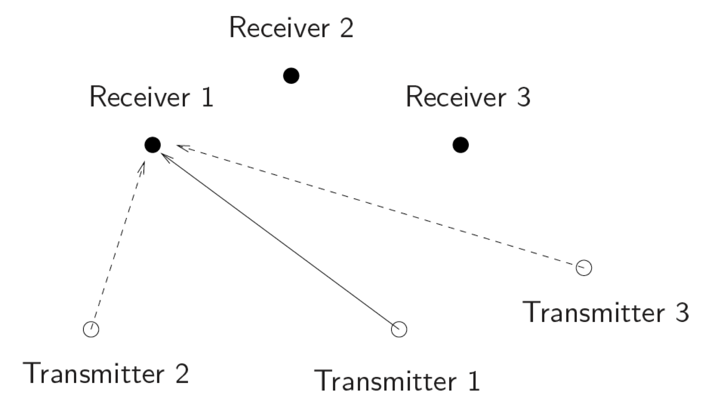
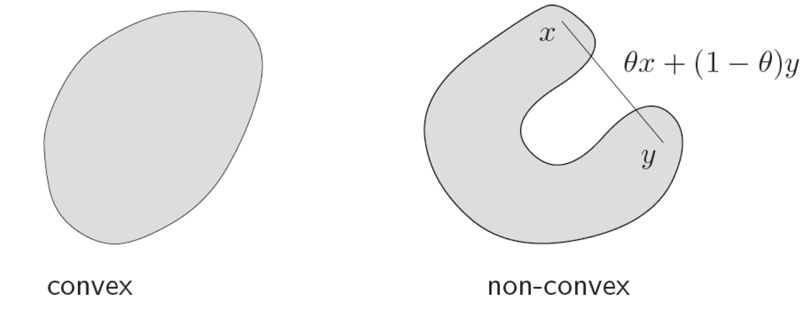
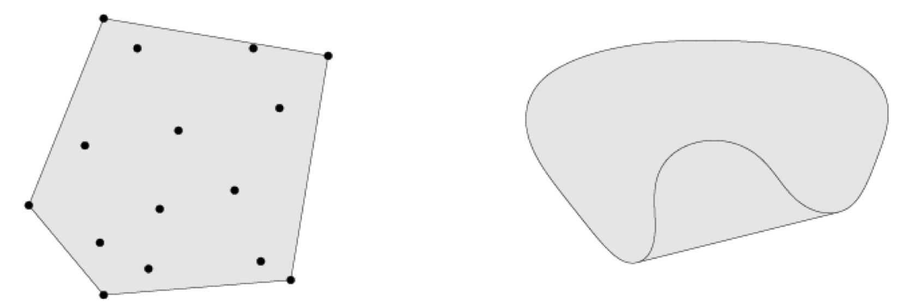
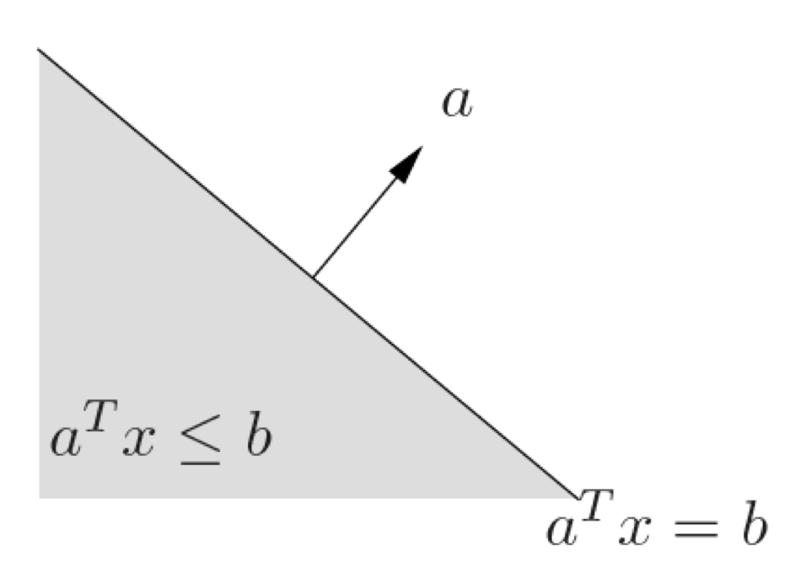
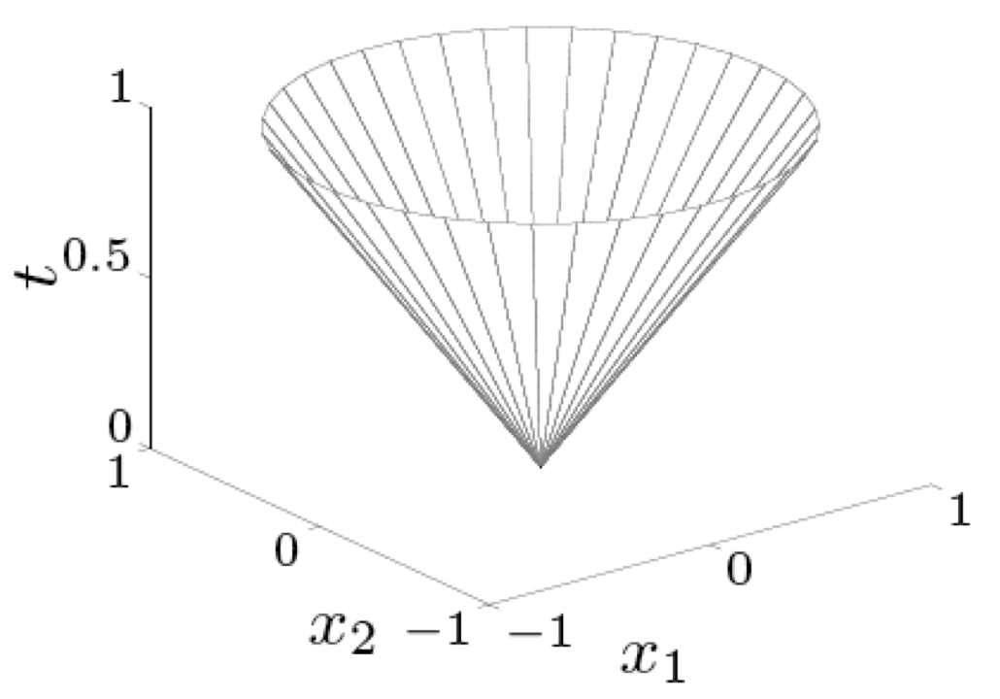
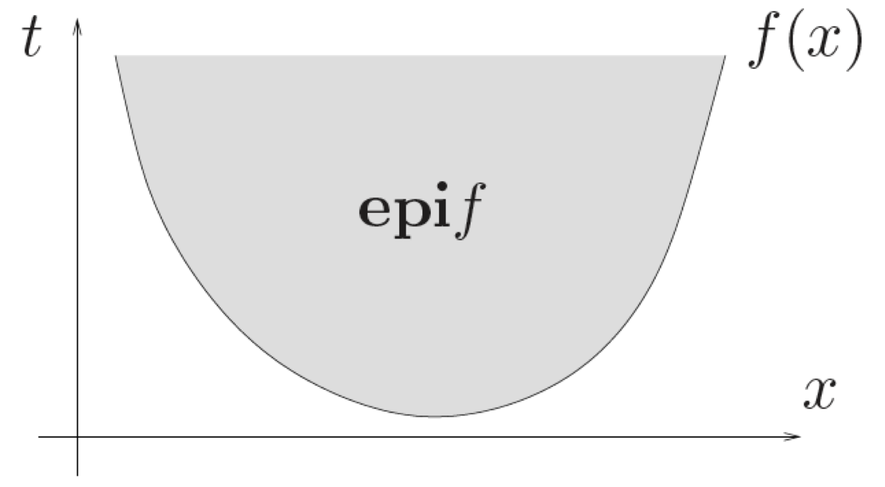
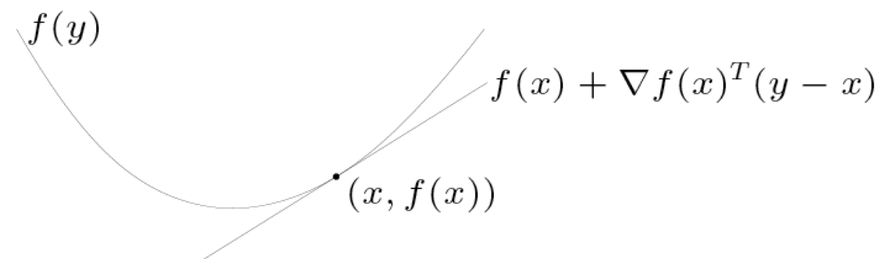
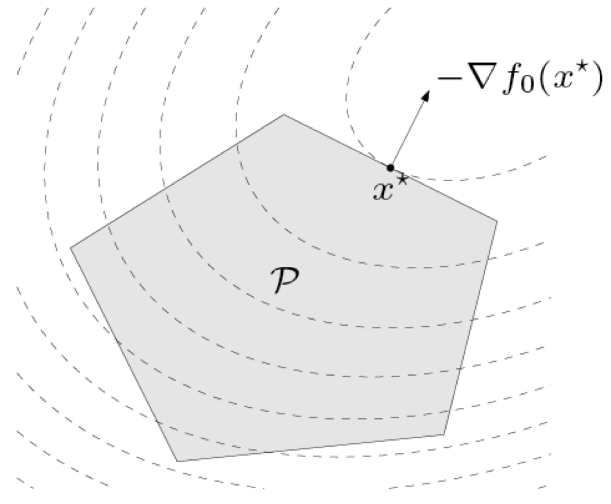

# Convex Optimization Theory {#convex-optimization}

> Mathematics, rightly viewed, possesses not only truth, but supreme beauty -- a beauty cold and austere, like that of sculpture, without appeal to any part of our weaker nature ...
>
> --- Bertrand Russell, _The Study of Mathematics_

<!---
> "A theory with mathematical beauty is more likely to be correct than an ugly one that fits some experimental data."
>
> --- Paul A.M. Dirac

> "The great watershed in optimization isn't between linearity and nonlinearity, but convexity and nonconvexity."
>
> --- R. Tyrrel Rockafellar
--->

\afterquotespace
\acknowledgementCUP

Over the past few decades, numerous fundamental and practical advancements have been made in the field of convex optimization theory. These developments have not only found applications in various fields such as engineering, finance, and machine learning, but they have also stimulated the mathematical progression of both the theory and the development of efficient algorithms. Some notable textbook references in this field include @BoydVandenberghe2004, @LuenbergerYe2021, @Bertsekas1999, @BertsekasNedicOzdaglar2003, @Nemirovski2000, @BentalNemirovski2001, and @Nesterov2018. Two classic references are @Luenberger69 and @Rockafellar70. A range of applications of optimization in engineering can be found in @PalomarEldar2009.

Traditionally, there was a common belief that _linear problems_ are easier to solve compared to _nonlinear problems_. However, as Rockafellar pointed out in a 1993 survey [@Rockafellar93], "the great watershed in optimization isn't between linearity and nonlinearity, but between convexity and nonconvexity." In essence, convex problems can be optimally solved either in closed form -- by applying the optimality conditions derived from Lagrange duality -- or numerically -- using highly efficient algorithms that exhibit polynomial convergence rates [@BoydVandenberghe2004]. Consequently, it is often said that once a problem is formulated as a convex problem, it is essentially solved.

Unfortunately, most practical problems do not exhibit convexity in their initial formulation. However, many of these problems may possess a hidden convexity that practitioners need to uncover to effectively utilize the tools provided by convex optimization theory.

Generally, certain manipulations are necessary to transform a problem into a convex one. The advantage of formulating a problem in convex form is that, even in the absence of a closed-form solution and despite the problem's complexity (which may include hundreds of variables and a nonlinear, nondifferentiable objective function), it can still be solved numerically with high efficiency, both theoretically and practically [@BoydVandenberghe2004]. Another appealing aspect of expressing the problem in a convex form is that additional constraints can be easily incorporated, provided they are convex.

This appendix provides a concise introduction to convex optimization theory, drawing on @BoydVandenberghe2004. For more detailed information, the reader is encouraged to consult this comprehensive source.

  This material has been published as:
  Daniel P. Palomar (2025). _Portfolio Optimization: Theory and Application_. Cambridge University Press.
  This version is free to view and download for personal use only; not for re-distribution, re-sale, or use in derivative works. ©\ Daniel P. Palomar 2025.

## Optimization Problems
\index{optimization}
\index{optimization!optimization problems}
A _mathematical optimization problem_ with arbitrary equality and inequality constraints can always be written in the following standard form [@BoydVandenberghe2004, Chapter\ 1]:
\begin{equation}
  \begin{array}{ll}
  \underset{\bm{x}}{\textm{minimize}} & \begin{array}[t]{l} f_{0}(\bm{x}) \end{array}\\
  \textm{subject to} 
  & \begin{array}[t]{l}
      f_{i}(\bm{x})\leq0,\\
      h_{i}(\bm{x})=0,
    \end{array}
    \quad
    \begin{array}[t]{l}
      i=1,\ldots,m,\\
      i=1,\ldots,p,
    \end{array}
  \end{array}
  (\#eq:general-optimization-problem)
\end{equation}
where $\bm{x} = \left(x_{1},\ldots,x_{n}\right)\in\R^n$ is the _optimization variable_, $f_{0}:\R^n\longrightarrow\R$ is the _objective function_ or cost function, $f_{i}:\R^n\longrightarrow\R,\; i=1,\ldots,m,$ are the $m$ _inequality constraint functions_, and $h_{i}:\R^n\longrightarrow\R,\; i=1,\ldots,p,$ are the $p$ _equality constraint functions_. If there are no constraints, we say that the problem is _unconstrained_.

The goal is to find an optimal solution $\bm{x}^{\star}$ that minimizes $f_{0}$ while satisfying all the constraints.

Convex optimization is currently used in many different areas, including the following:

- circuit design
- filter design
- communication systems (e.g., transceiver design, multi-antenna beamforming design, maximum likelihood detection)
- radar systems
- communication networks (e.g., power control in wireless networks, congestion control on the internet)
- financial engineering (e.g., portfolio design, index tracking)
- model fitting (e.g., in financial data or recommender systems)
- image processing (e.g., deblurring, compressive sensing, blind separation, inpainting)
- robust designs under uncertainty
- sparse regression
- low-rank matrix discovery
- machine learning
- graph learning from data
- biomedical applications (e.g., DNA sequencing, anti-viral vaccine design).

An optimization problem has three basic elements: variables (as opposed to other fixed parameters), constraints, and an objective.

::: {.example name="Device sizing for electronic circuits"}
In the context of electronic circuit design, the elements in a device sizing optimization problem may be chosen as:

- Variables: widths and lengths of devices.
- Constraints: manufacturing limits, timing requirements, or maximum area.
- Objective: power consumption.
:::

::: {.example name="Portfolio design"}
In a financial context, the elements in a portfolio optimization problem may be identified as:

- Variables: amounts invested in different assets.
- Constraints: budget, maximum investments per asset, or minimum return.
- Objective: This could be the overall risk or return variance.
:::

<!---
#### Example: Power control in wireless communication networks {-}

Consider a wireless communication network with $n$ logical transmitter/receiver pairs as illustrated in Figure\ \@ref(fig:wireless-network).

(\#fig:wireless-network)Wireless network with 3 logical transmitter/receiver pairs.

The goal in this case may be to design the power allocation so that each receiver receives minimum interference from the other links and achieves a minimum level of quality as measured with the signal-to-inerference-plus-noise-ratio (SINR). More specifically, the SINR at the $i$th receiver is
$$
\textm{sinr}_{i}=\frac{p_{i}G_{ii}}{\sum_{j\neq i}p_{j}G_{ij}+\sigma_{i}^{2}}
$$
where $p_{i}$ is the power used by the $i$th transmitter, $G_{ij}$ is the channel gain from transmitter $j$ to receiver $i$, and $\sigma_{i}^{2}$ is the noise power at the $i$th receiver.

One possible problem formulation is to maximize the weakest SINR subject to maximum power constraints
$p_{i}\leq p^{\textm{max}}$:
$$
\begin{array}{ll}
\underset{\bm{p}}{\textm{maximize}} & \underset{i=1,\ldots,n}{\textm{min}}\;\frac{p_{i}G_{ii}}{\sum_{j\neq i}p_{j}G_{ij}+\sigma_{i}^{2}}\\
\textm{subject to} & 0\leq p_{i}\leq p^{\textm{max}}\qquad i=1,\ldots,n.
\end{array}
$$
--->

### Definitions

#### Domain and Constraints {-}

The _domain_ of the optimization problem \@ref(eq:general-optimization-problem) is defined as the set of points for which the objective and all constraint functions are defined, that is,
$$
\mathcal{D} = \bigcap_{i=0}^{m}\textm{dom}\,f_{i}\cap\bigcap_{i=1}^{p}\textm{dom} \, h_{i},
$$
and it can be interpreted as a set of implicit constraints $\bm{x} \in \mathcal{D}$, as opposed to the explicit constraints $f_{i}(\bm{x})\leq0$ and $h_{i}(\bm{x})=0$ in \@ref(eq:general-optimization-problem).

A problem is _unconstrained_ if it has no explicit constraints. For example, 
$$
\begin{array}{ll}
\underset{\bm{x}}{\textm{minimize}} & \log\left(a - \bm{b}^\T\bm{x}\right)
\end{array}
$$
is an unconstrained problem with implicit constraint $a > \bm{b}^\T\bm{x}$.

#### Feasibility {-}
A point $\bm{x}\in \mathcal{D}$ is _feasible_ if it satisfies all the constraints, $f_{i}(\bm{x})\leq0$ and $h_{i}(\bm{x})=0$, and _infeasible_ otherwise. The problem \@ref(eq:general-optimization-problem) is said to be _feasible_ if there exists at least one feasible point and _infeasible_ otherwise. 

The _optimal value_ (minimal value) is defined as
$$
p^{\star}=\textm{inf}\left\{f_0(\bm{x}) \mid f_i(\bm{x})\leq0,\,i=1,\ldots,m,\;h_i(\bm{x})=0,\,i=1,\ldots,p\right\}.
$$
If the problem is feasible, then the optimal value may be achieved at an optimal solution $\bm{x}^{\star}$, that is, $f_{0}(\bm{x}^{\star})=p^{\star}$, or the problem may be unbounded below, that is, $p^{\star}=-\infty$. Otherwise, if the problem is infeasible, it is commonly denoted by $p^{\star}=+\infty$.

A feasible point $\bm{x}$ is _optimal_ if $f_0(\bm{x})=p^{\star}$. In general, there may be more than one optimal point and the set of optimal points is denoted by $\mathcal{X}_{\textm{opt}}$. A feasible point $\bm{x}$ is _locally optimal_ if it is optimal within a ball or a local neighborhood.

::: {.example}
We illustrate the concepts of optimal value and optimal solution with a few simple unconstrained optimization problems with scalar variable $x\in\R$:

- $f_{0}\left(x\right)=1/x$, $\textm{dom}\,f_{0}=\R_{++}$: In this case $p^{\star}=0$, but there is no optimal point since the optimal value cannot be achieved.
- $f_0(x)=-\textm{log}\;x$, $\textm{dom}\,f_{0}=\R_{++}$: This function is unbounded below $p^{\star}=-\infty$.
- $f_{0}\left(x\right)=x^{3}-3x$: This is a nonconvex function with $p^{\star}=-\infty$ and a local optimum at $x=1$.
:::

If $\bm{x}$ is feasible and $f_{i}(\bm{x})=0$, we say the $i$th inequality constraint $f_{i}(\bm{x})\le0$ is _active_ at $\bm{x}$. If $f_{i}(\bm{x})<0$, we say the constraint $f_{i}(\bm{x})\le0$ is _inactive_. (The equality constraints are active at all feasible points.) We say that a constraint is _redundant_ if deleting it does not change the feasible set.

#### Feasibility Problem {-}
On many occasions, our goal is not necessarily to minimize or maximize any objective, but simply to find a feasible point. This is referred to as a _feasibility problem_:
$$
\begin{array}{ll}
\underset{\bm{x}}{\textm{find}} & \begin{array}{c}
\bm{x}\end{array}\\
\textm{subject to} & \begin{array}[t]{l}
f_{i}(\bm{x})\leq0,\quad i=1,\ldots,m,\\
h_{i}(\bm{x})=0,\quad i=1,\ldots,p.
\end{array}
\end{array}
$$

In practice, a feasibility problem can be regarded as a special case of a general optimization problem:
$$
\begin{array}{ll}
\underset{\bm{x}}{\textm{minimize}} & \begin{array}{c}
0\end{array}\\
\textm{subject to} & \begin{array}[t]{l}
f_{i}(\bm{x})\leq0,\quad i=1,\ldots,m,\\
h_{i}(\bm{x})=0,\quad i=1,\ldots,p,
\end{array}
\end{array}
$$
where $p^{\star}=0$ if the constraints are feasible and $p^{\star}=\infty$ otherwise.

### Solving Optimization Problems
General optimization problems are typically very difficult to solve, meaning that either a long computation time is required to find an optimal solution or that a sub-optimal solution is found in a reasonable computation time. Some exceptions include the family of least squares problems, linear programming problems, and convex optimization problems. Nevertheless, general nonconvex problems (also known as _nonlinear problems_ with some abuse of terminology) are difficult to solve.

#### Least Squares {-}
Least squares (LS) problems go back to Gauss in 1795 and are formulated as
$$
\begin{array}{ll}
\underset{\bm{x}}{\textm{minimize}} &  \left\Vert \bm{A}\bm{x} - \bm{b}\right\Vert_2^2.
\end{array}
$$
Solving LS problems is straightforward with the closed-form solution $\bm{x}^{\star}=\left(\bm{A}^\T\bm{A}\right)^{-1}\bm{A}^\T\bm{b}$, for which reliable and efficient algorithms exist. Utilizing LS is considered trivial because these problems are easy to identify and solve.

#### Linear Programming {-}
A linear problem (LP) can be written as
$$
\begin{array}{ll}
\underset{\bm{x}}{\textm{minimize}} & \bm{c}^\T\bm{x}\\
\textm{subject to} & \bm{a}_i^\T\bm{x}\leq b_i, \quad i=1,\ldots,m.
\end{array}
$$
LPs do not have closed-form solutions in general, but there are reliable and efficient algorithms and software. An LP is not as easy to recognize as an LS, but one can easily learn a few standard tricks to convert a variety of problems into LPs.

#### Convex Optimization Problems {-}
An inequality-constrained convex problem is of the form
$$
\begin{array}{ll}
\underset{x}{\textm{minimize}} & f_0(\bm{x})\\
\textm{subject to} & f_i(\bm{x})\leq b_i,\quad i=1,\ldots,m,
\end{array}
$$
where all the functions are convex. Convex problems do not have closed-form solutions in general, but there are reliable and efficient algorithms and software. They are often difficult to recognize and there are many tricks for transforming problems into convex form.

#### Nonconvex Optimization {-}
Nonconvex optimization problems are generally very difficult to solve, although there are some rare exceptions.
In general, they require either a long computation time[^computation-time] or the compromise of not always finding the optimal solution. This results in two strategies:

- _Local optimization_: This involves fast algorithms, but there's no guarantee of global optimality. It only provides a local solution around the initial point.

- _Global optimization_: While the worst-case complexity increases exponentially with the problem size, this strategy ensures the discovery of a global solution.

[^computation-time]: The computational complexity of an algorithm is measured in the number of operations required to obtain a solution (computation time is measured in time units). This complexity is presented as a function of the number of variables $n$ to optimize, so the important thing is how this complexity grows with $n$. Typically, polynomial complexity is considered acceptable in practice (of course the order of the polynomial is also important), whereas exponential complexity is considered not acceptable in practice as the complexity quickly explodes.

#### Historical Snapshop of Optimization {-}
The theory of optimization, termed convex analysis, was extensively developed in the past period 1900--1970. However, the computational aspect, that is, efficient algorithms, and applications came later.

The first computationally efficient method was the seminal _simplex method_ developed in 1947 for LPs by Dantzig. It represents the beginning of an era of algorithmic development. However, despite the simplex method being very efficient in practice, it has a theoretical exponential worst-case complexity. In the 1970s, the ellipsoid method was proposed with a provable polynomial worst-case complexity, although it could be very slow in practice. Later, in 1984, Karmakar proposed a polynomial-time interior-point method for LPs that was not only good in theory but also in practice [@Karmarkar1984]. This development was followed by numerous researchers extending the application of interior-point methods to quadratic programming and linear complementarity problems. In 1994, Nesterov and Nemirovskii further advanced the field by developing the theory of self-concordant functions. This theory facilitated the expansion of algorithms based on the log-barrier function to a wider array of convex problems, notably including semidefinite programming and second-order cone programming [@NesterovNemirovskii1994].

In terms of practical applications, following the development of the simplex method, linear programming has been widely used to model a variety of real-life problems, such as allocation issues, since the 1950s. However, during that period there was little interest in modeling real-life problems as convex problems. It was only after the mid-1990s, with the development of interior-point methods for convex problems, that there was a surge in activity related to modeling applications as convex problems.

### Illustrative Example
The following lamp illumination problem is a well-known example that illustrates how an engineering problem can be formulated in different ways, leading to more or less sophisticated solutions.

Suppose we have $m$ lamps illuminating $n$ small flat patches, located in fixed locations.<!--- as illustrated in Figure\ \@ref(fig:lamp-problem).

(\#fig:lamp-problem)Lamp illumination problem. [to be redrawn]

--->
The overall goal is to achieve a desired illumination $I_{\textm{des}}$ on all patches by controlling the power of the lamps. The intensity $I_{k}$ at patch $k$ depends linearly on the lamp powers $p_{j}$ as
$$
I_{k} = \sum_{j=1}^{m}a_{kj}p_{j},
$$
where the coefficients $a_{kj}$ are given by $a_{kj}=\cos\theta_{kj}/r_{kj}^{2}$, with $\theta_{kj}$ and $r_{kj}$ denoting the angle and distance, respectively, between lamp $j$ and patch $k$.

Ideally, we would like to achieve perfect illumination, $I_{k} = I_{\textm{des}}$, for all the patches, but this is not feasible in practice, and we need to relax the problem to $I_{k} \approx I_{\textm{des}}$.

There are many different ways to formulate this problem. The main idea is to somehow measure the error in the approximation for each patch, $I_{k} - I_{\textm{des}}$. One possible formulation is based on minimizing the largest of the errors measured in a logarithmic scale (because the eyes perceive intensity on a log-scale):
$$
\begin{array}{cl}
\underset{I_{1},\ldots,I_{n},p_{1},\ldots,p_{m}}{\textm{minimize}} & \begin{array}{c}
\textm{max}_{k}\left|\textm{log} I_{k} - \textm{log} I_{\textm{des}}\right|\end{array}\\
\textm{subject to} & 
    \begin{array}[t]{l}
      0\leq p_{j}\leq p_{\max},\\
      I_{k}=\sum_{j=1}^{m}a_{kj}p_{j},
    \end{array}
    \quad
    \begin{array}[t]{l}
      j=1,\ldots,m,\\
      k=1,\ldots,n.
    \end{array}
\end{array}
$$
This problem appears complex, and we will explore various possible approaches to address it.

1. If one does not know anything about optimization, then a heuristic guess can be made, such as using a uniform power $p_{j}=p$, perhaps trying different values of $p$.

2. If one knows about least squares, then the problem formulation could be changed to resemble an LS:
$$
\begin{array}{cl}
\underset{I_{1},\ldots,I_{n},p_{1},\ldots,p_{m}}{\textm{minimize}} & \begin{array}{c}
\sum_{k=1}^{n}\left(I_{k}-I_{\mathsf{des}}\right)^{2}\end{array}\\
\textm{subject to} & \begin{array}[t]{l}
I_{k}=\sum_{j=1}^{m}a_{kj}p_{j},\quad k=1,\ldots,n,
\end{array}
\end{array}
$$
and then clip $p_{j}$ if $p_{j}>p_{\max}$ or $p_{j}<0$ to make it feasible.

3. If one knows about linear programming, then the problem could be changed to resemble an LP (basically by removing the logarithmic function):
$$
\begin{array}{cl}
\underset{I_{1},\ldots,I_{n},p_{1},\ldots,p_{m}}{\textm{minimize}} & \begin{array}{c}
\textm{max}_{k}\left|I_{k} - I_{\textm{des}}\right|\end{array}\\
\textm{subject to} & 
    \begin{array}[t]{l}
      0\leq p_{j}\leq p_{\max},\\
      I_{k}=\sum_{j=1}^{m}a_{kj}p_{j},
    \end{array}
    \quad
    \begin{array}[t]{l}
      j=1,\ldots,m,\\
      k=1,\ldots,n,
    \end{array}
\end{array}
$$
which may not look like an LP at first sight, but it is in disguise (as revealed after a few simple manipulations).

4. If one knows about convex optimization, then it turns out that after some smart manipulations, the problem can be equivalently reformulated in convex form as
$$
\begin{array}[t]{cl}
\underset{I_{1},\ldots,I_{n},p_{1},\ldots,p_{m}}{\textm{minimize}} & \begin{array}{c}
\textm{max}_{k}\;h\left(I_{k}/I_{\textm{des}}\right)\end{array}\\
\textm{subject to} & 
    \begin{array}[t]{l}
      0\leq p_{j}\leq p_{\max},\\
      I_{k}=\sum_{j=1}^{m}a_{kj}p_{j},
    \end{array}
    \quad
    \begin{array}[t]{l}
      j=1,\ldots,m,\\
      k=1,\ldots,n,
    \end{array}
\end{array}
$$
where $h\left(u\right) = \textm{max}\left\{ u,1/u\right\}$.

At this point, one can go further and ask whether additional constraints can be added. For example, the constraint "no more than half of total power is in any 10 lamps" looks complicated, but it can actually be written in convex form, so computationally keeps the problem solvable. On the other hand, the constraint "no more than half of the lamps are on" may look simple, but instead is a deadly combinatorial constraint that makes the complexity of its resolution exponential. The moral is that untrained intuition does not always work; one needs to obtain the proper background and develop the right intuition to discern between difficult and easy problems.

## Convex Sets {#convex-sets}
\index{optimization!convex sets}
We now provide a concise introduction to convex sets. For more detailed information, the reader is referred to Chapter\ 2 in @BoydVandenberghe2004.

### Definitions
We start with some basic definitions. The equation describing a line passing through two points $\bm{x},\bm{y} \in \R^n$ is $\theta \bm{x}+(1-\theta)\bm{y}$, where $\theta \in \R$. If $\theta$ is constrained to be between 0 and 1, then $\theta \bm{x}+(1-\theta)\bm{y}$ describes the _line segment_ between $\bm{x}$ and $\bm{y}$.

::: {.definition name="Convex set"}
A set $\mathcal{C}\in\R^n$ is _convex_ if the line segment between any two points in $\mathcal{C}$ lies in $\mathcal{C}$, that is, if for any $\bm{x},\bm{y} \in \mathcal{C}$ and $\theta$ with $0\leq\theta\leq1$, we have
\begin{equation}
  \theta \bm{x}+\left(1-\theta\right)\bm{y} \in \mathcal{C}.
  (\#eq:def-convex-set)
\end{equation}
:::
<!---
Figure\ \@ref(fig:convex-set) illustrates convex and nonconvex sets.

(\#fig:convex-set)Convex and nonconvex sets. [to be redrawn]

--->

A _convex combination_ of the points $\bm{x}_{1},\dots,\bm{x}_{k}$ is of the form $\theta_{1}\bm{x}_1+\theta_{2}\bm{x}_2+\cdots+\theta_{k}\bm{x}_k$, where $\theta_{1}+\cdots+\theta_{k}=1$ and $\theta_{i}\geq0,\,i=1,\dots,k.$ It can be shown that a set is convex if and only if it contains every convex combination of its points.

The _convex hull_ of a set $\mathcal{C}$ is the set of all convex combinations of points in $\mathcal{C}$<!--- as illustrated in Figure\ \@ref(fig:convex-hull)--->. As the name suggests, the convex hull of $\mathcal{C}$ is always convex. In fact, it is the smallest convex set that contains $\mathcal{C}$.
<!---

(\#fig:convex-hull)Convex hulls of two nonconvex sets. [to be redrawn]

--->

A set $\mathcal{C}$ is called a _cone_ if for every $\bm{x} \in \mathcal{C}$ and $\theta \ge 0$ we have $\theta \bm{x} \in \mathcal{C}$. A set $\mathcal{C}$ is a _convex cone_ if it is convex and a cone, that is, for any $\bm{x}_1,\bm{x}_2 \in \mathcal{C}$ and $\theta_1,\theta_2 \ge 0$, we have 
$$
\theta_1 \bm{x}_1+\theta_2\bm{x}_2 \in \mathcal{C}.
$$
<!---as illustrated in Figure\ \@ref(fig:convex-cone).

(\#fig:convex-cone)Convex cone defined by the conic hull (set of conic combinations) of points $x_1$ and $x_2$. [to be redrawn]

--->

### Elementary Convex Sets

We describe next some important simple examples of convex sets.

#### Hyperplanes and Halfspaces {-}
A _hyperplane_ is a set of the form
$$
\left\{\bm{x} \mid \bm{a}^\T\bm{x} = b \right\},
$$
where $\bm{a}\in\R^n,\,b\in\R$. Geometrically, it can be interpreted as the set of points orthogonal to the vector $\bm{a}$ with an offset by rewriting it as $\left\{ \bm{x} \mid \bm{a}^\T(\bm{x} - \bm{x}_0) = 0 \right\}$.

A hyperplane divides the space $\R^n$ into two halfspaces. A (closed) _halfspace_ is a set of the form
$$
\left\{ \bm{x} \mid \bm{a}^\T\bm{x}\leq b\right\}.
$$
<!---as illustrated in Figure\ \@ref(fig:halfspace).

(\#fig:halfspace)Halfspace determined by a hyperplane. [to be redrawn]

--->
 
 
#### Polyhedra {-}
A _polyhedron_ is defined as the solution set of a finite number of linear equalities and inequalities:
$$
\mathcal{P} = \left\{\bm{x} \mid \bm{A}\bm{x} \leq \bm{b},\, \bm{C}\bm{x} = \bm{d}\right\},
$$
where $A\in\R^{m\times n},\,C\in\R^{p\times n},\,b\in\R^{m},\,d\in\R^{p}$.
<!---, as illustrated in Figure\ \@ref(fig:polyhedron).

(\#fig:polyhedron)Polyhedron as intersection of halfspaces. [to be redrawn]

--->

Two important examples of polyhedra are the _unit simplex_, defined as
$$
\left\{ \bm{x} \mid \bm{x}\ge\bm{0},\bm{1}^\T \bm{x} \le 1\right\},
$$
and the _probability simplex_, defined as
$$
\left\{ \bm{x} \mid \bm{x}\ge\bm{0},\bm{1}^\T \bm{x} = 1\right\}.
$$

#### Balls and Ellipsoids {-}
A _Euclidean ball_ (or just a ball) with center $\bm{x}_\textm{c}$ and radius $r$ has the form
$$
\mathcal{B}(\bm{x}_\textm{c},r) = \left\{\bm{x} \mid \left\Vert \bm{x} - \bm{x}_\textm{c}\right\Vert_2 \leq r\right\} = \left\{\bm{x} \mid (\bm{x} - \bm{x}_\textm{c})^\T (\bm{x} - \bm{x}_\textm{c})\leq r^2\right\},
$$
where $\left\Vert \cdot \right\Vert_2$ denotes the Euclidean norm or $\ell_2$-norm. Another common representation for the Euclidean ball is 
$$
\mathcal{B}(\bm{x}_\textm{c},r) = \left\{\bm{x}_\textm{c} +r\bm{u} \mid \left\Vert \bm{u}\right\Vert _{2}\leq1\right\}.
$$

A set related to a ball is an _ellipsoid_, defined as
$$
\begin{aligned}
\mathcal{E}(\bm{x}_\textm{c},\bm{P}) = & \left\{\bm{x} \mid (\bm{x} - \bm{x}_\textm{c})^\T\bm{P}^{-1}(\bm{x} - \bm{x}_\textm{c})\leq1\right\} \\
= & \left\{\bm{x}_\textm{c} + \bm{A}\bm{u} \mid \left\Vert \bm{u}\right\Vert _{2}\leq1\right\},
\end{aligned}
$$
with $\bm{P} = \bm{P}^\T \in\R^{n\times n}\succ \bm{0}$, that is, $\bm{P}$ is symmetric and positive definite, and $\bm{A}$ is the square-root matrix $\bm{P}^{1/2}$ satisfying $\bm{A}^\T \bm{A} = \bm{P}$. The matrix $\bm{P}$ (or $\bm{A}$) determines how far the ellipsoid extends in every direction from the center $\bm{x}_\textm{c}$. A ball is an ellipsoid with the particular choice $\bm{P} = r^2I$.
<!---Figure\ \@ref(fig:ellipsoid) shows an ellipsoid in $\R^2$.

(\#fig:ellipsoid)Ellipsoid. [to be redrawn]

--->

#### Norm Balls and Norm Cones {-}
Suppose $\left\Vert \cdot \right\Vert$ is any norm on $\R^n$ (not necessarily the Euclidean norm). A _norm ball_ with center $\bm{x}_\textm{c}$ and radius $r$ is defined as
$$
\mathcal{B}(\bm{x}_\textm{c},r) = \left\{\bm{x} \mid \left\Vert \bm{x} - \bm{x}_\textm{c}\right\Vert \leq r\right\}.
$$

A _norm cone_ $\mathcal{C}\subseteq\R^{n+1}$ is defined as the convex set
$$
\mathcal{C} = \left\{(\bm{x},t) \in \R^{n+1} \mid \left\Vert \bm{x}\right\Vert \leq t\right\}.
$$

One particular case of interest is the _second-order cone_ (a.k.a. _ice-cream cone_):
$$
\mathcal{C} = \left\{(\bm{x},t) \in \R^{n+1} \mid \left\Vert\bm{x}\right\Vert_2 \leq t\right\},
$$
where the norm is the Euclidean norm $\left\Vert \cdot \right\Vert_2$.

<!---, as illustrated in Figure\ \@ref(fig:icecream-cone).

(\#fig:icecream-cone)Second-order cone (aka ice-cream cone). [to be redrawn]

--->

#### Positive Semidefinite Cone {-}
<!---
Let  $\mathbb{S}^n$ denote the set of symmetric  $n\times n$ matrices $\mathbb{S}^{n}=\left\{ X\in\R^{n\times n}\mid X=X^\T \right\}$. 
--->
The set of symmetric positive semidefinite matrices
$$
\mathbb{S}_{+}^{n}=\left\{\bm{X}\in\R^{n\times n} \mid \bm{X}=\bm{X}^\T\succeq\bm{0}\right\}
$$
is a convex cone.

### Operations that Preserve Convexity

To establish that a set is convex, one can directly use the definition of convexity in \@ref(eq:def-convex-set). However, it can be cumbersome to prove that for any two points in the set the line segment is also contained in the set. A more interesting way to establish convexity in most practical cases is by showing that the set can be obtained from simple convex sets (e.g., hyperplanes, hyperspaces, balls, ellipsoids, cones) by operations that preserve convexity of sets, that is, a calculus of convex sets.

Some simple operations that preserve convexity of sets include: intersection of sets, composition with affine functions, and the perspective function.

#### Intersection {-}
Convexity is preserved under intersection: if $\mathcal{S}_1$ and $\mathcal{S}_2$ are convex, then $\mathcal{S}_1 \cap \mathcal{S}_1$ is convex. This property extends to the case of intersection of multiple sets (even an infinite number of sets).

One trivial example is a polyhedron, which is the intersection of halfspaces and hyperplanes and therefore convex.

A more sophisticated example is the set
$$
\mathcal{S}=\left\{\bm{x}\in\R^{n} \mid \left|p_{\bm{x}}\left(t\right)\right|\leq1\textm{ for }\left|t\right|\leq\pi/3\right\},
$$
where $p_{\bm{x}}(t) = x_{1}\textm{cos}(t) + x_{2}\textm{cos}(2t) + \cdots + x_{n}\textm{cos}(nt)$. Note that this set is an intersection of an infinite number of sets indexed by $t$.

#### Affine Composition {-}
A function is _affine_ if it has the form $f(\bm{x}) = \bm{A}\bm{x} + \bm{b}$, where $\bm{A}\in\R^{m\times n}$ and $\bm{b}\in\R^{m}$, that is, the sum of a linear function and a constant.

Suppose $\mathcal{S}\subseteq\R^n$ is a convex set and $f:\R^n\longrightarrow\R$ is an affine function. Then the image of $\mathcal{S}$ under $f$,
$$
f\left(\mathcal{S}\right)=\left\{f(\bm{x}) \mid \bm{x} \in \mathcal{S}\right\},
$$
is convex.

Two trivial examples are _scaling_ and _translation_. Another simple example is the _projection_ of a convex set onto some of its coordinates: if $\mathcal{S}\subseteq \R^m \times \R^n$ is convex, then
$$
\left\{ \bm{x}_1 \in \R^m \mid (\bm{x}_1, \bm{x}_2) \in \mathcal{S}\textm{ for some }\bm{x}_2\in\R^n \right\}
$$
is convex.

A useful example is the affine composition of the norm cone $\left\{(\bm{x},t) \in \R^{n+1} \mid \left\Vert \bm{x}\right\Vert \leq t\right\}$:
$$
\left\{\bm{x}\in\R^{n} \mid \left\Vert\bm{A}\bm{x} + \bm{b}\right\Vert \leq \bm{c}^\T\bm{x} + d\right\}.
$$

#### Perspective Function {-}
The perspective function scales or normalizes vectors so the last component is one, and then drops the last component. 

Mathematically, we define the perspective function $P:\R^{n+1}\longrightarrow\R^{n}$, with domain $\textm{dom}\,P=\R^n \times \R_{++}$, as
$P(\bm{x},t)=\bm{x}/t.$

Images and inverse images of convex sets under perspective functions are convex.

<!---
- **Linear-fractional function**: $f:\bm{R}^{n}\longrightarrow\bm{R}^{m}$:
$$
f\left(x\right)=\frac{Ax+b}{c^{T}x+d},\qquad\bm{dom}\;P=\left\{ x\mid c^{T}x+d>0\right\} .
$$

    + Images and inverse images of convex sets under linear-fractional functions are convex.
--->

<!---
Generalized Inequalities

- A convex cone $K\subseteq\bm{R}^{n}$ is a _proper cone_ if it is closed, solid, and pointed.

- Examples:

    + nonnegative orthant: 
$$
K=\bm{R}_{+}^{n}=\left\{ x\in\bm{R}^{n}\mid x_{i}\geq0,\;i=1,\ldots,n\right\} 
$$

    + positive semidefinite cone: 
$$
K=\bm{S}_{+}^{n}=\left\{ X\in\bm{R}^{n\times n}\mid X=X^{T}\succeq0\right\} 
$$

    + nonnegative polynomials on $\left[0,1\right]$: 
$$
K=\left\{ x\in\bm{R}^{n}\mid x_{1}+x_{2}t+x_{3}t^{2}+\cdots x_{n}t^{n-1}\geq0\textm{ for }t\in\left[0,1\right]\right\}.
$$

- A _generalized inequality_ is defined by a proper cone $K$:
$$
y\succeq_{K}x\Longleftrightarrow y-x\succeq_{K}0\textm{ or }y-x\in K.
$$

- Examples:

    + componentwise inequality ($K=\bm{R}_{+}^{n}$):
$$
y\succeq_{\bm{R}_{+}^{n}}x\Longleftrightarrow y_{i}\geq x_{i},\;i=1,\ldots,n
$$

    + matrix inequality ($K=\bm{S}_{+}^{n}$):
$$
Y\succeq_{\bm{S}_{+}^{n}}X\Longleftrightarrow Y-X\;\textm{is positive semidefinite}.
$$
--->

## Convex Functions {#convex-functions}
\index{optimization!convex functions}
We now provide a concise overview of convex functions. For more detailed information, the reader is referred to Chapter 3 in @BoydVandenberghe2004.

::: {.definition name="Convex function"}
A function $f:\R^{n}\rightarrow\R$ is _convex_ if the domain, $\textm{dom}\,f$, is a convex set and if for all $\bm{x},\bm{y}\in\textm{dom}\,f$ and $0\leq\theta\leq1$, we have
\begin{equation}
  f(\theta \bm{x} + (1-\theta)\bm{y})\leq\theta f(\bm{x}) + (1-\theta)f(\bm{y}).
  (\#eq:def-convex-function)
\end{equation}
:::

Geometrically, this inequality means that the line segment between $(\bm{x},f(\bm{x}))$ and $(\bm{y},f(\bm{y})),$ which is the _chord_ from $\bm{x}$ to $\bm{y}$, lies above the graph of $f$.<!--- as illustrated in Figure\ \@ref(fig:convex-function).

(\#fig:convex-function)Convex function. [to be redrawn]

--->

A function $f$ is _strictly convex_ if strict inequality holds in \@ref(eq:def-convex-function) whenever $\bm{x} \neq \bm{y}$ and $0 < \theta < 1$. We say $f$ is _concave_ if $-f$ is convex, and _strictly concave_ if $-f$ is strictly convex.

For an affine function we always have equality in \@ref(eq:def-convex-function), so all affine (and therefore also linear) functions are both convex and concave. Conversely, any function that is convex and concave is affine.

### Elementary Convex and Concave Functions
Apart from linear and affine functions, which are both convex and concave, it is good to become familiar with some elementary examples.

Let us start with some basic examples on $\R$:

- _exponential_: $e^{ax}$ is convex on $\R$ for any $a\in\R$;
- _powers_: $x^a$ is convex on $\R_{++}$ when $a\geq1$ or $a\leq0$ (e.g., $x^2$), and concave for $0\le a\le1$;
- _powers of absolute value_: $\left|x\right|^{p}$ is convex on $\R$ for $p\geq1$ (e.g., $\left|x\right|$);
- _logarithm_: $\textm{log}\;x$ is concave on $\R_{++}$;
- _negative entropy_: $x\,\textm{log}\;x$ is convex on $\R_{++}$.

Now, some interesting examples on $\R^n$:

- _quadratic function_: $f(\bm{x}) = \bm{x}^\T\bm{P}\bm{x} + 2\bm{q}^\T\bm{x} + r$ is convex on $\R^n$ if and only if $\bm{P}\succeq\bm{0}$;
- _norms_: every norm $\left\Vert\bm{x}\right\Vert$ is convex on $\R^{n}$ (e.g., $\left\Vert\bm{x}\right\Vert_{\infty}$, $\left\Vert\bm{x}\right\Vert_{1}$, and $\left\Vert\bm{x}\right\Vert_{2}$);
- _max function_: $f(x) = \textm{max}\{x_1, \dots, x_n\}$ is convex on $\R^n$;
- _quadratic over linear function_: $f(x,y)=x^{2}/y$ is convex on $\R\times\R_{++}$;
- _geometric mean_: $f(\bm{x})=\left(\prod_{i=1}^{n}x_{i}\right)^{1/n}$ is concave on $\R_{++}^{n}$;
- _log-sum-exp function_: $f(\bm{x})=\textm{log}\left(e^{x_1}+\dots+e^{x_n}\right)$ is convex on $\R^n$ (it can be used to approximate the function $f(\bm{x}) = \textm{max}\{x_1, \dots, x_n\}$).

Finally, some examples on $\R^{n\times n}$:

- _log-determinant_: the function $f(\bm{X})=\textm{log\,det}(\bm{X})$ is concave on $\mathbb{S}_{++}^{n}=\left\{\bm{X}\in\R^{n\times n} \mid \bm{X}\succ\bm{0}\right\}$;
- _maximum eigenvalue_: the function
$$
f(\bm{X}) = \lambda_{\textm{max}}(\bm{X}) \triangleq \underset{\bm{y}\neq\bm{0}}{\textm{sup}}\,\frac{\bm{y}^\T\bm{X}\bm{y}}{\bm{y}^\T\bm{y}}
$$
is convex on $\mathbb{S}^n$.

### Epigraph
So far, we have used the adjective "convex" to describe both sets and functions, even though it refers to two distinct properties. Interestingly, these two can be linked, as we will demonstrate next.

The _graph_ of a function $f:\R^{n}\rightarrow\R$ is defined as the set
$$
\left\{(\bm{x},f(\bm{x}))\in\R^{n+1} \mid \bm{x} \in \textm{dom}\,f\right\},
$$
which is a subset of $\R^{n+1}$.

The _epigraph_ of a function $f:\R^{n}\rightarrow\R$ is defined as the set
\begin{equation}
  \textm{epi}\,f=\left\{(\bm{x},t)\in\R^{n+1} \mid \bm{x}\in\textm{dom}\,f,\,f(\bm{x})\leq t\right\}.
  (\#eq:epigraph)
\end{equation}
One way to conceptualize the epigraph is to envision pouring a bucket of water over the function and filling it up indefinitely.

The link between convex sets and convex functions is precisely via the epigraph: A function is convex if and only if its epigraph is a convex set,
$$
f\;\textm{is convex}\quad\Longleftrightarrow\quad\textm{epi}\,f\;\textm{is convex}.
$$
<!---as illustrated in Figure\ \@ref(fig:convexity-via-epigraph).

(\#fig:convexity-via-epigraph)Convexity of function equivalent to convexity of epigraph. [to be redrawn]

--->

### Characterization of Convex Functions

Apart from the definition of convexity, there are several ways to characterize convex functions such as restriction to a line, first-order condition, and second-order conditions.

#### Restriction of a Convex Function to a Line {-}
A function is convex if and only if it is convex when restricted to any line that intersects its domain. In other words, $f:\R^{n}\rightarrow\R$ is convex if and only if the function $g:\R\rightarrow\R$ defined as 
$$
g(t) = f(\bm{x} + t\bm{v})
$$ 
is convex on its domain $\textm{dom}\,g = \{t \mid \bm{x} + t\bm{v} \in\textm{dom}\,f\}$, for any $\bm{x} \in\textm{dom}\,f$ and $\bm{v}\in\R^n$. 

This property is very useful, since it allows us to check whether a function is convex by restricting it to a line, which is much easier (and can even be plotted in an exploratory analysis).

For example, the proof of the concavity of the log-determinant function $f(\bm{X})=\textm{log\,det}(\bm{X})$ can be reduced to the concavity of the log function:
$$
\begin{aligned}
g(t)=\textm{log\,det}(\bm{X}+t\bm{X}) & = \textm{log\,det}(\bm{X}) + \textm{log\,det}\left(\bm{I} + t\bm{X}^{-1/2}\bm{V}\bm{X}^{-1/2}\right)\\
 & = \textm{log\,det}(\bm{X}) + \sum_{i=1}^{n}\textm{log}(1 + t\lambda_i),
\end{aligned}
$$
where the $\lambda_{i}$ are the eigenvalues of $\bm{X}^{-1/2}\bm{V}\bm{X}^{-1/2}$.

#### First-Order Condition {-}
For a differentiable function $f$, the gradient
$$
\nabla f(\bm{x})=\begin{bmatrix}
\frac{\partial f(\bm{x})}{\partial x_{1}} & \cdots & \frac{\partial f(\bm{x})}{\partial x_{n}}\end{bmatrix}^\T\in\R^n
$$
exists at each point in $\textm{dom}\,f$, which is open. We can use it to write the first-order Taylor approximation of $f$ near $\bm{x}$:
$$
f(\bm{y}) \approx f(\bm{x}) + \nabla f(\bm{x})^\T(\bm{y} - \bm{x}).
$$

Suppose $f$ is differentiable. Then $f$ is convex if and only if $\textm{dom}\,f$ is convex and 
\begin{equation}
  f(\bm{y}) \geq f(\bm{x}) + \nabla f(\bm{x})^\T(\bm{y} - \bm{x})
  (\#eq:first-order-condition)
\end{equation}
holds for all $\bm{x},\bm{y}\in\textm{dom}\,f$. <!---, as illustrated in Figure\ \@ref(fig:first-order-condition).

(\#fig:first-order-condition)First-order condition for convex function. [to be redrawn]

--->

Geometrically, the inequality \@ref(eq:first-order-condition) states that for a convex function, the first-order Taylor approximation is in fact a _global underestimator_ of the function. Conversely, if the first-order Taylor approximation of a function is always a global underestimator of the function, then the function is convex.

The inequality \@ref(eq:first-order-condition) shows that from local information about a convex function (i.e., its value and derivative at a point) we can derive global information (i.e., a global underestimator of it). This is a remarkable property of convex functions and it justifies the connection between local optimality and global optimality in convex optimization problems.

#### Second-Order Condition {-}
For a twice-differentiable function $f$, the Hessian
$$
\nabla^{2}f(\bm{x}) = \left(\frac{\partial^{2}f(\bm{x})}{\partial x_{i}\partial x_{j}}\right)_{ij}\in\R^{n\times n}
$$
exists at each point in $\textm{dom}\,f$, which is open. The Hessian can be used to write the second-order Taylor approximation of $f$ near $\bm{x}$:
$$
f(\bm{y}) \approx f(\bm{x}) + \nabla f(\bm{x})^\T(\bm{y} - \bm{x}) + \frac{1}{2}(\bm{y} - \bm{x})^\T\nabla^{2}f(\bm{x})(\bm{y} - \bm{x}).
$$

Suppose $f$ is twice differentiable. Then $f$ is convex if and only if $\textm{dom}\,f$ is convex and its Hessian is positive semidefinite:
$$
\nabla^{2}f(\bm{x})\succeq\bm{0}
$$
for all $\bm{x}\in\textm{dom}\,f$.

For a function on $\R$, this reduces to the simple condition $f''(x) \ge 0$ (and $\textm{dom}\,f$ convex, i.e., an interval), which means that the derivative is nondecreasing. The condition $\nabla^{2}f(\bm{x})\succeq\bm{0}$ can be interpreted geometrically as the requirement that the graph of the function has positive (upward) curvature at $\bm{x}$.

Similarly, $f$ is concave if and only if $\textm{dom}\,f$ is convex and $\nabla^{2}f(\bm{x})\preceq\bm{0}$ for all $\bm{x}\in\textm{dom}\,f$.

### Operations that Preserve Convexity
Thus far, we have explored four different methods to characterize the convexity of a function: applying the definition directly, restricting the function to a line, using the first-order condition, and employing the second-order condition. However, in most practical scenarios, a more intriguing approach to establish convexity is to demonstrate that the function can be derived from basic convex or concave functions (such as exponentials, powers, and norms) through operations that preserve the convexity of functions. This approach is essentially a calculus of convex functions.

Some simple operations that preserve convexity of functions include: nonnegative weighted sum, composition with affine functions, pointwise maximum, pointwise supremum, certain compositions with nonaffine functions, partial minimization, and perspective.

#### Nonnegative Weighted Sum {-}
If $f_1$ and $f_2$ are both convex functions, then so is their sum $f_1 + f_2$. Also, scaling a function $f$ with a nonnegative number $\alpha\ge0$ preserves convexity. Combining nonnegative scaling and addition, we get that a nonnegative weighted sum of convex functions, with weights $w_1,\dots,w_m\ge0$,
$$
f = w_1 f_1 + \dots + w_m f_m,
$$
is convex.

#### Composition with an Affine Mapping {-}
Suppose $h:\R^m\rightarrow\R$, $\bm{A}\in\R^{m\times n}$, and $\bm{b}\in\R^m$. Define  $f:\R^n\rightarrow\R$ as the composition of $f$ with the affine mapping $\bm{A}\bm{x} + \bm{b}$:
$$
f(\bm{x}) = h(\bm{A}\bm{x} + \bm{b}),
$$
with $\textm{dom}\,f=\left\{\bm{x} \mid \bm{A}\bm{x} + \bm{b} \in \textm{dom}\,h \right\}$. Then, if $f$ is convex, so is $g$; if $f$ is concave, so is $g$.

For example, $f(\bm{x}) = \left\Vert \bm{y} - \bm{A}\bm{x}\right\Vert$ is convex and $f(\bm{X}) = \textm{log\,det}\left(\bm{I} + \bm{H}\bm{X}\bm{H}^\T\right)$ is concave.

#### Pointwise Maximum and Supremum {-}
If $f_1$ and $f_2$ are convex functions, then their pointwise maximum $f$, defined as
$$
f(\bm{x}) = \textm{max}\left\{f_1(\bm{x}), f_2(\bm{x})\right\},
$$
with $\textm{dom}\,f = \textm{dom}\,f_1 \cap \textm{dom}\,f_2$, is also convex. This property extends to more than two functions. If $f_1, \dots, f_m$ are convex, then their pointwise maximum
$$
f(\bm{x}) = \textm{max}\left\{f_1(\bm{x}), \dots, f_m(\bm{x})\right\}
$$
is also convex.

For example, the sum of the $r$ largest components of $\bm{x}\in\R^n$, $f(\bm{x}) = x_{\left[1\right]}+x_{\left[2\right]}+\cdots+x_{\left[r\right]}$, where $x_{\left[i\right]}$ is the $i$th largest component of $\bm{x}$, is convex because it can be written as the pointwise maximum
$$
f(\bm{x})=\textm{max}\left\{ x_{i_{1}}+x_{i_{2}}+\cdots+x_{i_{r}}\mid1\leq i_{1}<i_{2}<\cdots<i_{r}\leq n\right\}.
$$

The pointwise maximum property extends to the _pointwise supremum_ over an infinite set of convex functions. If for each $\bm{y}\in\mathcal{Y}$, $f(\bm{x},\bm{y})$ is convex in $\bm{x}$, then the pointwise supremum $g$, defined as
$$
g(\bm{x})=\textm{sup}_{\bm{y}\in\mathcal{Y}}f(\bm{x},\bm{y}),
$$
is convex in $\bm{x}$.

One simple example is distance to farthest point in a set $\mathcal{C}$:
$$
f(\bm{x})=\textm{sup}_{\bm{y}\in C}\left\Vert \bm{x} - \bm{y}\right\Vert.
$$

Another example is the maximum eigenvalue function of a symmetric matrix,
$$
\lambda_{\textm{max}}(\bm{X})=\underset{\bm{y}\neq\bm{0}}{\textm{sup}}\,\frac{\bm{y}^\T\bm{X}\bm{y}}{\bm{y}^\T\bm{y}}.
$$

#### Composition with Arbitrary Functions {-}
We have observed that the composition of a function with an affine mapping preserves convexity. We will now examine the conditions under which this can be generalized to non-affine mappings.

Suppose $h:\R^m\rightarrow\R$ and $g:\R^n\rightarrow\R^m$. Their composition $f=h\circ g:\R^n\rightarrow\R$ is defined as
$$
f(\bm{x}) = h(g(\bm{x}))
$$
with $\textm{dom}\;f = \left\{\bm{x}\in\textm{dom}\,g \mid g(\bm{x})\in\textm{dom}\,h\right\}$.

Let us start with the composition with a scalar mapping $m=1$ for simplicity, so $h:\R\rightarrow\R$ and $g:\R^n\rightarrow\R$. The function $f(\bm{x}) = h(g(\bm{x}))$ satisfies
$$
f\textm{ is convex if }
\left\{
\begin{array}{l}
h\textm{ is convex nondecreasing and } g \textm{ is convex}\\
h\textm{ is convex nonincreasing and } g \textm{ is concave}
\end{array}
\right.
$$
and
$$
f\textm{ is concave if }
\left\{
\begin{array}{l}
h\textm{ is concave nondecreasing and } g \textm{ is concave}\\
h\textm{ is concave nonincreasing and } g \textm{ is convex.}
\end{array}
\right.
$$

For the case $n=1$, one can easily derive the previous results from the second derivative of the composition function $f = h \circ g$ given by
$$
f''(x) = h''(g(x))g'(x)^2 + h'(g(x))g''(x).
$$
So, for example, if $h$ is convex and nondecreasing, we have $h''(g(x))\ge0$ and $h'(g(x))\ge0$, and if $g$ is convex then $g''(x)\ge0$, which guarantees that $f''(x)\ge0$ so $f$ is convex.

Here are some examples:

- if $g$ is convex, then $\textm{exp}\;g(x)$ is convex;
- if $g$ is concave and positive, then $\textm{log}(g(x))$ is concave;
- if $g$ is concave and positive, then $1/g(x)$ is convex;
- if $g$ is convex and nonnegative, then $g(x)^p$ is convex for $p\ge1$;
- if $g$ is convex, then $-\textm{log}(-g(x))$ is convex on $\{x\mid g(x)<0\}$.

Now let consider the general case of vector composition:
$$
f(\bm{x}) = h(g(\bm{x})) = h(g_1(\bm{x}),\dots,g_m(\bm{x}))
$$
with $h:\R^m\rightarrow\R$ and $g:\R^n\rightarrow\R^m$. The rules in this case are generalized to:
$$
f\textm{ is convex if }
\left\{
\begin{array}{l}
h\textm{ is convex, nondecreasing in each argument, and } g_i \textm{ are convex}\\
h\textm{ is convex, nonincreasing in each argument, and } g_i \textm{ are concave}
\end{array}
\right.
$$
and
$$
f\textm{ is concave if }
\left\{
\begin{array}{l}
h\textm{ is concave, nondecreasing in each argument, and } g_i \textm{ are concave}\\
h\textm{ is concave, nonincreasing in each argument, and } g_i \textm{ are convex.}
\end{array}
\right.
$$

#### Partial Minimization {-}
We have seen that the maximum or supremum of an arbitrary family of convex functions is convex. It turns out that some special forms of minimization also yield convex functions.

If $f(\bm{x},\bm{y})$ is convex in $(\bm{x},\bm{y})$ and $\mathcal{C}$ is a convex set, then the function
$$
g(\bm{x})=\underset{\bm{y} \in \mathcal{C}}{\textm{inf}}\,f(\bm{x},\bm{y})
$$
is convex in $\bm{x}$. Note that the requirement here is for joint convexity in $(\bm{x},\bm{y})$, unlike the case of supremum where the requirement is for convexity in $\bm{x}$ for any given $\bm{y}$.

One simple example is the distance to a set $\mathcal{C}$:
$$
f(\bm{x})=\textm{inf}_{\bm{y}\in C}\left\Vert\bm{x} - \bm{y}\right\Vert,
$$
which is convex if $\mathcal{C}$ is convex.

#### Perspective {-}
Suppose $f:\R^n\rightarrow\R$, then the perspective of $f$ is the function $g:\R^{n+1}\rightarrow\R$ defined as $$g(\bm{x},t) = tf(\bm{x}/t),$$ with domain $\textm{dom}\,g=\left\{(\bm{x},t)\in\R^{n+1}\mid \bm{x}/t\in\textm{dom}\,f,\,t>0\right\}$.

The perspective operation preserves convexity: If $f$ is a convex function, then so is its perspective function $g$.

For example, since $f(\bm{x})=\bm{x}^\T\bm{x}$ is convex, then its perspective $g(\bm{x},t)=\bm{x}^\T \bm{x}/t$ is convex for $t>0$.

Also, since the negative logarithm $f(x)=-\text{log}\,x$ is convex, its perspective (known as the relative entropy function) $g(x,t)=t\text{log}\,t - t\text{log}\,x$ is also convex on $\R_{++}^{2}$.

### Quasi-convex Functions {#quasiconvex-functions}

\index{optimization!quasi-convex functions}
The _$\alpha$-sublevel set_ of a function $f:\R^{n}\rightarrow\R$ is defined as
$$
\mathcal{S}_{\alpha}=\left\{\bm{x}\in\textm{dom}\,f\mid f(\bm{x})\leq\alpha\right\}.
$$
Sublevel sets of a convex function are convex for any value of $\alpha$. The converse is not true: a function can have all its sublevel sets convex, but not be a convex function. For example, $f(x) = -e^x$ is not convex on $\R$ (indeed, it is strictly concave) but all its sublevel sets are convex.

A function $f:\R^{n}\rightarrow\R$ is called _quasi-convex_ if its domain and all its sublevel sets $\mathcal{S}_{\alpha}$, for all $\alpha$, are convex. A function $f$ is _quasi-concave_ if $-f$ is quasi-convex. A function that is both quasi-convex and quasi-concave is called _quasi-linear_.

For example, for a function on $\R$ to be quasi-convex, each sublevel set must be an interval. Here are some other illustrative examples:

- $\sqrt{\left|x\right|}$ is quasi-convex on $\R$;
- $\textm{ceil}\left(x\right)=\textm{inf}\left\{ z\in\mathbb{Z}\mid z\geq x\right\}$ is quasi-linear;
- $\textm{log}\;x$ is quasi-linear on $\R_{++}$;
- $f\left(x_{1},x_{2}\right)=x_{1}x_{2}$ is quasi-concave on $\R_{++}^{2}$;
- the linear-fractional function
$$
f(\bm{x})=\frac{\bm{a}^\T\bm{x} + b}{\bm{c}^\T\bm{x} + d},\qquad \textm{dom}\,f=\left\{\bm{x} \mid \bm{c}^\T\bm{x} + d>0\right\}
$$
is quasi-linear.

We can always represent the sublevel sets of a quasi-convex function $f$ (which are convex) via inequalities of convex functions:
$$
f(\bm{x}) \leq t \quad \Longleftrightarrow \quad \phi_t(\bm{x}) \leq0,
$$
where $\phi_t(\bm{x})$ is a family of convex functions in $\bm{x}$ (indexed by $t$).

For example, consider a convex over concave function $f(\bm{x}) = p(\bm{x})/q(\bm{x})$, where $p(\bm{x})\ge0$ and $q(\bm{x})>0$. The function $f(\bm{x})$ is not convex but it is quasi-convex:
$$
f(\bm{x}) \leq t \quad \Longleftrightarrow \quad p(\bm{x}) - tq(\bm{x}) \leq0,
$$
so we can take the convex function $\phi_t(\bm{x}) = p(\bm{x}) - tq(\bm{x})$ for $t\geq0$.

## Convex Optimization Problems {#convex-optimization-problem}
\index{optimization!convex optimization problems}
We will now delve into the basics of convex optimization problems. For more detailed information, readers are referred to Chapter 4 in @BoydVandenberghe2004.

If the objective and inequality constraint functions of the general optimization problem \@ref(eq:general-optimization-problem) are convex and the equality constraint functions are linear (or, more generally, affine), the problem is then a _convex optimization problem_ or _convex program_.

We can write a convex optimization problem in standard form as
\begin{equation}
  \begin{array}{ll}
  \underset{\bm{x}}{\textm{minimize}} & \begin{array}{c}f_{0}(\bm{x})\end{array}\\
  \textm{subject to} & \begin{array}[t]{l}
    f_{i}(\bm{x})\leq0,\quad i=1,\ldots,m,\\
    \bm{A}\bm{x}=\bm{b},
    \end{array}
  \end{array}
  (\#eq:convex-problem)
\end{equation}
where $f_{0},\,f_{1},\ldots,f_{m}$ are convex and the $p$ equality constraints are affine with $\bm{A} \in \R^{p\times n}$ and $\bm{b} \in \R^{p}$.

Convex problems enjoy a rich body of theory and availability of algorithms with desirable convergence properties. However, most problems are not convex when naturally formulated. Reformulating a nonconvex problem in convex form may still be possible, but it is an art and there is no systematic way.

A fundamental property of convex optimization problems is that any locally optimal point is also (globally) optimal.

### Optimality Characterization
Suppose $f_0$ is differentiable. Then, from the first-order characterization of convexity in Section\ \@ref(convex-functions), we have that 
$$
f_0(\bm{y})\geq f_0(\bm{x})+\nabla f_0(\bm{x})^\T(\bm{y} - \bm{x})
$$
for all $\bm{x},\bm{y}\in\textm{dom}\,f_0$.

Then, a feasible point $\bm{x}$ is optimal if and only if
\begin{equation}
  \nabla f_0(\bm{x})^\T(\bm{y} - \bm{x}) \geq0 \textm{ for all }y\in\mathcal{X},
  (\#eq:minimum-principle)
\end{equation}
where $\mathcal{X}$ denotes the feasible set. This is the so-called _minimum principle_. Geometrically, it means that the gradient $\nabla f_0(\bm{x})$ defines a supporting hyperplane. <!--- as illustrated in Figure\ \@ref(fig:minimum-principle).

(\#fig:minimum-principle)Optimality via minimum principle. [to be redrawn]

--->

The minimum principle in \@ref(eq:minimum-principle) may be difficult to manage in most practical cases. One more convenient characterization of optimality, when the feasible set $\mathcal{X}$ is explicitly given in terms of constraint functions, is the so-called _KKT optimality conditions_ as elaborated in Section\ \@ref(lagrange-duality). Two simple illustrative examples are considered next.

::: {.example name="Unconstrained minimization problem"}
For an unconstrained problem (i.e., $m = p = 0$ with feasible set $\mathcal{X}=\R^n$), the condition \@ref(eq:minimum-principle) reduces to the well-known necessary and sufficient condition $$\nabla f_0(\bm{x})=0$$ for $\bm{x}$ to be optimal.
:::

::: {.example name="Minimization over the nonnegative orthant"}
Consider the problem
$$
\begin{array}{ll}
\underset{\bm{x}}{\textm{minimize}} & \begin{array}{c}
f_0(\bm{x})\end{array}\\
\textm{subject to} & \begin{array}[t]{l}
\bm{x} \ge \bm{0},
\end{array}
\end{array}
$$
where the only inequality constraints are nonnegativity constraints on the variables and there are no equality constraints.

The optimality condition \@ref(eq:minimum-principle) becomes
$$
\bm{x} \geq \bm{0}, \quad \nabla f_0(\bm{x})^\T(\bm{y} - \bm{x}) \geq \bm{0} \textm{ for all }\bm{y} \geq \bm{0}.
$$

The term $\nabla f_0(\bm{x})^\T\bm{y}$ is unbounded below on $\bm{y} \geq \bm{0}$, unless $\nabla f_0(\bm{x}) \ge \bm{0}$. The condition reduces to $-\nabla f_0(\bm{x})^\T\bm{x} \geq \bm{0}$, which further becomes $\nabla f_0(\bm{x})^\T\bm{x} = \bm{0}$, due to $\bm{x} \geq \bm{0}$ and $\nabla f_0(\bm{x}) \ge \bm{0}$, and also elementwise $\left(\nabla f_0(\bm{x})\right)_i x_i = 0$. This means that if $x_i>0$, that is, the $i$th component is in the interior of the feasible set, then $\left(\nabla f_0(\bm{x})\right)_i = 0$. So we can finally write the optimality conditions as
$$
\bm{x} \geq \bm{0}, \quad \nabla f_0(\bm{x}) \ge \bm{0}, \quad \left(\nabla f_0(\bm{x})\right)_i x_i = 0, \quad i=1,\dots,n.
$$
Note that the condition $\left(\nabla f_0(\bm{x})\right)_i x_i = 0$ implies that the two conditions $\left(\nabla f_0(\bm{x})\right)_i > 0$ and $x_i > 0$ cannot both be true. This is known as a _complementary_ condition, which we will revisit in Section\ \@ref(lagrange-duality).
:::

### Equivalent Reformulations
As previously mentioned, most problems are not convex when naturally formulated. In some cases, fortunately, there is a hidden convexity that can be unveiled by properly reformulating an equivalent problem. However, there is no systematic way to reformulate a problem in convex form: it is rather an art.

Two problems are considered _equivalent_ if a solution to one can be easily converted into a solution for the other, and vice versa. A stricter form of this equivalence can be established by requiring a mapping between the two problems for every feasible point, not just for the optimal solutions.

::: {.example}
Consider the problem
$$
\begin{array}{ll}
\underset{x}{\textm{minimize}} & \begin{array}{c}
1/\left(  1+x^{2}\right)\end{array}\\
\textm{subject to} & \begin{array}[t]{l}
x^{2}\geq1,
\end{array}
\end{array}
$$
which is nonconvex (both the cost function and the constraint are nonconvex). It can be rewritten in convex form, after the change of variable $y=x^{2}$, as 
$$
\begin{array}{ll}
\underset{y}{\textm{minimize}} & \begin{array}{c}
1/\left(  1+y\right)\end{array}\\
\textm{subject to} & \begin{array}[t]{l}
y\geq1,
\end{array}
\end{array}
$$
and the optimal points $x$ can be recovered from the optimal $y$ as $x=\pm\sqrt{y}$.
:::

::: {.example}
This example does not employ a change of variable, but transforms the problematic functions into more convenient ones. Consider the problem 
$$
\begin{array}{ll}
\underset{x_1,x_2}{\textm{minimize}} & \begin{array}{c}
x_{1}^{2}+x_{2}^{2}\end{array}\\
\textm{subject to} & \begin{array}[t]{l}
x_{1}/\left(1+x_{2}^{2}\right)\leq0,\\
\left(x_{1}+x_{2}\right)^{2}=0,
\end{array}
\end{array}
$$
which is nonconvex (the inequality constraint function is nonconvex and the equality constraint function is not affine). It can be equivalently rewritten as the convex problem
$$
\begin{array}{ll}
\underset{x_1,x_2}{\textm{minimize}} & \begin{array}{c}
x_{1}^{2}+x_{2}^{2}\end{array}\\
\textm{subject to} & \begin{array}[t]{l}
x_{1}\leq0,\\
x_{1}=-x_{2}.
\end{array}
\end{array}
$$
:::

::: {.example}
The class of _geometric problems_ is a very important example of nonconvex problems that can be reformulated in convex form by a change of variable. This is revisited in Section\ \@ref(taxonomy-convex-problems).
:::

We now explore some of the common tricks to obtain equivalent problems.

#### Change of Variables {-}
Suppose $\phi$ is a one-to-one mapping from $\bm{z}$ to $\bm{x}$, then we can define $\tilde{f}_i(\bm{z}) = f_i(\phi(\bm{z}))$ and problem \@ref(eq:convex-problem) can be rewritten (ignoring equality constraints) as
$$
\begin{array}{ll}
\underset{\bm{z}}{\textm{minimize}} & \begin{array}{c}\tilde{f}_{0}(\bm{z})\end{array}\\
\textm{subject to} & \begin{array}[t]{l}
\tilde{f}_{i}(\bm{z})\leq0,\quad i=1,\ldots,m.
\end{array}
\end{array}
$$

Convexity may or may not be preserved depending on the mapping $\phi$ (see Section\ \@ref(convex-functions) for details). With equality constraints, the mapping $\phi$ has to be affine to preserve the convexity of the problem.

#### Transformation of Objective and Constraint Functions {-}
Suppose $\psi_i$ are strictly increasing functions satisfying $\psi_i(0)=0$. Then we can define $\tilde{f}_i(\bm{x}) = \psi_i\left(f_i(\bm{x})\right)$ and problem \@ref(eq:convex-problem) can be rewritten (ignoring equality constraints) as
$$
\begin{array}{ll}
\underset{\bm{x}}{\textm{minimize}} & \begin{array}{c}\tilde{f}_{0}(\bm{x})\end{array}\\
\textm{subject to} & \begin{array}[t]{l}
\tilde{f}_{i}(\bm{x})\leq0,\quad i=1,\ldots,m.
\end{array}
\end{array}
$$
For equality constraints, the mapping has to be affine to preserve the convexity of the problem.

The requirements on the mappings can be relaxed; for example, for the inequality constraints we simply need $\psi_i(u)\leq0$ if and only if $u\leq0$.

#### Slack Variables {-}
One simple transformation of interest is based on the observation that $f_i(\bm{x})\leq0$ if and only if there is an $s_i\ge0$ that satisfies $f_i(\bm{x}) + s_i = 0$.

By introducing nonnegative _slack variables_ $s_i\ge0$, we can transform linear (or affine) inequalities $\bm{a}_{i}^\T\bm{x}\leq b_{i}$ into linear equalities $\bm{a}_{i}^\T\bm{x} + s_i = b_{i}$.

#### Eliminating Equality Constraints {-}
Equality constraints in convex problems must be affine, that is, of the form $\bm{A}\bm{x} = \bm{b}$. From linear algebra, we know that the subspace of points satisfying such affine constraints can be written as $\bm{x} = \bm{F}\bm{z} + \bm{x}_{0}$, where $\bm{x}_0$ is any solution to $\bm{A}\bm{x} = \bm{b}$, $\bm{F}$ is a matrix whose range is the nullspace of $\bm{A}$, that is, $\bm{A}\bm{F}=\bm{0}$, and $\bm{z}$ is any vector of appropriate dimensions.

Then, the problem
$$
\begin{array}{ll}
\underset{\bm{x}}{\textm{minimize}} & \begin{array}{c}f_{0}(\bm{x})\end{array}\\
\textm{subject to} & \begin{array}[t]{l}
f_{i}(\bm{x})\leq0,\quad i=1,\ldots,m,\\
\bm{A}\bm{x}=\bm{b}
\end{array}
\end{array}
$$
is equivalent to
$$
\begin{array}{ll}
\underset{\bm{z}}{\textm{minimize}} & \begin{array}{c}f_{0}(\bm{F}\bm{z}+\bm{x}_{0})\end{array}\\
\textm{subject to} & \begin{array}[t]{l}
f_{i}(\bm{F}\bm{z}+\bm{x}_{0})\leq0,\quad i=1,\ldots,m,\end{array}
\end{array}
$$
with variable $\bm{z}$. Since the composition of a convex function with an affine function is convex, eliminating equality constraints preserves the convexity of a problem.

#### Introducing Equality Constraints {-}
We can introduce new variables and equality constraints into a convex optimization problem, provided the equality constraints are linear, and the resulting problem will also be convex. 

For example, if an objective or constraint function has the form $f_i(\bm{A}_i\bm{x} + \bm{b}_i)$, we can introduce a new variable $\bm{y}_i$, replace $f_i(\bm{A}_i\bm{x} + \bm{b}_i)$ with $f_i(\bm{y}_i)$, and add the linear equality constraint $\bm{y}_i = \bm{A}_i\bm{x} + \bm{b}_i$.

#### Epigraph Problem Form {-}
The _epigraph form_ of the convex problem \@ref(eq:convex-problem) is the problem
\begin{equation}
  \begin{array}{ll}
  \underset{t,\bm{x}}{\textm{minimize}} & \begin{array}{c}t\end{array}\\
  \textm{subject to} & \begin{array}[t]{l}
  f_{0}(\bm{x}) - t \leq0,\\
  f_{i}(\bm{x})\leq0,\qquad i=1,\ldots,m,\\
  \bm{A}\bm{x}=\bm{b},
  \end{array}
  \end{array}
  (\#eq:epigraph-problem)
\end{equation}
with variables $\bm{x}\in\R^n$ and $t\in\R$. We can easily see that it is equivalent to the original problem: $(\bm{x},t)$ is optimal for \@ref(eq:epigraph-problem) if and only if $\bm{x}$ is optimal for \@ref(eq:convex-problem) and $t = f_0(\bm{x})$.

It is often stated that a linear objective is universal for convex optimization, as any convex optimization problem can be readily transformed into one with a linear objective. This transformation can aid in theoretical analysis and algorithm development.

#### Minimizing Over Some Variables {-}
We always have
$$
\underset{\bm{x},\bm{y}}{\textm{inf}}\;f(\bm{x},\bm{y}) = \underset{\bm{x}}{\textm{inf}}\;\tilde{f}(\bm{x}),
$$
where $\tilde{f}(\bm{x}) = \textm{inf}_{\bm{y}}\;f(\bm{x},\bm{y})$. In addition, if $f(\bm{x},\bm{y})$ is jointly convex in $\bm{x}$ and $\bm{y}$, that is, it is convex in $(\bm{x},\bm{y})$, then $\tilde{f}(\bm{x})$ is convex.

In plain words, we can always minimize a function by first minimizing over some set of variables, and then minimizing over the remaining ones. Note that this is a _nested minimization_, in the sense that as $\bm{x}$ changes, then implicitly the $\bm{y}$ that minimizes $f(\bm{x},\bm{y})$ to obtain $\tilde{f}(\bm{x})$ changes as well. Do not confuse this nested minimization with an alternate minimization method, where one optimizes alternately over $\bm{x}$ and $\bm{y}$ until convergence is achieved.

Suppose the variable $\bm{x}\in\R^n$ is partitioned into two blocks as $\bm{x}=(\bm{x}_1,\bm{x}_2)$. Then, the convex problem
$$
\begin{array}{ll}
\underset{\bm{x}}{\textm{minimize}} & \begin{array}{c}f_{0}(\bm{x}_1,\bm{x}_2)\end{array}\\
\textm{subject to} & \begin{array}[t]{l}
f_i(\bm{x}_1)\leq0,\quad i=1,\ldots,m_1,\\
\tilde{f}_i(\bm{x}_2)\leq0,\quad i=1,\ldots,m_2,
\end{array}
\end{array}
$$
in which each of the constraints involves either $\bm{x}_1$ or $\bm{x}_2$, is equivalent to the convex problem
$$
\begin{array}{ll}
\underset{\bm{x}_1}{\textm{minimize}} & \begin{array}{c}
\tilde{f}_{0}(\bm{x}_1)
\end{array}\\
\textm{subject to} & \begin{array}[t]{l}
f_i(\bm{x}_1)\leq0,\quad i=1,\ldots,m_1,
\end{array}
\end{array}
$$
where 
$$
\tilde{f}_{0}(\bm{x}_1) = \textm{inf}_{\bm{z}}\{f_{0}(\bm{x}_1,\bm{z})\mid\tilde{f}_i(\bm{z})\leq0,\ i=1,\ldots,m_2\}.
$$

### Approximate Reformulations
In many cases, the formulated optimization problem may still remain nonconvex despite all attempts to use some transformation to unveil any possible hidden convexity. In such situations, one can resort to some kind of approximation to form an _approximated problem_, possibly convex, that is easy to solve:
$$
\begin{array}{ll}
\underset{\bm{x}}{\textm{minimize}} & \begin{array}{c}\tilde{f}_0(\bm{x})\end{array}\\
\textm{subject to} & \begin{array}[t]{l}
\tilde{f}_i(\bm{x})\leq0,\quad i=1,\ldots,m,\\
\bm{A}\bm{x}=\bm{b},
\end{array}
\end{array}
$$
where $\tilde{f}_i(\bm{x}) \approx f_i(\bm{x})$.

There are three types of approximations:

1. _Conservative_ approximation or _tightened_ approximation leading to a _tightened formulation_: $\tilde{f}_i(\bm{x}) \geq f_i(\bm{x})$. This approximation defines a feasible set that is a subset of the original feasible set, which guarantees the feasibility of the approximated solution.

2. _Relaxed_ approximation leading to a _relaxed formulation_ or simply a _relaxation_: $\tilde{f}_i(\bm{x}) \leq f_i(\bm{x})$. This approximation defines a feasible set that is a superset of the original feasible set. It does not guarantee the feasibility of the approximated solution and may require an additional step to enforce feasibility.

3. Approximation without any guarantees: $\tilde{f}_i(\bm{x}) \approx f_i(\bm{x})$.

Relaxed formulations are very commonly used in practice, often by simply removing some of the constraints (typically the more difficult ones). A notable example of this approach is found in @BengtssonOttersten2001 for multiuser beamforming in wireless communications, where a nonconvex rank-one constraint was removed (thus relaxing the problem). However, it was still proven to be an equivalent reformulation and not a relaxation.

::: {.example}
Suppose a problem contains the nonconvex constraint $x^2 = 1$ or, equivalently, $x\in\{\pm1\}$, which is a nonconvex discrete set. This is typically associated with combinatorial optimization, which has exponential complexity. A relaxation would involve enlarging the feasible set, which could be achieved by using instead the interval $-1\leq x\leq1$. On the other hand, a tightening would involve reducing the feasible set, which could be accomplished simply by using $x=1$. Both approximations, $-1\leq x\leq1$ and $x=1$, are convex and can be easily handled.
:::

### Quasi-convex Optimization {#quasi-convex-optimiz}
\index{optimization!quasi-convex optimization problems}
A _quasi-convex_ optimization problem has the standard form
\begin{equation}
  \begin{array}{ll}
  \underset{\bm{x}}{\textm{minimize}} & \begin{array}{c}f_{0}(\bm{x})\end{array}\\
  \textm{subject to} & \begin{array}[t]{l}
  f_{i}(\bm{x})\leq0,\quad i=1,\ldots,m,\\
  \bm{A}\bm{x}=\bm{b},
  \end{array}
  \end{array}
  (\#eq:quasiconvex-problem)
\end{equation}
where the inequality constraint functions $f_1,\dots,f_m$ are convex, and the objective $f_0$ is quasi-convex, unlike in a convex optimization problem where the objective is convex. For details on quasi-convex functions, see Section\ \@ref(quasiconvex-functions).

The most significant difference between convex and quasi-convex optimization is that a quasi-convex optimization problem can have locally optimal solutions that are not globally optimal. For instance, this can occur when the function becomes flat before reaching the optimal value.<!---This phenomenon can be seen even in the simple case of unconstrained minimization of a quasi-convex function on $\R$, such as the one shown in Figure\ \@ref(fig:quasiconvex-function).

(\#fig:quasiconvex-function)Illustration of quasi-convex function. [to be redrawn]

--->

A general approach to quasi-convex optimization relies on the representation of the sublevel sets of a quasi-convex function via a family of convex inequalities:
$$
f(\bm{x}) \leq t \quad \Longleftrightarrow \quad \phi_t(\bm{x}) \leq0,
$$
where $\phi_t(\bm{x})$ is a family of convex functions in $\bm{x}$ (indexed by $t$).

Let $p^\star$ denote the optimal value of the quasi-convex optimization problem \@ref(eq:quasiconvex-problem). If the (now convex) feasibility problem
\begin{equation}
  \begin{array}{ll}
  \underset{\bm{x}}{\textm{find}} & \begin{array}{c}\bm{x}\end{array}\\
  \textm{subject to} & \begin{array}[t]{l}
  \phi_t(\bm{x}) \leq0,\\
  f_{i}(\bm{x})\leq0,\quad i=1,\ldots,m,\\
  \bm{A}\bm{x}=\bm{b}
  \end{array}
  \end{array}
  (\#eq:convex-feasibility-problem)
\end{equation}
is feasible, then we have $p^\star\leq t$. Conversely, if it is infeasible, then $p^\star > t$.

This observation can serve as the foundation for a simple algorithm to solve quasi-convex optimization problems termed the _bisection method_. This involves solving a sequence of convex feasibility problems, like the one in \@ref(eq:convex-feasibility-problem), at each step. Suppose that the original problem \@ref(eq:quasiconvex-problem) is feasible and that we start with an interval $[l,u]$ known to contain the optimal value $p^\star$. We can then solve the convex feasibility problem at the interval midpoint $t=(l+u)/2$ to determine whether the optimal value is in the lower or upper half of this interval, and update the interval accordingly. This produces a new interval, which also contains the optimal value, but has half the width of the initial interval; so the length of the interval after $k$ iterations is $2^{-k}(u - l)$, where $(u - l)$ is the length of the initial interval. Therefore, if a tolerance of $\epsilon$ is desired in the computation of $p^\star$, the number of iterations is $\lceil\textm{log}_2\left((u-l)/\epsilon\right)\rceil$, where $\lceil\cdot\rceil$ denoted the ceiling rounding operation. The bisection method (a.k.a. _sandwich technique_) is summarized in Algorithm\ A.1.

\index{algorithms!bisection method}

:::: plain_algorithm
::: lined
**Algorithm A.1**: Bisection method for the quasi-convex optimization problem in \@ref(eq:quasiconvex-problem).
:::
Choose interval $[l,u]$ containing $p^\star$ and tolerance $\epsilon>0$;  
**repeat**

  1. $t \leftarrow (l+u)/2$;
  2. Solve the convex feasibility problem \@ref(eq:convex-feasibility-problem);
  3. **if** feasible, **then** $u \leftarrow t$ and keep solution $\bm{x}$; **else** $l \leftarrow t$;

**until** $u-l \leq \epsilon$;
::::

## Taxonomy of Convex Problems {#taxonomy-convex-problems}
\index{optimization!types of convex problems}
A convex problem, such as the one in \@ref(eq:convex-problem), can be further classified into different specific types of problems. These can be identified by abbreviations such as LP, QP, QCQP, SOCP, SDP, CP, FP, LFP, and GP, which we will briefly explore next. For more detailed information, readers are referred to Chapter\ 4 in @BoydVandenberghe2004. In traditional optimization literature, a problem is also referred to as a _program_. Therefore, for example, a linear program is the same as a linear problem.

This classification is beneficial for both theoretical and algorithmic purposes. For instance, solvers are designed to handle specific types of problems (see Section\ \@ref(solvers) in Appendix\ \@ref(optimization-algorithms) for more details on solvers).

### Linear Programming
\index{optimization!linear program (LP)}
When the objective and constraint functions are all affine, a problem is called a _linear program_ or _linear problem_ (LP):
$$
\begin{array}{ll}
\underset{\bm{x}}{\textm{minimize}} & \begin{array}{c}\bm{c}^\T\bm{x} + d\end{array}\\
\textm{subject to} & \begin{array}[t]{l}
\bm{G}\bm{x}\leq \bm{h},\\
\bm{A}\bm{x}=\bm{b},
\end{array}
\end{array}
$$
where the parameters $\bm{A}$, $\bm{b}$, $\bm{c}$, $d$, $\bm{G}$, and $\bm{h}$ are of appropriate size. Linear programs are, of course, convex optimization problems.

The geometric interpretation of an LP can be visualized as a polyhedron on an inclined flat surface, where an optimal solution is always located at a corner of the polyhedron. This observation forms the basis of the popular simplex method, developed by Dantzig in 1947, for solving LPs.

<!---
is illustrated in Figure\ \@ref(fig:LP-geometry)

(\#fig:LP-geometry)Geometry of an LP. [to be redrawn]

--->

While problems invoving only linear functions are easily recognizable as LPs, some formulations involving $\ell_{\infty}$-norm and $\ell_{1}$-norm minimization can also be rewritten as LPs, as shown next.

(ref:linfty-norm-min) $\ell_{\infty}$-norm minimization as an LP

::: {.example name="(ref:linfty-norm-min)"}
The problem
$$
\begin{array}{ll}
\underset{\bm{x}}{\textm{minimize}} & \begin{array}{c}\left\Vert\bm{x}\right\Vert _{\infty}\end{array}\\
\textm{subject to} & \begin{array}[t]{l}
\bm{G}\bm{x}\leq \bm{h},\\
\bm{A}\bm{x}=\bm{b},
\end{array}
\end{array}
$$
is equivalent to the LP
$$
\begin{array}{ll}
\underset{t,\bm{x}}{\textm{minimize}} & \begin{array}{c}
t\end{array}\\
\textm{subject to} & \begin{array}[t]{l}
-t\bm{1}\leq \bm{x}\leq t\bm{1},\\
\bm{G}\bm{x}\leq \bm{h},\\
\bm{A}\bm{x}=\bm{b}.
\end{array}
\end{array}
$$
:::

(ref:l1-norm-min) $\ell_1$-norm minimization as an LP

::: {.example name="(ref:l1-norm-min)"}
The problem
$$
\begin{array}{ll}
\underset{\bm{x}}{\textm{minimize}} & \begin{array}{c}\left\Vert\bm{x}\right\Vert _{1}\end{array}\\
\textm{subject to} & \begin{array}[t]{l}
\bm{G}\bm{x}\leq \bm{h},\\
\bm{A}\bm{x}=\bm{b}
\end{array}
\end{array}
$$
is equivalent to the LP
$$
\begin{array}{ll}
\underset{\bm{t},\bm{x}}{\textm{minimize}} & \begin{array}{c}
\sum_{i}t_{i}\end{array}\\
\textm{subject to} & \begin{array}[t]{l}
-\bm{t}\leq \bm{x}\leq \bm{t},\\
\bm{G}\bm{x}\leq \bm{h},\\
\bm{A}\bm{x}=\bm{b}.
\end{array}
\end{array}
$$
:::

<!---
Example: Chebyshev Center of a Polyhedron

- The Chebyshev center of a polyhedron $\mathcal{P}=\left\{ x\mid a_{i}^{T}x\leq b_{i},\;i=1,\ldots,m\right\}$ is the center of the largest inscribed ball $\mathcal{B}=\left\{ x_{c}+u\mid\left\Vert u\right\Vert \leq r\right\}$.

- Let's solve the problem:
$$
\begin{array}{ll}
\underset{r,x_{c}}{\textm{maximize}} & \begin{array}{c}
r\end{array}\\
\textm{subject to} & \begin{array}[t]{l}
x\in\mathcal{P}\quad\textm{for all}\quad x=x_{c}+u\mid\left\Vert u\right\Vert \leq r\end{array}
\end{array}
$$

- Observe that $a_{i}^{T}x\leq b_{i}$ for all $x\in\mathcal{B}$ if and only if
$$
\sup_{u}\left\{ a_{i}^{T}\left(x_{c}+u\right)\mid\left\Vert u\right\Vert \leq r\right\} \leq b_{i}.
$$
- Using Schwartz inequality, the supremum condition can be rewritten as
$$
a_{i}^{T}x_{c}+r\left\Vert a_{i}\right\Vert _{2}\leq b_{i}.
$$

- Hence, the Chebyshev center can be obtained by solving:
$$
\begin{array}{ll}
\underset{r,x_{c}}{\textm{maximize}} & \begin{array}{c}
r\end{array}\\
\textm{subject to} & \begin{array}[t]{l}
a_{i}^{T}x_{c}+r\left\Vert a_{i}\right\Vert _{2}\leq b_{i},\quad i=1,\ldots,m\end{array}
\end{array}
$$
which is an LP.
--->

### Linear-Fractional Programming
\index{optimization!linear-fractional program (LFP)}
The problem of minimizing a ratio of affine functions over a polyhedron is called a _linear-fractional program_ (LFP):
\begin{equation}
  \begin{array}{ll}
  \underset{\bm{x}}{\textm{minimize}} & \begin{array}{c}\left(\bm{c}^\T\bm{x}+d\right)/\left(\bm{e}^\T\bm{x}+f\right)\end{array}\\
  \textm{subject to} & \begin{array}[t]{l}
  \bm{G}\bm{x}\leq \bm{h},\\
  \bm{A}\bm{x}=\bm{b}
  \end{array}
  \end{array}
  (\#eq:LFP)
\end{equation}
with $\textm{dom}\,f_{0}=\left\{\bm{x}\mid \bm{e}^\T\bm{x}+f>0\right\}.$

An LFP is not a convex problem, but it is quasi-convex. Therefore, problem \@ref(eq:LFP) can be solved via bisection (see Algorithm\ A.1) by sequentially solving a series of feasibility LPs of the form:
$$
\begin{array}{ll}
\underset{\bm{x}}{\textm{find}} & \begin{array}{c}\bm{x}\end{array}\\
\textm{subject to} & \begin{array}[t]{l}
t \left(\bm{e}^\T\bm{x}+f\right) \geq \bm{c}^\T\bm{x}+d,\\
\bm{G}\bm{x}\leq \bm{h},\\
\bm{A}\bm{x}=\bm{b}.
\end{array}
\end{array}
$$

Alternatively, the LFP in \@ref(eq:LFP) can be transformed into the following LP via the Charnes--Cooper transform [@CharnesCooper62; @Bajalinov2003]:
$$
\begin{array}{ll}
\underset{\bm{y},t}{\textm{minimize}} & \begin{array}{c}
\bm{c}^\T\bm{y}+dt\end{array}\\
\textm{subject to} & \begin{array}[t]{l}
\bm{G}\bm{y}\leq \bm{h}t,\\
\bm{A}\bm{y}=\bm{b}t,\\
\bm{e}^\T \bm{y} + ft = 1,\\
t>0,
\end{array}
\end{array}
$$
with variables $\bm{y},t$, related to the original variable $\bm{x}$ as
$$
\bm{y} = \frac{\bm{x}}{\bm{e}^\T \bm{x}+f}\quad\textm{and} \quad t = \frac{1}{\bm{e}^\T \bm{x}+f}.
$$
The original variable can be easily recovered from $\bm{y},t$ as $\bm{x} = \bm{y}/t.$ For details on the Charnes--Cooper transform, the reader is referred to Section\ \@ref(schaible) in Appendix\ \@ref(optimization-algorithms).

### Quadratic Programming
\index{optimization!quadratic program (QP)}
The convex optimization problem \@ref(eq:convex-problem) is called a _quadratic program_ (QP) if the objective function is (convex) quadratic, and the constraint functions are affine:
$$
\begin{array}{ll}
\underset{\bm{x}}{\textm{minimize}} & \begin{array}{c}\frac{1}{2}\bm{x}^\T\bm{P}\bm{x}+\bm{q}^\T\bm{x}+r\end{array}\\
\textm{subject to} & \begin{array}[t]{l}
\bm{G}\bm{x}\leq \bm{h},\\
\bm{A}\bm{x}=\bm{b},
\end{array}
\end{array}
$$
where $\bm{P}\succeq\bm{0}$. QPs include LPs as special case when $\bm{P}=\bm{0}.$

The geometric interpretation of a QP can be visualized as an elliptical surface intersecting a polyhedron, where the optimal solution does not necessarily coincide with a vertex of the polyhedron.

<!---is illustrated in Figure\ \@ref(fig:QP-geometry), where we minimize a convex quadratic function over a polyhedron.

(\#fig:QP-geometry)Geometry of an LP. [to be redrawn]

--->

::: {.example name="Least squares"}
The LS problem
$$
\begin{array}{ll}
\underset{\bm{x}}{\textm{minimize}} & \begin{array}{c}\left\Vert \bm{A}\bm{x} - \bm{b}\right\Vert_2^2\end{array}\\
\end{array}
$$
is an unconstrained QP.
:::

::: {.example name="Box-constrained LS"}
The following regression problem with upper and lower bounds on the variables,
$$
\begin{array}{ll}
\underset{\bm{x}}{\textm{minimize}} & \begin{array}{c}\left\Vert \bm{A}\bm{x} - \bm{b}\right\Vert_2^2\end{array}\\
\textm{subject to} & \begin{array}[t]{l}
l_i \leq x_i \leq u_i,\quad i=1,\dots,n,\\
\end{array}
\end{array}
$$
is a QP.
:::

If the objective function in \@ref(eq:convex-problem) as well as the inequality constraints are (convex) quadratic, then the problem is called a _quadratically constrained quadratic program_ (QCQP):
$$
\begin{array}{ll}
\underset{\bm{x}}{\textm{minimize}} & \begin{array}{c}
\frac{1}{2}\bm{x}^\T\bm{P}_{0}\bm{x} + \bm{q}_{0}^\T\bm{x} + r_{0}\end{array}\\
\textm{subject to} & \begin{array}[t]{l}
\frac{1}{2}\bm{x}^\T\bm{P}_{i}\bm{x} + \bm{q}_{i}^\T\bm{x} + r_{i}\leq0,\quad i=1,\ldots,m,\\
\bm{A}\bm{x}=\bm{b},
\end{array}
\end{array}
$$
where $\bm{P}_i\succeq\bm{0}$. In this case, the feasible region is the intersection of ellipsoids. QCQPs include QPs as a special case when $\bm{P}_i=\bm{0}$ for $i=1,\dots,m.$ 

### Second-Order Cone Programming
\index{optimization!second-order cone program (SOCP)}
A convex problem that is closely related to quadratic programming is the _second-order cone program_ (SOCP):
$$
\begin{array}{ll}
\underset{\bm{x}}{\textm{minimize}} & \begin{array}{c}\bm{f}^\T \bm{x}\end{array}\\
\textm{subject to} & \begin{array}[t]{l}
\left\Vert \bm{A}_{i}\bm{x}+\bm{b}_{i}\right\Vert \leq \bm{c}_{i}^\T\bm{x}+d_{i}, \quad i=1,\ldots,m,\\
\bm{F}\bm{x}=\bm{g},
\end{array}
\end{array}
$$
where the constraints $\left\Vert \bm{A}_{i}\bm{x}+\bm{b}_{i}\right\Vert \leq \bm{c}_{i}^\T\bm{x}+d_{i}$ are called _second-order cone_ (SOC) constraints since they are affine compositions of the (convex) SOC 
\begin{equation}
  \left\{\left(  \bm{x},t\right)  \in \mathbb{R}^{n+1}\mid\left\Vert \bm{x}\right\Vert \leq t\right\}.
  (\#eq:SOC)
\end{equation}

An SOCP reduces to a QCQP when $c_{i}=0$ for $i=1,\dots,m$ (by squaring both sides of the inequalities). If each $\bm{A}_{i}$ is a row-vector (or $\bm{A}_{i}=0$), then an SOCP reduces to an LP.

A comprehensive monograph on SOCPs is @LoboVandenbergheBoydLebret98.

::: {.example name="Robust LP"}
Consider the linear program
$$
\begin{array}{ll}
\underset{\bm{x}}{\textm{minimize}} & \begin{array}{c} \bm{c}^\T\bm{x} \end{array}\\
\textm{subject to} & \begin{array}[t]{l}
\bm{a}_i^\T\bm{x}\leq b_i,\quad i=1,\ldots,m.
\end{array}
\end{array}
$$

Now suppose there is some uncertainty in the parameters $\bm{a}_i$ and they are known to lie in given ellipsoids,
$$
\mathcal{E}_{i}=\left\{ \bar{\bm{a}}_i + \bm{P}_i \bm{u}\mid\left\Vert\bm{u}\right\Vert \leq1\right\},
$$
where $\bm{P}_i\in\R^{n\times n}$. If we require that the constraints be satisfied for all possible values of the parameters $\bm{a}_i$, we obtain a _robust LP_:
$$
\begin{array}{ll}
\underset{\bm{x}}{\textm{minimize}} & \begin{array}{c} \bm{c}^\T\bm{x} \end{array}\\
\textm{subject to} & \begin{array}[t]{l}
\bm{a}_i^\T\bm{x}\leq b_i, \textm{ for all }\bm{a}_{i}\in\mathcal{E}_{i},\quad i=1,\ldots,m.
\end{array}
\end{array}
$$
The robust constraint $\bm{a}_i^\T\bm{x}\leq b_i$ for all $\bm{a}_i\in\mathcal{E}_i$ can equivalently expressed as
$$
\textm{sup}\left\{\bm{a}_i^\T\bm{x} \mid \bm{a}_i\in\mathcal{E}_i\right\} = \bar{\bm{a}}_i^\T\bm{x} + \left\Vert \bm{P}_i^\T\bm{x} \right\Vert_2 \leq b_i.
$$
Hence, the robust LP can be expressed as the SOCP
$$
\begin{array}{ll}
\underset{\bm{x}}{\textm{minimize}} & \begin{array}{c} \bm{c}^\T\bm{x} \end{array}\\
\textm{subject to} & \begin{array}[t]{l}
\bar{\bm{a}}_i^\T\bm{x} + \left\Vert \bm{P}_i^\T\bm{x} \right\Vert_2\leq b_i,\quad i=1,\ldots,m.
\end{array}
\end{array}
$$
:::

### Semidefinite Programming
\index{optimization!semidefinite program (SDP)}
A more general convex problem than an SOCP is the _semidefinite program_ (SDP), formulated as
$$
\begin{array}{ll}
\underset{\bm{x}}{\textm{minimize}} & \begin{array}{c}\bm{c}^\T\bm{x}\end{array}\\
\textm{subject to} & \begin{array}[t]{l}
x_{1}\bm{F}_{1}+x_{2}\bm{F}_{2} + \cdots + x_{n}\bm{F}_{n} + \bm{G} \preceq \bm{0},\\
\bm{A}\bm{x}=\bm{b},
\end{array}
\end{array}
$$
which has (convex) _linear matrix inequality_ (LMI) constraints of the form
\begin{equation}
  x_{1}\bm{F}_{1}+\cdots+x_{n}\bm{F}_{n}+\bm{G} \preceq \bm{0},
  (\#eq:SDP-constraint)
\end{equation}
where $\bm{F}_{1},\ldots,\bm{F}_{n},\bm{G}\in\mathbb{S}^{k}$ ($\mathbb{S}^{k}$ is the set of symmetric $k\times k$ matrices) and $\bm{A}\succeq\bm{B}$ means that $\bm{A}-\bm{B}$ is positive semidefinite. Note that multiple LMI constraints can always be written as a single one by using block diagonal matrices.

An SDP reduces to an LP when the matrix in the LMI inequality is diagonal, that is, the SDP
$$
\begin{array}{ll}
\underset{\bm{x}}{\textm{minimize}} & \begin{array}{c}\bm{c}^\T\bm{x}\end{array}\\
\textm{subject to} & \begin{array}[t]{l}
\textm{Diag}(\bm{A}\bm{x}-\bm{b})\preceq\bm{0}\end{array}
\end{array}
$$
is equivalent to the LP
$$
\begin{array}{ll}
\underset{\bm{x}}{\textm{minimize}} & \begin{array}{c}\bm{c}^\T\bm{x}\end{array}\\
\textm{subject to} & \begin{array}[t]{l}
\bm{A}\bm{x}\leq \bm{b}.\end{array}
\end{array}
$$

An SDP can also be reduced to an SOCP when the matrix in the LMI has a specific $2\times2$ block structure. In this case, the SDP
$$
\begin{array}{ll}
\underset{\bm{x}}{\textm{minimize}} & \begin{array}{c}\bm{f}^\T\bm{x}\end{array}\\
\textm{subject to} & \begin{array}[t]{l}
\begin{bmatrix}
\left(\bm{c}_{i}^\T\bm{x}+d_{i}\right)\bm{I} & \bm{A}_{i}\bm{x}+\bm{b}_{i}\\
\left(\bm{A}_{i}\bm{x}+\bm{b}_{i}\right)^\T & \bm{c}_{i}^\T\bm{x}+d_{i}
\end{bmatrix}\succeq\bm{0},\quad i=1,\ldots,m,\end{array}
\end{array}
$$
is equivalent to the SOCP
$$
\begin{array}{ll}
\underset{\bm{x}}{\textm{minimize}} & \begin{array}{c}\bm{f}^\T\bm{x}\end{array}\\
\textm{subject to} & \begin{array}[t]{l}
\left\Vert \bm{A}_{i}\bm{x}+\bm{b}_{i}\right\Vert \leq \bm{c}_{i}^\T\bm{x}+d_{i},\quad i=1,\ldots,m.\end{array}
\end{array}
$$
The equivalence can be shown via the _Schur complement_:
$$
\bm{X} = \begin{bmatrix}
\bm{A} & \bm{B}\\
\bm{B}^\T & \bm{C}
\end{bmatrix}\succeq\bm{0}
\quad\Longleftrightarrow\quad
\bm{S} = \bm{C} - \bm{B}^\T\bm{A}^{-1}\bm{B} \succeq\bm{0},
$$
where we have tacitly assumed $\bm{A}\succ\bm{0}$.

A comprehensive monograph on SDPs is @VandenbergheBoyd96.

::: {.example name="Eigenvalue minimization"}
The maximum eigenvalue minimization problem
$$
\begin{array}{ll}
\underset{\bm{x}}{\textm{minimize}} & \begin{array}{c}
\lambda_{\textm{max}}\left(\bm{A}(\bm{x})\right),
\end{array}\end{array}
$$
where $\bm{A}(\bm{x})=\bm{A}_{0}+x_{1}\bm{A}_{1}+\cdots+x_{n}\bm{A}_{n}$, is equivalent to the SDP
$$
\begin{array}{ll}
\underset{\bm{x}}{\textm{minimize}} & \begin{array}{c}
t\end{array}\\
\textm{subject to} & \begin{array}[t]{l}
\bm{A}(\bm{x})\preceq t\bm{I}.\end{array}
\end{array}
$$

This follows from
$$
\begin{array}[t]{l}
\lambda_{\textm{max}}\left(\bm{A}(\bm{x})\right)\leq t\end{array}
\quad\Longleftrightarrow\quad
\begin{array}[t]{l}
\bm{A}(\bm{x})\preceq t\bm{I}.
\end{array}
$$
:::

### Conic Programming
\index{optimization!conic program (CP)}

A useful generalization of the standard convex optimization problem \@ref(eq:convex-problem) can be achieved by allowing the inequality constraints to be vector-valued and incorporating generalized inequalities into the constraints:
$$
\begin{array}{ll}
\underset{\bm{x}}{\textm{minimize}} &
\begin{array}[t]{c}
f_{0}(\bm{x})
\end{array}
\\
\textm{subject to} &
\begin{array}[t]{l}
\bm{f}_{i}(\bm{x})\preceq_{\mathcal{K}_{i}}\bm{0},\\
\bm{h}_{i}(\bm{x})=\bm{0},
\end{array}
\quad
\begin{array}[t]{l}
1\leq i\leq m,\\
1\leq i\leq p,
\end{array}
\end{array}
$$
where the generalized inequalities[^generalized-ineq] '$\preceq_{\mathcal{K}_{i}}$' are defined by the proper cones $\mathcal{K}_{i}$ (note that $\bm{a}\preceq_{\mathcal{K}}\bm{b}$ $\Leftrightarrow$ $\bm{b} - \bm{a}\in\mathcal{K}$) and $f_{i}$ are $\mathcal{K}_{i}$-convex[^K-convex] (see Section\ \@ref(multi-objective-optimization) for more details on generalized inequalities).

[^generalized-ineq]: A generalized inequality is a partial ordering on $\mathbb{R}^{n}$ that has many of the properties of the standard ordering on $\R$. A common example is the matrix inequality defined by the cone of positive semidefinite $n\times n$ matrices $\mathbb{S}_{+}^{n}$.

[^K-convex]: A function $\bm{f}:\mathbb{R}^{n}\rightarrow\mathbb{R}^{k_{i}}$ is $\mathcal{K}_{i}$-convex if the domain is a convex set and, for all $\bm{x},\bm{y}\in\operatorname*{dom}f$ and $\theta\in\left[0,1\right]$, $\bm{f}\left(\theta\bm{x}+(1-\theta)\bm{y}\right)\preceq_{\mathcal{K}_{i}}\theta\bm{f}\left(  \bm{x}\right)+(1-\theta)\bm{f}\left(  \bm{y}\right)$.

Among the simplest convex optimization problems with generalized inequalities are _cone programs_ (CP), or _conic-form problems_, which have a linear objective and one inequality constraint function
[@BentalNemirovski2001; @BoydVandenberghe2004]:
\begin{equation}
  \begin{array}{ll}
  \underset{\bm{x}}{\textm{minimize}} &
  \begin{array}[t]{c}
  \bm{c}^\T\bm{x}
  \end{array}
  \\
  \textm{subject to} &
  \begin{array}[t]{l}
  \bm{Fx}+\bm{g}\preceq_{\mathcal{K}}\bm{0},\\
  \bm{Ax}=\bm{b}.
  \end{array}
  \end{array}
  (\#eq:conic-program)
\end{equation}

CPs particularize nicely to LPs, SOCPs, and SDPs as follows: 

- If $\mathcal{K}=\R_{+}^{n}$ (nonnegative orthant), the partial ordering $\preceq_{\mathcal{K}}$ is the usual componentwise inequality between vectors and the CP \@ref(eq:conic-program) reduces to an LP.

- If $\mathcal{K}=\mathcal{C}^{n}$ (second-order cone), $\preceq_{\mathcal{K}}$ corresponds to a constraint
of the form \@ref(eq:SOC) and the CP \@ref(eq:conic-program) becomes an SOCP.

- If $\mathcal{K}=\mathbb{S}_{+}^{n}$ (positive semidefinite cone), the generalized inequality $\preceq_{\mathcal{K}}$ reduces to the usual matrix inequality as in \@ref(eq:SDP-constraint) and the CP \@ref(eq:conic-program) simplifies to an SDP.

### Fractional Programming
Fractional programming is a family of optimization problems that involve ratios. Its origins can be traced back to a 1937 paper on economic expansion [@vonNeumann1937]. Since then, it has inspired research in various fields such as economics, management science, optics, information theory, communication systems, graph theory, and computer science.

\index{optimization!fractional program (FP)}
The simplest form of a _fractional program_ (FP) is
\begin{equation}
  \begin{array}{ll}
  \underset{\bm{x}}{\textm{maximize}} & \dfrac{f(\bm{x})}{g(\bm{x})}\\
  \textm{subject to} & \bm{x}\in\mathcal{X},
  \end{array}
  (\#eq:FP-87878678)
\end{equation}
where $f(\bm{x})\ge0$, $g(\bm{x})>0$, and $\mathcal{X}$ denotes the feasible set. One particular case is the LFP in \@ref(eq:LFP), when both $f$ and $g$ are linear functions.

FPs have been widely studied and extended to deal with multiple ratios such as
$$
\begin{array}{ll}
\underset{\bm{x}}{\textm{maximize}} & \underset{i}{\textm{min}} \; \dfrac{f_i(\bm{x})}{g_i(\bm{x})}\\
\textm{subject to} & \bm{x}\in\mathcal{X}.
\end{array}
$$

FPs are nonconvex problems, which in principle makes them challenging to solve [@Stancu1992]. Fortunately, in the case known as _concave--convex FP_, where $f$ is a concave function and $g$ is a convex function, they can be solved relatively easily using different methods. The three main approaches, covered in detail in Section\ \@ref(methods-FP) of Appendix\ \@ref(optimization-algorithms), are:

- _Bisection method_: Similar to the linear case of LFP, the bisection method (see Algorithm\ A.1) involves solving a sequence of convex feasibility problems of the form
$$
\begin{array}{ll}
\underset{\bm{x}}{\textm{find}} & 
\begin{array}{c} \bm{x} \end{array}\\
\textm{subject to} & \begin{array}[t]{l}
t g(\bm{x}) \leq f(\bm{x}),\\
\bm{x}\in\mathcal{X}.
\end{array}
\end{array}
$$

- _Dinkelbach's transform_: This approach eliminates the fractional objective by solving a sequence of simpler convex problems of the form
\begin{equation}
  \begin{array}{ll}
  \underset{\bm{x}}{\textm{maximize}} & f(\bm{x}) - y^k g(\bm{x})\\
  \textm{subject to} & \bm{x}\in\mathcal{X},
  \end{array}
  (\#eq:FP-dinkelbach-234523)
\end{equation}
where the weight $y^k$ is updated as $y^{k} = f(\bm{x}^{k})/g(\bm{x}^{k})$ (see Section\ \@ref(dinkelbach)).

- _Schaible transform_: This is a more general case of the Charnes--Cooper transform (used for LFPs) proposed by @Schaible74. The original concave--convex FP is thus transformed into an equivalent convex problem,
$$
\begin{array}{ll}
\underset{\bm{y},t}{\textm{maximize}} & t f\left(\frac{\bm{y}}{t}\right)\\
\textm{subject to} 
& t g\left(\frac{\bm{y}}{t}\right) \le 1,\\
& t > 0,\\
& \bm{y}/t\in\mathcal{X},
\end{array}
$$
with variables $\bm{y},t$, related to the original variable $\bm{x}$ by
$$
\bm{y} = \frac{\bm{x}}{g(\bm{x})}\quad\textm{and} \quad t = \frac{1}{g(\bm{x})}.
$$
The original variable can be easily recovered from $\bm{y},t$ by $\bm{x} = \bm{y}/t$ (see Section\ \@ref(schaible)).

### Geometric Programming
We will now examine a family of optimization problems that are not naturally convex, but can be converted into convex optimization problems through a change of variables and a transformation of the objective and constraint functions.

A _monomial function_, or simply a _monomial_, is a function $f: \R^n \rightarrow \R$ with $\text{dom}\,f = \R_{++}^n$ defined as
$$
f(\bm{x}) = c x_1^{a_1} x_2^{a_2}\cdots x_n^{a_n},
$$
where $c>0$ and $a_i\in\R$.

A _posynomial function_, or simply a _posynomial_, is a sum of monomials:
$$
f(\bm{x}) = \sum_{k=1}^{K} c_k x_1^{a_{1k}} x_2^{a_{2k}}\cdots x_n^{a_{nk}},
$$
where $c_k>0$.

\index{optimization!geometric program (GP)}
A _geometric program_ (GP) is a (nonconvex) problem of the form
$$
\begin{array}{ll}
\underset{\bm{x}}{\textm{minimize}} & 
\begin{array}[t]{l} f_0(\bm{x}) \end{array}\\
\textm{subject to} 
& \begin{array}[t]{l}
    f_{i}(\bm{x})\leq1,\\
    h_{i}(\bm{x})=1,
  \end{array}
  \quad
  \begin{array}[t]{l}
    i=1,\ldots,m,\\
    i=1,\ldots,p,
  \end{array}
\end{array}
$$
where $f_0,\dots,f_m$ are posynomials and $h_1,\dots,h_p$ are monomials. The domain of this problem is $\mathcal{D}=\R_{++}^{n}$, i.e., the constraint $\bm{x}>\bm{0}$ is implicit.

Suppose we apply the change of variables $y_i = \textm{log}\,x_i$ and $b=\textm{log}\,c$ on the monomial $f(\bm{x}) = c x_1^{a_1} x_2^{a_2}\cdots x_n^{a_n}$. Then the log of the monomial is
$$
\tilde{f}(\bm{y}) = \textm{log}\, f(e^{\bm{x}}) = b + a_1 y_1 + a_2 y_2 + \dots + a_n y_n = b + \bm{a}^\T\bm{y},
$$
which is an affine function.

Similarly, for a posynomial, we obtain
$$
\tilde{f}(\bm{y}) = \textm{log}\,\sum_{k=1}^{K}e^{b_{k} + \bm{a}_k^\T\bm{y}},
$$
which is the so-called log-sum-exp function, a convex function.

Finally, the resulting transformed GP in convex form is
$$
\begin{array}{ll}
\underset{\bm{y}}{\textm{minimize}} & 
\begin{array}[t]{l} \textm{log}\,\sum_{k=1}^{K_0}e^{b_{0k} + \bm{a}_{0k}^\T\bm{y}} \end{array}\\
\textm{subject to} 
& \begin{array}[t]{l}
    \textm{log}\,\sum_{k=1}^{K_i}e^{b_{ik} + \bm{a}_{ik}^\T\bm{y}}\leq0,\\
    h_{i} + \bm{g}_{i}^\T\bm{y} = 0,
  \end{array}
  \quad
  \begin{array}[t]{l}
    i=1,\ldots,m,\\
    i=1,\ldots,p.
  \end{array}
\end{array}
$$

Some comprehensive monographs on GP include @BoydKimVandenbergheHassibi2007 and @Chiang2005.

## Lagrange Duality {#lagrange-duality}
\index{optimization!Lagrange duality}
Lagrange duality theory is a very rich and mature theory that links the original minimization problem \@ref(eq:general-optimization-problem), termed _primal problem_, with a maximization problem, termed _dual problem_. In some occasions, it is simpler to solve the dual problem than the primal one. A fundamental result in duality theory is given by the Karush--Kuhn--Tucker (KKT) optimality conditions that any primal-dual solution must satisfy. By exploring the KKT conditions, it is possible in many cases to obtain a closed-form solution to the original problem. 

We next overview the basic results on duality theory, including the KKT conditions. For further details the reader is referred to Chapter 5 in @BoydVandenberghe2004, @Bertsekas1999, and @BertsekasNedicOzdaglar2003.

### Lagrangian
\index{optimization!Lagrangian}
Recall the optimization problem in standard form \@ref(eq:general-optimization-problem) (not necessarily convex):
\begin{equation}
  \begin{array}{ll}
  \underset{\bm{x}}{\textm{minimize}} & \begin{array}[t]{l} f_{0}(\bm{x}) \end{array}\\
  \textm{subject to} 
  & \begin{array}[t]{l}
      f_{i}\left(\bm{x}\right)\leq0,\\
      h_{i}\left(\bm{x}\right)=0,
    \end{array}
    \quad
    \begin{array}[t]{l}
      i=1,\ldots,m,\\
      i=1,\ldots,p,
    \end{array}
  \end{array}
  (\#eq:general-optimization-problem-bis)
\end{equation}
with variable $\bm{x}\in\R^{n}$, domain $\mathcal{D}$, and optimal value $p^{\star}$.

The basic idea in Lagrange duality is to take the constraints in \@ref(eq:general-optimization-problem-bis) into account by augmenting the objective function with a weighted sum of the constraint functions. The _Lagrangian_ $L:\R^n\times\R^m\times\R^p\rightarrow\R$
associated with the problem \@ref(eq:general-optimization-problem-bis) is defined as
$$
L(\bm{x},\bm{\lambda},\bm{\nu}) = f_{0}(\bm{x})+\sum_{i=1}^{m}\lambda_{i}f_{i}(\bm{x})+\sum_{i=1}^{p}\nu_{i}h_{i}(\bm{x}),
$$
with $\textm{dom}\,L=\mathcal{D}\times\R^m\times\R^p$. We refer to $\lambda_{i}$ and $\nu_{i}$ as the _Lagrange multipliers_ associated with the $i$th inequality constraint $f_{i}(\bm{x})\leq0$ and with the $i$th equality constraint $h_{i}(\bm{x})=0$, respectively. The vectors $\bm{\lambda}$ and $\bm{\nu}$ are then called _dual variables_ or _Lagrange multiplier vectors_ associated with the problem \@ref(eq:general-optimization-problem-bis). 

We define the _Lagrange dual function_ (or just _dual function_) $g:\times\R^m\times\R^p\rightarrow\R$ as the minimum value of the Lagrangian over $\bm{x}$ for a given $(\bm{\lambda},\bm{\nu})$:
\begin{equation}
  g(\bm{\lambda},\bm{\nu}) = \underset{\bm{x}\in \mathcal{D}}{\textm{inf}} L(\bm{x},\bm{\lambda},\bm{\nu}) = \underset{\bm{x}\in \mathcal{D}}{\textm{inf}}\left\{ f_{0}(\bm{x})+\sum_{i=1}^{m}\lambda_{i}f_{i}(\bm{x})+\sum_{i=1}^{p}\nu_{i}h_{i}(\bm{x}) \right\}.
  (\#eq:dual-function)
\end{equation}
Note that the infimum in \@ref(eq:dual-function) is with respect to all $\bm{x}\in\mathcal{D}$ (not necessarily feasible points). When the Lagrangian is unbounded below in $\bm{x}$, the dual function takes on the value $-\infty$. Since the dual function is the pointwise infimum of a family of affine functions of $(\bm{\lambda},\bm{\nu})$, it is concave, even when the original problem \@ref(eq:general-optimization-problem-bis) is not convex.

In contrast to the dual variables and dual function, the original optimization variable $\bm{x}$ is then called the _primal variable_, and the original objective function $f_{0}(\bm{x})$ is referred to as the _primal function_.

The dual function $g(\bm{\lambda},\bm{\nu})$ provides lower bounds on the optimal value $p^\star$ of the problem \@ref(eq:general-optimization-problem-bis). Specifically, for any $\bm{\lambda}\ge\bm{0}$ and any $\bm{\nu}$ (referred to _dual feasible_) we have
$$
g(\bm{\lambda},\bm{\nu}) \leq p^\star,
$$
which holds even if the original problem is not convex.

This important property can be easily verified through the following inequalities: for any feasible $\bm{x}$,
$$
\begin{aligned}
f_{0}(\bm{x}) & \ge f_{0}(\bm{x})+\sum_{i=1}^{m}\lambda_{i}f_{i}(\bm{x})+\sum_{i=1}^{p}\nu_{i}h_{i}(\bm{x})\\
& \ge \underset{\bm{z}\in \mathcal{D}}{\textm{inf}}\left\{ f_{0}(\bm{z})+\sum_{i=1}^{m}\lambda_{i}f_{i}(\bm{z})+\sum_{i=1}^{p}\nu_{i}h_{i}(\bm{z}) \right\}\\
& = g(\bm{\lambda},\bm{\nu}),
\end{aligned}
$$
where we have used the fact that $f_i(\bm{x})\leq0$ and $h_i(\bm{x})=0$ for any feasible $\bm{x}$. 

As a consequence of the lower-bound property, a primal--dual feasible pair $\left(  \bm{x},\left(\bm{\lambda},\bm{\nu}\right)  \right)$ localizes the optimal value of the primal (and dual) problem within an interval:
\begin{equation}
  p^{\star}\in\left[  g\left(\bm{\lambda},\bm{\nu}\right)  ,f_{0}(\bm{x})\right].
  (\#eq:interval-optimal-value)
\end{equation}
This can be utilized in optimization algorithms to provide non-heuristic stopping criteria.

<!---
Thus, for the set of feasible $(\bm{x}, (\bm{\lambda},\bm{\nu}))$, it follows that 
$$
\min_{\bm{x}}f_{0}(\bm{x})\geq\max_{
\bm{\lambda},\bm{\nu}}g\left(
\bm{\lambda},\bm{\nu}\right)
(\#eq:duality-gap)
$$
which holds even if the original problem is not convex. The difference between the optimal primal objective $f^{\star}$ and the optimal dual objective $g^{\star}$ is called the _duality gap_, which is always nonnegative $f^{\star}-g^{\star}\geq0$. This property is called weak duality. If \@ref(eq:duality-gap) is satisfied with equality we say that strong duality holds.
--->

### Lagrange Dual Problem
\index{optimization!Lagrange dual problem}
As we have seen, the Lagrange dual function gives us a lower bound on the optimal value of the optimization problem \@ref(eq:general-optimization-problem-bis): $g(\bm{\lambda},\bm{\nu}) \leq p^\star$. Since the lower bound depends on the choice of $(\bm{\lambda},\bm{\nu})$, a natural question is what would be the tightest lower bound that can be obtained. Precisely, this leads to the _Lagrange dual problem_ associated with the original problem \@ref(eq:general-optimization-problem-bis):
\begin{equation}
  \begin{array}[c]{ll}
  \underset{\bm{\lambda},\bm{\nu}}{\textm{maximize}} & g(\bm{\lambda},\bm{\nu})\\
  \textm{subject to} & \bm{\lambda}\geq\bm{0}.
  \end{array}
  (\#eq:dual-problem)
\end{equation}
This is a convex optimization problem (irrespective of the convexity of the original problem \@ref(eq:general-optimization-problem-bis)) because the objective to be maximized is concave, and the constraints are convex.

In view of the dual problem, the original problem \@ref(eq:general-optimization-problem-bis) is also called _primal problem_. In the dual problem \@ref(eq:dual-problem), we say the variables $(\bm{\lambda},\bm{\nu})$ are _dual feasible_ if $\bm{\lambda}\ge\bm{0}$ and $g(\bm{\lambda},\bm{\nu})>-\infty$. We refer to $(\bm{\lambda}^\star,\bm{\nu}^\star)$ as _dual optimal_ if they are optimal for the problem \@ref(eq:dual-problem). The optimal value of the dual problem \@ref(eq:dual-problem) is denoted by $d^\star$ in contraposition to the optimal value of the primal problem $p^\star$.

::: {.example name="Least-norm solution of linear equations"}
Consider the problem
$$
\begin{array}{ll}
\underset{\bm{x}}{\textm{minimize}} & \begin{array}{c}
\bm{x}^\T\bm{x}\end{array}\\
\textm{subject to} & \begin{array}[t]{l}
\bm{A}\bm{x}=\bm{b}.\end{array}
\end{array}
$$

Its Lagrangian is
$$
L(\bm{x},\bm{\nu})=\bm{x}^\T\bm{x}+\bm{\nu}^\T(\bm{A}\bm{x}-\bm{b}).
$$

To find the dual function, we need to solve an unconstrained minimization of the Lagrangian. We set the gradient equal to zero,
$$
\nabla_{\bm{x}}L(\bm{x},\bm{\nu})=2\bm{x}+\bm{A}^\T\bm{\nu}=\bm{0}\quad\Longrightarrow\quad \bm{x}=-\frac{1}{2}\bm{A}^\T\bm{\nu},
$$
and we plug the solution in $L$ to obtain the dual function $g$:
$$
g(\bm{\nu})=L\left(-\frac{1}{2}\bm{A}^\T\bm{\nu},\bm{\nu}\right)=-\frac{1}{4}\bm{\nu}^\T\bm{A}\bm{A}^\T\bm{\nu}-\bm{b}^\T\bm{\nu},
$$
which is, as expected, a concave function of $\bm{\nu}$.

From the lower bound property, we have
$$
p^{\star}\geq-\frac{1}{4}\bm{\nu}^\T\bm{A}\bm{A}^\T\bm{\nu}-\bm{b}^\T\bm{\nu}\quad\textm{for all }\bm{\nu}.
$$

Finally, the dual problem is the QP:
$$
\begin{array}{ll}
\underset{\bm{\nu}}{\textm{maximize}} & \begin{array}{c}-\frac{1}{4}\bm{\nu}^\T\bm{A}\bm{A}^\T\bm{\nu}-\bm{b}^\T\bm{\nu}.\end{array}
\end{array}
$$
:::

::: {.example name="Standard-form LP"}
Consider the problem
$$
\begin{array}{ll}
\underset{\bm{x}}{\textm{minimize}} & \begin{array}{c}\bm{c}^\T\bm{x}\end{array}\\
\textm{subject to} & \begin{array}[t]{l}
\bm{A}\bm{x}=\bm{b},\quad \bm{x}\geq\bm{0}.\end{array}
\end{array}
$$

Its Lagrangian is
$$
\begin{aligned}
L(\bm{x},\bm{\lambda},\bm{\nu}) & = \bm{c}^\T\bm{x}+\bm{\nu}^\T(\bm{A}\bm{x}-\bm{b})-\bm{\lambda}^\T\bm{x}\\
 & = \left(\bm{c}+\bm{A}^\T\bm{\nu}-\bm{\lambda}\right)^\T\bm{x}-\bm{b}^\T\bm{\nu}.
\end{aligned}
$$

To find the dual function, note that $L$ is a linear function of $\bm{x}$ and it is unbounded if the term multiplying $\bm{x}$ is nonzero. Therefore, we can write the dual function as
$$
g(\bm{\lambda},\bm{\nu})=\underset{\bm{x}}{\textm{inf}}\;L(\bm{x},\bm{\lambda},\bm{\nu})=\left\{ \begin{array}{cl}
-\bm{b}^\T\bm{\nu} & \bm{c}+\bm{A}^\T\bm{\nu}-\bm{\lambda}=\bm{0},\\
-\infty & \textm{otherwise},
\end{array}\right.
$$
which, as expected, is a concave function of $(\bm{\lambda},\bm{\nu})$ since it is linear on an affine domain.

From the lower bound property, we have
$$
p^{\star}\geq-\bm{b}^\T\bm{\nu}\quad\textm{ if }\bm{c}+\bm{A}^\T\bm{\nu}\geq\bm{0}.
$$

Finally, the dual problem is the LP
$$
\begin{array}{ll}
\underset{\bm{\nu}}{\textm{maximize}} & \begin{array}{c}-\bm{b}^\T\bm{\nu}\end{array}\\
\textm{subject to} & \begin{array}[t]{l}
\bm{c}+\bm{A}^\T\bm{\nu}\geq\bm{0}.\end{array}
\end{array}
$$
:::

::: {.example name="Two-way partitioning"}
Consider the problem
$$
\begin{array}{ll}
\underset{\bm{x}}{\textm{minimize}} & \begin{array}{c}\bm{x}^\T\bm{W}\bm{x}\end{array}\\
\textm{subject to} & \begin{array}[t]{l}
x_{i}^{2}=1,\quad i=1,\ldots,n.\end{array}
\end{array}
$$
This is a nonconvex problem because the matrix $\bm{W}$ is not necessarily positive semidefinite and because of the quadratic equality constraints (the feasible set contains $2^{n}$ discrete points).

Its Lagrangian is
$$
\begin{aligned}
L(\bm{x},\bm{\nu}) & = \bm{x}^\T\bm{W}\bm{x}+\sum_{i=1}^{n}\nu_{i}\left(x_{i}^{2}-1\right)\\
 & = \bm{x}^\T\left(\bm{W}+\textm{Diag}(\bm{\nu})\right)\bm{x} - \bm{1}^\T\bm{\nu}.
\end{aligned}
$$

To find the dual function, note that $L$ is a quadratic function of $\bm{x}$ and it is unbounded if the matrix $\bm{W}+\textm{Diag}(\bm{\nu})$ has a negative eigenvalue. Therefore, we can write the dual function as
$$
g(\bm{\nu})=\underset{\bm{x}}{\textm{inf}}\;L(\bm{x},\bm{\nu})=\left\{ \begin{array}{cl}
-\bm{1}^\T\bm{\nu} & \bm{W}+\textm{Diag}(\bm{\nu})\succeq\bm{0},\\
-\infty &  \textm{otherwise}.
\end{array}\right.
$$

From the lower bound property, we have
$$
p^{\star}\geq-\bm{1}^\T\bm{\nu}\quad\textm{ if }\bm{W}+\textm{Diag}(\bm{\nu})\succeq\bm{0}.
$$
One particular lower bound is obtained by choosing $\bm{\nu}=-\bm{\lambda}_{\textm{min}}(\bm{W})\bm{1}$:
$$
p^{\star}\geq n\lambda_{\textm{min}}(\bm{W}).
$$

Finally, the dual problem is the SDP
$$
\begin{array}{ll}
\underset{\bm{\nu}}{\textm{maximize}} & \begin{array}{c}-\bm{1}^\T\bm{\nu}\end{array}\\
\textm{subject to} & \begin{array}[t]{l}
\bm{W}+\textm{Diag}(\bm{\nu})\succeq\bm{0}.\end{array}
\end{array}
$$
:::

Equivalent formulations of a problem can lead to different dual problems as the following examples illustrate.

::: {.example name="Introducing new variables"}
Consider the problem
$$
\begin{array}{ll}
\underset{\bm{x}}{\textm{minimize}} & \begin{array}{c}
\left\Vert \bm{A}\bm{x} - \bm{b}\right\Vert _{2}.\end{array}\end{array}
$$
Since the problem has no constraints, the dual problem does not even make sense since it would be a constant. Instead, we can introduce some dummy variables in the original problem and rewrite it as
$$
\begin{array}{ll}
\underset{\bm{x},\bm{y}}{\textm{minimize}} & \begin{array}{c}\left\Vert \bm{y}\right\Vert _{2}\end{array}\\
\textm{subject to} & \begin{array}[t]{l}
\bm{y}=\bm{A}\bm{x}-\bm{b}.\end{array}
\end{array}
$$
Then the dual problem can be derived as
$$
\begin{array}{ll}
\underset{\bm{\nu}}{\textm{maximize}} & \begin{array}{c}\bm{b}^\T\bm{\nu}\end{array}\\
\textm{subject to} & \begin{array}[t]{l}
\bm{A}^\T\bm{\nu}=\bm{0},\quad\left\Vert \bm{\nu}\right\Vert _{2}\leq1.\end{array}
\end{array}
$$
:::

::: {.example name="Implicit constraints"}
Consider the following LP with box constraints:
$$
\begin{array}{ll}
\underset{\bm{x}}{\textm{minimize}} & \begin{array}{c}\bm{c}^\T\bm{x}\end{array}\\
\textm{subject to} & \begin{array}[t]{l}
\bm{A}\bm{x}=\bm{b},\\
-\bm{1}\leq \bm{x}\leq\bm{1}.
\end{array}
\end{array}
$$
The dual problem is
$$
\begin{array}{ll}
\underset{\bm{\nu},\bm{\lambda}_{1},\bm{\lambda}_{2}}{\textm{maximize}} & \begin{array}{c}
-\bm{b}^\T\bm{\nu}-\bm{1}^\T\bm{\lambda}_{1}-\bm{1}^\T\bm{\lambda}_{2}\end{array}\\
\textm{subject to} & \begin{array}[t]{l}
\bm{c}+\bm{A}^\T\bm{\nu}+\bm{\lambda}_{1}-\bm{\lambda}_{2}=0,\\
\bm{\lambda}_{1}\geq\bm{0},\quad\bm{\lambda}_{2}\geq\bm{0},
\end{array}
\end{array}
$$
which does not give much insight. If, instead, we rewrite the primal problem (after making some explicit constraints implicit) as
$$
\begin{array}{ll}
\underset{\bm{x}}{\textm{minimize}} & \begin{array}{c}
f_{0}(\bm{x})=\left\{ \begin{array}{ll}
\bm{c}^\T\bm{x}\quad & -\bm{1}\leq \bm{x}\leq\bm{1},\\
\infty & \textm{otherwise}
\end{array}\right.\end{array}\\
\textm{subject to} & \begin{array}[t]{l}
\bm{A}\bm{x}=\bm{b},\end{array}
\end{array}
$$
then the dual becomes way more insightful:
$$
\begin{array}{ll}
\underset{\bm{\nu}}{\textm{maximize}} & \begin{array}{c}
-\bm{b}^\T\bm{\nu}-\left\Vert \bm{A}^\T\bm{\nu}+\bm{c}\right\Vert _{1}.
\end{array}\end{array}
$$
:::

### Weak and Strong Duality {#duality}
\index{optimization!Lagrange duality}
The optimal value $d^\star$ of the Lagrange dual problem \@ref(eq:dual-problem) is, by definition, the tightest lower bound on $p^\star$ that can be obtained from the Lagrange dual function. This property is called the _weak duality_:
\begin{equation}
  d^\star \le p^\star,
  (\#eq:weak-duality)
\end{equation}
which holds even if the original problem is not convex. The difference $\Gamma = p^\star - d^\star$ is called _optimal duality gap_ of the original problem (and is always nonnegative).

The bound in \@ref(eq:weak-duality) can be utilized to establish a lower limit on the optimal value of a problem that is challenging to solve, given that the dual problem \@ref(eq:dual-problem) is always convex.

Of particular interest is when equality is attained in \@ref(eq:weak-duality). This is referred to as _strong duality_,
\begin{equation}
  d^{\star} = p^{\star},
  (\#eq:strong-duality)
\end{equation}
and implies that the duality gap is zero. Strong duality is very desirable and may facilitate the resolution of a difficult problem via the dual.

Unfortunately, strong duality does not hold for general optimization problems. However, if the primal problem \@ref(eq:general-optimization-problem-bis) is convex, we usually (but not always) have strong duality. There are specific conditions under which strong duality holds, and these conditions are referred to as _constraint qualifications_.

_Slater's condition_ is a simple constraint qualification that requires the existence of a strictly feasible point, that is, $\bm{x}\in\textm{relint}\;\mathcal{D}$ (relative interior of the domain) such that $f_i(\bm{x})<0,$ $i=1,\dots,m,$ and $h_i(\bm{x})=0,$ $i=1,\dots,p.$ Strict feasibility is typically easy to verify in practical problems. Slater’s theorem states that strong duality holds if Slater’s condition is met and the optimization problem is convex.
    
::: {.example name="Inequality-form LP"}
Consider the problem
$$
\begin{array}{ll}
\underset{\bm{x}}{\textm{minimize}} & \begin{array}{c}\bm{c}^\T\bm{x}\end{array}\\
\textm{subject to} & \begin{array}[t]{l}
\bm{A}\bm{x}\leq \bm{b}.\end{array}
\end{array}
$$
Its dual problem is also an LP:
$$
\begin{array}{ll}
\underset{\bm{\lambda}}{\textm{maximize}} & \begin{array}{c}
-\bm{b}^\T\bm{\lambda}\end{array}\\
\textm{subject to} & \begin{array}{l}
\bm{A}^\T\bm{\lambda} + \bm{c} = \bm{0},\quad\bm{\lambda}\geq0.\end{array}
\end{array}
$$

From Slater's condition, strong duality holds if $\bm{A}\tilde{\bm{x}}<\bm{b}$ for some $\tilde{\bm{x}}$, which may be difficult to verify. Interestingly, in this case, we do not need Slater's condition, as we always have $p^{\star}=d^{\star}$ (except when both the primal and dual problems are infeasible).
:::
    
    
::: {.example name="Convex QP"}
Consider the problem (with $\bm{P}\succeq\bm{0}$)
$$
\begin{array}{ll}
\underset{\bm{x}}{\textm{minimize}} & \bm{x}^\T\bm{P}\bm{x}\\
\textm{subject to} & \bm{A}\bm{x}\leq \bm{b}.
\end{array}
$$

Its dual problem is also a QP:
$$
\begin{array}{ll}
\underset{\bm{\lambda}}{\textm{maximize}} & -\frac{1}{4}\bm{\lambda}^\T\bm{A}\bm{P}^{-1}\bm{A}^\T\bm{\lambda} - \bm{b}^\T\bm{\lambda}\\
\textm{subject to} & \bm{\lambda}\geq\bm{0}.
\end{array}
$$

From Slater's condition, strong duality holds if $\bm{A}\tilde{\bm{x}}<\bm{b}$ for some $\tilde{\bm{x}}$. However, in this case, we always have $p^{\star}=d^{\star}$.
:::

::: {.example name="Nonconvex QP"}
Consider the problem
$$
\begin{array}{ll}
\underset{\bm{x}}{\textm{minimize}} & \bm{x}^\T\bm{A}\bm{x} + 2\bm{b}^\T\bm{x}\\
\textm{subject to} & \bm{x}^\T\bm{x}\leq1,
\end{array}
$$
which is nonconvex in general as $\bm{A}\nsucceq\bm{0}$.

Its dual problem can be written as the SDP:
<!---
$$
\begin{array}{ll}
\underset{\lambda}{\textm{maximize}} & \begin{array}{c}
-b^{T}\left(A+\lambda I\right)^{\#}b-\lambda\end{array}\\
\textm{subject to} & \begin{array}[t]{l}
A+\lambda I\succeq0\\
b\in\mathcal{R}\left(A+\lambda I\right)
\end{array}
\end{array}
$$
--->
$$
\begin{array}{ll}
\underset{t,\lambda}{\textm{maximize}} & \begin{array}{c}-t-\lambda\end{array}\\
\textm{subject to} & \begin{array}[t]{l}
\begin{bmatrix}
\bm{A}+\lambda \bm{I} & \bm{b}\\
\bm{b}^\T & t
\end{bmatrix}\succeq0.\end{array}
\end{array}
$$

In this case, strong duality holds even though the original problem is nonconvex (not trivial to show).
:::

### Optimality Conditions {#optimality-conditions}
In Section\ \@ref(convex-optimization-problem), we examined the optimality characterization of a solution through the minimum principle. In the following discussion, we will consider a more explicit characterization that is of great practical interest, as it often enables us to derive solutions to problems.

#### Complementary Slackness {-}
\index{optimization!complementary slackness}
Suppose that strong duality holds so that the primal and dual optimal values are equal, $d^{\star} = p^{\star}$. Let $\bm{x}^\star$ be a primal optimal point and $(\bm{\lambda}^\star,\bm{\nu}^\star)$ be a dual optimal point. Then,
$$
\begin{aligned}
f_{0}(\bm{x}^\star) 
& = g(\bm{\lambda}^\star,\bm{\nu}^\star)\\
& = \underset{\bm{x}\in \mathcal{D}}{\textm{inf}}\left\{ f_{0}(\bm{x})+\sum_{i=1}^{m}\lambda_{i}^{\star}f_{i}(\bm{x})+\sum_{i=1}^{p}\nu_{i}^{\star}h_{i}(\bm{x}) \right\}\\
& \leq f_{0}(\bm{x}^\star)+\sum_{i=1}^{m}\lambda_{i}^{\star}f_{i}(\bm{x}^\star)+\sum_{i=1}^{p}\nu_{i}^{\star}h_{i}(\bm{x}^\star)\\
& \leq f_{0}(\bm{x}^\star),
\end{aligned}
$$
where the first line comes from the zero duality gap, the second line is the definition of the dual function, the third line follows trivially from the definition of infimum, and the fourth line results from feasibility (i.e., $\lambda_i^\star\geq0$, $f_{i}(\bm{x}^\star)\leq0$, and $h_{i}(\bm{x}^\star)=0$). 

We then conclude that the two inequalities in this chain must hold with equality. Equality in the first inequality means that $\bm{x}^\star$ minimizes $L(\bm{x},\bm{\lambda}^\star,\bm{\nu}^\star)$ over $\bm{x}$ (note that there may be other minimizers). Equality in the second inequality implies that
$$
\sum_{i=1}^{m}\lambda_{i}^{\star}f_{i}(\bm{x}^\star) = 0,
$$
which in turns means (because each term is nonpositive)
$$
\lambda_{i}^{\star}f_{i}(\bm{x}^\star) = 0,\quad i=1,\dots,m.
$$
These conditions are referred to as _complementary slackness_. They hold for any primal optimal $\bm{x}^\star$ and dual optimal $(\bm{\lambda}^\star,\bm{\nu}^\star)$ (assuming strong duality holds).

The interpretation of complementary slackness provides relevant and practical information:
$$
\lambda_{i}^{\star}>0 \quad\Longrightarrow\quad f_{i}\left(x^{\star}\right)=0
$$
and
$$
f_{i}\left(x^{\star}\right)<0 \quad\Longrightarrow\quad \lambda_{i}^{\star}=0.
$$
In simpler terms, if a Lagrange multiplier is active (i.e., $\lambda_{i}^{\star}>0$), it indicates that the constraint is at the boundary of the feasible set and would be violated otherwise. Similarly, if a constraint is strictly feasible (i.e., $f_{i}(x^{\star})<0$), it implies that it is not active, and the corresponding Lagrange multiplier is not even necessary, hence $\lambda_{i}^{\star}=0$.

#### KKT Optimality Conditions {-}
\index{optimization!Karush--Kuhn--Tucker (KKT) optimality conditions}
We are now ready to write the famous _Karush--Kuhn--Tucker (KKT) optimality conditions_ for convex and nonconvex optimization problems. We assume that the functions $f_0,f_1,\dots,f_m,h_1,\dots,h_p$ are differentiable.

Let $\bm{x}^\star$ and $(\bm{\lambda}^\star,\bm{\nu}^\star)$ be any primal and dual optimal points with zero duality gap. Since $\bm{x}^\star$ minimizes $L(\bm{x},\bm{\lambda}^\star,\bm{\nu}^\star)$ over $\bm{x}$, it follows that its gradient must vanish, that is,
$$
\nabla f_{0}(\bm{x}^\star)+\sum_{i=1}^{m}\lambda_{i}^{\star}\nabla f_{i}(\bm{x}^\star)+\sum_{i=1}^{p}\nu_{i}^{\star}\nabla h_{i}(\bm{x}^\star) = \bm{0}.
$$

Thus, for any optimization problem (not necessarily convex), any pair of optimal and dual points, $\bm{x}^\star$ and $(\bm{\lambda}^\star,\bm{\nu}^\star)$, must satisfy the KKT optimality conditions:
\begin{equation}
  \begin{array}{rll}
  f_{i}(\bm{x}^\star)\leq0, & i=1,\dots,m, & \textm{(primal feasibility)}\\
  h_{i}(\bm{x}^\star)=0, & i=1,\dots,p, & \\
  \lambda_{i}^{\star}\ge0, & i=1,\dots,m, & \textm{(dual feasibility)}\\
  \lambda_{i}^{\star}f_{i}(\bm{x}^\star) = 0, & i=1,\dots,m, & \textm{(complementary slackness)}\\
  \nabla f_{0}(\bm{x}^\star) + \begin{aligned}\sum\limits_{i=1}^{m}\lambda_{i}^{\star}\nabla f_{i}(\bm{x}^\star)\hspace{-0.5em}\end{aligned} & + \hspace{0.5em}\begin{aligned}\sum\limits_{i=1}^{p}\nu_{i}^{\star}\nabla h_{i}(\bm{x}^\star) = \bm{0}.\end{aligned} & \textm{(zero Lagrangian gradient)}\\
  \end{array}
  (\#eq:KKT-conditions)
\end{equation}

When the primal problem is convex, the KKT conditions \@ref(eq:KKT-conditions) are also sufficient for the points to be primal and dual optimal. To see this, simply note that since the problem is convex, the Lagrangian in $\bm{x}$ is also convex. A point $\tilde{\bm{x}}$ that achieves a zero gradient in the Lagrangian implies that it minimizes the Lagrangian, so
$$
\begin{aligned}
g(\tilde{\bm{\lambda}},\tilde{\bm{\nu}}) 
&= L(\tilde{\bm{x}},\tilde{\bm{\lambda}},\tilde{\bm{\nu}})\\
&= f_{0}(\tilde{\bm{x}})+\sum_{i=1}^{m}\tilde{\lambda_{i}}f_{i}(\tilde{\bm{x}})+\sum_{i=1}^{p}\tilde{\nu}_{i}h_{i}(\tilde{\bm{x}})\\
&= f_{0}(\tilde{\bm{x}}),
\end{aligned}
$$
which shows zero duality gap and, therefore, primal and dual optimality. This is summarized in the next statement.

::: {.theorem name="KKT optimality conditions"}
Suppose we have an optimization problem with differentiable functions.

- For any optimization problem (not necessarily convex) with strong duality, the KKT conditions \@ref(eq:KKT-conditions) are necessary for optimality.

- For a convex optimization problem satisfying Slater's condition, strong duality follows and the KKT conditions \@ref(eq:KKT-conditions) are necessary and sufficient for optimality.
:::

The KKT conditions play a key role in optimization. In some cases, it is possible to characterize analytically the solution in a convenient form. More generally, many algorithms are conceived, or can be interpreted, as methods for solving the KKT conditions.

<!---
### Perturbation and sensitivity analysis {-}
Recall the original (unperturbed) optimization problem 
$$
\begin{array}{ll}
\underset{x}{\textm{minimize}} & \begin{array}{c}
f_{0}\left(x\right)\end{array}\\
\textm{subject to} & \begin{array}[t]{l}
f_{i}\left(x\right)\leq0\quad\forall i\\
h_{i}\left(x\right)=0\quad\forall i
\end{array}
\end{array}
$$
and its dual:
$$
\begin{array}{ll}
\underset{\lambda,\nu}{\textm{maximize}} & \begin{array}{c}
g\left(\lambda,\nu\right)\end{array}\\
\textm{subject to} & \begin{array}[t]{l}
\lambda\geq0\end{array}
\end{array}
$$

Define the perturbed problem 
$$
\begin{array}{ll}
\underset{x}{\textm{minimize}} & \begin{array}{c}
f_{0}\left(x\right)\end{array}\\
\textm{subject to} & \begin{array}[t]{l}
f_{i}\left(x\right)\leq u_{i}\quad\forall i\\
h_{i}\left(x\right)=v_{i}\quad\forall i
\end{array}
\end{array}
$$
with dual
$$
\begin{array}{ll}
\underset{\lambda,\nu}{\textm{maximize}} & \begin{array}{c}
g\left(\lambda,\nu\right)-u^{T}\lambda-v^{T}\nu\end{array}\\
\textm{subject to} & \begin{array}[t]{l}
\lambda\geq0\end{array}
\end{array}
$$

- $x$ is primal variable and $u,\,v$ are parameters

- Define $p^{\star}\left(u,v\right)$ as the optimal value as a function of $u,\,v$.

**Global sensitivity**  
Suppose strong duality holds for unperturbed problem and $\lambda^{\star},\nu^{\star}$ are dual optimal for unperturbed problem. Then, from weak duality:
$$
\begin{aligned}
p^{\star}\left(u,v\right) & \geq g\left(\lambda^{\star},\nu^{\star}\right)-u^{T}\lambda^{\star}-v^{T}\nu^{\star}\\
 & = p^{\star}\left(0,0\right)-u^{T}\lambda^{\star}-v^{T}\nu^{\star}
\end{aligned}
$$

- Interpretation:
    + if $\lambda_{i}^{\star}$ large: $p^{\star}$ increases a lot if we tighten constraint $i$ ($u_{i}<0$)
    + if $\lambda_{i}^{\star}$ small: $p^{\star}$ does not decrease much if we loosen constraint $i$ ($u_{i}>0$)
    + if $\nu_{i}^{\star}$ large and positive: $p^{\star}$ increases a lot if we take $v_{i}<0$
    + if $\nu_{i}^{\star}$ large and negative: $p^{\star}$ increases a lot if we take $v_{i}>0$

**Local sensitivity**  
Suppose strong duality holds for unperturbed problem, $\lambda^{\star},\nu^{\star}$ are dual optimal for unperturbed problem, and $p^{\star}\left(u,v\right)$ is differentiable at $\left(0,0\right)$. Then,
$$
\frac{\partial p^{\star}\left(0,0\right)}{\partial u_{i}}=-\lambda_{i}^{\star},\qquad\frac{\partial p^{\star}\left(0,0\right)}{\partial v_{i}}=-\nu_{i}^{\star}
$$

Proof: (for $\lambda_{i}^{\star}$) From the global sensitivity result, we have
$$
\frac{\partial p^{\star}\left(0,0\right)}{\partial u_{i}}=\lim_{\epsilon\downarrow0}\frac{p^{\star}\left(te_{i},0\right)-p^{\star}\left(0,0\right)}{t}\geq\lim_{\epsilon\downarrow0}\frac{-t\lambda_{i}^{\star}}{t}=-\lambda_{i}^{\star}
$$
$$
\frac{\partial p^{\star}\left(0,0\right)}{\partial u_{i}}=\lim_{\epsilon\uparrow0}\frac{p^{\star}\left(te_{i},0\right)-p^{\star}\left(0,0\right)}{t}\leq\lim_{\epsilon\uparrow0}\frac{-t\lambda_{i}^{\star}}{t}=-\lambda_{i}^{\star}.
$$
Hence, the equality.
--->

<!---
## Sensitivity Analysis

The optimal dual variables (Lagrange multipliers) of a convex optimization
problem give useful information about the sensitivity of the optimal value
with respect to perturbations of the constraints
[@Bertsekas1999; @BertsekasNedicOzdaglar2003; @BoydVandenberghe2004]. Consider
the following perturbed version of the original convex problem
\@ref(eq:general-optimization-problem):

$$
\begin{array}
[c]{ll}%
\underset{\bm{x}}{\text{minimize}} &
\begin{array}
[c]{c}%
f_{0}(\bm{x})
\end{array}
\\
\text{subject to} &
\begin{array}
[t]{l}%
f_{i}(\bm{x})\leq u_{i}\qquad1\leq i\leq m,\\
h_{i}(\bm{x})=v_{i}\qquad1\leq i\leq p.
\end{array}
\end{array}
$$

This problem coincides with the original problem
\@ref(eq:general-optimization-problem) if $u_{i}=0$ and $v_{i}=0$. When $u_{i}$ is
positive it means that we have relaxed the _i_th inequality constraint;
when $u_{i}$ is negative, it means that we have tightened the constraint. We
define $f^{\star}\left(  \bm{u},\bm{v}\right)$ as the optimal value
of the perturbed problem with the perturbations $\bm{u}$ and $\bm{v}$.
Note that $f^{\star}\left(  \bm{0},\bm{0}\right)  =f^{\star}$.

Suppose that $f^{\star}\left(  \bm{u},\bm{v}\right)$ is
differentiable at $\bm{u=0}$, $\bm{v=0}$. Then, provided that strong
duality holds, the optimal dual variables $\bm{\lambda}^{\star},\bm{\nu}^{\star}$ are related to the gradient of $f^{\star}\left(  \bm{u},\bm{v}\right)$ at $\bm{u=0}$, $\bm{v=0}$ by
[@BoydVandenberghe2004]
$$
\lambda_{i}^{\star}=-\frac{\partial f^{\star}\left(  \bm{0},\bm{0}%
\right)  }{\partial u_{i}},\quad\nu_{i}^{\star}=-\frac{\partial f^{\star
}\left(  \bm{0},\bm{0}\right)  }{\partial v_{i}}.
(\#eq:sensitivity-result)
$$
This means that tightening the _i_th constraint a small amount (i.e.,
taking $u_{i}$ small and negative) yields an increase in $f^{\star}$ of
approximately $-\lambda_{i}^{\star}u_{i}$ and, similarly, loosening the $i$th
constraint a small amount (i.e., taking $u_{i}$ small and positive) yields a
decrease in $f^{\star}$ of approximately $\lambda_{i}^{\star}u_{i}$.

The sensitivity result of \@ref(eq:sensitivity-result) allows us to assign a
numerical value to how _active_ a constraint is at the optimum
$\bm{x}^{\star}$. If $f_{i}(\bm{x}^{\star})<0$, then the constraint is
inactive and it follows that the constraint can be tightened or loosened a
small amount without affecting the optimal value (this agrees with the fact
that $\lambda_{i}^{\star}$ must be zero by the complementary slackness
condition). Suppose now that $f_{i}(\bm{x}^{\star})=0$, i.e., the
$i$th constraint is active at the optimum. The _i_th optimal
Lagrange multiplier tells us how active the constraint is: if $\lambda_{i}^{\star}$ is small, it means that the constraint can be loosened or
tightened a small amount without much effect on the optimal value; if
$\lambda_{i}^{\star}$ is large, it means that if the constraint is loosened or
tightened a small amount, the effect on the optimal value will be great.

--->

<!---
### Duality for Problems with Generalized Inequalities (?) {-}
- The Lagrange duality can be naturally extended to generalized inequalities of the form
$$
f_{i}\left(x\right)\preceq_{K_{i}}0
$$
where $\preceq_{K_{i}}$ is a generalized inequality on $\bm{R}^{k_{i}}$ with respect to the cone $K_{i}$.

- The corresponding dual variable has to satisfy
$$
\lambda_{i}\succeq_{K_{i}^{*}}0
$$
where $K_{i}^{*}$ is the dual cone of $K_{i}$.

**Example: Semidefinite Programming (SDP)**

- Consider the following SDP ($F_{i},G\in\bm{R}^{k\times k}$):
$$
\begin{array}{ll}
\underset{x}{\textm{minimize}} & \begin{array}{c}
c^{T}x\end{array}\\
\textm{subject to} & \begin{array}[t]{l}
x_{1}F_{1}+\cdots+x_{n}F_{n}\preceq G.\end{array}
\end{array}
$$

- The Lagrange multiplier is a matrix $\Psi\in\bm{R}^{k\times k}$ and the Lagrangian
$$
L\left(x,\Psi\right)=c^{T}x+\textm{Tr}\left(\Psi\left(x_{1}F_{1}+\cdots+x_{n}F_{n}-G\right)\right)
$$

- The dual problem is
$$
\begin{array}{ll}
\underset{\Psi}{\textm{maximize}} & \begin{array}{c}
-\textm{Tr}\left(\Psi G\right)\end{array}\\
\textm{subject to} & \begin{array}[t]{l}
\textm{Tr}\left(\Psi F_{i}\right)+c_{i}=0,\;i=1,\ldots,n\\
\Psi\succeq0.
\end{array}
\end{array}
$$
--->

<!---
### Application: Waterfilling Solution {-}

- Consider the maximization of the mutual information in a MIMO channel under Gaussian noise:
$$
\begin{array}{ll}
\underset{\bm{Q}}{\textm{maximize}} & \begin{array}{c}
\log\det\left(\bm{R}_{n}+\bm{H}\bm{Q}\bm{H}^{\dagger}\right)\end{array}\\
\textm{subject to} & \begin{array}[t]{l}
\textm{Tr}\left(\bm{Q}\right)\leq P\\
\bm{Q}\succeq\bm{0}.
\end{array}
\end{array}
$$

- This problem is convex: the log det function is concave, the trace constraint is just a linear constraint, and the positive semidefiniteness constraint is an LMI.

- Hence, we can use a general-purpose method such as an interior-point method to solve it in polynomial time.

- However, this problem admits a closed-form solution as can be derived from the KKT conditions.

- The Lagrangian is
$$
L\left(\bm{Q};\mu,\bm{\Psi}\right)=-\log\det\left(\bm{R}_{n}+\bm{H}\bm{Q}\bm{H}^{\dagger}\right)+\mu\left(\textm{Tr}\left(\bm{Q}\right)-P\right)-\textm{Tr}\left(\bm{\Psi}\bm{Q}\right).
$$

- The gradient of the Lagrangian is
$$
\nabla_{\bm{Q}}L=-\bm{H}^{\dagger}\left(\bm{R}_{n}+\bm{H}\bm{Q}\bm{H}^{\dagger}\right)^{-1}\bm{H}+\mu\bm{I}-\bm{\Psi}.
$$

- The KKT conditions are
$$
\begin{aligned}
\textm{Tr}\left(\bm{Q}\right)\leq P,\quad\bm{Q} & \succeq \bm{0}\\
\mu\geq0,\quad\bm{\Psi} & \succeq \bm{0}\\
\bm{H}^{\dagger}\left(\bm{R}_{n}+\bm{H}\bm{Q}\bm{H}^{\dagger}\right)^{-1}\bm{H}+\bm{\Psi} & = \mu\bm{I}\\
\mu\left(\textm{Tr}\left(\bm{Q}\right)-P\right)=0,\quad\bm{\Psi}\bm{Q} & = \bm{0}.
\end{aligned}
$$

- Can we find a $\bm{Q}$ that satisfies the KKT conditions (together with some dual variables)?

- First, let's simplify the KKT conditions by defining the so-called _whitened channel_: $\widetilde{\bm{H}}=\bm{R}_{n}^{-1/2}\bm{H}$.

- Then, the third KKT condition becomes:
$$
\widetilde{\bm{H}}^{\dagger}\left(\bm{I}+\widetilde{\bm{H}}\bm{Q}\widetilde{\bm{H}}^{\dagger}\right)^{-1}\widetilde{\bm{H}}+\bm{\Psi}=\mu\bm{I}.
$$

- To simplify even further, let's write the SVD of the channel matrix as $\widetilde{\bm{H}}=\bm{U}\bm{\Sigma}\bm{V}^{\dagger}$ (denote the eigenvalues $\sigma_{i}$), obtaining:
$$
\bm{\Sigma}^{\dagger}\left(\bm{I}+\bm{\Sigma}\widetilde{\bm{Q}}\bm{\Sigma}^{\dagger}\right)^{-1}\bm{\Sigma}+\widetilde{\bm{\Psi}}=\mu\bm{I}.
$$
where $\widetilde{\bm{Q}}=\bm{V}^{\dagger}\bm{Q}\bm{V}$ and $\widetilde{\bm{\Psi}}=\bm{V}^{\dagger}\bm{\Psi}\bm{V}$.

- The KKT conditions are:
$$
\begin{aligned}
\textm{Tr}(\widetilde{\bm{Q}})\leq P,\quad\widetilde{\bm{Q}} & \succeq \bm{0}\\
\mu\geq0,\quad\widetilde{\bm{\Psi}} & \succeq \bm{0}\\
\bm{\Sigma}^{\dagger}\left(\bm{I}+\bm{\Sigma}\widetilde{\bm{Q}}\bm{\Sigma}^{\dagger}\right)^{-1}\bm{\Sigma}+\widetilde{\bm{\Psi}} & = \mu\bm{I}\\
\mu\left(\textm{Tr}(\widetilde{\bm{Q}})-P\right)=0,\quad\widetilde{\bm{\Psi}}\widetilde{\bm{Q}} & = \bm{0}.
\end{aligned}
$$

- At this point, we can make a guess: perhaps the optimal $\widetilde{\bm{Q}}$ and $\widetilde{\bm{\Psi}}$ are diagonal? Let's try ...

- Define $\widetilde{\bm{Q}}=\textm{diag}\left(\bm{p}\right)$ ($\bm{p}$ is the power allocation) and $\widetilde{\bm{\Psi}}=\textm{diag}\left(\bm{\psi}\right)$.

- The KKT conditions become:
$$
\begin{aligned}
\sum_{i}p_{i}\leq P,\quad p_{i} & \geq 0\\
\mu\geq0,\quad\psi_{i} & \geq 0\\
\frac{\sigma_{i}^{2}}{1+\sigma_{i}^{2}p_{i}}+\psi_{i} & = \mu\\
\mu\left(\sum_{i}p_{i}-P\right)=0\quad,\psi_{i}p_{i} & = 0.
\end{aligned}
$$

- Let's now look into detail at the KKT conditions.

- First of all, observe that $\mu>0$, otherwise we would have $\frac{\sigma_{i}^{2}}{1+\sigma_{i}^{2}p_{i}}+\psi_{i}=0$ which cannot be satisfied.

- Let's distinguish two cases in the power allocation:
    + if $p_{i}>0$, then \textm{$\psi_{i}=0\Longrightarrow\frac{\sigma_{i}^{2}}{1+\sigma_{i}^{2}p_{i}}=\mu\Longrightarrow p_{i}=\mu^{-1}-1/\sigma_{i}^{2}$ (also note that $\mu=\frac{\sigma_{i}^{2}}{1+\sigma_{i}^{2}p_{i}}<\sigma_{i}^{2}$)}
    + if $p_{i}=0$, then $\sigma_{i}^{2}+\psi_{i}=\mu$ (note that $\mu=\sigma_{i}^{2}+\psi_{i}\geq\sigma_{i}^{2}$.

- Equivalently,
    + if $\sigma_{i}^{2}>\mu$, then $p_{i}=\mu^{-1}-1/\sigma_{i}^{2}$
    + if $\sigma_{i}^{2}\leq\mu$, then $p_{i}=0$.

- More compactly, we can write the well-known _waterfilling solution_:
$$
p_{i}=\left(\mu^{-1}-1/\sigma_{i}^{2}\right)^{+}
$$
where $\mu^{-1}$ is called water-level and is chosen to satisfy $\sum_{i}p_{i}=P$ (so that all the KKT conditions are satisfied).

- Therefore, the optimal solution is given by
$$
\bm{Q}^{\star}=\bm{V}\textm{diag}\left(\bm{p}\right)\bm{V}^{\dagger}
$$
where
    + the optimal transmit directions are matched to the channel matrix
    + the optimal power allocation is the waterfilling.
--->

<!---
## Robust optimization
[I could copy here the robust optimization section from Chapter 14].
--->

## Multi-objective Optimization {#multi-objective-optimization}
\index{optimization!multi-objective optimization problems}

In Section\ \@ref(taxonomy-convex-problems), we expanded the scope of inequality constraints to include vector values through the use of generalized inequalities, as illustrated in the conic programming (CP) formulation in \@ref(eq:conic-program). We will now briefly explore the implications of having a vector-valued objective function.

The reader interested in more details is referred to Chapter\ 2 in @BoydVandenberghe2004 for generalized inequalities and Chapter\ 4 in @BoydVandenberghe2004 for vector optimization, Pareto optimality, and multi-objective optimization.

### Generalized Inequalities
\index{optimization!generalized inequalities}
A cone was defined in Section\ \@ref(convex-sets) as a set $\mathcal{K}\in\R^n$ such that for every $\bm{x} \in \mathcal{K}$ and $\theta \ge 0$ we have $\theta \bm{x} \in \mathcal{K}$. A cone $\mathcal{K}$ is called a _proper cone_ if it is convex, closed, solid (i.e., has a nonempty interior), and pointed (i.e., it contains no line).

A proper cone $\mathcal{K}$ can be used to define a _generalized inequality_, which is a partial ordering on $\R^{n}$ that has many of the properties of the standard ordering on $\R$:
$$
\bm{x} \preceq_{\mathcal{K}} \bm{y}\quad\Longleftrightarrow\quad \bm{y} - \bm{x}\in\mathcal{K}.
$$
We also write $\bm{x} \preceq_{\mathcal{K}} \bm{y}$ as $\bm{y} \succeq_{\mathcal{K}} \bm{x}$.

::: {.example name="Nonnegative orthant and componentwise inequality"}
The nonnegative orthant $\mathcal{K}=\R_+^n$ is a proper cone and its associated generalized inequality $\preceq_{\mathcal{K}}$ corresponds to the componentwise inequality between vectors: $\bm{x} \preceq_{\mathcal{K}} \bm{y}$ means $x_i \leq y_i,\;i=1,\dots,m$.
:::

::: {.example name="Positive semidefinite cone and matrix inequality"}
The positive semidefinite cone $\mathbb{S}_{+}^{n}$ is a proper cone in the set of $n\times n$ symmetric matrices $\mathbb{S}^{n}$ and its associated generalized inequality $\preceq_{\mathcal{K}}$ is the usual matrix inequality: $\bm{X} \preceq_{\mathcal{K}} \bm{Y}$ means $\bm{Y}-\bm{X}$ is positive semidefinite (typically written as $\bm{Y} \succeq \bm{X}$).
:::

The notation of generalized inequality (i.e., $\preceq_{\mathcal{K}}$) is meant to suggest the analogy to ordinary inequality on $\R$ (i.e., $\leq$). While many properties of ordinary inequality do hold for generalized inequalities, some important ones do not. The most obvious difference is that $\leq$ on $\R$ is a _total ordering_: any two points are comparable, meaning that we can always write $x \leq y$ or $y \leq x$. This property does not hold for other generalized inequalities as they simply define a _partial ordering_. One implication is that concepts like minimum and maximum are more complicated in the context of generalized inequalities.

We can also use generalized inequalities to extend the definition of a convex function from Section\ \@ref(convex-functions) to the vector case. We say a function $\bm{f}:\R^{n}\rightarrow\R^{q}$ is $\mathcal{K}$-convex if the domain is a convex set and, for all $\bm{x},\bm{y}\in\operatorname*{dom}\bm{f}$ and $\theta\in\left[0,1\right]$, $\bm{f}(\theta\bm{x}+(1-\theta)\bm{y})\preceq_{\mathcal{K}}\theta\bm{f}(  \bm{x})+(1-\theta)\bm{f}(\bm{y})$.

### Vector Optimization
\index{optimization!vector optimization problems}
We denote a general _vector optimization problem_ as
\begin{equation}
  \begin{array}[c]{ll}
  \underset{\bm{x}}{\textm{minimize}}\;(\textm{with respect to }\mathcal{K}) &
  \begin{array}[c]{c}
  \bm{f}_{0}(\bm{x})
  \end{array}
  \\
  \textm{subject to} &
  \begin{array}[t]{l}
  f_{i}(\bm{x})\leq0,\\
  h_{i}(\bm{x})=0,
  \end{array}
  \quad
  \begin{array}[t]{l}
  1\leq i\leq m,\\
  1\leq i\leq p,
  \end{array}
  \end{array}
  (\#eq:vector-optimization-problem)
\end{equation}
where $\mathcal{K}\in\R^q$ is a proper cone, $\bm{f}_0:\R^n\rightarrow\R^q$ is the vector-valued objective function, $f_{i}:\R^n\rightarrow\R$ are the inequality constraint functions, and $h_{i}:\R^n\rightarrow\R$ are the equality constraint functions. The only difference between this problem and the standard optimization problem \@ref(eq:general-optimization-problem) is that here the objective function takes values in $\R^q$ and the problem specification includes a proper cone $\mathcal{K}$, which is used to compare objective values.

We say the vector optimization problem \@ref(eq:vector-optimization-problem) is a _convex vector optimization problem_ if the objective function $\bm{f}_0$ is $\mathcal{K}$-convex, the inequality constraint functions $f_1,\dots,f_m$ are convex, and the equality constraint functions $h_1,\dots,h_p$ are affine (which can then be written as $\bm{A}\bm{x}=\bm{b}$).

The interpretation of problem \@ref(eq:vector-optimization-problem) is not straightforward because the general inequality $\preceq_{\mathcal{K}}$, which is used to compare different points based on their objective values $\bm{f}_{0}(\bm{x})$, is not a total ordering but rather a partial ordering. This means we may encounter two points, $\bm{x}$ and $\bm{y}$, that are not comparable; that is, neither $\bm{f}_{0}(\bm{x}) \preceq_{\mathcal{K}} \bm{f}_{0}(\bm{y})$ nor $\bm{f}_{0}(\bm{y}) \preceq_{\mathcal{K}} \bm{f}_{0}(\bm{x})$ holds (a situation that cannot occur in the standard optimization problem \@ref(eq:general-optimization-problem)).

### Pareto Optimality
\index{optimization!Pareto optimality}
Let us start with a special case in which the meaning of the vector optimization problem is clear. Consider the set of _achievable objective values_, that is, the set of objective values of feasible points:
$$
\mathcal{O}=\left\{ \bm{f}_{0}\left(\bm{x}\right)\mid \bm{x}\textm{ is feasible}\right\} .
$$
We say this set has a _minimum element_ if there is a feasible $\bm{x}^\star$ such that $\bm{f}_{0}(\bm{x}^\star) \preceq_{\mathcal{K}} \bm{f}_{0}(\bm{x})$ for all feasible $\bm{x}$. Then we say that $\bm{x}^\star$ is _optimal_ for the problem \@ref(eq:vector-optimization-problem) and refer to $\bm{f}_{0}(\bm{x}^\star)$ as the _optimal value_. Using set notation, a point $\bm{x}^\star$ is optimal if and only if it is feasible and $\mathcal{O}\subseteq\bm{f}_{0}(\bm{x}^\star) + \mathcal{K}$<!--- as illustrated in Figure\ \@ref(fig:minimum-vector-optimization)--->. In this case, $\bm{x}^\star$ is unambiguously a best choice for $\bm{x}$ among the feasible points. However, most vector optimization problems do not have an optimal point because there may be other points that are not comparable via the cone $\mathcal{K}$.
<!---

(\#fig:minimum-vector-optimization)Set of achievable objective values with a minimum element. [to be redrawn]

--->

We now turn our attention to a more general case, which is common in most vector optimization problems of interest. In this case, the set of achievable objective values, $\mathcal{O}$, does not have a minimum element. Consequently, the problem does not have an optimal point or optimal value. When $\mathcal{O}$ lacks a minimum element, we can only discuss the so-called _minimal elements_. These are the best among the objective values that can be compared, although there are other objective values that cannot be compared. The points $\bm{x}$ that achieve such minimal elements in the set of objective values $\mathcal{O}$ are referred to as _Pareto optimal_ points. We say that $\bm{f}_{0}(\bm{x})$ is a _Pareto optimal value_ for the vector optimization problem \@ref(eq:vector-optimization-problem).

Thus, a point $\bm{x}^\textm{po}$ is Pareto optimal if it is feasible and, for any other feasible $\bm{x}$, $\bm{f}_{0}(\bm{x}) \preceq_{\mathcal{K}} \bm{f}_{0}(\bm{x}^\textm{po})$ implies $\bm{f}_{0}(\bm{x}) = \bm{f}_{0}(\bm{x}^\textm{po})$. Using set notation, a point $\bm{x}^\textm{po}$ is Pareto optimal if and only if it is feasible and 
$\left(\bm{f}_{0}(\bm{x}^\textm{po}) - \mathcal{K}\right) \cap \mathcal{O} = \bm{f}_{0}(\bm{x}^\textm{po})$<!--- as illustrated in Figure\ \@ref(fig:Pareto-optimality)--->. In words, $\bm{x}^\star$ cannot be in the cone of points worse than any other point. 
<!---

(\#fig:Pareto-optimality)Pareto optimality. [to be redrawn]

--->

A vector optimization problem usually has many Pareto optimal values (and points), and they lie in the boundary of the set of achievable objective values, usually termed _efficient frontier_.

### Multi-objective Optimization
\index{optimization!multi-objective optimization problems}
When a vector optimization problem is based on the cone $\mathcal{K}=\R_{+}^{q}$, that is, the nonnegative orthant, it is called a _multi-objective_ or _multi-criterion_ optimization problem. The components of the vector objective function $\bm{f}_{0}$, denoted by $F_1,\dots,F_q$, can be interpreted as $q$ different scalar objectives to be minimized. The simplest case of multi-objective optimization is _bi-objective_ or _bi-criterion_ optimization problems, where we just have two objectives $F_1(\bm{x})$ and $F_2(\bm{x})$.

A multi-objective optimization problem is convex if the inequality constraint functions $f_1,\dots,f_m$ are convex, the equality constraint functions $h_1,\dots,h_p$ are affine (denoted then as $\bm{A}\bm{x}=\bm{b}$), and the objectives $F_1,\dots,F_q$ are convex.

For two feasible points $\bm{x}$ and $\bm{y}$, $F_i(\bm{x}) \leq F_i(\bm{y})$ means that $\bm{x}$ is at least as good as $\bm{y}$ and $F_i(\bm{x}) < F_i(\bm{y})$ means that $\bm{x}$ is better than $\bm{y}$, according to the $i$th objective. We say that $\bm{x}$ is better than $\bm{y}$, or $\bm{x}$ dominates $\bm{y}$, if $F_i(\bm{x}) \leq F_i(\bm{y})$  for $i = 1,\dots,q$, and for at least one $j$, $F_j(\bm{x}) < F_j(\bm{y})$. In words, $\bm{x}$ is better than $\bm{y}$ if $\bm{x}$ meets or beats $\bm{y}$ on all objectives, and beats it in at least one objective.

In a multi-objective optimization problem, for a point to be considered optimal, $\bm{x}^\star$, it has to be simultaneously optimal for each of the scalar problems:
$$
F_i(\bm{x}^\star) \leq F_i(\bm{y}),\quad i=1,\dots,q.
$$
In general, however, this cannot happen unless in the trivial case that the objectives are _noncompeting_, since no compromises have to be made among the objectives. In most practical problems, there is naturally a trade-off among the objectives. Consequently, an optimal solution does not exists and we have to resort to the concept of Pareto optimality. For a point to be considered Pareto optimal, $\bm{x}^\textm{po}$, it must be such that no objective can be improved without degrading at least one other objective.

The set of Pareto optimal values for a multi-objective problem is called the _optimal trade-off surface_ or, when $q = 2$, the _optimal trade-off curve_. In other contexts, this is also referred to as the _efficient frontier_.

### Scalarization
_Scalarization_ is a standard technique for finding Pareto optimal points for a vector optimization problem. Specifically, for a multi-objective optimization problem the scalarized problem is
\begin{equation}
  \begin{array}[c]{ll}
  \underset{\bm{x}}{\textm{minimize}} &
  \begin{array}[c]{c}
  \sum_{i=1}^{q}\lambda_i F_i(\bm{x})
  \end{array}
  \\
  \textm{subject to} &
  \begin{array}[t]{l}
  f_{i}(\bm{x})\leq0,\\
  h_{i}(\bm{x})=0,
  \end{array}
  \quad
  \begin{array}[t]{l}
  1\leq i\leq m,\\
  1\leq i\leq p,
  \end{array}
  \end{array}
  (\#eq:scalarized-problem)
\end{equation}
where the $\lambda_i$'s are the weights associated to the objectives and must satisfy $\lambda_i\ge0$.

An optimal point of the scalarized problem is Pareto optimal for the multi-objective optimization problem. By choosing different values for the weights we can obtain different Pareto optimal solutions for the multi-objective optimization problem. However, there may be some Pareto optimal points that cannot be obtained via scalarization. 

For convex multi-objective optimization problems, the scalarized problem is also convex and yields all Pareto optimal points for different weights. That is, for every Pareto optimal point, there are some weights such that it is optimal in the scalarized problem.

<!---
[^detail-scalarization]

[^detail-scalarization]: The scalarized problem for $\bm{\lambda}>\bm{0}$ gives Pareto optimal points of the multi-objective optimization problem; however, if we allow $\bm{\lambda}\ge\bm{0}$ with might obtain points that are not Pareto optimal. This is not surprising becase if some $\lambda_i=0$ then the $i$th objective is not even being considered in the scalarized problem so there is no reason to expect that the obtained solution will be Pareto optimal in the original formulation.
--->

::: {.example name="Regularized LS"}
Consider a modified least squares problem where the energy of the solution is also desired to be small. We can then consider a multi-objective optimization problem with two objectives:

- $F_1(\bm{x}) = \left\Vert \bm{A}\bm{x}-\bm{b} \right\Vert _{2}^{2}$ is a measure of the regression error;
- $F_2(\bm{x}) = \left\Vert \bm{x} \right\Vert _{2}^{2}$ is a measure of the energy of $\bm{x}$.

The multi-objective optimization problem formulation is 
$$
\begin{array}{ll}
\underset{\bm{x}}{\textm{minimize}}\;(\textm{with respect to }\R_+^2)  & \begin{array}{c}
f_0(\bm{x}) =\left(F_1(\bm{x}), F_2(\bm{x})\right)
\end{array}
\end{array}
$$
and its corresponding scalarization is
$$
\begin{array}{ll}
\underset{\bm{x}}{\textm{minimize}} & \begin{array}{c}
\left\Vert \bm{A}\bm{x}-\bm{b} \right\Vert _{2}^{2} + \gamma\left\Vert \bm{x} \right\Vert _{2}^{2}\end{array},
\end{array}
$$
where $\gamma\geq0$ is the weight to indicate the preference in the trade-off.
:::

## Summary
- Optimization has a long history. The theory has been extensively developed over the past century, whereas the evolution of algorithms began in 1947 with the introduction of the simplex method and culminated in the mid-1990s with the advent of the powerful interior-point methods.

- Generally, optimization problems are hard to solve, with an exponential time complexity. However, the class of convex problems enjoys a manageable polynomial time complexity, hence the interest in convex optimization. 

- Convex problems are composed of convex functions and convex sets. They enjoy a rich theoretical foundation as well as efficient algorithms. There is a plethora of solvers available in most programming languages that can be used to solve optimization problems numerically.

- Lagrange duality is a beautiful and powerful theory that provides numerous useful theoretical results, including the KKT optimality conditions that can be used to characterize optimal solutions.

- The standard problem formulation can be extended in many ways, such as with multi-objective formulations and robust formulations.

## Exercises {#exercises-appA -}
\markright{Exercises}

::: {.exercise name="Concepts on convexity"}
a. Define a convex set and provide an example.
b. Define a convex function and provide an example.
c. Explain the concept of convex optimization problems and provide an example.
d. What is the difference between active and inactive constraints in an optimization problem?
e. What is the difference between a locally optimal point and a globally optimal point?
f. Define a feasibility problem and provide an example.
g. Explain the concept of least squares problems and provide an example.
h. Explain the concept of linear programming and provide an example.
i. Explain the concept of nonconvex optimization and provide an example.
j. Explain the difference between a convex and a nonconvex optimization problem.
:::

::: {.exercise name="Convexity of sets"}
Determine the convexity of the following sets:

a. $\mathcal{X} = \left\{x\in\R \mid x^2-3x+2\ge0\right\}$.
b. $\mathcal{X} = \left\{\bm{x}\in\R^n \mid \textm{max}\{x_1,x_2,\dots,x_n\}\le1\right\}$.
c. $\mathcal{X} = \left\{\bm{x}\in\R^n \mid \alpha \le \bm{c}^\T\bm{x} \le \beta\right\}$.
d. $\mathcal{X} = \left\{\bm{x}\in\R^2 \mid x_1\ge1,\; x_2\ge2,\; x_1x_2\ge1\right\}$.
e. $\mathcal{X} = \left\{(x,y)\in\R^2 \mid y \ge x^2\right\}$.
f. $\mathcal{X} = \left\{\bm{x}\in\R^n \mid \|\bm{x}-\bm{c}\|\le \bm{a}^\T\bm{x} + b\right\}$.
g. $\mathcal{X} = \left\{\bm{x}\in\R^n \mid (\bm{a}^\T\bm{x} + b) / (\bm{c}^\T\bm{x} + d) \ge1,\; \bm{c}^\T\bm{x} + d \ge1\right\}$.
h. $\mathcal{X} = \left\{\bm{x}\in\R^n \mid \bm{a}^\T\bm{x} \ge b \textm{ or } \|\bm{x}-\bm{c}\|\le1\right\}$.
i. $\mathcal{X} = \left\{\bm{x}\in\R^n \mid \bm{x}^\T\bm{y}\le1 \textm{ for all } \bm{y}\in\mathcal{S}\right\}$, where $\mathcal{S}$ is an arbitrary set.
:::

::: {.exercise name="Convexity of functions"}
Determine the convexity of the following functions:

a. $f(\bm{x}) = \alpha g(\bm{x}) + \beta$, where $g$ is a convex function, and $\alpha$ and $\beta$ are scalars with $\alpha>0$.
b. $f(\bm{x}) = \|\bm{x}\|^p$ with $p\ge1$.
c. $f(\bm{x}) = \|\bm{Ax} - \bm{b}\|_2^2$.
d. The difference between the maximum and minimum value of a polynomial on a given interval, as a function of its coefficients:
$$
f(\bm{x}) = \underset{t\in[0,1]}{\textm{sup}} p_{\bm{x}}(t) - \underset{t\in[0,1]}{\textm{inf}} p_{\bm{x}}(t),
$$
where $p_{\bm{x}}(t) = x_1 + x_2 t + x_3 t^2 + \dots + x_n t^{n-1}$.
e. $f(\bm{x}) = \bm{x}^\T\bm{Y}^{-1}\bm{x}$ (with $\bm{Y}\succ\bm{0}$).
f. $f(\bm{Y}) = \bm{x}^\T\bm{Y}^{-1}\bm{x}$ (with $\bm{Y}\succ\bm{0}$).
g. $f(\bm{x},\bm{Y}) = \bm{x}^\T\bm{Y}^{-1}\bm{x}$ (with $\bm{Y}\succ\bm{0}$). Hint: Use the Schur complement.
h. $f(\bm{x}) = \sqrt{\sqrt{\bm{a}^\T\bm{x} + b}}$.
i. $f(\bm{X}) = \textm{log\,det}\left(\bm{X}\right)$ on $\mathbb{S}^n_{++}$.
j. $f(\bm{X}) = \textm{det}\left(\bm{X}\right)^{1/n}$ on $\mathbb{S}^n_+$.
k. $f(\bm{X}) = \textm{Tr}\left(\bm{X}^{-1}\right)$ on $\mathbb{S}^n_{++}$.
l. $f(\bm{x}) = \frac{1}{2}\bm{x}^\T\bSigma\bm{x} - \bm{b}^\T\textm{log}(\bm{x})$, where $\bSigma\succ\bm{0}$ and the log function is applied elementwise.
:::

::: {.exercise name="Reformulation of problems"}
a. Rewrite the following optimization problem as an LP (assuming $d > \|\bm{c}\|_1$):
$$
  \begin{array}{ll}
  \underset{\bm{x}}{\textm{minimize}} & \dfrac{\|\bm{Ax} - \bm{b}\|_1}{\bm{c}^\T\bm{x}+d}\\
  \textm{subject to} & \|\bm{x}\|_{\infty} \leq 1.
  \end{array}
$$

b. Rewrite the following optimization problem as an LP:
$$
  \begin{array}{ll}
  \underset{\bm{x}}{\textm{minimize}} & \dfrac{\|\bm{Ax} - \bm{b}\|_1}{1 - \|\bm{x}\|_{\infty}}.
  \end{array}
$$

c. Rewrite the following constraint as an SOC constraint:
$$
\left\{(\bm{x},y,z)\in\R^{n+2} \mid \|\bm{x}\|^2\leq yz,y\geq 0,z\geq 0\right\}.
$$
Hint: You may need the equality $yz=\frac{1}{4}\left((y+z)^2-(y-z)^2\right)$.

d. Rewrite the following problem as an SOCP:
$$
  \begin{array}{ll}
  \underset{\bm{x},y\ge0,z\ge0}{\textm{minimize}} & \bm{a}^\T\bm{x} + \kappa\sqrt{\bm{x}^\T\bSigma\bm{x}}\\
  \textm{subject to} & \|\bm{x}\|^2\leq yz,
  \end{array}
$$
where $\bSigma \succeq \bm{0}$.

e. Rewrite the following problem as an SOCP:
$$
  \begin{array}{ll}
  \underset{\bm{x}}{\textm{minimize}} & \bm{x}^\T\bm{A}\bm{x} + \bm{a}^\T\bm{x}\\
  \textm{subject to} & \bm{B}\bm{x}\leq \bm{b},
  \end{array}
$$
where $\bm{A} \succeq \bm{0}$.

f. Rewrite the following problem as an SDP:
$$
  \begin{array}{ll}
  \underset{\bm{X}\succeq\bm{0}}{\textm{minimize}} & \textm{Tr}\left((\bm{I} + \bm{X})^{-1}\right) + \textm{Tr}\left(\bm{A}\bm{X}\right).
  \end{array}
$$
:::

::: {.exercise name="Concepts on problem resolution"}
a. How would you determine if a convex problem is feasible or infeasible?
b. How would you determine if a convex problem has a unique solution or multiple solutions?
c. What are the main ways to solve a convex problem?
d. Given a nonconvex optimization problem, what strategies can be used to find an approximate solution?
:::

\needspace{4\baselineskip}
::: {.exercise name="Linear regression"}
a. Consider the line equation $y = \alpha x + \beta$. Choose some values for $\alpha$ and $\beta$, and generate 100 noisy pairs $(x_i,y_i),\; i=1,\dots,100$ (i.e., add some random noise to each observation $y_i$).
b. Formulate a regression problem to fit the 100 data points with a line based on least squares. Plot the true and estimated lines along with the points.
c. Repeat the regression using several other definitions of error in the problem formulation. Plot and compare all the estimated lines.
:::

::: {.exercise name="Concepts on Lagrange duality"}
a. Define Lagrange duality and explain its significance in convex optimization.
b. Give an example of a problem and its dual.
c. List the KKT conditions and explain their role in convex optimization.
d. Provide an example of a problem with its KKT conditions.
e. Try to find a solution that satisfies the previous KKT conditions. Is this always possible?
:::

::: {.exercise name="Solution via KKT conditions"}
For the following problems, determine the convexity, write the Lagrangian and KKT conditions, and derive a closed-form solution:

a. Risk parity portfolio:
$$
  \begin{array}{ll}
  \underset{\bm{x}\ge\bm{0}}{\textm{minimize}} & \sqrt{\bm{x}^\T\bSigma\bm{x}}\\
  \textm{subject to} & \bm{b}^\T\log(\bm{x}) \ge 1,
  \end{array}
$$
where $\bSigma\succ\bm{0}$ and the log function is applied elementwise.

b. Projection onto the simplex:
$$
  \begin{array}{ll}
  \underset{\bm{x}}{\textm{minimize}} & \frac{1}{2}\|\bm{x} - \bm{y}\|_2^2\\
  \textm{subject to} & \bm{1}^\T\bm{x} =(\le) 1,\; \bm{x}\ge\bm{0}.
  \end{array}
$$

c. Projection onto a diamond:
$$
  \begin{array}{ll}
  \underset{\bm{x}}{\textm{minimize}} & \frac{1}{2}\|\bm{x} - \bm{y}\|_2^2\\
  \textm{subject to} & \|\bm{x}\|_1 \le 1.
  \end{array}
$$
:::

::: {.exercise name="Dual problems"}
Find the dual of the following problems:

a. Vanishing maximum eigenvalue problem:
$$
  \begin{array}{ll}
  \underset{t, \bm{X}}{\textm{minimize}} & t\\
  \textm{subject to} 
  & t\bm{I} \succeq \bm{X},\\
  & \bm{X} \succeq \bm{0}.
  \end{array}
$$

b. Matrix upper bound problem:
$$
  \begin{array}{ll}
  \underset{\bm{X}}{\textm{minimize}} & \textm{Tr}(\bm{X})\\
  \textm{subject to} 
  & \bm{X} \succeq \bm{A},\\
  & \bm{X} \succeq \bm{B}
  \end{array}
$$
where $\bm{A},\bm{B} \in \mathbb{S}^n_+$.

c. Log det problem:
$$
  \begin{array}{ll}
  \underset{\bm{X}\succeq\bm{0}}{\textm{minimize}} & \textm{Tr}(\bm{C}\bm{X}) + \textm{log\,det}(\bm{X}^{-1})\\
  \textm{subject to} & \bm{A}_i^\T\bm{X}\bm{A}_i \preceq \bm{B}_i, \qquad i=1,\dots,m,
  \end{array}
$$
where $\bm{C} \in \mathbb{S}^n_+$ and $\bm{B}_i \in \mathbb{S}^n_{++}$ for $i=1,\dots,m,$.
:::

::: {.exercise name="Multi-objective optimization"}
a. Explain the concept of multi-objective optimization problems.
b. What is the significance of the weights in the scalarization of a multi-objective problem?
c. Provide an example of a bi-objective convex optimization problem and its scalarization.
d. Solve this scalarized bi-objective problem for different values of the weight and plot the optimal trade-off curve.
:::

