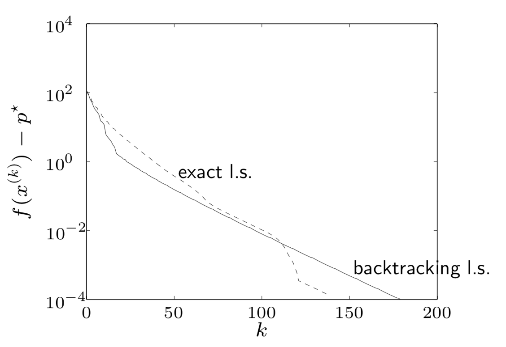
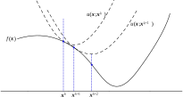
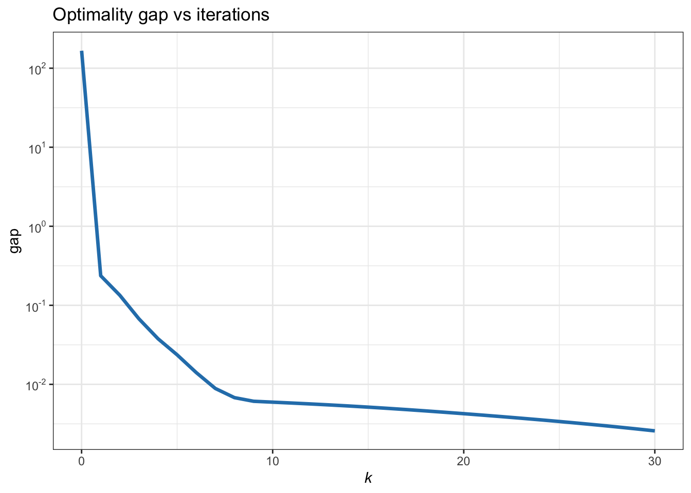
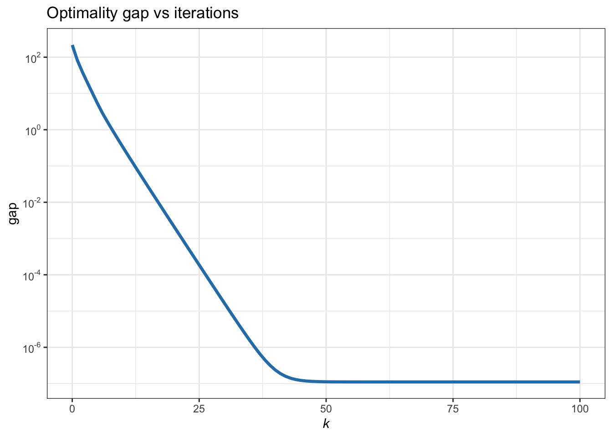
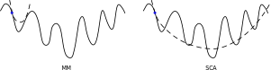
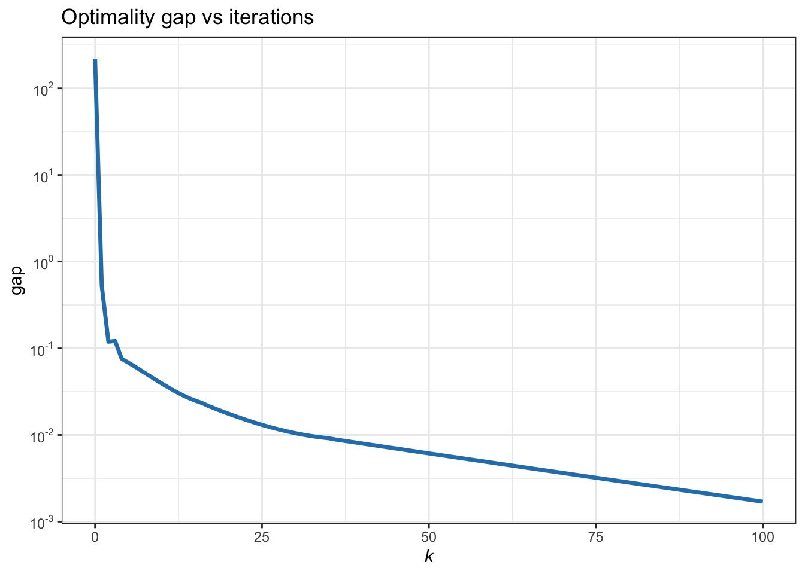

# Optimization Algorithms {#optimization-algorithms}


> Waste no more time arguing what a good man should be. Be one.
>
> --- Marcus Aurelius, _Meditations_


<!---
> "An algorithm must be seen to be believed."
>
> --- Donald Knuth
--->


\afterquotespace
\acknowledgementCUP

Over the past century, there has been a remarkable progression in the development of efficient algorithms designed to solve a broad range of convex optimization problems. In 1947, Dantzig introduced the widely used and efficient _simplex method_ for linear programming (LP), despite its theoretical worst-case complexity being exponential. Later, in 1984, Karmarkar presented a groundbreaking paper [@Karmarkar1984] proposing an _interior-point method_ for solving LPs, which offered a worst-case polynomial time complexity<!--- (on the order of $\bigO(n^{3.5})$, where $n$ is the number of variables)--->. This development was followed by numerous researchers extending the application of interior-point methods to quadratic programming (QP) and linear complementarity problems. In 1994, Nesterov and Nemirovskii further advanced the field by developing the theory of self-concordant functions. This theory facilitated the expansion of algorithms based on the log-barrier function to a wider array of convex problems, notably including semidefinite programming (SDP) and second-order cone programming (SOCP) [@NesterovNemirovskii1994].

In addition to these general-purpose algorithms designed for various classes of convex problems, there exist other highly beneficial techniques and algorithmic frameworks, such as block coordinate descent, majorization--minimization, successive convex approximation, among others. These can be employed to develop customized, straightforward algorithms specifically tailored to certain (potentially nonconvex) problems, often with improved complexity and convergence rates. This chapter will explore a broad array of such practical algorithms.

<!---
[^ellipsoid-method]: It was not until 1979 when Khachiyan proved that LPs could be solved in polynomial time with the _ellipsoid method_.

that the _ellipsoid method_ could solve  in polynomial worst-case complexity of $\bigO(n^2L)$ iterations, where $n$ is the number of variables and $L$ is the number of accuracy digits of the solution, requiring a total of $\bigO(n^4L)$ operations. However, practical implementations of the ellipsoid method left much to desire. Compare to complexity of Karmarkar's interior-point method of $\bigO(n^{3.5}L)$ operations, whose practical implementation was very efficient (later improved to a complexity of $\bigO(n^{3}L)$ operations).
--->


<p style="font-size:80%; color:grey; border: 1px solid lightgray; border-radius: 10px; padding: 10px; margin: 20px;">
  This material has been published as:
  Daniel P. Palomar (2025). _Portfolio Optimization: Theory and Application_. Cambridge University Press.
  This version is free to view and download for personal use only; not for re-distribution, re-sale, or use in derivative works. ©\ Daniel P. Palomar 2025.
</p>


## Solvers {#solvers}
\index{optimization!solvers}

A _solver_, also referred to as an _optimizer_, is an engine designed to solve specific types of mathematical problems. Most programming languages, including R, Python, MATLAB, Julia, Rust, C, and C++, offer a comprehensive list of available solvers. Each of these solvers is typically capable of handling only a certain category of problems, such as LP, QP, QCQP, SOCP, or SDP. For a detailed classification of optimization problems, refer to Section\ \@ref(taxonomy-convex-problems).


### Some Popular Solvers
Many of the currently popular solvers were originally developed in a specific programming language, such as Fortran, C, C++, or MATLAB. However, over time, they have been adapted and integrated into a wide range of other programming languages.

For the purpose of illustration, among many others, some popular solvers include:

- GLPK (GNU Linear Programming Kit):[^GLPK] intended for large-scale LP including mixed-integer variables, written in C.

- quadprog:[^quadprog] very popular open-source QP solver originally written in Fortran by Berwin Turlach in the late 1980s, and now accessible from most other programming languages.

- MOSEK:[^MOSEK] proprietary LP, QP, SOCP, SDP solver including mixed-integer variables established in 1997 by Erling Andersen (free licence available for academia); specialized in large-scale problems and very fast, robust, and reliable.

- SeDuMi:[^SeDuMi] open-source LP, QP, SOCP, SDP solver originally developed by Sturm in 1999 for MATLAB [@Sturm99].
 
- SDPT3:[^SDPT3] open-source LP, QP, SOCP, SDP solver originally developed in 1999 for MATLAB [@TutuncuTohTodd2003].

- Gurobi:[^Gurobi] proprietary LP, QP, and SOCP solver including mixed-integer variables (free licence available for academia).

- Embedded COnic Solver (ECOS):[^ECOS] SOCP solver originally written in C.

- CPLEX:[^CPLEX] proprietary LP and QP solver that also handles mixed-integer variables (free licence available for academia).


[^quadprog]: quadprog R version: https://cran.r-project.org/package=quadprog
[^CPLEX]: IBM CPLEX optimizer: [www.ibm.com/analytics/cplex-optimizer](https://www.ibm.com/analytics/cplex-optimizer)
[^Gurobi]: Gurobi optimizer: [www.gurobi.com](https://www.gurobi.com)
[^MOSEK]: MOSEK: [www.mosek.com](https://www.mosek.com)
[^SeDuMi]: SeDuMi: https://sedumi.ie.lehigh.edu; MATLAB version at https://github.com/sqlp/sedumi
[^SDPT3]: SDPT3: https://blog.nus.edu.sg/mattohkc/softwares/sdpt3, https://github.com/Kim-ChuanToh/SDPT3, https://github.com/sqlp/sdpt3
[^ECOS]: ECOS: https://github.com/embotech/ecos
[^GLPK]: GLPK: [www.gnu.org/software/glpk](https://www.gnu.org/software/glpk)


### Complexity of Interior-Point Methods
\index{optimization!interior-point methods}
Internally, solvers can be based on different types of algorithms like the simplex method for LP [@NocedalWright2006], cutting plane methods [@Bertsekas1999], interior-point methods [@NesterovNemirovskii1994; @Nemirovski2000; @BentalNemirovski2001; @BoydVandenberghe2004; @LuenbergerYe2021; @NocedalWright2006; @Nesterov2018], or even more specific algorithms tailored to a more narrow type of problem such as $\ell_2$-norm regression with an $\ell_1$-norm regularization term (used to promote sparsity) [@Tibshirani1996].

In general, the complexity of interior-point methods for LP, QP, QCQP, SOCP, and SDP is $\bigO\left(n^3L\right)$,[^big-O] where $n$ is the number of variables and $L$ is the number of accuracy digits of the solution. To further discern the difference in the complexity, we need to take into account the number of constraints, $m$, and dimensionality of the different cones, $k$ [@Nemirovski2000]:

- LP: complexity of $\bigO\left((m + n)^{3/2}n^2L\right)$, later improved to $\bigO\left(((m+ n) n^2+(m+ n)^{1.5} n) L\right)$, and even to $\bigO\left(\left(n^3/\textm{log}(n)\right)L\right)$ when $m$ and $n$ are of the same order;

- QCQP: complexity of $\bigO\left(\sqrt{m}(m + n)n^2L\right)$;

- SOCP: complexity of $\bigO\left(\sqrt{m + 1}\;n (n^2 + m + (m+1)k^2)L\right)$; and

- SDP: complexity of $\bigO\left(\sqrt{1 + mk}\;n (n^2 + nmk^2 + mk^3)L\right)$, where the matrices are of dimension $k\times k$.

[^big-O]: The "big O" notation, $\bigO(\cdot)$, measures the order of complexity. To be specific, we say that the complexity is $\bigO\left(g(N)\right)$, as $N\rightarrow\infty$, if there exists a positive real number $M$ and $N_0$ such that the complexity is upper-bounded by $Mg(N)$ for all $N\geq N_0$.

For example, consider an SOCP where the number of constraints and cone dimension are both of the same order as the number of variables (i.e., $m=\bigO(n)$ and $k=\bigO(n)$), then the complexity order is $\bigO(n^{4.5}L)$. Consider now an SDP where the cone dimension is of the same order as the number of variables (i.e., $k=\bigO(n)$), then the complexity order is to $\bigO(n^4)$; if, in addition, the number of constraints also grows with the number of variables (i.e., $m=\bigO(n)$), then the complexity order becomes $\bigO\left(n^6L\right)$. We can clearly see that the complexity for solving SOCP is much higher than that of LP, QP, and QCQP, and it only gets worse for SDP.


### Interface with Solvers
Solvers require that problems be expressed in a standard form; that is, the arguments to be passed to the solvers must be formatted in a very specific way. However, most formulated problems do not immediately present themselves in a standard form and they must be transformed. This process is time-consuming and, more importantly, it is susceptible to human transcription errors, as illustrated by the following examples.


::: {.example name="Norm approximation problem"}
Consider the problem
$$
\begin{array}{ll}
\underset{\bm{x}}{\textm{minimize}} & \left\Vert \bm{A}\bm{x} - \bm{b} \right\Vert,
\end{array}
$$
whose solution depends on the choice of the norm and so does the process of conversion to standard form.

- If we choose the Euclidean or $\ell_{2}$-norm, $\left\Vert \bm{A}\bm{x} - \bm{b} \right\Vert_2$, then the problem is just a least squares (LS) with analytic solution $\bm{x}^{\star}=(\bm{A}^\T\bm{A})^{-1}\bm{A}^\T\bm{b}$.

- If we choose the Chebyshev or $\ell_{\infty}$-norm, $\left\Vert \bm{A}\bm{x} - \bm{b} \right\Vert_{\infty}$, then the problem can be rewritten as the LP
$$
\begin{array}{ll}
\underset{\bm{x},t}{\textm{minimize}} & \begin{array}{c}
t\end{array}\\
\textm{subject to} & \begin{array}[t]{l}
-t\bm{1}\leq\bm{A}\bm{x}-\bm{b}\leq t\bm{1}\end{array}
\end{array}
$$
or, equivalently, 
$$
\begin{array}{ll}
\underset{\bm{x},t}{\textm{minimize}} & \begin{array}{c}
\begin{bmatrix}
\bm{0}^\T & 1\end{bmatrix}
\begin{bmatrix}
\bm{x}\\
t
\end{bmatrix}
\end{array}\\
\textm{subject to} & \begin{array}[t]{l}
\begin{bmatrix}
\bm{A} & -\bm{1}\\
-\bm{A} & -\bm{1}
\end{bmatrix}
\begin{bmatrix}
\bm{x}\\
t
\end{bmatrix}\leq\begin{bmatrix}
\bm{b}\\
-\bm{b}
\end{bmatrix}
\end{array},
\end{array}
$$
which finally can be written as the MATLAB code

``` matlab
xt = linprog( [zeros(n,1); 1],
              [A,-ones(m,1); -A,-ones(m,1)],
              [b; -b] )
x = xt(1:n)              
```

- If we choose the Manhattan or $\ell_{1}$-norm, $\left\Vert \bm{A}\bm{x} - \bm{b} \right\Vert_{1}$, then the problem can be rewritten as the LP
$$
\begin{array}{ll}
\underset{\bm{x},\bm{t}}{\textm{minimize}} & \begin{array}{c}
\bm{1}^\T\bm{t}\end{array}\\
\textm{subject to} & \begin{array}[t]{l}
-\bm{t}\leq\bm{A}\bm{x}-\bm{b}\leq\bm{t}\end{array}
\end{array}
$$
or, equivalently, 
$$
\begin{array}{ll}
\underset{\bm{x},t}{\textm{minimize}} & \begin{array}{c}
\begin{bmatrix}
\bm{0}^\T & \bm{1}^\T\end{bmatrix}
\begin{bmatrix}
\bm{x}\\
\bm{t}
\end{bmatrix}\end{array}\\
\textm{subject to} & \begin{array}[t]{l}
\begin{bmatrix}
\bm{A} & -\bm{I}\\
-\bm{A} & -\bm{I}
\end{bmatrix}\begin{bmatrix}
\bm{x}\\
\bm{t}
\end{bmatrix}\leq\begin{bmatrix}
\bm{b}\\
-\bm{b}
\end{bmatrix}\end{array},
\end{array}
$$
which finally can be written as the MATLAB code

``` matlab
xt = linprog( [zeros(n,1); ones(n,1)],
              [A,-eye(m,1); -A,-eye(m,1)],
              [b; -b] )
x = xt(1:n)              
```
:::


The previous example was as simple as it can get. We explore now a slightly more complicated problem with linear constraints and observe how quickly the code becomes complicated and prone to errors.


::: {.example name="Euclidean norm approximation problem with linear constraints"}
Consider the problem
$$
\begin{array}{ll}
\underset{\bm{x}}{\textm{minimize}} & \begin{array}{c}
\left\Vert \bm{A}\bm{x}-\bm{b}\right\Vert _{2}\end{array}\\
\textm{subject to} & \begin{array}[t]{l}
\bm{C}\bm{x}=\bm{d},\\
\bm{l}\leq\bm{x}\leq\bm{u}.
\end{array}
\end{array}
$$
This can be expressed as 
$$
\begin{array}{ll}
\underset{\bm{x},\bm{y},t,\bm{s}_{l},\bm{s}_{u}}{\textm{minimize}} & \begin{array}{c}
t\end{array}\\
\textm{subject to} & \begin{array}[t]{l}
\bm{A}\bm{x}-\bm{b}=\bm{y},\\
\bm{C}\bm{x}=\bm{d},\\
\bm{x}-\bm{s}_{l}=\bm{l},\\
\bm{x}+\bm{s}_{u}=\bm{u},\\
\bm{s}_{l},\bm{s}_{u}\geq\bm{0},\\
\left\Vert \bm{y}\right\Vert _{2}\leq t
\end{array}
\end{array}
$$
or, equivalently,
$$
\qquad\qquad\begin{array}{ll}
\underset{\bm{x},\bm{y},t,\bm{s}_{l},\bm{s}_{u}}{\textm{minimize}} & \begin{array}{c}
\begin{bmatrix}
\bm{0}^\T & \bm{0}^\T & \bm{0}^\T & \bm{0}^\T & 1\end{bmatrix}\bar{\bm{x}}\end{array}\\
\textm{subject to} & \begin{array}[t]{l}
\begin{bmatrix}
\bm{A} &  &  & -\bm{I}\\
\bm{C}\\
\bm{I} & -\bm{I}\\
\bm{I} &  & \bm{I}
\end{bmatrix}\bar{\bm{x}}\leq\begin{bmatrix}
\bm{b}\\
\bm{d}\\
\bm{l}\\
\bm{u}
\end{bmatrix},\\
\bar{\bm{x}}\in\bm{R}^{n}\times\bm{R}_{+}^{n}\times\bm{R}_{+}^{n}\times\bm{Q}^{m},
\end{array}
\end{array}
$$
which finally can be written as the MATLAB code

``` matlab
AA = [ A, zeros(m,n), zeros(m,n),   -eye(m),    0;
       C, zeros(p,n), zeros(p,n),   zeros(p,n), 0;
       eye(n), -eye(n), zeros(n,n), zeros(n,n), 0;
       eye(n), zeros(n,n), eye(n),  zeros(n,n), 0 ]
bb = [ b; d; l; u ]
cc = [ zeros(3*n + m, 1); 1 ]
K.f = n; K.l = 2*n; K.q = m + 1
xsyz = sedumi( AA, bb, cc, K )
x = xsyz(1:n)            
```
:::


### Modeling Frameworks
\index{optimization!modeling framework}
A _modeling framework_ simplifies the use of solvers by shielding the user from the specific details of the solver argument formatting. It effectively acts as an interface between the user and the solver. In fact, a modeling framework can typically interface with a variety of solvers that the user can choose depending on the type of problem. A modeling framework is a fantastic tool for rapid prototyping of models while avoiding transcription errors when writing the code. Nevertheless, if high speed is desired, then one should consider calling the solver directly while avoiding the convenient interface provided by a modeling framework.

Arguably, the two most successful examples (both of which are freely available) are YALMIP[^YALMIP] [@Lofberg2004] and CVX.[^CVX] CVX was initially released in 2005 for MATLAB and is now available in Python, R, and Julia [@GrantBoyd2008; @GrantBoyd2014; @FuNarasimhanBoyd2020].

CVX stands for "convex disciplined programming" and it is a convenient and powerful tool for the rapid prototyping of models and algorithms incorporating convex optimization (also allows integer constraints). It interfaces with many solvers such as the free solvers SeDuMi and SDPT3, as well as the commercial solvers Gurobi and MOSEK. Internally, CVX knows the elementary convex and concave functions as well as the rules of composition that preserve convexity. This way, it can determine whether the problem is convex or not. CVX is extremely simple to use and it is very convenient for prototyping while avoiding transcript errors.

::: {.example name="Constrained Euclidean norm approximation in CVX"}
Consider the problem
$$
\begin{array}{ll}
\underset{\bm{x}}{\textm{minimize}} & \begin{array}{c}
\left\Vert \bm{A}\bm{x}-\bm{b}\right\Vert _{2}\end{array}\\
\textm{subject to} & \begin{array}[t]{l}
\bm{C}\bm{x}=\bm{d},\\
\bm{l}\leq\bm{x}\leq\bm{u}.
\end{array}
\end{array}
$$
<!---The corresponding MATLAB code (the R and Python versions are almost identical) would simply be:--->
The corresponding code in different popular languages (e.g., MATLAB, R, and Python) is almost identical and very simple:

- MATLAB:

``` matlab
cvx_begin
    variable x(n)
    minimize(norm(A * x - b, 2))
    subject to
        C * x == d
        l <= x
        x <= u
cvx_end         
```

- R:

``` r
x <- Variable(n)
prob <- Problem(Minimize(cvxr_norm(A %*% x - b, 2)),
                list(C %*% x == d,
                     l <= x,
                     x <= u))
solve(prob)
```

- Python:

``` python
x = cvxpy.Variable(n)
prob = cvxp.Minimize(cvxpy.norm(A @ x - b, 2),
                     [C @ x == d,
                      l <= x,
                      x <= u])
prob.solve()
```
:::


[^YALMIP]: YALMIP: https://yalmip.github.io
[^CVX]: CVX: http://cvxr.com; CVX in R: https://cvxr.rbind.io


## Gradient Methods {#gradient-methods}
Consider the unconstrained optimization problem
\begin{equation}
  \begin{array}{ll}
  \underset{\bm{x}}{\textm{minimize}} & f(\bm{x})
  \end{array}
  (\#eq:gradient-descent-orig-problem)
\end{equation}
where $f$ is the objective function (assumed to be continuously differentiable).

An iterative method or algorithm produces a sequence of iterates $\bm{x}^0, \bm{x}^1, \bm{x}^2,\dots$ that may or may not converge to an optimal solution $\bm{x}^\star$. In an ideal case with $f$ convex, one may expect that, as the iterations proceed with $k \rightarrow \infty$, the objective function converges to the optimal value of the problem,
$$
f\left(\bm{x}^k\right) \rightarrow p^\star,
$$
and the gradient tends to zero,
$$
\nabla f\left(\bm{x}^k\right) \rightarrow \bm{0}.
$$

For details on iterative methods and convergence properties, the reader is referred to the many available textbooks, such as @Bertsekas1999, @BoydVandenberghe2004, @NocedalWright2006, and @Beck2017. The case of nondifferentiable $f$ leads to subgradient methods [@Beck2017], which are not considered herein.


### Descent Methods
_Descent methods_ (a.k.a. _gradient methods_) satisfy the property that $f\left(\bm{x}^{k+1}\right) < f\left(\bm{x}^{k}\right)$ and obtain the iterates as follows:
$$\bm{x}^{k+1} = \bm{x}^{k} + \alpha^{k}\bm{d}^{k},$$
where $\bm{d}^{k}$ is the _search direction_ and $\alpha^{k}$ is the _stepsize_ at iteration $k$.

For a sufficiently small step, the descent property implies that $\bm{d}$ has to satisfy $\nabla f\left(\bm{x}\right)^\T \bm{d} < 0$ and that $\alpha$ has to be properly chosen (if $\alpha$ is too large, even with a descent direction, the descent property may be violated).


### Line Search
_Line search_ is the procedure by which the stepsize $\alpha$ is chosen. There are several possible methods but the following two are widely used due to their good theoretical convergence properties as well as their practical performance.

- _Exact line search_: Based on solving the univariate optimization problem:
$$
\alpha = \underset{\alpha>0}{\textm{arg min}}\; f(\bm{x} + \alpha\bm{d}).
$$

- _Backtracking line search_ (a.k.a. _Armijo rule_): Starting at $\alpha=1$, repeat $\alpha \gets \beta \alpha$ until 
$$
f(\bm{x} + \alpha\bm{d}) < f(\bm{x}) + \sigma \alpha \nabla f(\bm{x})^\T\bm{d},
$$
where $\sigma \in (0,1/2)$ and $\beta \in (0,1)$ are given parameters. <!---Figure\ \@ref(fig:backtracking) illustrates the backtracking line search, where backtraking will proceed until $\alpha \le \alpha_0$.

<div class="figure" style="text-align: center">

<p class="caption">(\#fig:backtracking)Backtraking line search.</p>
</div>
--->


### Gradient Descent Method
The _gradient descent method_ (also known as _steepest descent method_) is a descent method where the search direction is chosen as the opposite direction of the gradient:
$$
\bm{d} = -\nabla f(\bm{x}),
$$
which is clearly a descent direction since it satisfies $\nabla f\left(\bm{x}\right)^\T\bm{d} < 0$. 

The gradient descent update is then
$$\bm{x}^{k+1} = \bm{x}^{k} - \alpha^{k}\nabla f\left(\bm{x}^{k}\right).$$
As a stopping criterion, the heuristic $\|\nabla f(\bm{x})\|_2 \le \epsilon$ is commonly used. 

Unfortunately, convergence for the gradient descent method is often slow, so it is rarely used in practice unless there is a need due to the high dimensionality of the problem or a requirement for distributed implementation. The gradient descent method is summarized in Algorithm\ B.1.
 
\index{algorithms!gradient descent method}

:::: plain_algorithm
::: lined
**Algorithm B.1**: Gradient descent method for the unconstrained problem \@ref(eq:gradient-descent-orig-problem).
:::
Choose initial point $\bm{x}^0$;  
Set $k \gets 0$;  
**repeat**

  1. Compute the negative gradient as descent direction: $\bm{d}^{k} = -\nabla f\left(\bm{x}^{k}\right)$;
  2. Line search: Choose a stepsize $\alpha^{k} > 0$ via exact or backtracking line search;
  3. Obtain next iterate: $$\bm{x}^{k+1} = \bm{x}^{k} - \alpha^{k}\nabla f\left(\bm{x}^{k}\right);$$
  4. $k \gets k+1$;
  
**until** convergence;
::::
  


<!---
#### Illustrative examples {-}
We now overview a few illustrative examples of the gradient descent method that emphasize two points: convergence can be slow and both exact and backtracking line search give similar convergence results.

::: {.example name="Quadratic function"}
Consider the quadratic problem
$$
\begin{array}{ll}
\underset{\bm{x}}{\textm{minimize}} & \frac{1}{2}\left(x_1^2 + \gamma x_2^2\right),
\end{array}
$$
where $\gamma>0$ is a parameter. If we use an exact line search with initial point $\bm{x}^0=(\gamma,1)$, then the iterates can be written in closed-form as
$$
x_1^k = \gamma\left(\frac{\gamma - 1}{\gamma + 1}\right)^k, \qquad x_2^k = \left(-\frac{\gamma - 1}{\gamma + 1}\right)^k,
$$
which can be extrelly slow if $\gamma\gg 1$ or $\gamma\ll 1$. Figure\ \@ref(fig:gradient-descent-QP) illustrates such iterates for $\gamma=10$, where convergence already becomes slow.

<div class="figure" style="text-align: center">

<p class="caption">(\#fig:gradient-descent-QP)Example of iterates for the gradient descent method with exact line seach applied to a QP.</p>
</div>
:::


::: {.example name="Exact vs. backtracking like search"}
Consider the convex problem with variable dimension $n=100$:
$$
\begin{array}{ll}
\underset{\bm{x}}{\textm{minimize}} & \bm{c}^\T\bm{x} - \sum_{i=1}^{500}\log(b_i - \bm{a}_i^\T\bm{x}).
\end{array}
$$


Figure\ \@ref(fig:gradient-descent-line-search) shows the convergence of the exact and backtracking line search techniques, indicating a similar linear convergence (i.e., straight line on a semilog plot).

<div class="figure" style="text-align: center">

<p class="caption">(\#fig:gradient-descent-line-search)Example of convergence of the exact and backtracking line search techniques.</p>
</div>
:::
--->


<!---
### Subgradient method {-}
After performing a decomposition, the objective function of the resulting
master problem may or may not be differentiable. For
differentiable/nondifferentiable functions a gradient/subgradient method is
very convenient because of its simplicity, little requirements of memory
usage, and amenability for parallel implementation [@Lasdon70; @Shor85; @Bertsekas1999].

For a convex (concave) function $f$, a subgradient at point $\bm{x}_{0}$
is defined as any vector $\bm{s}$ that satisfies
$$
f\left(\bm{x}\right)  \geq\left(\leq\right)f\left(\bm{x}_{0}\right)+\bm{s}^\T\left(\bm{x}-\bm{x}_{0}\right)\qquad\forall\bm{x}.
$$


Consider the following general concave maximization over a convex set:
\begin{equation}
  \begin{array}[c]{ll}
  \operatorname*{maximize}\limits_{\bm{x}} & \quad f_{0}\left(\bm{x}\right) \\
  \text{subject to} & \quad\bm{x}\in\mathcal{X}.
  \end{array}
  (\#eq:general-subgradient-problem)
\end{equation}

Both the gradient and subgradient projection methods generate a sequence of feasible points $\left\{\bm{x}\left(t\right)\right\}$ as
\begin{equation}
  \bm{x}\left(t+1\right) = \left[  \bm{x}\left(  t\right) +\alpha\left(t\right) \bm{s}\left(t\right)\right]_{\mathcal{X}}
  (\#eq:general-subgradient-update)
\end{equation}
where $\bm{s}\left(t\right)$ is a gradient of $f_{0}$ evaluated at the
point $\bm{x}\left(  t\right)$ if $f_{0}$ is differentiable and a
subgradient otherwise, $\left[  \bm{\cdot}\right]  _{\mathcal{X}}$ denotes
the projection onto the feasible set $\mathcal{X}$, and $\alpha\left(t\right)$ is a positive stepsize. It is interesting to point out that each
iteration of the subgradient method may not improve the objective value as
happens with a gradient method. What makes the subgradient method work is
that, for sufficiently small stepsize, the distance of the current solution
$\bm{x}\left(t\right)$ to the optimal solution $\bm{x}^{\star}$ decreases.

There are many results on convergence of the gradient/subgradient method with
different choices of stepsizes
[@Shor85; @Bertsekas1999; @BertsekasNedicOzdaglar2003]. For example, for a
diminishing stepsize rule $\alpha\left(  t\right)  =\frac{1+m}{t+m}$, where
$m$ is a fixed nonnegative number, the algorithm is guaranteed to converge to
the optimal value (assuming bounded gradients/subgradients)
[@BertsekasNedicOzdaglar2003]. For a constant stepsize $\alpha\left(t\right)  =\alpha$, more convenient for distributed algorithms, the gradient
algorithm converges to the optimal value provided that the stepsize is
sufficiently small (assuming that the gradient is Lipschitz)
[@Bertsekas1999], whereas for the subgradient algorithm the best value
converges to within some range of the optimal value (assuming bounded
subgradients) [@BertsekasNedicOzdaglar2003].
--->


### Newton's Method
_Newton's method_ is a descent method that uses not only the gradient but also the Hessian of $f$, denoted by $\nabla^2 f(\bm{x})$, in the search direction:
$$
\bm{d} = -\nabla^2 f(\bm{x})^{-1} \nabla f(\bm{x}),
$$
which is a descent direction (assuming $f$ is convex). It is tacitly assumed that $f$ is twice continuously differentiable and that the Hessian matrix is positive definite for all $\bm{x}$.

This direction has the interesting interpretation that $\bm{x} + \bm{d}$ minimizes the second-order approximation of $f(\bm{x})$ around $\bm{x}$:
$$
\hat{f}(\bm{x} + \bm{v}) = f(\bm{x}) + \nabla f(\bm{x})^\T\bm{v} + \frac{1}{2}\bm{v}^\T\nabla^2 f(\bm{x})\bm{v}.
$$

Newton's method update is then
$$\bm{x}^{k+1} = \bm{x}^{k} - \alpha^{k} \nabla^2 f\left(\bm{x}^{k}\right)^{-1} \nabla f\left(\bm{x}^{k}\right).$$

An interesting quantity in Newton's method is the _Newton decrement_
$$
\lambda(\bm{x}) = (\nabla f(\bm{x})^\T\nabla^2 f(\bm{x})^{-1}\nabla f(\bm{x}))^{1/2}
$$
that measures the proximity of $\bm{x}$ to an optimal point. More specifically, it gives an estimate of $f(\bm{x}) - p^\star$ as
$$
f(\bm{x}) - \textm{inf}_{\bm{y}} \hat{f}(\bm{y}) = \frac{1}{2} \lambda(\bm{x})^2,
$$
where $\hat{f}(\bm{x})$ is the quadratic approximation of $f(\bm{x})$. Observe that the computational cost of the Newton decrement is negligible given that we already have the Newton direction: $\lambda(\bm{x})^2 = -\nabla f(\bm{x})^\T\bm{d}$.

Newton's method enjoys fast convergence and it is at the heart of most modern solvers. Only when the dimensionality of the problem is very large does it becomes impractical to implement due the computation and storage of the Hessian. For such cases there are approximate versions of Newton's method called quasi-Newton's methods [@NocedalWright2006]. Newton's method is summarized in Algorithm\ B.2.

\index{algorithms!Newton's method}
\index{Newton's method|see{algorithms!Newton's method}}

:::: plain_algorithm
::: lined
**Algorithm B.2**: Newton's method for the unconstrained problem \@ref(eq:gradient-descent-orig-problem).
:::
Choose initial point $\bm{x}^0$ and tolerance $\epsilon>0$;  
Set $k \gets 0$;  
**repeat**

  1. Compute Newton direction and decrement: 
  $$\bm{d}^{k} = -\nabla^2 f(\bm{x}^{k})^{-1} \nabla f(\bm{x}^{k}) \quad\textm{and}\quad \lambda(\bm{x}^{k})^2 = -\nabla f(\bm{x}^{k})^\T\bm{d}^{k};
  $$
  2. Line search: Choose a stepsize $\alpha^{k} > 0$ via exact or backtracking line search;
  3. Obtain next iterate: $$\bm{x}^{k+1} = \bm{x}^{k} - \alpha^{k} \nabla^2 f\left(\bm{x}^{k}\right)^{-1} \nabla f\left(\bm{x}^{k}\right);$$
  4. $k \gets k+1$;
  
**until** convergence (i.e., $\lambda(\bm{x}^{k})^2/2 \le \epsilon$);
::::
  


### Convergence
Ideally, we would like the sequence of a descent method $\{\bm{x}^{k}\}$ to converge to a global minimum. Unfortunately, however, this is much to expect, at least when $f$ is not convex, because of the presence of local minima that are not global. Thus, the most we can expect from a descent method is that it converges to a stationary point. Such a point is a global minimum if $f$ is convex, but this need not be so for nonconvex problems.

Descent methods enjoys nice theoretical convergence [@Bertsekas1999] as summarized in Theorem\ \@ref(thm:gradient-descent-convergence).

::: {.theorem #gradient-descent-convergence name="Convergence of descent methods"}
Suppose $\{\bm{x}^{k}\}$ is a sequence generated by a descent method (such as the gradient descent method or Newton's method) and the stepsize $\alpha^{k}$ is chosen by exact line search or backtracking line search. Then every limit point of $\{\bm{x}^{k}\}$ is a stationary point of the problem.
:::

Other simpler stepsize rules also enjoy theoretical convergence [@Bertsekas1999]:

- _constant stepsize_: $\alpha^{k} = \alpha$ for sufficiently small $\alpha$;
- _dimishing stepsize rule_: $\alpha^{k} \rightarrow 0$ with $\sum_{k=0}^\infty \alpha^{k} = \infty$.

Regarding Newton's method, it is worth knowing that its convergence can be divided into two phases:

1. _damped Newton phase_: the convergence is slow; and
2. _quadratically convergent phase_: the convergence is extremely fast.


In practice, the gradient descent method converges slowly, whereas Newton's method enjoys much faster convergence (at the expense of computing the Hessian). Thus, if the problem dimensionality is manageable, Newton's method is preferred. In some applications, however, the dimensionality can be extremely large (such as in deep learning) and computing and storing the Hessian is not a feasible option.


## Projected Gradient Methods
Consider the constrained optimization problem
$$
\begin{array}{ll}
\underset{\bm{x}}{\textm{minimize}} & f(\bm{x})\\
\textm{subject to} & \bm{x} \in \mathcal{X},
\end{array}
$$
where $f$ is the objective function (assumed to be continuously differentiable) and $\mathcal{X}$ is a convex set.

If we were to use a descent method,
$$\bm{x}^{k+1} = \bm{x}^{k} + \alpha^{k}\bm{d}^{k}$$
with $\bm{d}^{k}$ a descent direction, we would possibly end up with an infeasible point $\bm{x}^{k+1}$.

_Projected gradient methods_ or _gradient projection methods_ address this issue by projecting onto the feasible set after taking the step [@Bertsekas1999; @Beck2017]:
$$\bm{x}^{k+1} = \left[\bm{x}^{k} + \alpha^{k}\bm{d}^{k}\right]_\mathcal{X},$$

where $\left[\bm{x}\right]_\mathcal{X}$ denotes projection onto the set $\mathcal{X}$ defined as the solution to $\textm{min}_{\bm{y}} \|\bm{y} - \bm{x}\|$ subject to $\bm{y} \in \mathcal{X}.$

A slightly more general version of the gradient projection method is
$$
\begin{aligned}
\bm{\bar{x}}^{k} &= \left[\bm{x}^{k} + s^{k}\bm{d}^{k}\right]_\mathcal{X},\\
\bm{x}^{k+1} &= \bm{x}^{k} + \alpha^{k}\left(\bm{\bar{x}}^{k} - \bm{x}^{k}\right),
\end{aligned}
$$
where $\bm{d}^{k} = \bm{\bar{x}}^{k} - \bm{x}^{k}$ is a feasible direction (because $\bm{\bar{x}}^{k}$ is feasible due to the projection), $\alpha^{k}$ is the stepsize, and $s^{k}$ is a positive scalar [@Bertsekas1999]. Note that if we choose $\alpha^{k}=1$ then the iteration simplifies to the previous expression:
$$\bm{x}^{k+1} = \left[\bm{x}^{k} + s^{k}\bm{d}^{k}\right]_\mathcal{X},$$
where now $s^k$ can be viewed as a stepsize. Further note that if $\bm{x}^{k} + s^{k}\bm{d}^{k}$ is already feasible, then the gradient projection method reduces to the regular gradient method.

In practice, the gradient projection method only makes sense if the projection is easy to compute.


### Projected Gradient Descent Method
\index{algorithms!projected gradient descent method}
The projected gradient descent method simply uses as search direction the negative gradient:
$$
\begin{aligned}
\bm{\bar{x}}^{k} &= \left[\bm{x}^{k} - s^{k} \nabla f\left(\bm{x}^{k}\right)\right]_\mathcal{X},\\
\bm{x}^{k+1} &= \bm{x}^{k} + \alpha^{k}\left(\bm{\bar{x}}^{k} - \bm{x}^{k}\right).
\end{aligned}
$$


### Constrained Newton's Method
Let us assume that $f$ is twice continuously differentiable and that the Hessian matrix is positive definite for all $\bm{x}\in\mathcal{X}$.

The _constrained Newton's method_ is
$$
\begin{aligned}
\bm{\bar{x}}^{k} &= \underset{\bm{x}\in\mathcal{X}}{\textm{arg min}} \left\{\nabla f\left(\bm{x}^k\right)^\T\left(\bm{x} - \bm{x}^k\right) + \frac{1}{2s^k}\left(\bm{x} - \bm{x}^k\right)^\T \nabla^2 f\left(\bm{x}^k\right)\left(\bm{x} - \bm{x}^k\right)\right\},\\
\bm{x}^{k+1} &= \bm{x}^{k} + \alpha^{k}\left(\bm{\bar{x}}^{k} - \bm{x}^{k}\right).
\end{aligned}
$$
Note that if $s^k=1$, the quadratic cost above is the second-order Taylor series expansion of $f$ around $\bm{x}^k$ (apart from a constant term). In particular, if $\alpha^k=1$ and $s^k=1$, then $\bm{x}^{k+1}$ is the vector that minimizes the second-order Taylor series expansion around $\bm{x}^k$, just as in the case of Newton's method for unconstrained optimization.

The main difficulty with this method is in solving the quadratic subproblem to find $\bm{\bar{x}}^{k}$. This may not be simple even when the constraint set $\mathcal{X}$ has a simple structure. Thus the method typically makes practical sense only for problems of small dimension.


### Convergence
The convergence of gradient projection methods can be found in @Bertsekas1999 and it is summarized in Theorem\ \@ref(thm:projected-gradient-descent-convergence).

::: {.theorem #projected-gradient-descent-convergence name="Convergence of gradient projection methods"}
Suppose $\{\bm{x}^{k}\}$ is a sequence generated by a gradient projection method (such as the projected gradient descent method or the constrained Newton's method) and the stepsize $\alpha^{k}$ is chosen by exact line search or backtracking line search. Then every limit point of $\{\bm{x}^{k}\}$ is a stationary point of the problem.
:::

Other simpler stepsize rules also enjoy theoretical convergence, such as the constant stepsize $\alpha^{k} = 1$ and $s^k = s$ for sufficiently small $s$ [@Bertsekas1999].


## Interior-Point Methods {#IPM}
Traditional optimization algorithms based on gradient projection methods may suffer from slow convergence and sensitivity to the algorithm initialization and stepsize selection. The more modern _interior-point methods_ (IPM) for convex problems enjoy excellent convergence properties (polynomial convergence) and do not suffer from the usual problems of the traditional methods. Some standard textbooks that cover IPMs in detail include @NesterovNemirovskii1994, @Ye1997, @Nesterov2018, @Bertsekas1999, @Nemirovski2000, @BentalNemirovski2001, @BoydVandenberghe2004, @LuenbergerYe2021, and @NocedalWright2006.


Consider the following convex optimization problem:
\begin{equation}
  \begin{array}{ll}
  \underset{\bm{x}}{\textm{minimize}} & \begin{array}[t]{l} f_0(\bm{x}) \end{array}\\
  \textm{subject to} & \begin{array}[t]{l}
  f_i(\bm{x}) \leq 0, \qquad i=1,\dots,m,\\
  \bm{A}\bm{x} = \bm{b},
  \end{array}
  \end{array}
  (\#eq:general-problem-IPM)
\end{equation}
where all $f_i$ are convex and twice continuously differentiable, and $\bm{A}\in\R^{p\times n}$ is a fat (i.e., more columns than rows), full rank matrix. We assume that the optimal value $p^\star$ is finite and attained, and that the problem is strictly feasible, hence strong duality holds and dual optimum is attained.


### Eliminating Equality Constraints
Equality constraints can be conveniently dealt with via Lagrange duality [@BoydVandenberghe2004]. Alternatively, they can be simply eliminated in a pre-processing stage as shown next.

From linear algebra, we know that the possibly infinite solutions to $\bm{A}\bm{x} = \bm{b}$ can be represented as follows:
$$
\{\bm{x} \in \R^n \mid \bm{A}\bm{x} = \bm{b}\} = \{\bm{F}\bm{z} + \bm{x}_0 \mid \bm{z} \in \R^{n-p}\},
$$
where $\bm{x}_0$ is any particular solution to $\bm{A}\bm{x} = \bm{b}$ and the range of $\bm{F} \in \R^{n\times(n-p)}$ is the nullspace of $\bm{A}\in\R^{p\times n}$, that is, $\bm{A}\bm{F} = \bm{0}$.

The _reduced_ or _eliminated problem_ equivalent to problem \@ref(eq:general-problem-IPM) is
$$
\begin{array}{ll}
\underset{\bm{z}}{\textm{minimize}} & \tilde{f}_0(\bm{z}) \triangleq f_0(\bm{F}\bm{z} + \bm{x}_0)\\
\textm{subject to} & \tilde{f}_i(\bm{z}) \triangleq f_i(\bm{F}\bm{z} + \bm{x}_0) \leq 0, \qquad i=1,\dots,m,
\end{array}
$$
where each function $\tilde{f}_i$ has gradient and Hessian given by
$$
\begin{aligned}
\nabla \tilde{f}_i(\bm{z}) &= \bm{F}^\T \nabla f_i(\bm{x}),\\
\nabla^2 \tilde{f}_i(\bm{z}) &= \bm{F}^\T \nabla^2 f_i(\bm{x}) \bm{F}.
\end{aligned}
$$


Once the solution $\bm{z}^\star$ to the reduced problem has been obtained, the solution to the original problem \@ref(eq:general-problem-IPM) can be readily derived as
$$
\bm{x}^\star = \bm{F}\bm{z}^\star + \bm{x}_0.
$$


### Indicator Function
We can equivalently reformulate problem \@ref(eq:general-problem-IPM) via the _indicator function_ as
$$
\begin{array}{ll}
\underset{\bm{x}}{\textm{minimize}} & f_0(\bm{x}) + \sum_{i=1}^m I_{-}\left(f_i(\bm{x})\right)\\
\textm{subject to} & \bm{A}\bm{x} = \bm{b},
\end{array}
$$
where the indicator function is defined as
$$
I_{-}(u) = \begin{cases}
0 & \textm{if }u\le0,\\
\infty & \textm{otherwise}.
\end{cases}
$$
In this form, the inequality constraints have been eliminated at the expense of the indicator function in the objective. Unfortunately, the indicator function is a noncontinuous, nondifferentiable function, which is not practical.


### Logarithmic Barrier
In practice, we need to use some smooth approximation of the indicator function. A very popular and convenient choice is the so-called _logarithmic barrier_:
$$
I_{-}(u) \approx -\frac{1}{t}\textm{log}(-u),
$$
where $t>0$ is a parameter that controls the approximation and improves as $t \rightarrow \infty$. Figure\ \@ref(fig:log-barrier) illustrates the logarithmic barrier for several values of $t$.

<div class="figure" style="text-align: center">

<p class="caption">(\#fig:log-barrier)Logarithmic barrier for several values of the parameter $t$.</p>
</div>

With the logarithmic barrier, we can approximate the problem \@ref(eq:general-problem-IPM) as
$$
\begin{array}{ll}
\underset{\bm{x}}{\textm{minimize}} & f_0(\bm{x}) -\frac{1}{t}\sum_{i=1}^m \textm{log}\left(-f_i(\bm{x})\right)\\
\textm{subject to} & \bm{A}\bm{x} = \bm{b}.
\end{array}
$$

We can define the overall logarithmic barrier function (excluding the $1/t$ factor) as
$$
\phi(\bm{x}) = -\sum_{i=1}^m \textm{log}\left(-f_i(\bm{x})\right),
$$
which is convex (from the composition rules in Section\ \@ref(convex-functions)) with gradient and Hessian given by
$$
\begin{aligned}
\nabla   \phi(\bm{x}) &= \sum_{i=1}^m\frac{1}{-f_i(\bm{x})}\nabla f_i(\bm{x}),\\
\nabla^2 \phi(\bm{x}) &= \sum_{i=1}^m\frac{1}{f_i(\bm{x})^2}\nabla f_i(\bm{x}) \nabla f_i(\bm{x})^\T + \sum_{i=1}^m\frac{1}{-f_i(\bm{x})}\nabla^2 f_i(\bm{x}).
\end{aligned}
$$

### Central Path
For convenience, we multiply the objective function by a positive scalar $t > 0$ and define $\bm{x}^\star(t)$ as the solution to the equivalent problem
\begin{equation}
  \begin{array}{ll}
  \underset{\bm{x}}{\textm{minimize}} & t f_0(\bm{x}) + \phi(\bm{x})\\
  \textm{subject to} & \bm{A}\bm{x} = \bm{b},
  \end{array}
  (\#eq:central-path)
\end{equation}
which can be conveniently solved via Newton's method.

The _central path_ is defined as the curve $\{\bm{x}^\star(t) \mid t>0\}$ (assuming that the solution for each $t$ is unique). Figure\ \@ref(fig:central-path) illustrates the central path of an LP.

<div class="figure" style="text-align: center">

<p class="caption">(\#fig:central-path)Example of central path of an LP.</p>
</div>


Ignoring the equality constraints for convenience of exposition, a solution to \@ref(eq:central-path), $\bm{x}^\star(t)$, must satisfy the equation
$$
t\nabla f_0(\bm{x}) + \sum_{i=1}^m\frac{1}{-f_i(\bm{x})}\nabla f_i(\bm{x}) = \bm{0}.
$$
Equivalently, defining $\lambda_i^\star(t) = 1/(-tf_i(\bm{x}^\star(t)))$, the point $\bm{x}^\star(t)$ minimizes the Lagrangian
$$
L(\bm{x};\bm{\lambda}^\star(t)) = f_0(\bm{x}) + \sum_{i=1}^m \lambda_i^\star(t)f_i(\bm{x}).
$$
This confirms the intuitive idea that $f_0(\bm{x}^\star(t)) \rightarrow p^\star$ as $t\rightarrow\infty$. In particular, from Lagrange duality theory (refer to Section\ \@ref(duality) in Appendix\ \@ref(convex-optimization) for details),
$$
\begin{aligned}
p^\star &\ge g\left(\bm{\lambda}^\star(t)\right)\\
&= L\left(\bm{x}^\star(t);\bm{\lambda}^\star(t)\right)\\
&= f_0\left(\bm{x}^\star(t)\right) - m/t.
\end{aligned}
$$

In addition, the central path has a nice connection with the Karush--Kuhn--Tucker (KKT) optimality conditions (refer to Section\ \@ref(optimality-conditions) for details). In particular, the point $\bm{x}^\star(t)$ together with the dual point $\bm{\lambda}^\star(t)$ satisfy the following:
$$
  \begin{array}{rl}
  f_{i}(\bm{x}) \leq0,\quad i=1,\dots,m, & \quad \textm{(primal feasibility)}\\
  \lambda_{i} \ge0,\quad i=1,\dots,m, & \quad \textm{(dual feasibility)}\\
  \qquad\qquad\qquad\lambda_{i}f_{i}(\bm{x}) = -\frac{1}{t},\quad i=1,\dots,m, & \quad \textm{(approximate complementary slackness)}\\
  \nabla f_{0}(\bm{x}) + \sum\limits_{i=1}^{m}\lambda_{i}\nabla f_{i}(\bm{x}) = \bm{0}. & \quad \textm{(zero Lagrangian gradient)}\\
  \end{array}
$$
Clearly, the difference from the KKT conditions of the original constrained problem  (see \@ref(eq:KKT-conditions) in Appendix\ \@ref(convex-optimization)) is that the complementary slackness is now approximately satisfied, with the approximation becoming better as $t\rightarrow\infty$.


### Barrier Method
Problem \@ref(eq:central-path) with the logarithmic barrier is a smooth approximation of the original constrained problem \@ref(eq:general-problem-IPM), and the approximation gets better as $t\rightarrow\infty$. 

One might be tempted to choose a very large value for $t$ and then apply Newton's method to solve the problem. However, this approach would lead to very slow convergence because the gradients and Hessians would experience extremely large variations near the boundary of the feasible set. Consequently, the convergence of Newton's method would be hindered, failing to reach the phase of quadratic convergence. On the other hand, a small value of $t$ would facilitate better convergence, but the resulting approximation would not be satisfactorily close to the original problem.

Instead of directly choosing one value for $t$, we may change it over the iterations in an appropriate way, in order to achieve the best of both worlds: fast convergence and an accurate approximation to the original problem. More specifically, at each outer iteration, the value of $t$ is updated and then the solution $\bm{x}^\star(t)$ is computed (the so-called centering step) with Newton's method starting at the current point $\bm{x}$ and running over a few inner iterations. Interior-point methods achieve precisely such a trade-off and they get their name because for each value of $t>0$ the solution $\bm{x}^\star(t)$ is strictly feasible and lies in the interior of the feasible set.


The _barrier method_, which is one type of primal-based IPM, uses a simple, yet effective, way to update the value of $t$ with the iterations as $t^{k+1} \gets \mu t^{k}$, where $\mu>1$ is a parameter and typically $t^{0}=1$. The choice of $\mu$ involves a trade-off: large $\mu$ means fewer outer iterations, but more inner (Newton) iterations; typical values are $\mu = 10$ to around $20$. In addition, the termination criterion can be chosen as $m/t < \epsilon$, guaranteeing $f_0(\bm{x}) - p^\star \le \epsilon$. Algorithm\ B.3 summarizes the implementation of the barrier method; the reader is referred to @BoydVandenberghe2004 for practical discussions on the details.


\index{algorithms!interior-point method (barrier method)}

:::: plain_algorithm
::: lined
**Algorithm B.3**: Barrier method for the constrained problem \@ref(eq:general-problem-IPM).
:::
Choose initial point $\bm{x}^0\in\mathcal{X}$ stricly feasible, $t^{0}>0$, $\mu>1$, and tolerance $\epsilon>0$;  
Set $k \gets 0$;  
**repeat**

  1. Centering step: compute next iterate $\bm{x}^{k+1}$ by solving problem \@ref(eq:central-path) with $t=t^{k}$ and initial point $\bm{x}^{k}$;  
  2. Increase $t$: $\quad t^{k+1} \gets \mu t^{k}$;
  3. $k \gets k+1$;
  
**until** convergence (i.e., $m/t < \epsilon$);
::::
  


::: {.example name="Barrier method for LP"}
Consider the following LP:
$$
\begin{array}{ll}
\underset{\bm{x}}{\textm{minimize}} & \bm{c}^\T\bm{x}\\
\textm{subject to} & \bm{A}\bm{x} \leq \bm{b}.
\end{array}
$$


We employ Algorithm\ B.3 with different values of $\mu$ to see the effect of this parameter in the total number of Newton iterations.

Figure\ \@ref(fig:IPM-LP) shows the convergence for the case of $m=100$ inequalities and $n=50$ variables, with $\epsilon=10^{-6}$ for the duality gap (the centering problem is solved via Newton's method<!--- with $\epsilon=10^{-5}$ and backtracking with $\sigma=0.01$ and $\beta=0.5$--->). We can verify that the total number of Newton iterations is not very sensitive to the choice of $\mu$ as long as $\mu\geq10$.


<div class="figure" style="text-align: center">

<p class="caption">(\#fig:IPM-LP)Convergence of barrier method for an LP for different values of $\mu$.</p>
</div>
:::


### Convergence
From the termination criterion in Algorithm\ B.3, the number of outer iterations (or centering steps) required is $k$ such that
$$
\frac{m}{\mu^k t^0} \leq \epsilon,
$$
that is,
$$
\left\lceil \frac{\textm{log}\left(m/\left(\epsilon t^0\right)\right)}{\textm{log}(\mu)} \right\rceil,
$$
where $\lceil \cdot \rceil$ is the ceiling operator. The convergence of each centering step can also be characterized via the convergence for Newton's method. But this approach ignores the specific updates for $\mu$ and the good initialization points for each centering step.

For a convergence analysis, the reader is referred to @NesterovNemirovskii1994, @Nemirovski2000, @BentalNemirovski2001, @BoydVandenberghe2004, @Nesterov2018, @LuenbergerYe2021, and @NocedalWright2006.


### Feasibility and Phase I Methods
The barrier method in Algorithm\ B.3 contains a small hidden detail: the need for a strictly feasible initial point $\bm{x}^{0}$ (such that $f_i\left(\bm{x}^{0}\right)<0$). When such a point is not known, the barrier method is preceded by a preliminary stage, called _phase I_, in which a strictly feasible point is computed. Such a point can then be used as a starting point for the barrier method, which is then called _phase II_.

There are several phase I methods that can be used to find a feasible point for problem \@ref(eq:general-problem-IPM) by solving the feasibility problem
$$
\begin{array}{ll}
\underset{\bm{x}}{\textm{find}} & \begin{array}[t]{l} \bm{x} \end{array}\\
\textm{subject to} & \begin{array}[t]{l}
f_i(\bm{x}) \leq 0, \qquad i=1,\dots,m,\\
\bm{A}\bm{x} = \bm{b}.
\end{array}
\end{array}
$$

However, note that a barrier method cannot be used to solve the feasibility problem directly because it would also require a feasible starting point. 

Phase I methods have to be formulated in a convenient way so that a feasible point can be readily constructed and a barrier method can then be used. A simple example relies on solving the convex optimization problem
$$
\begin{array}{ll}
\underset{\bm{x},s}{\textm{minimize}} & \begin{array}[t]{l} s \end{array}\\
\textm{subject to} & \begin{array}[t]{l}
f_i(\bm{x}) \leq s, \qquad i=1,\dots,m,\\
\bm{A}\bm{x} = \bm{b}.
\end{array}
\end{array}
$$
A strictly feasible point can be easily constructed for this problem: choose any value of $\bm{x}$ that satisfies the equality constraints, and then choose $s$ satisfying $s > f_i(\bm{x})$ such as $s = 1.1 \times \text{max}_i \{f_i(\bm{x})\}.$ With such an initial strictly feasible point, the feasibility problem can be solved, obtaining $\left(\bm{x}^\star,s^\star\right)$. If $s^\star<0$, then $\bm{x}^\star$ is a strictly feasible point that can be used in the barrier method to solve the original problem \@ref(eq:general-problem-IPM). However, if $s^\star>0$, it means that no feasible point exists and there is no need to even attempt to solve problem \@ref(eq:general-problem-IPM) since it is infeasible.


### Primal-Dual Interior-Point Methods
The barrier method described herein is a primal version of an IPM. However, there are more sophisticated primal--dual IPMs that are more efficient than the primal barrier method when high accuracy is needed. They often exhibit superlinear asymptotic convergence.

The idea is to update the primal and dual variables at each iteration; as a consequence, there is no distinction between inner and outer iterations. <!---The search directions can be interpreted as Newton directions for modified KKT conditions. --->In addition, they can start at infeasible points, which alleviates the need for phase I methods.


## Fractional Programming Methods {#methods-FP}
Consider the _concave--convex fractional program_ (FP) (refer to Section\ \@ref(taxonomy-convex-problems) for details)
\begin{equation}
  \begin{array}{ll}
  \underset{\bm{x}}{\textm{maximize}} & \dfrac{f(\bm{x})}{g(\bm{x})}\\
  \textm{subject to} & \bm{x}\in\mathcal{X},
  \end{array}
  (\#eq:convex-concave-FP)
\end{equation}
where $f(\bm{x})$ is a concave function, $g(\bm{x})>0$ is a convex function, and $\mathcal{X}$ denotes the convex feasible set.

Recall that FPs are nonconvex problems, so in principle they are difficult to solve [@Stancu1992]. Fortunately, the concave--convex FP in \@ref(eq:convex-concave-FP), albeit still being nonconvex, is a quasi-convex optimization problem and can be conveniently solved. In the following, we briefly look at three practical methods to solve the FP in \@ref(eq:convex-concave-FP), namely, the iterative bisection method, the Dinkelbach method, which is still an iterative method, and the Schaible transform, which allows a direct convex reformulation.


### Bisection Method
Problem \@ref(eq:convex-concave-FP) is a quasi-convex problem and can be conveniently solved by solving a sequence of convex feasibility problems (see Section\ \@ref(quasi-convex-optimiz) in Appendix\ \@ref(convex-optimization) for details) of the form:
\begin{equation}
  \begin{array}{ll}
  \underset{\bm{x}}{\textm{find}} & 
  \begin{array}{c} \bm{x} \end{array}\\
  \textm{subject to} & \begin{array}[t]{l}
  t g(\bm{x}) \leq f(\bm{x}),\\
  \bm{x}\in\mathcal{X},
  \end{array}
  (\#eq:FP-feasibility)
  \end{array}
\end{equation}
where $t>0$ is not an optimization variable but a fixed parameter. 

The goal is to find the right value of $t$ to be equal to the optimal value of problem \@ref(eq:convex-concave-FP). This can be done iteratively based on the following simple observation: if the feasibility problem \@ref(eq:FP-feasibility) is infeasible, then $t$ is too large and has to be decreased, otherwise $t$ is probably too small and can be further increased.

The _bisection method_, also known as the _sandwich technique_, performs a series of attempts for the parameter $t$ in a very efficient way by halving an interval known to contain the optimal value of $t$ at each iteration. More specifically, suppose that the original problem \@ref(eq:convex-concave-FP) is feasible and that we start with an interval $[l,u]$ known to contain the optimal value denoted by $t^\star$, we can then solve the convex feasibility problem at the interval midpoint $t=(l+u)/2$, to determine whether the optimal value is in the lower or upper half of this interval, and update the interval accordingly. This produces a new interval, which also contains the optimal value, but has half the width of the initial interval; so the length of the interval after $k$ iterations is $2^{-k}(u - l)$, where $(u - l)$ is the length of the initial interval. Therefore, if a tolerance of $\epsilon$ is desired in the computation of $t^\star$, the number of iterations is $\lceil\textm{log}_2\left((u-l)/\epsilon\right)\rceil$, where $\lceil\cdot\rceil$ denotes the ceiling rounding operation. This procedure is summarized in Algorithm\ B.4 (which is a particular case of the more general Algorithm\ A.1 in Section\ \@ref(convex-optimization-problem)).

\index{algorithms!FP via bisection}

:::: plain_algorithm
::: lined
**Algorithm B.4**: Bisection method to solve the concave--convex FP in \@ref(eq:convex-concave-FP).
:::
Choose interval $[l,u]$ containing optimal value of problem \@ref(eq:convex-concave-FP) and tolerance $\epsilon>0$;  
**repeat**

  1. $t \leftarrow (l+u)/2$;
  2. Solve the convex feasibility problem \@ref(eq:FP-feasibility);
  3. **if** feasible, **then** $l \leftarrow t$ and keep solution $\bm{x}$; **else** $u \leftarrow t$;

**until** convergence (i.e., $u-l \leq \epsilon$);
::::


### Dinkelback Method {#dinkelbach}
The _Dinkelbach transform_ [@Dinkelbach67] reformulates the original concave--convex FP in \@ref(eq:convex-concave-FP) into a sequence of simpler convex problems of the form

\begin{equation}
  \begin{array}{ll}
  \underset{\bm{x}}{\textm{maximize}} & f(\bm{x}) - y^k g(\bm{x})\\
  \textm{subject to} & \bm{x}\in\mathcal{X},
  \end{array}
  (\#eq:FP-dinkelbach)
\end{equation}

where the parameter $y^k$ is sequentially updated as $y^{k} = f(\bm{x}^{k})/g(\bm{x}^{k})$ with $k$ the iteration index. This is summarized in Algorithm\ B.5.

\index{algorithms!FP via Dinkelbach}

:::: plain_algorithm
::: lined
**Algorithm B.5**: Dinkelbach method to solve the concave--convex FP in \@ref(eq:convex-concave-FP).
:::
Choose initial point $\bm{x}^0$;  
Set $k \gets 0$;  
**repeat**

  1. Set $y^{k} = f(\bm{x}^{k})/g(\bm{x}^{k})$;
  2. Solve the convex problem \@ref(eq:FP-dinkelbach) and keep current solution as $\bm{x}^{k+1}$;
  3. $k \gets k+1$;
  
**until** convergence;
::::


The Dinkelbach method can be shown to converge to the global optimum of the original concave--convex FP in \@ref(eq:convex-concave-FP) by carefully analyzing the increasingness of $\{y^{k}\}$ and the function $F(y) = \textm{arg max}_{\bm{x}} f(\bm{x}) - y g(\bm{x})$.


### Charnes--Cooper--Schaible Transform {#schaible}
We first consider the linear FP case and then move to the more general concave--convex FP.

#### Charnes--Cooper Transform {-}
One particular case of FP is when both $f$ and $g$ are linear as well as the constraint set, termed _linear FP_ (LFP):
\begin{equation}
  \begin{array}{ll}
  \underset{\bm{x}}{\textm{minimize}} & \begin{array}{c}
  \dfrac{\bm{c}^\T \bm{x} + d}{\bm{e}^\T \bm{x}+f}\end{array}\\
  \textm{subject to} & \begin{array}[t]{l}
  \bm{G}\bm{x} \leq \bm{h},\\
  \bm{A}\bm{x} = \bm{b},
  \end{array}
  \end{array}
  (\#eq:LFP-alg)
\end{equation}
with $\textm{dom}\,f_{0}=\left\{ \bm{x} \mid \bm{e}^\T \bm{x} + f > 0\right\}.$

\index{optimization!Charnes--Cooper transform}
Interestingly, the LFP in \@ref(eq:LFP-alg) can be transformed into the following LP via the Charnes--Cooper transform [@CharnesCooper62]:
\begin{equation}
  \begin{array}{ll}
  \underset{\bm{y},t}{\textm{minimize}} & \begin{array}{c}
  \bm{c}^\T\bm{y}+dt\end{array}\\
  \textm{subject to} & \begin{array}[t]{l}
  \bm{G}\bm{y}\leq \bm{h}t,\\
  \bm{A}\bm{y}=\bm{b}t,\\
  \bm{e}^\T \bm{y} + ft = 1,\\
  t\geq0,
  \end{array}
  \end{array}
  (\#eq:LP-Charnes-Cooper)
\end{equation}
from which the original variable $\bm{x}$ can be easily recovered from $\bm{y}$ and $t$ as $\bm{x} = \bm{y}/t$; see also @Bajalinov2003.


::: {.proof}
Define two new variables, $\bm{y}$ and $t$, related to the original variable $\bm{x}$ in the LFP in \@ref(eq:LFP-alg) by
$$
\bm{y} = \frac{\bm{x}}{\bm{e}^\T \bm{x}+f}\quad\textm{and} \quad t = \frac{1}{\bm{e}^\T \bm{x}+f}.
$$
Obviously, any feasible point $\bm{x}$ in the original LFP in \@ref(eq:LFP-alg) leads to a feasible point $(\bm{y},t)$ in the LP in \@ref(eq:LP-Charnes-Cooper) with the same objective value. Conversely, any feasible point $(\bm{y},t)$ in the LP in \@ref(eq:LP-Charnes-Cooper) leads to a feasible point $\bm{x}$ in the original LFP in \@ref(eq:LFP-alg) via $\bm{x} = \bm{y}/t$, also with the same objective value:
$$
\dfrac{\bm{c}^\T\bm{y}+dt}{1} = \dfrac{\bm{c}^\T\bm{y}+dt}{\bm{e}^\T \bm{y} + ft} = \dfrac{\bm{c}^\T\bm{y}/t+d}{\bm{e}^\T \bm{y}/t + f}  = \dfrac{\bm{c}^\T\bm{x}+d}{\bm{e}^\T \bm{x} + f}.
$$
:::
<br>


#### Schaible Transform {-}
\index{optimization!Schaible transform}

The _Schaible transform_ [@Schaible74] is a more general case of the Charnes--Cooper transform that rewrites the original _concave--convex FP_ in \@ref(eq:convex-concave-FP) into the following convex problem:
\begin{equation}
  \begin{array}{ll}
  \underset{\bm{y},t}{\textm{maximize}} & t f\left(\dfrac{\bm{y}}{t}\right)\\
  \textm{subject to} 
  & t g\left(\dfrac{\bm{y}}{t}\right) \le 1,\\
  & t \ge 0,\\
  & \bm{y}/t\in\mathcal{X},
  \end{array}
  (\#eq:FP-Schaible)
\end{equation}
from which the original variable $\bm{x}$ can be easily recovered from $\bm{y}$ and $t$ as $\bm{x} = \bm{y}/t.$

::: {.proof}
Define two new variables, $\bm{y}$ and $t$, related to the original variable $\bm{x}$ in the FP in \@ref(eq:convex-concave-FP) by
$$
\bm{y} = \frac{\bm{x}}{g(\bm{x})}\quad\textm{and} \quad t = \frac{1}{g(\bm{x})}.
$$
Any feasible point $\bm{x}$ in the original FP in \@ref(eq:convex-concave-FP) leads to a feasible point $(\bm{y},t)$ in the convex problem \@ref(eq:FP-Schaible) (in fact, satisfying $t g\left(\bm{y}/t\right) = 1$) with the same objective value. Conversely, any feasible point $(\bm{y},t)$ in \@ref(eq:FP-Schaible) leads to a feasible point $\bm{x}$ in the original FP in \@ref(eq:convex-concave-FP) via $\bm{x} = \bm{y}/t$, also with the same objective value:
$$
t f\left(\dfrac{\bm{y}}{t}\right) = \dfrac{f\left(\bm{x}\right)}{g\left(\bm{x}\right)}.
$$
:::
<br>

Observe that if instead of maximizing a concave--convex FP as in \@ref(eq:convex-concave-FP), we consider the minimization of a convex-concave FP, the Schaible transform similarly leads to the following convex problem:
$$
\begin{array}{ll}
\underset{\bm{y},t}{\textm{minimize}} & t f\left(\dfrac{\bm{y}}{t}\right)\\
\textm{subject to} 
& t g\left(\dfrac{\bm{y}}{t}\right) \ge 1,\\
& t \ge 0,\\
& \bm{y}/t\in\mathcal{X}.
\end{array}
$$


## Block Coordinate Descent (BCD) {#BCD}
The _block coordinate descent_ (BCD) method, also known as the _Gauss--Seidel_ or _alternate minimization_ method, solves a difficult optimization problem by instead solving a sequence of simpler subproblems. We now give a brief description; for details, the reader is referred to the textbooks @Bertsekas1999, @BertsekasTsitsiklis1997, and @Beck2017.

Consider the following problem where the variable $\bm{x}$ can be partitioned into $n$ blocks $\bm{x} = (\bm{x}_1,\dots,\bm{x}_n)$ that are separately constrained:
\begin{equation}
  \begin{array}{ll}
  \underset{\bm{x}}{\textm{minimize}} & f(\bm{x}_1,\dots,\bm{x}_n)\\
  \textm{subject to} & \bm{x}_i \in \mathcal{X}_i, \qquad i=1,\dots,n,
  \end{array}
  (\#eq:BCD-orig-problem)
\end{equation}
where $f$ is the (possibly nonconvex) objective function and each $\mathcal{X}_i$ is a convex set. Instead of attempting to directly obtain a solution $\bm{x}^\star$ (either a local or global solution), the BCD method will produce a sequence of iterates $\bm{x}^0, \bm{x}^1, \bm{x}^2,\dots$ that will converge to $\bm{x}^\star$. Each of these updates is generated by optimizing the problem with respect to each block $\bm{x}_i$ in a sequential manner, which presumably will be easier to obtain (perhaps even with a closed-form solution).

More specifically, at each outer iteration $k$, BCD will execute $n$ inner iterations sequentially:
$$
\bm{x}_i^{k+1}=\underset{\bm{x}_i\in\mathcal{X}_i}{\textm{arg min}}\;f\left(\bm{x}_1^{k+1},\dots,\bm{x}_{i-1}^{k+1},\bm{x}_i,\bm{x}_{i+1}^{k},\dots,\bm{x}_{n}^{k}\right), \qquad i=1,\dots,n.
$$


It is not difficult to see that BCD enjoys monotonicity, that is, $f\left(\bm{x}^{k+1}\right) \leq f\left(\bm{x}^k\right).$ The BCD method is summarized in Algorithm\ B.6.

\index{algorithms!block coordinate descent (BCD)}
\index{algorithms!Gauss--Seidel method}
\index{algorithms!alternate minimization}

:::: plain_algorithm
::: lined
**Algorithm B.6**: BCD to solve the problem in \@ref(eq:BCD-orig-problem).
:::
Choose initial point $\bm{x}^0=\left(\bm{x}_1^0,\dots,\bm{x}_n^0\right)\in\mathcal{X}_1\times\dots\times\mathcal{X}_n$;  
Set $k \gets 0$;  
**repeat**

  1. Execute $n$ inner iterations sequentially:
$$
\bm{x}_i^{k+1}=\underset{\bm{x}_i\in\mathcal{X}_i}{\textm{arg min}}\;f\left(\bm{x}_1^{k+1},\dots,\bm{x}_{i-1}^{k+1},\bm{x}_i,\bm{x}_{i+1}^{k},\dots,\bm{x}_{n}^{k}\right), \qquad i=1,\dots,n;
$$
  2. $k \gets k+1$;
  
**until** convergence;
::::


### Convergence
BCD is a very useful framework for deriving simple and practical algorithms. The convergence properties are summarized in Theorem\ \@ref(thm:BCD-convergence); for details, the reader is referred to @BertsekasTsitsiklis1997 and @Bertsekas1999.

::: {.theorem #BCD-convergence name="Convergence of BCD"}
Suppose that $f$ is (i)\ continuously differentiable over the convex closed set $\mathcal{X}=\mathcal{X}_1\times\dots\times\mathcal{X}_n$, and (ii)\ blockwise strictly convex (i.e., in each block variable $\bm{x}_i$). Then every limit point of the sequence $\{\bm{x}^k\}$ is a stationary point of the original problem.

If the convex set $\mathcal{X}$ is compact, that is, closed and bounded, then the blockwise strict convexity can be relaxed to each block optimization having a unique solution.
:::


Theorem\ \@ref(thm:BCD-convergence) can be extended by further relaxing the blockwise strictly convex condition to any of the following cases [@GrippoSciandrone2000]:

  - the two-block case $n=2$;
  - the case where $f$ is blockwise strictly quasi-convex with respect to $n-2$ components; and
  - the case where $f$ is pseudo-convex.


### Parallel Updates
One may be tempted to execute the $n$ inner iterations in a parallel fashion (as opposed to the sequential update of BCD):
$$
\bm{x}_i^{k+1}=\underset{\bm{x}_i\in\mathcal{X}_i}{\textm{arg min}}\;f\left(\bm{x}_1^{k},\dots,\bm{x}_{i-1}^{k},\bm{x}_i,\bm{x}_{i+1}^{k},\dots,\bm{x}_{n}^{k}\right), \qquad i=1,\dots,n.
$$

This parallel update is called the _Jacobi_ method. Unfortunately, even though the parallel update may be algorithmically attractive, it does not enjoy nice convergence properties. Convergence is guaranteed if the mapping defined by $T(\bm{x}) = \bm{x} - \gamma\nabla f(\bm{x})$ is a contraction for some $\gamma$ [@Bertsekas1999].


### Illustrative Examples
We now consider a few illustrative examples of applications of BCD (or the Gauss--Seidel method)<!--- and its parallel version (or Jacobi method)--->, along with numerical experiments.

It is convenient to start with the introduction of the popular so-called _soft-thresholding operator_ [@ZibulevskyElad2010].

::: {.example name="Soft-thresholding operator"}
Consider the following univariate convex optimization problem:
$$
\begin{array}{ll}
\underset{x}{\textm{minimize}} & \frac{1}{2}\|\bm{a}x - \bm{b}\|_2^2 + \lambda|x|,
\end{array}
$$
with $\lambda\geq0$.
<!---
There are three possible options for the optimal solution:

- $x>0$: the objective (ignoring a constant term) becomes $\frac{1}{2}\|\bm{a}\|_2^2x^2 - \bm{a}^\T\bm{b}x + \lambda x$ and setting the derivative to zero leads to
$$
x = \frac{1}{\|\bm{a}\|_2^2}\left(\bm{a}^\T\bm{b} - \lambda\right)
$$
which implies $\bm{a}^\T\bm{b} > \lambda \geq0$;

- $x<0$: the objective (ignoring a constant term) becomes $\frac{1}{2}\|\bm{a}\|_2^2x^2 - \bm{a}^\T\bm{b}x - \lambda x$ and setting the derivative to zero leads to
$$
x = \frac{1}{\|\bm{a}\|_2^2}\left(\bm{a}^\T\bm{b} + \lambda\right)
$$
which implies $\bm{a}^\T\bm{b} < -\lambda \leq0$;

- $x=0$: this is the last possible case, which can only happen when $\bm{a}^\T\bm{b} \in [-\lambda, \lambda]$ or, equivalently, $|\bm{a}^\T\bm{b}| \leq \lambda$.
--->

The solution can be written as
$$
x = \frac{1}{\|\bm{a}\|_2^2} \textm{sign}\left(\bm{a}^\T\bm{b}\right)\left(|\bm{a}^\T\bm{b}| - \lambda\right)^+,
$$
where 
$$
\textm{sign}(u) = \left\{\begin{array}{rl}
+1 & u>0,\\
0 & u=0,\\
-1 & u<0
\end{array}\right.
$$ 
is the sign function and $(\cdot)^+=\textm{max}(0,\cdot)$. This can be written more compactly as
$$
x = \frac{1}{\|\bm{a}\|_2^2} \mathcal{S}_\lambda\left(\bm{a}^\T\bm{b}\right),
$$
where $\mathcal{S}_\lambda(\cdot)$ is the so-called soft-thresholding operator defined as
\begin{equation}
  \mathcal{S}_\lambda(u) = \textm{sign}(u)(|u| - \lambda)^+
  (\#eq:soft-thresholding)
\end{equation}
and shown in Figure\ \@ref(fig:soft-thresholding).

<div class="figure" style="text-align: center">

<p class="caption">(\#fig:soft-thresholding)Soft-thresholding operator.</p>
</div>


One useful property of the soft-thresholding operator is the scaling property,
$$
\mathcal{S}_\lambda(\kappa\times u) = \kappa\mathcal{S}_{\lambda/\kappa}(u),
$$
where $\kappa>0$ is a positive scaling factor, so we can write
$$
x = \frac{1}{\|\bm{a}\|_2^2} \mathcal{S}_\lambda\left(\bm{a}^\T\bm{b}\right) = \mathcal{S}_{\frac{\lambda}{\|\bm{a}\|_2^2}}\left(\frac{\bm{a}^\T\bm{b}}{\|\bm{a}\|_2^2}\right).
$$
:::


(ref:BCD-l2-l1-minimiz) $\ell_2$--$\ell_1$-norm minimization via BCD

::: {.example name="(ref:BCD-l2-l1-minimiz)"}
Consider the $\ell_2$--$\ell_1$-norm minimization problem
$$
\begin{array}{ll}
\underset{\bm{x}}{\textm{minimize}} & \frac{1}{2}\|\bm{A}\bm{x} - \bm{b}\|_2^2 + \lambda\|\bm{x}\|_1.
\end{array}
$$

This problem can be easily solved with a QP solver. However, we will now derive a convenient iterative algorithm via BCD based on the soft-thresholding operator [@ZibulevskyElad2010].

To be specific, we will use BCD by dividing the variable into each constituent element $\bm{x}=(x_1,\dots,x_n)$. Therefore, the sequence of problems at each iteration $k=0,1,2,\dots$ for each element $i=1,\dots,n$ is
$$
\begin{array}{ll}
\underset{x_i}{\textm{minimize}} & \frac{1}{2}\left\|\bm{a}_ix_i - \bm{\tilde{b}}_i^k\right\|_2^2 + \lambda|x_i|,
\end{array}
$$
where $\bm{\tilde{b}}_i^k \triangleq \bm{b} - \sum_{j<i}\bm{a}_jx_j^{k+1} - \sum_{j>i}\bm{a}_jx_j^k.$

This leads to the following iterative algorithm for $k=0,1,2,\dots$:
$$
x_i^{k+1} = \frac{1}{\|\bm{a}_i\|_2^2} \mathcal{S}_\lambda\left(\bm{a}_i^\T\bm{\tilde{b}}_i^k\right), \qquad i=1,\dots,n,
$$
where $\mathcal{S}_{\lambda}(\cdot)$ is the soft-thresholding operator defined in \@ref(eq:soft-thresholding). Figure\ \@ref(fig:BCD-l2-l1-minimiz) shows the convergence of the BCD iterates.

(ref:caption-BCD-l2-l1-minimiz) Convergence of BCD for the $\ell_2$--$\ell_1$-norm minimization.

<div class="figure" style="text-align: center">

<p class="caption">(\#fig:BCD-l2-l1-minimiz)(ref:caption-BCD-l2-l1-minimiz)</p>
</div>
:::


## Majorization--Minimization (MM) {#MM}
\index{algorithms!majorization--minimization (MM)}
\index{majorization--minimization (MM)|seealso{algorithms}}
The _majorization--minimization_ (MM) method (or framework) approximates a difficult optimization problem by a sequence of simpler problems. We now give a brief description. For details, the reader is referred to the concise tutorial in @HunterLange2004, the long tutorial with applications in @SunBabPal2017, and the convergence analysis in @RazaviyaynHongLuo2013.

Suppose the following (difficult) problem is to be solved:
\begin{equation}
  \begin{array}{ll}
  \underset{\bm{x}}{\textm{minimize}} & f(\bm{x})\\
  \textm{subject to} & \bm{x} \in \mathcal{X},
  \end{array}
  (\#eq:MM-orig-problem)
\end{equation}
where $f$ is the (possibly nonconvex) objective function and $\mathcal{X}$ is a (possibly nonconvex) set. Instead of attempting to directly obtain a solution $\bm{x}^\star$ (either a local or a global solution), the MM method will produce a sequence of iterates $\bm{x}^0, \bm{x}^1, \bm{x}^2,\dots$ that will converge to $\bm{x}^\star$.

More specifically, at iteration $k$, MM approximates the objective function $f(\bm{x})$ by a _surrogate function_ around the current point $\bm{x}^k$<!--- called _majorizer_ (because it is an upper bound)--->, denoted by $u\left(\bm{x};\bm{x}^k\right)$, leading to the sequence of (simpler) problems:
$$
\bm{x}^{k+1}=\underset{\bm{x}\in\mathcal{X}}{\textm{arg min}}\;u\left(\bm{x};\bm{x}^k\right), \qquad k=0,1,2,\dots
$$
This iterative process is illustrated in Figure\ \@ref(fig:MM-process).

<div class="figure" style="text-align: center">

<p class="caption">(\#fig:MM-process)Illustration of sequence of surrogate problems in MM.</p>
</div>


In order to guarantee convergence of the iterates, the surrogate function $u\left(\bm{x};\bm{x}^k\right)$ has to satisfy the following technical conditions [@RazaviyaynHongLuo2013; @SunBabPal2017]:

- _upper-bound property_: $u\left(\bm{x};\bm{x}^k\right) \geq f\left(\bm{x}\right)$;
- _touching property_: $u\left(\bm{x}^k;\bm{x}^k\right) = f\left(\bm{x}^k\right)$; and
- _tangent property_: $u\left(\bm{x};\bm{x}^k\right)$ must be differentiable with $\nabla u\left(\bm{x};\bm{x}^k\right) = \nabla f\left(\bm{x}\right)$.

One immediate consequence of the first two conditions is the monotonicity property of MM, that is, $f\left(\bm{x}^{k+1}\right) \leq f\left(\bm{x}^k\right),$ while the third condition is necessary for the convergence of the iterates $\bm{x}^0, \bm{x}^1, \bm{x}^2,\dots$ -- the third condition can be relaxed by requiring continuity and directional derivatives instead [@RazaviyaynHongLuo2013; @SunBabPal2017]. More specifically, under the above technical conditions, if the feasible set $\mathcal{X}$ is convex, then every limit point of the sequence $\{\bm{x}^k\}$ is a stationary point of the original problem [@RazaviyaynHongLuo2013].

The surrogate function $u\left(\bm{x};\bm{x}^k\right)$ is also referred to as the _majorizer_ because it is an upper bound on the original function. The fact that, at each iteration, first the majorizer is constructed and then it is minimized gives the name _majorization--minimization_ to the method.

In practice, the difficulty lies in finding the appropriate majorizer $u\left(\bm{x};\bm{x}^k\right)$ that satisfies the technical conditions for convergence and, at the same time, leads to a simpler easy-to-solve surrogate problem. The reader is referred to @SunBabPal2017 for techniques and examples on majorizer construction. Once the majorizer has been chosen, the MM description is very simple, as summarized in Algorithm\ B.7.

\index{algorithms!majorization--minimization (MM)}

:::: plain_algorithm
::: lined
**Algorithm B.7**: MM to solve the general problem in \@ref(eq:MM-orig-problem).
:::
Choose initial point $\bm{x}^0\in\mathcal{X}$;  
Set $k \gets 0$;  
**repeat**

  1. Construct majorizer of $f(\bm{x})$ around current point $\bm{x}^k$ as $u\left(\bm{x};\bm{x}^k\right)$;
  2. Obtain next iterate by solving the majorized problem: $$\bm{x}^{k+1}=\underset{\bm{x}\in\mathcal{X}}{\textm{arg min}}\;u\left(\bm{x};\bm{x}^k\right);$$
  3. $k \gets k+1$;
  
**until** convergence;
::::


### Convergence
MM is an extremely versatile framework for deriving practical algorithms. In addition, there are theoretical guarantees for convergence [@RazaviyaynHongLuo2013; @SunBabPal2017] as summarized in Theorem\ \@ref(thm:MM-convergence).

::: {.theorem #MM-convergence name="Convergence of MM"}
Suppose that the majorizer $u\left(\bm{x};\bm{x}^k\right)$ satisfies the previous technical conditions and the feasible set $\mathcal{X}$ is convex. Then, every limit point of the sequence $\{\bm{x}^k\}$ is a stationary point of the original problem.
:::

For nonconvex $\mathcal{X}$, convergence must be evaluated on a case-by-case basis -- for examples, refer to @SongBabuPalomar2015, @SunBabPal2017, @KumarYingCardosoPalomar_NeurIPS2019, and @KumarYingCardosoPalomar2020.


### Accelerated MM
Unfortunately, in some situations MM may require many iterations to convergence. This may happen if the surrogate function $u\left(\bm{x};\bm{x}^k\right)$ is not tight enough due to the strict global upper-bound requirement. For that reason, it is necessary to resort to some acceleration techniques.

One popular quasi-Newton acceleration technique that works well in practice is the so-called SQUAREM [@VaradhanRoland2008]. Denote the standard MM update as
$$
\bm{x}^{k+1} = \textm{MM}(\bm{x}^k),
$$
where 
$$
\textm{MM}(\bm{x}^k) \triangleq \underset{\bm{x}\in\mathcal{X}}{\textm{arg min}}\;u\left(\bm{x};\bm{x}^k\right).
$$
Accelerated MM takes two standard MM steps and combines them in a sophisticated way, with a final third step to guarantee feasibility. The details are as follows:
$$
\begin{aligned}
\textm{difference first update:}     \qquad \bm{r}^k     &= R(\bm{x}^k) \triangleq \textm{MM}(\bm{x}^k) - \bm{x}^k;\\
\textm{difference of differences:}   \qquad \bm{v}^k     &= R(\textm{MM}(\bm{x}^k)) - R(\bm{x}^k);\\
\textm{stepsize:}                    \qquad \alpha^k     &= -\textm{max}\left(1, \|\bm{r}^k\|_2/\|\bm{v}^k\|_2\right);\\
\textm{actual step taken:}           \qquad \bm{y}^k     &= \bm{x}^k - \alpha^k \bm{r}^k;\\
\textm{final update on actual step:} \quad  \bm{x}^{k+1} &= \textm{MM}(\bm{y}^k).
\end{aligned}
$$
The last step, $\bm{x}^{k+1}=\textm{MM}(\bm{y}^k)$, can be eliminated (to avoid having to solve the majorized problem a third time) if we can make sure $\bm{y}^k$ is feasible, becoming $\bm{x}^{k+1}=\bm{y}^k.$


### Illustrative Examples
We now examine a few illustrative examples of application of MM, along with numerical experiments.

::: {.example name="Nonnegative LS via MM"}
Consider the nonnegative least-squares problem
$$
\begin{array}{ll}
\underset{\bm{x}\geq\bm{0}}{\textm{minimize}} & \frac{1}{2}\left\Vert \bm{A}\bm{x}-\bm{b}\right\Vert^2_{2},
\end{array}
$$
where $\bm{b}\in\R^{m}_{+}$ has nonnegative elements and $\bm{A}\in\R^{m\times n}_{++}$ has positive elements.

Due to the nonnegativity constraints, we cannot use the conventional LS closed-form solution $\bm{x}^{\star}=(\bm{A}^\T\bm{A})^{-1}\bm{A}^\T\bm{b}$. Since the problem is a QP, we can then resort to using a QP solver. More interestingly, we can develop a simple iterative algorithm based on MM.

The critical step in MM is to find the appropriate majorizer. In this case, one convenient majorizer of the function $f(\bm{x}) = \frac{1}{2}\left\Vert \bm{A}\bm{x}-\bm{b}\right\Vert^2_{2}$ is
<!---
$$
\begin{aligned}
u\left(\bm{x};\bm{x}^k\right) =& f\left(\bm{x}^k\right) + \nabla f\left(\bm{x}^k\right)^\T \left(\bm{x} - \bm{x}^k\right)\\
& + \frac{1}{2} \left(\bm{x} - \bm{x}^k\right)^\T \bm{\Phi}\left(\bm{x}^k\right) \left(\bm{x} - \bm{x}^k\right),
\end{aligned}
$$
--->
$$
u\left(\bm{x};\bm{x}^k\right) = f\left(\bm{x}^k\right) + \nabla f\left(\bm{x}^k\right)^\T \left(\bm{x} - \bm{x}^k\right) + \frac{1}{2} \left(\bm{x} - \bm{x}^k\right)^\T \bm{\Phi}\left(\bm{x}^k\right) \left(\bm{x} - \bm{x}^k\right),
$$
where $\nabla f\left(\bm{x}^k\right) = \bm{A}^\T\bm{A}\bm{x}^k - \bm{A}^\T\bm{b}$ and $\bm{\Phi}\left(\bm{x}^k\right) = \textm{Diag}\left(\frac{\left[\bm{A}^\T\bm{A}\bm{x}^k\right]_1}{x_1^k},\dots,\frac{\left[\bm{A}^\T\bm{A}\bm{x}^k\right]_n}{x_n^k}\right)$. It can be verified that $u\left(\bm{x};\bm{x}^k\right)$ is a valid majorizer because (i)\ $u\left(\bm{x};\bm{x}^k\right) \geq f\left(\bm{x}\right)$ (which can be proved using Jensen's inequality), (ii)\ $u\left(\bm{x}^k;\bm{x}^k\right) = f\left(\bm{x}^k\right)$, and (iii)\ $\nabla u\left(\bm{x}^k;\bm{x}^k\right) = \nabla f\left(\bm{x}^k\right).$

Therefore, the sequence of majorized problems to be solved for $k=0,1,2,\dots$ is
$$
\begin{array}{ll}
\underset{\bm{x}\geq\bm{0}}{\textm{minimize}} & \nabla f\left(\bm{x}^k\right)^\T \bm{x} + \frac{1}{2} \left(\bm{x} - \bm{x}^k\right)^\T \bm{\Phi}\left(\bm{x}^k\right) \left(\bm{x} - \bm{x}^k\right),
\end{array}
$$
with solution $\bm{x} = \bm{x}^k - \bm{\Phi}\left(\bm{x}^k)^{-1}\nabla f\;(\bm{x}^k\right).$

This finally leads to the following MM iterative algorithm:
$$
\bm{x}^{k+1} = \bm{c}^k \odot \bm{x}^k, \qquad k=0,1,2,\dots
$$
where $c_i^k = \frac{[\bm{A}^\T\bm{b}]_i}{[\bm{A}^\T\bm{A}\bm{x}^k]_i}$ and $\odot$ denotes elementwise product. Figure\ \@ref(fig:nonnegative-LS) shows the convergence of the MM iterates.

<div class="figure" style="text-align: center">

<p class="caption">(\#fig:nonnegative-LS)Convergence of MM for the nonnegative LS.</p>
</div>
:::


(ref:reweighted-l1) Reweighted LS for $\ell_1$-norm minimization via MM

::: {.example name="(ref:reweighted-l1)"}
Consider the $\ell_1$-norm minimization problem
$$
\begin{array}{ll}
\underset{\bm{x}}{\textm{minimize}} & \left\Vert \bm{A}\bm{x} - \bm{b}\right\Vert_1.
\end{array}
$$

If instead we had the $\ell_2$-norm in the formulation, then we would have the conventional LS solution $\bm{x}^{\star}=(\bm{A}^\T\bm{A})^{-1}\bm{A}^\T\bm{b}$. In any case, this problem is an LP and can be solved with an LP solver. However, we can develop a simple iterative algorithm based on MM that leverages the closed-form LS solution.

The critical step in MM is to find the appropriate majorizer. In this case, since we would like to use the LS solution, we want the majorizer to have the form of an LS problem, that is, we want to go from $\|\cdot\|_1$ to $\|\cdot\|_2^2$. This can be achieved if we manage to majorize $|t|$ in terms of $t^2$. Indeed, a quadratic majorizer for $f(t)=|t|$ (for simplicitly we assume $t\neq0$) is [@SunBabPal2017]
$$
u(t;t^k) = \frac{1}{2|t^k|}\left(t^2 + (t^k)^2\right).
$$
Consequently, a majorizer of the function $f(\bm{x}) = \left\Vert \bm{A}\bm{x} - \bm{b}\right\Vert_1$ is
$$
u\left(\bm{x};\bm{x}^k\right) = \sum_{i=1}^n \frac{1}{2\left|[\bm{A}\bm{x}^k - \bm{b}]_i\right|} \left([\bm{A}\bm{x} - \bm{b}]_i^2 - [\bm{A}\bm{x}^k - \bm{b}]_i^2 \right).
$$

Therefore, the sequence of majorized problems to be solved for $k=0,1,2,\dots$ is
$$
\begin{array}{ll}
\underset{\bm{x}}{\textm{minimize}} & \left\|(\bm{A}\bm{x} - \bm{b}) \odot \bm{c}^k\right\|_2^2,
\end{array}
$$
where $c_i^k = \sqrt{\frac{1}{2\left|[\bm{A}\bm{x}^k - \bm{b}]_i\right|}}$.

This finally leads to the following MM iterative algorithm:
$$
\bm{x}^{k+1}=(\bm{A}^\T\textm{Diag}^2(\bm{c}^k)\bm{A})^{-1}\bm{A}^\T\textm{Diag}^2(\bm{c}^k)\bm{b}, \qquad k=0,1,2,\dots
$$
Figure\ \@ref(fig:reweighted-LS-l1) shows the convergence of the MM iterates.

(ref:reweighted-LS-l1) Convergence of MM for the $\ell_1$-norm minimization (reweighted LS).

<div class="figure" style="text-align: center">

<p class="caption">(\#fig:reweighted-LS-l1)(ref:reweighted-LS-l1)</p>
</div>
:::


(ref:MM-l2-l1-minimiz) $\ell_2$--$\ell_1$-norm minimization via MM

::: {.example name="(ref:MM-l2-l1-minimiz)"}
Consider the $\ell_2$--$\ell_1$-norm minimization problem
$$
\begin{array}{ll}
\underset{\bm{x}}{\textm{minimize}} & \frac{1}{2}\|\bm{A}\bm{x} - \bm{b}\|_2^2 + \lambda\|\bm{x}\|_1.
\end{array}
$$

This problem can be conveniently solved via BCD (see Section\ \@ref(BCD)), via SCA (see later Section\ \@ref(SCA)), or simply by calling a QP solver. Interestingly, we can develop a simple iterative algorithm based on MM that leverages the element-by-element closed-form solution [@ZibulevskyElad2010].

In this case, one possible majorizer of the objective function $f(\bm{x})$ is
$$
u\left(\bm{x};\bm{x}^k\right) = \frac{\kappa}2{}\|\bm{x} - \bm{\bar{x}}^k\|_2^2 + \lambda\|\bm{x}\|_1 + \textm{constant},
$$
where $\bm{\bar{x}}^k = \bm{x}^k - \frac{1}{\kappa}\bm{A}^\T\left(\bm{A}\bm{x}^k  - \bm{b}\right)$. The way to verify that it is indeed a majorizer of $f(\bm{x})$ is by writing it as
$$
u\left(\bm{x};\bm{x}^k\right) = f(\bm{x}) + \textm{dist}\left(\bm{x}, \bm{x}^k\right),
$$
where $\textm{dist}\left(\bm{x}, \bm{x}^k\right) = \frac{\kappa}{2}\|\bm{x} - \bm{x}^k\|_2^2 - \frac{1}{2}\|\bm{A}\bm{x} - \bm{A}\bm{x}^k\|_2^2$ is a distance measure with $\kappa > \lambda_\textm{max}\left(\bm{A}^\T\bm{A}\right)$.

Therefore, the sequence of majorized problems to be solved for $k=0,1,2,\dots$ is
$$
\begin{array}{ll}
\underset{\bm{x}}{\textm{minimize}} & \frac{\kappa}{2}\left\|\bm{x} - \bm{\bar{x}}^k\right\|_2^2 + \lambda\|\bm{x}\|_1,
\end{array}
$$
which decouples into each component of $\bm{x}$ with closed-form solution given by the soft-thresholding operator (see Section\ \@ref(BCD)).

This finally leads to the following MM iterative algorithm:
$$
\bm{x}^{k+1} = \mathcal{S}_{\lambda/\kappa} \left(\bm{\bar{x}}^k\right), \qquad k=0,1,2,\dots,
$$
where $\mathcal{S}_{\lambda/\kappa}(\cdot)$ is the soft-thresholding operator defined in \@ref(eq:soft-thresholding). Figure\ \@ref(fig:MM-l2-l1-minimiz) shows the convergence of the MM iterates.

(ref:caption-MM-l2-l1-minimiz) Convergence of MM for the $\ell_2$--$\ell_1$-norm minimization.

<div class="figure" style="text-align: center">

<p class="caption">(\#fig:MM-l2-l1-minimiz)(ref:caption-MM-l2-l1-minimiz)</p>
</div>
:::


### Block MM
_Block MM_ is a combination of BCD and MM. Suppose that not only is the original problem \@ref(eq:MM-orig-problem) difficult to solve directly, but also a direct application of MM is still too difficult. If the variables can be partitioned into $n$ blocks $\bm{x} = (\bm{x}_1,\dots,\bm{x}_n)$ that are separately constrained,
$$
  \begin{array}{ll}
  \underset{\bm{x}}{\textm{minimize}} & f(\bm{x}_1,\dots,\bm{x}_n)\\
  \textm{subject to} & \bm{x}_i \in \mathcal{X}_i, \qquad i=1,\dots,n,
  \end{array}
$$
then we can successfully combine BCD and MM. The idea is to solve block by block as in BCD (see Section\ \@ref(BCD)) but majorizing each block $f(\bm{x}_i)$ with $u\left(\bm{x}_i;\bm{x}^k\right)$ [@RazaviyaynHongLuo2013; @SunBabPal2017].


## Successive Convex Approximation (SCA) {#SCA}
The _successive convex approximation_ (SCA) method (or framework) approximates a difficult optimization problem by a sequence of simpler convex problems. We now give a brief description. For details, the reader is referred to the original paper, @ScuFacSonPal2014, and the comprehensive book chapter, @ScutariSun2018.

Suppose the following (difficult) problem is to be solved:
\begin{equation}
  \begin{array}{ll}
  \underset{\bm{x}}{\textm{minimize}} & f(\bm{x})\\
  \textm{subject to} & \bm{x} \in \mathcal{X},
  \end{array}
  (\#eq:SCA-orig-problem)
\end{equation}
where $f$ is the (possibly nonconvex) objective function and $\mathcal{X}$ is a convex set. Nonconvex sets can also be accommodated at the expense of significantly complicating the method [@ScutariSun2018]. Instead of attempting to directly obtain a solution $\bm{x}^\star$ (either a local or a global solution), the SCA method will produce a sequence of iterates $\bm{x}^0, \bm{x}^1, \bm{x}^2,\dots$ that will converge to $\bm{x}^\star$.

More specifically, at iteration $k$, the SCA approximates the objective function $f(\bm{x})$ by a surrogate function around the current point $\bm{x}^k$, denoted by $\tilde{f}\left(\bm{x};\bm{x}^k\right)$. This surrogate function need not be an upper bound like in MM; in this sense, it is more relaxed. At this point, one may be tempted to solve the sequence of (simpler) problems:
$$
\bm{x}^{k+1}=\underset{\bm{x}\in\mathcal{X}}{\textm{arg min}}\;\tilde{f}\left(\bm{x};\bm{x}^k\right), \qquad k=0,1,2,\dots
$$

Unfortunately, the previous sequence of updates may not converge and a smoothing step is necessary to introduce some memory in the process, which will avoid undesired oscillations. Thus, the correct sequence of problems for the SCA method is
$$
\begin{array}{ll}
\left. \begin{aligned}
\hat{\bm{x}}^{k+1} &= \underset{\bm{x}\in\mathcal{X}}{\textm{arg min}}\;\tilde{f}\left(\bm{x};\bm{x}^k\right)\\
\bm{x}^{k+1} &= \bm{x}^{k} + \gamma^k \left(\hat{\bm{x}}^{k+1} - \bm{x}^{k}\right)
\end{aligned} \quad \right\} \qquad k=0,1,2,\dots,
\end{array}
$$
where $\{\gamma^k\}$ is a properly designed sequence with $\gamma^k \in (0,1]$ [@ScuFacSonPal2014]. This iterative process is illustrated in Figure\ \@ref(fig:SCA-process); observe that the surrogate function is not an upper bound on the original function.

<div class="figure" style="text-align: center">

<p class="caption">(\#fig:SCA-process)Illustration of sequence of surrogate problems in SCA.</p>
</div>

In order to guarantee convergence of the iterates, the surrogate function $\tilde{f}\left(\bm{x};\bm{x}^k\right)$ has to satisfy the following technical conditions [@ScuFacSonPal2014]:

- $\tilde{f}\left(\bm{x};\bm{x}^k\right)$ must be strongly convex on the feasible set $\mathcal{X}$; and
- $\tilde{f}\left(\bm{x};\bm{x}^k\right)$ must be differentiable with $\nabla\tilde{f}\left(\bm{x};\bm{x}^k\right) = \nabla f\left(\bm{x}\right)$.


The sequence $\{\gamma^k\}$ can be chosen according to different stepsize rules [@ScuFacSonPal2014; @ScutariSun2018]:

- _Bounded stepsize_: The values $\gamma^k$ are sufficiently small (difficult to use in practice since the values have to be smaller than some bound which is generally unknown or difficult to compute).
- _Backtracking line search_: This is effective in terms of iterations, but performing the line search requires evaluating the objective function multiple times per iteration, resulting in more costly iterations.
- _Diminishing stepsize_: A good practical choice is a sequence satisfying $\sum_{k=1}^\infty \gamma^k=+\infty$ and $\sum_{k=1}^\infty (\gamma^k)^2<+\infty$. Two very effective examples of diminishing stepsize rules are:
$$
\gamma^{k+1} = \gamma^k\left(1-\epsilon\gamma^k\right),\quad k=0,1,\dots,\quad\gamma^0<1/\epsilon,
$$
where $\epsilon\in(0,1)$, and
$$
\gamma^{k+1} = \frac{\gamma^k+\alpha^k}{1+\beta^k},\quad k=0,1,\dots,\quad\gamma^0=1,
$$
where $\alpha^k$ and $\beta^k$ satisfy $0\le\alpha^k\le\beta^k$ and $\alpha^k/\beta^k\to0$ as $k\to\infty$ while $\sum_k\alpha^k/\beta^k=\infty$. Examples of such $\alpha^k$ and $\beta^k$ are: $\alpha^k=\alpha$ or $\alpha^k=\textm{log}(k)^\alpha$, and $\beta^k=\beta k$ or $\beta^k=\beta \sqrt{k}$, where $\alpha$ and $\beta$ are given constants satisfying $\alpha\in(0,1),$ $\beta\in(0,1),$ and $\alpha\le\beta$.


SCA takes its name from the fact that the surrogate function is convex by construction. Differently from MM, constructing a convex surrogate function is not difficult. This facilitates the use of SCA in many applications. SCA can be described very simply, as summarized in Algorithm\ B.8.

\index{algorithms!successive convex approximation (SCA)}
\index{successive convex approximation (SCA)|seealso{algorithms}}

:::: plain_algorithm
::: lined
**Algorithm B.8**: SCA to solve the general problem in \@ref(eq:SCA-orig-problem).
:::
Choose initial point $\bm{x}^0\in\mathcal{X}$ and sequence $\{\gamma^k\}$;  
Set $k \gets 0$;  
**repeat**

  1. Construct surrogate of $f(\bm{x})$ around current point $\bm{x}^k$ as $\tilde{f}\left(\bm{x};\bm{x}^k\right)$;
  2. Obtain intermediate point by solving the surrogate convex problem:
  $$\hat{\bm{x}}^{k+1} = \underset{\bm{x}\in\mathcal{X}}{\textm{arg min}}\;\tilde{f}\left(\bm{x};\bm{x}^k\right);$$
  3. Obtain next iterate by averaging the intermediate point with the previous one: 
  $$\bm{x}^{k+1} = \bm{x}^{k} + \gamma^k \left(\hat{\bm{x}}^{k+1} - \bm{x}^{k}\right);$$
  4. $k \gets k+1$;
  
**until** convergence;
::::


### Gradient Descent Method as SCA
Consider the unconstrained problem
$$
\begin{array}{ll}
\underset{\bm{x}}{\textm{minimize}} & f(\bm{x}).
\end{array}
$$
If we now employ SCA with the surrogate function
$$
\tilde{f}\left(\bm{x};\bm{x}^k\right) = f\left(\bm{x}^k\right) + \nabla f\left(\bm{x}^k\right)^\T \left(\bm{x} - \bm{x}^k\right) + \frac{1}{2\alpha^k}\|\bm{x} - \bm{x}^k\|^2,
$$
then to minimize the convex function $\tilde{f}\left(\bm{x};\bm{x}^k\right)$ we just need to set its gradient to zero, leading to the solution $\bm{x} = \bm{x}^k - \alpha^k \nabla f\left(\bm{x}^k\right).$ Thus, the iterations are
$$
\bm{x}^{k+1} = \bm{x}^k - \alpha^k \nabla f\left(\bm{x}^k\right), \qquad k=0,1,2,\dots,
$$
which coincides with the gradient descent method.


### Newton's Method as SCA
If we now include the second-order information (i.e., the Hessian of $f$) in the surrogate function,
$$
\tilde{f}\left(\bm{x};\bm{x}^k\right) = f\left(\bm{x}^k\right) + \nabla f\left(\bm{x}^k\right)^\T \left(\bm{x} - \bm{x}^k\right) + \frac{1}{2\alpha^k}\left(\bm{x} - \bm{x}^k\right)^\T \nabla^2 f\left(\bm{x}^k\right) \left(\bm{x} - \bm{x}^k\right),
$$
then the resulting iterations are
$$
\bm{x}^{k+1} = \bm{x}^k - \alpha^k \nabla^2 f\left(\bm{x}^k\right)^{-1} \nabla f\left(\bm{x}^k\right), \qquad k=0,1,2,\dots,
$$
which coincides with Newton's method.


### Parallel SCA
While SCA applied to problem \@ref(eq:SCA-orig-problem) can be instrumental in devising efficient algorithms, its true potential is realized when the variables can be partitioned into $n$ blocks $\bm{x} = (\bm{x}_1,\dots,\bm{x}_n)$ that are separately constrained:
$$
  \begin{array}{ll}
  \underset{\bm{x}}{\textm{minimize}} & f(\bm{x}_1,\dots,\bm{x}_n)\\
  \textm{subject to} & \bm{x}_i \in \mathcal{X}_i, \qquad i=1,\dots,n.
  \end{array}
$$

In this case, SCA is able to update each of the variables in a parallel fashion (unlike BCD or block MM where the updates are sequential) by using the surrogate functions $\tilde{f}_i\left(\bm{x}_i;\bm{x}^k\right)$ [@ScuFacSonPal2014]:
$$
\begin{array}{ll}
\left. \begin{aligned}
\hat{\bm{x}}_i^{k+1} &= \underset{\bm{x}_i\in\mathcal{X}_i}{\textm{arg min}}\;\tilde{f}_i\left(\bm{x}_i;\bm{x}^k\right)\\
\bm{x}_i^{k+1} &= \bm{x}_i^{k} + \gamma^k \left(\hat{\bm{x}}_i^{k+1} - \bm{x}_i^{k}\right)
\end{aligned} \quad \right\} \qquad i=1,\dots,n, \quad k=0,1,2,\dots
\end{array}
$$


### Convergence
SCA is an extremely versatile framework for deriving practical algorithms. In addition, it enjoys nice theoretical convergence as derived in @ScuFacSonPal2014 and summarized in Theorem\ \@ref(thm:SCA-convergence).

::: {.theorem #SCA-convergence name="Convergence of SCA"}
Suppose that the surrogate function $\tilde{f}\left(\bm{x};\bm{x}^k\right)$ (or each $\tilde{f}_i\left(\bm{x}_i;\bm{x}^k\right)$ in the parallel version) satisfies the previous technical conditions and $\{\gamma^k\}$ is chosen according to bounded stepsize, diminishing rule, or backtracking line search. Then the sequence $\{\bm{x}^k\}$ converges to a stationary point of the original problem.
<!---
$$
\lim_{k\to\infty} \|\bm{x}^{k+1} - \bm{x}^k\| = 0.
$$
--->
:::


### Illustrative Examples
We now describe a few illustrative examples of applications of SCA, along with numerical experiments.


(ref:SCA-l2-l1-minimiz) $\ell_2$--$\ell_1$-norm minimization via SCA

::: {.example name="(ref:SCA-l2-l1-minimiz)"}
Consider the $\ell_2$--$\ell_1$-norm minimization problem
$$
\begin{array}{ll}
\underset{\bm{x}}{\textm{minimize}} & \frac{1}{2}\|\bm{A}\bm{x} - \bm{b}\|_2^2 + \lambda\|\bm{x}\|_1.
\end{array}
$$

This problem can be conveniently solved via BCD (see Section\ \@ref(BCD)), via MM (see Section\ \@ref(MM)), or simply by calling a QP solver. We will now develop a simple iterative algorithm based on SCA that leverages the element-by-element closed-form solution.

In this case, we can use parallel SCA by partitioning the variable $\bm{x}$ into each element $(x_1,\dots,x_n)$ and employing the surrogate functions
$$
\tilde{f}\left(\bm{x}_i;\bm{x}^k\right) = \frac{1}{2}\left\|\bm{a}_i x_i - \tilde{\bm{b}}_i^k\right\|_2^2 + \lambda |x_i| + \frac{\tau}{2} \left(x_i - x_i^k\right)^2,
$$
where $\tilde{\bm{b}}_i^k = \bm{b} - \sum_{j\neq i}\bm{a}_j x_j^k$.

Therefore, the sequence of surrogate problems to be solved for $k=0,1,2,\dots$ is
$$
\begin{array}{ll}
\underset{\bm{x}}{\textm{minimize}} & \frac{1}{2}\left\|\bm{a}_i x_i - \tilde{\bm{b}}_i^k\right\|_2^2 + \lambda |x_i| + \tau \left(x_i - x_i^k\right)^2,
\end{array}
\qquad i=1,\dots,n,
$$
with the solution given by the soft-thresholding operator (see Section\ \@ref(BCD)).

This finally leads to the following SCA iterative algorithm:
$$
\begin{array}{ll}
\left. \begin{aligned}
\hat{x}_i^{k+1} &= \frac{1}{\tau + \|\bm{a}_i\|^2} \mathcal{S}_{\lambda} \left(\bm{a}_i^\T \tilde{\bm{b}}_i^k + \tau x_i^k\right)\\
x_i^{k+1} &= x_i^{k} + \gamma^k \left(\hat{x}_i^{k+1} - x_i^{k}\right)
\end{aligned} \quad \right\} \qquad i=1,\dots,n, \quad k=0,1,2,\dots,
\end{array}
$$
where $\mathcal{S}_{\lambda}(\cdot)$ is the soft-thresholding operator defined in \@ref(eq:soft-thresholding). Figure\ \@ref(fig:SCA-l2-l1-minimiz) shows the convergence of the SCA iterates.

(ref:caption-SCA-l2-l1-minimiz) Convergence of SCA for the $\ell_2$--$\ell_1$-norm minimization.

<div class="figure" style="text-align: center">

<p class="caption">(\#fig:SCA-l2-l1-minimiz)(ref:caption-SCA-l2-l1-minimiz)</p>
</div>
:::


::: {.example name="Dictionary learning"}
Consider the dictionary learning problem:
$$
\begin{array}{ll}
\underset{\bm{D},\bm{X}}{\textm{minimize}} & \frac{1}{2}\|\bm{Y} - \bm{D}\bm{X}\|_F^2 + \lambda\|\bm{X}\|_1\\
\textm{subject to} & \|[\bm{D}]_{:,i}\| \le 1,\qquad i=1,\dots,m,
\end{array}
$$
where $\|\bm{D}\|_F$ denotes the matrix Frobenius norm of $\bm{D}$ (i.e., the $\ell_2$-norm of the vectorized form of the matrix or the sum of the squares of all the elements) and $\|\bm{X}\|_1$ denotes the elementwise $\ell_1$-norm of $\bm{X}$ (i.e., the $\ell_1$-norm of the vectorized form of the matrix).

Matrix $\bm{D}$ is the so-called _dictionary_ and it is a fat matrix that contains a dictionary along the columns that can explain the columns of the data matrix $\bm{Y}$. Matrix $\bm{X}$ selects a few columns of the dictionary and, hence, has to be sparse (enforced by the regularizer $\|\bm{X}\|_1$).

This problem is not jointly convex in $(\bm{D},\bm{X})$, but it is _bi-convex_: for a fixed $\bm{D}$, it is convex in $\bm{X}$ and, for a fixed $\bm{X}$, it is convex in $\bm{D}$. One way to deal with this problem is via BCD (see Section\ \@ref(BCD)), which would update $\bm{D}$ and $\bm{X}$ sequentially. An alternative way is via SCA, which allows a parallel update of $\bm{D}$ and $\bm{X}$.

For the SCA approach we can use the following two surrogate functions for $\bm{D}$ and $\bm{X}$, respectively:
$$
\begin{aligned}
\tilde{f}_1\left(\bm{D};\bm{X}^k\right) &= \frac{1}{2}\|\bm{Y} - \bm{D}\bm{X}^k\|_F^2,\\
\tilde{f}_2\left(\bm{X};\bm{D}^k\right) &= \frac{1}{2}\|\bm{Y} - \bm{D}^k\bm{X}\|_F^2.
\end{aligned}
$$
This leads to the following two convex problems:

- A normalized LS problem:
$$
\begin{array}{ll}
\underset{\bm{D}}{\textm{minimize}} & \frac{1}{2}\|\bm{Y} - \bm{D}\bm{X}^k\|_F^2\\
\textm{subject to} & \|[\bm{D}]_{:,i}\| \le 1,\qquad i=1,\dots,m.
\end{array}
$$
- A matrix version of the $\ell_2 - \ell_1$-norm problem:
$$
\begin{array}{ll}
\underset{\bm{X}}{\textm{minimize}} & \frac{1}{2}\|\bm{Y} - \bm{D}^k\bm{X}\|_F^2 + \lambda\|\bm{X}\|_1,
\end{array}
$$
which can be further decomposed into a set of vectorized $\ell_2 - \ell_1$-norm problems for each column of $\bm{X}$.
:::


### MM vs. SCA
The MM and SCA algorithmic frameworks appear very similar: both are based on solving a sequence of surrogate problems. The difference is in the details, as we compare next.

- _Surrogate function_: MM requires the surrogate function to be a global upper bound (which can be difficult to derive and too restrictive in some cases), albeit not necessarily convex. On the other hand, SCA relaxes this upper-bound condition in exchange for the requirement of strong convexity. Figure\ \@ref(fig:MMvsSCA) illustrates the potential benefit of relaxing the upper-bound requirement.

<div class="figure" style="text-align: center">

<p class="caption">(\#fig:MMvsSCA)Illustration of MM vs. SCA: relaxing the upper-bound requirement.</p>
</div>


- _Constraint set_: In principle, both SCA and MM require the feasible set $\mathcal{X}$ to be convex. However, the convergence of MM can be easily extended to nonconvex $\mathcal{X}$ on a case-by-case basis -- refer to the examples in @SongBabuPalomar2015, @SunBabPal2017, @KumarYingCardosoPalomar_NeurIPS2019, and @KumarYingCardosoPalomar2020. SCA cannot deal with a nonconvex $\mathcal{X}$ directly, although some extensions allow for a successive convexification of $\mathcal{X}$ at the expense of a much more complex algorithm [@ScutariSun2018].

- _Schedule of updates_: Both MM and SCA can deal with a separable variable $\bm{x} = (\bm{x}_1,\dots,\bm{x}_n)$. However, block MM requires a sequential update [@RazaviyaynHongLuo2013; @SunBabPal2017], whereas SCA naturally implements a parallel update, which is more amenable for distributed implementations.


## Alternating Direction Method of Multipliers (ADMM) {#ADMM}
The _alternating direction method of multipliers_ (ADMM) is a practical algorithm that resembles BCD (see Section\ \@ref(BCD)), but is able to cope with coupled block variables in the constraints (recall that BCD requires each of the variable blocks to be independently constrained). For details, the reader is referred to @Boyd_etal2010_admm and @Beck2017.

Consider the convex optimization problem
\begin{equation}
  \begin{array}{ll}
  \underset{\bm{x},\bm{z}}{\textm{minimize}} & f(\bm{x}) + g(\bm{z})\\
  \textm{subject to} & \bm{A}\bm{x} + \bm{B}\bm{z} = \bm{c},
  \end{array}
  (\#eq:ADMM-orig-problem)
\end{equation}
where the variables $\bm{x}$ and $\bm{z}$ are coupled via the constraint $\bm{A}\bm{x} + \bm{B}\bm{z} = \bm{c}.$ We are going to explore techniques to try to decouple the variables in order to derive simpler practical algorithms rather than attempting to solve \@ref(eq:ADMM-orig-problem) directly.


A first attempt to decouple the $\bm{x}$ and $\bm{z}$ in \@ref(eq:ADMM-orig-problem) is via the dual problem (see Section\ \@ref(lagrange-duality) in Appendix\ \@ref(convex-optimization)). More exactly, the _dual ascent method_ updates the dual variable $\bm{y}$ via a gradient method and, at each iteration, the Lagrangian is solved for the given $\bm{y}$:
$$
  \begin{array}{ll}
  \underset{\bm{x},\bm{z}}{\textm{minimize}} & L(\bm{x},\bm{z}; \bm{y}) \triangleq f(\bm{x}) + g(\bm{z}) + \bm{y}^\T\left(\bm{A}\bm{x} + \bm{B}\bm{z} - \bm{c}\right),
  \end{array}
$$
which now clearly decouples into two separate problems over $\bm{x}$ and $\bm{z}$.
<!---
So the iterative algorithm is
$$
\begin{aligned}
\left(\bm{x}^{k+1},\bm{z}^{k+1}\right) &= \textm{arg}\underset{\bm{x},\bm{z}}{\textm{min}}\;L(\bm{x},\bm{z})\\
\bm{y}^{k+1} &= \bm{y}^{k} + \alpha^k \left(\bm{A}\bm{x}^{k+1} + \bm{B}\bm{z}^{k+1} - \bm{c}\right)
\end{aligned} \qquad k=0,1,2,\dots
$$
--->
This decoupling leads to the _dual decomposition method_, developed in the early 1960s, where the primal variables $\bm{x}$ and $\bm{z}$ are optimized in parallel:
$$
\left. \begin{aligned}
\bm{x}^{k+1} &= \underset{\bm{x}}{\textm{arg min}}\;\;f(\bm{x}) + (\bm{y}^k)^\T\bm{A}\bm{x}\\
\bm{z}^{k+1} &= \underset{\bm{z}}{\textm{arg min}}\;\;g(\bm{z}) + (\bm{y}^k)^\T\bm{B}\bm{z}\\
\bm{y}^{k+1} &= \bm{y}^{k} + \alpha^k \left(\bm{A}\bm{x}^{k+1} + \bm{B}\bm{z}^{k+1} - \bm{c}\right)
\end{aligned} \quad \right\} \qquad k=0,1,2,\dots,
$$
where $\alpha^k$ is the stepsize. This method is able to decouple the primal variables; however, it requires many technical assumptions to work and it is often slow.


A second attempt to solve problem \@ref(eq:ADMM-orig-problem) with fewer technical assumptions and with a faster algorithm is via the _method of multipliers_, developed in the late 1960s, which substitutes the Lagrangian by the _augmented Lagrangian_:
$$
L_\rho(\bm{x},\bm{z}; \bm{y}) \triangleq f(\bm{x}) + g(\bm{z}) + \bm{y}^\T\left(\bm{A}\bm{x} + \bm{B}\bm{z} - \bm{c}\right) + \frac{\rho}{2}\|\bm{A}\bm{x} + \bm{B}\bm{z} - \bm{c}\|_2^2.
$$
The algorithm is then
$$
\left. \begin{aligned}
\left(\bm{x}^{k+1},\bm{z}^{k+1}\right) &= \underset{\bm{x},\bm{z}}{\textm{arg min}}\;\;L_\rho(\bm{x},\bm{z};\bm{y}^k)\\
\bm{y}^{k+1} &= \bm{y}^{k} + \rho \left(\bm{A}\bm{x}^{k+1} + \bm{B}\bm{z}^{k+1} - \bm{c}\right)
\end{aligned} \quad \right\} \qquad k=0,1,2,\dots,
$$
where the penalty parameter $\rho$ now serves as the (constant) stepsize. This method converges under much more relaxed conditions. Unfortunately, it cannot achieve decoupling in $\bm{x}$ and $\bm{z}$ because of the term $\|\bm{A}\bm{x} + \bm{B}\bm{z} - \bm{c}\|_2^2$ in the augmented Lagrangian.


A third and final attempt is ADMM, proposed in the mid-1970s, which combines the good features of both the dual decomposition method and the method of multipliers. The idea is to minimize the augmented Lagrangian like in the method of multipliers, but instead of performing a joint minimization over $(\bm{x},\bm{z})$, a single round of the BCD method is performed (see Section\ \@ref(BCD)). This update follows an alternating or sequential fashion, which accounts for the name "alternating direction," and leads to the ADMM iterations:
$$
\left. \begin{aligned}
\bm{x}^{k+1} &= \underset{\bm{x}}{\textm{arg min}}\;\; L_\rho(\bm{x},\bm{z}^k;\bm{y}^k)\\
\bm{z}^{k+1} &= \underset{\bm{z}}{\textm{arg min}}\;\; L_\rho(\bm{x}^{k+1},\bm{z};\bm{y}^k)\\
\bm{y}^{k+1} &= \bm{y}^{k} + \rho \left(\bm{A}\bm{x}^{k+1} + \bm{B}\bm{z}^{k+1} - \bm{c}\right)
\end{aligned} \quad \right\} \qquad k=0,1,2,\dots
$$
This method successfully decouples the primal variables $\bm{x}$ and $\bm{z}$, while enjoying faster convergence with few technical conditions required for convergence.

For convenience, it is common to express the ADMM iterative updates in terms of the scaled dual variable $\bm{u}^k = \bm{y}^k/\rho$ as used in Algorithm\ B.9.

\index{algorithms!alternating direction method of multipliers (ADMM)}
\index{alternating direction method of multipliers (ADMM)|seealso{algorithms}}
 
:::: plain_algorithm
::: lined
**Algorithm B.9**: ADMM to solve the problem in \@ref(eq:ADMM-orig-problem).
:::
Choose initial point $\left(\bm{x}^0,\bm{z}^0\right)$ and $\rho$;  
Set $k \gets 0$;  
**repeat**

  1. Iterate primal and dual variables:
$$
\begin{aligned}
\bm{x}^{k+1} &= \underset{\bm{x}}{\textm{arg min}}\;\; f(\bm{x}) + \frac{\rho}{2}\left\|\bm{A}\bm{x} + \bm{B}\bm{z}^k - \bm{c} + \bm{u}^k\right\|_2^2,\\
\bm{z}^{k+1} &= \underset{\bm{z}}{\textm{arg min}}\;\; g(\bm{z}) + \frac{\rho}{2}\left\|\bm{A}\bm{x}^{k+1} + \bm{B}\bm{z} - \bm{c} + \bm{u}^k\right\|_2^2,\\
\bm{u}^{k+1} &= \bm{u}^{k} + \left(\bm{A}\bm{x}^{k+1} + \bm{B}\bm{z}^{k+1} - \bm{c}\right);
\end{aligned}
$$
  2. $k \gets k+1$;
  
**until** convergence;
::::


### Convergence
Many convergence results for ADMM are discussed in the literature ([@Boyd_etal2010_admm], and references therein). Theorem\ \@ref(thm:ADMM-convergence) summarizes the most basic, but still very general, convergence result.

::: {.theorem #ADMM-convergence name="Convergence of ADMM"}
Suppose that (i)\ the functions $f(\bm{x})$ and $g(\bm{z})$ are convex and both the $\bm{x}$-update and the $\bm{z}$-update are solvable, and (ii)\ the Lagrangian has a saddle point. Then, we have:

- _residual convergence_: $\bm{A}\bm{x}^k + \bm{B}\bm{z}^k - \bm{c}\rightarrow\bm{0}$ as $k\rightarrow\infty$, that is, the iterates approach feasibility;
- _objective convergence_: $f(\bm{x}) + g(\bm{z})\rightarrow p^\star$ as $k\rightarrow\infty$, that is, the objective function of the iterates approaches the optimal value; and
- _dual variable convergence_: $\bm{y}^k\rightarrow\bm{y}^\star$ as $k\rightarrow\infty$.
:::

Note that $\{\bm{x}^k\}$ and $\{\bm{z}^k\}$ need not converge to optimal values, although such results can be shown under additional assumptions.

In practice, ADMM can be slow to converge to high accuracy. However, it is often the case that ADMM converges to modest accuracy within a few tens of iterations (depending on the specific application), which is often sufficient for many practical applications. This behavior is reminiscent of the gradient method (after all, the update of the dual variable is also a first-order method like gradient descent) and also different from the fast convergence of Newton's method.


### Illustrative Examples
We now give a few illustrative examples of applications of ADMM, along with numerical experiments.


::: {.example name="Constrained convex optimization"}
Consider the generic convex optimization problem
$$
  \begin{array}{ll}
  \underset{\bm{x}}{\textm{minimize}} & f(\bm{x})\\
  \textm{subject to} & \bm{x} \in \mathcal{X},
  \end{array}
$$
where $f$ is convex and $\mathcal{X}$ is a convex set.

We could naturally use an algorithm for solving constrained optimization problems. Interestingly, we can use ADMM to transform this problem into an unconstrained one.
More specifically, we can employ ADMM by defining $g$ to be the indicator function of the feasible set $\mathcal{X}$,
$$
g(\bm{x}) \triangleq \left\{\begin{array}{ll}
0 & \bm{x}\in\mathcal{X},\\
+\infty & \textm{otherwise},
\end{array}\right.
$$
and then formulating the equivalent problem
$$
  \begin{array}{ll}
  \underset{\bm{x},\bm{z}}{\textm{minimize}} & f(\bm{x}) + g(\bm{z})\\
  \textm{subject to} & \bm{x} - \bm{z} = \bm{0}.
  \end{array}
$$
This produces the following ADMM algorithm:
$$
\left. \begin{aligned}
\bm{x}^{k+1} &= \underset{\bm{x}}{\textm{arg min}}\;\; f(\bm{x}) + \frac{\rho}{2}\left\|\bm{x} - \bm{z}^k + \bm{u}^k\right\|_2^2\\
\bm{z}^{k+1} &= \left[\bm{x}^{k+1} + \bm{u}^k\right]_\mathcal{X}\\
\bm{u}^{k+1} &= \bm{u}^{k} + \left(\bm{x}^{k+1} - \bm{z}^{k+1}\right)
\end{aligned} \quad \right\} \qquad k=0,1,2,\dots,
$$
where $[\cdot]_\mathcal{X}$ denotes projection on the set $\mathcal{X}$.
:::


(ref:ADMM-l2-l1-minimiz) $\ell_2$--$\ell_1$-norm minimization via ADMM

::: {.example name="(ref:ADMM-l2-l1-minimiz)"}
Consider the $\ell_2$--$\ell_1$-norm minimization problem
$$
\begin{array}{ll}
\underset{\bm{x}}{\textm{minimize}} & \frac{1}{2}\|\bm{A}\bm{x} - \bm{b}\|_2^2 + \lambda\|\bm{x}\|_1.
\end{array}
$$
This problem can be conveniently solved via BCD (see Section\ \@ref(BCD)), MM (see Section\ \@ref(MM)), SCA (see Section\ \@ref(SCA)), or simply by calling a QP solver. We will now develop a simple iterative algorithm based on ADMM that leverages the element-by-element closed-form solution.

We start by reformulating the problem as
$$
\begin{array}{ll}
\underset{\bm{x},\bm{z}}{\textm{minimize}} & \frac{1}{2}\|\bm{A}\bm{x} - \bm{b}\|_2^2 + \lambda\|\bm{z}\|_1\\
\textm{subject to} & \bm{x} - \bm{z} = \bm{0}.
\end{array}
$$
The $\bm{x}$-update, given $\bm{z}$ and the scaled dual variable $\bm{u}$, is the solution to
$$
\begin{array}{ll}
\underset{\bm{x}}{\textm{minimize}} & \frac{1}{2}\|\bm{A}\bm{x} - \bm{b}\|_2^2 + \frac{\rho}{2}\left\|\bm{x} - \bm{z} + \bm{u}\right\|_2^2,
\end{array}
$$
given by $\bm{x}=\left(\bm{A}^\T\bm{A} + \rho\bm{I}\right)^{-1}\left(\bm{A}^\T\bm{b} +\rho(\bm{z} - \bm{u})\right)$, whereas the $\bm{z}$-update, given $\bm{x}$ and $\bm{u}$, is the solution to
$$
\begin{array}{ll}
\underset{\bm{z}}{\textm{minimize}} & \frac{\rho}{2}\left\|\bm{x} - \bm{z} + \bm{u}\right\|_2^2 + \lambda\|\bm{z}\|_1
\end{array}
$$
given by $\bm{z} = \mathcal{S}_{\lambda/\rho} \left(\bm{x} + \bm{u}\right)$, where $\mathcal{S}_{\lambda/\rho}(\cdot)$ is the soft-thresholding operator defined in \@ref(eq:soft-thresholding).

Thus, the ADMM is finally given by the iterates
$$
\left. \begin{aligned}
\bm{x}^{k+1} &= \left(\bm{A}^\T\bm{A} + \rho\bm{I}\right)^{-1}\left(\bm{A}^\T\bm{b} +\rho\left(\bm{z}^k - \bm{u}^k\right)\right)\\
\bm{z}^{k+1} &= \mathcal{S}_{\lambda/\rho} \left(\bm{x}^{k+1} + \bm{u}^k\right)\\
\bm{u}^{k+1} &= \bm{u}^{k} + \left(\bm{x}^{k+1} - \bm{z}^{k+1}\right)
\end{aligned} \quad \right\} \qquad k=0,1,2,\dots
$$
Figure\ \@ref(fig:ADMM-l2-l1-minimiz) shows the convergence of the ADMM iterates.


(ref:caption-ADMM-l2-l1-minimiz) Convergence of ADMM for the $\ell_2$--$\ell_1$-norm minimization.

<div class="figure" style="text-align: center">

<p class="caption">(\#fig:ADMM-l2-l1-minimiz)(ref:caption-ADMM-l2-l1-minimiz)</p>
</div>
:::


## Numerical Comparison
We will now compare the different algorithms with the $\ell_2$--$\ell_1$-norm minimization example [@ZibulevskyElad2010]:
$$
\begin{array}{ll}
\underset{\bm{x}}{\textm{minimize}} & \frac{1}{2}\|\bm{A}\bm{x} - \bm{b}\|_2^2 + \lambda\|\bm{x}\|_1.
\end{array}
$$
To facilitate comparison, we express the iterates of the various algorithms in a uniform manner, utilizing the soft-thresholding operator $\mathcal{S}$ as defined in \@ref(eq:soft-thresholding).

- BCD (a.k.a. Gauss--Seidel) iterates:
<!---
$$
x_i^{k+1} = \frac{1}{\|\bm{a}_i\|_2^2} \textm{soft}_\lambda\left(\bm{a}_i^\T\bm{\tilde{b}}_i^k\right), \qquad i=1,\dots,n,\quad k=0,1,2,\dots,
$$
where $\bm{\tilde{b}}_i^k \triangleq \bm{b} - \sum_{j<i}\bm{a}_jx_j^{k+1} - \sum_{j>i}\bm{a}_jx_j^k;$
--->
<!---
$$
x_i^{k+1} = \textm{soft}_{\frac{\lambda}{\|\bm{a}_i\|^2}}\left(x_i^k - \frac{\bm{a}_i^\T\left(\bm{A}_{:,1:i-1}\bm{x}_{1:i-1}^{k+1} + \bm{A}_{:,i:n}\bm{x}_{i:n}^{k} - \bm{b}\right)}{\|\bm{a}_i\|^2}\right), \qquad i=1,\dots,n,\quad k=0,1,2,\dots,
$$
--->
<!---
$$
x_i^{k+1} = \textm{soft}_{\frac{\lambda}{\|\bm{a}_i\|^2}}\left(x_i^k - \frac{\bm{a}_i^\T\left(\bm{A}\bm{x}^{(k,i)} - \bm{b}\right)}{\|\bm{a}_i\|^2}\right), \qquad i=1,\dots,n,\quad k=0,1,2,\dots,
$$
--->
$$
\bm{x}^{k+1} = \mathcal{S}_{\frac{\lambda}{\textm{diag}(\bm{A}^\T\bm{A})}}\left(\bm{x}^k - \frac{\bm{A}^\T\left(\bm{A}\bm{x}^{(k,i)} - \bm{b}\right)}{\textm{diag}\left(\bm{A}^\T\bm{A}\right)}\right), \qquad i=1,\dots,n,\quad k=0,1,2,\dots,
$$
where $\bm{x}^{(k,i)} \triangleq \left(x_1^{k+1},\dots,x_{i-1}^{k+1}, x_{i}^{k},\dots,x_{n}^{k}\right).$

- Parallel version of BCD (a.k.a. Jacobi) iterates:
$$
\bm{x}^{k+1} = \mathcal{S}_{\frac{\lambda}{\textm{diag}(\bm{A}^\T\bm{A})}}\left(\bm{x}^k - \frac{\bm{A}^\T\left(\bm{A}\bm{x}^{k} - \bm{b}\right)}{\textm{diag}\left(\bm{A}^\T\bm{A}\right)}\right), \qquad i=1,\dots,n,\quad k=0,1,2,\dots
$$

- MM iterates:
$$
\bm{x}^{k+1} = \mathcal{S}_{\frac{\lambda}{\kappa}} \left( \bm{x}^k - \frac{1}{\kappa}\bm{A}^\T\left(\bm{A}\bm{x}^k - \bm{b}\right) \right), \qquad k=0,1,2,\dots
$$

- Accelerated MM iterates:
$$
\left. \begin{aligned}
\bm{r}^k     &= R(\bm{x}^k) \triangleq \textm{MM}(\bm{x}^k) - \bm{x}^k\\
\bm{v}^k     &= R(\textm{MM}(\bm{x}^k)) - R(\bm{x}^k)\\
\alpha^k     &= -\textm{max}\left(1, \|\bm{r}^k\|_2/\|\bm{v}^k\|_2\right)\\
\bm{y}^k     &= \bm{x}^k - \alpha^k \bm{r}^k\\
\bm{x}^{k+1} &= \textm{MM}(\bm{y}^k)
\end{aligned} \quad \right\} \qquad k=0,1,2,\dots
$$

- SCA iterates:
<!---
$$
\begin{array}{ll}
\begin{aligned}
\hat{\bm{x}}^{k+1} &= \frac{\mathcal{S}}_{\lambda} \left(\left(\tau + \|\bm{a}_1\|^2,\dots,\tau + \|\bm{a}_n\|^2\right) \odot \bm{x}^k - \bm{A}^\T\left(\bm{A}\bm{x}^k - \bm{b}\right)\right)}{\left(\tau + \|\bm{a}_1\|^2,\dots,\tau + \|\bm{a}_n\|^2\right)}\\
\bm{x}^{k+1} &= \gamma^k \hat{\bm{x}}^{k+1} + \left(1 - \gamma^k\right) \bm{x}^{k}
\end{aligned} \qquad k=0,1,2,\dots
\end{array}
$$
--->
$$
\left. \begin{aligned}
\hat{\bm{x}}^{k+1} &= \mathcal{S}_{\frac{\lambda}{\tau + \textm{diag}(\bm{A}^\T\bm{A})}} \left(\bm{x}^k - \frac{\bm{A}^\T\left(\bm{A}\bm{x}^k - \bm{b}\right)}{\tau + \textm{diag}\left(\bm{A}^\T\bm{A}\right)}\right)\\
\bm{x}^{k+1} &= \gamma^k \hat{\bm{x}}^{k+1} + \left(1 - \gamma^k\right) \bm{x}^{k}
\end{aligned} \quad \right\} \qquad k=0,1,2,\dots
$$

- ADMM iterates:
$$
\left. \begin{aligned}
\bm{x}^{k+1} &= \left(\bm{A}^\T\bm{A} + \rho\bm{I}\right)^{-1}\left(\bm{A}^\T\bm{b} +\rho\left(\bm{z}^k - \bm{u}^k\right)\right)\\
\bm{z}^{k+1} &= \mathcal{S}_{\lambda/\rho} \left(\bm{x}^{k+1} + \bm{u}^k\right)\\
\bm{u}^{k+1} &= \bm{u}^{k} + \left(\bm{x}^{k+1} - \bm{z}^{k+1}\right)
\end{aligned} \quad \right\} \qquad k=0,1,2,\dots
$$


Observe that BCD updates each element sequentially, whereas all the other methods update all the elements simultaneously (this translates into an unacceptable increase in the computational cost for BCD).

The Jacobi update is the parallel version of BCD, although in principle it is not guaranteed to converge. Interestingly, the Jacobi update looks strikingly similar to the SCA update, except that SCA includes $\tau$ and the smoothing step, which are precisely the necessary ingredients to guarantee convergence.

A hidden but critical detail in the MM method is the need to compute the largest eigenvalue of $\bm{A}^\T\bm{A}$ to be able to choose the parameter $\kappa > \lambda_\textm{max}\left(\bm{A}^\T\bm{A}\right)$, which results in an upfront increase in computation. In addition, such a value of $\kappa$ is a very conservative upper bound used in the update of all the elements of $\bm{x}$. In SCA, this common conservative value of $\kappa$ is replaced by the vector $\textm{diag}\left(\bm{A}^\T\bm{A}\right)$, which is better tailored to each element of $\bm{x}$ and results in faster convergence. 


Figure\ \@ref(fig:comparison-l1-l2-minim) compares the convergence of all these methods in terms of iterations, as well as CPU time, for the resolution of the $\ell_2$--$\ell_1$-norm minimization problem with $m = 500$ linear equations and $n = 100$ variables. Note that each outer iteration of BCD involves a sequential update of each element, which results in an extremely high CPU time and the curve lies outside the range of the plot. Observe that ADMM converges with a much lower accuracy than the other methods.


(ref:comparison-l1-l2-minim) Comparison of different iterative methods for the $\ell_2$--$\ell_1$-norm minimization.

<div class="figure" style="text-align: center">

<p class="caption">(\#fig:comparison-l1-l2-minim)(ref:comparison-l1-l2-minim)</p>
</div>


## Summary
- A broad spectrum of algorithms is available to solve optimization problems. The specific selection depends on the problem's requirements and the user's technical expertise.

- _Solvers_ are accessible for most types of convex and nonconvex formulations across most programming languages. Most users will simply invoke a solver or, for greater ease, utilize a modeling framework to define the problem more conveniently. The framework will then call an appropriate solver.

- Inside a solver, various methods can be employed, such as the gradient descent method, Newton's method, and interior-point methods, among others. However, most users do not need to delve into these details.

- More advanced users may seek to develop improved algorithms tailored to their specific problem. These can be faster, more efficient, simpler to implement, or capable of handling larger problems. This advanced approach demands more effort and knowledge from the user, such as knowledge of the Dinkelbach method or the Charnes--Cooper--Schaible transform for fractional problems.

- Complex problems can be addressed using iterative algorithmic frameworks. These frameworks aim to break down the original, intricate problem into more manageable sub-problems, although this approach necessitates iterations. Some of the most popular and widely used methods include:

  + bisection
  + block coordinate descent (BCD)
  + majorization--minimization (MM)
  + successive convex approximation (SCA)
  + alternating direction method of multipliers (ADMM).


## Exercises {#exercises-appB -}
\markright{Exercises}

::: {.exercise name="Euclidean norm approximation"}
a. Randomly generate the parameters $\bm{A}\in\R^{10\times5}$ and $\bm{b}\in\R^{10}$.
b. Formulate a regression problem to approximate $\bm{A}\bm{x} \approx \bm{b}$ based on the $\ell_2$-norm.
c. Solve it directly with the least squares closed-form solution.
d. Solve it using a modeling framework (e.g., CVX).
e. Solve it invoking a QP solver.
:::


::: {.exercise name="Manhattan norm approximation"}
a. Randomly generate the parameters $\bm{A}\in\R^{10\times5}$ and $\bm{b}\in\R^{10}$.
b. Formulate a regression problem to approximate $\bm{A}\bm{x} \approx \bm{b}$ based on the $\ell_1$-norm.
c. Solve it using a modeling framework (e.g., CVX).
d. Rewrite it as an LP and solve it invoking an LP solver.
:::


::: {.exercise name="Chebyshev norm approximation"}
a. Randomly generate the parameters $\bm{A}\in\R^{10\times5}$ and $\bm{b}\in\R^{10}$.
b. Formulate a regression problem to approximate $\bm{A}\bm{x} \approx \bm{b}$ based on the $\ell_\infty$-norm.
c. Solve it using a modeling framework (e.g., CVX).
d. Rewrite it as an LP and solve it invoking an LP solver.
:::


::: {.exercise #solving-LP name="Solving an LP"}
Consider the following LP:
$$
  \begin{array}{ll}
  \underset{x_1,x_2}{\textm{maximize}} & 3x_1 + x_2\\
  \textm{subject to} 
  & x_1 + 2x_2 \leq 4,\\
  & 4x_1 + 2x_2 \leq 12,\\
  & x_1, x_2 \geq 0.
  \end{array}
$$

a. Solve it using a modeling framework (e.g., CVX).
b. Solve it by directly invoking an LP solver.
c. Solve it by invoking a general-purpose nonlinear solver.
d. Implement the projected gradient method to solve the problem.
e. Implement the constrained Newton's method to solve the problem.
f. Implement the log-barrier interior-point method to solve the problem (use (1,1) as the initial point).
g. Compare all the solutions and the computation time.
:::


::: {.exercise name="Central path"}
Formulate the log-barrier problem corresponding to the LP in Exercise\ \@ref(exr:solving-LP) and plot the central path as the parameter $t$ varies.
:::


::: {.exercise name="Phase I method"}
Design a phase I method to find a feasible point for the LP in Exercise\ \@ref(exr:solving-LP), which can then be used as the starting point for the barrier method.
:::


::: {.exercise name="Dual problem"}
Formulate the dual problem corresponding to the LP in Exercise\ \@ref(exr:solving-LP) and solve it using a solver of your choice.
:::


::: {.exercise name="KKT conditions"}
Write down the Karush--Kuhn--Tucker (KKT) conditions for the LP in Exercise\ \@ref(exr:solving-LP) and discuss their role in determining the optimality of a solution.
:::


::: {.exercise name="Solving a QP"}
Consider the following QP:
$$
  \begin{array}{ll}
  \underset{x_1,x_2}{\textm{maximize}} & x_1^2 + x_2^2\\
  \textm{subject to} 
  & x_1 + x_2 = 1,\\
  & x_1 \geq 0, x_2 \geq 0.
  \end{array}
$$

a. Solve it using a modeling framework (e.g., CVX).
b. Solve it by directly invoking a QP solver.
c. Solve it by invoking a general-purpose nonlinear solver.
d. Implement the projected gradient method to solve the problem.
e. Implement the constrained Newton's method to solve the problem.
f. Implement the log-barrier interior-point method to solve the problem (use (0.5,0.5) as the initial point).
g. Compare all the solutions and the computation time.
:::


::: {.exercise name="Fractional programming"}
Consider the following fractional program:
$$
  \begin{array}{ll}
  \underset{\w}{\textm{maximize}} & \dfrac{\w^\T\bm{1}}{\sqrt{\w^\T\bSigma\w}}\\
  \textm{subject to} & \bm{1}^\T\w=1, \quad \w\ge\bm{0},
  \end{array}
$$
where $\bSigma \succ \bm{0}$.

a. Solve it with a general-purpose nonlinear solver.
b. Solve it via bisection.
c. Solve it via the Dinkelbach method as a sequence of SOCPs.
d. Develop a modified algorithm that solves the problem as a sequence of QPs instead.
e. Solve it via the Schaible transform method.
f. Reformulate the problem as a minimization and then solve it via the Schaible transform method.
g. Compare all the previous approaches in terms of the accuracy of the solution and the computation time.
:::


::: {.exercise name="Soft-thresholding operator"}
Consider the following convex optimization problem:
$$
\begin{array}{ll}
\underset{x}{\textm{minimize}} & \frac{1}{2}\|\bm{a}x - \bm{b}\|_2^2 + \lambda|x|,
\end{array}
$$
with $\lambda\geq0$. Derive the solution and show that it can be written as
$$
x = \frac{1}{\|\bm{a}\|_2^2} \mathcal{S}_\lambda\left(\bm{a}^\T\bm{b}\right),
$$
where $\mathcal{S}_\lambda(\cdot)$ is the so-called soft-thresholding operator defined as 
$$\mathcal{S}_\lambda(u) = \textm{sign}(u)(|u| - \lambda)^+,$$
with $\textm{sign}(\cdot)$ denoting the sign function and $(\cdot)^+=\textm{max}(0,\cdot)$. 
:::


(ref:exc-l1-l2-norm-miniz) $\ell_2$--$\ell_1$-norm minimization

::: {.exercise #l1-l2-minimiz name="(ref:exc-l1-l2-norm-miniz)"}
Consider the following $\ell_2$--$\ell_1$-norm minimization problem (with $\bm{A}\in\R^{10\times5}$ and $\bm{b}\in\R^{10}$ randomly generated):
$$
\begin{array}{ll}
\underset{\bm{x}}{\textm{minimize}} & \frac{1}{2}\|\bm{A}\bm{x} - \bm{b}\|_2^2 + \lambda\|\bm{x}\|_1.
\end{array}
$$

a. Solve it using a modeling framework (e.g., CVX).
b. Rewrite the problem as a QP and solve it by invoking a QP solver.
c. Solve it with an ad hoc LASSO solver.
:::


(ref:exc-bcd-l1-l2-norm-miniz) BCD for $\ell_2$--$\ell_1$-norm minimization

::: {.exercise name="(ref:exc-bcd-l1-l2-norm-miniz)"}
Solve the $\ell_2$--$\ell_1$-norm minimization problem in Exercise\ \@ref(exr:l1-l2-minimiz) via BCD. Plot the convergence vs. iterations and CPU time.
:::


(ref:exc-mm-l1-l2-norm-miniz) MM for $\ell_2$--$\ell_1$-norm minimization

::: {.exercise name="(ref:exc-mm-l1-l2-norm-miniz)"}
Solve the $\ell_2$--$\ell_1$-norm minimization problem in Exercise\ \@ref(exr:l1-l2-minimiz) via MM and its accelerated version. Plot the convergence vs. iterations and CPU time.
:::


(ref:exc-sca-l1-l2-norm-miniz) SCA for $\ell_2$--$\ell_1$-norm minimization

::: {.exercise name="(ref:exc-sca-l1-l2-norm-miniz)"}
Solve the $\ell_2$--$\ell_1$-norm minimization problem in Exercise\ \@ref(exr:l1-l2-minimiz) via SCA. Plot the convergence vs. iterations and CPU time.
:::


(ref:exc-admm-l1-l2-norm-miniz) ADMM for $\ell_2$--$\ell_1$-norm minimization

::: {.exercise name="(ref:exc-admm-l1-l2-norm-miniz)"}
Solve the $\ell_2$--$\ell_1$-norm minimization problem in Exercise\ \@ref(exr:l1-l2-minimiz) via ADMM. Plot the convergence vs. iterations and CPU time.
:::


