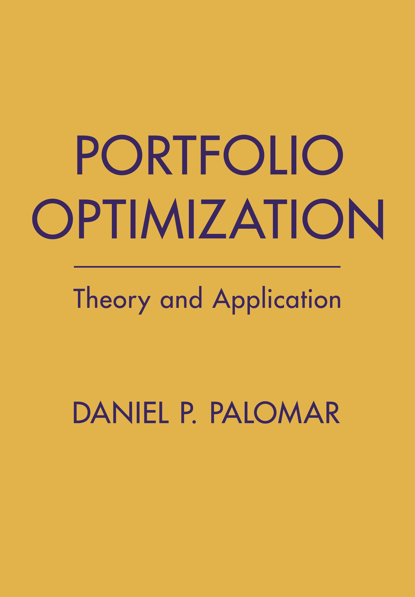

<table class="imgtable"><tr>
<td>&nbsp;</td>
<td align="left">
Portfolio Optimization: Theory and Application 
<a href="https://www.danielppalomar.com/">Daniel P. Palomar</a>   
Cambridge University Press, 2025.

</td></tr></table>

 

Book available here: [<i class="fas fa-file-pdf"></i> pdf](portfolio-optimization-book.pdf) and [<i class="fas fa-globe"></i> online html](https://bookdown.org/palomar/portfoliooptimizationbook)

For purchase here: 
[<i class="fas fa-book"></i> Cambridge University Press](https://www.cambridge.org/hk/universitypress/subjects/mathematics/mathematical-finance/portfolio-optimization-theory-and-application?format=HB&isbn=9781009428088), 
[<i class="fab fa-amazon"></i> Amazon](https://a.co/d/9XLMjSw), 
[<i class="fas fa-store"></i> Barnes & Noble](https://www.barnesandnoble.com/w/portfolio-optimization-daniel-p-palomar/1146540789?ean=9781009428088), 
[<i class="fas fa-shopping-bag"></i> Bookshop.org](https://uk.bookshop.org/p/books/portfolio-optimization-theory-and-application-daniel-p-palomar/7796814), 
[<i class="fas fa-shopping-cart"></i> Hive](https://www.hive.co.uk/Product/Daniel-P-Hong-Kong-University-of-Science-and-Technology-Palomar/Portfolio-Optimization--Theory-and-Application/31283293), 
[<i class="fas fa-book-open"></i> Indigo](https://www.indigo.ca/en-ca/portfolio-optimization-theory-and-application/9781009428088.html), 
[<i class="fas fa-bookmark"></i> Hatchards](https://www.hatchards.co.uk/book/portfolio-optimization/daniel-p-palomar/9781009428088), 
[<i class="fas fa-book-reader"></i> Hugendubel](https://www.hugendubel.de/de/buch_gebunden/daniel_p_palomar-portfolio_optimization-49457055-produkt-details.html)

This is the [<i class="fas fa-home"></i> homepage](https://portfoliooptimizationbook.com) for the [<i class="fas fa-chart-line"></i> Portfolio Optimization Book](https://bookdown.org/palomar/portfoliooptimizationbook). It contains slides, code examples (R and Python), exercises with solutions, and data.

To contribute, check the [<i class="fab fa-github"></i> developer GitHub webpage](https://github.com/portfoliooptimizationbook).

## Chapters
Work in progress... exercises with solutions coming up in the subsequent weeks and slides will be significantly revised next semester.

- Chapter 1 -- Introduction:
  [<i class="fas fa-file-pdf"></i> slides](slides/slides-intro.pdf)

### Part I -- Financial Data
- Chapter 2 -- Financial Data: Stylized Facts:
  [<i class="fas fa-file-pdf"></i> slides](slides/slides-stylized-facts.pdf), 
  [<i class="fab fa-r-project"></i> R code](R-code/R-stylized-facts.html),
  [<i class="fab fa-python"></i> Python code](python-code/python-stylized-facts.html),
  [<i class="fas fa-pencil-alt"></i> exercises](exercises/exc-stylized-facts.pdf), 
  [<i class="fas fa-lightbulb"></i> solutions](exercises/excsol-stylized-facts.pdf)

- Chapter 3 -- Financial Data: I.I.D. Modeling:
  [<i class="fas fa-file-pdf"></i> slides](slides/slides-data-iid.pdf),
  [<i class="fab fa-r-project"></i> R code](R-code/R-data-iid.html),
  [<i class="fab fa-python"></i> Python code](python-code/python-data-iid.html),
  [<i class="fas fa-pencil-alt"></i> exercises](exercises/exc-data-iid.pdf)

- Chapter 4 -- Financial Data: Time Series Modeling:
  [<i class="fas fa-file-pdf"></i> slides](slides/slides-data-time-series.pdf),
  [<i class="fab fa-r-project"></i> R code](R-code/R-data-time-series.html),
  [<i class="fab fa-python"></i> Python code](python-code/python-data-time-series.html),
  [<i class="fas fa-pencil-alt"></i> exercises](exercises/exc-data-time-series.pdf)

- Chapter 5 -- Financial Data: Graphs:
  [<i class="fas fa-file-pdf"></i> slides](slides/slides-data-graphs.pdf),
  [<i class="fab fa-r-project"></i> R code](R-code/R-data-graphs.html),
  [<i class="fas fa-pencil-alt"></i> exercises](exercises/exc-data-graphs.pdf)

### Part II -- Portfolio Optimization
- Chapter 6 -- Portfolio Basics: 
  [<i class="fas fa-file-pdf"></i> slides](slides/slides-portfolio-basics.pdf),
  [<i class="fab fa-r-project"></i> R code](R-code/R-portfolio-basics.html),
  [<i class="fab fa-python"></i> Python code](python-code/python-portfolio-basics.html),
  [<i class="fas fa-pencil-alt"></i> exercises](exercises/exc-portfolio-basics.pdf)

- Chapter 7 -- Modern Portfolio Theory: 
  [<i class="fas fa-file-pdf"></i> slides](slides/slides-modern-portfolio-theory.pdf),
  [<i class="fab fa-r-project"></i> R code](R-code/R-modern-portfolio-theory.html),
  [<i class="fab fa-python"></i> Python code](python-code/python-modern-portfolio-theory.html),
  [<i class="fas fa-pencil-alt"></i> exercises](exercises/exc-modern-portfolio-theory.pdf)

- Chapter 8 -- Portfolio Backtesting: 
  [<i class="fas fa-file-pdf"></i> slides](slides/slides-backtesting.pdf),
  [<i class="fab fa-r-project"></i> R code](R-code/R-backtesting.html),
  [<i class="fab fa-python"></i> Python code](python-code/python-backtesting.html),
  [<i class="fas fa-pencil-alt"></i> exercises](exercises/exc-backtesting.pdf)

- Chapter 9 -- High-Order Portfolios:
  [<i class="fas fa-file-pdf"></i> slides](slides/slides-high-order-portfolios.pdf),
  [<i class="fab fa-r-project"></i> R code](R-code/R-high-order-portfolios.html),
  [<i class="fas fa-pencil-alt"></i> exercises](exercises/exc-high-order-portfolios.pdf)

- Chapter 10 -- Portfolios with Alternative Risk Measures:
  [<i class="fas fa-file-pdf"></i> slides](slides/slides-alt-risk-portfolios.pdf),
  [<i class="fab fa-r-project"></i> R code](R-code/R-alt-risk-portfolios.html),
  [<i class="fab fa-python"></i> Python code](python-code/python-alt-risk-portfolios.html),
  [<i class="fas fa-pencil-alt"></i> exercises](exercises/exc-alt-risk-portfolios.pdf)

- Chapter 11 -- Risk Parity Portfolios:
  [<i class="fas fa-file-pdf"></i> slides](slides/slides-rpp.pdf),
  [<i class="fab fa-r-project"></i> R code](R-code/R-rpp.html),
  [<i class="fab fa-python"></i> Python code](python-code/python-rpp.html),
  [<i class="fas fa-pencil-alt"></i> exercises](exercises/exc-rpp.pdf), 
  [<i class="fas fa-lightbulb"></i> solutions](exercises/excsol-rpp.pdf)

- Chapter 12 -- Graph-Based Portfolios:
  [<i class="fas fa-file-pdf"></i> slides](slides/slides-graph-portfolios.pdf),
  [<i class="fab fa-r-project"></i> R code](R-code/R-graph-portfolios.html),
  [<i class="fas fa-pencil-alt"></i> exercises](exercises/exc-graph-portfolios.pdf)

- Chapter 13 -- Index Tracking Portfolios:
  [<i class="fas fa-file-pdf"></i> slides](slides/slides-index-tracking.pdf),
  [<i class="fab fa-r-project"></i> R code](R-code/R-index-tracking.html),
  [<i class="fab fa-python"></i> Python code](python-code/python-index-tracking.html),
  [<i class="fas fa-pencil-alt"></i> exercises](exercises/exc-index-tracking.pdf)

- Chapter 14 -- Robust Portfolios:
  [<i class="fas fa-file-pdf"></i> slides](slides/slides-robust-portfolios.pdf),
  [<i class="fab fa-r-project"></i> R code](R-code/R-robust-portfolios.html),
  [<i class="fas fa-pencil-alt"></i> exercises](exercises/exc-robust-portfolios.pdf)

- Chapter 15 -- Pairs Trading Portfolios:
  [<i class="fas fa-file-pdf"></i> slides](slides/slides-pairs-trading.pdf),
  [<i class="fab fa-r-project"></i> R code](R-code/R-pairs-trading.html),
  [<i class="fas fa-pencil-alt"></i> exercises](exercises/exc-pairs-trading.pdf)

- Chapter 16 -- Deep Learning Portfolios:
  [<i class="fas fa-file-pdf"></i> slides](slides/slides-deep-portfolios.pdf),
  [<i class="fas fa-pencil-alt"></i> exercises](exercises/exc-deep-portfolios.pdf)

### Appendices
- Appendix A -- Convex Optimization Theory:
  [<i class="fas fa-file-pdf"></i> slides](slides/slides-convex-optimization-theory.pdf),
  [<i class="fas fa-pencil-alt"></i> exercises](exercises/exc-convex-optimization-theory.pdf), 
  [<i class="fas fa-lightbulb"></i> solutions](exercises/excsol-convex-optimization-theory.pdf)

- Appendix B -- Optimization Algorithms:
  [<i class="fas fa-file-pdf"></i> slides](slides/slides-optimization-algorithms.pdf), 
  [<i class="fab fa-r-project"></i> R code](R-code/R-optimization-algorithms.html),
  [<i class="fas fa-pencil-alt"></i> exercises](exercises/exc-optimization-algorithms.pdf)

### Miscellanea

- [<i class="fas fa-file-pdf"></i> Sample slide title page](slides/sample-slides-title-page.pdf) with customizable course info on a textbox.

- Stock and crypto data used in the sample code can be conveniently found at https://github.com/dppalomar/pob

- Resources for R: [<i class="fab fa-r-project"></i> Primer on R for Finance](R-code/R-primer.html), [<i class="fab fa-r-project"></i> Solvers in R](python-code/R-solvers.html)

- Resources for Python: [<i class="fab fa-python"></i> Primer on Python for Finance](python-code/python-primer.html), [<i class="fab fa-python"></i> Solvers in Python](python-code/python-solvers.html)

## Contact Information

<link rel="stylesheet" href="https://use.fontawesome.com/releases/v5.15.4/css/all.css">

<i class="fas fa-user-tie"></i> Prof. Daniel P. Palomar: [Website](https://www.danielppalomar.com)

<i class="fas fa-envelope"></i> [palomar@ust.hk](mailto:palomar@ust.hk)

<i class="fab fa-github"></i> GitHub: https://github.com/dppalomar

<i class="fab fa-linkedin"></i> LinkedIn: https://www.linkedin.com/in/daniel-palomar-8373a1b7

<i class="fab fa-youtube"></i> YouTube: https://www.youtube.com/danielpalomar

<i class="fab fa-twitter"></i> X: https://x.com/danielppalomar

<i class="fas fa-graduation-cap"></i> Google Scholar: https://scholar.google.com/danielpalomar

